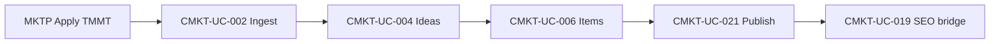

# RNOSAI BA — Content Marketing OS Use Cases (ContentMarketingModule)

## Document control

| Thuộc tính | Giá trị |
| --- | --- |
| Document ID | RNOSAI-BA-CMKT-UC |
| Phiên bản | 1.0 |
| Ngày xuất | 2026-08-09 |
| Module | MOD-CONTENT-MARKETING |
| Nest module | `ContentMarketingModule` |
| Số UC | 46 |
| Spec thủ công | 46/46 (P0–P2 + Video OS V1–V3) |
| Master index | [RNOSAI-BA-Master-Spec.md](../RNOSAI-BA-Master-Spec.md) |
| Design spec | [`2026-08-09-content-marketing-os-design.md`](../superpowers/specs/2026-08-09-content-marketing-os-design.md) |
| UX/UI spec | [`2026-08-09-content-marketing-integration-spec.md`](../specs/2026-08-09-content-marketing-integration-spec.md) |
| Catalog | [`11-CONTENT-MARKETING.md`](../use-cases/11-CONTENT-MARKETING.md) |
| Actions | [`11-CMKT-ACTIONS.md`](../use-cases/actions/11-CMKT-ACTIONS.md) |

---

## 1. Tóm tắt module

Module **Content Marketing OS** (EXECUTE) nhúng tab **`content-os`** trên **Triển khai dịch vụ** — vận hành sản xuất nội dung đa kênh từ snapshot Planner: idea bank → draft AI → duyệt Leader/QA → media AI → lịch → publish. Tách khỏi **AI Marketing Planner** (PLAN).

### 1.1. Màn hình liên quan

| SCR | Tên | Route | Phase | UC |
| --- | --- | --- | --- | --- |
| SCR-CMKT-001 | Content Board | `?tab=content-os` | P0 | 001 |
| SCR-CMKT-001a | Overview | `&view=overview` | P0 | 001 |
| SCR-CMKT-001b | Idea bank | `&view=ideas` | P0 | 004, 005 |
| SCR-CMKT-001c | Calendar | `&view=calendar` | P0 | 011 |
| SCR-CMKT-001d | Kanban | `&view=board` | P0 | 012 |
| SCR-CMKT-002 | Item drawer | `&view=item&id=` | P0 | 006…010 |
| SCR-CMKT-007 | Review queue | `&view=review` | P0 | 014, §22 |
| SCR-CMKT-008 | Media AI Studio | drawer tab | P1 | 035, 037 |
| SCR-CMKT-009 | Production | drawer tab | P1 | 031…034 |
| SCR-CMKT-005 | Intelligence | `&view=intelligence` | P1 | 023 |
| SCR-CMKT-004 | Repurpose wizard | `&view=repurpose` | P1 | 018 |
| SCR-CMKT-010 | Snapshot banner | top | P0 | 002 |

### 1.2. Ma trận UC

| ID | Tên | Priority | Phase | Status | Parent |
| --- | --- | --- | --- | --- | --- |
| CMKT-UC-001 | Mở Content Board context | P0 | P0 | Spec ready | SVC-UC-003 |
| CMKT-UC-002 | Ingest Planner snapshot | P0 | P0 | Spec ready | MKTP-UC-008 |
| CMKT-UC-003 | Quản lý content pillars | P1 | P0 | Spec ready | MKTP-UC-003 |
| CMKT-UC-004 | Idea bank CRUD | P0 | P0 | Spec ready | — |
| CMKT-UC-005 | AI 30 ideas | P1 | P1 | Spec ready | PRD |
| CMKT-UC-006 | Tạo content item | P0 | P0 | Spec ready | — |
| CMKT-UC-007 | AI generate draft | P0 | P0 | Spec ready | PRD |
| CMKT-UC-008 | Variants ≥3 | P1 | P0 | Spec ready | MKTP-UC-030 |
| CMKT-UC-009 | Chỉnh tone/length | P0 | P0 | Spec ready | — |
| CMKT-UC-010 | Regenerate/rewrite | P0 | P0 | Spec ready | — |
| CMKT-UC-011 | Calendar CRUD | P0 | P0 | Spec ready | PRD |
| CMKT-UC-012 | Kanban workflow | P0 | P0 | Spec ready | PRD |
| CMKT-UC-013 | Assign SP/QA | P0 | P0 | Spec ready | — |
| CMKT-UC-014 | Approve/reject nội bộ | P0 | P0 | Spec ready | §22 |
| CMKT-UC-015 | Client approval gate | P2 | P1 | Spec ready | tiep-thi-noi-dung |
| CMKT-UC-016 | Comments | P1 | P0 | Spec ready | — |
| CMKT-UC-017 | Version history | P1 | P0 | Spec ready | — |
| CMKT-UC-018 | Repurpose | P1 | P1 | Spec ready | PRD |
| CMKT-UC-019 | Bridge SEO | P1 | P1 | Spec ready | SEO-UC-005 |
| CMKT-UC-020 | Bridge Email | P2 | P1 | Spec ready | EM-UC-006 |
| CMKT-UC-021 | Mark published | P0 | P0 | Spec ready | — |
| CMKT-UC-022 | Manual metrics | P1 | P1 | Spec ready | — |
| CMKT-UC-023 | Intelligence summary | P1 | P1 | Spec ready | PRD |
| CMKT-UC-024 | Suggest next topics | P2 | P2 | Spec ready | — |
| CMKT-UC-025 | Drift alert | P2 | P2 | Spec ready | — |
| CMKT-UC-026 | Weekly memo | P2 | P2 | Spec ready | MKTP-UC-028 |
| CMKT-UC-027 | Export brief PDF | P2 | P1 | Spec ready | — |
| CMKT-UC-028 | Audit log | P0 | P0 | Spec ready | BR-AI-06 |
| CMKT-UC-029 | AI fallback | P0 | P0 | Spec ready | — |
| CMKT-UC-030 | Portal summary | P2 | P2 | Backlog | MKTP-UC-023 |
| CMKT-UC-031 | Assign design/video | P1 | P1 | Spec ready | §23 |
| CMKT-UC-032 | Export design brief | P1 | P1 | Spec ready | §23 |
| CMKT-UC-033 | Production phase | P1 | P1 | Spec ready | §23 |
| CMKT-UC-034 | Link Creatives | P1 | P1 | Spec ready | — |
| CMKT-UC-035 | AI image/carousel | P1 | P1 | Spec ready | §24 |
| CMKT-UC-036 | AI short video (umbrella) | P2 | P2 | Spec ready | §24 + Video OS 2026-08-20 |
| CMKT-UC-037 | Visual QA + approve | P1 | P1 | Spec ready | §24 |
| CMKT-UC-038 | Escalate human polish | P1 | P1 | Spec ready | §23–24 |
| CMKT-UC-039 | Video storyboard (beats + TTS + clip) | P2 | V1 | Spec ready | Video OS |
| CMKT-UC-040 | Sửa storyboard / upload B-roll | P2 | V1 | Spec ready | Video OS |
| CMKT-UC-041 | Render master MP4 (FFmpeg) | P2 | V1 | Spec ready | Video OS |
| CMKT-UC-042 | Transcode channel pack | P2 | V1 | Spec ready | Video OS |
| CMKT-UC-043 | Video QA score | P2 | V1 | Spec ready | Video OS |
| CMKT-UC-044 | Clean render gỡ DRAFT | P2 | V1 | Spec ready | Video OS |
| CMKT-UC-045 | Beat restock + music ducking | P3 | V2 | Spec ready | Video OS |
| CMKT-UC-046 | Generative B-roll / avatar / long-form | P3 | V3 | Backlog | Video Social |
| CMKT-UC-047 | Chọn studio Social vs SOP | P2 | Dual | Spec ready | Dual Studio |
| CMKT-UC-048 | Clone item sang studio kia | P2 | Dual | Spec ready | Dual Studio |
| CMKT-UC-049 | SOP G1 director + Gate 1 | P2 | Cine A | Spec ready | Dual Studio |
| CMKT-UC-050 | SOP G2 keyframe + Gate 2 | P2 | Cine B | Spec ready | Dual Studio |
| CMKT-UC-051 | SOP G3 motion + Gate 3 | P2 | Cine C | Spec ready | Dual Studio |
| CMKT-UC-052 | SOP G4 compose + Gate 4 | P2 | Cine D | Spec ready | Dual Studio |
| CMKT-UC-053 | Escalate master 4K | P3 | Cine D | Spec ready | Dual Studio |

---

## 2. Chi tiết Use Case — P0

### CMKT-UC-001 — Mở Content Board context

> 🟢 Spec thủ công

- **Actor chính:** SP Content, Lead SP, QA, AM
- **Màn hình:** SCR-CMKT-001, SCR-CMKT-001a
- **Mục tiêu:** Load context lifecycle + snapshot + KPI counts
- **Trigger:** Tab Content Board
- **Pre-condition:** Flags on; cap view; slug `tiep-thi-noi-dung` (pilot)
- **Post-condition:** UI ready; `view=overview` default
- **API:** `GET .../content-marketing/context`
- **Trace:** EC-CMKT-01, EC-CMKT-UX-01

#### Luồng chính

| Bước | Mô tả |
| --- | --- |
| 1 | User mở service-delivery detail |
| 2 | Click tab **Content Board** |
| 3 | FE verify flag + cap |
| 4 | API trả snapshot summary, counts, channel_defaults |
| 5 | Snapshot banner SCR-CMKT-010 render |
| 6 | Overview KPI strip hiển thị |

#### Ngoại lệ

| ID | Điều kiện | Xử lý |
| --- | --- | --- |
| E1 | Chưa có snapshot | Banner CTA Import Planner |
| E2 | Slug không pilot | Tab ẩn |

---

### CMKT-UC-002 — Ingest Planner snapshot

> 🟢 Spec thủ công · **Critical path**

- **Actor chính:** Lead SP
- **Màn hình:** SCR-CMKT-010, SCR-CMKT-001b
- **Mục tiêu:** Copy pillars + calendar từ TMMT applied → ideas/pillars
- **Trigger:** Import từ Planner
- **Pre-condition:** MKTP Apply đã chạy; marketing_plan_id tồn tại
- **Post-condition:** `cmkt_plan_snapshots` + ideas
- **API:** `POST .../plan-snapshot/ingest`

#### Luồng chính

| Bước | Mô tả |
| --- | --- |
| 1 | User bấm Import |
| 2 | Chọn merge/replace + toggles calendar/pillars |
| 3 | API map §12.7 Planner → channel/format |
| 4 | Hiển thị warnings skipped rows |
| 5 | Navigate ideas view |

#### Business rules

- Unknown Planner channel → warning, không create item
- Sealed snapshot → re-ingest cần admin confirm

---

### CMKT-UC-004 — Idea bank

- **Actor:** SP, Lead
- **Màn hình:** SCR-CMKT-001b
- **API:** `GET/POST/PATCH .../ideas`
- **Luồng:** CRUD idea; filter pillar/status; convert → UC-006

---

### CMKT-UC-006 — Tạo content item

> 🟢 Critical path

- **Actor:** SP
- **Màn hình:** SCR-CMKT-011, SCR-CMKT-002
- **API:** `POST .../items`
- **Validation:** §12 channel/format matrix
- **Post-condition:** Item status `draft`

---

### CMKT-UC-007 — AI generate draft

- **Actor:** SP
- **Cap:** `crm_content.generate`
- **API:** `POST .../items/:id/jobs/draft`
- **Job type:** `draft_generate`
- **Output:** `body_json.markdown`, optional outline
- **Trace:** BR-AI-06, EC-CMKT-02

---

### CMKT-UC-008 — Variants headline/hook/CTA

- **API:** `POST .../items/:id/jobs/variants`
- **Output:** `body_json.variants[]` length ≥3
- **UI:** ContentOsVariantsPicker

---

### CMKT-UC-011 — Content calendar

- **Actor:** SP, Lead
- **Màn hình:** SCR-CMKT-001c
- **API:** `GET/PUT/DELETE .../calendar/*`
- **UX:** Drag-drop `scheduled_at`; color by pillar

---

### CMKT-UC-012 — Kanban workflow

- **Màn hình:** SCR-CMKT-001d
- **Columns:** §8.3 status machine
- **Note:** Status change via workflow API, not silent drag P0

---

### CMKT-UC-013 — Assign SP / QA

- **Actor:** Lead
- **API:** `PATCH .../items/:id` assignee fields
- **UI:** Dropdowns in drawer header

---

### CMKT-UC-014 — Internal approve / reject

> 🟢 Critical path · See §22

- **Actor:** QA, Lead SP
- **Màn hình:** SCR-CMKT-007, drawer workflow
- **API:** submit-review, approve, reject
- **BR-CMKT-03:** reject comment required

---

### CMKT-UC-016 — Comments

- **API:** `GET/POST .../items/:id/comments`
- **visibility:** internal (default); client P1 optional

---

### CMKT-UC-017 — Version history

- **API:** `GET .../items/:id/versions`
- **UI:** Diff v(n) vs v(n-1)

---

### CMKT-UC-021 — Mark published

- **Actor:** SP
- **API:** `POST .../publish`
- **Input:** published_url optional
- **BR-CMKT-01:** must approved_internal

---

### CMKT-UC-028 — Audit log

- **API:** `GET .../items/:id/audit`
- **Data:** ai_run_id, actor, workflow events

---

### CMKT-UC-029 — Fallback template

- **Trigger:** job failed or low confidence
- **Behavior:** rule-based body + banner "AI fallback"

---

## 3. Chi tiết Use Case — P1 (tóm tắt)

### CMKT-UC-018 — Repurpose

Master blog approved → wizard → derived items với `parent_item_id`. Mỗi derived **duyệt riêng**.

### CMKT-UC-019 — Bridge SEO

`website`+`blog` → `POST .../bridge/seo` → chip SEO status → `/seo/content/[id]`.

### CMKT-UC-020 — Bridge Email

`newsletter`/`drip`+`email` → draft EM campaign.

### CMKT-UC-031…034 — Production §23

`production_json`, assign designer/video, export PDF, link Creatives.

### CMKT-UC-035, 037, 038 — AI Media §24

Image gen, visual QA, visual approve, escalate human.

**Walkthrough chi tiết:** [`11-CMKT-ACTIONS.md`](../use-cases/actions/11-CMKT-ACTIONS.md)

---

## 4. Chi tiết Use Case — P2 (tóm tắt)

| UC | Mô tả |
|----|--------|
| CMKT-UC-024 | AI suggest topics từ metrics |
| CMKT-UC-025 | Drift vs pillars banner |
| CMKT-UC-026 | Weekly memo cron |
| CMKT-UC-030 | Portal read-only summary |
| CMKT-UC-036 | AI video ≤60s |

---

## 5. Liên kết SVC / MKTP

---

## 6. Acceptance checklist BA

- [ ] Mọi P0 UC có actor, pre/post, API
- [ ] Actions file có walkthrough ≥18 bước P0
- [ ] UX spec SCR map 1:1 màn hình
- [ ] BR-CMKT trace trong UC liên quan
