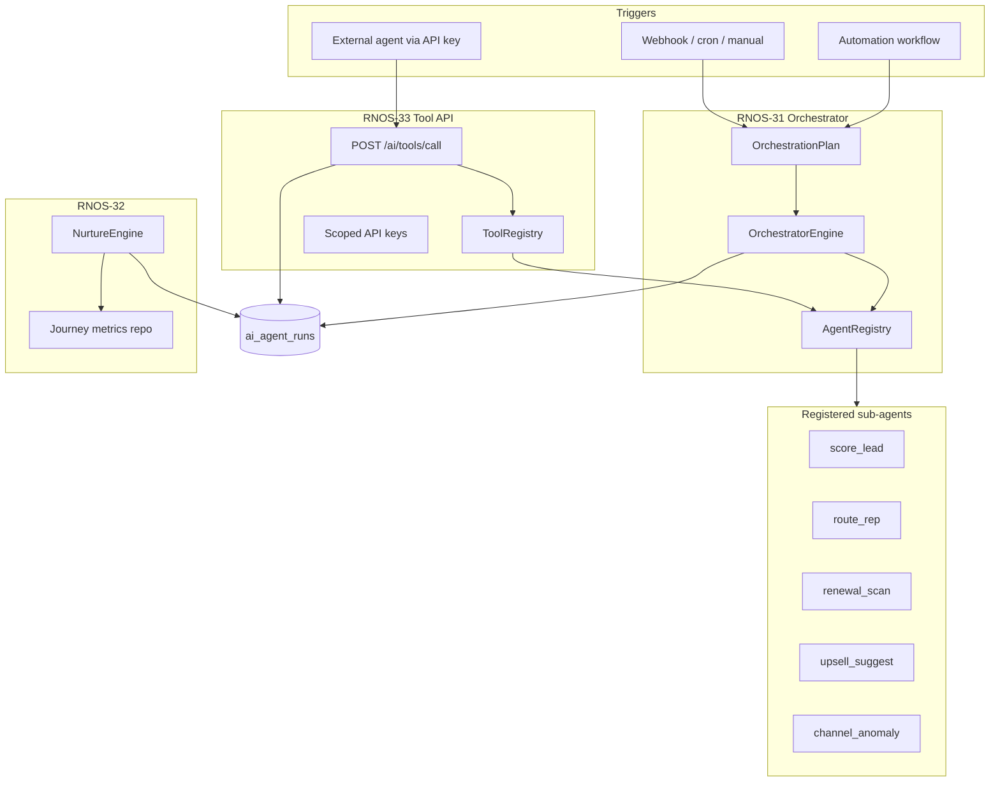

# R4 — RNOS-31 / 32 / 33 Implementation Plan

> **For agentic workers:** REQUIRED SUB-SKILL: Use superpowers:subagent-driven-development (recommended) or superpowers:executing-plans to implement this plan task-by-task. Steps use checkbox (`- [ ]`) syntax for tracking.

**Goal:** Hoàn thiện wave R4 của Revenue OS AI — multi-agent orchestrator có governance, MCP-style tool API cho agent bên ngoài, và nurture optimization read-only — đáp ứng §19 R4 gate và UI-R4-03.

**Architecture:** Mở rộng module `ai-intelligence` hiện có: thêm `orchestrator/` (plan graph + parent/child `ai_agent_runs`), `ai-tools/` (tool registry + scoped API keys + `/api/v1/ai/tools/*`), `nurture/` (rules engine trên Email OS journey metrics). Không tạo microservice mới; tái sử dụng `AiAuditService`, RBAC caps, và pattern gate/E2E từ RNOS-20/26/27/28.

**Tech Stack:** NestJS (`ptt-crm-api`), PostgreSQL (`ai_agent_runs` migration ext), Next.js ops-web, Playwright E2E, bash gate scripts, Python artifact tests.

## Global Constraints

- **BR-AI-01:** Không auto-send / auto-mutate production CRM ngoài rule đã duyệt; nurture và budget rec = read-only recommendation.
- **BR-AI-02:** Confidence banner khi confidence < 0.6 trên UI recommendation.
- **Audit:** 100% AI/tool calls ghi `ai_agent_runs` (spec §19.1 #4).
- **PII:** Không log prompt/body/email/phone trong prod (`AiAuditService` redact).
- **Feature flags:** Mỗi sprint có env flag riêng trong `deploy/env.staging-phase3.example`.
- **Branch pattern:** `feat/rnos-XX-*` → gate PASS → merge `main`.
- **Không entity SQLite mới** — PG only (theo hướng RNOS-25+).

---

## 0. Tổng quan R4 & phụ thuộc

### 0.1 Backlog mapping

| Sprint | Tên | Priority | Spec ref | UI target |
|--------|-----|----------|----------|-----------|
| **RNOS-31** | Multi-agent orchestrator | P2 | §23.6, §7.2 Agent orchestration | **UI-R4-03** `/admin/ai/agents` |
| **RNOS-33** | MCP-style tool exposure | P3 | §23.6 MCP Tool API | Admin tool registry + external API |
| **RNOS-32** | Autonomous nurture optimization (read-only) | P3 | §23.5 Email ↔ Pipeline | `/email/journeys/[id]` panel |

### 0.2 Đã ship (prerequisite)

| RNOS | Capability | Dùng cho R4 |
|------|------------|-------------|
| RNOS-05 | `ai_agent_runs` + audit wrap | Parent/child runs (31) |
| RNOS-13–15 | Workflow AI nodes + simulate | Orchestrator delegate target (31) |
| RNOS-20 | Renewal Agent | Sub-agent trong registry (31) |
| RNOS-26 | Lead Routing Agent | Sub-agent (31) |
| RNOS-27 | Upsell Agent | Sub-agent (31) |
| RNOS-28 | Channel anomaly digest | Sub-agent + AI-UC-019 steps 1–5 ✓ |
| RNOS-21 | Coach digest | Optional sub-agent (31) |
| Email OS | Journeys, segments, Temporal | Input metrics cho RNOS-32 |
| `/admin/ai/runs` | AdminAiRunsPanel | Base UI → extend trace tree (31) |

### 0.3 Chưa ship (ngoài scope 31–33, ghi chú)

| Item | Ghi chú |
|------|---------|
| **UI-R4-02** Budget recommend read-only | Phase 4 §23.5 — **không có RNOS ID**; đề xuất RNOS-34b hoặc stretch sau RNOS-33 |
| AI-UC-019 step 6 | Budget card trên Meta hub — phụ thuộc UI-R4-02 |
| §19.4 Wave R4 formal criteria | Chưa có section riêng trong spec — plan định nghĩa gate dưới §5 |

### 0.4 Thứ tự sprint đề xuất

```text
Sprint 7: RNOS-31 (Orchestrator + trace UI)     ← nền tảng
Sprint 8: RNOS-33 (MCP tool API)                ← expose sub-agents as tools
Sprint 9: RNOS-32 (Nurture read-only rec)       ← domain Email OS, độc lập
```

**Lý do:** Orchestrator cần parent/child run model trước; MCP tools wrap các handler orchestrator đã registry; nurture không block 31/33.

### 0.5 Kiến trúc mục tiêu



---

## 1. RNOS-31 — Multi-agent Orchestrator

**Branch:** `feat/rnos-31-orchestrator`  
**Flag:** `PTT_AI_ORCHESTRATOR_ENABLED=1`  
**Gate:** `scripts/rnos31_orchestrator_gate.sh`

### 1.1 Schema & migration

**Files:**
- Create: `docs/specs/2026-07-27-postgresql-ddl-rnos31-orchestrator.sql`
- Modify: migration runner / `schema_migrations` version `2026-07-27-rnos31-orchestrator`

**DDL (PostgreSQL):**

```sql
-- ai_agent_runs extensions
ALTER TABLE ai_agent_runs
  ADD COLUMN IF NOT EXISTS parent_run_id UUID REFERENCES ai_agent_runs(id),
  ADD COLUMN IF NOT EXISTS orchestration_id UUID,
  ADD COLUMN IF NOT EXISTS step_key VARCHAR(64),
  ADD COLUMN IF NOT EXISTS step_index INT;

CREATE INDEX IF NOT EXISTS idx_ai_agent_runs_parent ON ai_agent_runs(parent_run_id);
CREATE INDEX IF NOT EXISTS idx_ai_agent_runs_orch ON ai_agent_runs(orchestration_id);

-- Top-level orchestration metadata
CREATE TABLE IF NOT EXISTS ai_orchestrations (
  id UUID PRIMARY KEY DEFAULT gen_random_uuid(),
  client_id UUID,
  trigger_type VARCHAR(32) NOT NULL,  -- manual | cron | webhook | workflow
  trigger_ref VARCHAR(128),
  plan_key VARCHAR(64) NOT NULL,      -- e.g. lead_intake_v1
  status VARCHAR(16) NOT NULL DEFAULT 'running',
  input_json JSONB NOT NULL DEFAULT '{}',
  output_json JSONB NOT NULL DEFAULT '{}',
  correlation_id VARCHAR(64),
  actor_id VARCHAR(64),
  started_at TIMESTAMPTZ NOT NULL DEFAULT NOW(),
  ended_at TIMESTAMPTZ,
  created_at TIMESTAMPTZ NOT NULL DEFAULT NOW()
);

CREATE INDEX IF NOT EXISTS idx_ai_orchestrations_client ON ai_orchestrations(client_id, started_at DESC);
```

### Task 1.1: Migration + repository

**Files:**
- Create: `services/ptt-crm-api/src/ai-intelligence/orchestrator/orchestrator.types.ts`
- Create: `services/ptt-crm-api/src/ai-intelligence/orchestrator/orchestrator.repository.ts`
- Modify: `services/ptt-crm-api/src/ai-intelligence/ai-agent-runs.repository.ts`
- Modify: `services/ptt-crm-api/src/ai-intelligence/ai-intelligence.types.ts`

**Interfaces:**
- Produces: `OrchestratorRepository.create()`, `insertChildRun({ parentRunId, orchestrationId, stepKey, stepIndex, ... })`, `listChildren(parentRunId)`, `getOrchestration(id)`

- [ ] **Step 1:** Thêm columns vào `AiAgentRunInsert` / `AiAgentRunRecord`: `parent_run_id`, `orchestration_id`, `step_key`, `step_index`
- [ ] **Step 2:** Implement `OrchestratorRepository` CRUD cho `ai_orchestrations`
- [ ] **Step 3:** Extend `insertRun` SQL với optional parent/orchestration fields
- [ ] **Step 4:** Integration spec `orchestrator.repository.integration.spec.ts` — insert parent + 2 children, list tree
- [ ] **Step 5:** Commit `feat(rnos-31): orchestrator schema and repository`

### Task 1.2: Agent registry

**Files:**
- Create: `services/ptt-crm-api/src/ai-intelligence/orchestrator/agent.registry.ts`
- Create: `services/ptt-crm-api/src/ai-intelligence/orchestrator/plans/lead-intake.plan.ts`
- Create: `services/ptt-crm-api/src/ai-intelligence/orchestrator/plans/retain-health.plan.ts`

**Registered agents (v1 — delegate to existing services):**

| step_key | agent_name | use_case | Service method |
|----------|------------|----------|----------------|
| `score_lead` | `lead-qualification` | `score_lead` | existing lead scoring |
| `route_rep` | `lead-routing` | `route_rep` | `LeadRoutingAgentService` |
| `renewal_scan` | `renewal` | `renewal_scan` | `RenewalAgentService` |
| `upsell_suggest` | `upsell` | `upsell_suggest` | `UpsellAgentService` |
| `channel_anomaly` | `channel-anomaly` | `channel_anomaly_digest` | `AnomalyDigestService` |

**Plan definitions (static v1):**

```typescript
// lead-intake.plan.ts
export const LEAD_INTAKE_PLAN = {
  key: 'lead_intake_v1',
  steps: [
    { key: 'score_lead', required: true },
    { key: 'route_rep', required: false, when: (ctx) => ctx.leadScore >= 40 },
  ],
} as const;
```

- [ ] **Step 1:** `AgentRegistry` map step_key → async handler `(ctx, auditCtx) => StepResult`
- [ ] **Step 2:** Wire 5 handlers vào existing services (inject, không duplicate logic)
- [ ] **Step 3:** Unit spec `agent.registry.spec.ts` — unknown step throws `VALIDATION_ERROR`
- [ ] **Step 4:** Commit `feat(rnos-31): agent registry and static plans`

### Task 1.3: Orchestrator engine + service

**Files:**
- Create: `services/ptt-crm-api/src/ai-intelligence/orchestrator/orchestrator.engine.ts`
- Create: `services/ptt-crm-api/src/ai-intelligence/orchestrator/orchestrator.service.ts`
- Create: `services/ptt-crm-api/src/ai-intelligence/orchestrator/orchestrator.service.spec.ts`
- Modify: `services/ptt-crm-api/src/ai-intelligence/ai-intelligence.module.ts`

**Behavior:**
1. `POST /api/v1/ai/orchestrator/run` — body: `{ planKey, clientId?, input: { entityType, entityId, ... } }`
2. Tạo `ai_orchestrations` row + parent `ai_agent_runs` (agent_name=`orchestrator`, use_case=`ORCHESTRATION_RUN`)
3. Với mỗi step: child run, gọi registry handler qua `AiAuditService.wrap`
4. Step fail optional → log + continue; required fail → orchestration `failed`
5. Không parallel v1 (sequential only) — đơn giản audit tree

**New audit constants** (`ai-audit.constants.ts`):

```typescript
ORCHESTRATION_RUN: 'orchestration_run',
ORCHESTRATION_STEP: 'orchestration_step',
```

- [ ] **Step 1:** Implement `OrchestratorEngine.runPlan(plan, ctx)` sequential executor
- [ ] **Step 2:** `OrchestratorService.run()` — guard flag + RBAC cap `ai.orchestrator.run`
- [ ] **Step 3:** `GET /api/v1/ai/orchestrator/:id` — orchestration + nested runs
- [ ] **Step 4:** `GET /api/v1/ai/orchestrator` — list paginated (admin)
- [ ] **Step 5:** Unit tests: happy path 2 steps, required step fail aborts
- [ ] **Step 6:** Commit `feat(rnos-31): orchestrator engine and API`

### Task 1.4: Cron trigger (optional v1)

**Files:**
- Create: `services/ptt-crm-api/src/ai-intelligence/orchestrator/orchestrator-cron.service.ts`

- [ ] **Step 1:** Daily job `retain_health_v1` cho clients có active contracts (reuse renewal scan pattern)
- [ ] **Step 2:** Guard `PTT_AI_ORCHESTRATOR_CRON_ENABLED=1` (default off)
- [ ] **Step 3:** Commit `feat(rnos-31): orchestrator cron retain-health`

### Task 1.5: Frontend — UI-R4-03 Multi-agent trace viewer

**Files:**
- Create: `services/ops-web/src/app/admin/ai/agents/page.tsx`
- Create: `services/ops-web/src/components/ai/OrchestrationTracePanel.tsx`
- Create: `services/ops-web/src/components/ai/AgentRunTree.tsx`
- Modify: `services/ops-web/src/lib/ai-api.ts`
- Modify: `services/ops-web/src/components/OpsNav.tsx` (link Admin → AI Agents)
- Modify: existing `/admin/ai/runs/page.tsx` — link "View orchestration" when `orchestration_id` present

**UI requirements (SPEC_UI §7.5 UI-R4-03):**
- List orchestrations: plan, trigger, status, duration, client
- Detail: tree view parent → children với step_key, use_case, latency, status chip
- Expand child → input/output JSON (redacted fields masked)
- Filter: date range, plan_key, status
- Cap guard: `ai.admin` or `ai.orchestrator.view`

**ai-api.ts additions:**

```typescript
export async function fetchOrchestrations(params: OrchestrationListQuery): Promise<...>
export async function fetchOrchestrationById(id: string): Promise<OrchestrationDetail>
export async function postOrchestratorRun(body: OrchestratorRunBody): Promise<...>
```

- [ ] **Step 1:** API client helpers + types
- [ ] **Step 2:** `OrchestrationTracePanel` + `AgentRunTree` components
- [ ] **Step 3:** `/admin/ai/agents` page with list + detail split pane
- [ ] **Step 4:** OpsNav entry under Admin → AI
- [ ] **Step 5:** Commit `feat(rnos-31): orchestration trace UI`

### Task 1.6: QA — RNOS-31

**Files:**
- Create: `scripts/rnos31_orchestrator_gate.sh`
- Create: `scripts/playwright_ops_orchestrator_e2e.sh`
- Create: `services/ops-web/e2e/orchestrator-rnos31.spec.ts`
- Create: `tests/test_rnos31_orchestrator.py`
- Modify: `deploy/env.staging-phase3.example`
- Modify: `docs/use-cases/actions/09-AI-ACTIONS.md` — new **AI-UC-021 Multi-agent orchestration trace (R4)**

**AI-UC-021 action table (draft):**

| # | Actor | Màn hình | Thao tác | Gate |
|---|-------|----------|----------|------|
| 1 | Admin | API / workflow | Trigger `lead_intake_v1` | ✓ RNOS-31 |
| 2 | System | — | Parent + child `ai_agent_runs` | ✓ audit |
| 3 | Admin | `/admin/ai/agents` | Xem trace tree | ✓ UI-R4-03 |
| 4 | Admin | Same | Drill child step output | ✓ |
| 5 | QA | Verify | Required step fail → orch failed | ✓ |
| 6 | QA | Verify | No auto CRM mutate beyond sub-agent rules | ✓ BR-AI-01 |

**Gate checks (≥20 assertions, mirror RNOS-27 pattern):**
- Artifacts present (engine, service, registry, UI, E2E)
- Audit constants `ORCHESTRATION_*`
- Env flag documented
- Unit + tsc + Python + Playwright PASS

- [ ] **Step 1:** Gate script
- [ ] **Step 2:** Playwright: login admin → `/admin/ai/agents` → trigger run via API fixture → tree visible
- [ ] **Step 3:** Python artifact test imports plan keys
- [ ] **Step 4:** Update action doc + gate R4 section in `09-AI-ACTIONS.md`
- [ ] **Step 5:** Run gate → 0 fail → commit `test(rnos-31): gate and UAT actions`

---

## 2. RNOS-33 — MCP-style Tool Exposure

**Branch:** `feat/rnos-33-ai-tools`  
**Flag:** `PTT_AI_TOOLS_API_ENABLED=1`  
**Gate:** `scripts/rnos33_ai_tools_gate.sh`

### 2.1 Design principles

- **MCP-compatible shape**, không bắt buộc chạy MCP protocol server — REST JSON đủ cho external agents (Cursor, custom bots).
- **Tool = thin wrapper** quanh AgentRegistry handlers + một số read-only CRM queries.
- **Governance:** API key scoped by `client_id` + tool allowlist; mọi call → `ai_agent_runs` (agent_name=`ai-tool-proxy`, use_case=`TOOL_CALL`).

### Task 2.1: Schema — tool keys & registry metadata

**Files:**
- Create: `docs/specs/2026-07-27-postgresql-ddl-rnos33-ai-tools.sql`

```sql
CREATE TABLE IF NOT EXISTS ai_tool_api_keys (
  id UUID PRIMARY KEY DEFAULT gen_random_uuid(),
  name VARCHAR(128) NOT NULL,
  key_prefix VARCHAR(12) NOT NULL,
  key_hash VARCHAR(64) NOT NULL,
  client_id UUID,
  allowed_tools JSONB NOT NULL DEFAULT '[]',
  rate_limit_per_min INT NOT NULL DEFAULT 60,
  is_active BOOLEAN NOT NULL DEFAULT true,
  created_by VARCHAR(64),
  created_at TIMESTAMPTZ NOT NULL DEFAULT NOW(),
  revoked_at TIMESTAMPTZ
);

CREATE TABLE IF NOT EXISTS ai_tool_call_log (
  id UUID PRIMARY KEY DEFAULT gen_random_uuid(),
  api_key_id UUID REFERENCES ai_tool_api_keys(id),
  tool_name VARCHAR(64) NOT NULL,
  input_json JSONB NOT NULL DEFAULT '{}',
  output_json JSONB NOT NULL DEFAULT '{}',
  status VARCHAR(16) NOT NULL,
  latency_ms INT,
  agent_run_id UUID,
  created_at TIMESTAMPTZ NOT NULL DEFAULT NOW()
);
```

- [ ] **Step 1:** DDL doc + migration version `2026-07-27-rnos33-ai-tools`
- [ ] **Step 2:** `AiToolKeysRepository` — create (return plaintext key once), revoke, validate
- [ ] **Step 3:** Commit `feat(rnos-33): ai tool api keys schema`

### Task 2.2: Tool registry (MCP schema)

**Files:**
- Create: `services/ptt-crm-api/src/ai-intelligence/ai-tools/tool.registry.ts`
- Create: `services/ptt-crm-api/src/ai-intelligence/ai-tools/tools/score-lead.tool.ts`
- Create: `services/ptt-crm-api/src/ai-intelligence/ai-tools/tools/list-leads.tool.ts`
- Create: `services/ptt-crm-api/src/ai-intelligence/ai-tools/tools/get-forecast.tool.ts`
- Create: `services/ptt-crm-api/src/ai-intelligence/ai-tools/tools/trigger-orchestration.tool.ts`

**v1 curated tools (10 max):**

| tool_name | Mutating | Maps to |
|-----------|----------|---------|
| `score_lead` | Yes (score) | Lead scoring service |
| `route_lead` | Yes (recommendation) | Lead routing |
| `list_leads` | No | Leads repo filtered |
| `get_lead` | No | Lead by id |
| `get_forecast_snapshot` | No | Forecast latest |
| `suggest_upsell` | No (rec row) | Upsell engine |
| `get_anomaly_digest` | No | Anomaly digest |
| `run_orchestration` | Yes | OrchestratorService |
| `list_orchestrations` | No | Orchestrator list |
| `health_check` | No | Ping |

**Tool descriptor shape:**

```typescript
export interface AiToolDescriptor {
  name: string;
  description: string;
  inputSchema: Record<string, unknown>; // JSON Schema
  outputSchema?: Record<string, unknown>;
  mutating: boolean;
  requiredCaps: string[];
}
```

- [ ] **Step 1:** Implement 10 tool handlers delegating to existing services
- [ ] **Step 2:** `ToolRegistry.list()` returns MCP-compatible descriptors
- [ ] **Step 3:** `ToolRegistry.call(name, input, ctx)` — scope check + audit
- [ ] **Step 4:** Unit spec: disallowed tool for key → 403
- [ ] **Step 5:** Commit `feat(rnos-33): tool registry and handlers`

### Task 2.3: API + auth guard

**Files:**
- Create: `services/ptt-crm-api/src/ai-intelligence/ai-tools/ai-tools.controller.ts`
- Create: `services/ptt-crm-api/src/ai-intelligence/ai-tools/ai-tools.service.ts`
- Create: `services/ptt-crm-api/src/ai-intelligence/ai-tools/ai-tool-api-key.guard.ts`
- Modify: `services/ptt-crm-api/src/ai-intelligence/ai-intelligence.module.ts`

**Endpoints:**

| Method | Path | Auth | Purpose |
|--------|------|------|---------|
| GET | `/api/v1/ai/tools` | Staff JWT + cap | List tools (internal admin) |
| POST | `/api/v1/ai/tools/call` | API key **or** staff JWT | Execute tool |
| POST | `/api/v1/admin/ai/tool-keys` | Admin cap | Create key |
| GET | `/api/v1/admin/ai/tool-keys` | Admin cap | List keys (prefix only) |
| DELETE | `/api/v1/admin/ai/tool-keys/:id` | Admin cap | Revoke |

**API key header:** `X-AI-Tool-Key: ptt_ai_...`

**Audit constant:** `TOOL_CALL: 'tool_call'`

- [ ] **Step 1:** `AiToolApiKeyGuard` — hash compare, rate limit via Redis/memory
- [ ] **Step 2:** Controller + service wiring
- [ ] **Step 3:** Integration test: create key → call `health_check` → run row exists
- [ ] **Step 4:** Commit `feat(rnos-33): tool API and key guard`

### Task 2.4: Admin UI — tool keys management

**Files:**
- Create: `services/ops-web/src/app/admin/ai/tools/page.tsx`
- Create: `services/ops-web/src/components/ai/AiToolKeysPanel.tsx`
- Modify: `services/ops-web/src/lib/ai-api.ts`

- [ ] **Step 1:** List keys, create modal (show plaintext once), revoke button
- [ ] **Step 2:** Tool catalog read-only table (name, mutating, caps)
- [ ] **Step 3:** OpsNav: Admin → AI → Tools
- [ ] **Step 4:** Commit `feat(rnos-33): admin tool keys UI`

### Task 2.5: QA — RNOS-33

**Files:**
- Create: `scripts/rnos33_ai_tools_gate.sh`
- Create: `tests/test_rnos33_ai_tools.py`
- Create: `services/ops-web/e2e/ai-tools-rnos33.spec.ts`
- Modify: `docs/use-cases/actions/09-AI-ACTIONS.md` — **AI-UC-022 External agent tool call (R4)**

**Acceptance:**
- [ ] External agent có thể `GET` tool list + `POST` call với scoped key
- [ ] Tool ngoài allowlist → 403
- [ ] 100% calls có `ai_agent_runs` + `ai_tool_call_log`
- [ ] Revoked key → 401
- [ ] Không expose PII trong tool output default schema

- [ ] Gate script ≥18 checks PASS
- [ ] Commit `test(rnos-33): gate and UAT actions`

---

## 3. RNOS-32 — Nurture Optimization (Read-only)

**Branch:** `feat/rnos-32-nurture-opt`  
**Flag:** `PTT_AI_NURTURE_OPT_ENABLED=1`  
**Gate:** `scripts/rnos32_nurture_opt_gate.sh`

### 3.1 Scope (YAGNI v1)

**In scope:**
- Analyze journey performance: open rate, click rate, unsub rate, lead/opportunity conversion (nếu UTM/journey tag có)
- Recommendations: timing (send hour), subject line variants (text only), segment tightening, pause underperforming step
- **Read-only** — AM/ marketer applies manually (BR-AI-01)

**Out of scope v1:**
- Auto A/B send
- Auto segment mutation
- LLM-generated full email body send

### Task 3.1: Metrics repository

**Files:**
- Create: `services/ptt-crm-api/src/ai-intelligence/nurture/nurture-metrics.repository.ts`
- Create: `services/ptt-crm-api/src/ai-intelligence/nurture/nurture.types.ts`

**Data sources (existing Email OS tables):**
- `email.journeys`, journey steps
- Campaign send stats / engagement events
- Optional join: leads with `source` or UTM matching journey

- [ ] **Step 1:** `getJourneyMetrics(journeyId, windowDays)` → `{ steps[], totals, benchmarks }`
- [ ] **Step 2:** Integration spec with fixture data
- [ ] **Step 3:** Commit `feat(rnos-32): nurture metrics repository`

### Task 3.2: Rules engine

**Files:**
- Create: `services/ptt-crm-api/src/ai-intelligence/nurture/nurture.engine.ts`
- Create: `services/ptt-crm-api/src/ai-intelligence/nurture/nurture.engine.spec.ts`
- Create: `services/ptt-crm-api/src/ai-intelligence/nurture/nurture-opt.service.ts`

**Rules (deterministic v1, no LLM required):**

| Rule ID | Condition | Recommendation |
|---------|-----------|----------------|
| NUR-01 | Step open rate < 15% and sends > 100 | "Thử đổi subject / rút ngắn bước" |
| NUR-02 | Click rate < 2% with open > 20% | "CTA yếu — thử single CTA" |
| NUR-03 | Unsub spike > 2× baseline | "Review frequency / pause step" |
| NUR-04 | Step delay < 24h between heavy emails | "Tăng khoảng cách ≥48h" |
| NUR-05 | Journey leads conv < segment benchmark | "Thu hẹp entry segment" |

**Optional LLM narrative:** wrap với `AiAuditService` use_case `NURTURE_OPTIMIZE` — template prompt aggregate metrics only (no PII).

- [ ] **Step 1:** `computeNurtureRecommendations(metrics)` → `NurtureRecommendation[]`
- [ ] **Step 2:** Persist to `ai_recommendations` (reuse RNOS-29 table) type `NURTURE_OPT`
- [ ] **Step 3:** API: `POST /api/v1/ai/nurture/analyze`, `GET /api/v1/ai/nurture?journeyId=`
- [ ] **Step 4:** Audit constant `NURTURE_OPTIMIZE`
- [ ] **Step 5:** Commit `feat(rnos-32): nurture optimization engine`

### Task 3.3: Frontend panel

**Files:**
- Create: `services/ops-web/src/components/ai/NurtureOptPanel.tsx`
- Modify: `services/ops-web/src/app/email/journeys/[id]/page.tsx`
- Modify: `services/ops-web/src/lib/ai-api.ts`

**UI:**
- Card list recommendations với severity (info/warn)
- ConfidenceBanner khi rule confidence < 0.6
- ApproveBar chỉ **"Đã xem" / "Bỏ qua"** — không "Áp dụng tự động"
- Link drill → `/email/reports?journeyId=`

- [ ] **Step 1:** `NurtureOptPanel` component
- [ ] **Step 2:** Wire vào journey detail page (tab **AI Gợi ý**)
- [ ] **Step 3:** Commit `feat(rnos-32): nurture opt panel on journey page`

### Task 3.4: QA — RNOS-32

**Files:**
- Create: `scripts/rnos32_nurture_opt_gate.sh`
- Create: `tests/test_rnos32_nurture.py`
- Create: `services/ops-web/e2e/nurture-opt-rnos32.spec.ts`
- Modify: `docs/use-cases/actions/09-AI-ACTIONS.md` — **AI-UC-023 Nurture optimization read-only (R4)**

**Acceptance:**
- [ ] Recommendations generated for journey with mock metrics
- [ ] No journey/campaign auto-modified by API
- [ ] Dismiss tracked in `ai_recommendations`
- [ ] Panel visible on `/email/journeys/[id]`

- [ ] Gate PASS → commit `test(rnos-32): gate and UAT actions`

---

## 4. Wave R4 Gate & UAT (§19 + AI-UC-019)

### 4.1 Formal wave gate (bổ sung §19.4 đề xuất)

| # | Criteria | Method | Sprint |
|---|----------|--------|--------|
| 1 | AI-UC-019 steps 1–5 PASS (anomaly banner) | RNOS-28 gate | ✅ done |
| 2 | Orchestration run tạo parent + ≥1 child run | RNOS-31 E2E | 31 |
| 3 | `/admin/ai/agents` trace tree drill-down | Playwright | 31 |
| 4 | External tool call scoped + audited | RNOS-33 gate | 33 |
| 5 | Nurture rec read-only, no auto-send | RNOS-32 gate | 32 |
| 6 | 100% new AI use cases in audit constants | grep gate | all |
| 7 | No PII in tool/orch logs prod | config review | all |

### 4.2 Master R4 gate script

**File:** `scripts/rnos_r4_wave_gate.sh`

```bash
#!/usr/bin/env bash
# Runs RNOS-28 (already) + 31 + 33 + 32 sub-gates
bash scripts/rnos28_anomaly_digest_gate.sh
bash scripts/rnos31_orchestrator_gate.sh
bash scripts/rnos33_ai_tools_gate.sh
bash scripts/rnos32_nurture_opt_gate.sh
```

### 4.3 Use-case action index update

**Modify:** `docs/use-cases/actions/09-AI-ACTIONS.md` gate table:

| Wave | UC actions bắt buộc UAT |
|------|---------------------------|
| **R4** | 019, **021**, **022**, **023** |

---

## 5. Timeline & effort estimate

| Sprint | RNOS | Effort | Deliverables |
|--------|------|--------|--------------|
| 7 | 31 | ~5–7 ngày dev | Schema, orchestrator, trace UI, gate |
| 8 | 33 | ~4–6 ngày dev | Tool API, keys admin, gate |
| 9 | 32 | ~4–5 ngày dev | Nurture engine, journey panel, gate |
| — | R4 wave | ~1 ngày | Master gate + UAT walkthrough |

**Parallel work:** FE có thể song song BE sau Task 1.3 (API contract frozen).

---

## 6. Rủi ro & quyết định mở

| ID | Quyết định | Options | Đề xuất |
|----|------------|---------|---------|
| D-R4-01 | Orchestrator parallel steps | Sequential v1 / DAG v2 | **Sequential v1** |
| D-R4-02 | MCP protocol | Full MCP server / REST shim | **REST shim** (RNOS-33) |
| D-R4-03 | Nurture LLM narrative | Rules-only / +LLM summary | Rules-only v1; LLM optional flag |
| D-R4-04 | UI-R4-02 Budget rec | Include R4 / defer | **Defer** — tạo RNOS backlog riêng |
| D-R4-05 | Tool mutating scope | score+route only / +orchestration | Allowlist per key; default read-only tools |

---

## 7. Self-review checklist

| Spec requirement | Task coverage |
|------------------|---------------|
| RNOS-31 Multi-agent orchestrator | §1 Tasks 1.1–1.6 |
| RNOS-33 MCP Tool API | §2 Tasks 2.1–2.5 |
| RNOS-32 Nurture read-only | §3 Tasks 3.1–3.4 |
| UI-R4-03 trace viewer | Task 1.5 |
| §19 R4 / AI-UC-019 | §4 (019 partial done) |
| BR-AI-01 no auto-send | All tasks — explicit |
| 100% audit | All services via AiAuditService |
| Agent registry §7.2 | Task 1.2 |

**Placeholder scan:** None — all tasks have concrete files and interfaces.

---

## 8. Execution order summary

```text
RNOS-31: migration → registry → engine → API → UI → gate
RNOS-33: keys schema → tool registry → API → admin UI → gate
RNOS-32: metrics repo → engine → API → journey UI → gate
Final:   rnos_r4_wave_gate.sh + UAT AI-UC-019/021/022/023
```

| Version | Date | Change |
|---------|------|--------|
| 1.0 | 2026-07-27 | Initial R4 plan RNOS-31/32/33 |
