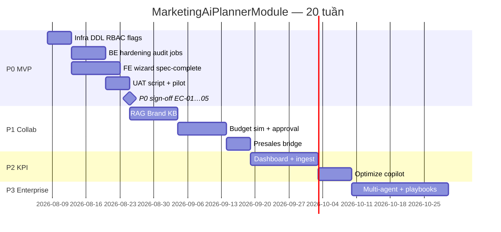

# MarketingAiPlannerModule — Kế hoạch triển khai chi tiết

> **For agentic workers:** REQUIRED SUB-SKILL: Use `superpowers:subagent-driven-development` (recommended) hoặc `superpowers:executing-plans` để thực thi từng workstream. Mỗi workstream có exit criteria và trace UC.

**Goal:** Ship module AI Marketing Planner nhúng vào Triển khai DV — wizard 5 bước, human-in-the-loop Apply TMMT, gate SVC-UC-003 unchanged — theo 4 phase spec (tuần 1–20).

**Architecture:** Nest `MarketingAiPlannerModule` nest dưới `api/crm/service-lifecycle/:id/ai-planner/*`; PG tables `mkt_ai_*` + fallback memory; FE tab `?tab=ai-planner&step=` trên ops-web; orchestrator rule-based stub hoặc LLM qua `AiIntelligenceConfigService`; Apply gọi `ServiceLifecycleService.patchMarketingPlan()` — không thay `validateOfficialTmmt`.

**Tech stack:** NestJS (`ptt-crm-api`), Next.js (`ops-web`), PostgreSQL, env flags, RBAC `crm_mkt_ai.*`, UAT shell script.

## Global Constraints

- **Human-in-the-loop (BR-MKTP-01):** Không ghi TMMT official trước `POST /apply` + confirm.
- **Không auto-advance stage (BR-MKTP-02):** Workflow tab giữ logic cũ.
- **Audit jobs (BR-MKTP-03):** Mọi job → `mkt_ai_jobs`; khuyến nghị mirror `ai_agent_runs`.
- **Stage edit (BR-MKTP-04):** Full edit chỉ `onboard` | `deliver`; sớm hơn read-only/hidden.
- **Quality gate (BR-MKTP-05):** Apply blocked `<60`; export blocked `<60` hoặc thiếu cap export.
- **Retry giữ draft (BR-MKTP-06):** Failed job không xóa `mkt_ai_drafts`.
- **TMMT gate unchanged (BR-MKTP-07):** `validateOfficialTmmt` sau apply.
- **Stub fallback (BR-MKTP-08):** No LLM key → rule-based + banner stub trên UI.
- **API route convention:** `api/crm/service-lifecycle` (không `/api/v1/` trên CRM nest).
- **Copy VI:** theo Phụ lục A integration spec.
- **Design tokens:** reuse `.card`, `.btn`, `var(--accent)` — không palette mới.

---

## 1. Trạng thái hiện tại (baseline 2026-08-08)

### 1.1. Đã có

| Layer | Artifact | Ghi chú |
|-------|----------|---------|
| Spec | `docs/specs/2026-08-08-mkt-ai-planner-integration-spec.md` | UX/UI + API + EC |
| BA | `docs/specs/modules/RNOSAI-BA-MKTP-UseCases.md` | 20 UC |
| UC | `docs/use-cases/10-MKT-AI-PLANNER.md` | BR-MKTP-01…10 |
| UAT actions | `docs/use-cases/actions/10-MKTP-ACTIONS.md` | 21 bước walkthrough |
| DDL | `docs/specs/2026-08-08-postgresql-ddl-mkt-ai-planner.sql` | 11 bảng |
| Apply script | `scripts/apply_pg_ddl_mkt_ai_planner.sh` | Chưa chạy staging |
| Prototype | `docs/design/figma-prototypes/mkt-ai-planner-scr-001-prototype.html` | Happy path + failed |
| BE P0 | `services/ptt-crm-api/src/marketing-ai-planner/*` | Controller, guards, service, repo, orchestrator stub |
| FE P0 skeleton | Tab + `MarketingAiPlannerPanel` + `mkt-ai-planner-api.ts` | Wizard cơ bản |
| RBAC catalog | `crm_mkt_ai` section | view, generate, export, approve |
| Config | `PTT_MKT_AI_PLANNER_*` | API flags |

### 1.2. Gap P0 so với spec / UC (cần đóng trước UAT sign-off)

| Gap | UC / EC | Mức độ |
|-----|---------|--------|
| FE flag `NEXT_PUBLIC_MKT_AI_PLANNER` chưa wire | MKTP-UC-001 E1 | Blocker UAT |
| Brief autosave debounce 800ms + scroll-to-error | MKTP-UC-002, EC-MKT-AI-01 | High |
| Strategy/Campaign sections **editable** (PATCH draft) | MKTP-UC-006 | High |
| Apply **modal diff** + checkbox review | MKTP-UC-008 | High |
| Quality thresholds 60–69 vs ≥70 (confirm / DOCX only) | MKTP-UC-007 | Medium |
| Export PDF/DOCX thật (hiện markdown stub) | MKTP-UC-010, EC-MKT-AI-04 | Medium |
| Job UX async poll 2s (hiện sync trong request) | Spec §10 | Medium |
| `ai_agent_runs` audit mirror | BR-MKTP-03 | Medium |
| Port `marketing_campaign_kit.py` → LLM orchestrator | MKTP-UC-003…005 | Medium |
| `run_mkt_ai_planner_uat.sh` | Actions §walkthrough | Blocker UAT |
| Workflow panel link *Mở AI Planner →* | Spec §12.2 | Low |
| Component tách file theo §8 (BriefIntakeForm, …) | Spec §8 | Low |
| Mobile `<768px` read-first banner | UX-MKT-04 | Low |
| Cap-disabled tooltips (VQ-04) | Visual QA | Low |
| Gán cap position SP/AM trên staging | Spec §13 | Blocker pilot |
| DDL apply + PG repo path trên staging | Infra | Blocker prod-like |

**Ước lượng hoàn thiện P0:** ~70% code skeleton, ~40% spec-compliant UX/UAT-ready.

---

## 2. Ma trận traceability (UC → Workstream → Exit)

| UC | Tên | Phase | Workstream | Exit criteria |
|----|-----|-------|------------|---------------|
| MKTP-UC-001 | Context | P0 | WS-FE-01, WS-BE-01 | Tab + banner + context ≤2s |
| MKTP-UC-002 | Brief | P0 | WS-FE-02 | Autosave + validation VI |
| MKTP-UC-003 | Strategy job | P0 | WS-BE-02, WS-FE-03 | 4 core prof filled EC-02 |
| MKTP-UC-004 | Campaign job | P0 | WS-BE-02, WS-FE-04 | ≥1 campaign card |
| MKTP-UC-005 | Content job | P0 | WS-BE-02, WS-FE-05 | Calendar 30d view |
| MKTP-UC-006 | Edit draft | P0 | WS-FE-03…05 | PATCH draft debounce |
| MKTP-UC-007 | Quality | P0 | WS-BE-03, WS-FE-06 | Score card + gates |
| MKTP-UC-008 | Apply TMMT | P0 | WS-BE-04, WS-FE-06 | Gate xanh EC-03 |
| MKTP-UC-009 | Retry | P0 | WS-BE-05, WS-FE-07 | Draft preserved EC-05 |
| MKTP-UC-010 | Export | P0 | WS-BE-06, WS-FE-06 | Real file download EC-04 |
| MKTP-UC-011 | RAG KB | P1 | WS-P1-01 | Citation EC-06 |
| MKTP-UC-012 | Budget sim | P1 | WS-P1-02 | 3 scenarios |
| MKTP-UC-013 | Approval | P1 | WS-P1-03 | Export needs approve |
| MKTP-UC-014 | Versions | P1 | WS-P1-04 | Diff + rollback |
| MKTP-UC-015 | Presales bridge | P1 | WS-P1-05 | R5 → lifecycle prefill |
| MKTP-UC-016 | Dashboard | P2 | WS-P2-01 | <3s EC-07 |
| MKTP-UC-017 | Optimize | P2 | WS-P2-02 | Task lifecycle link |
| MKTP-UC-018 | KPI alert | P2 | WS-P2-03 | Notification deep link |
| MKTP-UC-019 | Multi-agent | P3 | WS-P3-01 | Sub-jobs logged |
| MKTP-UC-020 | Playbooks | P3 | WS-P3-02 | service_slug templates |

---

## 3. Lộ trình theo phase & tuần



| Phase | Tuần | Mục tiêu ship | UC | EC sign-off |
|-------|------|---------------|-----|-------------|
| **P0** | 1–6 | MVP wizard + Apply + export stub→real | 001–010 | EC-01…05 |
| **P1** | 7–10 | RAG, budget, approval, version | 011–015 | EC-06 |
| **P2** | 11–14 | KPI dashboard, optimize, alerts | 016–018 | EC-07 |
| **P3** | 15–20 | Multi-agent, playbooks, governance | 019–020 | SVC-UC-005 link |

---

## 4. Workstream chi tiết — Phase 0 (MVP)

### WS-INFRA-01 — Database & môi trường (Tuần 1, 2 ngày)

**Mục tiêu:** PG tables live trên staging; API dùng PG không fallback memory.

| # | Task | Files / lệnh | Owner | Done when |
|---|------|--------------|-------|-----------|
| 1 | Apply DDL staging | `scripts/apply_pg_ddl_mkt_ai_planner.sh` | DevOps | `SELECT count(*) FROM mkt_ai_briefs` OK |
| 2 | Verify migration row | `schema_migrations` `2026-08-08-mkt-ai-planner` | DevOps | 1 row |
| 3 | Env API staging | `PTT_MKT_AI_PLANNER_ENABLED=1`, `PTT_MKT_AI_PLANNER_SLUGS=meta-lead-gen` | DevOps | GET context 200 |
| 4 | Env FE staging | `NEXT_PUBLIC_MKT_AI_PLANNER=1` | DevOps | Tab visible |
| 5 | Smoke curl context | `GET .../ai-planner/context` + JWT SP | QA | JSON có brief/draft/jobs |

**Rollback:** Drop schema chỉ trên dev; staging dùng migration forward-only.

---

### WS-RBAC-01 — Caps & pilot users (Tuần 1, 1 ngày)

**Mục tiêu:** SP generate, AM view, MKT Lead approve trên staging.

| Position | Caps |
|----------|------|
| Solution Strategist | `crm_board.view/edit`, `crm_mkt_ai.generate`, `crm_mkt_ai.export` |
| Account Manager | `crm_board.view`, `crm_mkt_ai.view` |
| MKT Lead | + `crm_mkt_ai.approve` |

| # | Task | Files |
|---|------|-------|
| 1 | Gán caps qua `/admin/crm/permissions` | UI admin |
| 2 | Document pilot matrix | `docs/runbooks/mkt-ai-planner-delivery-sop.md` (tạo mới) |
| 3 | Seed test lifecycle `#123` onboard + official plan | SQL fixture hoặc manual UAT prep |

---

### WS-BE-01 — Module hardening (Tuần 1–2, 5 ngày)

**Files hiện có:** `services/ptt-crm-api/src/marketing-ai-planner/`

| # | Task | Chi tiết | UC |
|---|------|----------|-----|
| 1 | Integration tests controller | `marketing-ai-planner.controller.spec.ts` — mock service, test guards 403 | 001 |
| 2 | Service tests apply/quality | `marketing-ai-planner.service.spec.ts` — mock lifecycle + repo | 007, 008 |
| 3 | Mirror `ai_agent_runs` | Trong `runJob()` gọi `AiAgentRunsService.logRun()` nếu module có | BR-03 |
| 4 | Async job pattern (optional P0) | Job `pending` → background worker OR keep sync + status `running`/`succeeded` trong 1 request; document choice | 003 |
| 5 | Apply 409 no official plan | Map `NotFoundException` từ marketing plan → 409 + message promote presales | 008 E2 |
| 6 | Export watermark DRAFT | Query param hoặc flag nếu chưa apply | 010 E1 |

**Verify:**

```bash
cd services/ptt-crm-api
npm test -- --testPathPattern=marketing-ai
npm run build
```

---

### WS-BE-02 — Orchestrator LLM + port kit (Tuần 2–3, 5 ngày)

**Mục tiêu:** Thay rule-based stub bằng LLM khi có key; giữ stub fallback.

| # | Task | Files |
|---|------|-------|
| 1 | Đọc `marketing_campaign_kit.py` (PTTCOM) | Source prompts |
| 2 | Prompt templates TS | `marketing-ai-prompts.ts` |
| 3 | `MarketingAiOrchestratorService` gọi `AiLlmClient` | Parse JSON output → draft shape |
| 4 | Unit test stub vs LLM mock | `marketing-ai-orchestrator.spec.ts` |
| 5 | `prompt_version` column jobs | Set `v1-kit-port` |

**Exit:** EC-MKT-AI-02 — 4 core keys `market_context`, `segmentation_icp`, `personas_roles`, `pains_desired_outcomes` non-empty sau strategy job.

---

### WS-BE-06 — Export engine (Tuần 3, 3 ngày)

**Mục tiêu:** PDF/DOCX/XLSX thật thay markdown stub.

| # | Task | Gợi ý lib | Output |
|---|------|-----------|--------|
| 1 | PDF | `pdfkit` hoặc template HTML→PDF | `{brand}-{date}.pdf` |
| 2 | DOCX | `docx` npm | sections strategy + TMMT + campaigns |
| 3 | XLSX | `exceljs` | KPI sheet từ campaigns |
| 4 | Watermark DRAFT nếu chưa apply | Header/footer | BR-010 prep |
| 5 | Audit `mkt_ai_exports` | Already in repo | EC-04 |

---

### WS-FE-01 — Flags & shell (Tuần 1, 1 ngày)

| # | Task | Files |
|---|------|-------|
| 1 | `NEXT_PUBLIC_MKT_AI_PLANNER` check | `page.tsx` — hide tab if off (fail-closed) |
| 2 | Stub mode banner | `MarketingAiPlannerPanel` — `flags.stub_mode` |
| 3 | Stage banner lead/proposal | Read-only message per §12.1 | 
| 4 | Link Workflow → AI Planner | `ServiceDeliveryWorkflowPanel.tsx` |

---

### WS-FE-02 — Brief step spec-complete (Tuần 2, 2 ngày)

**Tách component:** `components/mkt-ai/BriefIntakeForm.tsx`

| # | Requirement | Spec ref |
|---|-------------|----------|
| 1 | Autosave debounce 800ms on blur/change | UC-002 |
| 2 | Inline error VI + scroll to first missing | EC-01 |
| 3 | Info callout prefill sources | Prototype step 1 |
| 4 | Radio objective + VND formatter | Brief schema |
| 5 | Cap read-only disabled + upsell text | §13.3 |

---

### WS-FE-03 — Strategy step editable (Tuần 2–3, 3 ngày)

**Components:** `AiStrategySections.tsx`, reuse `lib/tmmt-labels.ts`

| # | Task |
|---|------|
| 1 | Accordion editable textarea per strategy key + prof key |
| 2 | Debounce PATCH `/draft` 1s |
| 3 | Label *「Đã chỉnh sửa thủ công」* khi dirty |
| 4 | Confirm modal trước **Sinh lại** nếu đã edit |
| 5 | SWOT block read-only từ `swot_json` |

---

### WS-FE-04 — Campaign step (Tuần 3, 2 ngày)

**Component:** `AiCampaignBuilder.tsx`

| # | Task |
|---|------|
| 1 | Card list từ `campaigns_json` |
| 2 | **+ Thêm thủ công** → PATCH draft append campaign |
| 3 | Edit inline budget_pct, channel_mix |
| 4 | Empty state + CTA sinh AI |

---

### WS-FE-05 — Content step (Tuần 3, 2 ngày)

**Component:** `AiContentCalendar.tsx`

| # | Task |
|---|------|
| 1 | Calendar grid 7 cols (prototype) |
| 2 | Sub-tabs Ad copy / Email (table) từ `content_json` |
| 3 | Day drawer edit → PATCH draft asset |
| 4 | Mobile: list view thay grid |

---

### WS-FE-06 — Apply step spec-complete (Tuần 4, 3 ngày)

**Components:** `AiQualityScoreCard.tsx`, `ExportPlanActions.tsx`, Apply modal

| # | Task | UC |
|---|------|-----|
| 1 | Auto-run quality on enter step 5 | 007 |
| 2 | Score card 6 criteria checklist | 007 |
| 3 | Apply disabled `<60`; 60–69 confirm extra; ≥70 normal | BR-05 |
| 4 | Modal diff official vs draft (WinDiffChip pattern) | 008 |
| 5 | Checkbox *「Tôi đã review nội dung AI」* required | 008 |
| 6 | Export buttons cap-gated; 60–69 DOCX only | 007, 010 |
| 7 | Post-apply refresh gate banner + toast | EC-03 |

---

### WS-FE-07 — Job panel & retry (Tuần 4, 1 ngày)

**Component:** `AiJobProgressPanel.tsx` (extend)

| # | Task | Spec §10 |
|---|------|----------|
| 1 | Poll `GET context` every 2s while any job `pending/running` | Poll |
| 2 | Icons/colors per state table | UX |
| 3 | Failed row + **Thử lại** | UC-009 |
| 4 | Responsive: sticky ≥1280px; accordion `<1280px` | §14 |

---

### WS-QA-01 — UAT automation (Tuần 5, 3 ngàn)

**File:** `scripts/run_mkt_ai_planner_uat.sh`

Map 21 bước từ `10-MKTP-ACTIONS.md`:

| Block | Steps | API assertions |
|-------|-------|----------------|
| Auth | 1 | JWT + caps |
| Context | 2–3 | GET context, gate fail |
| Brief | 4–6 | PATCH brief ok |
| Strategy | 7–9 | POST strategy, draft prof keys |
| Campaign | 10–11 | POST campaigns |
| Content | 12–13 | POST content |
| Apply | 14–18 | quality, apply, GET marketing-plan ok |
| Export | 19 | POST export 200 + filename |
| Audit | 21 | SQL `mkt_ai_jobs` count ≥4 |

**Branch E1:** Simulate 503 on campaigns → retry → draft strategy unchanged.

**Deliverable:** Exit code 0 on staging; log file `artifacts/mkt-ai-uat-{date}.log`.

---

### WS-DOC-01 — Runbook & handoff (Tuần 5–6, 2 ngày)

| Doc | Path |
|-----|------|
| Delivery SOP | `docs/runbooks/mkt-ai-planner-delivery-sop.md` |
| Update BA status | `RNOSAI-BA-MKTP-UseCases.md` §implementation |
| Pilot checklist | Trong runbook: flags, caps, slug, rollback |

---

### P0 Definition of Done (PO sign-off)

- [ ] EC-MKT-AI-01…05 pass staging UAT (21 bước)
- [ ] VQ-01…10 visual QA checklist §19
- [ ] BR-MKTP-01…08 verified
- [ ] Không regression SVC-UC-003 Workflow gate
- [ ] Solution lead + PO ký trên `10-MKTP-ACTIONS.md` walkthrough

---

## 5. Workstream — Phase 1 (Tuần 7–10)

### WS-P1-01 — Brand KB RAG (MKTP-UC-011)

| Layer | Work |
|-------|------|
| BE | Implement `POST /documents` multipart; chunk worker; FTS on `mkt_ai_document_chunks` |
| BE | Orchestrator retrieval top-k; inject prompts; store citation metadata |
| FE | `AiBrandKbPanel.tsx` sub-tab `?sub=kb`; upload DnD; index status |
| FE | Citation chips `[📎 file p.N]` on strategy sections |
| Flag | `flags.rag_enabled` in context |

**Exit:** EC-MKT-AI-06 — ≥1 citation after indexed doc.

---

### WS-P1-02 — Budget simulator (MKTP-UC-012)

| Layer | Work |
|-------|------|
| BE | `POST /jobs/budget-simulate` → `mkt_ai_budget_scenarios` 2–5 rows |
| FE | `AiBudgetSimulator.tsx` table Conservative/Balanced/Aggressive |
| FE | **Áp dụng scenario** → PATCH draft campaign budget_pct |
| Integrate | Read-only embed Meta WIN-4-C budget card |

---

### WS-P1-03 — Approval workflow (MKTP-UC-013)

| Layer | Work |
|-------|------|
| BE | `GET/POST /approvals`, `/comments`; state machine pending→approved/rejected |
| BE | `mkt_ai_plan_versions` snapshot on submit |
| FE | `AiPlanApprovalBar.tsx` sticky; cap `crm_mkt_ai.approve` |
| FE | Block export until approved when `flags.approval_required` |
| Notify | `staff_notifications` pattern WIN-4-D |

**Rule:** BR-MKTP-09 export needs approve when workflow on.

---

### WS-P1-04 — Version compare (MKTP-UC-014)

| BE | `GET /versions`, `POST /versions/:id/restore` |
| FE | Drawer side-by-side diff TMMT keys (`WinDiffChip`) |
| FE | Rollback → draft only, không auto-apply |

---

### WS-P1-05 — Presales R5 bridge (MKTP-UC-015)

| BE | `POST /api/v1/leads/:id/presales/marketing-plan/ai-draft` |
| FE | `PresalesR5PlanForm.tsx` button **[AI draft]** |
| Flow | Promote contract → clone official → AI Planner prefill |

---

## 6. Workstream — Phase 2 (Tuần 11–14)

### WS-P2-01 — KPI Dashboard (MKTP-UC-016, EC-07)

| BE | `GET /dashboard` — aggregate agency ingest + Meta spend |
| FE | `AiPlannerKpiDashboard.tsx` sub=`dashboard`; tiles + 6-week chart |
| Perf | p95 <3s staging with realistic data volume |
| Stage | Emphasis `deliver` | `retain` |

---

### WS-P2-02 — Optimization copilot (MKTP-UC-017)

| BE | `POST /jobs/optimize` with KPI delta context |
| FE | Copilot card → **Tạo task lifecycle** (human approve) |
| Rule | No auto Meta campaign changes |

---

### WS-P2-03 — KPI drift alerts (MKTP-UC-018)

| Job | Weekly cron / webhook CPL spike |
| Notify | `staff_notifications` → deep link `?tab=ai-planner&sub=dashboard` |

---

## 7. Workstream — Phase 3 (Tuần 15–20)

### WS-P3-01 — Multi-agent (MKTP-UC-019)

| BE | `POST /jobs/multi-agent`; child job refs in `mkt_ai_jobs.input_json` |
| FE | `AiAgentPipelinePicker.tsx` pipeline visual |
| Admin | Link `/admin/ai/agents` config |

---

### WS-P3-02 — Industry playbooks (MKTP-UC-020)

| Data | JSON playbooks per `service_slug` (BĐS, Meta lead-gen, SEO) |
| BE | Prefill brief + prompt templates before LLM |
| Gate | Campaign Quality Score before Launch QA (SVC-UC-005) |

---

## 8. Kiến trúc file (target end-state)

```
services/ptt-crm-api/src/marketing-ai-planner/
├── marketing-ai-planner.module.ts
├── marketing-ai-planner.controller.ts
├── marketing-ai-planner.service.ts
├── marketing-ai-planner.repository.ts
├── marketing-ai-orchestrator.service.ts
├── marketing-ai-prompts.ts              # P0 WS-BE-02
├── marketing-ai-export.service.ts       # P0 WS-BE-06
├── marketing-ai-rag.service.ts          # P1
├── marketing-ai-brief.util.ts
├── marketing-ai-quality.util.ts
├── marketing-ai-planner.types.ts
├── guards/staff-marketing-ai-planner.guard.ts
└── *.spec.ts

services/ops-web/src/
├── lib/mkt-ai-planner-api.ts
├── lib/tmmt-labels.ts
├── components/mkt-ai/
│   ├── MarketingAiPlannerPanel.tsx
│   ├── BriefIntakeForm.tsx              # P0 split
│   ├── AiStrategySections.tsx
│   ├── AiCampaignBuilder.tsx
│   ├── AiContentCalendar.tsx
│   ├── AiJobProgressPanel.tsx
│   ├── AiTmmtGateBanner.tsx
│   ├── AiQualityScoreCard.tsx
│   ├── ExportPlanActions.tsx
│   ├── AiBrandKbPanel.tsx               # P1
│   ├── AiBudgetSimulator.tsx            # P1
│   ├── AiPlanApprovalBar.tsx            # P1
│   └── AiPlannerKpiDashboard.tsx        # P2
└── app/crm/service-delivery/[id]/page.tsx

docs/
├── specs/2026-08-08-mkt-ai-planner-integration-spec.md
├── runbooks/mkt-ai-planner-delivery-sop.md  # P0 create
scripts/
├── apply_pg_ddl_mkt_ai_planner.sh
└── run_mkt_ai_planner_uat.sh                # P0 create
```

---

## 9. Chiến lược test

| Level | Scope | Tool |
|-------|-------|------|
| Unit BE | brief, quality, orchestrator, service | Jest |
| Unit FE | form validation, cap helpers | Jest/Vitest nếu có |
| API integration | controller + guards + memory repo | Supertest |
| E2E manual | 21-step walkthrough | `10-MKTP-ACTIONS.md` |
| E2E auto | Happy path + retry branch | `run_mkt_ai_planner_uat.sh` |
| Regression | SVC Workflow gate unchanged | Existing SVC UAT |
| Perf | GET context p95 ≤2s | staging k6 optional |
| Visual | VQ-01…10 | Design QA checklist |

---

## 10. Rollout & pilot

| Giai đoạn | Audience | Flags | Rollback |
|-----------|----------|-------|----------|
| Dev | Engineers | ON all slugs | Disable env |
| Staging UAT | SP + QA | `meta-lead-gen` only | Flag off |
| Pilot prod | 1–2 clients | Slug whitelist | Flag off + tab hidden |
| GA | All marketing slugs | Remove slug whitelist | Feature flag kill switch |

**Monitoring:**

- Error rate `mkt_ai_job_failed` by job_type
- Latency p95 strategy job
- Apply success → gate pass ratio (target ≥70% UX-MKT-02)
- Export count audit `mkt_ai_exports`

---

## 11. Rủi ro & giảm thiểu

| Rủi ro | Impact | Mitigation |
|--------|--------|------------|
| DDL chưa apply prod | Data loss / memory fallback | WS-INFRA-01 blocker; health check table exists |
| LLM cost/latency | UX timeout | Stub fallback; async jobs Phase 0.5 |
| Quality score quá strict | Apply blocked | Tune weights; PO review sample n≥10 |
| TMMT gate fail sau apply | User frustration | Diff modal + link TMMT tab; partial apply docs |
| Cap misconfiguration | Support tickets | Runbook + admin preset permission set |
| Export PDF lib weight | Deploy size | Lazy import export service |

---

## 12. Thứ tự thực thi đề xuất (4 sprint P0)

| Sprint | Focus | Deliverables |
|--------|-------|--------------|
| **S1** (W1–2) | Infra + RBAC + FE flags + BE tests | DDL live, tab gated, unit tests green |
| **S2** (W2–3) | Orchestrator LLM + editable draft FE | EC-02 strategy; UC-006 PATCH draft |
| **S3** (W3–4) | Apply modal + quality + export real | EC-03, EC-04; UC-007, 008 |
| **S4** (W5–6) | UAT script + polish + pilot | 21-step pass; runbook; PO sign-off |

---

## 13. Self-review — spec coverage

| Spec section | Covered in plan |
|--------------|-----------------|
| §6 Wireframes P0 | WS-FE-02…06 |
| §7 Phase 2–4 | §5–7 workstreams |
| §8 Component map | §8 file tree |
| §9 Field mapping | WS-BE-02 prompts |
| §10 Job UX | WS-FE-07 |
| §11 Quality/export | WS-FE-06, WS-BE-06 |
| §12 TMMT integration | WS-FE-01, WS-FE-06 |
| §13 RBAC/flags | WS-RBAC-01, WS-FE-01 |
| §14 Responsive | WS-FE-07 |
| §17 EC-MKT-AI | P0 DoD |
| §18 Roadmap | §3 Gantt |
| §19 Visual QA | P0 DoD checklist |

**Gaps noted:** Runbook file chưa tồn tại → WS-DOC-01. UAT script chưa tồn tại → WS-QA-01.

---

## 14. Liên kết tài liệu

| Tài liệu | Path |
|----------|------|
| Integration + UX/UI | [`docs/specs/2026-08-08-mkt-ai-planner-integration-spec.md`](../../specs/2026-08-08-mkt-ai-planner-integration-spec.md) |
| Use cases | [`docs/use-cases/10-MKT-AI-PLANNER.md`](../../use-cases/10-MKT-AI-PLANNER.md) |
| UAT actions | [`docs/use-cases/actions/10-MKTP-ACTIONS.md`](../../use-cases/actions/10-MKTP-ACTIONS.md) |
| BA module | [`docs/specs/modules/RNOSAI-BA-MKTP-UseCases.md`](../../specs/modules/RNOSAI-BA-MKTP-UseCases.md) |
| DDL | [`docs/specs/2026-08-08-postgresql-ddl-mkt-ai-planner.sql`](../../specs/2026-08-08-postgresql-ddl-mkt-ai-planner.sql) |
| Prototype | [`docs/design/figma-prototypes/mkt-ai-planner-scr-001-prototype.html`](../../design/figma-prototypes/mkt-ai-planner-scr-001-prototype.html) |

---

*Plan v1.0 — 2026-08-08. Cập nhật trạng thái sprint trong BA module khi mỗi workstream đóng.*
