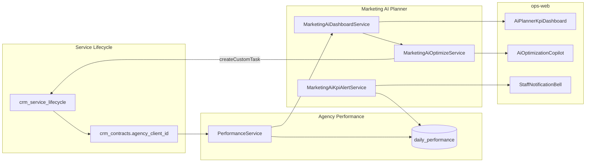

# MKT-AI Planner Phase 2 — Kế hoạch triển khai chi tiết

> **For agentic workers:** REQUIRED SUB-SKILL: Use `superpowers:subagent-driven-development` (recommended) hoặc `superpowers:executing-plans` để thực thi từng workstream. Mỗi WS có exit criteria và trace UC.

**Goal:** Ship Phase 2 MKT-AI Planner — KPI dashboard lifecycle, optimization copilot, KPI drift alerts — cho stage `deliver|retain`, đạt EC-MKT-AI-07 trên staging.

**Architecture:** Nest `MarketingAiPlannerModule` mở rộng 2 endpoint đã stub (`GET dashboard`, `POST jobs/optimize`) + cron alert service; aggregate KPI từ `PerformanceService` / bảng `daily_performance` qua `crm_contracts.agency_client_id`; FE thêm sub-tab `?tab=ai-planner&step=dashboard&sub=dashboard` với tiles + chart 6 tuần + copilot card; alerts qua `staff_notifications` deep link.

**Tech stack:** NestJS (`ptt-crm-api`), Next.js (`ops-web`), PostgreSQL (`daily_performance`, `mkt_ai_jobs`), `PerformanceModule`, `StaffNotificationsModule`, env flags, RBAC `crm_mkt_ai.*`.

## Global Constraints

- **Human-in-the-loop (BR-MKTP-01):** Copilot **không** auto-change Meta/Google campaigns; chỉ đề xuất + tạo task lifecycle.
- **Không auto-advance stage (BR-MKTP-02):** Dashboard/alert không đổi `crm_service_lifecycle.stage`.
- **Audit jobs (BR-MKTP-03):** `POST /jobs/optimize` → row `mkt_ai_jobs` `job_type=optimize`.
- **Stage visibility (BR-MKTP-04):** Dashboard sub-tab chỉ nhấn mạnh khi `stage ∈ {deliver, retain}`; `onboard` vẫn có thể xem read-only nếu có data.
- **Perf (EC-MKT-AI-07):** `GET .../ai-planner/dashboard` p95 **<3s** staging với client có ≥6 tuần `daily_performance`.
- **API route:** `api/crm/service-lifecycle/:id/ai-planner/*` (Nest CRM prefix).
- **Copy VI:** theo Phụ lục A integration spec + labels agency hub hiện có (Spend, CPL, ROAS, Leads).
- **Pilot slug:** `PTT_MKT_AI_PLANNER_SLUGS=meta-lead-gen` cho đến GA.

---

## 0. Phạm vi & định danh Phase

| Tên trong module plan | UC | Trạng thái trước Phase 2 |
|----------------------|-----|---------------------------|
| **Phase 1** WS-P1-01…05 | MKTP-UC-011…015 | ✅ Shipped staging (`rs.pttads.vn`) |
| **Phase 2** WS-P2-01…03 | MKTP-UC-016…018 | ❌ Stub / chưa có FE |
| Phase 3 WS-P3-01…02 | MKTP-UC-019…020 | Out of scope Phase 2 |

> **Lưu ý tài liệu:** `10-MKT-AI-PLANNER.md` gọi UC-011…015 là "Phase 2" cũ; **module plan** coi đó là Phase 1 (đã xong). Kế hoạch này theo **module plan §6**.

**Timeline đề xuất:** Tuần 11–14 (4 sprint × 1 tuần).

---

## 1. Baseline sau Phase 1

### 1.1. Đã có (tái sử dụng)

| Layer | Artifact | Ghi chú |
|-------|----------|---------|
| BE planner | `marketing-ai-planner/*` | Context, jobs, RAG, budget, approval, versions |
| Controller stub | `GET dashboard`, `POST jobs/optimize` | Throw `NotImplementedException` |
| Job type | `optimize` trong `MktAiJobType` | DDL + types OK |
| Performance | `PerformanceService.listForClient()` | `daily_performance`, CPL/ROAS/spend |
| Agency link | `crm_contracts.agency_client_id` | Onboarding brief + lifecycle detail |
| FE panel | `MarketingAiPlannerPanel.tsx` | Sub-tab pattern: `?sub=kb`, `?sub=budget` |
| Notifications | `StaffNotificationsRepository.insert()` | Pattern từ approval WS-P1-03 |
| Lifecycle tasks | `ServiceLifecycleService.createCustomTask()` | Copilot → human task |
| FE agency API | `fetchClientPerformance()` | `/api/v1/clients/:id/performance` |
| Timers VPS | `ptt-meta-insights.timer`, Google timer | Ingest → `daily_performance` |

### 1.2. Gap Phase 2

| Gap | UC / EC | Blocker |
|-----|---------|---------|
| `GET dashboard` implementation | MKTP-UC-016, EC-07 | High |
| `AiPlannerKpiDashboard.tsx` | MKTP-UC-016 | High |
| Sub-tab routing `step=dashboard` | Spec §7.4 | High |
| `POST jobs/optimize` + LLM/stub | MKTP-UC-017 | High |
| `AiOptimizationCopilot.tsx` | MKTP-UC-017 | Medium |
| KPI drift cron + dedupe | MKTP-UC-018 | Medium |
| Alert deep link `?tab=ai-planner&sub=dashboard` | MKTP-UC-018 | Medium |
| UAT actions UC-016…018 | `10-MKTP-ACTIONS.md` | Sign-off |
| Perf smoke p95 <3s | EC-MKT-AI-07 | Staging gate |

---

## 2. Kiến trúc dữ liệu Phase 2



**Resolve client ID (BE):**

1. `lifecycle.detail(id)` → `contract.agency_client_id`
2. Nếu rỗng → dashboard `linked: false`, message VI hướng dẫn gán HĐ
3. Nếu có → `PerformanceService.listForClient(clientId, { from, to, group_by: 'day', channel: 'meta' })`

**Target KPI (so sánh drift):**

- Primary: `target_cpl_vnd` trên row `daily_performance` / hub campaign map
- Fallback: parse CPL target từ `mkt_ai_drafts.campaigns_json[].kpis` hoặc brief `budget_monthly_vnd` heuristic (document trong util)

---

## 3. Workstream WS-P2-01 — KPI Dashboard (MKTP-UC-016)

**Exit:** EC-MKT-AI-07 — tiles Spend MTD, CPL, ROAS, Leads + chart 6 tuần load <3s staging.

### 3.1. API contract

**`GET /api/crm/service-lifecycle/:lifecycleId/ai-planner/dashboard`**

Query (optional): `weeks=6`, `channel=meta|google|all`

Response shape (`MktAiDashboardPayload`):

```typescript
interface MktAiDashboardPayload {
  ok: boolean;
  lifecycle_id: number;
  stage: string;
  agency_client_id: string | null;
  linked: boolean;
  period: { from: string; to: string; weeks: number };
  tiles: {
    spend_mtd_vnd: number;
    leads_mtd: number;
    cpl_mtd: number | null;
    roas_mtd: number | null;
    roas_stub: boolean;
  };
  targets: {
    cpl_vnd: number | null;
    roas: number | null;
    source: 'daily_performance' | 'draft' | 'none';
  };
  trend: Array<{
    week_label: string;       // "Tuần 1" … ISO week start
    spend_vnd: number;
    leads: number;
    cpl: number | null;
    roas: number | null;
  }>;
  deltas: {
    cpl_vs_target_pct: number | null;
    spend_vs_prev_week_pct: number | null;
  };
  flags: { perf_tables_ready: boolean };
  messages: string[];         // VI: "Chưa có daily_performance — chạy sync_meta_insights"
}
```

### 3.2. Files BE

| Action | Path |
|--------|------|
| Create | `marketing-ai-dashboard.util.ts` — aggregate MTD, 6-week buckets, deltas |
| Create | `marketing-ai-dashboard.util.spec.ts` |
| Create | `marketing-ai-dashboard.service.ts` — resolve client, call PerformanceService |
| Create | `marketing-ai-dashboard.service.spec.ts` |
| Modify | `marketing-ai-planner.types.ts` — add dashboard types |
| Modify | `marketing-ai-planner.controller.ts` — wire `dashboard()` |
| Modify | `marketing-ai-planner.service.ts` — delegate or inject dashboard service |
| Modify | `marketing-ai-planner.module.ts` — import `PerformanceModule`, providers |
| Modify | `app-config.service.ts` — optional `PTT_MKT_AI_DASHBOARD_ENABLED` (default ON when planner ON) |

### 3.3. Tasks WS-P2-01 (ước lượng 5 ngày)

| # | Task | Owner | Done when |
|---|------|-------|-----------|
| P2-01-T1 | Util unit tests: empty rows, partial weeks, CPL/ROAS null | BE | Jest green |
| P2-01-T2 | `MarketingAiDashboardService.getDashboard(lifecycleId, opts)` | BE | Mock PerformanceService passes |
| P2-01-T3 | Controller `GET dashboard` + view guard | BE | curl 200 lifecycle #1 |
| P2-01-T4 | Handle `agency_client_id` missing → 200 + `linked:false` | BE | Message VI |
| P2-01-T5 | FE types + `fetchMktAiDashboard()` in `mkt-ai-planner-api.ts` | FE | Typecheck |
| P2-01-T6 | `AiPlannerKpiDashboard.tsx` — 4 tiles + trend table/chart | FE | Visual match §7.4 |
| P2-01-T7 | Wire `MarketingAiPlannerPanel`: step `dashboard`, sub `dashboard` | FE | URL sync |
| P2-01-T8 | Stage gate UI: banner khi `deliver|retain` | FE | Read-only onboard OK |
| P2-01-T9 | Perf script `scripts/smoke_mkt_ai_dashboard.sh` p95 | QA | <3000ms ×5 |
| P2-01-T10 | UAT section MKTP-UC-016 in `10-MKTP-ACTIONS.md` | Doc | 6+ steps |

### 3.4. FE wireframe (spec §7.4)

- Sub-tab **Dashboard** cạnh wizard steps (hoặc step riêng `dashboard` khi stage deliver+)
- Tiles: **Spend MTD | CPL | ROAS | Leads**
- Chart/list: **6 tuần** trend
- Empty state: link `/agency/clients/{id}?tab=performance` + hint sync timer
- Reuse CSS tokens `mkt-ai-planner.module.css`, card pattern từ `AgencyClientDetailContent`

---

## 4. Workstream WS-P2-02 — Optimization Copilot (MKTP-UC-017)

**Exit:** KPI lệch → card đề xuất ≥3 hành động → **Tạo task lifecycle** (custom task) — không API Meta write.

### 4.1. API contract

**`POST /api/crm/service-lifecycle/:lifecycleId/ai-planner/jobs/optimize`**

Body:

```typescript
interface MktAiOptimizeBody {
  channel?: 'meta' | 'google' | 'all';
  confirm_create_tasks?: boolean;  // false = preview only
  dismissed_recommendation_ids?: string[];
}
```

Response:

```typescript
interface MktAiOptimizeResult {
  ok: boolean;
  job_id: number;
  status: 'succeeded' | 'failed';
  kpi_context: { cpl_delta_pct: number | null; spend_mtd_vnd: number; /* … */ };
  recommendations: Array<{
    id: string;
    title: string;
    rationale: string;
    priority: 'high' | 'medium' | 'low';
    suggested_task: { stage: string; title: string; description: string };
  }>;
  tasks_created?: Array<{ task_id: number; title: string }>;
}
```

**Flow:**

1. Load dashboard snapshot (reuse WS-P2-01 service)
2. Build prompt context (KPI delta + draft campaigns + brief)
3. `MarketingAiOrchestratorService` **new method** `generateOptimizeRecommendations()` — stub rule-based nếu no LLM key
4. Persist `mkt_ai_jobs` `job_type=optimize`, `output_json=recommendations`
5. Nếu `confirm_create_tasks=true` → `createCustomTask()` per selected recommendation (cap generate)

### 4.2. Files

| Action | Path |
|--------|------|
| Create | `marketing-ai-optimize.util.ts` — rule-based fallback (CPL +18% → 3 actions) |
| Create | `marketing-ai-optimize.util.spec.ts` |
| Create | `marketing-ai-optimize.service.ts` |
| Modify | `marketing-ai-orchestrator.service.ts` — `generateOptimizeRecommendations()` |
| Modify | `marketing-ai-prompts.ts` — optimize system/user prompt |
| Modify | `marketing-ai-planner.controller.ts` — wire optimize |
| Create | `AiOptimizationCopilot.tsx` |
| Modify | `MarketingAiPlannerPanel.tsx` — embed copilot card under dashboard |
| Modify | `mkt-ai-planner-api.ts` — `postMktAiOptimizeJob()` |

### 4.3. Tasks WS-P2-02 (ước lượng 4 ngày)

| # | Task | Done when |
|---|------|-----------|
| P2-02-T1 | Util: 3 recommendations when `cpl_delta_pct > 15` | Jest |
| P2-02-T2 | Orchestrator stub + LLM JSON schema | Jest orchestrator spec |
| P2-02-T3 | Service: job row + preview mode | Integration mock |
| P2-02-T4 | `confirm_create_tasks` → `createCustomTask` stage `deliver` | Manual UAT |
| P2-02-T5 | FE copilot card + Dismiss + **Tạo task lifecycle** | UI |
| P2-02-T6 | BR-MKTP-01 audit: no Meta campaign API calls | Code review grep |
| P2-02-T7 | UAT MKTP-UC-017 steps in actions doc | Doc |

**Rule-based stub examples (VI):**

- CPL Meta +18% → "Thu hẹp audience lookalike", "Refresh creative 3 variant", "Review landing CVR"
- ROAS stub → disclaimer trong rationale

---

## 5. Workstream WS-P2-03 — KPI Drift Alerts (MKTP-UC-018)

**Exit:** Weekly job phát hiện CPL/ROAS lệch ngưỡng → `staff_notifications` → deep link dashboard.

### 5.1. Thiết kế alert

**Trigger:**

- Cron weekly (CN 08:00 UTC+7) **hoặ** hook sau Meta insights sync (optional phase 2.1)
- Scope: lifecycles `stage IN ('deliver','retain')` + planner enabled slug + có `agency_client_id`

**Ngưỡng mặc định (env override):**

| Env | Default |
|-----|---------|
| `PTT_MKT_AI_KPI_ALERT_CPL_PCT` | `15` |
| `PTT_MKT_AI_KPI_ALERT_ROAS_PCT` | `20` |
| `PTT_MKT_AI_KPI_ALERT_COOLDOWN_DAYS` | `7` |

**Dedupe:** `meta_json.alert_key = mkt_ai_kpi:{lifecycle_id}:{metric}:{week}` — skip nếu đã notify trong cooldown.

**Notification:**

```typescript
{
  kind: 'mkt_ai_kpi_drift',
  title: 'CPL Meta vượt ngưỡng — ABC Logistics',
  body: 'CPL tuần này +22% so target. Mở AI Planner Dashboard.',
  link_href: '/crm/service-delivery/{id}?tab=ai-planner&step=dashboard&sub=dashboard',
  meta_json: { lifecycle_id, metric: 'cpl', delta_pct: 22, agency_client_id }
}
```

**Recipients:** `assigned_am` + presales SP từ lifecycle detail; optional `PTT_MKT_AI_APPROVER_NOTIFY_USER_IDS`.

### 5.2. Files

| Action | Path |
|--------|------|
| Create | `marketing-ai-kpi-alert.service.ts` — scan + notify |
| Create | `marketing-ai-kpi-alert.util.ts` — threshold + dedupe key |
| Create | `marketing-ai-kpi-alert.util.spec.ts` |
| Modify | `marketing-ai-planner.module.ts` — provider + `@nestjs/schedule` if not global |
| Create | `deploy/ptt-mkt-ai-kpi-alert.timer` + install script |
| Modify | `app-config.service.ts` — alert flags |
| Modify | `StaffNotificationBell` deep link handling (if kind filter needed) |

**DDL (optional — có thể MVP không cần bảng mới):**

- MVP: dedupe qua `staff_notifications.meta_json->>'alert_key'`
- P2.1: bảng `mkt_ai_kpi_alert_log` nếu cần audit (migration forward-only)

### 5.3. Tasks WS-P2-03 (ước lượng 3 ngày)

| # | Task | Done when |
|---|------|-----------|
| P2-03-T1 | Util threshold + dedupe unit tests | Jest |
| P2-03-T2 | Alert service scan 1 lifecycle mock | Jest |
| P2-03-T3 | Wire cron / manual `POST .../ai-planner/alerts/run` (internal) | Staging dry-run |
| P2-03-T4 | systemd timer on VPS | `systemctl list-timers` |
| P2-03-T5 | FE bell shows link → dashboard tab | Click UAT |
| P2-03-T6 | UAT MKTP-UC-018 in actions doc | Doc |

---

## 6. Lộ trình 4 tuần

| Tuần | Focus | Deliverables | Exit |
|------|-------|--------------|------|
| **S1 (W11)** | WS-P2-01 BE | Dashboard service + API + unit tests | curl dashboard 200 |
| **S2 (W12)** | WS-P2-01 FE + perf | `AiPlannerKpiDashboard`, EC-07 smoke | p95 <3s |
| **S3 (W13)** | WS-P2-02 | Optimize job + copilot card + tasks | UC-017 UAT |
| **S4 (W14)** | WS-P2-03 + hardening | Alerts cron + docs + regression | UC-018 UAT, Phase 2 sign-off |

**Song song mỗi sprint:**

- Cập nhật `10-MKTP-ACTIONS.md` chi tiết UC-016…018
- Regression: smoke P0 walkthrough + P1 RAG/approval không break
- Deploy staging sau mỗi WS

---

## 7. Chiến lược test

| Level | Scope | Command / tool |
|-------|-------|--------------|
| Unit BE | dashboard util, optimize util, alert util | `npm test -- marketing-ai-dashboard` |
| Unit BE | orchestrator optimize | `marketing-ai-orchestrator.spec.ts` |
| Service | dashboard linked/unlinked client | mock PerformanceService |
| API | controller guards view/generate | supertest hoặc curl + JWT |
| Perf | dashboard p95 | `scripts/smoke_mkt_ai_dashboard.sh` |
| E2E manual | UC-016…018 | staging lifecycle deliver + client có data |
| Regression | SVC workflow gate | existing SVC UAT unchanged |

**Fixture staging UAT:**

- Lifecycle `#1` stage `deliver` (hoặc advance từ onboard UAT)
- Contract có `agency_client_id` trùng client có `daily_performance`
- Chạy `ptt-meta-insights.timer` hoặc backfill 6 tuần nếu thiếu

---

## 8. Env & rollout

| Flag | Mục đích | Staging | Prod pilot |
|------|----------|---------|------------|
| `PTT_MKT_AI_PLANNER_ENABLED=1` | Master | ✅ | ✅ |
| `PTT_MKT_AI_PLANNER_SLUGS=meta-lead-gen` | Pilot slug | ✅ | 1–2 clients |
| `PTT_MKT_AI_DASHBOARD_ENABLED=1` | Kill switch dashboard | ✅ | ✅ |
| `PTT_MKT_AI_OPTIMIZE_ENABLED=1` | Kill switch copilot | ✅ | ✅ |
| `PTT_MKT_AI_KPI_ALERT_ENABLED=1` | Kill switch alerts | ✅ | sau UAT |
| `NEXT_PUBLIC_MKT_AI_PLANNER=1` | FE tab | ✅ | ✅ |

**Deploy checklist (mỗi WS):**

```bash
cd /var/www/rnosai && git pull --ff-only origin main
cd services/ptt-crm-api && npm run build && sudo -n systemctl restart ptt-crm-api
./scripts/deploy_ops_web.sh && sudo -n systemctl restart ptt-ops-web
LIFECYCLE_ID=1 bash scripts/smoke_mkt_ai_planner_context.sh
bash scripts/smoke_mkt_ai_dashboard.sh   # sau WS-P2-01
```

---

## 9. Rủi ro & phụ thuộc

| Rủi ro | Mitigation |
|--------|------------|
| Lifecycle thiếu `agency_client_id` | Dashboard empty state + link onboarding/contract |
| `daily_performance` trống | Message VI + link agency performance tab |
| Performance PG chưa ready | `perf_tables_ready:false`; không 500 |
| Circular dependency PerformanceModule | Import `PerformanceModule` only in planner module (không qua LeadsFunnel) |
| ROAS stub (`roas_stub:true`) | Badge UI "ước tính" — không alert ROAS nếu stub |
| Alert spam | Cooldown 7d + dedupe key |
| Perf >3s | Cache dashboard 60s in-memory per lifecycle; limit 6-week aggregate SQL |

**Phụ thuộc ngoài team:**

- DevOps: timers Meta/Google insights chạy ổn (`rnosai-vps-operations-guide.md` §7)
- AM: gán `agency_client_id` trên HĐ trước deliver UAT

---

## 10. Definition of Done — Phase 2

- [ ] MKTP-UC-016: Dashboard tiles + 6-week trend trên staging
- [ ] EC-MKT-AI-07: p95 GET dashboard <3s (5 runs)
- [ ] MKTP-UC-017: Optimize preview + tạo ≥1 custom lifecycle task
- [ ] MKTP-UC-018: ≥1 notification với deep link dashboard
- [ ] BR-MKTP-01: Không auto Meta campaign changes (grep + review)
- [ ] Regression P0 + P1 smoke pass
- [ ] `10-MKTP-ACTIONS.md` có walkthrough UC-016…018 (không còn "bổ sung khi ship")
- [ ] BA matrix `RNOSAI-BA-MKTP-UseCases.md` status Phase 2 → Implemented
- [ ] PO + Solution lead sign-off trên staging

---

## 11. Traceability nhanh

| WS | UC | SCR | API | FE | EC |
|----|-----|-----|-----|-----|-----|
| P2-01 | MKTP-UC-016 | SCR-MKT-AI-030 | `GET dashboard` | `AiPlannerKpiDashboard` | EC-07 |
| P2-02 | MKTP-UC-017 | SCR-MKT-AI-031 | `POST jobs/optimize` | `AiOptimizationCopilot` | — |
| P2-03 | MKTP-UC-018 | SCR-MKT-AI-030 | cron / internal run | Notification bell | — |

---

## 12. Thứ tự triển khai đề xuất (agent)

1. **WS-P2-01** trước (copilot và alert đều đọc dashboard snapshot)
2. **WS-P2-02** (phụ thuộc dashboard deltas)
3. **WS-P2-03** cuối (cần ngưỡng thật từ dashboard util)

Mỗi WS: util tests → service → controller → FE → smoke → deploy staging → cập nhật actions doc.
