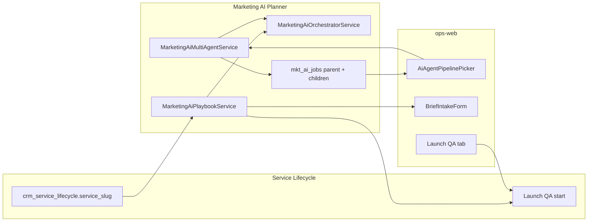

# MKT-AI Planner Phase 3 — Kế hoạch triển khai chi tiết

> **For agentic workers:** REQUIRED SUB-SKILL: Use `superpowers:subagent-driven-development` (recommended) hoặc `superpowers:executing-plans` để thực thi từng workstream. Mỗi WS có exit criteria và trace UC.

**Goal:** Ship Phase 3 MKT-AI Planner — multi-agent pipeline một nút (Strategist→Planner→Copywriter→Analyst) và industry playbook templates theo `service_slug`, kèm quality gate trước Launch QA — hoàn tất UC MKTP-019…020 trên staging.

**Architecture:** Mở rộng `MarketingAiPlannerModule` với `MarketingAiMultiAgentService` (orchestrate tuần tự các job hiện có, parent `mkt_ai_jobs.job_type=multi_agent` + child refs) và `MarketingAiPlaybookService` (JSON templates theo slug → prefill brief + prompt blocks). FE thêm sub-tab `?tab=ai-planner&step=agents&sub=agents` với `AiAgentPipelinePicker` + playbook selector; bridge quality score → Launch QA gate (SVC-UC-005). Tái sử dụng orchestrator LLM, job audit, RBAC — **không** tích hợp RNOS-31 global orchestrator cho MVP Phase 3.

**Tech stack:** NestJS (`ptt-crm-api`), Next.js (`ops-web`), PostgreSQL (`mkt_ai_jobs`, `mkt_ai_briefs`, `mkt_ai_drafts`), env flags, RBAC `crm_mkt_ai.*`, link admin trace `/admin/ai/agents` (read-only).

## Global Constraints

- **Human-in-the-loop (BR-MKTP-01):** Multi-agent **không** auto-publish Meta/Google; chỉ sinh draft + jobs audit.
- **Không auto-advance stage (BR-MKTP-02):** Pipeline/playbook không đổi `crm_service_lifecycle.stage`.
- **Audit jobs (BR-MKTP-03):** `POST /jobs/multi-agent` → row parent `job_type=multi_agent`; mỗi bước con → child job row riêng (`strategy_generate`, `campaign_generate`, …).
- **Retry an toàn (BR-MKTP-05):** Fail ở bước N → giữ draft các bước 1…N−1; retry multi-agent hoặc retry từng job con (EC-MKT-AI-05).
- **Playbook ≠ CSKH RAG:** Industry playbook Phase 3 là **JSON tĩnh trong repo** (`marketing-ai-planner/playbooks/*.json`), **không** trùng `/api/v1/ai/playbooks` (Revenue OS RAG).
- **Pilot slug:** `PTT_MKT_AI_PLANNER_SLUGS=meta-lead-gen` cho đến GA Phase 3 sign-off.
- **Copy VI:** label pipeline, playbook, governance banner theo integration spec §7.5.
- **API route lifecycle:** `api/crm/service-lifecycle/:id/ai-planner/*`; playbook catalog có thể `GET .../playbooks`.

---

## 0. Phạm vi & định danh Phase

| Tên module plan | UC | Trạng thái trước Phase 3 |
|-----------------|-----|---------------------------|
| Phase 1 WS-P1-01…05 | MKTP-UC-011…015 | ✅ Shipped staging |
| Phase 2 WS-P2-01…03 | MKTP-UC-016…018 | ✅ Shipped staging (`4aaddb4`, `d3cd957`, `5fd93c8`) |
| **Phase 3** WS-P3-01…02 | MKTP-UC-019…020 | ❌ Stub / chưa có FE |
| WS-P3-03 (optional) | Governance banner | ❌ Chưa có |

> **Lưu ý naming:** Integration spec gọi Phase 3 UI là "Phase 4" (§1.3); **module plan** và BA matrix dùng **Phase 3 = UC-019…020**. Kế hoạch này theo **module plan §7**.

**Timeline đề xuất:** Tuần 15–20 (6 tuần · 2 workstream chính + hardening).

---

## 1. Baseline sau Phase 2

### 1.1. Đã có (tái sử dụng)

| Layer | Artifact | Ghi chú |
|-------|----------|---------|
| Job runner | `MarketingAiPlannerService.runJob()` | Audit + `mkt_ai_jobs` + agent runs |
| Single jobs | `runStrategyJob`, `runCampaignJob`, `runContentJob`, `runQualityJob` | Orchestrator + stub LLM |
| Optimize | `MarketingAiOptimizeService` + copilot FE | WS-P2-02 pattern |
| Dashboard + alerts | `MarketingAiDashboardService`, `MarketingAiKpiAlertService` | KPI context cho Analyst step (optional) |
| Controller stub | `POST jobs/multi-agent` | Throw `mkt_ai_multi_agent_phase4` |
| Job type DDL | `multi_agent` trong enum | `2026-08-08-postgresql-ddl-mkt-ai-planner.sql` |
| FE panel | `MarketingAiPlannerPanel.tsx` | Steps + sub-tabs (`kb`, `budget`, `dashboard`) |
| Quality gate | `computeQualityScore`, `can_apply` ≥60 | Launch QA bridge candidate |
| Launch QA | `LifecycleLaunchQaService.startLaunchQa` | SVC-UC-005 — thêm quality pre-check |
| Admin AI | `/admin/ai/agents` | Orchestration trace (RNOS-31) — link read-only |
| Playbooks RAG | `/api/v1/ai/playbooks` | **Out of scope** Phase 3 MKT templates |

### 1.2. Gap Phase 3

| Gap | UC / EC | Blocker |
|-----|---------|---------|
| `POST jobs/multi-agent` implementation | MKTP-UC-019 | High |
| Child job linkage in `input_json`/`output_json` | MKTP-UC-019 | High |
| `AiAgentPipelinePicker.tsx` + routing `sub=agents` | MKTP-UC-019 | High |
| Playbook JSON + loader service | MKTP-UC-020 | High |
| Brief/strategy prompt injection từ playbook | MKTP-UC-020 | High |
| Launch QA quality gate checkbox | MKTP-UC-020, SVC-UC-005 | Medium |
| UAT actions UC-019…020 | `10-MKTP-ACTIONS.md` | Sign-off |
| Env kill switches P3 | Rollback | Medium |

---

## 2. Kiến trúc dữ liệu Phase 3



### 2.1. Multi-agent job model

**Parent job** (`job_type=multi_agent`):

```typescript
interface MktAiMultiAgentInput {
  pipeline_key: 'default_v1';           // extensible
  playbook_slug?: string;               // e.g. meta-lead-gen
  steps?: Array<'strategist' | 'planner' | 'copywriter' | 'analyst'>;
  stop_on_failure?: boolean;            // default true
}

interface MktAiMultiAgentOutput {
  pipeline_key: string;
  playbook_slug: string | null;
  child_jobs: Array<{
    step: string;
    job_type: MktAiJobType;
    job_id: number;
    status: 'succeeded' | 'failed' | 'skipped';
    latency_ms?: number;
  }>;
  failed_step?: string;
  quality_score?: number;
}
```

**Step → existing job type mapping (default_v1):**

| Step UI | Agent label | Job type | Prerequisite |
|---------|-------------|----------|--------------|
| strategist | Strategist | `strategy_generate` | Brief valid |
| planner | Planner | `campaign_generate` | Brief valid |
| copywriter | Copywriter | `content_generate` | Campaigns in draft |
| analyst | Analyst | `quality_score` | Draft có strategy+campaign |

Analyst **không** gọi Meta API — chỉ `computeQualityScore` + optional KPI snippet từ dashboard (read-only) khi stage `deliver|retain`.

### 2.2. Industry playbook JSON schema

File: `services/ptt-crm-api/src/marketing-ai-planner/playbooks/{slug}.json`

```typescript
interface MktAiIndustryPlaybook {
  slug: string;                         // meta-lead-gen | bds-lead-gen | seo-retainer
  label_vi: string;
  service_slugs: string[];              // match crm_service_lifecycle.service_slug
  brief_defaults: Partial<MktAiBrief>;
  strategy_prompt_hints: string[];      // injected into buildStrategyUserPrompt
  campaign_kpi_templates: string[];     // e.g. CPL ≤180k
  channel_mix_pct?: Record<string, number>;
  quality_gate: {
    min_score_launch_qa: number;        // default 70
    require_campaign_count: number;     // default 2
  };
  governance_notes_vi?: string[];     // banner copy
}
```

**Ship MVP 3 playbooks:**

| File | Slug | service_slug pilot |
|------|------|-------------------|
| `meta-lead-gen.json` | meta-lead-gen | `meta-lead-gen` |
| `bds-lead-gen.json` | bds-lead-gen | `bds-lead-gen` (staging seed) |
| `seo-retainer.json` | seo-retainer | `seo-retainer` |

---

## 3. Workstream WS-P3-01 — Multi-agent Pipeline (MKTP-UC-019)

**Exit:** SP bấm **Chạy pipeline AI** → 4 bước chạy tuần tự → parent + ≥4 child rows `mkt_ai_jobs` → draft đầy đủ strategy/campaign/content/quality → job panel + pipeline visual cập nhật.

### 3.1. API contract

**`POST /api/crm/service-lifecycle/:lifecycleId/ai-planner/jobs/multi-agent`**

Body:

```typescript
interface MktAiMultiAgentBody {
  pipeline_key?: 'default_v1';
  playbook_slug?: string;       // optional override; default from service_slug
  steps?: string[];             // subset; default all 4
  skip_analyst?: boolean;
}
```

Response:

```typescript
interface MktAiMultiAgentResult {
  ok: boolean;
  job_id: number;               // parent
  status: 'succeeded' | 'partial' | 'failed';
  output: MktAiMultiAgentOutput;
  draft?: MktAiDraft;           // latest draft snapshot
}
```

**Status semantics:**

- `succeeded` — all requested steps OK
- `partial` — stopped after failure with `stop_on_failure=true`; earlier child jobs kept
- `failed` — first step failed (e.g. brief incomplete)

**`GET .../ai-planner/multi-agent/status`** (optional P3.1): derive pipeline UI state from latest parent job + child jobs in context.

### 3.2. Files

| Action | Path |
|--------|------|
| Create | `marketing-ai-multi-agent.util.ts` — step map, status rollup |
| Create | `marketing-ai-multi-agent.util.spec.ts` |
| Create | `marketing-ai-multi-agent.service.ts` — orchestrate child jobs |
| Create | `marketing-ai-multi-agent.service.spec.ts` |
| Modify | `marketing-ai-planner.service.ts` — `runMultiAgentJob()` |
| Modify | `marketing-ai-planner.controller.ts` — wire `jobs/multi-agent` |
| Modify | `marketing-ai-planner.module.ts` — register service |
| Modify | `marketing-ai-planner.types.ts` — body/result types |
| Create | `AiAgentPipelinePicker.tsx` |
| Modify | `MarketingAiPlannerPanel.tsx` — step `agents`, sub routing |
| Modify | `mkt-ai-planner-api.ts` — `postMktAiMultiAgentJob()` |
| Modify | `AiJobProgressPanel.tsx` — group child jobs under parent (optional badge) |

### 3.3. Tasks WS-P3-01 (ước lượng 8 ngày)

| # | Task | Done when |
|---|------|-----------|
| P3-01-T1 | Util: step order + rollup partial/failed | Jest |
| P3-01-T2 | Service: brief gate → run 4 jobs sequentially | Jest mock orchestrator |
| P3-01-T3 | Parent job persists `child_jobs[]` in output_json | PG row inspect |
| P3-01-T4 | Controller + guard `crm_mkt_ai.generate` | curl 200 |
| P3-01-T5 | FE pipeline picker + run button + step states | UI staging |
| P3-01-T6 | Partial failure: step 3 fail, step 1–2 draft preserved | Manual EC-05 |
| P3-01-T7 | Link **Xem trace admin →** `/admin/ai/agents?plan=mkt_ai` | Click UAT |
| P3-01-T8 | UAT MKTP-UC-019 in actions doc | Doc |

### 3.4. Implementation notes

1. **Không** import `AiIntelligenceModule` / global orchestrator vào planner (tránh circular deps như P1-05 hotfix).
2. Gọi nội bộ `this.runStrategyJob` … qua private helper `_runChildStep()` trả `job_id` — hoặc tách `runJob` runner để không double-audit parent.
3. **Recommended:** parent `runJob` wrapper; mỗi step gọi `repo.createJob` + executor trực tiếp (copy logic từ `runStrategyJob` without nested parent).
4. Idempotency: nếu parent `multi_agent` đang `running` (future async) → 409; P3 sync-only OK.
5. FE disable pipeline khi `!brief_validation.ok` hoặc stage read-only (cap/view only).

---

## 4. Workstream WS-P3-02 — Industry Playbooks (MKTP-UC-020)

**Exit:** Chọn playbook theo `service_slug` → prefill brief + prompt hints → quality score ≥ ngưỡng playbook → Launch QA start được phép (hoặc warning rõ nếu chưa đạt).

### 4.1. API contract

**`GET /api/crm/service-lifecycle/:lifecycleId/ai-planner/playbooks`**

```typescript
interface MktAiPlaybookListResult {
  ok: boolean;
  service_slug: string;
  active_slug: string | null;          // from mkt_ai_briefs or lifecycle default
  playbooks: Array<{
    slug: string;
    label_vi: string;
    quality_gate: { min_score_launch_qa: number };
  }>;
}
```

**`POST .../playbooks/:slug/apply`**

Body: `{ confirm_overwrite?: boolean }`

Response: `{ brief, brief_validation, playbook_slug, messages[] }`

- Merge `brief_defaults` vào brief hiện tại (không xóa field user đã sửa trừ khi `confirm_overwrite`).
- Lưu `playbook_slug` vào `brief_json._playbook_slug` hoặc cột metadata trong draft `quality_score_json.playbook_slug`.

**Context extension** (`GET /context`):

```typescript
playbook?: {
  slug: string | null;
  label_vi: string | null;
  quality_gate: { min_score_launch_qa: number; met: boolean };
  governance_notes: string[];
};
launch_qa_quality_gate?: {
  required: boolean;
  min_score: number;
  current_score: number | null;
  ok: boolean;
  message_vi: string;
};
```

### 4.2. Launch QA bridge (SVC-UC-005)

**Option A (recommended MVP):** Soft gate on `POST .../launch-qa/start`:

- Nếu `PTT_MKT_AI_LAUNCH_QA_QUALITY_GATE=1` và lifecycle có `mkt_ai_drafts.quality_score_json.score < playbook.min_score_launch_qa` → `409` `{ error: 'mkt_ai_quality_launch_qa_gate', min_score, current_score }`.
- FE Launch QA tab hiển thị banner + link `?tab=ai-planner&step=apply`.

**Option B (strict):** Block stage advance deliver→handover — **out of scope** Phase 3 (chỉ Launch QA start).

Modify:

- `lifecycle-launch-qa.service.ts` — inject `MarketingAiPlaybookService` via forwardRef hoặc read-only helper
- `MarketingAiPlannerService.getContext()` — compute `launch_qa_quality_gate`

### 4.3. Orchestrator / prompt integration

| Hook | Change |
|------|--------|
| `buildStrategyUserPrompt` | Append `playbook.strategy_prompt_hints` block |
| `buildCampaignUserPrompt` | Append KPI templates from playbook |
| `generateStrategy` fallback | Seed SWOT from playbook when stub mode |
| `runMultiAgentJob` | Pass `playbook_slug` into each step context |

### 4.4. Files

| Action | Path |
|--------|------|
| Create | `playbooks/meta-lead-gen.json`, `bds-lead-gen.json`, `seo-retainer.json` |
| Create | `marketing-ai-playbook.util.ts` — load, merge brief, match slug |
| Create | `marketing-ai-playbook.util.spec.ts` |
| Create | `marketing-ai-playbook.service.ts` |
| Create | `marketing-ai-playbook.service.spec.ts` |
| Modify | `marketing-ai-planner.controller.ts` — GET playbooks, POST apply |
| Modify | `marketing-ai-planner.service.ts` — context + playbook apply |
| Modify | `marketing-ai-orchestrator.service.ts` — accept playbook hints param |
| Modify | `lifecycle-launch-qa.service.ts` — quality gate check |
| Create | `AiPlaybookSelector.tsx` (embedded in picker or brief step) |
| Modify | `BriefIntakeForm.tsx` — playbook chip + apply CTA |
| Modify | `AiAgentPipelinePicker.tsx` — playbook dropdown §7.5 |
| Modify | Launch QA FE tab — gate banner |

### 4.5. Tasks WS-P3-02 (ước lượng 7 ngày)

| # | Task | Done when |
|---|------|-----------|
| P3-02-T1 | JSON playbooks 3 slug + util merge | Jest |
| P3-02-T2 | GET list + POST apply API | curl |
| P3-02-T3 | Context `playbook` + `launch_qa_quality_gate` | context JSON |
| P3-02-T4 | Prompt injection strategy/campaign | Jest orchestrator |
| P3-02-T5 | Launch QA start blocked when score low | Manual UAT |
| P3-02-T6 | FE playbook selector + governance notes | UI |
| P3-02-T7 | UAT MKTP-UC-020 in actions doc | Doc |

---

## 5. Workstream WS-P3-03 — Governance banner (optional, 2 ngày)

Integration spec §7.5: checkbox **Campaign Quality Score gate trước Launch QA** + governance notes từ playbook.

| Deliverable | Mô tả |
|-------------|--------|
| `AiGovernanceBanner.tsx` | Sticky trên `AiAgentPipelinePicker`: playbook notes + quality gate status |
| Context flag | `flags.playbook_governance_enabled` |
| Env | `PTT_MKT_AI_GOVERNANCE_BANNER=1` |

Có thể gộp vào WS-P3-02 FE nếu cần rút timeline.

---

## 6. Lộ trình 6 tuần

| Tuần | Focus | Deliverables | Exit |
|------|-------|--------------|------|
| **S1 (W15)** | WS-P3-02 BE core | Playbook JSON + util + GET/apply API | curl apply |
| **S2 (W16)** | WS-P3-02 FE + Launch QA gate | Playbook selector + launch QA block | UC-020 partial |
| **S3 (W17)** | WS-P3-01 BE | Multi-agent service + controller | curl multi-agent |
| **S4 (W18)** | WS-P3-01 FE | `AiAgentPipelinePicker` + job grouping | UC-019 partial |
| **S5 (W19)** | Integration + hardening | Pipeline + playbook combined run; admin link | E2E staging |
| **S6 (W20)** | UAT + docs + sign-off | `10-MKTP-ACTIONS` UC-019…020; BA matrix | Phase 3 DoD |

**Song song mỗi sprint:**

- Regression: P0 walkthrough + P2 dashboard/optimize/alerts smoke
- Deploy staging sau mỗi WS
- Không break `PTT_MKT_AI_KPI_ALERT_ENABLED` timer

---

## 7. Kiến trúc FE — routing & UX

### 7.1. URL sync

```
/crm/service-delivery/:id?tab=ai-planner&step=agents&sub=agents
```

Thêm vào `STEPS` hoặc **sub-nav** under Strategy (recommended: **step riêng `agents`** giữa `apply` và `dashboard`):

```typescript
const STEPS = [
  // ... existing
  { id: 'agents', label: 'Pipeline AI' },
  { id: 'dashboard', label: 'Dashboard' },
];
```

### 7.2. Wireframe (`AiAgentPipelinePicker`)

```
┌─ Pipeline AI ──────────────────────────────────────────────────┐
│ Playbook: [Meta Lead-gen ▼]  ℹ BĐS · SEO (disabled pilot)    │
│ [Strategist ✓] → [Planner ✓] → [Copywriter …] → [Analyst ○]  │
│ Governance: Quality ≥70 trước Launch QA ☑                      │
│ [Chạy pipeline AI]  [Chạy từ bước hiện tại]                    │
│ Link: Xem job trace admin →                                    │
└────────────────────────────────────────────────────────────────┘
```

Stage visibility:

- `onboard|deliver`: full generate
- `retain`: pipeline read-only hoặc chỉ analyst + playbook view (PO chốt — default allow full on retain)

---

## 8. Chiến lược test

| Level | Scope | Command |
|-------|-------|---------|
| Unit BE | multi-agent util, playbook merge | `npm test -- marketing-ai-multi-agent` |
| Unit BE | playbook util | `npm test -- marketing-ai-playbook` |
| Service | multi-agent partial failure | Jest mock repo |
| Service | launch QA gate | Jest mock lifecycle |
| API | controller guards | curl + JWT / internal key |
| E2E manual | UC-019 pipeline 4 steps | staging lifecycle onboard |
| E2E manual | UC-020 playbook apply + Launch QA | score <70 block |
| Regression | P2 dashboard p95 | `smoke_mkt_ai_dashboard.sh` |
| Regression | P0 21-step | `run_mkt_ai_planner_uat.sh` |

**Fixture staging UAT:**

- Lifecycle `#1` stage `onboard`, slug `meta-lead-gen`, brief valid
- Second lifecycle slug `bds-lead-gen` (seed script extension)
- Launch QA tab enabled sau deliver + `agency_client_id`

---

## 9. Env & rollout

| Flag | Mục đích | Staging | Prod pilot |
|------|----------|---------|------------|
| `PTT_MKT_AI_PLANNER_ENABLED=1` | Master | ✅ | ✅ |
| `PTT_MKT_AI_MULTI_AGENT_ENABLED=1` | Kill switch pipeline | ✅ | sau UAT |
| `PTT_MKT_AI_PLAYBOOKS_ENABLED=1` | Kill switch playbooks | ✅ | sau UAT |
| `PTT_MKT_AI_LAUNCH_QA_QUALITY_GATE=1` | Launch QA score gate | ✅ | opt-in |
| `PTT_MKT_AI_GOVERNANCE_BANNER=1` | FE governance strip | ✅ | ✅ |
| `NEXT_PUBLIC_MKT_AI_PLANNER=1` | FE tab | ✅ | ✅ |

**Deploy checklist (mỗi WS):**

```bash
cd /var/www/rnosai && git pull --ff-only origin main
cd services/ptt-crm-api && npm ci && npm run build
sudo -n /usr/bin/systemctl restart ptt-crm-api
./scripts/deploy_ops_web.sh && sudo -n /usr/bin/systemctl restart ptt-ops-web
LIFECYCLE_ID=1 bash scripts/smoke_mkt_ai_planner_context.sh
# Phase 3 smoke (create after WS-P3-01):
# bash scripts/smoke_mkt_ai_multi_agent.sh
```

---

## 10. Rủi ro & phụ thuộc

| Rủi ro | Mitigation |
|--------|------------|
| Pipeline timeout (4 LLM calls sync) | Stub mode fast path; future async worker P3.1 |
| Double job audit noise | Parent summary only in UI; filter job panel by parent_id |
| Playbook slug mismatch | Fallback generic playbook; message VI |
| Launch QA gate quá strict | Env off `PTT_MKT_AI_LAUNCH_QA_QUALITY_GATE`; tune min_score |
| Circular dep LaunchQa ↔ Planner | forwardRef + read-only gate helper interface |
| Confusion với CSKH playbooks | Label UI **Industry template**; docs glossary |
| BĐS/SEO slug chưa pilot | FE disable dropdown; BE still serves JSON for QA |

**Phụ thuộc ngoài team:**

- PO: chốt min_score Launch QA (70 vs 60)
- PO: chốt step `agents` trong stepper vs sub-tab only
- DevOps: không cần timer mới Phase 3

---

## 11. Definition of Done — Phase 3

- [ ] MKTP-UC-019: `POST jobs/multi-agent` → ≥4 child job rows + draft complete
- [ ] MKTP-UC-019: FE pipeline visual 4 steps + partial failure UX
- [ ] MKTP-UC-020: 3 playbook JSON + apply prefill brief
- [ ] MKTP-UC-020: Launch QA start respects quality gate (env on)
- [ ] BR-MKTP-01: No auto Meta campaign API from pipeline
- [ ] BR-MKTP-03: Parent + child jobs auditable in `mkt_ai_jobs`
- [ ] Regression P0 + P1 + P2 smoke pass on staging
- [ ] `10-MKTP-ACTIONS.md` walkthrough UC-019…020
- [ ] `RNOSAI-BA-MKTP-UseCases.md` status Phase 3 → Implemented
- [ ] PO + Solution lead sign-off staging

---

## 12. Traceability nhanh

| WS | UC | SCR | API | FE | SVC link |
|----|-----|-----|-----|-----|----------|
| P3-01 | MKTP-UC-019 | SCR-MKT-AI-040 | `POST jobs/multi-agent` | `AiAgentPipelinePicker` | — |
| P3-02 | MKTP-UC-020 | SCR-MKT-AI-040 | `GET/POST playbooks` | `AiPlaybookSelector` | SVC-UC-005 Launch QA |
| P3-03 | Governance | SCR-MKT-AI-040 | context flags | `AiGovernanceBanner` | — |

---

## 13. Thứ tự triển khai đề xuất (agent)

1. **WS-P3-02 playbook BE first** — multi-agent cần playbook hints; Launch QA gate independent
2. **WS-P3-02 FE + Launch QA** — validate apply/gate trước pipeline dài
3. **WS-P3-01 BE multi-agent** — build on playbook service
4. **WS-P3-01 FE pipeline** — wire to API + job panel
5. **WS-P3-03 governance banner** — polish
6. UAT docs + Phase 3 sign-off

Mỗi WS: util tests → service → controller → FE → smoke → deploy staging → cập nhật `10-MKTP-ACTIONS.md`.

---

## 14. Liên kết tài liệu

| Tài liệu | Path |
|----------|------|
| Phase 2 plan (baseline) | [`2026-08-08-mkt-ai-planner-phase2.md`](./2026-08-08-mkt-ai-planner-phase2.md) |
| Module master plan | [`2026-08-08-mkt-ai-planner-module.md`](./2026-08-08-mkt-ai-planner-module.md) |
| Integration + UX | [`docs/specs/2026-08-08-mkt-ai-planner-integration-spec.md`](../../specs/2026-08-08-mkt-ai-planner-integration-spec.md) |
| Use cases | [`docs/use-cases/10-MKT-AI-PLANNER.md`](../../use-cases/10-MKT-AI-PLANNER.md) |
| UAT actions | [`docs/use-cases/actions/10-MKTP-ACTIONS.md`](../../use-cases/actions/10-MKTP-ACTIONS.md) |
| Delivery SOP | [`docs/runbooks/mkt-ai-planner-delivery-sop.md`](../../runbooks/mkt-ai-planner-delivery-sop.md) |
| DDL | [`docs/specs/2026-08-08-postgresql-ddl-mkt-ai-planner.sql`](../../specs/2026-08-08-postgresql-ddl-mkt-ai-planner.sql) |

---

*Plan v1.0 — 2026-08-08. Cập nhật trạng thái sprint trong BA module khi mỗi workstream đóng.*
