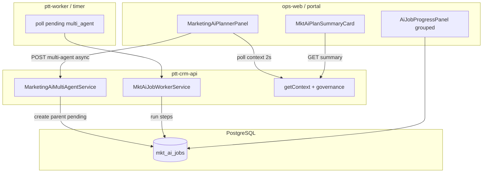

# MKT-AI Planner Phase 4 — Kế hoạch triển khai chi tiết (GA & Scale)

> **For agentic workers:** REQUIRED SUB-SKILL: Use `superpowers:subagent-driven-development` (recommended) hoặc `superpowers:executing-plans` để thực thi từng workstream. Mỗi WS có exit criteria và trace UC.

**Goal:** Hoàn tất **GA module MKT-AI Planner** sau Phase 3 — sign-off P0…P3, mở rộng pilot slug, **plan depth PRD gap (WS-P4-02/04/09)**, async multi-agent, portal summary read-only, vận hành production với monitoring + rollback rõ ràng.

**Architecture:** Giữ `MarketingAiPlannerModule` monolith Nest (không RNOS-31 global orchestrator MVP); thêm **async job runner** cho pipeline dài; **depth draft schema** (KPI tree, risks, section regen); mở rộng flags GA; FE portal card read-only; playbook seed multi-slug; UAT/regression shell scripts P0…P3 + depth waves.

**Tech stack:** NestJS (`ptt-crm-api`), Next.js (`ops-web` + `portal-web` nếu có), PostgreSQL (`mkt_ai_jobs` + optional `parent_job_id`), `ptt-worker` hoặc Nest `@Cron`/BullMQ pattern hiện có, env flags, RBAC, staff notifications.

## Global Constraints

- **Human-in-the-loop (BR-MKTP-01):** GA không bật auto-publish campaign; portal chỉ **read-only summary**.
- **Không auto-advance stage (BR-MKTP-02):** Mọi WS P4 giữ nguyên workflow gate SVC-UC-001.
- **Audit jobs (BR-MKTP-03):** Async pipeline vẫn parent + child rows; worker cập nhật status, không xóa audit.
- **Pilot → GA:** Mở slug whitelist có rollback flag; không hard-delete dữ liệu lifecycle.
- **API route:** `api/crm/service-lifecycle/:id/ai-planner/*` — không đổi prefix.
- **Naming:** Integration spec §1.3 gọi multi-agent/playbook là **「Phase 4 UX」** — đã ship ở **module Phase 3** (`9c7e6c8`). **Kế hoach này = module Phase 4 (tuần 21+)** — GA & scale, **không** trùng P3.

---

## 0. Phạm vi & định danh Phase

| Module phase | UC / WS | Trạng thái staging (2026-08-08) |
|--------------|---------|----------------------------------|
| P0 MVP | MKTP-UC-001…010 | ✅ Shipped |
| P1 Collab | MKTP-UC-011…015 | ✅ Shipped |
| P2 KPI | MKTP-UC-016…018 | ✅ Shipped (`4aaddb4`…`5fd93c8`) |
| P3 Enterprise | MKTP-UC-019…021, WS-P3-01…03 | ✅ Shipped (`13eec63`, `9c7e6c8`) |
| **P4 GA & Scale** | MKTP-UC-022…031 | 🟡 WS-P4-01 shipped; P4-02+ backlog |
| **P4 Depth (PRD gap)** | MKTP-UC-026…028 | ❌ Backlog từ PRD docx audit |

**Timeline đề xuất:** Tuần 21–32 (12 tuần · GA + **plan depth** PRD `AI Marketing Planner Pro`).

**Nguồn PRD gap:** [`PTTCOM/AI/ứng dụng lên kế hoạch marketing AI.docx`](../../../../PTTCOM/AI/ứng%20dụng%20lên%20kế%20hoạch%20marketing%20AI.docx) — so sánh RNOSAI staging P0–P3 (2026-08-08).

---

## 1. Baseline sau Phase 3

### 1.1. Đã có (tái sử dụng)

| Layer | Artifact | Ghi chú |
|-------|----------|---------|
| Multi-agent | `MarketingAiMultiAgentService` | Sync 4 bước; parent `multi_agent` + child refs |
| Playbooks | 3 JSON + `MarketingAiPlaybookService` | meta-lead-gen, bds-lead-gen, seo-retainer |
| Governance | `AiGovernanceBanner` + `governance{}` context | Sticky; Launch QA gate bridge |
| Launch QA gate | `lifecycle-launch-qa.service.ts` | 409 `mkt_ai_quality_launch_qa_gate` |
| Deploy | `deploy_mkt_ai_planner_staging.sh` | Flags P3 đầy đủ |
| Smoke | `smoke_mkt_ai_planner_context.sh` | + governance block check |
| UAT P0 | `run_mkt_ai_planner_uat.sh` | 21 bước API — **chưa** cover P1…P3 |
| Staging | `rs.pttads.vn` lifecycle `#1` | slug `meta-lead-gen`, onboard |

### 1.2. Gap Phase 4

| Gap | UC / EC | Blocker |
|-----|---------|---------|
| Phase 3 PO sign-off checklist | P3 DoD §11 | High |
| Full regression P0…P3 automated | EC-01…07 + UC-019…021 | High |
| GA slug whitelist removal / multi-slug | Pilot → prod | High |
| Async multi-agent (504 / UX timeout) | MKTP-UC-022 | High |
| Job panel parent/child grouping | UX §10 | Medium |
| Portal read-only plan summary | Integration §1.4 | Medium |
| Playbook seed lifecycles BĐS/SEO | UAT multi-slug | Medium |
| Prod monitoring + alerts job fail rate | Rollout §10 | Medium |
| `run_mkt_ai_planner_uat.sh` P1…P3 blocks | QA debt | Medium |
| RNOS-31 orchestrator bridge | Stretch P4.2 | Low |
| **Plan depth vs PRD §9** | MKTP-UC-026…028 | **High** — Leader chuyên sâu |
| Section regenerate + reasoning | PRD §6.4, §9.4 | High |
| Brief upload extract | PRD §9.2 | High |
| Strategy scenarios compare | PRD §7 Scenario engine | Medium |
| KPI tree + milestones + risks | PRD §9.4–9.5 | High |
| Comment on section + PPTX | PRD §9.9–9.10 | Medium |

---

## 2. UC mới Phase 4 (đề xuất PO)

| ID | Tên | Priority | Workstream |
|----|-----|----------|------------|
| **MKTP-UC-024** | GA multi-slug rollout | P0 | WS-P4-01 |
| **MKTP-UC-026** | Plan depth — strategy & brief | P0 | WS-P4-02 |
| **MKTP-UC-022** | Async multi-agent pipeline | P1 | WS-P4-03 |
| **MKTP-UC-027** | Plan depth — scenario & collab | P1 | WS-P4-04 |
| **MKTP-UC-023** | Portal plan summary read-only | P2 | WS-P4-05 |
| **MKTP-UC-025** | Ops monitoring & job SLO | P1 | WS-P4-06 |
| **MKTP-UC-028** | Plan depth — KPI closed-loop | P2 | WS-P4-09 |
| **MKTP-UC-029** | Section comments & PPTX export | P2 | WS-P4-04 (partial) |
| **MKTP-UC-030** | Content variants & creative brief | P2 | WS-P4-02 (partial) |
| **MKTP-UC-031** | Brief readiness score | P2 | WS-P4-02 (partial) |

> PO chốt ID trước sprint 1; cập nhật `10-MKT-AI-PLANNER.md` + BA matrix khi freeze. **✅ Frozen 2026-08-08** — [`10-MKTP-ACTIONS.md`](../../use-cases/actions/10-MKTP-ACTIONS.md) · [`RNOSAI-BA-MKTP-UseCases.md`](../../specs/modules/RNOSAI-BA-MKTP-UseCases.md).

### 2.1. Workstream map (backlog WS-P4-02+)

| WS | Tên | Task prefix | Estimate |
|----|-----|-------------|----------|
| **P4-02** | Plan depth Wave 1 — strategy & brief | P4-02-D* | 10–12 ngày |
| **P4-03** | Async multi-agent | P4-03-T* | 8 ngày |
| **P4-04** | Plan depth Wave 2 — scenario & collab | P4-04-D* | 8–10 ngày |
| **P4-05** | Portal summary read-only | P4-05-T* | 5 ngày |
| **P4-06** | Ops monitoring + full regression | scripts | ongoing |
| **P4-07** | Job panel parent/child UX | P4-07-T* | 3 ngày |
| **P4-08** | Playbook ops | P4-08-T* | 2 ngày |
| **P4-09** | Plan depth Wave 3 — KPI closed-loop | P4-09-D* | 6–8 ngày |

---

## 3. Kiến trúc Phase 4



### 3.1. Async multi-agent model (MKTP-UC-022)

**Hiện tại (P3):** `POST jobs/multi-agent` chạy **sync** 4 LLM calls trong 1 HTTP request.

**P4 thay đổi:**

```typescript
interface MktAiMultiAgentAsyncBody extends MktAiMultiAgentBody {
  async?: boolean; // default true when PTT_MKT_AI_MULTI_AGENT_ASYNC=1
}

interface MktAiMultiAgentAsyncResult {
  ok: boolean;
  job_id: number;
  status: 'pending' | 'running' | 'succeeded' | 'partial' | 'failed';
  poll_url?: string; // GET context or GET multi-agent/status
}
```

**Flow:**

1. `POST multi-agent` → parent `status=pending` → HTTP **202** + `job_id` (async mode).
2. Worker picks parent → `running` → chạy từng child step (reuse `runStep`).
3. FE poll `GET context` hoặc `GET multi-agent/status` mỗi 2s (reuse job panel pattern).
4. Sync mode giữ làm fallback khi `async=false` hoặc flag off.

**DDL optional (P4.1):**

```sql
ALTER TABLE mkt_ai_jobs ADD COLUMN IF NOT EXISTS parent_job_id BIGINT REFERENCES mkt_ai_jobs(id);
CREATE INDEX IF NOT EXISTS idx_mkt_ai_jobs_parent ON mkt_ai_jobs(parent_job_id);
```

Child rows ghi `parent_job_id` thay vì chỉ `output_json.child_jobs[]` — dual-write transition.

### 3.2. Plan depth draft model (MKTP-UC-026…031 · WS-P4-02/04/09)

**Hiện tại (P0–P3):** 1 job strategy → campaign → content; quality score; Apply TMMT — **không** regenerate section, không KPI tree, không risks gate.

**P4 depth thêm (optional JSON trên draft):**

| Field | WS | PRD |
|-------|-----|-----|
| `reasoning_vi[]` | P4-02 | §10.3 |
| `kpi_tree_json` | P4-02 | §9.4 |
| `risks_assumptions_json` | P4-02 | §9.5 |
| `campaigns[].milestones[]` | P4-02 | §9.5 |
| `content[].variants[]` | P4-02 | §9.6 |
| `brief_readiness` | P4-02 | §6.2 |
| `strategy_scenarios[]` | P4-04 | §7 |
| `section_comments[]` | P4-04 | §9.9 |
| `competitor_snapshot_json` | P4-09 | §10 |
| `kpi_actual_vs_target` | P4-09 | §9.8 |

Quality gate trước Apply: nếu `PTT_MKT_AI_PLAN_DEPTH_ENABLED=1` → bắt buộc `risks_assumptions_json` + `kpi_tree_json` (cấu hình PO).

---

## 4. Workstream WS-P4-01 — Sign-off P3 & GA slug rollout (MKTP-UC-024)

**Exit:** PO ký Phase 3; staging chạy `meta-lead-gen` + `bds-lead-gen` + `seo-retainer`; prod pilot 1 client với rollback ≤5 phút.

### 4.1. Tasks

| # | Task | Done when |
|---|------|-----------|
| P4-01-T1 | Chạy manual UAT UC-019…021 trên staging | Checklist signed |
| P4-01-T2 | Regression P0 walkthrough + P2 dashboard smoke | Exit 0 |
| P4-01-T3 | Seed lifecycle `#2` bds, `#3` seo | `seed_mkt_ai_uat_lifecycle.sh` extend |
| P4-01-T4 | `PTT_MKT_AI_PLANNER_SLUGS=meta-lead-gen,bds-lead-gen,seo-retainer` staging | 3 slug context 200 |
| P4-01-T5 | Doc `mkt-ai-phase3-signoff.md` + BA matrix status Implemented | Doc merged |
| P4-01-T6 | Prod env template `deploy/env.mkt-ai-ga.example` | DevOps review |
| P4-01-T7 | Pilot prod: 1 lifecycle, flags on, monitor 7 ngày | `deploy_mkt_ai_planner_prod_pilot.sh` + runbook |

### 4.2. Files

| Action | Path |
|--------|------|
| Create | `docs/runbooks/mkt-ai-phase3-signoff.md` |
| Modify | `scripts/seed_mkt_ai_uat_lifecycle.sh` |
| Modify | `docs/specs/modules/RNOSAI-BA-MKTP-UseCases.md` — status P3 |
| Modify | `scripts/deploy_mkt_ai_planner_staging.sh` — 3 slugs |
| Create | `deploy/env.mkt-ai-prod-pilot.example` |
| Create | `docs/runbooks/mkt-ai-prod-pilot-checklist.md` |
| Create | `scripts/deploy_mkt_ai_planner_prod_pilot.sh` |
| Create | `scripts/mkt_ai_prod_pilot_gate.sh` |
| Create | `scripts/mkt_ai_prod_pilot_monitor.sh` |
| Create | `scripts/mkt_ai_prod_pilot_rollback.sh` |
| Create | `scripts/verify_mkt_ai_pilot_lifecycle.sh` |
| Create | `deploy/mkt-ai-prod-pilot-signoff.template.json` |

### 4.3. GA flags matrix

| Flag | Staging | Prod pilot | Prod GA |
|------|---------|------------|---------|
| `PTT_MKT_AI_PLANNER_ENABLED` | 1 | 1 | 1 |
| `PTT_MKT_AI_PLANNER_SLUGS` | 3 slugs | 1 slug | empty = all |
| `PTT_MKT_AI_MULTI_AGENT_ENABLED` | 1 | 1 | 1 |
| `PTT_MKT_AI_PLAYBOOKS_ENABLED` | 1 | 1 | 1 |
| `PTT_MKT_AI_GOVERNANCE_BANNER` | 1 | 1 | 1 |
| `PTT_MKT_AI_LAUNCH_QA_QUALITY_GATE` | 1 | opt-in | opt-in |
| `NEXT_PUBLIC_MKT_AI_PLANNER` | 1 | 1 | 1 |

**Rollback:** Set `PTT_MKT_AI_PLANNER_ENABLED=0` + rebuild ops-web → tab hidden; API 404 `mkt_ai_planner_disabled`.

### 4.4. PRD traceability matrix (RNOSAI vs docx)

> **Không** build workspace SaaS PRD §9.1 — giữ lifecycle CRM. Backlog dưới đây = gap **Leader kế hoạch chuyên sâu**.

| PRD § | Yêu cầu docx | RNOSAI hiện tại | WS backlog | Ưu tiên |
|-------|---------------|-----------------|------------|---------|
| 9.1 | Workspace multi-tenant | Lifecycle + RBAC | ➖ Out of scope | — |
| 9.2 | Brief upload + extract + readiness | Form + prefill | **P4-02** D3, D8 | P0 |
| 9.3 | Brand KB multi-format + tag | RAG PDF P1 | **P4-04** D5 | P1 |
| 9.4 | Strategy + regenerate section + reasoning | 1 draft job | **P4-02** D1, D2 | P0 |
| 9.4 | KPI tree explicit | KPI rải campaign cards | **P4-02** D6 | P0 |
| 9.5 | Campaign milestones + risks | Campaign cards | **P4-02** D4, D5 | P0 |
| 9.6 | Content variants + creative brief | Calendar + ad copy | **P4-02** D7 | P1 |
| 9.7 | Budget 2–5 scenarios + rationale | Budget sim P1 | **P4-04** D2 | P1 |
| 9.7 | Strategy scenarios compare | — | **P4-04** D1 | P1 |
| 9.8 | KPI target vs actual + alert | Dashboard Meta P2 | **P4-09** D1 | P2 |
| 9.9 | Comment / mention / approval | Approval P1 | **P4-04** D3 | P1 |
| 9.10 | Export PPTX + section pick | PDF/DOCX/XLSX | **P4-04** D4 | P1 |
| §7 | Scenario engine | — | **P4-04** D1–D2 | P1 |
| §10 | Weekly optimization memo | Optimize copilot P2 | **P4-09** D2 | P2 |
| §10 | Competitor snapshot | competitors in brief only | **P4-09** D3 | P2 |
| §7 | Execution OS / auto task | SVC workflow + copilot task | ➖ Out of scope | — |
| §7 | Multi-agent | Pipeline P3 ✅ | **P4-03** async | P1 |
| §7 | Industry playbooks | 3 slug ✅ | **P4-08** ops | Low |
| §7 | Governance + quality score | P3 ✅ | — | Done |

**Đã có (~26 khối):** Brief, strategy/campaign/content jobs, quality, Apply TMMT, export, multi-agent, playbooks, governance, RAG, budget sim, approval, version, dashboard, optimize, prod pilot tooling.

**Chưa có (backlog P4-02+):** regenerate section, reasoning, brief extract, KPI tree, milestones, risks gate, scenarios compare, variants, comment, PPTX, readiness score, optimization memo.

---

## 5. Workstream WS-P4-02 — Plan depth Wave 1 (MKTP-UC-026, 030, 031)

**Exit:** Marketing Leader tạo **TMMT chuyên sâu** trên lifecycle — không chỉ draft nhanh 30 phút; đáp ứng PRD §9.2–9.6 depth trước Apply.

**Không làm:** workspace SaaS, auto-publish, full task OS.

### 5.1. Backlog tasks

| # | Task | PRD map | Done when |
|---|------|---------|-----------|
| P4-02-D1 | **Regenerate từng section strategy** (SWOT, ICP, channel, messaging) | §6.4, §9.4 | `POST .../jobs/strategy/regenerate-section` + FE nút per section |
| P4-02-D2 | **Reasoning block** — `reasoning_vi[]` 2–3 bullet / khuyến nghị chính | §7, §10.3 | Context + strategy UI collapsible; stub có placeholder |
| P4-02-D3 | **Brief upload PDF/DOCX** → extract + missing-field checklist | §9.2, §6.2 | `POST .../brief/upload` + merge vào `mkt_ai_briefs` |
| P4-02-D4 | **Campaign timeline + milestones** (`timeline_weeks`, `milestones[]`) | §9.5 | Draft schema + `AiCampaignBuilder` editor |
| P4-02-D5 | **Risks & assumptions** bắt buộc trước Apply | §9.5 output | `risks_assumptions_json`; quality gate nếu thiếu |
| P4-02-D6 | **KPI tree structured** — north_star → campaign KPIs → ngưỡng | §9.4 KPI tree | `kpi_tree_json` trong draft; export PDF section |
| P4-02-D7 | **Content variants** ≥3 headline/CTA per campaign | §9.6 | `variants[]` trong content draft + regenerate |
| P4-02-D8 | **Brief readiness score** 0–100 trước pipeline AI | §6.2 output | `brief_readiness` trong context; banner nếu &lt;70 |
| P4-02-D9 | UAT MKTP-UC-026 + extend `run_mkt_ai_p3_uat.sh` | — | Exit 0 staging |
| P4-02-D10 | Doc Leader checklist §depth + `10-MKTP-ACTIONS.md` | — | Walkthrough signed |

### 5.2. API sketch

```typescript
// Regenerate one section
POST .../jobs/strategy/regenerate-section
{ section: 'swot' | 'icp' | 'channel' | 'messaging' | 'kpi_tree' }

// Brief upload
POST .../brief/upload   // multipart PDF/DOCX
→ { brief, extracted_fields, missing[], readiness_score }

// Draft extensions (patch / apply validation)
interface MktAiDraftDepth {
  kpi_tree_json?: KpiTreeNode[];
  risks_assumptions_json?: { risks: string[]; assumptions: string[] };
  campaigns_json?: Array<CampaignCard & { milestones?: Milestone[]; timeline_weeks?: number }>;
  reasoning_vi?: string[];
}
```

### 5.3. Files

| Action | Path |
|--------|------|
| Create | `marketing-ai-brief-upload.service.ts` |
| Create | `marketing-ai-strategy-section.service.ts` |
| Modify | `marketing-ai-planner.types.ts` — depth draft fields |
| Modify | `marketing-ai-quality.util.ts` — risks/milestones/kpi_tree checks |
| Modify | `AiStrategySections.tsx` — regenerate per section + reasoning |
| Modify | `BriefIntakeForm.tsx` — upload + readiness badge |
| Modify | `AiCampaignBuilder.tsx` — milestones timeline |
| Modify | `AiContentCalendar.tsx` — variants |
| Create | `scripts/smoke_mkt_ai_plan_depth.sh` |
| Create | `docs/runbooks/mkt-ai-leader-depth-planning.md` |

### 5.4. Env

```
PTT_MKT_AI_PLAN_DEPTH_ENABLED=1
PTT_MKT_AI_BRIEF_UPLOAD_ENABLED=1
PTT_MKT_AI_STRATEGY_SECTION_REGEN=1
```

### 5.5. Estimate

**10–12 ngày** BE + FE + UAT (Wave 1 — blocker cho “chuyên sâu”).

---

## 6. Workstream WS-P4-03 — Async multi-agent (MKTP-UC-022)

**Exit:** `POST multi-agent` async → HTTP 202 → worker hoàn tất ≤10 phút stub / ≤5 phút LLM → FE pipeline visual cập nhật qua poll; không 504 gateway timeout.

### 6.1. API contract

**`POST .../jobs/multi-agent`** (extend body):

```typescript
{ async?: boolean; pipeline_key?; playbook_slug?; steps?; start_from_step?; stop_on_failure? }
```

**Responses:**

| Mode | HTTP | Body |
|------|------|------|
| Sync (legacy) | 200 | `MktAiMultiAgentResult` (P3) |
| Async | 202 | `{ ok, job_id, status: 'pending', output: null }` |

**`GET .../multi-agent/status`** — thêm `parent_status`, `current_step`, `progress_pct`.

### 6.2. Files

| Action | Path |
|--------|------|
| Create | `marketing-ai-job-worker.service.ts` — poll + execute parent jobs |
| Create | `marketing-ai-job-worker.service.spec.ts` |
| Modify | `marketing-ai-multi-agent.service.ts` — split enqueue vs execute |
| Modify | `marketing-ai-planner.controller.ts` — 202 async |
| Modify | `marketing-ai-planner.module.ts` — register worker |
| Modify | `marketing-ai-planner.types.ts` |
| Optional DDL | `docs/specs/2026-08-08-postgresql-ddl-mkt-ai-planner-p4.sql` |
| Create | `scripts/smoke_mkt_ai_multi_agent_async.sh` |
| Modify | `AiAgentPipelinePicker.tsx` — poll after async POST |
| Modify | `AiJobProgressPanel.tsx` — parent/child grouping (WS-P4-07) |

### 6.3. Worker placement (chọn 1 — PO/DevOps)

| Option | Pros | Cons |
|--------|------|------|
| **A — Nest `@Interval` trong `ptt-crm-api`** | Ít moving parts | API process load |
| **B — `ptt-worker` timer script** | Tách load | Thêm deploy unit |
| **C — BullMQ + Redis** | Scale | Infra mới |

**Recommended P4:** Option **A** MVP (5 phút interval + immediate trigger sau POST); Option B nếu API CPU cao sau pilot.

### 6.4. Tasks (8 ngày)

| # | Task | Done when |
|---|------|-----------|
| P4-03-T1 | Refactor `executePipeline()` tách khỏi HTTP | Jest |
| P4-03-T2 | Enqueue parent `pending` + 409 if running | Jest |
| P4-03-T3 | Worker tick executes steps | Integration test |
| P4-03-T4 | Controller 202 + flag `PTT_MKT_AI_MULTI_AGENT_ASYNC=1` | curl |
| P4-03-T5 | FE poll + disable double-submit | UI staging |
| P4-03-T6 | Partial failure EC-MKT-AI-05 async | Manual |
| P4-03-T7 | Smoke script async | Exit 0 |
| P4-03-T8 | UAT MKTP-UC-022 in actions doc | Doc |

### 6.5. Env

```
PTT_MKT_AI_MULTI_AGENT_ASYNC=1   # default async on staging after UAT
```

---

## 7. Workstream WS-P4-04 — Plan depth Wave 2 (MKTP-UC-027, 029)

**Exit:** Leader so sánh **2–3 strategy scenarios**, budget side-by-side, comment trên section, export PPTX; Brand KB mở rộng.

**Không làm:** full approval workflow PRD §9.9 (giữ P1 approval hiện có).

### 7.1. Backlog tasks

| # | Task | PRD map | Done when |
|---|------|---------|-----------|
| P4-04-D1 | **Strategy scenarios** — generate 2–3 variants + compare UI (SWOT/channel diff) | §7 Scenario engine, §9.7 | `POST .../jobs/strategy/scenarios` + compare table |
| P4-04-D2 | **Budget sim side-by-side** 2–5 scenarios + rationale_vi | §9.7 | Extend budget-simulate; FE columns compare |
| P4-04-D3 | **Comment / mention** trên strategy/campaign section (staff only) | §9.9 | `mkt_ai_section_comments` + FE thread per section |
| P4-04-D4 | **Export PPTX** — chọn sections (strategy/campaign/content) | §9.10 | `POST .../export/pptx` + download |
| P4-04-D5 | **Brand KB** DOCX/PPTX upload + document tags | §9.3 | Extend RAG ingest + filter by tag |
| P4-04-D6 | UAT MKTP-UC-027 + smoke | — | Exit 0 staging |

### 7.2. Files

| Action | Path |
|--------|------|
| Create | `marketing-ai-strategy-scenario.service.ts` |
| Create | `marketing-ai-section-comment.service.ts` |
| Create | `marketing-ai-export-pptx.service.ts` |
| Modify | `marketing-ai-budget-simulate.service.ts` — multi-scenario |
| Modify | `marketing-ai-rag.service.ts` — DOCX/PPTX + tags |
| Modify | `AiStrategySections.tsx` — scenario compare + comments |
| Modify | `AiBudgetSimulator.tsx` — side-by-side |
| Create | `scripts/smoke_mkt_ai_plan_depth_wave2.sh` |

### 7.3. Env

```
PTT_MKT_AI_SCENARIO_COMPARE=1
PTT_MKT_AI_SECTION_COMMENTS=1
PTT_MKT_AI_EXPORT_PPTX=1
```

### 7.4. Estimate

**8–10 ngày** BE + FE + UAT.

---

## 8. Workstream WS-P4-05 — Portal plan summary (MKTP-UC-023)

**Exit:** Client portal (hoặc staff preview) xem **read-only** tóm tắt kế hoạch AI — không generate/apply.

### 8.1. API

**`GET /api/v1/portal/service-lifecycle/:id/ai-planner/summary`** (portal JWT)

```typescript
interface MktAiPortalSummary {
  ok: boolean;
  lifecycle_id: number;
  service_slug: string;
  brand_name: string | null;
  quality_score: number | null;
  playbook_label: string | null;
  strategy_excerpt: string;      // first 500 chars market_context
  campaign_count: number;
  last_updated_at: string;
  staff_planner_url: string;     // deep link ops-web
}
```

**Guard:** Portal auth + lifecycle `agency_client_id` match; **no** draft JSON full export.

### 8.2. FE

| Component | Path |
|-----------|------|
| `MktAiPlanSummaryCard.tsx` | `portal-web` hoặc embed ops-web client tab |
| Wire | Service delivery client view nếu có |

### 8.3. Tasks (5 ngày)

| # | Task |
|---|------|
| P4-05-T1 | Portal controller + guard |
| P4-05-T2 | Summary mapper từ brief + draft (redacted) |
| P4-05-T3 | FE card + link staff planner |
| P4-05-T4 | Flag `PTT_MKT_AI_PORTAL_SUMMARY=1` |
| P4-05-T5 | UAT MKTP-UC-023 |

> **Out of scope P4:** Client edit brief, client approve export, full wizard on portal.

---

## 9. Workstream WS-P4-06 — Ops monitoring & UAT automation (MKTP-UC-025)

**Exit:** Dashboard nội bộ hoặc log query job fail rate; UAT script cover P1…P3 blocks; weekly cron report.

### 9.1. Monitoring

| Metric | Source | Alert |
|--------|--------|-------|
| `mkt_ai_job_failed` by `job_type` | PG query / log | Slack/email nếu >5%/h |
| Multi-agent p95 latency | `latency_ms` parent jobs | >120s staging |
| Apply → gate pass ratio | join lifecycle validation | <70% UX-MKT-02 |
| Export count | `mkt_ai_exports` | anomaly |

**Deliverable:** `scripts/report_mkt_ai_ops_weekly.sh` → markdown `docs/exports/mkt-ai-ops-*.md`

### 9.2. UAT script extension

Extend `run_mkt_ai_planner_uat.sh`:

| Block | Steps | API |
|-------|-------|-----|
| P1 RAG | upload doc stub | POST documents |
| P1 Budget | simulate | POST budget-simulate |
| P2 Dashboard | GET dashboard p95 | timing assert |
| P3 Multi-agent | POST multi-agent async | parent + ≥4 children |
| P3 Playbook | POST apply playbook | brief prefill |
| P3 Governance | context governance block | assert flags |
| **P4 Depth W1** | section regen + brief upload | POST regenerate-section, upload |
| **P4 Depth W2** | scenarios + PPTX | POST scenarios, export/pptx |

**New:** `scripts/run_mkt_ai_planner_full_regression.sh` — orchestrates P0 UAT + smokes.

### 9.3. Files

| Action | Path |
|--------|------|
| Create | `scripts/report_mkt_ai_ops_weekly.sh` |
| Create | `scripts/run_mkt_ai_planner_full_regression.sh` |
| Modify | `scripts/run_mkt_ai_planner_uat.sh` |
| Modify | `docs/runbooks/mkt-ai-planner-delivery-sop.md` — §Phase 4 GA |
| Create | `docs/runbooks/mkt-ai-planner-ga-rollout.md` |

---

## 10. Workstream WS-P4-07 — Job panel UX polish (P4.2)

**Exit:** Job panel group child jobs dưới parent **Pipeline AI · parent**; collapse/expand; filter orphan jobs.

| # | Task | File |
|---|------|------|
| P4-07-T1 | Group by `parent_job_id` or parse `output_json.child_jobs` | `AiJobProgressPanel.tsx` |
| P4-07-T2 | Badge running step on parent row | same |
| P4-07-T3 | Mobile accordion parent first | `mkt-ai-planner.module.css` |

**Estimate:** 3 ngày FE.

---

## 11. Workstream WS-P4-08 — Playbook ops (optional P4.1)

**Exit:** DevOps có thể thêm/sửa playbook JSON qua PR + verify script; không cần admin UI MVP.

| # | Task |
|---|------|
| P4-08-T1 | `scripts/verify_mkt_ai_playbooks.sh` — schema validate 3+ files |
| P4-08-T2 | Runbook §playbook PR checklist |
| P4-08-T3 | (Stretch) Admin read-only list `GET /admin/mkt-ai/playbooks` |

---

## 12. Workstream WS-P4-09 — Plan depth Wave 3 (MKTP-UC-028)

**Exit:** Closed-loop KPI — target vs actual từ KPI tree đã plan; weekly optimization memo; competitor snapshot trong strategy.

**Phụ thuộc:** WS-P4-02 D6 (KPI tree) + P2 dashboard Meta hiện có.

### 12.1. Backlog tasks

| # | Task | PRD map | Done when |
|---|------|---------|-----------|
| P4-09-D1 | **KPI target vs actual** dashboard từ `kpi_tree_json` planned targets | §9.8 | Join planned KPI + Meta/dashboard ingest; alert delta |
| P4-09-D2 | **Weekly optimization memo** — cron job + staff notification | §10 | `POST .../jobs/optimize/weekly-memo` scheduled |
| P4-09-D3 | **Competitor snapshot** block trong strategy output | §10 | `competitor_snapshot_json` + regenerate |
| P4-09-D4 | UAT MKTP-UC-028 + extend ops weekly report | — | Exit 0 staging |

### 12.2. Files

| Action | Path |
|--------|------|
| Create | `marketing-ai-kpi-closed-loop.service.ts` |
| Create | `marketing-ai-weekly-memo.service.ts` |
| Modify | `marketing-ai-optimize.service.ts` — memo template |
| Modify | `AiKpiDashboard.tsx` — planned vs actual columns |
| Modify | `AiStrategySections.tsx` — competitor snapshot card |
| Create | `scripts/smoke_mkt_ai_plan_depth_wave3.sh` |

### 12.3. Env

```
PTT_MKT_AI_KPI_CLOSED_LOOP=1
PTT_MKT_AI_WEEKLY_MEMO_CRON=0 9 * * 1   # Monday 09:00
```

### 12.4. Estimate

**6–8 ngày** BE + FE + cron.

---

## 13. Stretch — RNOS-31 orchestrator bridge (P4.3, optional)

**Out of scope MVP P4** — chỉ khi PO yêu cầu unified trace.

| Task | Mô tả |
|------|--------|
| Read-only link enrichment | Parent job → `ai_agent_runs` graph id |
| Admin agents page | Filter `plan=mkt_ai` pre-filled (đã có link FE) |
| No circular import | Không inject `AiIntelligenceModule` vào planner (P3 note) |

Ref: `docs/superpowers/plans/2026-07-27-r4-rnos31-33-implementation-plan.md`

---

## 14. Lộ trình 12 tuần

| Tuần | Focus | Deliverables | Exit |
|------|-------|--------------|------|
| **S1 (W21)** | WS-P4-01 sign-off + seed multi-slug | Phase 3 sign-off, 3 slug staging | PO P3 signed ✅ |
| **S2 (W22)** | WS-P4-02 Depth W1 — brief upload + KPI tree | D3, D6, D8 | UC-026 partial |
| **S3 (W23)** | WS-P4-02 Depth W1 — section regen + reasoning + risks | D1, D2, D4, D5, D7 | UC-026 core |
| **S4 (W24)** | WS-P4-03 async BE core | Worker + 202 API | curl async OK |
| **S5 (W25)** | WS-P4-03 FE poll + WS-P4-07 job grouping | Async UI + panel groups | UC-022 partial |
| **S6 (W26)** | WS-P4-04 Depth W2 — scenarios + budget compare | D1, D2 | UC-027 partial |
| **S7 (W27)** | WS-P4-04 Depth W2 — comments + PPTX + Brand KB | D3–D5 | UC-027 + UC-029 |
| **S8 (W28)** | WS-P4-06 UAT automation + monitoring | Full regression + depth smokes | UC-025 |
| **S9 (W29)** | WS-P4-05 portal summary | Portal API + card | UC-023 |
| **S10 (W30)** | Prod pilot 1 client | Flags prod, monitor | No rollback |
| **S11 (W31)** | WS-P4-09 Depth W3 closed-loop | KPI vs actual + weekly memo | UC-028 |
| **S12 (W32)** | GA all slugs + PO sign-off P4 | Remove whitelist prod | Module GA |

**Song song mỗi sprint:** Regression P0 smoke; không break KPI alert timer (`PTT_MKT_AI_KPI_ALERT_ENABLED`).

**PO priority note:** WS-P4-02 (depth) trước GA narrative “Leader chuyên sâu”; WS-P4-03 (async) song song S4–S5 nếu prod 504 risk.

---

## 15. Chiến lược test

| Level | Scope | Command |
|-------|-------|---------|
| Unit BE | strategy section regen, brief extract | `npm test -- marketing-ai-strategy-section` |
| Unit BE | portal summary mapper | `npm test -- mkt-ai-portal-summary` |
| Integration | async POST → worker → status | Jest + PG |
| Integration | brief upload → readiness score | Jest + fixture PDF |
| API | curl guards + 202 + regenerate-section | smoke scripts |
| E2E manual | UC-026 depth plan Leader | staging lifecycle #1 |
| E2E manual | UC-022 async pipeline | staging lifecycle #1 |
| E2E manual | UC-027 scenario compare | staging |
| E2E manual | UC-023 portal card | portal JWT |
| Regression | P0…P3 + P4 depth | `run_mkt_ai_planner_full_regression.sh` |
| Perf | async không block HTTP >2s | k6 optional |
| Visual | Job panel grouping VQ-05 | Design QA |

---

## 16. Env & rollout Phase 4

| Flag | Mục đích | Staging | Prod GA |
|------|----------|---------|---------|
| `PTT_MKT_AI_PLAN_DEPTH_ENABLED=1` | Depth Wave 1 | ✅ sau UAT | ✅ |
| `PTT_MKT_AI_SCENARIO_COMPARE=1` | Depth Wave 2 | ✅ | opt-in |
| `PTT_MKT_AI_KPI_CLOSED_LOOP=1` | Depth Wave 3 | ✅ | opt-in |
| `PTT_MKT_AI_MULTI_AGENT_ASYNC=1` | Async pipeline | ✅ sau UAT | ✅ |
| `PTT_MKT_AI_PORTAL_SUMMARY=1` | Portal card | ✅ | opt-in |
| `PTT_MKT_AI_PLANNER_SLUGS` | Pilot whitelist | 3 slugs | **empty** |
| `PTT_MKT_AI_OPS_WEEKLY_REPORT=1` | Cron report | ✅ | ✅ |

**Deploy checklist (mỗi WS):**

```bash
cd /var/www/rnosai && git pull --ff-only origin main
cd services/ptt-crm-api && npm ci && npm run build
sudo systemctl restart ptt-crm-api
# optional: restart ptt-worker if async worker option B
./scripts/deploy_ops_web.sh && sudo systemctl restart ptt-ops-web
LIFECYCLE_ID=1 bash scripts/smoke_mkt_ai_planner_context.sh
bash scripts/run_mkt_ai_planner_full_regression.sh   # after WS-P4-06
bash scripts/smoke_mkt_ai_plan_depth.sh             # after WS-P4-02
```

---

## 17. Rủi ro & phụ thuộc

| Rủi ro | Mitigation |
|--------|------------|
| Async worker crash mid-pipeline | Parent `failed` + partial child refs; retry `start_from_step` |
| Duplicate worker execution | Row lock `FOR UPDATE SKIP LOCKED` on parent pending |
| Portal data leak | Summary redaction; no full draft; portal scope guard |
| GA slug explosion support load | Staged rollout bds → seo → all |
| UAT script flake on LLM | Stub mode default staging |
| Brief extract quality thấp | Readiness score + manual override; không auto-run pipeline nếu &lt;70 |
| Depth schema migration | Backward compat draft JSON; optional fields only |
| Prod 504 trước async ship | **Block GA multi-agent** until WS-P4-03 done |

**Phụ thuộc PO:**

- Chốt depth Wave 1 scope trước S2 (regenerate sections nào bắt buộc)
- Chốt async vs sync default prod
- Chốt portal summary fields (PII redaction)
- Chốt GA date + pilot client list
- Chốt có/không RNOS-31 stretch

---

## 18. Definition of Done — Phase 4 (GA)

- [ ] MKTP-UC-026: Plan depth Wave 1 — section regen, reasoning, KPI tree, risks, brief upload
- [ ] MKTP-UC-027: Plan depth Wave 2 — scenarios compare, budget side-by-side, PPTX
- [ ] MKTP-UC-028: Plan depth Wave 3 — KPI closed-loop + weekly memo (opt-in prod)
- [ ] MKTP-UC-022: Async multi-agent — no 504; poll UX OK
- [ ] MKTP-UC-023: Portal summary read-only shipped (flag on)
- [ ] MKTP-UC-024: ≥3 service_slug trên staging; prod pilot ≥1 client ✅
- [ ] MKTP-UC-025: Weekly ops report + job fail alert
- [ ] Phase 3 sign-off doc signed ✅
- [ ] `run_mkt_ai_planner_full_regression.sh` + depth smokes exit 0 staging
- [ ] BA matrix P0…P3 → **Implemented**; P4 → **Implemented**
- [ ] `10-MKTP-ACTIONS.md` UC-022…031 walkthrough
- [ ] Prod rollback drill documented & tested
- [ ] PO + Solution lead GA sign-off

---

## 19. Traceability nhanh

| WS | UC | SCR | API | FE | Ops |
|----|-----|-----|-----|-----|-----|
| P4-01 | MKTP-UC-024 | — | flags/slug | tab visible | GA runbook |
| P4-02 | MKTP-UC-026, 030, 031 | SCR-MKT-AI-041 | regenerate-section, brief/upload | StrategySections, BriefIntake | depth runbook |
| P4-03 | MKTP-UC-022 | SCR-MKT-AI-040 | POST multi-agent async | poll pipeline | worker |
| P4-04 | MKTP-UC-027, 029 | SCR-MKT-AI-042 | scenarios, export/pptx, comments | compare UI | — |
| P4-05 | MKTP-UC-023 | SCR-PORTAL-* | GET portal summary | SummaryCard | portal JWT |
| P4-06 | MKTP-UC-025 | — | metrics query | — | weekly report |
| P4-07 | — | SCR-MKT-AI-003 | — | JobPanel group | — |
| P4-08 | MKTP-UC-020 ext | — | verify playbooks | — | PR checklist |
| P4-09 | MKTP-UC-028 | SCR-MKT-AI-043 | KPI closed-loop, weekly memo | KpiDashboard | cron |

---

## 20. Thứ tự triển khai đề xuất (agent)

1. **WS-P4-01** — Sign-off P3 + multi-slug seed ✅
2. **WS-P4-02** — Plan depth Wave 1 (PRD gap P0 — Leader chuyên sâu)
3. **WS-P4-03** — Async multi-agent BE → FE (blocker prod scale)
4. **WS-P4-07** — Job panel grouping (UX debt, song song FE)
5. **WS-P4-04** — Plan depth Wave 2 (scenarios, PPTX, collab)
6. **WS-P4-06** — UAT automation + monitoring (quality gate GA)
7. **WS-P4-05** — Portal summary (independent)
8. **WS-P4-08** — Playbook ops polish
9. **WS-P4-09** — Plan depth Wave 3 (closed-loop KPI)
10. Prod pilot → GA whitelist removal
11. PO sign-off Phase 4

Mỗi WS: tests → service → controller → FE → smoke → deploy staging → cập nhật `10-MKTP-ACTIONS.md`.

---

## 21. Liên kết tài liệu

| Tài liệu | Path |
|----------|------|
| PRD source (gap audit) | [`PTTCOM/AI/ứng dụng lên kế hoạch marketing AI.docx`](../../../../PTTCOM/AI/ứng%20dụng%20lên%20kế%20hoạch%20marketing%20AI.docx) |
| Leader 30-min checklist | [`docs/runbooks/mkt-ai-leader-30min-first-tmmt.md`](../../runbooks/mkt-ai-leader-30min-first-tmmt.md) |
| Phase 3 plan (baseline) | [`2026-08-08-mkt-ai-planner-phase3.md`](./2026-08-08-mkt-ai-planner-phase3.md) |
| Module master | [`2026-08-08-mkt-ai-planner-module.md`](./2026-08-08-mkt-ai-planner-module.md) |
| Integration spec | [`docs/specs/2026-08-08-mkt-ai-planner-integration-spec.md`](../../specs/2026-08-08-mkt-ai-planner-integration-spec.md) |
| UAT actions | [`docs/use-cases/actions/10-MKTP-ACTIONS.md`](../../use-cases/actions/10-MKTP-ACTIONS.md) |
| Delivery SOP | [`docs/runbooks/mkt-ai-planner-delivery-sop.md`](../../runbooks/mkt-ai-planner-delivery-sop.md) |
| Staging deploy | [`scripts/deploy_mkt_ai_planner_staging.sh`](../../../scripts/deploy_mkt_ai_planner_staging.sh) |

---

*Plan v1.1 — 2026-08-08. Module Phase 4 = GA & Scale + **PRD depth backlog** (tuần 21–32). Cập nhật sprint status khi mỗi WS đóng.*
