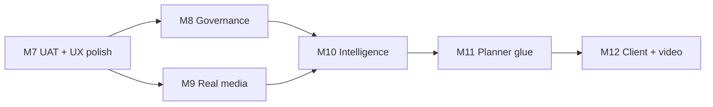

# Content Marketing M7–M12 Professionalization — Implementation Plan

> **For agentic workers:** REQUIRED SUB-SKILL: Use `superpowers:subagent-driven-development` (recommended) or `superpowers:executing-plans` to implement this plan task-by-task. Steps use checkbox (`- [ ]`) syntax for tracking.

**Goal:** Đưa Content Marketing OS từ M6 (flow đủ, UX mỏng, media stub) lên **agency-grade + cạnh tranh HubSpot/Jasper** qua 6 milestone: sign-off P0, governance, media thật, intelligence, planner glue, client gate/video.

**Architecture:** Tiếp tục vertical slices M0–M6 — mỗi milestone = BE endpoints + FE component + smoke + UAT delta. Không refactor module; mở rộng `content-marketing/*` và `components/content-os/*`. Media M9 tách provider interface + storage adapter.

**Tech Stack:** NestJS `ptt-crm-api`, Next.js `ops-web`, PostgreSQL `cmkt_*`, S3-compatible storage, Replicate/Flux (M9), `@dnd-kit/core` (calendar M7), env `PTT_CONTENT_MARKETING_*` / `PTT_CMKT_*`.

**Spec baseline:** [`2026-08-09-content-marketing-implementation-status.md`](../specs/2026-08-09-content-marketing-implementation-status.md) · design v1.5 Phụ lục D · integration spec §18.

## Global Constraints

- **BR-CMKT-01:** Không `published` khi chưa `approved_internal`.
- **BR-CMKT-02:** Không auto-post social/email/OA.
- **BR-CMKT-06/08:** Media + visual gates giữ nguyên; M9 chỉ thay provider, không nới gate.
- **BR-AI-01:** AI chỉ draft — human approve/send/publish.
- **API prefix:** `api/crm/service-lifecycle/:lifecycleId/content-marketing/*` — không đổi.
- **Pilot slug:** `PTT_CONTENT_MARKETING_SLUGS=tiep-thi-noi-dung` until GA.
- **Commit policy:** Chỉ commit khi user yêu cầu; mỗi milestone smoke PASS trước merge.
- **Không breaking:** Tab `ai-planner` và SEO/EM modules không regression khi CMKT flag off.

---

## Timeline & dependencies



| Milestone | Tuần | Effort | Gate |
|-----------|------|--------|------|
| M7 | 1–2 | 1 BE + 1 FE | UAT P0 signed + `p0.sh` |
| M8 | 3–4 | 1 BE + 1 FE | `smoke_content_marketing_m8_governance.sh` |
| M9 | 5–7 | 1 BE + 0.5 DevOps | `p2_media.sh` CDN assert |
| M10 | 8–10 | 1 BE + 1 FE | Intelligence smoke |
| M11 | 11–12 | 1 BE + 1 FE | Planner E2E link |
| M12 | 13–16 | 1 BE + 1 FE + video vendor | P2 UAT subset |

---

## M7 — P0 sign-off & UX polish core

**User outcome:** PO ký checklist 18 bước; board có badge; calendar drag; audit tab; publish lỗi rõ.

### Task M7-1: UAT runner script

**Files:**
- Create: `scripts/run_content_marketing_uat.sh`
- Create: `docs/runbooks/content-marketing-uat-p0.md`

**Interfaces:**
- Consumes: existing `smoke_content_marketing_p0.sh`, env `STAFF_JWT`, `LIFECYCLE_ID`
- Produces: exit 0 + markdown report path printed to stdout

- [ ] **Step 1:** Wrap `p0.sh` + optional manual step prompts; ghi kết quả vào `docs/exports/cmkt-uat-p0-$(date +%Y%m%d).md`
- [ ] **Step 2:** Thêm step reject-no-comment curl assert (400)
- [ ] **Step 3:** Run on staging: `STAFF_JWT=... LIFECYCLE_ID=... bash scripts/run_content_marketing_uat.sh`
- [ ] **Step 4:** PO sign-off checkbox trong runbook

---

### Task M7-2: URL query sync (`?view=` / `&id=`)

**Files:**
- Create: `services/ops-web/src/lib/use-content-os-view-params.ts`
- Modify: `services/ops-web/src/components/content-os/ContentOsPanel.tsx`

**Interfaces:**
- Produces: `useContentOsViewParams()` → `{ view, itemId, setView, openItem, closeDrawer }`
- Maps: `overview|ideas|board|review|calendar|repurpose` ↔ query `view`

- [ ] **Step 1:** Read `useSearchParams` / `useRouter` — sync `view` on tab click
- [ ] **Step 2:** `openItem(id)` sets `view=item&id=` (drawer open, board context preserved)
- [ ] **Step 3:** Deep link `/crm/service-delivery/3?tab=content-os&view=review` loads Review on mount
- [ ] **Step 4:** Manual: refresh page stays on same sub-view

---

### Task M7-3: Board card badges + dual gate chips

**Files:**
- Create: `services/ops-web/src/components/content-os/ContentOsBoardCard.tsx`
- Create: `services/ops-web/src/lib/content-os-status.ts` (colors + labels)
- Modify: `ContentOsPanel.tsx` board column map

**Interfaces:**
- Produces: `statusBadge(status)`, `dualGateChips(item)` → `{ textOk, visualOk }`

- [ ] **Step 1:** Map status → PTT token colors (draft/in_review/approved/scheduled/published)
- [ ] **Step 2:** Carousel/video_script/needs_visual → chip Text ✓ when `approved_internal+`; Visual when `visual_status=approved`
- [ ] **Step 3:** Replace inline board `<button>` with `ContentOsBoardCard`
- [ ] **Step 4:** Visual check on staging carousel item post-M6

---

### Task M7-4: Calendar week grid + drag-drop

**Files:**
- Modify: `services/ops-web/package.json` — add `@dnd-kit/core`, `@dnd-kit/sortable` if absent
- Create: `services/ops-web/src/components/content-os/ContentOsCalendarGrid.tsx`
- Modify: `ContentOsCalendarView.tsx` — keep form fallback for mobile

**Interfaces:**
- Consumes: `putContentOsCalendarSlot(token, lifecycleId, itemId, { scheduled_at })`
- Produces: week grid Mon–Sun; drop zone per day cell

- [ ] **Step 1:** Fetch calendar + approved items (existing API)
- [ ] **Step 2:** Render 7-day strip; draggable approved cards
- [ ] **Step 3:** On drop → PUT slot with ISO datetime noon local
- [ ] **Step 4:** UAT step 14: drag 2 items → status `scheduled`

---

### Task M7-5: Audit panel (FE)

**Files:**
- Create: `services/ops-web/src/components/content-os/ContentOsAuditPanel.tsx`
- Modify: `ContentOsPanel.tsx` — sub-view `audit` or Overview section expand
- Uses: existing `fetchContentOsAudit` in `content-os-api.ts`

- [ ] **Step 1:** Table columns: item_id, change_reason, changed_by, ai_run_id (link), created_at
- [ ] **Step 2:** Filter limit 50; cap `crm_content.qa` or `view`
- [ ] **Step 3:** UAT step 18: ≥1 row after generate job

---

### Task M7-6: Publish gate error UX (EC-UX-07)

**Files:**
- Modify: `services/ops-web/src/components/content-os/ContentOsPanel.tsx` — `onPublishItem`
- Modify: `services/ops-web/src/lib/content-os-api.ts` — optional helper `parseCmktGateError(err)`

- [ ] **Step 1:** Map API errors: `visual_not_approved`, `production_not_done`, `invalid_transition` → Vietnamese toast cụ thể
- [ ] **Step 2:** Carousel chưa visual approve → toast liệt kê "Cần duyệt visual (tab Media AI)"
- [ ] **Step 3:** Manual test publish blocked paths

---

### Task M7-7: Generate job retry UX (EC-UX-04)

**Files:**
- Modify: `ContentOsGeneratePanel.tsx`

- [ ] **Step 1:** On job failed — keep editor markdown unchanged
- [ ] **Step 2:** Show Retry button re-invoking same params
- [ ] **Step 3:** Optional banner "Đang dùng template fallback" when `output_json.fallback=true` (extend worker if needed)

**M7 gate:** `bash scripts/smoke_content_marketing_p0.sh` + signed UAT P0 runbook.

---

## M8 — Governance (assign, comments, diff)

**User outcome:** Lead assign SP/QA; QA thread comments; approve có diff.

### Task M8-1: Assign SP/QA (BE + FE)

**Files:**
- Modify: `content-item.service.ts` — allow patch `assignee_sp`, `assignee_qa` (cap `crm_content.assign`)
- Modify: `content-marketing.controller.ts` — document in PATCH body
- Create: `ContentOsAssigneePicker.tsx`
- Modify: drawer header in `ContentOsPanel.tsx`

- [ ] **Step 1:** PATCH validation: assignee must be staff id or null
- [ ] **Step 2:** GET items?assignee= filter already exists — verify SQL path
- [ ] **Step 3:** FE staff select (reuse pattern from `/crm/staff` combobox if exists, else numeric + name lookup)
- [ ] **Step 4:** Board filter dropdown "Chỉ của tôi" when assignee_sp matches user

**Test:** `content-item.service.spec.ts` patch assignee

---

### Task M8-2: Comments API + drawer tab

**Files:**
- Create: `content-comments.service.ts`
- Modify: `content-marketing.controller.ts`:
  - `GET items/:itemId/comments`
  - `POST items/:itemId/comments` body `{ body, visibility?: 'internal' }`
- Create: `ContentOsCommentsPanel.tsx`
- Modify: `ContentOsPanel.tsx` — drawer tab `comments`

- [ ] **Step 1:** Repository methods `listComments`, `insertComment` (PG path exists partially)
- [ ] **Step 2:** Reject workflow inserts comment — unify with POST API
- [ ] **Step 3:** FE thread list + reply form (cap write)
- [ ] **Step 4:** Create `scripts/smoke_content_marketing_m8_governance.sh` — post comment + get list

---

### Task M8-3: Version diff

**Files:**
- Create: `content-version-diff.util.ts` + spec (line-based diff markdown)
- Modify: `content-item.service.ts` — `GET items/:id/versions/compare?v1=&v2=`
- Create: `ContentOsVersionDiff.tsx`
- Modify: Versions tab — select 2 versions → Compare

- [ ] **Step 1:** Util returns `{ lines: { type: 'add'|'del'|'same', text }[] }`
- [ ] **Step 2:** FE render monospace diff (reuse pattern from git diff UI elsewhere in ops-web if any)
- [ ] **Step 3:** Review queue "Mở" → optional tab diff latest vs previous

**M8 gate:** smoke m8 + UAT steps 13 assign + 16 comments partial

---

## M9 — Media production-grade

**User outcome:** Ảnh trên CDN PTT; watermark server; QA extensible; không picsum.

### Task M9-1: Provider interface + Replicate adapter

**Files:**
- Create: `content-media-provider.interface.ts`
- Modify: `content-media-image.provider.ts` — split `StubMediaProvider`, `ReplicateMediaProvider`
- Modify: `content-marketing.module.ts` — factory by `PTT_CMKT_IMAGE_PROVIDER`

**Env:**
```bash
PTT_CMKT_IMAGE_PROVIDER=replicate|stub
REPLICATE_API_TOKEN=...
PTT_CMKT_IMAGE_MODEL=black-forest-labs/flux-schnell
```

- [ ] **Step 1:** Interface `generateImages(input): Promise<CmktMediaAsset[]>`
- [ ] **Step 2:** Replicate call + download buffer
- [ ] **Step 3:** Unit test mock HTTP — no live API in CI

---

### Task M9-2: S3 storage service

**Files:**
- Create: `content-media-storage.service.ts`
- Modify: `content-job-worker.service.ts` — after generate, upload bytes → CDN URL in `media_json`

**Env:** `PTT_CMKT_S3_BUCKET`, `AWS_ACCESS_KEY_ID`, `AWS_SECRET_ACCESS_KEY`, `PTT_CMKT_CDN_BASE`

- [ ] **Step 1:** Upload `{lifecycleId}/{itemId}/{assetId}.webp`
- [ ] **Step 2:** Persist `provider_request_id` in asset meta for EC-MEDIA-06
- [ ] **Step 3:** Update `p2_media.sh` assert URL contains CDN host not `picsum.photos`

---

### Task M9-3: Server-side DRAFT watermark

**Files:**
- Create: `content-media-watermark.util.ts` (sharp overlay text "DRAFT")
- Modify: worker — watermark when `draftWatermark || visual_status !== 'approved'`

- [ ] **Step 1:** Watermarked asset until visual approve; on approve optionally re-fetch clean asset from provider cache
- [ ] **Step 2:** EC-MEDIA-03 manual UAT

---

### Task M9-4: Visual QA service (extensible rules)

**Files:**
- Create: `content-visual-qa.service.ts`
- Modify: `content-media.util.ts` — delegate scoring to service
- Rules stub: min dimension match channel spec, asset count, placeholder OCR hook

- [ ] **Step 1:** Score 0–100 + `checks: { dimensions_ok, assets_present }`
- [ ] **Step 2:** Block approve <50 unless override (existing visual service)
- [ ] **Step 3:** Spec §24.8 OCR/ΔE — interface only; implement ΔE in M11 if Brand KB palette API ready

---

### Task M9-5: Async media job polling FE

**Files:**
- Modify: `content-media-generate.service.ts` — optional async mode (queue job, return immediately)
- Modify: `ContentOsMediaStudio.tsx` — poll `fetchContentOsJob` until terminal state

**M9 gate:** staging carousel with real CDN URL + visual approve + publish

---

## M10 — Intelligence closed-loop

**User outcome:** Leader nhập metrics; dashboard kênh; gợi ý topic.

### Task M10-1: Metrics CRUD

**Files:**
- Create: `content-metrics.service.ts`
- Controller: `POST/PATCH/GET items/:id/metrics`, `GET metrics/summary`
- DDL: verify `cmkt_content_metrics` columns match spec §8

---

### Task M10-2: Intelligence aggregate

**Files:**
- Create: `content-intelligence.service.ts`
- Controller: `GET /intelligence?range=30d`
- Join: items published + metrics + channel; optional SEO/EM metrics hooks (read-only)

**Response shape:**
```typescript
type CmktIntelligenceResponse = {
  by_channel: Record<string, { published: number; avg_engagement?: number }>;
  top_items: Array<{ item_id: number; title: string; score: number }>;
  suggestions: string[];
};
```

---

### Task M10-3: FE Intelligence tab

**Files:**
- Create: `ContentOsIntelligenceView.tsx`
- Modify: `ContentOsPanel.tsx` sub-nav Intelligence (cap Lead/QA)
- Create: `scripts/smoke_content_marketing_m10_intelligence.sh`

**M10 gate:** POST metric → GET intelligence reflects row

---

## M11 — Planner glue & professional export

### Task M11-1: Planner deep link (EC-UX-08)

**Files:**
- Modify: MKT-AI planner FE toast after Apply — link `?tab=content-os&view=ideas&import=planner`
- Modify: `ContentOsSnapshotBanner.tsx` — on mount if `import=planner` open ingest modal

---

### Task M11-2: Pillar management UI

**Files:**
- Create: `ContentOsPillarsView.tsx` (sub-view or Ideas sidebar)
- BE: `GET/PATCH /pillars` if not exists — mirror `cmkt_content_pillars`

---

### Task M11-3: AI 30 ideas job

**Files:**
- Job type `ideas_bulk` in worker + `content-idea.service.ts` `startBulkIdeasJob`
- Prompt util profile `ideas_monthly`
- FE: Ideas view button "AI 30 ideas tháng" (cap generate)

---

### Task M11-4: PDF design brief export

**Files:**
- Modify: `content-production.service.ts` — `exportDesignBriefPdf` using existing PDF util in repo (grep `pdfkit` / `puppeteer`)
- FE: Production panel "Export PDF"

---

### Task M11-5: SEO published URL sync

**Files:**
- Create: `content-seo-bridge-sync.service.ts` — cron or webhook handler
- PATCH item `published_url` when SEO content reaches published state

**M11 gate:** E2E Planner Apply → deep link → ingest → pillar visible

---

## M12 — P2 client gate & video (backlog structured)

### Task M12-1: Client approval workflow (UC-015)

**Files:**
- Extend status machine: `pending_client`, `client_approved`
- `content-workflow.service.ts` transitions + guards when `PTT_CONTENT_MARKETING_CLIENT_GATE=1`
- FE banner "Chờ KH duyệt"

---

### Task M12-2: Portal read-only summary (UC-030)

**Files:**
- Portal route pattern follow MKTP-UC-023
- `GET /portal/lifecycle/:id/content-summary`

---

### Task M12-3: Short video job (UC-036)

**Files:**
- Job `video_short_generate` — script + TTS + stock clips stub
- FE Media Studio button disabled until `PTT_CMKT_VIDEO_GEN=1`
- Progress bar UX-CMKT-06

**M12 gate:** P2 UAT subset documented in `11-CMKT-ACTIONS.md` appendix

---

## Testing matrix M7–M12

| Milestone | Unit | Smoke | Manual UAT |
|-----------|------|-------|------------|
| M7 | status util | p0 + uat runner | 18 bước sign |
| M8 | diff util, comments | m8_governance | assign + comments |
| M9 | provider mock, watermark | p2_media CDN | P1 walkthrough 1–8 real assets |
| M10 | intelligence aggregate | m10 | Intelligence tab |
| M11 | ideas_bulk prompt | m11 planner link | Import deep link |
| M12 | video worker mock | m12 partial | Client gate |

---

## Staging deploy checklist (M7+)

1. Apply DDL if migration (metrics indexes, comments indexes)
2. Update `deploy/runtime.env` flags per milestone
3. `npm test -- --testPathPattern=content-marketing`
4. `npm run build` api + ops-web
5. `APPLY=1 ./scripts/deploy_content_marketing_staging.sh`
6. Run milestone smoke with `STAFF_TOKEN`
7. PO sign milestone before next

**Env block M9 staging add-on:**
```bash
PTT_CONTENT_MARKETING_MEDIA_ENABLED=1
PTT_CMKT_IMAGE_GEN=1
PTT_CMKT_IMAGE_PROVIDER=replicate
PTT_CMKT_S3_BUCKET=ptt-cmkt-staging
PTT_CMKT_CDN_BASE=https://cdn.pttads.vn/cmkt
```

---

## Self-review (spec coverage)

| Spec section | Task |
|--------------|------|
| EC-UX-04–08 | M7-6, M7-7, M11-1 |
| UC-013, 016, 017 | M8 |
| UC-035, 037, §24.8 | M9 |
| UC-022, 023, SCR-005 | M10 |
| UC-003, 005, 019, 027 | M11 |
| UC-015, 030, 036 | M12 |
| BR-CMKT-03, 04 | M8 brief modal (M7-7 start), M11 consent flag |

---

*Plan version 1.0 · 2026-08-09 · Baseline staging `356ce00`*
