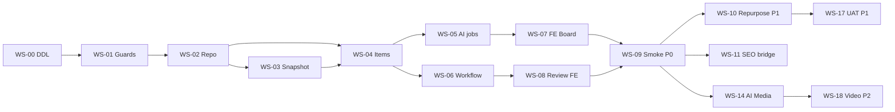

# Content Marketing OS — Kế hoạch triển khai `ContentMarketingModule` (Phase 0 → 3)

> **Coding execution (vertical slices · UAT-gated):** [`2026-08-09-content-marketing-coding-milestones.md`](./2026-08-09-content-marketing-coding-milestones.md) — **dùng plan này khi implement**; plan WS bên dưới là map phase/timeline.  
> **For agentic workers:** REQUIRED SUB-SKILL: Use `superpowers:subagent-driven-development` (recommended) hoặc `superpowers:executing-plans` để thực thi từng workstream. Mỗi WS có exit criteria, smoke script và trace UC.

**Goal:** Triển khai module Nest **`ContentMarketingModule`** + tab **`content-os`** trên service-delivery — EXECUTE layer tách khỏi MKT-AI Planner — pilot slug `tiep-thi-noi-dung` trên staging, mở rộng GA theo phase.

**Architecture:** Hub-and-spoke: Content OS đọc **Planner snapshot frozen** (không circular import); bridge **SEO** / **Email** / **Creatives** qua adapter; workflow Leader duyệt 2 lớp (text §22 + visual §24); AI jobs pattern `cmkt_content_jobs` + `ai_agent_runs` giống `mkt_ai_jobs`.

**Tech stack:** NestJS (`services/ptt-crm-api`), Next.js (`services/ops-web`), PostgreSQL (DDL `cmkt_*`), env flags (`PTT_CONTENT_MARKETING_*`), staff RBAC caps, smoke bash scripts, staging VPS `rs.pttads.vn`.

**Spec canonical:** [`docs/superpowers/specs/2026-08-09-content-marketing-os-design.md`](../specs/2026-08-09-content-marketing-os-design.md) (v1.4)

## Global Constraints

- **BR-CMKT-01:** Không `published` khi chưa `approved_internal`.
- **BR-CMKT-02:** Không auto-post social/email/OA.
- **BR-CMKT-06:** AI media job chỉ sau copy/script `approved_internal` (carousel draft watermark ngoại lệ §24).
- **BR-CMKT-08:** `needs_visual` / `video_script` → `visual_status=approved` trước publish (P1+).
- **BR-AI-01:** AI chỉ draft — human approve/send/publish.
- **API prefix:** `api/crm/service-lifecycle/:lifecycleId/content-marketing/*` — không đổi.
- **Pilot slug:** `PTT_CONTENT_MARKETING_SLUGS=tiep-thi-noi-dung` until GA sign-off.
- **Không import ngược** `MarketingAiPlannerModule` từ Planner vào Content mutate draft — chỉ read snapshot service.
- **Commit policy:** Chỉ commit khi user yêu cầu; mỗi WS xong chạy smoke trước merge.

---

## 0. Tổng quan phase & timeline

| Phase | Tuần | Workstreams | UC chính | Exit |
|-------|------|-------------|----------|------|
| **P0 Foundation** | 1–3 | WS-00…06 | CMKT-UC-001…014, 021, 028, 029 | Smoke P0 PASS staging |
| **P1 Execute+Media** | 4–7 | WS-07…12 | UC-015…020, 031…038, 035, 037 | UAT retainer 1 lifecycle |
| **P2 Intelligence+Video** | 8–11 | WS-13…16 | UC-022…026, 036 | Metrics + video demo |
| **P3 Scale** | 12–16 | WS-17…18 | UC-030, multi-slug GA | PO sign-off GA |

**Effort ước lượng:** 1 BE + 1 FE full-time · QA 0.25 · PO/UAT cuối mỗi phase.

---

## 1. Baseline tái sử dụng (đã có trong RNOSAI)

| Artifact | Path | Dùng cho |
|----------|------|----------|
| Planner snapshot / apply | `marketing-ai-planner/` · `GET applied plan` | WS-03 ingest |
| Brand KB RAG | `marketing-ai-rag.service.ts` | WS-04 generate context |
| AI runner | `ai_agent_runs` pattern | WS-04 jobs |
| SEO pipeline | `seo-content/` | WS-08 bridge |
| Email campaigns | `email-marketing/` | WS-09 bridge |
| Creatives | `creatives/` | WS-10 paid visual |
| Service delivery tab | `ops-web/.../service-delivery/[id]/page.tsx` | WS-05 |
| MKT-AI guards pattern | `guards/staff-marketing-ai-planner.guard.ts` | WS-01 guards |
| DDL apply script pattern | `scripts/apply_pg_ddl_mkt_ai_planner.sh` | WS-00 |
| Deploy staging | `scripts/deploy_*` (theo repo hiện tại) | WS-06 |

---

## 2. File map (tạo mới)

```
services/ptt-crm-api/src/content-marketing/
├── content-marketing.module.ts
├── content-marketing.controller.ts
├── content-marketing.service.ts
├── content-marketing.repository.ts
├── content-marketing.types.ts
├── content-marketing.constants.ts
├── content-marketing-channel.util.ts          # §12 validation
├── content-marketing-channel.util.spec.ts
├── content-marketing-prompt.util.ts           # §12.4 profiles
├── content-marketing.util.ts
├── guards/staff-content-*.guard.ts            # 4 guards
├── content-plan-snapshot.service.ts
├── content-brand-context.service.ts
├── content-idea.service.ts
├── content-item.service.ts
├── content-calendar.service.ts
├── content-workflow.service.ts                # §22 approve/reject/review-queue
├── content-generate.service.ts
├── content-job-worker.service.ts                # async poll pattern MKT-AI
├── content-repurpose.service.ts               # P1
├── content-seo-bridge.service.ts              # P1
├── content-email-bridge.service.ts            # P1
├── content-production.service.ts              # §23
├── content-media-generate.service.ts          # §24 P1
├── content-media-image.provider.ts
├── content-media-video.provider.ts            # P2
├── content-intelligence.service.ts            # P2
└── *.spec.ts

docs/specs/2026-08-09-postgresql-ddl-content-marketing.sql
scripts/apply_pg_ddl_content_marketing.sh
scripts/smoke_content_marketing_p0.sh
scripts/smoke_content_marketing_p1.sh
scripts/run_content_marketing_uat.sh

services/ops-web/src/components/content-os/*     # §14 component map
services/ops-web/src/lib/content-marketing-flags.ts
services/ops-web/src/lib/content-os-api.ts

docs/use-cases/11-CONTENT-MARKETING.md           # catalog UC
docs/specs/modules/RNOSAI-BA-CMKT-UseCases.md
```

---

## 3. Workstreams chi tiết

### WS-CMKT-00 — DDL + flags + module scaffold (Tuần 1 · Days 1–3)

**UC:** — (infra)  
**Owner:** BE

**Files:**
- Create: `docs/specs/2026-08-09-postgresql-ddl-content-marketing.sql`
- Create: `scripts/apply_pg_ddl_content_marketing.sh`
- Create: `services/ptt-crm-api/src/content-marketing/content-marketing.module.ts` (+ empty controller/service)
- Modify: `services/ptt-crm-api/src/app.module.ts`
- Modify: `services/ptt-crm-api/src/config/app-config.service.ts`

**DDL bảng (theo spec §8):**
- `cmkt_plan_snapshots`
- `cmkt_content_pillars`
- `cmkt_content_ideas`
- `cmkt_content_items` (+ CHECK channel/format §8.2.1, `in_review_at`)
- `cmkt_content_item_versions`
- `cmkt_content_item_derivations`
- `cmkt_calendar_slots`
- `cmkt_content_comments`
- `cmkt_content_metrics`
- `cmkt_content_jobs`
- Optional P0: `cmkt_workflow_events` (hoặc audit JSON trên versions)

**Env flags (`app-config.service.ts`):**

```typescript
// PTT_CONTENT_MARKETING_ENABLED, PTT_CONTENT_MARKETING_SLUGS,
// PTT_CONTENT_MARKETING_FE mirrors in ops-web NEXT_PUBLIC_CONTENT_MARKETING
```

**Tasks:**

- [ ] **T00-1:** Viết DDL đầy đủ + CHECK constraints §12.2 / §8.2.1
- [ ] **T00-2:** Script `apply_pg_ddl_content_marketing.sh` idempotent (giống mkt-ai planner)
- [ ] **T00-3:** Scaffold module; `@Controller` prefix; module chỉ load khi `PTT_CONTENT_MARKETING_ENABLED=1`
- [ ] **T00-4:** `GET .../content-marketing/health` → `{ ok: true, enabled: true }`
- [ ] **T00-5:** Apply DDL staging DB + verify `\d cmkt_content_items`

**Exit:** API health 200 với flag on; bảng tồn tại staging.

---

### WS-CMKT-01 — RBAC caps + guards (Tuần 1 · Day 4)

**UC:** CMKT-UC-001  
**Files:**
- Create: `guards/staff-content-view.guard.ts` … `staff-content-generate.guard.ts`
- Modify: staff caps seed / migration nếu repo có pattern (grep `crm_mkt_ai`)

**Caps (spec §15):**

| Cap | Guard |
|-----|-------|
| `crm_content.view` | ViewGuard |
| `crm_content.write` | WriteGuard |
| `crm_content.generate` | GenerateGuard |
| `crm_content.approve_internal` | ApproveGuard |
| `crm_content.assign` | WriteGuard + service check |
| `crm_content.publish` | WriteGuard |
| `crm_content.qa` | ApproveGuard |
| `crm_content.production` | WriteGuard (P1) |
| `crm_content.admin` | Admin endpoints |

**Tasks:**

- [ ] **T01-1:** Implement 4 guards mirror `staff-marketing-ai-planner.guard.ts`
- [ ] **T01-2:** Lifecycle slug allowlist check trong service base (`tiep-thi-noi-dung`)
- [ ] **T01-3:** Unit test guard deny/allow

**Exit:** 403 khi thiếu cap; 404 khi slug không trong allowlist.

---

### WS-CMKT-02 — Repository + channel util + types (Tuần 1 · Days 5–7)

**UC:** CMKT-UC-006 foundation  
**Files:**
- Create: `content-marketing.types.ts`, `content-marketing.repository.ts`, `content-marketing-channel.util.ts`

**Interfaces (Produces):**

```typescript
export type CmktChannel = 'website' | 'facebook' | ...; // §12.2
export type CmktFormat = 'blog' | 'social_post' | ...;
export function assertValidChannelFormat(channel: CmktChannel, format: CmktFormat): void;
export class ContentMarketingRepository {
  findItems(lifecycleId: number, filters: CmktItemFilters): Promise<CmktItemRow[]>;
  insertItem(row: InsertCmktItem): Promise<CmktItemRow>;
  // ... ideas, versions, jobs CRUD
}
```

**Tasks:**

- [ ] **T02-1:** `content-marketing-channel.util.spec.ts` — matrix §12.1 all valid/invalid pairs
- [ ] **T02-2:** Repository CRUD items + ideas + versions
- [ ] **T02-3:** Error code `CMKT_INVALID_CHANNEL_FORMAT` → HTTP 400

**Exit:** Unit tests PASS; insert item `website/blog` OK; `facebook/blog` reject.

---

### WS-CMKT-03 — Planner snapshot ingest (Tuần 2 · Days 1–3)

**UC:** CMKT-UC-002, CMKT-UC-003  
**Files:**
- Create: `content-plan-snapshot.service.ts`
- Read-only: query `marketing_ai` applied plan (pattern từ repository planner — **không** inject PlannerModule nếu tránh cycle; dùng SQL read hoặc thin `ContentPlanSnapshotReader`)

**API:**
- `GET /plan-snapshot`
- `POST /plan-snapshot/ingest`
- `POST /plan-snapshot/seal`

**Tasks:**

- [ ] **T03-1:** Map `content_json.calendar` → ideas §12.7
- [ ] **T03-2:** `source_hash` drift detection §11.3
- [ ] **T03-3:** Integration test với lifecycle có TMMT applied (staging LIFECYCLE_ID)

**Exit:** Ingest tạo ≥1 pillar + ideas; hash mismatch → warning in context.

---

### WS-CMKT-04 — Ideas + Items API + context (Tuần 2 · Days 4–7)

**UC:** CMKT-UC-001, 004, 006, 009, 011, 012, 021  
**Files:**
- Create: `content-idea.service.ts`, `content-item.service.ts`, `content-calendar.service.ts`
- Modify: `content-marketing.controller.ts`

**Endpoints (spec §9):**
- `GET /context`
- Ideas CRUD §9.2
- Items CRUD §9.3
- Calendar §9.5
- `POST /items/:id/publish`

**Tasks:**

- [ ] **T04-1:** Context payload: snapshot summary, counts by status, channel_defaults §12.6
- [ ] **T04-2:** Status machine transitions §8.3 (draft only — approve in WS-05)
- [ ] **T04-3:** Calendar PUT/DELETE slots
- [ ] **T04-4:** `content-marketing.service.spec.ts` context + item create

**Exit:** Postman/smoke steps 1–3 pass (context, ingest, create item).

---

### WS-CMKT-05 — AI generate + jobs + fallback (Tuần 3 · Days 1–4)

**UC:** CMKT-UC-007, 008, 010, 028, 029  
**Files:**
- Create: `content-generate.service.ts`, `content-job-worker.service.ts`, `content-brand-context.service.ts`, `content-marketing-prompt.util.ts`

**Pattern:** Copy từ `marketing-ai-orchestrator.service.ts` + job worker — job types P0: `draft_generate`, `variant_generate`, `idea_batch` (stub P1).

**Tasks:**

- [ ] **T05-1:** `ContentBrandContext` inject Brand KB chunks (read RAG service optional flag)
- [ ] **T05-2:** Prompt profiles P0: `blog_seo`, `social_fb`, `social_li`, `script_short` §12.4
- [ ] **T05-3:** `POST /items/:id/jobs/draft`, `GET /jobs/:jobId`
- [ ] **T05-4:** Fallback template khi LLM fail §10.3
- [ ] **T05-5:** Ghi `ai_agent_runs` + version row on success

**Exit:** Draft job returns body markdown; variants ≥3 for social; audit has ai_run_id.

---

### WS-CMKT-06 — Workflow + Review queue (Tuần 3 · Days 5–7)

**UC:** CMKT-UC-013, 014, 016, 017, §22  
**Files:**
- Create: `content-workflow.service.ts`

**Endpoints:**
- `POST /items/:id/submit-review`
- `POST /items/:id/approve`, `/reject`
- `GET /review-queue`, `/review-queue/summary`
- Comments §9.9

**Tasks:**

- [ ] **T06-1:** Reject requires comment min 10 chars (BR-CMKT-03)
- [ ] **T06-2:** Set `in_review_at` on submit; SLA breach calc §22.3
- [ ] **T06-3:** Version diff on `GET /items/:id/versions`
- [ ] **T06-4:** EC-CMKT-LDR-01…04 tests

**Exit:** Full workflow draft→in_review→approved_internal; SP cannot approve (403).

---

### WS-CMKT-07 — FE Content Board P0 (Tuần 2–3 parallel FE)

**UC:** CMKT-UC-001, UI §14  
**Files:**
- Create: `services/ops-web/src/lib/content-marketing-flags.ts`
- Create: `services/ops-web/src/lib/content-os-api.ts`
- Create: `components/content-os/*` (Panel, Nav, Overview, IdeaBank, Calendar, Kanban, ItemDrawer, GeneratePanel, VariantsPicker, ChannelPicker)
- Modify: `service-delivery/[id]/page.tsx` — tab `content-os`

**Tasks:**

- [ ] **T07-1:** Tab visible: `NEXT_PUBLIC_CONTENT_MARKETING=1` + cap + slug from context
- [ ] **T07-2:** Sub-views: overview, ideas, calendar, board
- [ ] **T07-3:** Item drawer: generate, edit, submit review
- [ ] **T07-4:** `ContentOsChannelPicker` — matrix §12.1 disabled combos
- [ ] **T07-5:** Deep link `?tab=content-os&view=ideas&import=planner`

**Exit:** Manual UAT — create item FB social_post, generate, submit review on staging UI.

---

### WS-CMKT-08 — FE Review queue (Tuần 3 · Day 7)

**UC:** §22 SCR-CMKT-007  
**Files:**
- Create: `ContentOsReviewQueue.tsx`

**Tasks:**

- [ ] **T08-1:** Tab `view=review` hidden without approve cap
- [ ] **T08-2:** SLA badge sort; approve/reject modals
- [ ] **T08-3:** Link to item drawer Review tab

**Exit:** EC-CMKT-LDR-01, 05 on UI.

---

### WS-CMKT-09 — Smoke P0 + staging deploy (Tuần 3 · end)

**Files:**
- Create: `scripts/smoke_content_marketing_p0.sh`

**Script steps (spec §19.1 + channel §12):**

```bash
# Preconditions: PTT_CONTENT_MARKETING_ENABLED=1, LIFECYCLE_ID, STAFF_TOKEN
# 1. GET context → ok
# 2. POST plan-snapshot/ingest → ideas > 0
# 3. POST items { channel, format } valid
# 4. POST jobs/draft → wait succeeded
# 5. PATCH body → submit-review → approve
# 6. PUT calendar → publish
# 7. GET audit → ai_run present
# 8. POST invalid channel+format → 400
```

**Tasks:**

- [ ] **T09-1:** Wire env staging `runtime.env`
- [ ] **T09-2:** Deploy API + ops-web; restart API before smoke
- [ ] **T09-3:** Document trong `docs/runbooks/` hoặc spec §19 UAT checklist

**Exit criteria P0:** Smoke PASS on `rs.pttads.vn`; EC-CMKT-01…12 + LDR-01…04.

---

## 4. Phase 1 Workstreams (Tuần 4–7)

### WS-CMKT-10 — Repurpose engine (UC-018)

**Files:** `content-repurpose.service.ts`, `ContentOsRepurposeWizard.tsx`

- [ ] Transforms §12.4 (`blog_to_social_fb`, …)
- [ ] `cmkt_content_item_derivations` lineage
- [ ] Parent approve ≠ auto-approve child

**Exit:** 1 blog → 3 derived items with parent link.

---

### WS-CMKT-11 — SEO bridge (UC-019)

**Files:** `content-seo-bridge.service.ts`

- [ ] `POST /items/:id/bridge/seo` → `SeoContentService` adapter
- [ ] Store `seo_bridge_id`; status chip FE
- [ ] Idempotent re-bridge

**Exit:** Blog item → SEO pipeline row created; link opens `/seo/content/[id]`.

---

### WS-CMKT-12 — Email bridge (UC-020)

**Files:** `content-email-bridge.service.ts`

- [ ] `POST /items/:id/bridge/email`
- [ ] Draft campaign in EM module

**Exit:** Email item → `/email/campaigns/[id]` draft.

---

### WS-CMKT-13 — Production handoff §23 (UC-031…034)

**Files:** `content-production.service.ts`, `ContentOsProductionPanel.tsx`

- [ ] `production_json` PATCH §23.4
- [ ] Assign designer/video; export brief/script PDF
- [ ] Link creative for `meta_ads`
- [ ] BR-CMKT-05 gate publish

**Exit:** Carousel item blocked publish until `production.phase=done`.

---

### WS-CMKT-14 — AI Media image §24 (UC-035, 037, 038)

**Files:** `content-media-generate.service.ts`, `content-media-image.provider.ts`, `ContentOsMediaStudio.tsx`

**Flags:** `PTT_CMKT_MEDIA_ENABLED=1`, `PTT_CMKT_IMAGE_GEN=1`

- [ ] Jobs: `image_generate`, `carousel_slides_generate`, `visual_qa_score`
- [ ] Provider adapter (stub + real flux/openai behind env)
- [ ] S3/CDN upload util
- [ ] Visual approve flow §24.5 (`visual_status`)
- [ ] DRAFT watermark BR-CMKT-07
- [ ] Daily cap per lifecycle §24.9

**Exit:** EC-CMKT-MEDIA-01…06; image after text approved.

---

### WS-CMKT-15 — Client approval gate (UC-015) + idea batch (UC-005)

- [ ] `PTT_CMKT_CLIENT_APPROVAL_GATE` transitions `pending_client`
- [ ] `POST /jobs/ideas/batch` — 30 ideas

---

### WS-CMKT-16 — Intelligence v1 (UC-022, 023)

**Files:** `content-intelligence.service.ts`, `ContentOsIntelligence.tsx`

- [ ] Manual metrics form
- [ ] Summary by channel §13.6
- [ ] `GET /intelligence/summary`

---

### WS-CMKT-17 — Smoke P1 + UAT retainer

**Files:** `scripts/smoke_content_marketing_p1.sh`, `scripts/run_content_marketing_uat.sh`

**UAT script (1 lifecycle `tiep-thi-noi-dung` tháng 1):**

- [ ] Import Planner → 5 items tuần
- [ ] Generate + Leader approve text + visual (image)
- [ ] 1 SEO bridge + 1 social copy publish
- [ ] Repurpose 1 blog → 2 social

**Exit P1:** PO sign-off checklist §19.2 extended.

---

## 5. Phase 2 Workstreams (Tuần 8–11)

### WS-CMKT-18 — AI short video §24 (UC-036)

**Files:** `content-media-video.provider.ts`, TTS provider

- [ ] Job `video_short_generate` ≤60s
- [ ] `PTT_CMKT_VIDEO_GEN=1`
- [ ] p95 async ≤90s with progress UI

---

### WS-CMKT-19 — Intelligence closed-loop (UC-024, 025, 026)

- [ ] Weekly memo cron `PTT_CMKT_WEEKLY_MEMO_CRON`
- [ ] Drift alert vs pillars
- [ ] AI suggest next topics

---

### WS-CMKT-20 — Metrics auto-pull + GA prep

- [ ] SEO GSC / EM open rates → `cmkt_content_metrics`
- [ ] Multi-slug env expansion
- [ ] Performance indexes on `lifecycle_id`, `status`, `in_review_at`

---

## 6. Phase 3 Workstreams (Tuần 12–16)

### WS-CMKT-21 — Portal summary (UC-030)

- [ ] Read-only card portal lifecycle (pattern MKTP-UC-023)

### WS-CMKT-22 — GA sign-off + docs

- [ ] `docs/use-cases/11-CONTENT-MARKETING.md`
- [ ] `docs/specs/modules/RNOSAI-BA-CMKT-UseCases.md`
- [ ] `CreativeProductionModule` PO decision §23.6B (optional backlog)

---

## 7. Testing matrix

| Layer | P0 | P1 | P2 |
|-------|----|----|-----|
| Unit | channel util, workflow guards, prompt util | repurpose, visual QA | video provider stub |
| Integration | ingest, generate job | bridges | metrics pull |
| Smoke | `smoke_content_marketing_p0.sh` | `smoke_content_marketing_p1.sh` | extend |
| E2E | optional playwright tab load | review + media studio | — |
| Regression | `smoke_mkt_ai_plan_depth_wave3.sh` must PASS | SEO/EM isolated | — |

---

## 8. Deploy checklist (staging)

```bash
# 1. DDL
./scripts/apply_pg_ddl_content_marketing.sh

# 2. runtime.env (example)
PTT_CONTENT_MARKETING_ENABLED=1
PTT_CONTENT_MARKETING_SLUGS=tiep-thi-noi-dung
# ops-web build:
NEXT_PUBLIC_CONTENT_MARKETING=1

# 3. Restart API → smoke
./scripts/smoke_content_marketing_p0.sh
```

---

## 9. Rủi ro & mitigations (implementation)

| Rủi ro | Mitigation trong plan |
|--------|----------------------|
| Circular import Planner | WS-03 SQL read-only reader |
| AI cost spike | WS-14 daily cap; stub provider default |
| FE/BE flag mismatch | WS-00 mirror `NEXT_PUBLIC_*` |
| VPS DDL drift | WS-09 apply script in deploy |
| Scope creep P0 | WS-07…09 strict — no media until P1 |

---

## 10. Spec coverage self-review

| Spec § | Workstream |
|--------|------------|
| §6 UC-001…014, 021, 028, 029 | WS-01…09 |
| §12 Channel registry | WS-02, 07 |
| §22 Leader workflow | WS-06, 08 |
| §13 Spokes | WS-11, 12 |
| §23 Production | WS-13 |
| §24 AI Media | WS-14, 18 |
| §17 EC-CMKT / LDR / MEDIA | WS-09, 17 |
| §18 Phase 2–3 | WS-19…22 |

**Gap chủ ý:** `CreativeProductionModule` — backlog PO WS-22; không block P0 GA pilot.

---

## 11. Task dependency graph



---

**Plan complete.** Saved to `docs/superpowers/plans/2026-08-09-content-marketing-os-phase0-3.md`.

**Hai hướng thực thi:**

1. **Subagent-Driven (recommended)** — Một subagent / workstream, review giữa các WS  
2. **Inline Execution** — Làm tuần tự WS-00 → WS-09 trong session với checkpoint smoke P0

**Đề xuất bắt đầu:** WS-CMKT-00 (DDL + scaffold) ngay sau PO approve spec v1.4.
