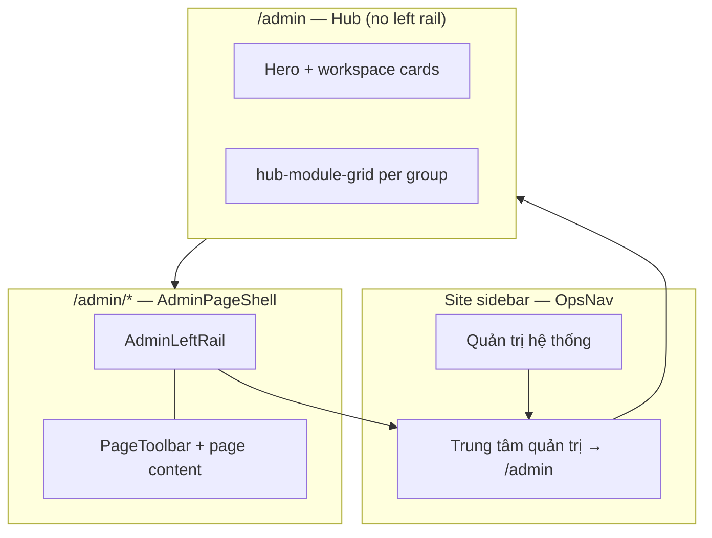

# Admin Control Plane P1 — Triển khai chi tiết

> **Trạng thái:** ✅ Shipped · **Commit:** `49e5ed8` · **Release VPS:** `ops-web-49e5ed8-20260811041435`  
> **Spec:** [`docs/specs/2026-08-11-admin-control-plane-ia.md`](../specs/2026-08-11-admin-control-plane-ia.md) §12 P1  
> **Phụ thuộc:** P0 (`47ee98f`) — `admin-nav.ts` SSoT + section sidebar  
> **App:** `services/ops-web` · **Domain:** `https://rs.pttads.vn`

---

## Mục lục

1. [Mục tiêu P1](#1-mục-tiêu-p1)
2. [Kiến trúc sau P1](#2-kiến-trúc-sau-p1)
3. [Luồng người dùng](#3-luồng-người-dùng)
4. [SSoT navigation (`admin-nav.ts`)](#4-ssot-navigation-admin-navts)
5. [Component map](#5-component-map)
6. [CSS & responsive](#6-css--responsive)
7. [Cap gating & flags](#7-cap-gating--flags)
8. [Task checklist P1-1 → P1-6](#8-task-checklist-p1-1--p1-6)
9. [Deploy VPS](#9-deploy-vps)
10. [Verify & smoke](#10-verify--smoke)
11. [Demo script — Settings tour 5 phút](#11-demo-script--settings-tour-5-phút)
12. [Exit criteria P1](#12-exit-criteria-p1)
13. [Gap so với spec (defer)](#13-gap-so-với-spec-defer)
14. [Bước tiếp P2–P3](#14-bước-tiếp-p2p3)

---

## 1. Mục tiêu P1

| As-is (P0) | Target P1 | Đã đạt |
|------------|-----------|--------|
| Sidebar liệt kê 15+ link admin | **1 entry** → `/admin` | ✅ |
| Không có hub launcher | Hub workspace cards + module grid | ✅ |
| 3 lớp subnav trùng nhau | **Left rail** duy nhất | ✅ |
| Breadcrumb “Cấu hình CRM” | **Quản trị hệ thống → …** | ✅ |
| Demo phải gõ URL | Settings tour ≤5 phút, ≤3 click/route | ✅ |

**Pitch demo:**

> Sidebar vận hành gọn — mọi setup IT/HR qua **Trung tâm quản trị**. HubSpot có Settings app; RNOSAI có **Control Plane** agency-grade với left rail persistent.

---

## 2. Kiến trúc sau P1



### Quyết định kỹ thuật

| Quyết định | Lý do |
|------------|-------|
| **Không** tạo `app/admin/layout.tsx` riêng | `AdminPageShell` đã wrap mọi trang admin con; tránh double layout với `StaffPageShell` |
| **Không** tách `AdminShell.tsx` | Left rail gắn trong `AdminPageShell` — ít refactor 20+ page files |
| Hub dùng `StaffPageShell` trực tiếp | Hub không cần left rail; breadcrumb 1 cấp |
| `showModuleNav` default `false` | Gỡ horizontal `ModuleSubNav` — thay bằng left rail |
| Subnav components return `null` | Giữ import cũ trên pages; không mass-delete |

---

## 3. Luồng người dùng

### 3.1. IT Admin — tìm “Người dùng”

```
/ (home)
  → Sidebar: Quản trị hệ thống
  → Trung tâm quản trị (/admin)
  → Card “Nhân sự & Tổ chức” HOẶC link “Người dùng”
  → /admin/crm/org/users (+ left rail active)
```

**≤ 3 click** từ sidebar.

### 3.2. Deep link vẫn hoạt động

```
/admin/crm/permissions  → AdminPageShell + left rail + breadcrumb Quản trị → Ma trận
/crm/staff              → HR vận hành (không left rail admin)
```

### 3.3. Phân tách HR vận hành vs Identity

| Workspace | Route | Left rail |
|-----------|-------|-----------|
| Roster vận hành | `/crm/staff` | ❌ |
| Login + RBAC | `/admin/crm/org/users` | ✅ |
| Bridge link | Left rail có “Hồ sơ roster” → `/crm/staff` | ✅ |

Footnote trên hub nhắc: *“Tài khoản login và phân quyền chỉ cấu hình tại đây.”*

---

## 4. SSoT navigation (`admin-nav.ts`)

**File:** `services/ops-web/src/lib/admin/admin-nav.ts`

### Public API

| Function | Consumer | Output |
|----------|----------|--------|
| `canViewAdminSection(user)` | Hub auth, OpsNav section visibility | `boolean` |
| `buildAdminSidebarLinks(user)` | `OpsNav` | `[{ href: '/admin', label: 'Trung tâm quản trị' }]` |
| `buildAdminNavGroups(user)` | `AdminLeftRail`, hub sections | `AdminNavGroup[]` |
| `buildAdminHubWorkspaces(user)` | Hub workspace cards | `AdminHubWorkspace[]` |
| `buildAdminSidebarLinksFlat(user)` | Debug / future search | flat links |
| `buildCrmConfigModuleLinksFromAdminNav(user)` | Legacy `module-nav.ts` | data + rbac links |

### Workspace groups (cap-gated)

| `id` | Label | Links chính | Cap / flag |
|------|-------|-------------|------------|
| `org` | Nhân sự & Tổ chức | users, onboard, dept, team, positions, chart, `/crm/staff` | `WIN_ORG_UI` + org caps |
| `rbac` | Phân quyền & Bảo mật | matrix, functions, users, sets, simulator, ABAC, SSO | `crm_data_config.view` + WIN flags |
| `data` | Dữ liệu CRM | custom-fields, pipeline, lead-lookups | `crm_data_config.view` |
| `ai` | AI Platform | agents, tools, runs | `ai_admin.view` |

Group rỗng → **ẩn hoàn toàn** (không card disabled).

---

## 5. Component map

### Files mới (P1)

| File | Vai trò |
|------|---------|
| `src/app/admin/page.tsx` | Hub launcher: auth, hero, workspace grid, module sections |
| `src/components/admin/AdminLeftRail.tsx` | Left rail grouped nav; active state; link về `/admin` |

### Files sửa (P1)

| File | Thay đổi |
|------|----------|
| `src/lib/admin/admin-nav.ts` | + `buildAdminNavGroups`, `buildAdminHubWorkspaces`; sidebar → 1 link |
| `src/components/admin/AdminPageShell.tsx` | Left rail grid; breadcrumb `/admin`; `showModuleNav` default false |
| `src/app/admin/crm/layout.tsx` | Pass-through `children` only (gỡ horizontal subnav) |
| `src/components/rbac/AdminOrgSubNav.tsx` | `@deprecated` → `return null` |
| `src/components/rbac/AdminPermissionsSubNav.tsx` | `@deprecated` → `return null` |
| `src/components/OpsNav.tsx` | `PAGE_TITLES['/admin']` |
| `src/app/globals.css` | Block `.admin-cp-*` (~240 lines) |
| `e2e/admin-control-plane-p0-nav.spec.ts` | Flow: sidebar → hub → left rail link |
| `src/lib/admin/admin-nav.spec.ts` | Tests groups + single sidebar link |

### Không tạo (spec §16 — deferred)

- `app/admin/layout.tsx`
- `AdminShell.tsx` (standalone)
- `AdminHubCards.tsx` (inline trong `page.tsx`)

---

## 6. CSS & responsive

**Prefix:** `.admin-cp-*` trong `globals.css`

| Class | Mục đích |
|-------|----------|
| `.admin-cp-layout` | Grid 15rem + 1fr (rail + main) |
| `.admin-cp-rail` | Sticky sidebar; groups + active border-left brand |
| `.admin-cp-hub__hero` | Gradient hero, eyebrow, pills |
| `.admin-cp-workspace-grid` | Responsive cards 2–4 cột |
| `.admin-cp-workspace-card` | Hover lift + brand border |

**Breakpoint ≤900px:** rail chuyển row wrap; hub hero padding nhỏ hơn.

---

## 7. Cap gating & flags

### Hiện section sidebar “Quản trị hệ thống”

User cần **≥1**:

- `crm_data_config.view`
- `crm_staff_departments.view`
- `crm_staff_roster.view`
- `ai_admin.view`

### Org links trong left rail

Cần **`NEXT_PUBLIC_WIN_ORG_UI=1`** tại **build time** (`deploy/runtime.env` trên VPS).

```bash
# VPS — deploy/runtime.env
NEXT_PUBLIC_WIN_ORG_UI=1
```

Sau khi sửa flag → **rebuild ops-web** (không chỉ restart).

### Optional WIN flags (nav links)

| Flag | Link thêm |
|------|-----------|
| `WIN_PERMISSION_SETS` | Permission Sets |
| `WIN_SIMULATOR` | Simulator |
| `WIN_FIELD_ABAC` | Field ABAC |
| `WIN_SSO` | SSO groups |

---

## 8. Task checklist P1-1 → P1-6

| ID | Task | Status | Ghi chú |
|----|------|--------|---------|
| **P1-1** | `app/admin/page.tsx` hub launcher | ✅ | Hero + cards + hub-module-grid |
| **P1-2** | `AdminLeftRail` (+ shell behavior) | ✅ | Trong `AdminPageShell`, không file `AdminShell` riêng |
| **P1-3** | `buildAdminNav` SSoT | ✅ | `buildAdminNavGroups` + hub workspaces |
| **P1-4** | Wrap admin routes | ⚠️ Partial | Qua `AdminPageShell`, không `app/admin/layout.tsx` |
| **P1-5** | Deprecate duplicate subnav | ✅ | `crm/layout`, Org/Permissions subnav null |
| **P1-6** | Redirect `/admin/crm/org` | ✅ | → `/admin/crm/org/users` |

---

## 9. Deploy VPS

### Pre-flight

```bash
# Trên laptop
cd /path/to/RNOSAI
git log -1 --oneline   # expect 49e5ed8+

# Kiểm tra runtime.env trên VPS
ssh deploy@rs.pttads.vn 'grep WIN_ORG_UI /var/www/rnosai/deploy/runtime.env'
```

### Deploy chuẩn

```bash
# Laptop — sau git push
ssh deploy@rs.pttads.vn 'cd /var/www/rnosai && git pull --ff-only origin main && ./scripts/deploy_ops_web.sh'

# Restart service (cần sudo)
ssh deploy@rs.pttads.vn 'sudo -n systemctl restart ptt-ops-web'
```

Hoặc one-shot (nếu sudo interactive OK trên VPS):

```bash
ssh deploy@rs.pttads.vn 'cd /var/www/rnosai && git pull --ff-only origin main && ./scripts/deploy_ops_web.sh && sudo ./scripts/deploy_ops_web.sh --restart'
```

### Release layout

```
/var/www/rnosai/
├── current/ops-web → releases/ops-web-{sha}-{timestamp}/
├── deploy/runtime.env          # NEXT_PUBLIC_* flags
└── services/ops-web/.next/     # build artifact (during deploy)
```

**Service:** `ptt-ops-web.service` · `WorkingDirectory=/var/www/rnosai/current/ops-web` · `:3200`

---

## 10. Verify & smoke

### Automated

```bash
# Unit
cd services/ops-web && npm run test:unit -- src/lib/admin/admin-nav.spec.ts

# E2E (cần Nest API local/staging)
npm run test:e2e -- e2e/admin-control-plane-p0-nav.spec.ts
```

### VPS manual

```bash
ssh deploy@rs.pttads.vn 'cd /var/www/rnosai && source scripts/lib/ops_web_standalone.sh && ops_web_verify_local && ops_web_verify_public'
```

Kỳ vọng: `OK ops-web local static` + `OK public static`.

### Browser UAT

| # | Bước | Pass |
|---|------|------|
| 1 | Login staff admin | OK |
| 2 | Sidebar → Trung tâm quản trị | URL `/admin`, hero “Control Plane” |
| 3 | Click card Nhân sự | Left rail xuất hiện |
| 4 | Left rail → Ma trận chức vụ | Active state + breadcrumb |
| 5 | Left rail → Control Plane link | Về `/admin` |
| 6 | Hard refresh | Không ChunkLoadError |

---

## 11. Demo script — Settings tour 5 phút

**Persona:** IT Admin demo cho khách enterprise  
**Không gõ URL** — chỉ click sidebar + hub + rail.

| Phút | Hành động | Nói gì |
|------|-----------|--------|
| 0:00 | Mở sidebar → **Quản trị hệ thống** | “Setup tách khỏi vận hành CSKH — một cửa duy nhất.” |
| 0:30 | **Trung tâm quản trị** | “Control Plane: Identity, RBAC, schema, AI governance.” |
| 1:00 | Card **Phân quyền & Bảo mật** | “Ma trận chức vụ agency-grade, fail-closed.” |
| 2:00 | Left rail → **Gán user** | “Position + job function → effective caps.” |
| 3:00 | Left rail → **Người dùng** → Onboard | “Onboard ≤15 phút — wizard có sẵn.” |
| 4:00 | Left rail → **Custom fields** | “Schema CRM không đụng code.” |
| 4:30 | Left rail → **AI Agents** | “AI governance trong cùng control plane.” |
| 5:00 | Footnote roster vs login | “Roster HR vận hành ở Nhân sự; login chỉ ở đây.” |

---

## 12. Exit criteria P1

| Criteria | Status |
|----------|--------|
| 100% admin routes từ `/admin` ≤3 click | ✅ |
| 0 badge “planned” trên shipped routes | ✅ (P0 HR hub) |
| Sidebar đúng **1 entry** Quản trị | ✅ |
| Left rail trên mọi `/admin/*` (trừ hub) | ✅ |
| Breadcrumb `Quản trị hệ thống → …` | ✅ |
| Build + deploy VPS `49e5ed8` | ✅ |
| E2E sidebar → hub → org users | ✅ |
| UAT IT-KC onboard ≤15 ph | ☐ Manual sign-off |

---

## 13. Gap so với spec (defer)

| Gap | Spec | Kế hoạch |
|-----|------|----------|
| `/admin/crm/org` redirect | → users | ✅ `org/page.tsx` |
| `app/admin/layout.tsx` | P1-4 | Không cần nếu `AdminPageShell` ổn |
| Card **Tích hợp & SSO** riêng | §5.2 | Gộp trong group rbac khi `WIN_SSO` |
| Card **Audit & Tuân thủ** | R3 | `/admin/audit` chưa có |
| Global search admin routes | P3 | `GlobalSearchBar` |
| Mobile drawer rail | P3 | Rail wrap @900px tạm đủ |

---

## 14. Bước tiếp P2–P3

| Wave | Nội dung | Plan |
|------|----------|------|
| **P2** | Roster bridge: callout, cột Login/RBAC, deep links, optional `?admin=1` | [`2026-08-11-admin-control-plane-p2.md`](../../superpowers/plans/2026-08-11-admin-control-plane-p2.md) |
| **P3** | Admin route search; mobile drawer; axe a11y; E2E onboard wizard smoke | TBD |

**Spec đầy đủ:** [`2026-08-11-admin-control-plane-ia.md`](../specs/2026-08-11-admin-control-plane-ia.md) §12–13.

---

## Phụ lục — File tree P1

```
services/ops-web/
├── e2e/admin-control-plane-p0-nav.spec.ts
├── src/
│   ├── app/
│   │   ├── admin/
│   │   │   ├── page.tsx                    ← NEW hub
│   │   │   └── crm/layout.tsx              ← stripped subnav
│   │   └── globals.css                     ← .admin-cp-*
│   ├── components/
│   │   ├── OpsNav.tsx
│   │   └── admin/
│   │       ├── AdminLeftRail.tsx           ← NEW
│   │       └── AdminPageShell.tsx          ← left rail shell
│   ├── components/rbac/
│   │   ├── AdminOrgSubNav.tsx              ← deprecated null
│   │   └── AdminPermissionsSubNav.tsx      ← deprecated null
│   └── lib/admin/
│       ├── admin-nav.ts                    ← groups + hub
│       └── admin-nav.spec.ts
```

**Commit:** `49e5ed8 feat(ops-web): Admin Control Plane P1 hub and left rail UI`
