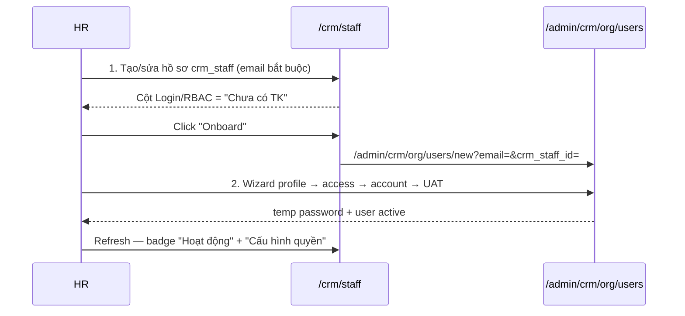
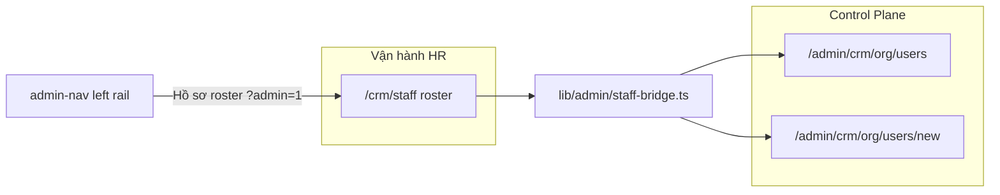

# Admin Control Plane P2 — Triển khai chi tiết (HR Bridge)

> **For agentic workers:** REQUIRED SUB-SKILL: Use superpowers:subagent-driven-development or superpowers:executing-plans. Steps dùng checkbox (`- [ ]`) để tracking.

> **Trạng thái:** ✅ Shipped · **Commit:** `2ce8544` (+ `2ce8544` Suspense fix)
> **Spec:** [`docs/specs/2026-08-11-admin-control-plane-ia.md`](../specs/2026-08-11-admin-control-plane-ia.md) §10, §12 P2  
> **Runbook:** [`docs/runbooks/rbac-hr-org-workflow.md`](../runbooks/rbac-hr-org-workflow.md)  
> **App:** `services/ops-web` · **Domain:** `https://rs.pttads.vn`

---

## Mục lục

1. [Mục tiêu P2](#1-mục-tiêu-p2)
2. [As-is vs target](#2-as-is-vs-target)
3. [Luồng 2 bước (HR UAT)](#3-luồng-2-bước-hr-uat)
4. [Kiến trúc bridge](#4-kiến-trúc-bridge)
5. [SSoT helpers (`staff-bridge.ts`)](#5-ssot-helpers-staff-bridge.ts)
6. [Task P2-1 — Callout + cột Login/RBAC](#6-task-p2-1--callout--cột-loginrbac)
7. [Task P2-2 — StaffEditDrawer + deep links](#7-task-p2-2--staffeditdrawer--deep-links)
8. [Task P2-3 — Admin chrome trên roster (optional)](#8-task-p2-3--admin-chrome-trên-roster-optional)
9. [Task P2-4 — Org users nhận query `?email=`](#9-task-p2-4--org-users-nhận-query-email)
10. [Task P2-5 — Onboard wizard prefill](#10-task-p2-5--onboard-wizard-prefill)
11. [CSS](#11-css)
12. [Tests](#12-tests)
13. [Deploy VPS](#13-deploy-vps)
14. [UAT script HR 2-step](#14-uat-script-hr-2-step)
15. [Exit criteria P2](#15-exit-criteria-p2)
16. [Out of scope](#16-out-of-scope)

---

## 1. Mục tiêu P2

**Goal:** Gỡ confusion **crm_staff (hồ sơ HR)** vs **staff_users (login + RBAC)** — bridge 2 workspace mà không gộp chúng.

| Metric | P1 (as-is bridge) | P2 target |
|--------|---------------------|-----------|
| HR hiểu “roster ≠ login” | Footnote hub admin only | **Callout** đầu tab Roster |
| Trạng thái login trên roster | Badge RBAC nếu có; link “org user” chung | Cột **Login / RBAC** + action rõ |
| Deep link từ roster | `/admin/crm/org/users` (no filter) | `?email=` + onboard prefill |
| Drawer copy | “Mở org user” (EN) | **Cấu hình tài khoản & quyền** (VI) |
| Admin → roster | Plain HR shell | Optional `?admin=1` + left rail |

**Pitch:**

> HR tạo hồ sơ tại Roster → một click **Onboard** sang Control Plane với email prefilled. IT không cần copy-paste email.

---

## 2. As-is vs target

### Code hiện tại (partial bridge)

| File | As-is | Gap P2 |
|------|-------|--------|
| `StaffContent.tsx` | `fetchStaffOrgUsers` → `Map` by email; list `<ul>` | Thiếu callout; thiếu cột status; link không deep |
| `StaffEditDrawer.tsx` | “Mở org user” → `/admin/crm/org/users` | Copy VI + deep link + CTA Onboard |
| `admin/crm/org/users/page.tsx` | Table có trạng thái Hoạt động/Ngưng | Không đọc `?email=` |
| `admin/crm/org/users/new/page.tsx` | Wizard 4 bước | Không prefill từ query |
| `admin-nav.ts` | Link roster `/crm/staff` | Chưa `?admin=1` |

### Data model (đã có — không đổi backend)

```typescript
// lib/api.ts — đã ship
interface StaffOrgUserSummary {
  id: string;
  email: string;
  active?: boolean;
  crm_staff_id?: number;
  position_code?: string;
  job_functions: string[];
}

interface CrmStaffRow {
  id: number;
  email?: string;
  active?: boolean;
  // ...
}
```

**Match key:** `staff.email.trim().toLowerCase()` ↔ `orgUser.email`

---

## 3. Luồng 2 bước (HR UAT)



**Exit UAT:** HR hoàn thành 2 bước ≤15 phút không gõ URL / không hỏi IT “trang nào tạo login”.

---

## 4. Kiến trúc bridge



**Nguyên tắc:**

1. **Không** merge roster vào admin table — giữ `/crm/staff` cho HR vận hành.
2. **Không** tạo login từ roster form — chỉ deep link sang wizard.
3. Actions cap-gated: Onboard cần `crm_staff_roster.edit` + org edit; “Cấu hình quyền” cần view org admin.

---

## 5. SSoT helpers (`staff-bridge.ts`)

**Create:** `services/ops-web/src/lib/admin/staff-bridge.ts`  
**Create:** `services/ops-web/src/lib/admin/staff-bridge.spec.ts`

### Types

```typescript
export type StaffLoginRbacStatus = 'active' | 'no_account' | 'inactive';

export type StaffLoginRbacRow = {
  status: StaffLoginRbacStatus;
  label: string;       // UI badge text
  tone: 'success' | 'warning' | 'muted';
  orgUser?: StaffOrgUserSummary;
};
```

### Functions

| Function | Input | Output |
|----------|-------|--------|
| `resolveStaffLoginRbac(staff, orgUser?)` | `CrmStaffRow`, optional org | `StaffLoginRbacRow` |
| `buildOrgUsersDeepLink(email)` | email string | `/admin/crm/org/users?email=...` |
| `buildOrgOnboardDeepLink(params)` | `{ email, crmStaffId?, name?, phone?, jobTitle?, internalCode? }` | `/admin/crm/org/users/new?...` |
| `canLinkToOrgAdmin(user)` | `StoredStaffUser` | view org admin caps |
| `canOnboardFromRoster(user)` | `StoredStaffUser` | roster.edit + org edit |

### Status rules (spec §10.2)

```typescript
export function resolveStaffLoginRbac(
  staff: CrmStaffRow,
  orgUser?: StaffOrgUserSummary | null,
): StaffLoginRbacRow {
  if (!orgUser) {
    return { status: 'no_account', label: 'Chưa có TK', tone: 'warning' };
  }
  if (orgUser.active === false) {
    return { status: 'inactive', label: 'Ngưng', tone: 'muted', orgUser };
  }
  return { status: 'active', label: 'Hoạt động', tone: 'success', orgUser };
}
```

---

## 6. Task P2-1 — Callout + cột Login/RBAC

**Files:**
- Create: `src/components/crm/StaffRosterIdentityCallout.tsx`
- Create: `src/components/crm/StaffLoginRbacCell.tsx`
- Modify: `src/app/crm/staff/StaffContent.tsx`
- Modify: `src/app/globals.css`

### P2-1a: Callout component

**Create** `StaffRosterIdentityCallout.tsx`:

```tsx
export function StaffRosterIdentityCallout() {
  return (
    <div className="staff-roster-callout" role="note">
      <p>
        Hồ sơ nhân viên (<code>crm_staff</code>) khác tài khoản đăng nhập. Tạo login và phân quyền tại{' '}
        <Link href="/admin/crm/org/users">Quản trị → Người dùng</Link>.
      </p>
    </div>
  );
}
```

- Chỉ render khi `tab === 'roster'`.
- Ẩn nếu user không có `canLinkToOrgAdmin` (optional — hoặc luôn show link, trang admin tự 403).

### P2-1b: Login/RBAC cell

**Create** `StaffLoginRbacCell.tsx`:

Props: `staff`, `orgUser?`, `user` (viewer caps)

| Status | Badge | Action (cap-gated) |
|--------|-------|-------------------|
| `active` | `Hoạt động` | Link **Cấu hình quyền** → `buildOrgUsersDeepLink(email)` |
| `no_account` | `Chưa có TK` | Link **Onboard** → `buildOrgOnboardDeepLink(...)` if `canOnboardFromRoster` |
| `inactive` | `Ngưng` | — (no action) |

Reuse `WinRbacBadge` bên cạnh badge status khi `active`.

### P2-1c: Roster list → table (recommended)

Thay `<ul>` roster bằng `<table className="data-table">`:

| Cột | Nội dung |
|-----|----------|
| Tên | Link `/crm/staff/{id}` |
| Mã | `internal_code` |
| Phòng | `department` |
| Login / RBAC | `<StaffLoginRbacCell />` |
| | Button Sửa (edit cap) |

Giữ search form + summary counts phía trên callout.

### Checklist P2-1

- [ ] **Step 1:** `staff-bridge.ts` + unit tests (status + deep links)
- [ ] **Step 2:** `StaffRosterIdentityCallout` + CSS `.staff-roster-callout`
- [ ] **Step 3:** `StaffLoginRbacCell` + CSS `.staff-login-rbac-*`
- [ ] **Step 4:** Refactor `StaffContent` roster tab (callout + table + cell)
- [ ] **Step 5:** Gỡ link “org user” cũ inline trong list
- [ ] **Step 6:** `npm run test:unit -- staff-bridge.spec.ts`

---

## 7. Task P2-2 — StaffEditDrawer + deep links

**Files:**
- Modify: `src/app/crm/staff/StaffEditDrawer.tsx`

### Copy changes (spec §10.3)

| As-is | Target |
|-------|--------|
| “Mở org user” | **Cấu hình tài khoản & quyền** |
| “Chưa liên kết org user — dùng onboard wizard.” | **Chưa có tài khoản login.** + CTA **Onboard NV** |

### Link targets

```tsx
// có orgUser
<Link href={buildOrgUsersDeepLink(staff.email!)}>...</Link>

// chưa có orgUser + can onboard
<Link href={buildOrgOnboardDeepLink({
  email: staff.email,
  crmStaffId: staff.id,
  name: staff.name,
  phone: staff.phone,
  jobTitle: staff.job_title,
  internalCode: staff.internal_code,
})} className="btn btn-sm btn-secondary">
  Onboard NV
</Link>
```

### Checklist P2-2

- [ ] **Step 1:** Import helpers từ `staff-bridge.ts`
- [ ] **Step 2:** Update copy VI
- [ ] **Step 3:** Deep links với encoded query params
- [ ] **Step 4:** Pass `user` prop hoặc `canOnboard` từ `StaffContent`

---

## 8. Task P2-3 — Admin chrome trên roster (optional)

**Files:**
- Modify: `src/lib/admin/admin-nav.ts` — org link `Hồ sơ roster` → `/crm/staff?admin=1`
- Modify: `src/app/crm/staff/StaffContent.tsx` hoặc `page.tsx`
- Reuse: `AdminLeftRail` from P1

### Approach (minimal diff)

```tsx
// StaffContent.tsx
const searchParams = useSearchParams();
const adminBridge = searchParams.get('admin') === '1';

// wrap page body:
{adminBridge ? (
  <div className="admin-cp-layout">
    <AdminLeftRail user={user} />
    <div className="admin-cp-main">{rosterBody}</div>
  </div>
) : (
  rosterBody
)}
```

**Breadcrumb khi `admin=1`:** prepend `{ label: 'Quản trị hệ thống', href: '/admin' }` — optional via prop on `CrmHrPageShell` or inline banner:

```tsx
{adminBridge ? (
  <p className="muted staff-admin-bridge-banner">
    Bridge mode — <Link href="/admin">Quản trị hệ thống</Link>
  </p>
) : null}
```

### Checklist P2-3

- [ ] **Step 1:** Update `buildOrgLinks` href roster → `/crm/staff?admin=1`
- [ ] **Step 2:** `StaffContent` detect `admin=1` + render left rail
- [ ] **Step 3:** Manual test: left rail → Hồ sơ roster → rail vẫn visible
- [ ] **Step 4:** Mobile: rail wraps (existing P1 CSS)

---

## 9. Task P2-4 — Org users nhận query `?email=`

**Files:**
- Modify: `src/app/admin/crm/org/users/page.tsx`

### Behavior

1. `useSearchParams()` → `email` param
2. On mount: `setQuery(email)` hoặc filter client-side
3. Nếu exact 1 match → auto `openUser(row)` drawer
4. Fix breadcrumb cũ (side effect):

```tsx
breadcrumb={[
  { label: 'Quản trị hệ thống', href: '/admin' },
  { label: 'Người dùng' },
]}
```

Gỡ `{ label: 'Cấu hình CRM', href: '/admin/crm/custom-fields' }`.

### Checklist P2-4

- [ ] **Step 1:** Read `?email=` on load
- [ ] **Step 2:** Pre-fill search + highlight row (class `is-highlighted`)
- [ ] **Step 3:** Auto-open drawer when single match
- [ ] **Step 4:** Update breadcrumb to Control Plane pattern

---

## 10. Task P2-5 — Onboard wizard prefill

**Files:**
- Modify: `src/app/admin/crm/org/users/new/page.tsx`

### Query params

| Param | Maps to state |
|-------|---------------|
| `email` | `email` |
| `crm_staff_id` | hidden field → `createStaffOrgUser` payload |
| `name` | `name`, `displayName` |
| `phone` | `phone` |
| `job_title` | `jobTitle` |
| `internal_code` | `internalCode` |

```tsx
const searchParams = useSearchParams();
useEffect(() => {
  const email = searchParams.get('email');
  if (email) setEmail(email);
  // ... other prefills
}, [searchParams]);
```

### Checklist P2-5

- [ ] **Step 1:** Parse query on mount
- [ ] **Step 2:** Pass `crm_staff_id` in `createStaffOrgUser` body
- [ ] **Step 3:** Banner “Đang onboard từ hồ sơ roster” when `crm_staff_id` present
- [ ] **Step 4:** E2E: roster Onboard → wizard step 1 has email

---

## 11. CSS

**Add to** `globals.css`:

```css
.staff-roster-callout {
  padding: 0.85rem 1rem;
  border-radius: 10px;
  border: 1px solid rgba(23, 105, 47, 0.2);
  background: rgba(23, 105, 47, 0.06);
  margin-bottom: 1rem;
  font-size: 0.9rem;
}

.staff-login-rbac-cell {
  display: flex;
  flex-wrap: wrap;
  align-items: center;
  gap: 0.35rem;
}

.staff-login-rbac-badge {
  display: inline-block;
  padding: 0.15rem 0.5rem;
  border-radius: 999px;
  font-size: 0.72rem;
  font-weight: 600;
}

.staff-login-rbac-badge--success { background: rgba(23, 105, 47, 0.12); color: var(--brand); }
.staff-login-rbac-badge--warning { background: rgba(245, 158, 11, 0.15); color: #b45309; }
.staff-login-rbac-badge--muted { background: var(--surface-muted); color: var(--muted); }

.staff-admin-bridge-banner {
  margin-bottom: 0.75rem;
  padding-bottom: 0.5rem;
  border-bottom: 1px solid var(--border);
}
```

---

## 12. Tests

### Unit — `staff-bridge.spec.ts`

```typescript
describe('resolveStaffLoginRbac', () => {
  it('no_account when orgUser missing', () => { ... });
  it('inactive when orgUser.active false', () => { ... });
  it('active when orgUser active', () => { ... });
});

describe('buildOrgOnboardDeepLink', () => {
  it('encodes email and crm_staff_id', () => { ... });
});
```

### E2E — `e2e/admin-control-plane-p2-hr-bridge.spec.ts`

```typescript
test('roster onboard deep link opens wizard with email', async ({ page }) => {
  await loginAsStaff(page);
  await page.goto('/crm/staff');
  await expect(page.getByRole('note')).toContainText('khác tài khoản đăng nhập');
  // click first "Onboard" if visible, or skip
  await page.getByRole('link', { name: 'Onboard' }).first().click();
  await expect(page).toHaveURL(/\/admin\/crm\/org\/users\/new\?/);
  await expect(page.locator('input[type="email"], input').first()).not.toBeEmpty();
});
```

Run:

```bash
cd services/ops-web
npm run test:unit -- src/lib/admin/staff-bridge.spec.ts
npm run test:e2e -- e2e/admin-control-plane-p2-hr-bridge.spec.ts
```

---

## 13. Deploy VPS

```bash
# Laptop
git push origin main

# VPS
ssh deploy@rs.pttads.vn 'cd /var/www/rnosai && git pull --ff-only origin main && ./scripts/deploy_ops_web.sh && sudo -n systemctl restart ptt-ops-web'
```

**Flags:** P2 chỉ FE — không cần đổi `runtime.env` nếu `WIN_ORG_UI=1` đã bật từ P0/P1.

Verify:

```bash
ssh deploy@rs.pttads.vn 'cd /var/www/rnosai && source scripts/lib/ops_web_standalone.sh && ops_web_verify_public'
```

---

## 14. UAT script HR 2-step

| # | Actor | Action | Expected |
|---|-------|--------|----------|
| 1 | HR | `/crm/staff` tab Roster | Callout visible |
| 2 | HR | Tạo NV test email `hr-bridge-test@pttads.vn` | Cột = **Chưa có TK** |
| 3 | HR | Click **Onboard** | Wizard `/new?email=...&crm_staff_id=...` |
| 4 | HR | Complete wizard 4 steps | User created, temp password |
| 5 | HR | Back roster refresh | **Hoạt động** + **Cấu hình quyền** |
| 6 | HR | Click Cấu hình quyền | Users page opens drawer for email |
| 7 | IT | Login as test user | Menu đúng caps |
| 8 | HR | Drawer “Sửa hồ sơ” | Copy **Cấu hình tài khoản & quyền** |

**Pass:** ≤15 phút · 0 URL manually typed · checklist §8 runbook RBAC pass.

---

## 15. Exit criteria P2

| Criteria | Verify |
|----------|--------|
| Callout đầu tab Roster | Visual + a11y `role="note"` |
| Cột Login/RBAC 3 trạng thái | Unit + UAT |
| Deep link `?email=` org users | E2E |
| Onboard prefill từ roster | E2E |
| Drawer copy VI | Manual |
| Optional `?admin=1` rail | Manual from left rail |
| HR UAT 2-step pass | Sign-off sheet |

---

## 16. Out of scope

| Item | Phase |
|------|-------|
| Tạo login inline trên roster | ❌ Never — wizard only |
| Merge org users table vào roster | ❌ |
| Global admin search | P3 |
| Mobile drawer rail polish | P3 |
| Audit Center | R3 |
| Fix all admin pages breadcrumb “Cấu hình CRM” | P2-4 only touches org/users |

---

## File tree (expected after P2)

```
services/ops-web/src/
├── lib/admin/
│   ├── staff-bridge.ts          ← NEW
│   └── staff-bridge.spec.ts     ← NEW
├── components/crm/
│   ├── StaffRosterIdentityCallout.tsx  ← NEW
│   └── StaffLoginRbacCell.tsx          ← NEW
├── app/crm/staff/
│   ├── StaffContent.tsx         ← MODIFY
│   └── StaffEditDrawer.tsx      ← MODIFY
├── app/admin/crm/org/users/
│   ├── page.tsx                 ← MODIFY (?email=)
│   └── new/page.tsx             ← MODIFY (prefill)
├── lib/admin/admin-nav.ts       ← MODIFY (?admin=1 roster link)
├── app/globals.css              ← MODIFY
└── e2e/admin-control-plane-p2-hr-bridge.spec.ts  ← NEW
```

**Estimated effort:** 2–3 ngày · **1 PR** recommended (focused HR bridge).

---

## Thứ tự implement khuyến nghị

1. `staff-bridge.ts` + tests (foundation)
2. P2-1 callout + table + cell
3. P2-2 drawer
4. P2-4 + P2-5 deep links (org users + wizard)
5. P2-3 admin chrome (optional last)
6. E2E + UAT script walkthrough
7. Deploy VPS

---

## Bước tiếp P3

| Wave | Nội dung | Plan |
|------|----------|------|
| **P3** | Admin search, mobile drawer, a11y axe, E2E onboard wizard | [`2026-08-11-admin-control-plane-p3.md`](2026-08-11-admin-control-plane-p3.md) |
