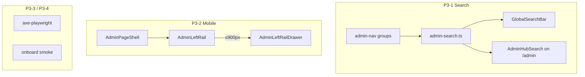

# Admin Control Plane P3 — Triển khai chi tiết (Polish)

> **For agentic workers:** REQUIRED SUB-SKILL: Use superpowers:subagent-driven-development or superpowers:executing-plans. Steps dùng checkbox (`- [ ]`) để tracking.

> **Trạng thái:** ✅ Shipped · **Commit:** `36750eb`

---

## Bước tiếp R3

| Wave | Nội dung | Plan |
|------|----------|------|
| **R3** | Audit Center, export compliance, config drift, PII log | [`2026-08-11-admin-control-plane-r3.md`](2026-08-11-admin-control-plane-r3.md) |  
> **Spec:** [`docs/specs/2026-08-11-admin-control-plane-ia.md`](../specs/2026-08-11-admin-control-plane-ia.md) §12 P3, §7, §9  
> **App:** `services/ops-web` · **Domain:** `https://rs.pttads.vn`

---

## Mục lục

1. [Mục tiêu P3](#1-mục-tiêu-p3)
2. [As-is vs target](#2-as-is-vs-target)
3. [Kiến trúc tổng quan](#3-kiến-trúc-tổng-quan)
4. [Task P3-1 — Admin route search](#4-task-p3-1--admin-route-search)
5. [Task P3-2 — Mobile drawer left rail](#5-task-p3-2--mobile-drawer-left-rail)
6. [Task P3-3 — Accessibility axe ≥90](#6-task-p3-3--accessibility-axe--90)
7. [Task P3-4 — E2E onboard wizard smoke](#7-task-p3-4--e2e-onboard-wizard-smoke)
8. [Task P3-5 — Breadcrumb cleanup (optional)](#8-task-p3-5--breadcrumb-cleanup-optional)
9. [CSS](#9-css)
10. [Tests & scripts](#10-tests--scripts)
11. [Deploy VPS](#11-deploy-vps)
12. [UAT polish checklist](#12-uat-polish-checklist)
13. [Exit criteria P3](#13-exit-criteria-p3)
14. [Out of scope](#14-out-of-scope)

---

## 1. Mục tiêu P3

**Goal:** Control Plane đạt **production polish** — IT tìm route admin ≤10 giây (search), mobile admin usable, a11y pass, E2E onboard smoke.

| Metric | P2 (as-is) | P3 target |
|--------|------------|-----------|
| Tìm “permissions” / “onboard” | Sidebar 3 click hoặc gõ URL | **GlobalSearch** + hub search ≤10s |
| Mobile `/admin/*` | Left rail wrap ngang (khó scroll) | **Drawer** slide-over |
| a11y hub | Chưa đo | **axe** `/admin` score ≥90 |
| Regression onboard | P2 E2E roster → wizard partial | **Full** sidebar → wizard 4 bước |

**Pitch:**

> HubSpot Settings có search box. RNOSAI P3 thêm **admin route search** client-side + mobile drawer — demo enterprise trên iPhone vẫn mượt.

---

## 2. As-is vs target

| Thành phần | As-is | Gap P3 |
|------------|-------|--------|
| `GlobalSearchBar` | CRM entities qua `/api/v1/search` | Không index `/admin/*` |
| `buildAdminSidebarLinksFlat` | Có trong `admin-nav.ts`, chưa dùng UI | Cần search index |
| `AdminLeftRail` | Desktop sticky; mobile `flex-wrap` @900px | Cần drawer |
| `/admin` hub | Cards + grid, không search | Spec §5.2: header search (P3) |
| axe | Không có trong repo | Cần `@axe-core/playwright` |
| E2E | P0 nav, P2 roster bridge | Thiếu onboard wizard end-to-end |

---

## 3. Kiến trúc tổng quan



**Nguyên tắc:**

1. **Admin search = client-side** — không đổi Nest `/api/v1/search` (CRM OpenSearch).
2. **Cap-gated** — chỉ index routes user được thấy (`buildAdminNavGroups`).
3. **Reuse SSoT** — `admin-nav.ts` / `admin-search.ts`, không duplicate link list.
4. **Progressive** — CRM search vẫn hoạt động khi filter ≠ Quản trị.

---

## 4. Task P3-1 — Admin route search

### 4.1. SSoT — `admin-search.ts`

**Create:** `services/ops-web/src/lib/admin/admin-search.ts`  
**Create:** `services/ops-web/src/lib/admin/admin-search.spec.ts`

```typescript
export type AdminSearchHit = {
  href: string;
  label: string;
  groupLabel: string;
  groupId: AdminNavGroupId;
  keywords: string; // normalized for match
};

export function buildAdminSearchIndex(user: StoredStaffUser | null): AdminSearchHit[];

export function searchAdminRoutes(
  user: StoredStaffUser | null,
  query: string,
  limit?: number,
): AdminSearchHit[];
```

**Index builder** — flatten `buildAdminNavGroups(user)`:

| Field | Source |
|-------|--------|
| `href`, `label` | group.links |
| `groupLabel` | group.label |
| `keywords` | normalize(`${label} ${groupLabel} ${href}`) — bỏ dấu optional |

**Matcher** — query ≥2 ký tự:

- Split query thành tokens
- Mọi token phải match `keywords` (includes)
- Sort: label startsWith > groupLabel match > href

**Hub entry** — luôn thêm nếu `canViewAdminSection`:

```typescript
{ href: '/admin', label: 'Trung tâm quản trị', groupLabel: 'Control Plane', ... }
```

### 4.2. GlobalSearchBar integration

**Modify:** `services/ops-web/src/components/search/GlobalSearchBar.tsx`

| Change | Detail |
|--------|--------|
| Filter chip mới | `{ value: 'admin', label: 'Quản trị' }` — type `'admin'` local only |
| `getStoredUser()` | Load user caps for index |
| Dual results | Khi `entityType !== 'admin'`: section **Quản trị** (top 5) + CRM hits |
| Admin-only mode | `entityType === 'admin'` → chỉ `searchAdminRoutes`, skip API |
| Prefix shortcut | Query `admin:` hoặc `qt:` → strip prefix, admin-only |
| Placeholder | `"Tìm CRM hoặc Quản trị…"` |

**UI block:**

```tsx
{adminHits.length > 0 ? (
  <div className="global-search-section">
    <span className="global-search-section-label">Quản trị hệ thống</span>
    {adminHits.map((hit) => (
      <Link key={hit.href} href={hit.href} className="global-search-hit global-search-hit--admin">
        <span className="global-search-hit-type">{hit.groupLabel}</span>
        <strong>{hit.label}</strong>
      </Link>
    ))}
  </div>
) : null}
```

### 4.3. Hub search (optional trong P3-1)

**Create:** `services/ops-web/src/components/admin/AdminHubSearch.tsx`

- Input inline trong hero `/admin`
- Reuse `searchAdminRoutes(user, q, 8)`
- Dropdown giống GlobalSearchBar styling
- `aria-label="Tìm trong Quản trị hệ thống"`

**Modify:** `services/ops-web/src/app/admin/page.tsx` — embed below hero title.

### Checklist P3-1

- [ ] **Step 1:** `admin-search.ts` + unit tests (match, cap empty, WIN flags)
- [ ] **Step 2:** Extend `GlobalSearchBar` filter + admin section
- [ ] **Step 3:** `AdminHubSearch` on `/admin` hub
- [ ] **Step 4:** CSS `.global-search-hit--admin`, `.global-search-section-label`
- [ ] **Step 5:** Manual: gõ "onboard" → `/admin/crm/org/users/new`
- [ ] **Step 6:** Manual: gõ "ma trận" → `/admin/crm/permissions`

---

## 5. Task P3-2 — Mobile drawer left rail

### 5.1. Approach

**Modify:** `AdminLeftRail.tsx` → split desktop / mobile:

```tsx
export function AdminLeftRail({ user }: AdminLeftRailProps) {
  const isMobile = useMediaQuery('(max-width: 900px)');
  if (isMobile) return <AdminLeftRailDrawer user={user} />;
  return <AdminLeftRailDesktop user={user} />;
}
```

**Create:** `AdminLeftRailDrawer.tsx`

| Element | Behavior |
|---------|----------|
| Trigger | Button `Menu quản trị` sticky top of `.admin-cp-main` |
| Drawer | Slide từ trái, reuse pattern `.ops-nav-drawer` |
| Backdrop | Click đóng |
| Content | Same groups as desktop rail |
| Focus trap | Optional P3 — ít nhất `aria-expanded` + Escape key |

**Modify:** `AdminPageShell.tsx` — pass mobile trigger above toolbar on small screens.

**Modify:** `globals.css`:

```css
@media (max-width: 900px) {
  .admin-cp-rail--desktop { display: none; }
  .admin-cp-rail-drawer { /* slide panel */ }
}
```

Gỡ mobile `flex-wrap` trên `.admin-cp-rail` (thay bằng drawer).

### 5.2. Hook

**Create:** `services/ops-web/src/lib/hooks/useMediaQuery.ts`

```typescript
export function useMediaQuery(query: string): boolean;
```

SSR-safe: default `false`, set on mount.

### Checklist P3-2

- [ ] **Step 1:** `useMediaQuery` hook
- [ ] **Step 2:** `AdminLeftRailDrawer` + extract shared `AdminLeftRailNav`
- [ ] **Step 3:** CSS drawer + backdrop
- [ ] **Step 4:** Test iPhone 390px: permissions page → open drawer → navigate
- [ ] **Step 5:** Test `?admin=1` roster bridge vẫn có drawer

---

## 6. Task P3-3 — Accessibility axe ≥90

### 6.1. Tooling

**Add devDependency:**

```bash
cd services/ops-web && npm install -D @axe-core/playwright
```

**Create:** `e2e/admin-control-plane-a11y.spec.ts`

```typescript
import AxeBuilder from '@axe-core/playwright';

test('admin hub meets axe threshold', async ({ page }) => {
  await loginAsStaff(page);
  await page.goto('/admin');
  const results = await new AxeBuilder({ page })
    .withTags(['wcag2a', 'wcag2aa', 'best-practice'])
    .analyze();
  expect(results.violations.filter(v => v.impact === 'critical' || v.impact === 'serious')).toHaveLength(0);
  // optional: expect(results.dequeScore ?? computed).toBeGreaterThanOrEqual(90);
});
```

**Pages to scan:**

| URL | Why |
|-----|-----|
| `/admin` | Hub hero + cards |
| `/admin/crm/permissions` | Table + left rail |
| `/admin/crm/org/users` | Table + drawer |

### 6.2. Known fixes (apply during P3)

| Issue | Fix |
|-------|-----|
| Hub emoji icons | `aria-hidden` on workspace icons ✅ (verify) |
| Left rail active | Add `aria-current="page"` on active link |
| Drawer trigger | `aria-expanded`, `aria-controls="admin-cp-drawer"` |
| Hub search input | `aria-label`, associate with results `role="listbox"` |
| Callout on roster | `role="note"` ✅ P2 |
| Focus visible | Ensure `.admin-cp-rail__link:focus-visible` outline |
| Color contrast pills | Verify `--brand` on hero pills ≥4.5:1 |

**Script package.json:**

```json
"test:e2e:admin-a11y": "playwright test e2e/admin-control-plane-a11y.spec.ts"
```

### Checklist P3-3

- [ ] **Step 1:** Install `@axe-core/playwright`
- [ ] **Step 2:** a11y spec 3 pages
- [ ] **Step 3:** Fix violations until 0 critical/serious
- [ ] **Step 4:** Document score in plan / CI comment

---

## 7. Task P3-4 — E2E onboard wizard smoke

**Create:** `e2e/admin-control-plane-p3-onboard.spec.ts`

```typescript
test.describe('Admin Control Plane P3 onboard', () => {
  test('sidebar to onboard wizard four steps', async ({ page }) => {
    await loginAsStaff(page);
    // 1. Sidebar → hub
    await page.goto('/');
    await expandSidebarIfNeeded(page);
    await page.getByRole('button', { name: 'Trung tâm quản trị' }).click();
    await expect(page).toHaveURL(/\/admin\/?$/);

    // 2. Hub or left rail → Onboard
    await page.getByRole('link', { name: /Onboard/i }).first().click();
    await expect(page).toHaveURL(/\/admin\/crm\/org\/users\/new/);

    // 3. Wizard steps visible
    await expect(page.getByText('Hồ sơ')).toBeVisible();
    await expect(page.getByText('Quyền')).toBeVisible();
    await expect(page.getByText('Tài khoản')).toBeVisible();
    await expect(page.getByText('UAT')).toBeVisible();
  });

  test('global search admin filter finds onboard route', async ({ page }) => {
    await loginAsStaff(page);
    await page.goto('/crm/leads');
    await page.locator('.global-search-input').fill('onboard');
    await page.getByRole('button', { name: 'Quản trị' }).click();
    await expect(page.locator('.global-search-hit--admin').first()).toBeVisible({ timeout: 5000 });
  });
});
```

**package.json:**

```json
"test:e2e:admin-control-plane": "playwright test e2e/admin-control-plane-*.spec.ts"
```

### Checklist P3-4

- [ ] **Step 1:** onboard wizard smoke spec
- [ ] **Step 2:** search admin filter spec (depends P3-1)
- [ ] **Step 3:** Run against staging API / local Nest

---

## 8. Task P3-5 — Breadcrumb cleanup (optional)

Nhiều trang admin vẫn breadcrumb **Cấu hình CRM** (P1 gap). P3 optional sweep:

| File pattern | Target breadcrumb |
|--------------|-------------------|
| `app/admin/crm/**/page.tsx` | `Quản trị hệ thống → [workspace] → [title]` |
| `app/admin/ai/**/page.tsx` | `Quản trị hệ thống → AI Platform → [title]` |

**Helper (optional):**

```typescript
// lib/admin/admin-breadcrumb.ts
export function adminBreadcrumb(...tail: BreadcrumbItem[]): BreadcrumbItem[];
```

**Scope:** ≤10 files touched — grep `Cấu hình CRM` trong `app/admin`.

---

## 9. CSS

**Add to** `globals.css`:

```css
/* P3 — Global search admin section */
.global-search-section {
  padding: 0.35rem 0;
  border-bottom: 1px solid var(--border);
}
.global-search-section-label {
  display: block;
  padding: 0.25rem 0.75rem;
  font-size: 0.68rem;
  font-weight: 700;
  text-transform: uppercase;
  letter-spacing: 0.06em;
  color: var(--muted);
}
.global-search-hit--admin .global-search-hit-type {
  color: var(--brand);
}

/* P3 — Admin hub search */
.admin-cp-hub-search {
  max-width: 28rem;
  margin-top: 1rem;
}

/* P3 — Mobile drawer */
.admin-cp-rail-drawer-backdrop {
  position: fixed;
  inset: 0;
  z-index: 9998;
  background: rgba(0, 0, 0, 0.4);
}
.admin-cp-rail-drawer {
  position: fixed;
  top: 0;
  left: 0;
  bottom: 0;
  z-index: 9999;
  width: min(18rem, 88vw);
  overflow-y: auto;
  background: var(--surface);
  box-shadow: 4px 0 24px rgba(0, 0, 0, 0.12);
  padding: 1rem;
}
.admin-cp-rail-trigger {
  display: none;
}
@media (max-width: 900px) {
  .admin-cp-rail--desktop {
    display: none;
  }
  .admin-cp-rail-trigger {
    display: inline-flex;
    margin-bottom: 0.75rem;
  }
}
```

---

## 10. Tests & scripts

| Test | Command |
|------|---------|
| Unit admin-search | `npm run test:unit -- src/lib/admin/admin-search.spec.ts` |
| E2E control plane all | `npm run test:e2e:admin-control-plane` |
| a11y | `npm run test:e2e:admin-a11y` |
| Build | `npm run build` |

**CI suggestion (future):** add `admin-control-plane-a11y` to staging gate — không block P3 deploy lần đầu.

---

## 11. Deploy VPS

```bash
git push origin main
ssh deploy@rs.pttads.vn 'cd /var/www/rnosai && git pull --ff-only origin main && ./scripts/deploy_ops_web.sh && sudo -n systemctl restart ptt-ops-web'
```

**Flags:** P3 chỉ FE — không cần đổi `runtime.env`.

**Post-deploy smoke:**

1. `/admin` — hub search hoạt động
2. Topbar search → filter **Quản trị** → "permissions"
3. Mobile viewport — drawer opens
4. Hard refresh

---

## 12. UAT polish checklist

| # | Scenario | Pass |
|---|----------|------|
| 1 | IT gõ "ma trận" trong GlobalSearch → permissions | ☐ |
| 2 | HR gõ "onboard" → wizard | ☐ |
| 3 | iPhone: `/admin/crm/org/users` → Menu quản trị → Người dùng | ☐ |
| 4 | axe 0 critical/serious trên `/admin` | ☐ |
| 5 | E2E onboard 4 steps green | ☐ |
| 6 | Settings tour 5 phút (P1) vẫn pass | ☐ |

---

## 13. Exit criteria P3

| Criteria | Verify |
|----------|--------|
| Admin routes searchable từ topbar | E2E + manual |
| Hub có search (spec §5.2) | Visual |
| Mobile drawer thay rail wrap | 390px manual |
| axe `/admin` 0 critical/serious | a11y spec |
| E2E sidebar → onboard wizard | p3 spec |
| Build + VPS deploy | ops_web_verify |

**Scorecard target (spec §14):** RNOSAI P3 → Settings IA **4**, Mobile admin **3** (từ 3.8 weighted).

---

## 14. Out of scope

| Item | Phase |
|------|-------|
| Backend OpenSearch index admin routes | ❌ — client-only đủ |
| `/admin/audit` | R3 |
| Full breadcrumb refactor all legacy admin pages | Optional P3-5 |
| Keyboard shortcut ⌘K (nice-to-have) | Defer |
| i18n EN | Defer |

---

## File tree (expected after P3)

```
services/ops-web/src/
├── lib/
│   ├── admin/
│   │   ├── admin-search.ts          ← NEW
│   │   ├── admin-search.spec.ts     ← NEW
│   │   └── admin-breadcrumb.ts      ← optional
│   └── hooks/
│       └── useMediaQuery.ts         ← NEW
├── components/
│   ├── admin/
│   │   ├── AdminHubSearch.tsx       ← NEW
│   │   ├── AdminLeftRail.tsx        ← MODIFY split
│   │   ├── AdminLeftRailDrawer.tsx  ← NEW
│   │   └── AdminLeftRailNav.tsx     ← NEW shared
│   ├── admin/AdminPageShell.tsx     ← MODIFY mobile trigger
│   └── search/GlobalSearchBar.tsx   ← MODIFY admin hits
├── app/admin/page.tsx               ← MODIFY hub search
└── e2e/
    ├── admin-control-plane-a11y.spec.ts    ← NEW
    └── admin-control-plane-p3-onboard.spec.ts ← NEW
```

**Estimated effort:** 3–5 ngày · **1–2 PRs** (P3-1+2 PR1, P3-3+4 PR2).

---

## Thứ tự implement khuyến nghị

1. `admin-search.ts` + GlobalSearchBar (P3-1) — highest user value
2. `AdminHubSearch` on hub
3. Mobile drawer (P3-2)
4. a11y fixes + axe spec (P3-3)
5. E2E onboard + search (P3-4)
6. Optional breadcrumb sweep (P3-5)
7. Deploy VPS + UAT checklist

---

## Phụ lục — Search query examples

| User gõ | Expected top hit |
|---------|------------------|
| `onboard` | Onboard NV → `/admin/crm/org/users/new` |
| `ma trận` | Ma trận chức vụ |
| `người dùng` | Người dùng |
| `custom` | Custom fields |
| `ai agent` | AI Agents |
| `admin:sso` | SSO groups (prefix mode) |

---

## Phụ lục — Liên kết plans

| Phase | Plan |
|-------|------|
| P0 | [`2026-08-11-admin-control-plane-p0.md`](2026-08-11-admin-control-plane-p0.md) |
| P1 | [`2026-08-11-admin-control-plane-p1.md`](2026-08-11-admin-control-plane-p1.md) |
| P2 | [`2026-08-11-admin-control-plane-p2.md`](2026-08-11-admin-control-plane-p2.md) |
| P3 | This document |
| R3+ | [`2026-08-11-admin-control-plane-ia.md`](../specs/2026-08-11-admin-control-plane-ia.md) §13 |
