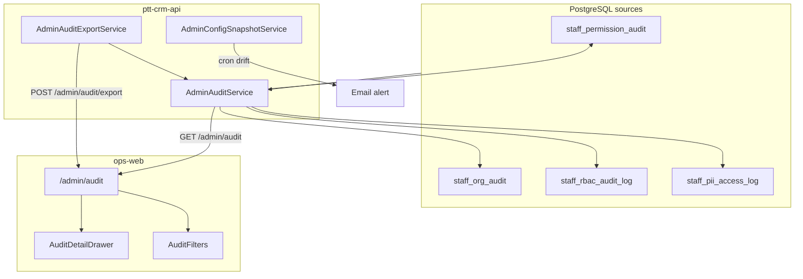

# Admin Control Plane R3 — Triển khai chi tiết (Audit & Compliance Center)

> **For agentic workers:** REQUIRED SUB-SKILL: Use superpowers:subagent-driven-development or superpowers:executing-plans. Steps dùng checkbox (`- [ ]`) để tracking.

> **Trạng thái:** ✅ Implemented locally · **Phụ thuộc:** P3 shipped (`36750eb`)  
> **Spec:** [`docs/specs/2026-08-11-admin-control-plane-ia.md`](../specs/2026-08-11-admin-control-plane-ia.md) §13 R3, §5.2, §8.2, §15  
> **App:** `services/ops-web` + `services/ptt-crm-api` · **Domain:** `https://rs.pttads.vn`

---

## Mục lục

1. [Mục tiêu R3](#1-mục-tiêu-r3)
2. [As-is vs target](#2-as-is-vs-target)
3. [Kiến trúc tổng quan](#3-kiến-trúc-tổng-quan)
4. [Task R3-1 — Federated audit read model](#4-task-r3-1--federated-audit-read-model)
5. [Task R3-2 — Nest Admin Audit API](#5-task-r3-2--nest-admin-audit-api)
6. [Task R3-3 — Export pipeline (12 tháng ≤30s)](#6-task-r3-3--export-pipeline-12-tháng-30s)
7. [Task R3-4 — Audit Center UI `/admin/audit`](#7-task-r3-4--audit-center-ui-adminaudit)
8. [Task R3-5 — Control Plane nav + search](#8-task-r3-5--control-plane-nav--search)
9. [Task R3-6 — Config drift alert](#9-task-r3-6--config-drift-alert)
10. [Task R3-7 — PII access log (prep ABAC)](#10-task-r3-7--pii-access-log-prep-abac)
11. [Task R3-8 — Immutability & DDL](#11-task-r3-8--immutability--ddl)
12. [CSS](#12-css)
13. [Tests & scripts](#13-tests--scripts)
14. [Deploy VPS](#14-deploy-vps)
15. [UAT compliance checklist](#15-uat-compliance-checklist)
16. [Exit criteria R3](#16-exit-criteria-r3)
17. [Out of scope (R4+)](#17-out-of-scope-r4)
18. [Phụ lục](#18-phụ-lục)

---

## 1. Mục tiêu R3

**Goal:** **Audit & Compliance Center** enterprise-ready — thắng checklist IT 100+ NV; unblock deal cần export audit 12 tháng và timeline thay đổi RBAC/org/user.

| Metric | P3 (as-is) | R3 target |
|--------|------------|-----------|
| Xem lịch sử thay đổi admin | Chỉ panel audit trên 1 position | **Timeline thống nhất** `/admin/audit` |
| Export compliance | `access-review.zip` partial (permissions only) | **CSV/JSON 12 tháng ≤30s** |
| Matrix PATCH audit | ✅ `staff_permission_audit` | **100%** + badge critical trên UI |
| Org/user audit | ✅ write `staff_org_audit` | **Read API + UI** |
| Config drift | Không có | **Alert email** prod ≠ signed snapshot |
| PII access | Không log | **Append-only prep** field-level |

**Pitch:**

> HubSpot Settings → Audit log. RNOSAI R3 gom 3 bảng PG thành **Audit Center** một màn — IT không cần query SQL khi auditor gọi.

**Phụ thuộc đã có (reuse, không viết lại):**

| Artifact | Path | Ghi chú |
|----------|------|---------|
| Matrix audit writes | `staff-permissions.repository.ts` | `INSERT staff_permission_audit` mỗi PATCH |
| Org audit writes | `staff-org*.repository.ts` | `INSERT staff_org_audit` mutations |
| RBAC events | `staff-rbac-audit.repository.ts` | break-glass, scope pilot |
| Access review ZIP | `GET /api/v1/staff/permissions/access-review.zip` | Giữ; R3 export rộng hơn |
| Permissions inline audit | `/admin/crm/permissions` panel | Giữ; deep-link → Audit Center |

---

## 2. As-is vs target

| Thành phần | As-is | Gap R3 |
|------------|-------|--------|
| `staff_permission_audit` | Write + GET scoped `position_id` | Cần unified timeline |
| `staff_org_audit` | Write only | **Không có list API** |
| `staff_rbac_audit_log` | Write + `listRecent(500)` internal | Chưa expose admin UI |
| `/admin/audit` | Route chưa có | Full Audit Center |
| Hub card Audit | Spec §5.2 planned | Cần cap + nav group |
| Export | ZIP access-review quarter | **Date-range CSV/JSON async** |
| Drift alert | — | Snapshot table + cron |
| PII view log | — | New table + middleware hook |
| Immutability | Append-only by convention | PG **REVOKE UPDATE/DELETE** |

---

## 3. Kiến trúc tổng quan



**Nguyên tắc:**

1. **Không migrate dữ liệu cũ** — federated `UNION ALL` view hoặc service merge; optional `admin_audit_log` chỉ cho events mới cross-domain.
2. **Cap-gated** — `crm_data_config.view` hoặc cap mới `admin_audit.view` (khuyến nghị reuse `crm_data_config.view` + PO-only export).
3. **Export async** — POST trả `job_id`; poll hoặc redirect download — tránh timeout 30s trên reverse proxy.
4. **Critical badge** — `event_category=permission_matrix` AND (`added` OR `removed` caps chứa `configure`/`delete`/`view_pii`).

---

## 4. Task R3-1 — Federated audit read model

### 4.1. Normalized event shape

**Create:** `services/ptt-crm-api/src/admin-audit/admin-audit.types.ts`

```typescript
export type AdminAuditEventCategory =
  | 'permission_matrix'
  | 'permission_function'
  | 'org_user'
  | 'org_structure'
  | 'rbac_event'
  | 'pii_access'
  | 'config_snapshot';

export type AdminAuditEvent = {
  id: string;              // "{source}:{pk}" e.g. permission_audit:42
  source: 'permission_audit' | 'org_audit' | 'rbac_audit' | 'pii_access';
  category: AdminAuditEventCategory;
  severity: 'info' | 'warning' | 'critical';
  actor_email: string;
  subject_label?: string;  // user email, position code, dept name
  subject_id?: string;
  action: string;          // patch_matrix | create_user | break_glass_approve ...
  summary: string;         // VI one-liner for table
  diff_json: Record<string, unknown>;
  created_at: string;      // ISO
};
```

### 4.2. Mapper functions

**Create:** `services/ptt-crm-api/src/admin-audit/admin-audit.mapper.ts`

| Source table | category | severity rules |
|--------------|----------|----------------|
| `staff_permission_audit` | `permission_matrix` | critical if diff touches `view_pii`, `configure`, `delete` on sensitive sections |
| `staff_org_audit` entity `user` | `org_user` | warning on `deactivate`, `offboard` |
| `staff_org_audit` dept/team/position | `org_structure` | info |
| `staff_rbac_audit_log` | `rbac_event` | critical for break-glass approve |
| `staff_pii_access_log` (R3-7) | `pii_access` | info |

**Summary VI examples:**

- `"Admin đổi ma trận KD-01: +3 / -1 cap"`
- `"HR onboard user a@pttads.vn"`
- `"Break-glass approved — 4h"`

### 4.3. Repository — federated query

**Create:** `services/ptt-crm-api/src/admin-audit/admin-audit.repository.ts`

```sql
-- Pattern: UNION ALL subqueries with consistent columns, ORDER BY created_at DESC
-- Filters pushed to each branch (date range, actor_email ILIKE, category IN (...))
```

**Pagination:** cursor `(created_at, id)` — `limit` default 50, max 200.

**Performance index check (DDL R3-8):**

```sql
CREATE INDEX IF NOT EXISTS idx_staff_permission_audit_created
  ON staff_permission_audit (created_at DESC);
CREATE INDEX IF NOT EXISTS idx_staff_org_audit_created
  ON staff_org_audit (created_at DESC);
-- staff_rbac_audit_log already has idx_staff_rbac_audit_log_created
```

### Checklist R3-1

- [ ] **Step 1:** Types + mapper unit tests (severity, summary)
- [ ] **Step 2:** Repository federated list + count
- [ ] **Step 3:** Verify query plan EXPLAIN on 12-month slice (target index scan)

---

## 5. Task R3-2 — Nest Admin Audit API

### 5.1. Module

**Create:**

```
services/ptt-crm-api/src/admin-audit/
  admin-audit.module.ts
  admin-audit.controller.ts
  admin-audit.service.ts
  admin-audit.repository.ts
  admin-audit.mapper.ts
  admin-audit.types.ts
  admin-audit.mapper.spec.ts
  guards/admin-audit-view.guard.ts
  guards/admin-audit-export.guard.ts
```

**Register** in `app.module.ts`.

### 5.2. Endpoints

| Method | Path | Guard | Response |
|--------|------|-------|----------|
| `GET` | `/api/v1/admin/audit` | `StaffPermissionsViewGuard` | `{ events, next_cursor, total_estimate? }` |
| `GET` | `/api/v1/admin/audit/:id` | view | Single event + expanded diff |
| `POST` | `/api/v1/admin/audit/export` | configure OR dedicated export cap | `{ job_id, status: 'queued' }` |
| `GET` | `/api/v1/admin/audit/export/:job_id` | view | `{ status, download_url? }` hoặc stream |

**Query params `GET /audit`:**

| Param | Type | Notes |
|-------|------|-------|
| `from` | ISO date | Default now - 30d |
| `to` | ISO date | Max span 366 days |
| `actor` | string | ILIKE email |
| `subject` | string | user email / position code |
| `category` | enum | repeat or comma |
| `severity` | enum | |
| `q` | string | full-text on summary |
| `cursor` | string | opaque |
| `limit` | number | ≤200 |

### 5.3. Wire existing gaps

| Gap | Fix |
|-----|-----|
| Job function PATCH audit | Extend `staff-permissions` job-function repo — mirror `staff_permission_audit` insert OR write to unified log |
| Org audit read | Expose via federated repo (no new writes) |
| Break-glass | Map `staff_rbac_audit_log` events |

### Checklist R3-2

- [ ] **Step 1:** Module + controller + guards
- [ ] **Step 2:** `GET /audit` integration test
- [ ] **Step 3:** OpenAPI snippet in spec appendix (optional)

---

## 6. Task R3-3 — Export pipeline (12 tháng ≤30s)

### 6.1. Job table

**DDL:** `admin_audit_export_jobs`

```sql
CREATE TABLE IF NOT EXISTS admin_audit_export_jobs (
  id            UUID PRIMARY KEY DEFAULT gen_random_uuid(),
  requested_by  VARCHAR(255) NOT NULL,
  format        VARCHAR(8) NOT NULL CHECK (format IN ('csv', 'json')),
  filters_json  JSONB NOT NULL DEFAULT '{}',
  status        VARCHAR(16) NOT NULL DEFAULT 'queued',
  row_count     INT,
  file_path     TEXT,
  error_message TEXT,
  created_at    TIMESTAMPTZ NOT NULL DEFAULT NOW(),
  completed_at  TIMESTAMPTZ
);
```

### 6.2. Export service

**Create:** `admin-audit-export.service.ts`

1. Validate date range ≤366 days
2. Stream query → temp file under `/var/lib/rnosai/audit-exports/` (VPS) or `os.tmpdir()`
3. CSV columns: `created_at, category, severity, actor_email, subject_label, action, summary`
4. JSON: `{ meta, events[] }` — pretty optional
5. Mark job `completed`; signed download URL TTL 15 phút

**Performance budget:**

| Step | Target |
|------|--------|
| DB scan 12mo | ≤15s (indexed) |
| Serialize CSV | ≤10s |
| Total user-visible | **≤30s** p95 |

**Fallback:** nếu >25s, return `202 Accepted` + email link khi job xong (phase R3.1 optional).

### 6.3. ops-web API client

**Modify:** `services/ops-web/src/lib/api.ts`

```typescript
export async function fetchAdminAuditEvents(token, params): Promise<AdminAuditListResponse>;
export async function requestAdminAuditExport(token, body): Promise<{ job_id: string }>;
export async function pollAdminAuditExport(token, jobId): Promise<AdminAuditExportJob>;
```

### Checklist R3-3

- [ ] **Step 1:** DDL + export job repo
- [ ] **Step 2:** CSV + JSON writers
- [ ] **Step 3:** Load test script `scripts/bench_admin_audit_export.sh` — assert ≤30s on VPS staging

---

## 7. Task R3-4 — Audit Center UI `/admin/audit`

### 7.1. Page structure

**Create:** `services/ops-web/src/app/admin/audit/page.tsx`

```
AdminPageShell
├── AuditFilterBar (date range, actor, category, severity, search)
├── AuditTimelineTable
│   ├── columns: Thời gian | Mức | Loại | Actor | Đối tượng | Tóm tắt | ⋮
│   └── row badge critical/warning
├── AuditDetailDrawer (click row)
│   ├── metadata grid
│   ├── WinDiffChip for matrix diffs
│   └── link "Xem ma trận" → /admin/crm/permissions?position=
└── ExportToolbar (CSV / JSON, date range inherit filters)
```

**Create components:**

```
services/ops-web/src/components/admin/audit/
  AuditFilterBar.tsx
  AuditTimelineTable.tsx
  AuditDetailDrawer.tsx
  AuditSeverityBadge.tsx
  AuditExportDialog.tsx
```

### 7.2. Detail drawer rules

| category | Drawer content |
|----------|----------------|
| `permission_matrix` | Table added/removed caps; link position |
| `org_user` | Before/after JSON; link `/admin/crm/org/users?email=` |
| `rbac_event` | metadata_json formatted |
| `pii_access` | field path, record id (masked) |

### 7.3. Permissions page bridge

**Modify:** `services/ops-web/src/app/admin/crm/permissions/page.tsx`

- Link `"Xem toàn bộ audit →"` → `/admin/audit?category=permission_matrix&subject={position_code}`
- Giữ inline panel 20 rows gần nhất (không remove)

### Checklist R3-4

- [ ] **Step 1:** Page + table + pagination cursor
- [ ] **Step 2:** Detail drawer
- [ ] **Step 3:** Export dialog + poll UX
- [ ] **Step 4:** Empty state + error states

---

## 8. Task R3-5 — Control Plane nav + search

### 8.1. admin-nav.ts

**Modify:** `services/ops-web/src/lib/admin/admin-nav.ts`

Thêm group **`compliance`** (hoặc link trong group `rbac`):

```typescript
function buildComplianceLinks(user: StoredStaffUser): AdminNavLink[] {
  if (!hasCap(user, 'crm_data_config', 'view')) return [];
  return [
    { href: '/admin/audit', label: 'Audit Center' },
    { href: '/admin/audit?category=permission_matrix', label: 'Lịch sử ma trận' },
  ];
}
```

**Hub workspace card** (spec §5.2 — bỏ planned):

```typescript
{
  id: 'compliance',
  title: 'Audit & Tuân thủ',
  description: 'Timeline thay đổi, export compliance',
  href: '/admin/audit',
}
```

Cap: `crm_data_config.view` (PO/Security có thể tách cap riêng sau).

### 8.2. admin-search.ts

**Modify:** `services/ops-web/src/lib/admin/admin-search.ts`

Index hits: `audit`, `compliance`, `export`, `ma trận lịch sử`.

### 8.3. Docs

**Modify:**

- `docs/huong-dan-su-dung/01-nen-tang-platform.md` — section Audit Center
- `docs/runbooks/rbac-hr-org-workflow.md` — export compliance steps

### Checklist R3-5

- [ ] **Step 1:** Nav group + hub card
- [ ] **Step 2:** Search index entries
- [ ] **Step 3:** Runbook update

---

## 9. Task R3-6 — Config drift alert

### 9.1. Snapshot table

**DDL:** `admin_config_snapshots`

```sql
CREATE TABLE IF NOT EXISTS admin_config_snapshots (
  id              BIGSERIAL PRIMARY KEY,
  snapshot_type   VARCHAR(32) NOT NULL,  -- permission_matrix | org_chart
  entity_key      VARCHAR(64) NOT NULL,  -- position_id or 'global'
  payload_json    JSONB NOT NULL,
  signed_by       VARCHAR(255) NOT NULL,
  signed_at       TIMESTAMPTZ NOT NULL DEFAULT NOW(),
  note            TEXT NOT NULL DEFAULT ''
);
```

### 9.2. Sign snapshot flow

**UI:** `/admin/crm/permissions` — button **"Ký snapshot compliance"** (configure cap)

**API:** `POST /api/v1/admin/audit/snapshots` body `{ snapshot_type, entity_key, note }`

Lưu hash grants hiện tại từ DB.

### 9.3. Drift detector

**Create:** `admin-config-drift.service.ts` + cron script `scripts/check_admin_config_drift.sh`

- Nightly: compare live matrix vs latest signed snapshot per position
- On mismatch → `INSERT admin_audit_log` event `config_drift_detected` + email IT list (`ADMIN_DRIFT_ALERT_EMAIL` env)

**Email template VI:** subject `⚠ RNOSAI drift: ma trận {code} khác snapshot {date}`

### Checklist R3-6

- [ ] **Step 1:** Snapshot DDL + POST API
- [ ] **Step 2:** Sign button on permissions page
- [ ] **Step 3:** Cron drift + email (reuse existing mail util nếu có)
- [ ] **Step 4:** Manual UAT: PATCH matrix → cron → email

---

## 10. Task R3-7 — PII access log (prep ABAC)

### 10.1. DDL

```sql
CREATE TABLE IF NOT EXISTS staff_pii_access_log (
  id              BIGSERIAL PRIMARY KEY,
  actor_email     VARCHAR(255) NOT NULL,
  actor_user_id   UUID,
  resource_type   VARCHAR(32) NOT NULL,   -- lead | contact | staff
  resource_id     VARCHAR(64) NOT NULL,
  field_path      VARCHAR(128) NOT NULL,  -- phone | email | ...
  action          VARCHAR(16) NOT NULL DEFAULT 'view',
  request_path    VARCHAR(512) NOT NULL DEFAULT '',
  created_at      TIMESTAMPTZ NOT NULL DEFAULT NOW()
);
CREATE INDEX IF NOT EXISTS idx_staff_pii_access_created
  ON staff_pii_access_log (created_at DESC);
```

### 10.2. Write hooks (minimal R3)

**Create:** `PiiAccessAuditInterceptor` — log when:

- API response includes field flagged `view_pii` in field registry
- Start with **2 endpoints:** `GET /api/v1/leads/:id`, `GET /api/v1/staff/org/users/:id`

Không block request — append-only log only.

### 10.3. UI filter

Audit Center category filter **"Truy cập PII"** → `pii_access`.

### Checklist R3-7

- [ ] **Step 1:** DDL apply script
- [ ] **Step 2:** Interceptor + 2 routes
- [ ] **Step 3:** Federated repo branch
- [ ] **Step 4:** Expand routes in R4 (out of scope full ABAC)

---

## 11. Task R3-8 — Immutability & DDL

### 11.1. Apply script

**Create:** `docs/specs/2026-08-11-postgresql-ddl-admin-audit-r3.sql`

**Create:** `scripts/apply_pg_ddl_admin_audit_r3.sh`

Contents:

1. Indexes (§4.3)
2. `admin_audit_export_jobs`
3. `admin_config_snapshots`
4. `staff_pii_access_log`
5. Optional unified `admin_audit_log` for drift + synthetic events
6. **Immutability:**

```sql
REVOKE UPDATE, DELETE ON staff_permission_audit FROM PUBLIC;
REVOKE UPDATE, DELETE ON staff_org_audit FROM PUBLIC;
REVOKE UPDATE, DELETE ON staff_rbac_audit_log FROM PUBLIC;
-- Repeat for new tables; app role INSERT-only
```

7. Comment metadata `COMMENT ON TABLE ...`

### 11.2. Job function audit gap

**Modify:** `staff-job-functions.repository.ts` (or equivalent) — INSERT audit row on PATCH (mirror position pattern).

### Checklist R3-8

- [ ] **Step 1:** DDL + apply script on VPS staging
- [ ] **Step 2:** Job function audit writes
- [ ] **Step 3:** Verify 100% matrix PATCH still logged (regression)

---

## 12. CSS

**Add to** `globals.css`:

```css
/* R3 — Audit Center */
.admin-audit-layout {
  display: flex;
  flex-direction: column;
  gap: 1rem;
}

.admin-audit-filters {
  display: flex;
  flex-wrap: wrap;
  gap: 0.5rem;
  padding: 0.85rem 1rem;
  border-radius: 12px;
  border: 1px solid var(--border);
  background: var(--surface);
}

.admin-audit-table .severity-critical {
  color: var(--danger, #b91c1c);
  font-weight: 700;
}

.admin-audit-table .severity-warning {
  color: var(--warning, #b45309);
}

.admin-audit-drawer {
  /* reuse drawer pattern from admin-cp-rail-drawer */
}

.admin-audit-export-bar {
  display: flex;
  justify-content: flex-end;
  gap: 0.5rem;
}
```

---

## 13. Tests & scripts

| Test | Command |
|------|---------|
| Mapper unit | `npm run test:unit -- admin-audit.mapper.spec.ts` (api package) |
| Federated repo | integration test with testcontainers PG or mock |
| E2E Audit Center | `e2e/admin-control-plane-r3-audit.spec.ts` |
| Export bench | `./scripts/bench_admin_audit_export.sh` |
| Build FE | `cd services/ops-web && npm run build` |
| Build API | `cd services/ptt-crm-api && npm run build` |

**E2E scenarios:**

```typescript
test('audit center lists matrix patch after permissions save', ...);
test('export json job completes', ...);
test('nav hub card reaches audit', ...);
test('permissions page deep link to audit filter', ...);
```

**package.json ops-web:**

```json
"test:e2e:admin-audit": "playwright test e2e/admin-control-plane-r3-audit.spec.ts"
```

---

## 14. Deploy VPS

### 14.1. Order

1. Apply PG DDL on VPS (`apply_pg_ddl_admin_audit_r3.sh`)
2. Deploy `ptt-crm-api` (new module)
3. Deploy `ops-web` (Audit Center UI)
4. Set env:
   - `ADMIN_DRIFT_ALERT_EMAIL=it@pttads.vn`
   - `ADMIN_AUDIT_EXPORT_DIR=/var/lib/rnosai/audit-exports`
5. Cron: `0 2 * * * /var/www/rnosai/scripts/check_admin_config_drift.sh`

### 14.2. Commands

```bash
git push origin main
ssh deploy@rs.pttads.vn 'cd /var/www/rnosai && git pull --ff-only origin main && ./scripts/apply_pg_ddl_admin_audit_r3.sh && ./scripts/deploy_ptt_crm_api.sh && ./scripts/deploy_ops_web.sh && sudo -n systemctl restart ptt-crm-api ptt-ops-web'
```

### 14.3. Post-deploy smoke

1. `/admin/audit` — timeline loads
2. PATCH matrix → new row ≤5s
3. Export 90 days JSON — completes ≤30s
4. Sign snapshot → drift email after intentional PATCH (cron manual run)

---

## 15. UAT compliance checklist

| # | Scenario | Persona | Pass |
|---|----------|---------|------|
| 1 | Timeline shows last 30d events | IT | ☐ |
| 2 | Filter actor email | Security | ☐ |
| 3 | Critical badge on matrix removing `view_pii` | Security | ☐ |
| 4 | Org onboard appears in timeline | HR | ☐ |
| 5 | Export CSV 12 months ≤30s | Auditor | ☐ |
| 6 | Export JSON matches filter | Auditor | ☐ |
| 7 | Snapshot sign + drift alert | PO | ☐ |
| 8 | PII view on lead detail logged | Security | ☐ |
| 9 | Immutable — manual DELETE fails | DBA | ☐ |
| 10 | Mobile audit table scroll | IT | ☐ |

---

## 16. Exit criteria R3

| Criteria | Verify | Spec ref |
|----------|--------|----------|
| Audit export 12 tháng ≤30 giây | bench script p95 | §15 |
| 100% matrix PATCH có audit row | integration + manual PATCH | §15 |
| `/admin/audit` reachable từ hub ≤2 click | E2E | §5.2 |
| Org mutations visible in timeline | E2E onboard/offboard | §13 |
| Config drift email on mismatch | cron UAT | §13 |
| Scorecard Audit dimension ≥4 | PO sign-off | §14 |

---

## 17. Out of scope (R4+)

| Item | Phase |
|------|-------|
| Access review campaigns UI | R4 `/admin/audit/access-reviews` |
| Stale account report | R4 |
| Break-glass UI polish | R4 (backend partial exists) |
| Integration registry | R4 `/admin/integrations` |
| OPA policy UI | R5 |
| Full PII interceptor all routes | R4/R5 |
| 2-person approval workflow | R5 |

---

## File tree (expected after R3)

```
services/ptt-crm-api/src/admin-audit/
├── admin-audit.module.ts
├── admin-audit.controller.ts
├── admin-audit.service.ts
├── admin-audit.repository.ts
├── admin-audit.mapper.ts
├── admin-audit.mapper.spec.ts
├── admin-audit-export.service.ts
├── admin-config-drift.service.ts
├── admin-config-snapshot.service.ts
├── admin-audit.types.ts
├── guards/
│   ├── admin-audit-view.guard.ts
│   └── admin-audit-export.guard.ts
└── interceptors/
    └── pii-access-audit.interceptor.ts

services/ops-web/src/
├── app/admin/audit/page.tsx
├── components/admin/audit/
│   ├── AuditFilterBar.tsx
│   ├── AuditTimelineTable.tsx
│   ├── AuditDetailDrawer.tsx
│   ├── AuditSeverityBadge.tsx
│   └── AuditExportDialog.tsx
├── lib/admin/admin-nav.ts          ← MODIFY compliance group
└── lib/api.ts                      ← MODIFY admin audit client

docs/specs/2026-08-11-postgresql-ddl-admin-audit-r3.sql
scripts/apply_pg_ddl_admin_audit_r3.sh
scripts/bench_admin_audit_export.sh
scripts/check_admin_config_drift.sh
e2e/admin-control-plane-r3-audit.spec.ts
```

**Estimated effort:** 3–4 tuần · **3 PRs** khuyến nghị:

| PR | Scope |
|----|-------|
| **R3-A** | DDL + federated API + job function audit gap |
| **R3-B** | Audit Center UI + nav + export UX |
| **R3-C** | Drift snapshot + PII log + E2E + bench |

---

## Thứ tự implement khuyến nghị

1. R3-8 DDL + indexes (unblock perf)
2. R3-1 mapper + repository
3. R3-2 Nest API GET list/detail
4. R3-4 Audit Center UI (read-only ship)
5. R3-3 Export jobs
6. R3-5 Nav + search + docs
7. R3-6 Config drift
8. R3-7 PII access log (minimal)
9. E2E + bench + VPS deploy

---

## Phụ lục — Liên kết plans

| Phase | Plan | Status |
|-------|------|--------|
| P0 | [`2026-08-11-admin-control-plane-p0.md`](2026-08-11-admin-control-plane-p0.md) | ✅ |
| P1 | [`2026-08-11-admin-control-plane-p1.md`](2026-08-11-admin-control-plane-p1.md) | ✅ |
| P2 | [`2026-08-11-admin-control-plane-p2.md`](2026-08-11-admin-control-plane-p2.md) | ✅ |
| P3 | [`2026-08-11-admin-control-plane-p3.md`](2026-08-11-admin-control-plane-p3.md) | ✅ `36750eb` |
| **R3** | This document | 📋 Ready |
| R4 | Spec §13 | TBD |
| R5 | Spec §13 | TBD |

---

## Phụ lục — Event category → icon

| category | Icon | VI label |
|----------|------|----------|
| `permission_matrix` | 🔐 | Ma trận chức vụ |
| `permission_function` | 🧩 | Job function |
| `org_user` | 👤 | Người dùng |
| `org_structure` | 🏢 | Tổ chức |
| `rbac_event` | 🛡 | RBAC / Break-glass |
| `pii_access` | 👁 | Truy cập PII |
| `config_snapshot` | 📌 | Snapshot / Drift |

---

## Phụ lục — API response sample

```json
{
  "events": [
    {
      "id": "permission_audit:1284",
      "source": "permission_audit",
      "category": "permission_matrix",
      "severity": "critical",
      "actor_email": "admin@pttads.vn",
      "subject_label": "KD-01",
      "subject_id": "3",
      "action": "patch_matrix",
      "summary": "Đổi ma trận KD-01: +1 / -1 cap",
      "diff_json": { "added": ["crm_leads.view_pii"], "removed": [] },
      "created_at": "2026-08-11T04:12:00.000Z"
    }
  ],
  "next_cursor": "2026-08-10T12:00:00.000Z|permission_audit:1280",
  "has_more": true
}
```
