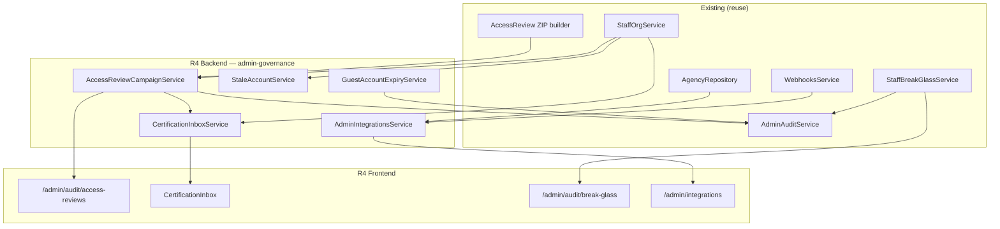

# Admin Control Plane R4 — Triển khai chi tiết (Identity Governance)

> **For agentic workers:** REQUIRED SUB-SKILL: Use superpowers:subagent-driven-development or superpowers:executing-plans. Steps dùng checkbox (`- [ ]`) để tracking.

> **Trạng thái:** ✅ Shipped · **Commit:** `adcf645` · **Phụ thuộc:** R3 shipped (`4112ce3`)  
> **Spec:** [`docs/specs/2026-08-11-admin-control-plane-ia.md`](../specs/2026-08-11-admin-control-plane-ia.md) §13 R4, §8.2, §15  
> **App:** `services/ops-web` + `services/ptt-crm-api` · **Domain:** `https://rs.pttads.vn`

---

## Mục lục

1. [Mục tiêu R4](#1-mục-tiêu-r4)
2. [As-is vs target](#2-as-is-vs-target)
3. [Kiến trúc tổng quan](#3-kiến-trúc-tổng-quan)
4. [Task R4-1 — Access review campaigns (backend)](#4-task-r4-1--access-review-campaigns-backend)
5. [Task R4-2 — Certification inbox (manager flow)](#5-task-r4-2--certification-inbox-manager-flow)
6. [Task R4-3 — Stale account report](#6-task-r4-3--stale-account-report)
7. [Task R4-4 — Guest / contractor TTL](#7-task-r4-4--guest--contractor-ttl)
8. [Task R4-5 — Break-glass governance UI](#8-task-r4-5--break-glass-governance-ui)
9. [Task R4-6 — Integration registry](#9-task-r4-6--integration-registry)
10. [Task R4-7 — Control Plane nav + hub](#10-task-r4-7--control-plane-nav--hub)
11. [Task R4-8 — DDL & cron jobs](#11-task-r4-8--ddl--cron-jobs)
12. [CSS](#12-css)
13. [Tests & scripts](#13-tests--scripts)
14. [Deploy VPS](#14-deploy-vps)
15. [UAT governance checklist](#15-uat-governance-checklist)
16. [Exit criteria R4](#16-exit-criteria-r4)
17. [Out of scope (R5+)](#17-out-of-scope-r5)
18. [Phụ lục](#18-phụ-lục)

---

## 1. Mục tiêu R4

**Goal:** **Identity Governance** — quarterly access review có workflow (không chỉ ZIP), stale account visibility, guest TTL, break-glass enterprise polish, integration registry tập trung.

| Metric | R3 (as-is) | R4 target |
|--------|------------|-----------|
| Access review | ZIP export + CSV apply stub (PO-only) | **Campaign** + manager certify + deadline |
| Manager certification | Không có inbox | **1 màn** duyệt quyền team |
| Stale accounts | `last_login_at` có, không report | **Report** >90 ngày + admin orphan alert |
| Guest / contractor | Mọi user = staff vĩnh viễn | **TTL** tự deactivate + audit |
| Break-glass | Modal trên permissions; TTL **24h** hardcode | **Trang governance**; TTL **4h** configurable; cron VPS |
| Integrations | Rải rác agency client detail | **`/admin/integrations`** health + rotate CTA |
| Cycle time | N/A | **≤5 ngày** pilot 1 phòng ban |

**Pitch:**

> HubSpot có Access Review campaigns. RNOSAI R4 biến ZIP quarterly thành **workflow có deadline** — trưởng phòng certify trong inbox, IT đóng campaign, mọi quyết định vào Audit Center R3.

**Phụ thuộc đã có (reuse, không viết lại):**

| Artifact | Path | Ghi chú |
|----------|------|---------|
| Access review ZIP | `staff-permissions-access-review.service.ts` | Snapshot caps per user — **reuse at campaign launch** |
| Apply CSV stub | `POST .../access-review/apply` | Extend → thực revoke caps khi item `revoke` |
| Actions log | `staff_access_review_actions` | Giữ; campaign close ghi batch |
| Break-glass API | `staff-break-glass/*` | request/approve/list/revoke-expired |
| Break-glass UI | `BreakGlassRequestModal.tsx` | Refactor → dedicated page + link audit |
| Audit Center | `/admin/audit` | Deep-link campaign events |
| Org effective caps | `StaffOrgService.getEffectiveCaps` | Source of truth cho certification diff |
| Channel tokens | `agency.repository.ts` → `client_channel_accounts` | Integration registry read model |
| Webhooks | `webhooks/*` + `AppConfigService` flags | Health row per channel |
| Team membership | `staff_user_teams.team_role` | Manager scope (`lead`) cho inbox |

---

## 2. As-is vs target

| Thành phần | As-is | Gap R4 |
|------------|-------|--------|
| `/admin/audit/access-reviews` | Route chưa có | Campaign list + wizard + detail |
| Certification inbox | — | Manager-filtered items + bulk certify |
| `staff_access_review_actions` | Quarter string + CSV apply | Link `campaign_id`, decision enum |
| Stale report | — | API + UI tab |
| `staff_users` | `active`, `last_login_at` | **`account_kind`**, **`expires_at`** |
| Break-glass TTL | 24h in repo | **4h** env + countdown UI |
| Break-glass page | Modal only on permissions | **`/admin/audit/break-glass`** |
| `/admin/integrations` | Planned | Registry table + health badges |
| Nav compliance | Audit Center only | + Access reviews, Break-glass, Integrations |
| Revoke on certify | `revoke_stub` count only | **Real** deactivate / cap strip (scoped) |

---

## 3. Kiến trúc tổng quan



**Nguyên tắc:**

1. **Campaign = snapshot + workflow** — lúc `launch`, freeze effective caps vào `admin_access_review_items.snapshot_json`; quyết định manager không đổi snapshot (audit trail).
2. **Không duplicate RBAC engine** — certify/revoke gọi `StaffOrgService` / permissions APIs đã có; campaign chỉ orchestration.
3. **Cap-gated** — PO/IT: `crm_data_config.configure`; manager inbox: cap mới `admin_access_review.certify` **hoặc** `team_role=lead` + scoped team (khuyến nghị cap + team scope).
4. **Integrations read-only first** — không expose raw token; masked `••••` + `token_status` + rotate deep-link agency UI.
5. **Mọi mutation → R3 audit** — `admin_audit_log` event `access_review_*`, `guest_expired`, `integration_rotate_requested`.

---

## 4. Task R4-1 — Access review campaigns (backend)

### 4.1. Types

**Create:** `services/ptt-crm-api/src/admin-governance/admin-governance.types.ts`

```typescript
export type AccessReviewCampaignStatus =
  | 'draft'
  | 'active'
  | 'completed'
  | 'cancelled';

export type AccessReviewScopeType = 'all' | 'department' | 'team' | 'permission_set';

export type AccessReviewItemDecision =
  | 'pending'
  | 'certified'
  | 'revoke_requested'
  | 'escalated'
  | 'deferred';

export type AccessReviewCampaign = {
  id: string;
  title: string;
  quarter: string;           // 2026-Q3
  status: AccessReviewCampaignStatus;
  scope_type: AccessReviewScopeType;
  scope_ref: string | null;  // dept id, team id, set code
  due_at: string;
  owner_email: string;
  launched_at: string | null;
  closed_at: string | null;
  item_counts: { pending: number; certified: number; revoke: number };
  created_at: string;
};

export type AccessReviewItem = {
  id: string;
  campaign_id: string;
  user_id: string;
  user_email: string;
  user_display_name: string;
  position_code: string | null;
  team_ids: number[];
  snapshot_json: Record<string, unknown>; // effective caps at launch
  decision: AccessReviewItemDecision;
  certifier_email: string | null;
  certifier_note: string | null;
  decided_at: string | null;
};
```

### 4.2. DDL (see R4-8)

Tables: `admin_access_review_campaigns`, `admin_access_review_items`.

### 4.3. Service — campaign lifecycle

**Create:** `services/ptt-crm-api/src/admin-governance/access-review-campaign.service.ts`

| Method | Behavior |
|--------|----------|
| `createDraft(body)` | Validate quarter format `YYYY-Q[1-4]`, default due = now + 14d |
| `launch(campaignId, actorEmail)` | Resolve user list from scope → insert items with `getEffectiveCaps` snapshot; status → `active`; audit log |
| `listCampaigns(filters)` | PO view all; manager sees campaigns where they have pending team items |
| `getCampaign(id)` | Header + aggregate counts |
| `close(campaignId, actorEmail)` | Apply pending `revoke_requested` via org/permissions; status → `completed`; write `staff_access_review_actions` batch |
| `cancel(id)` | Only if `draft` or zero decisions |

**Launch algorithm:**

```typescript
// Pseudocode
const users = await org.listUsers({ scope: campaign.scope });
for (const u of users) {
  const effective = await org.getEffectiveCaps(u.id);
  await itemsRepo.insert({
    campaign_id,
    user_id: u.id,
    snapshot_json: effective,
    decision: 'pending',
  });
}
```

Reuse ZIP manifest fields from `StaffPermissionsAccessReviewService.buildZip` for consistency.

### 4.4. Controller

**Create:** `services/ptt-crm-api/src/admin-governance/admin-governance.controller.ts`

Base: `/api/v1/admin/governance`

| Method | Path | Guard | Response |
|--------|------|-------|----------|
| `GET` | `/access-reviews/campaigns` | configure | `{ campaigns: [] }` |
| `POST` | `/access-reviews/campaigns` | configure | Campaign |
| `GET` | `/access-reviews/campaigns/:id` | configure OR certify | Campaign + stats |
| `PATCH` | `/access-reviews/campaigns/:id` | configure | Update draft title/due/scope |
| `POST` | `/access-reviews/campaigns/:id/launch` | configure | `{ launched: n_items }` |
| `POST` | `/access-reviews/campaigns/:id/close` | configure | `{ closed: true, applied_revokes: n }` |
| `GET` | `/access-reviews/campaigns/:id/items` | configure OR certify | Paginated items |
| `GET` | `/access-reviews/campaigns/:id/export.zip` | configure | Reuse ZIP builder filtered by campaign users |

**Register** `AdminGovernanceModule` in `app.module.ts`.

### Checklist R4-1

- [ ] **Step 1:** DDL apply script + migration version row
- [ ] **Step 2:** Repository CRUD campaigns + items
- [ ] **Step 3:** `launch` integration test (10 users mock)
- [ ] **Step 4:** `close` applies revoke → `active=false` or cap strip (document rule)
- [ ] **Step 5:** Audit events in `admin_audit_log`

---

## 5. Task R4-2 — Certification inbox (manager flow)

### 5.1. Item decision API

| Method | Path | Guard | Body |
|--------|------|-------|------|
| `PATCH` | `/access-reviews/items/:itemId` | certify guard | `{ decision, note? }` |
| `POST` | `/access-reviews/items/bulk` | certify guard | `{ item_ids[], decision, note? }` |

**Certify guard logic:**

```typescript
// guards/access-review-certify.guard.ts
// Allow if:
// 1) hasCap(user, 'admin_access_review', 'certify') OR crm_data_config.configure
// 2) item.user is in team where requester has team_role = 'lead'
// 3) campaign status === 'active' && now <= due_at (+ grace 24h optional)
```

### 5.2. Inbox query

`GET /access-reviews/inbox?campaign_id=&decision=pending`

- Default: campaigns `active` where caller is certifier for ≥1 pending item
- Sort: due_at ASC, user_email
- Include `days_until_due`, `risk_flags[]` (admin caps, break-glass active, never logged in)

### 5.3. Frontend — Access Reviews UI

**Create:**

```
services/ops-web/src/app/admin/audit/access-reviews/page.tsx          # Campaign list
services/ops-web/src/app/admin/audit/access-reviews/new/page.tsx     # Create wizard
services/ops-web/src/app/admin/audit/access-reviews/[id]/page.tsx    # PO detail
services/ops-web/src/app/admin/audit/access-reviews/inbox/page.tsx   # Manager inbox
services/ops-web/src/components/admin/governance/
  AccessReviewCampaignTable.tsx
  AccessReviewCampaignWizard.tsx
  AccessReviewItemDrawer.tsx
  CertificationInboxTable.tsx
  AccessReviewDecisionBadge.tsx
```

**Wizard steps (4):**

1. Title + quarter (auto-suggest current quarter)
2. Scope: all / department / team / permission set
3. Due date + owner email
4. Review summary → **Launch** (or Save draft)

**Item drawer:**

- Snapshot caps read-only (from `snapshot_json`)
- Compare với current effective (optional diff chip — nice-to-have)
- Actions: **Certify** · **Yêu cầu thu hồi** · **Escalate IT** · **Hoãn**
- Link → user identity `/admin/crm/permissions/users?email=`

**Migrate** `WinAccessReviewExport` — giữ nút ZIP trên permissions; thêm CTA **"Tạo campaign →"** link `/admin/audit/access-reviews/new`.

### 5.4. API client

**Modify:** `services/ops-web/src/lib/api.ts`

```typescript
fetchAccessReviewCampaigns(token, params?)
createAccessReviewCampaign(token, body)
launchAccessReviewCampaign(token, id)
fetchAccessReviewInbox(token, params?)
patchAccessReviewItem(token, itemId, body)
```

### Checklist R4-2

- [ ] **Step 1:** Certify guard + team lead scope unit tests
- [ ] **Step 2:** Inbox API
- [ ] **Step 3:** Campaign list + wizard pages
- [ ] **Step 4:** Inbox page with bulk certify
- [ ] **Step 5:** PO close campaign flow on detail page
- [ ] **Step 6:** Deep link from Audit Center filter `category=access_review`

---

## 6. Task R4-3 — Stale account report

### 6.1. Backend

**Create:** `services/ptt-crm-api/src/admin-governance/stale-account.service.ts`

`GET /api/v1/admin/governance/stale-accounts`

| Query | Default | Notes |
|-------|---------|-------|
| `inactive_days` | 90 | `last_login_at < now - N days` OR NULL |
| `include_never_logged_in` | true | |
| `include_inactive_flag` | false | `active=false` still listed if requested |
| `admin_only` | false | If true: filter users with cap containing `configure` on sensitive sections |

**Response row:**

```typescript
{
  user_id: string;
  email: string;
  display_name: string;
  active: boolean;
  last_login_at: string | null;
  days_since_login: number | null;
  position_code: string | null;
  risk: 'orphaned_admin' | 'never_logged_in' | 'stale' | 'inactive';
  admin_cap_count: number;
}
```

**Risk rules:**

| risk | Condition |
|------|-----------|
| `never_logged_in` | `last_login_at IS NULL` AND `active` AND age > 7d |
| `stale` | `last_login_at < threshold` |
| `orphaned_admin` | has `crm_data_config.configure` OR `view_pii` AND stale |
| `inactive` | `active=false` |

### 6.2. Frontend

**Create:** `services/ops-web/src/app/admin/audit/stale-accounts/page.tsx`

- Filter bar: days (30/60/90/180), risk checkboxes
- Table: email, last login, position, risk badge, actions
- Row actions: **Offboard** → `/admin/crm/org/users?email=` · **Nhắc đăng nhập** (email stub/log only R4)
- Export CSV button (client-side from loaded rows)

**Optional cron:** `scripts/notify_stale_staff_accounts.sh` — weekly email IT if `orphaned_admin` count > 0.

### Checklist R4-3

- [ ] **Step 1:** Service + SQL with index on `staff_users(last_login_at)`
- [ ] **Step 2:** API + guard (configure)
- [ ] **Step 3:** UI page + nav link
- [ ] **Step 4:** Link stale users from campaign item `risk_flags`

---

## 7. Task R4-4 — Guest / contractor TTL

### 7.1. DDL

**Extend `staff_users`:**

```sql
ALTER TABLE staff_users
  ADD COLUMN IF NOT EXISTS account_kind VARCHAR(16) NOT NULL DEFAULT 'staff',
  ADD COLUMN IF NOT EXISTS expires_at TIMESTAMPTZ;

CREATE INDEX IF NOT EXISTS idx_staff_users_expires
  ON staff_users (expires_at)
  WHERE expires_at IS NOT NULL AND active IS TRUE;

COMMENT ON COLUMN staff_users.account_kind IS 'staff | guest | contractor';
```

### 7.2. Backend behavior

| Event | Action |
|-------|--------|
| Login | Reject if `expires_at <= NOW()` → `{ error: 'account_expired' }` |
| Create user | Accept `account_kind`, `expires_at` on onboard API |
| Cron hourly | `deactivate_expired_staff_accounts` → `active=false`, audit `guest_expired` |

**Modify:**

- `staff-org-users.repository.ts` — insert/update columns
- `staff-auth.service.ts` — expiry check post credential verify
- `staff-org-audit` — log kind/expiry changes

### 7.3. Frontend

**Modify:** `/admin/crm/org/users/new` onboard wizard

- Step 1: account type radio **Nhân viên** · **Khách (guest)** · **Cộng tác viên**
- Guest/contractor: required **Ngày hết hạn** (default +30d / +90d presets)
- Badge on user list: `Guest · còn 12 ngày`

### Checklist R4-4

- [ ] **Step 1:** DDL + apply script section in R4-8
- [ ] **Step 2:** Auth reject expired
- [ ] **Step 3:** Onboard wizard fields
- [ ] **Step 4:** Cron script + VPS cron doc
- [ ] **Step 5:** Audit Center event on auto-deactivate

---

## 8. Task R4-5 — Break-glass governance UI

### 8.1. Align TTL to spec (4h)

**Modify:** `staff-break-glass.repository.ts`

```typescript
const TTL_HOURS = Number(process.env.BREAK_GLASS_TTL_HOURS ?? 4);
```

VPS env: `BREAK_GLASS_TTL_HOURS=4`

**Modify:** `BreakGlassRequestModal.tsx` copy → "TTL 4h" (read from API meta optional).

### 8.2. Dedicated page

**Create:** `services/ops-web/src/app/admin/audit/break-glass/page.tsx`

Sections:

| Section | Content |
|---------|---------|
| Yêu cầu mới | Reuse modal form inline (reason + cap picker — not hardcoded GDKD only) |
| Chờ duyệt | Pending grants (approver) |
| Đang active | Approved + **countdown** to `expires_at` |
| Lịch sử | Link **Audit Center** filter `category=rbac_event&q=break_glass` |

**Enhance modal:**

- Cap multi-select from catalog (not only `crm_gdkd.override`)
- Show active grant banner if user already has approved grant

### 8.3. Cron (document + verify VPS)

Existing: `POST /api/v1/staff/break-glass/revoke-expired`

**Script:** `scripts/revoke_expired_break_glass.sh` (create if missing)

```bash
# Cron: */15 * * * * curl -sf -X POST http://127.0.0.1:3000/api/v1/staff/break-glass/revoke-expired -H "Authorization: Bearer $INTERNAL_KEY"
```

### Checklist R4-5

- [ ] **Step 1:** Env TTL 4h + unit test expiry
- [ ] **Step 2:** Break-glass page
- [ ] **Step 3:** Cap picker component
- [ ] **Step 4:** Permissions page button → link page (keep modal shortcut optional)
- [ ] **Step 5:** VPS cron verify

---

## 9. Task R4-6 — Integration registry

### 9.1. Read model

**Create:** `services/ptt-crm-api/src/admin-governance/admin-integrations.service.ts`

Aggregate rows (no secrets):

| id | kind | name | status | detail | actions |
|----|------|------|--------|--------|---------|
| `webhook-meta` | webhook | Meta lead webhook | ok/disabled | Nest flag + last job | — |
| `webhook-zalo` | webhook | Zalo OA | ok/missing | flag | — |
| `channel-meta-{clientId}` | oauth | Meta Ads · Client X | token_status | expires_at masked | rotate_href |
| `channel-zalo-{clientId}` | oauth | Zalo · Client Y | expiring | | rotate_href |
| `staff-sso` | auth | Keycloak SSO | configured | staff_sso_configured | `/admin/crm/sso/groups` |

**Sources:**

- `AppConfigService`: `webhooksNestMetaEnabled`, etc.
- `AgencyRepository`: aggregate token_status counts + worst clients
- `webhooks/job-queue.repository.ts`: last error / lag (optional)

### 9.2. API

Base: `/api/v1/admin/integrations`

| Method | Path | Guard | Notes |
|--------|------|-------|-------|
| `GET` | `/` | `crm_data_config.view` | `{ integrations: [] }` |
| `GET` | `/health` | view | Summary `{ ok, warning, critical }` |
| `POST` | `/:id/rotate-request` | configure | Audit log only; returns `{ redirect_href }` to agency OAuth |

**Không** implement token rotation server-side in R4 — deep link `/agency/clients/{id}?tab=channels`.

### 9.3. Frontend

**Create:** `services/ops-web/src/app/admin/integrations/page.tsx`

- Summary cards: Webhooks OK / Tokens expiring / Tokens expired
- Table with status badges (`ok`, `warning`, `critical`, `disabled`)
- Filter: kind (webhook | oauth | auth)
- Row action: **Xoay token** → agency detail (new tab)

**Nav:** new group `integrations` **or** link under compliance — khuyến nghị **group riêng** "Tích hợp & Kết nối" vì audience = IT ops + agency admin.

```typescript
// admin-nav.ts — new group id 'integrations'
{ href: '/admin/integrations', label: 'Registry tích hợp' }
```

### Checklist R4-6

- [ ] **Step 1:** Service aggregating agency + config (unit test with mocks)
- [ ] **Step 2:** Controller + guards
- [ ] **Step 3:** Integrations page
- [ ] **Step 4:** Hub workspace card 🔌
- [ ] **Step 5:** Health endpoint for future alerting

---

## 10. Task R4-7 — Control Plane nav + hub

### 10.1. Modify `admin-nav.ts`

**Extend `AdminNavGroupId`:** `'integrations'`

**`buildComplianceLinks`:**

```typescript
{ href: '/admin/audit/access-reviews', label: 'Access review campaigns' },
{ href: '/admin/audit/access-reviews/inbox', label: 'Inbox duyệt quyền' },
{ href: '/admin/audit/stale-accounts', label: 'Tài khoản không hoạt động' },
{ href: '/admin/audit/break-glass', label: 'Break-glass' },
```

**New `buildIntegrationsLinks`:**

```typescript
{ href: '/admin/integrations', label: 'Registry tích hợp' },
{ href: '/admin/crm/sso/groups', label: 'SSO groups' }, // cross-link
```

### 10.2. Hub cards

| Workspace | Icon | Stat |
|-----------|------|------|
| Audit & Tuân thủ | 🛡 | N campaigns active |
| Tích hợp | 🔌 | N tokens expiring |

Fetch stats from lightweight API or client-side on hub mount.

### 10.3. Admin search index

**Modify:** `admin-search.ts` — add routes access-reviews, stale-accounts, break-glass, integrations.

### Checklist R4-7

- [ ] **Step 1:** Nav groups + hub workspaces
- [ ] **Step 2:** Search index
- [ ] **Step 3:** Breadcrumb labels VI
- [ ] **Step 4:** Remove `win-planned-card` for R4 routes once shipped

---

## 11. Task R4-8 — DDL & cron jobs

### 11.1. SQL file

**Create:** `docs/specs/2026-08-11-postgresql-ddl-admin-governance-r4.sql`

```sql
-- Campaigns
CREATE TABLE IF NOT EXISTS admin_access_review_campaigns (
  id UUID PRIMARY KEY DEFAULT gen_random_uuid(),
  title TEXT NOT NULL,
  quarter TEXT NOT NULL,
  status TEXT NOT NULL DEFAULT 'draft',
  scope_type TEXT NOT NULL DEFAULT 'all',
  scope_ref TEXT,
  due_at TIMESTAMPTZ NOT NULL,
  owner_email TEXT NOT NULL,
  launched_at TIMESTAMPTZ,
  closed_at TIMESTAMPTZ,
  created_at TIMESTAMPTZ NOT NULL DEFAULT NOW(),
  updated_at TIMESTAMPTZ NOT NULL DEFAULT NOW()
);

CREATE INDEX IF NOT EXISTS idx_ar_campaigns_status_due
  ON admin_access_review_campaigns (status, due_at);

CREATE TABLE IF NOT EXISTS admin_access_review_items (
  id UUID PRIMARY KEY DEFAULT gen_random_uuid(),
  campaign_id UUID NOT NULL REFERENCES admin_access_review_campaigns(id) ON DELETE CASCADE,
  user_id UUID NOT NULL,
  user_email TEXT NOT NULL,
  user_display_name TEXT NOT NULL DEFAULT '',
  position_code TEXT,
  team_ids JSONB NOT NULL DEFAULT '[]'::jsonb,
  snapshot_json JSONB NOT NULL DEFAULT '{}'::jsonb,
  decision TEXT NOT NULL DEFAULT 'pending',
  certifier_email TEXT,
  certifier_note TEXT,
  decided_at TIMESTAMPTZ,
  created_at TIMESTAMPTZ NOT NULL DEFAULT NOW(),
  UNIQUE (campaign_id, user_id)
);

CREATE INDEX IF NOT EXISTS idx_ar_items_campaign_decision
  ON admin_access_review_items (campaign_id, decision);

CREATE INDEX IF NOT EXISTS idx_ar_items_certifier_pending
  ON admin_access_review_items (campaign_id, decision)
  WHERE decision = 'pending';

-- Extend staff_access_review_actions
ALTER TABLE staff_access_review_actions
  ADD COLUMN IF NOT EXISTS campaign_id UUID REFERENCES admin_access_review_campaigns(id);

-- staff_users guest TTL (see R4-4)
-- admin_audit_log category extension — no DDL if free-text action

INSERT INTO schema_migrations (version, description) VALUES
  ('2026-08-11-admin-governance-r4', 'R4 access review campaigns + guest TTL')
ON CONFLICT (version) DO NOTHING;
```

### 11.2. Apply script

**Create:** `scripts/apply_pg_ddl_admin_governance_r4.sh`

Mirror `apply_pg_ddl_admin_audit_r3.sh` pattern.

### 11.3. Cron scripts

| Script | Schedule | Purpose |
|--------|----------|---------|
| `scripts/revoke_expired_break_glass.sh` | `*/15 * * * *` | TTL enforcement |
| `scripts/deactivate_expired_staff_accounts.sh` | `0 * * * *` | Guest/contractor expiry |
| `scripts/notify_stale_staff_accounts.sh` | `0 8 * * 1` | Weekly IT digest (optional) |

### Checklist R4-8

- [ ] **Step 1:** SQL + apply script tested local PG
- [ ] **Step 2:** Index EXPLAIN on stale query + inbox pending
- [ ] **Step 3:** Cron docs in runbook

---

## 12. CSS

**Modify:** `services/ops-web/src/app/globals.css`

```css
.admin-governance-page {
  display: flex;
  flex-direction: column;
  gap: 1rem;
}

.admin-ar-campaign-status {
  display: inline-flex;
  align-items: center;
  gap: 0.35rem;
  padding: 0.15rem 0.55rem;
  border-radius: 999px;
  font-size: 0.75rem;
  font-weight: 600;
}

.admin-ar-campaign-status--active {
  background: color-mix(in srgb, var(--primary) 12%, transparent);
  color: var(--primary);
}

.admin-ar-campaign-status--completed {
  background: color-mix(in srgb, var(--success, #15803d) 12%, transparent);
}

.admin-cert-inbox-row--overdue {
  border-left: 3px solid var(--danger, #b91c1c);
}

.admin-integration-status--critical {
  color: var(--danger, #b91c1c);
  font-weight: 700;
}

.admin-break-glass-countdown {
  font-variant-numeric: tabular-nums;
  font-weight: 600;
}
```

---

## 13. Tests & scripts

| Test | Command |
|------|---------|
| Campaign service unit | `npm run test:unit -- access-review-campaign.service.spec.ts` |
| Certify guard | `access-review-certify.guard.spec.ts` |
| Stale account SQL | integration test |
| Integrations aggregator | `admin-integrations.service.spec.ts` |
| Break-glass TTL | extend `staff-break-glass.spec.ts` |
| E2E governance | `e2e/admin-control-plane-r4-governance.spec.ts` |
| Build FE | `cd services/ops-web && npm run build` |
| Build API | `cd services/ptt-crm-api && npm run build` |

**E2E scenarios:**

```typescript
test('PO creates and launches access review campaign', ...);
test('manager certifies team member from inbox', ...);
test('stale accounts page lists never-logged-in user', ...);
test('break-glass page shows pending approval', ...);
test('integrations registry lists meta webhook row', ...);
test('hub reaches access reviews in ≤2 clicks', ...);
```

**package.json ops-web:**

```json
"test:e2e:admin-governance": "playwright test e2e/admin-control-plane-r4-governance.spec.ts"
```

**Cap seed (rbac catalog):**

| section | action | Label |
|---------|--------|-------|
| `admin_access_review` | `certify` | Duyệt access review team |
| `admin_access_review` | `view` | Xem campaigns (manager read-only) |

PO retains `crm_data_config.configure` for launch/close.

---

## 14. Deploy VPS

### 14.1. Order

1. Apply PG DDL (`apply_pg_ddl_admin_governance_r4.sh`)
2. Deploy `ptt-crm-api` (`AdminGovernanceModule`)
3. Deploy `ops-web` (new routes)
4. Set env:
   - `BREAK_GLASS_TTL_HOURS=4`
   - `ADMIN_GOVERNANCE_ENABLED=1` (feature flag optional)
5. Cron: break-glass revoke + guest expiry
6. Restart `ptt-crm-api` + `ptt-ops-web`

### 14.2. Commands

```bash
git push origin main
ssh deploy@rs.pttads.vn 'cd /var/www/rnosai && git pull --ff-only origin main \
  && ./scripts/apply_pg_ddl_admin_governance_r4.sh \
  && (cd services/ptt-crm-api && npm ci && npm run build) \
  && ./scripts/deploy_ops_web.sh \
  && sudo -n systemctl restart ptt-crm-api ptt-ops-web'
```

### 14.3. Smoke

```bash
curl -sf http://127.0.0.1:3000/health
curl -s -o /dev/null -w "%{http_code}\n" http://127.0.0.1:3000/api/v1/admin/governance/stale-accounts
# expect 401 without token, not 404
curl -s -o /dev/null -w "%{http_code}\n" http://127.0.0.1:3200/admin/audit/access-reviews
# expect 307 → login
```

---

## 15. UAT governance checklist

| # | Scenario | Persona | Pass |
|---|----------|---------|------|
| 1 | Create campaign scope = 1 team | PO | ☐ |
| 2 | Launch → N items pending | PO | ☐ |
| 3 | Manager inbox shows only team members | Trưởng phòng | ☐ |
| 4 | Certify item → decision saved | Trưởng phòng | ☐ |
| 5 | Revoke request → close applies deactivate | PO | ☐ |
| 6 | Campaign completes ≤5 ngày pilot | IT | ☐ |
| 7 | Stale report flags orphaned admin | Security | ☐ |
| 8 | Guest account expires → cannot login | IT | ☐ |
| 9 | Break-glass 4h auto-revoke | Security | ☐ |
| 10 | Integrations shows expiring Meta token | Agency ops | ☐ |
| 11 | All decisions visible in Audit Center | Auditor | ☐ |
| 12 | Mobile inbox usable | Manager | ☐ |

---

## 16. Exit criteria R4

| Criteria | Verify | Spec ref |
|----------|--------|----------|
| Access review campaign pilot 1 phòng ban | UAT #1–6 timing | §13 R4, §15 |
| 0 orphaned admin without stale report visibility | UAT #7 | §13 KPI |
| Guest TTL auto-deactivate | UAT #8 + cron log | §13 |
| Break-glass TTL 4h + audit trail | UAT #9 | §13 |
| Integration registry health | UAT #10 | §8.2 |
| Scorecard Audit & compliance ≥4.5 | PO sign-off | §14 |
| `/admin/audit/access-reviews` ≤2 click from hub | E2E | §5.2 |

---

## 17. Out of scope (R5+)

| Item | Phase |
|------|-------|
| Policy simulator v2 what-if | R5 `/admin/policies` |
| OPA visual editor | R5 |
| Environment diff staging vs prod | R5 |
| AI governance policies | R5 `/admin/ai/policies` |
| 2-person approval matrix change | R5 SoD workflow |
| Full PII interceptor all routes | R5 |
| SCIM / HRIS bidirectional | R5+ |
| Real automated cap revoke engine (complex rules) | R5 — R4 chỉ deactivate + manual strip |
| Service account API keys UI | R5 |

---

## File tree (expected after R4)

```
services/ptt-crm-api/src/admin-governance/
├── admin-governance.module.ts
├── admin-governance.controller.ts
├── admin-governance.types.ts
├── access-review-campaign.service.ts
├── access-review-campaign.repository.ts
├── access-review-campaign.service.spec.ts
├── certification-inbox.service.ts
├── stale-account.service.ts
├── stale-account.service.spec.ts
├── guest-account-expiry.service.ts
├── admin-integrations.service.ts
├── admin-integrations.service.spec.ts
└── guards/
    ├── admin-governance-view.guard.ts
    └── access-review-certify.guard.ts

services/ops-web/src/
├── app/admin/audit/access-reviews/
│   ├── page.tsx
│   ├── new/page.tsx
│   ├── [id]/page.tsx
│   └── inbox/page.tsx
├── app/admin/audit/stale-accounts/page.tsx
├── app/admin/audit/break-glass/page.tsx
├── app/admin/integrations/page.tsx
├── components/admin/governance/
│   ├── AccessReviewCampaignTable.tsx
│   ├── AccessReviewCampaignWizard.tsx
│   ├── AccessReviewItemDrawer.tsx
│   ├── CertificationInboxTable.tsx
│   ├── StaleAccountTable.tsx
│   ├── BreakGlassGovernancePanel.tsx
│   └── IntegrationRegistryTable.tsx
└── lib/admin/admin-nav.ts              ← MODIFY

docs/specs/2026-08-11-postgresql-ddl-admin-governance-r4.sql
scripts/apply_pg_ddl_admin_governance_r4.sh
scripts/revoke_expired_break_glass.sh
scripts/deactivate_expired_staff_accounts.sh
scripts/notify_stale_staff_accounts.sh
e2e/admin-control-plane-r4-governance.spec.ts
```

**Estimated effort:** 4–5 tuần · **4 PRs** khuyến nghị:

| PR | Scope |
|----|-------|
| **R4-A** | DDL + campaign backend + launch/close |
| **R4-B** | Certification inbox UI + manager guard |
| **R4-C** | Stale accounts + guest TTL + cron |
| **R4-D** | Break-glass page + integrations registry + nav + E2E |

---

## Thứ tự implement khuyến nghị

1. R4-8 DDL (campaigns + staff_users columns)
2. R4-1 Campaign service + launch
3. R4-2 Inbox API + certify guard
4. R4-2 Frontend campaigns + inbox (ship read-only list first)
5. R4-3 Stale accounts (quick win for security demo)
6. R4-5 Break-glass TTL + page
7. R4-4 Guest TTL + onboard wizard
8. R4-6 Integration registry
9. R4-7 Nav + hub + search
10. E2E + VPS deploy + pilot 1 phòng ban

---

## Phụ lục — Liên kết plans

| Phase | Plan | Status |
|-------|------|--------|
| P0–P3 | [`2026-08-11-admin-control-plane-p0.md`](2026-08-11-admin-control-plane-p0.md) … p3 | ✅ |
| R3 | [`2026-08-11-admin-control-plane-r3.md`](2026-08-11-admin-control-plane-r3.md) | ✅ `4112ce3` |
| **R4** | This document | ✅ `adcf645` |
| **R5** | [`2026-08-11-admin-control-plane-r5.md`](2026-08-11-admin-control-plane-r5.md) | 📋 Ready |

---

## Phụ lục — Campaign status → badge

| status | VI label | Color |
|--------|----------|-------|
| `draft` | Nháp | muted |
| `active` | Đang chạy | primary |
| `completed` | Hoàn tất | success |
| `cancelled` | Đã huỷ | muted |

---

## Phụ lục — Decision → action on close

| decision | On `close()` |
|----------|--------------|
| `certified` | Log only |
| `revoke_requested` | `active=false` OR strip elevated caps (PO confirm rule) |
| `escalated` | Notification IT (staff_notifications) |
| `deferred` | Carry to next campaign (manual) |
| `pending` | Block close unless `force=true` |

---

## Phụ lục — API sample (inbox item)

```json
{
  "id": "550e8400-e29b-41d4-a716-446655440000",
  "campaign_id": "...",
  "user_email": "am@pttads.vn",
  "user_display_name": "Account Manager",
  "position_code": "AM-01",
  "decision": "pending",
  "days_until_due": 3,
  "risk_flags": ["never_logged_in"],
  "snapshot_summary": {
    "cap_count": 42,
    "permission_sets": ["AM-STANDARD"],
    "sensitive_caps": ["crm_leads.view_pii"]
  }
}
```
