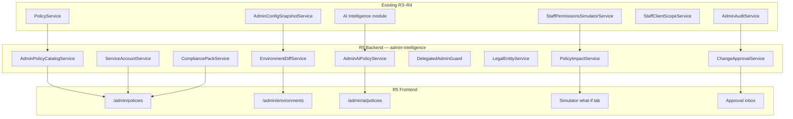
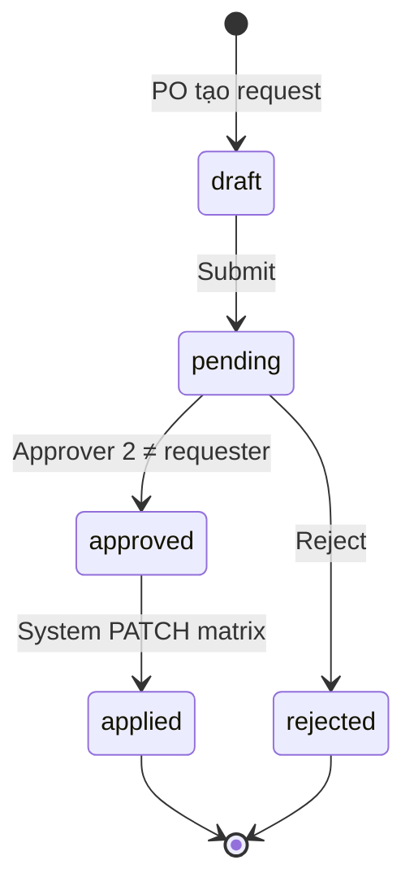

# Admin Control Plane R5 — Triển khai chi tiết (Policy Intelligence & Multi-entity)

> **For agentic workers:** REQUIRED SUB-SKILL: Use superpowers:subagent-driven-development or superpowers:executing-plans. Steps dùng checkbox (`- [ ]`) để tracking.

> **Trạng thái:** ✅ Shipped · **Phụ thuộc:** R4 shipped (`adcf645`)  
> **Spec:** [`docs/specs/2026-08-11-admin-control-plane-ia.md`](../specs/2026-08-11-admin-control-plane-ia.md) §13 R5, §8.2, §14–15  
> **App:** `services/ops-web` + `services/ptt-crm-api` · **Domain:** `https://rs.pttads.vn`

---

## Mục lục

1. [Mục tiêu R5](#1-mục-tiêu-r5)
2. [As-is vs target](#2-as-is-vs-target)
3. [Kiến trúc tổng quan](#3-kiến-trúc-tổng-quan)
4. [Phasing & PR map](#4-phasing--pr-map)
5. [Task R5-1 — Policy simulator v2 (what-if impact)](#5-task-r5-1--policy-simulator-v2-what-if-impact)
6. [Task R5-2 — OPA policy UI `/admin/policies`](#6-task-r5-2--opa-policy-ui-adminpolicies)
7. [Task R5-3 — Environment diff `/admin/environments`](#7-task-r5-3--environment-diff-adminenvironments)
8. [Task R5-4 — AI governance `/admin/ai/policies`](#8-task-r5-4--ai-governance-adminaipolicies)
9. [Task R5-5 — Change approval (2-person matrix rule)](#9-task-r5-5--change-approval-2-person-matrix-rule)
10. [Task R5-6 — Delegated admin scopes](#10-task-r5-6--delegated-admin-scopes)
11. [Task R5-7 — Org hierarchy v2 (multi-entity)](#11-task-r5-7--org-hierarchy-v2-multi-entity)
12. [Task R5-8 — Client data residency polish](#12-task-r5-8--client-data-residency-polish)
13. [Task R5-9 — Admin API keys (service accounts)](#13-task-r5-9--admin-api-keys-service-accounts)
14. [Task R5-10 — Compliance packs](#14-task-r5-10--compliance-packs)
15. [Task R5-11 — Control Plane nav + hub v2](#15-task-r5-11--control-plane-nav--hub-v2)
16. [Task R5-12 — DDL & scripts](#16-task-r5-12--ddl--scripts)
17. [CSS](#17-css)
18. [Tests & scripts](#18-tests--scripts)
19. [Deploy VPS](#19-deploy-vps)
20. [UAT intelligence checklist](#20-uat-intelligence-checklist)
21. [Exit criteria R5](#21-exit-criteria-r5)
22. [Out of scope (R6+)](#22-out-of-scope-r6)
23. [Phụ lục](#23-phụ-lục)

---

## 1. Mục tiêu R5

**Goal:** **Policy Intelligence & Multi-entity** — moat 12 tháng: what-if RBAC, OPA catalog UI, env diff, AI governance, delegated admin, 2-person approval, holding org, compliance packs.

| Metric | R4 (as-is) | R5 target |
|--------|------------|-----------|
| Simulator | v1: caps + menu preview 1 persona | **v2 what-if:** matrix delta → **N users impacted** <2s p95 |
| OPA | 3 policies in Rego + in-process engine | **`/admin/policies`** catalog + Rego export + bundle gate |
| Env compare | Snapshot ký trên permissions (R3) | **`/admin/environments`** staging vs prod diff |
| AI admin | Agents/tools/runs pages | **`/admin/ai/policies`** allowlist + spend cap + PII block |
| Matrix change | SoD banner (job function only) | **2-person approval** trước PATCH prod |
| Admin scope | `crm_data_config.configure` = full plane | **Delegated:** HR→org, PO→matrix, Security→audit |
| Org | dept → team → user | **Legal entity → branch → dept** |
| Client scope | AM pilot JWT `client_ids[]` | **Residency tags** + auto-filter UX |
| Integrations | Human staff JWT only | **Service account API keys** scoped |
| Onboarding RBAC | Manual matrix | **Compliance packs** (agency, BĐS, spa) 1-click |

**Pitch:**

> Salesforce có Permission Set Groups + sandbox compare. RNOSAI R5 gom **policy simulator v2 + OPA UI + 2-person rule** trong một Control Plane — IT demo “what-if MKT-02 mất cap X” trong 30 giây trước deal 300 NV.

**Phụ thuộc đã có (reuse):**

| Artifact | Path | R5 use |
|----------|------|--------|
| Simulator v1 | `staff-permissions-simulator.service.ts` | Extend impact engine |
| Simulator UI | `/admin/crm/permissions/simulator` | Tab “What-if matrix” |
| OPA engine | `policy/*` + `STAFF_POLICY_OPA` | Catalog sync + evaluate hook |
| Rego bundle | `policies/presales/*.rego` | Editor source of truth |
| Bundle gate | `scripts/deploy_opa_bundle.sh` | CI + export validation |
| Config snapshot | `admin-config-snapshot.service.ts` | Env diff baseline |
| Audit Center | `/admin/audit` | Approval + policy change timeline |
| SoD | `staff-org.sod.util.ts`, `WinSodBanner` | Extend rules catalog |
| Client scope | `staff-client-scope/*` | Residency tags |
| AI admin | `/admin/ai/agents`, `ai-intelligence` | Policy overlay per agent |
| Permission sets | `staff-permission-sets/*` | Compliance pack apply target |
| Field ABAC | WIN-4-B (partial) | Link from AI PII policy |
| Health policy flag | `staffPolicyOpaEnabled` | Fail-closed mutate |

---

## 2. As-is vs target

| Thành phần | As-is | Gap R5 |
|------------|-------|--------|
| `/admin/policies` | Planned | OPA catalog + Rego preview/export |
| `/admin/environments` | Planned | Snapshot diff staging↔prod |
| `/admin/ai/policies` | Planned | Per-agent governance rows |
| Simulator what-if | Không có | Matrix patch → user impact list |
| Matrix PATCH | Immediate + audit | **Pending approval** queue |
| Delegated admin | Single configure cap | Scope caps `admin_scope.*` |
| Org | `crm_departments` flat/parent | **`legal_entities`**, branches |
| Service accounts | Internal key only | **`/admin/integrations` keys tab** |
| Compliance packs | Manual catalog JSON | **Apply wizard** |
| Scorecard weighted | ~3.8 post-R4 | **≥4.5** target |

---

## 3. Kiến trúc tổng quan



**Nguyên tắc:**

1. **Policy engine không thay thế RBAC** — OPA = business rules layer (presales, break-glass); matrix vẫn PG source of truth.
2. **What-if read-only** — không ghi DB; impact scan có cache 60s keyed by `(position_id, patch_hash)`.
3. **2-person rule configurable** — flag `ADMIN_MATRIX_APPROVAL_REQUIRED=1`; bypass internal key + break-glass audit.
4. **Env diff không live-query prod** — pull signed snapshot từ prod API hoặc upload JSON export (security).
5. **Compliance packs = declarative** — JSON template → preview diff → apply via existing permission-set + matrix APIs.

---

## 4. Phasing & PR map

R5 quá lớn cho 1 PR. Khuyến nghị **5 PR / 6–8 tuần**:

| PR | Scope | Ship value |
|----|-------|------------|
| **R5-A** | Simulator v2 + PolicyImpact API + UI tab | Demo what-if nhanh |
| **R5-B** | OPA catalog UI + Rego export + bundle gate CI | IT transparency |
| **R5-C** | Environment diff + snapshot compare UI | Staging vs prod |
| **R5-D** | Change approval 2-person + delegated admin guards | Banking-grade |
| **R5-E** | AI policies + compliance packs + service accounts + org v2 (partial) | Full R5 exit |

**Thứ tự implement:** R5-12 DDL (minimal) → R5-1 → R5-2 → R5-3 → R5-5 → R5-6 → R5-4 → R5-10 → R5-9 → R5-7 → R5-8 → R5-11 → E2E.

---

## 5. Task R5-1 — Policy simulator v2 (what-if impact)

### 5.1. Problem

Simulator v1 trả caps + menu cho **1 tổ hợp** position/functions/sets. PO cần: *“Nếu bỏ `crm_leads.view_pii` khỏi ma trận KD-02, bao nhiêu user bị ảnh hưởng?”*

### 5.2. API

**Create:** `services/ptt-crm-api/src/admin-intelligence/policy-impact.service.ts`

| Method | Path | Guard | Body |
|--------|------|-------|------|
| `POST` | `/api/v1/admin/policy/simulate-impact` | configure | See below |

```typescript
export type SimulateMatrixImpactBody = {
  position_id: number;
  patch: {
    added?: Array<{ section: string; action: string }>;
    removed?: Array<{ section: string; action: string }>;
  };
  include_break_glass?: boolean;
  limit?: number; // default 50, max 200
};

export type MatrixImpactResult = {
  position_code: string;
  affected_user_count: number;
  sample_users: Array<{
    user_id: string;
    email: string;
    display_name: string;
    caps_removed: string[];
    caps_added: string[];
    menu_items_lost: string[];
  }>;
  aggregate: {
    caps_removed_unique: string[];
    users_with_pii_loss: number;
  };
  elapsed_ms: number;
};
```

**Algorithm:**

1. Load base caps for `position_id` + merge job functions + sets per active user on that position (`staff_users` + effective caps helper).
2. Apply virtual patch to position base caps (not persisted).
3. Diff effective caps per user vs baseline → count/menu delta via `buildNavPreview`.
4. p95 target **<2000ms** for ≤500 users on position (index `staff_users(position_id, active)`).

### 5.3. Frontend

**Modify:** `/admin/crm/permissions/simulator/page.tsx`

- Tab **“What-if ma trận”**: chọn position, diff chip +/- caps, nút **Tính impact**
- Table affected users + link identity card
- CTA **“Tạo change request →”** (R5-5)

**Modify:** `api.ts` — `simulateMatrixImpact(token, body)`

### Checklist R5-1

- [ ] **Step 1:** `PolicyImpactService` + unit tests (mock 10 users)
- [ ] **Step 2:** Controller route under `AdminIntelligenceController`
- [ ] **Step 3:** Simulator UI tab + bench script `scripts/bench_policy_impact.sh` (p95)
- [ ] **Step 4:** Audit log event `policy_simulate_impact` (info)

---

## 6. Task R5-2 — OPA policy UI `/admin/policies`

### 6.1. Scope v1 (không full Rego IDE)

| Feature | v1 | v2 (later) |
|---------|----|----|
| List policies from manifest | ✅ | |
| Edit description + enabled flag | ✅ | |
| View Rego read-only | ✅ | |
| Export bundle zip | ✅ | |
| Live Rego editor + compile | ❌ | R6 |
| Remote OPA sidecar | ❌ | R6 |

### 6.2. Backend

**Create:** `services/ptt-crm-api/src/admin-intelligence/admin-policy-catalog.service.ts`

| Method | Path | Notes |
|--------|------|-------|
| `GET` | `/api/v1/admin/policies` | `{ policies: [{ id, description, enabled, rego_preview, bundle_version }] }` |
| `GET` | `/api/v1/admin/policies/:id` | Full Rego text |
| `PATCH` | `/api/v1/admin/policies/:id` | Update metadata in PG `admin_policy_catalog` (not Rego file on disk in v1) |
| `POST` | `/api/v1/admin/policies/export-bundle` | Stream zip: manifest + rego files |
| `POST` | `/api/v1/admin/policies/validate` | Run `deploy_opa_bundle.sh` logic in-process |

**Sync:** On boot, read `policies/presales/manifest.json` → upsert `admin_policy_catalog`. Rego files remain git-tracked; PG holds enable/disable + VI description.

### 6.3. Frontend

**Create:** `services/ops-web/src/app/admin/policies/page.tsx`

Sections:

| Section | Content |
|---------|---------|
| Header | Bundle version badge (`2026-08-07-win4c-v1`) |
| Table | Policy ID, trạng thái, mô tả VI, actions |
| Drawer | Rego preview monospace + copy |
| Export | **Tải bundle ZIP** + **Validate** |

Link → `/admin/crm/permissions/simulator` tab what-if.

### Checklist R5-2

- [ ] **Step 1:** DDL `admin_policy_catalog`
- [ ] **Step 2:** Catalog service + manifest sync
- [ ] **Step 3:** Policies page + export
- [ ] **Step 4:** Wire `PolicyService.bundleVersion()` display on `/health` admin card

---

## 7. Task R5-3 — Environment diff `/admin/environments`

### 7.1. Data sources

| Source | Method |
|--------|--------|
| Local signed snapshot | R3 `admin_config_snapshots` |
| Remote prod snapshot | `POST` upload JSON **or** `GET` with one-time token `ADMIN_ENV_DIFF_TOKEN` |
| Live staging | Current matrix JSON from `StaffPermissionsService.exportMatrix()` |

### 7.2. API

**Create:** `environment-diff.service.ts`

| Method | Path | Body |
|--------|------|------|
| `GET` | `/api/v1/admin/environments/snapshots` | List local snapshots by type |
| `POST` | `/api/v1/admin/environments/diff` | `{ left_snapshot_id?, right_snapshot_id?, upload_json? }` |
| `GET` | `/api/v1/admin/environments/diff/:id` | Cached diff result |

**Diff output:**

```typescript
{
  summary: { added: number; removed: number; changed: number };
  matrix_diff: Array<{ position_code: string; added: string[]; removed: string[] }>;
  org_diff?: Array<{ entity: string; field: string; from: unknown; to: unknown }>;
  severity: 'info' | 'warning' | 'critical'; // critical if configure/delete caps drift
}
```

### 7.3. Frontend

**Create:** `/admin/environments/page.tsx`

- Left: staging (auto) · Right: prod snapshot dropdown or file upload
- Diff table with `WinDiffChip` pattern
- CTA **“Ký snapshot prod hiện tại”** → R3 flow

### Checklist R5-3

- [ ] **Step 1:** Diff engine unit test (fixture JSON)
- [ ] **Step 2:** API + cache table `admin_env_diff_jobs`
- [ ] **Step 3:** UI page
- [ ] **Step 4:** Runbook `docs/runbooks/admin-env-diff.md`

---

## 8. Task R5-4 — AI governance `/admin/ai/policies`

### 8.1. Model

**DDL:** `admin_ai_agent_policies`

| Column | Type | Notes |
|--------|------|-------|
| `agent_code` | TEXT PK | Matches AI agent registry |
| `allowed_tools` | JSONB | `["nl_query","lead_score"]` |
| `spend_cap_usd_monthly` | NUMERIC | Soft cap |
| `pii_block_fields` | JSONB | `["phone","email"]` |
| `require_human_approval` | BOOLEAN | Tool calls |
| `updated_by` | TEXT | |

### 8.2. Enforcement hook

**Modify:** `ai-intelligence` orchestrator pre-hook:

```typescript
// Before tool invoke
const policy = await adminAiPolicy.get(agentCode);
if (!policy.allowed_tools.includes(toolId)) throw ForbiddenException('ai_tool_denied');
if (policy.pii_block_fields.includes(field)) mask or deny;
```

Spend: aggregate from `ai_runs` table monthly → warn at 80%, block at 100% (configurable).

### 8.3. Frontend

**Create:** `/admin/ai/policies/page.tsx`

- Grid agents (reuse agents list API)
- Row: tools multi-select, spend cap input, PII toggles
- Badge on `/admin/ai/agents` when policy missing

### Checklist R5-4

- [ ] **Step 1:** DDL + repository
- [ ] **Step 2:** CRUD API guarded by `ai_admin.configure` (new cap) or `ai_admin.view` read
- [ ] **Step 3:** Orchestrator hook + unit test deny path
- [ ] **Step 4:** UI page + link from AI workspace hub

---

## 9. Task R5-5 — Change approval (2-person matrix rule)

### 9.1. Workflow



### 9.2. DDL

```sql
CREATE TABLE admin_change_requests (
  id UUID PRIMARY KEY DEFAULT gen_random_uuid(),
  kind TEXT NOT NULL DEFAULT 'permission_matrix',
  entity_key TEXT NOT NULL,          -- position_id or position_code
  patch_json JSONB NOT NULL,
  impact_json JSONB,                 -- from R5-1 simulate
  status TEXT NOT NULL DEFAULT 'draft',
  requester_email TEXT NOT NULL,
  approver_email TEXT,
  approver_note TEXT,
  applied_at TIMESTAMPTZ,
  created_at TIMESTAMPTZ NOT NULL DEFAULT NOW()
);
```

### 9.3. API

Base: `/api/v1/admin/change-requests`

| Method | Path | Action |
|--------|------|--------|
| `POST` | `/` | Create from simulator or permissions page |
| `GET` | `/` | List pending (Security/PO) |
| `POST` | `/:id/submit` | draft → pending |
| `POST` | `/:id/approve` | Second person; triggers `StaffPermissionsService.patchMatrix` |
| `POST` | `/:id/reject` | With note |

**Guard:** approver email ≠ requester; both need `crm_data_config.configure` OR new cap `admin_change.approve`.

**Feature flag:** `ADMIN_MATRIX_APPROVAL_REQUIRED` — when off, direct PATCH still works (staging).

### 9.4. Frontend

- **`/admin/policies/approvals`** or section on `/admin/policies`
- Permissions page: when flag on, **Lưu** → creates change request instead of immediate PATCH
- Audit Center category `change_request`

### Checklist R5-5

- [ ] **Step 1:** DDL + service
- [ ] **Step 2:** Integrate permissions PATCH path (flagged)
- [ ] **Step 3:** Approval UI
- [ ] **Step 4:** E2E: request → approve → matrix updated + audit row

---

## 10. Task R5-6 — Delegated admin scopes

### 10.1. New caps (seed in rbac catalog)

| section | action | Scope |
|---------|--------|-------|
| `admin_scope` | `org` | Org users, dept, teams only |
| `admin_scope` | `rbac` | Matrix, sets, simulator |
| `admin_scope` | `audit` | Audit, access review read |
| `admin_scope` | `policy` | Policies, env diff, approvals |
| `admin_change` | `approve` | 2-person approver |

PO template: `configure` + all scopes. HR template: `org` only. Security: `audit` + `policy`.

### 10.2. Guard

**Create:** `delegated-admin.guard.ts`

```typescript
// @RequireAdminScope('rbac')
// Maps route → required scope; configure without scope = super-admin (all)
```

**Modify:** `admin-nav.ts` — filter links by scope caps.

### Checklist R5-6

- [ ] **Step 1:** Catalog seed + migration doc
- [ ] **Step 2:** Guard decorator on admin-intelligence + governance controllers
- [ ] **Step 3:** Nav filter + hub cards
- [ ] **Step 4:** UAT: HR user không thấy matrix routes

---

## 11. Task R5-7 — Org hierarchy v2 (multi-entity)

### 11.1. DDL

```sql
CREATE TABLE legal_entities (
  id BIGSERIAL PRIMARY KEY,
  code TEXT NOT NULL UNIQUE,
  name TEXT NOT NULL,
  tax_id TEXT,
  country_code CHAR(2) DEFAULT 'VN',
  active BOOLEAN NOT NULL DEFAULT TRUE
);

CREATE TABLE org_branches (
  id BIGSERIAL PRIMARY KEY,
  legal_entity_id BIGINT NOT NULL REFERENCES legal_entities(id),
  code TEXT NOT NULL,
  name TEXT NOT NULL,
  active BOOLEAN NOT NULL DEFAULT TRUE
);

ALTER TABLE crm_departments
  ADD COLUMN IF NOT EXISTS branch_id BIGINT REFERENCES org_branches(id);
```

### 11.2. API & UI

| Route | Purpose |
|-------|---------|
| `/admin/crm/org/entities` | CRUD legal entities |
| `/admin/crm/org/branches` | Branches per entity |
| Patch dept form | Required `branch_id` when multi-entity flag on |

**Flag:** `NEXT_PUBLIC_WIN_MULTI_ENTITY=1`

Effective caps unchanged — hierarchy is **organizational reporting + scoped delegated admin** (HR branch X chỉ thấy users branch X).

### Checklist R5-7

- [ ] **Step 1:** DDL apply script section
- [ ] **Step 2:** Repository + org service extensions
- [ ] **Step 3:** Admin pages (minimal table + form)
- [ ] **Step 4:** Org chart filter by entity

---

## 12. Task R5-8 — Client data residency polish

### 12.1. Extend client scope

**DDL:**

```sql
ALTER TABLE clients
  ADD COLUMN IF NOT EXISTS data_residency_tag TEXT; -- 'vn-only' | 'eu' | 'sg' | null

CREATE TABLE staff_user_residency_rules (
  user_id UUID PRIMARY KEY,
  allowed_tags TEXT[] NOT NULL DEFAULT '{vn-only}',
  updated_at TIMESTAMPTZ NOT NULL DEFAULT NOW()
);
```

### 12.2. Behavior

- User with tag `vn-only` → `StaffClientScopeService` filters clients where `data_residency_tag IN allowed_tags OR NULL`
- Admin UI on user identity card: **Residency allowed tags**
- Badge `WinScopeBadge` shows residency on client rows

### Checklist R5-8

- [ ] **Step 1:** DDL + filter in `StaffClientScopeService`
- [ ] **Step 2:** PATCH user residency API
- [ ] **Step 3:** UI badges + admin form
- [ ] **Step 4:** Audit log `residency_rule_changed`

---

## 13. Task R5-9 — Admin API keys (service accounts)

### 13.1. DDL

```sql
CREATE TABLE staff_service_accounts (
  id UUID PRIMARY KEY DEFAULT gen_random_uuid(),
  name TEXT NOT NULL,
  key_prefix TEXT NOT NULL,
  key_hash TEXT NOT NULL,
  scoped_caps JSONB NOT NULL DEFAULT '[]'::jsonb,
  active BOOLEAN NOT NULL DEFAULT TRUE,
  expires_at TIMESTAMPTZ,
  created_by TEXT NOT NULL,
  created_at TIMESTAMPTZ NOT NULL DEFAULT NOW(),
  last_used_at TIMESTAMPTZ
);
```

### 13.2. API

Base: `/api/v1/admin/service-accounts`

| Method | Path | Notes |
|--------|------|-------|
| `GET` | `/` | List (prefix only) |
| `POST` | `/` | Create → return **plain key once** |
| `POST` | `/:id/rotate` | New key |
| `DELETE` | `/:id` | Revoke |

**Auth:** New guard `ServiceAccountKeyGuard` — Bearer `sa_live_xxx` maps to scoped caps (no UI login).

**UI:** Tab on `/admin/integrations` — **Service accounts**

### Checklist R5-9

- [ ] **Step 1:** DDL + hash strategy (bcrypt)
- [ ] **Step 2:** CRUD + auth middleware
- [ ] **Step 3:** Integrations UI tab
- [ ] **Step 4:** Audit every create/rotate/revoke

---

## 14. Task R5-10 — Compliance packs

### 14.1. Pack format

**File:** `services/ptt-crm-api/config/compliance-packs/agency-standard.json`

```json
{
  "code": "agency-standard",
  "label": "Agency 100 NV — chuẩn",
  "description": "RBAC mẫu cho agency performance marketing",
  "permission_sets": ["AM-STANDARD", "MKT-OPS"],
  "position_grants": {
    "AM-01": [{ "section": "crm_leads", "action": "view" }],
    "MKT-02": [{ "section": "meta_ads", "action": "view" }]
  },
  "job_function_hints": { "AM-01": ["am"] }
}
```

Seed packs: `agency-standard`, `real-estate-broker`, `spa-chain`.

### 14.2. API

| Method | Path | Action |
|--------|------|--------|
| `GET` | `/api/v1/admin/compliance-packs` | List |
| `GET` | `/api/v1/admin/compliance-packs/:code/preview` | Diff vs prod |
| `POST` | `/api/v1/admin/compliance-packs/:code/apply` | Dry-run or apply (flag) |

Apply creates change requests (R5-5) when approval required.

### 14.3. UI

Section on `/admin/policies` — **Compliance packs** cards + preview diff + apply wizard.

### Checklist R5-10

- [ ] **Step 1:** JSON packs + validator script
- [ ] **Step 2:** Apply service (reuse permission set + matrix patch)
- [ ] **Step 3:** UI wizard
- [ ] **Step 4:** Sales demo script in `docs/huong-dan-su-dung/`

---

## 15. Task R5-11 — Control Plane nav + hub v2

### 15.1. New nav group: **Policy & Intelligence**

```typescript
// admin-nav.ts
{ href: '/admin/policies', label: 'OPA & Compliance packs' },
{ href: '/admin/environments', label: 'So sánh môi trường' },
{ href: '/admin/policies/approvals', label: 'Duyệt thay đổi' },
{ href: '/admin/crm/permissions/simulator', label: 'Simulator what-if' },
{ href: '/admin/ai/policies', label: 'AI governance' },
```

Move `/admin/integrations` service accounts tab link here cross-ref.

### 15.2. Hub stats

| Workspace | Stat |
|-----------|------|
| Policy & Intelligence | N pending approvals |
| AI Platform | N agents missing policy |

### 15.3. Search index

Extend `admin-search.ts` with R5 routes + keywords: "what-if", "opa", "staging", "compliance".

### Checklist R5-11

- [ ] **Step 1:** Nav group + hub card
- [ ] **Step 2:** Search index + specs §8.2 route table update
- [ ] **Step 3:** Remove any remaining `win-planned-card` for R5 routes

---

## 16. Task R5-12 — DDL & scripts

**Create:** `docs/specs/2026-08-11-postgresql-ddl-admin-intelligence-r5.sql`

Tables:

- `admin_policy_catalog`
- `admin_env_diff_jobs`
- `admin_ai_agent_policies`
- `admin_change_requests`
- `staff_service_accounts`
- `staff_user_residency_rules`
- `legal_entities`, `org_branches`
- `clients.data_residency_tag` (if not exists)

**Create:** `scripts/apply_pg_ddl_admin_intelligence_r5.sh`

**Scripts:**

| Script | Purpose |
|--------|---------|
| `scripts/bench_policy_impact.sh` | p95 <2s gate |
| `scripts/validate_compliance_packs.sh` | JSON schema |
| `scripts/sync_admin_policy_catalog.sh` | Manifest → PG |

---

## 17. CSS

**Modify:** `globals.css`

```css
.admin-policy-page { display: flex; flex-direction: column; gap: 1rem; }
.admin-rego-preview {
  font-family: ui-monospace, monospace;
  font-size: 0.75rem;
  max-height: 24rem;
  overflow: auto;
  padding: 0.75rem;
  border-radius: 8px;
  background: var(--surface-muted);
}
.admin-env-diff--critical { border-left: 3px solid var(--danger); }
.admin-approval-status--pending { color: var(--warning); }
.admin-compliance-pack-card { /* hub card */ }
```

---

## 18. Tests & scripts

| Test | Command |
|------|---------|
| Policy impact | `npx jest policy-impact.service.spec.ts` |
| Env diff | `environment-diff.service.spec.ts` |
| Change approval | integration: submit → approve → matrix |
| Compliance packs | `validate_compliance_packs.sh` |
| OPA bundle | `./scripts/deploy_opa_bundle.sh` |
| E2E R5 | `e2e/admin-control-plane-r5-intelligence.spec.ts` |
| Build | `npm run build` (api + ops-web) |

**E2E scenarios:**

```typescript
test('simulator what-if shows affected users', ...);
test('policies page lists OPA catalog', ...);
test('env diff detects matrix drift', ...);
test('change request requires second approver', ...);
test('AI policy denies blocked tool', ...);
test('compliance pack preview diff', ...);
```

---

## 19. Deploy VPS

### 19.1. Order

1. Apply DDL `apply_pg_ddl_admin_intelligence_r5.sh`
2. `sync_admin_policy_catalog.sh`
3. Deploy `ptt-crm-api` (`AdminIntelligenceModule`)
4. Deploy `ops-web`
5. Env:
   - `ADMIN_MATRIX_APPROVAL_REQUIRED=1` (prod pilot optional)
   - `STAFF_POLICY_OPA=1` (already)
   - `NEXT_PUBLIC_WIN_MULTI_ENTITY=0` until UAT
6. Restart services
7. Run bench + OPA bundle gate

### 19.2. Commands

```bash
git push origin main
ssh deploy@rs.pttads.vn 'cd /var/www/rnosai && git pull --ff-only origin main \
  && ./scripts/apply_pg_ddl_admin_intelligence_r5.sh \
  && ./scripts/sync_admin_policy_catalog.sh \
  && (cd services/ptt-crm-api && npm ci && npm run build) \
  && ./scripts/deploy_ops_web.sh \
  && sudo -n systemctl restart ptt-crm-api ptt-ops-web'
```

### 19.3. Smoke

```bash
curl -sf http://127.0.0.1:3000/health
curl -s -o /dev/null -w "%{http_code}\n" http://127.0.0.1:3000/api/v1/admin/policies
curl -s -o /dev/null -w "%{http_code}\n" http://127.0.0.1:3200/admin/policies
# expect 401 / 307 — not 404
./scripts/bench_policy_impact.sh
```

---

## 20. UAT intelligence checklist

| # | Scenario | Persona | Pass |
|---|----------|---------|------|
| 1 | What-if KD-02 remove cap → user count | PO | ☐ |
| 2 | Impact bench p95 <2s (500 users) | Eng | ☐ |
| 3 | OPA catalog lists 3 policies | Security | ☐ |
| 4 | Export bundle passes gate | Security | ☐ |
| 5 | Env diff staging vs prod snapshot | IT | ☐ |
| 6 | Change request 2-person approve | PO + Security | ☐ |
| 7 | HR delegated — no matrix edit | HR | ☐ |
| 8 | AI agent tool blocked by policy | AI admin | ☐ |
| 9 | Compliance pack preview + apply | Sales eng | ☐ |
| 10 | Service account key scoped API call | Integrations | ☐ |
| 11 | Residency tag filters client list | AM | ☐ |
| 12 | Multi-entity org chart (flag on) | HR | ☐ |

---

## 21. Exit criteria R5

| Criteria | Verify | Spec ref |
|----------|--------|----------|
| Policy simulator what-if **<2s p95** | `bench_policy_impact.sh` | §15 R5 |
| Weighted scorecard **≥4.5** | §14 PO sign-off | §14 |
| 2 enterprise deals cite Control Plane | Sales win report | §15 R5 |
| OPA UI + bundle export | UAT #3–4 | §13 |
| 2-person matrix approval live (pilot) | UAT #6 | §13 |
| `/admin/policies` ≤2 click from hub | E2E | §5.2 |
| AI governance on ≥1 production agent | UAT #8 | §13 |
| 0 `win-planned-card` on R5 routes | QA walk | §15 P1 |

---

## 22. Out of scope (R6+)

| Item | Phase |
|------|-------|
| Live Rego IDE + OPA sidecar cluster | R6 |
| SCIM / HRIS bidirectional | R6+ |
| Full PII interceptor all routes | R6 |
| Multi-tenant SaaS isolation | R6+ |
| Auto-rollback matrix on drift | R6 |
| ERP/payroll compliance modules | Master §17 gate |
| Real-time cross-region replication | Platform |

---

## File tree (expected after R5)

```
services/ptt-crm-api/src/admin-intelligence/
├── admin-intelligence.module.ts
├── admin-intelligence.controller.ts
├── policy-impact.service.ts
├── policy-impact.service.spec.ts
├── admin-policy-catalog.service.ts
├── environment-diff.service.ts
├── admin-ai-policy.service.ts
├── change-approval.service.ts
├── compliance-pack.service.ts
├── service-account.service.ts
├── legal-entity.service.ts
├── guards/
│   ├── delegated-admin.guard.ts
│   └── service-account-key.guard.ts
└── admin-intelligence.types.ts

services/ptt-crm-api/config/compliance-packs/
├── agency-standard.json
├── real-estate-broker.json
└── spa-chain.json

services/ops-web/src/app/admin/
├── policies/
│   ├── page.tsx
│   └── approvals/page.tsx
├── environments/page.tsx
└── ai/policies/page.tsx

docs/specs/2026-08-11-postgresql-ddl-admin-intelligence-r5.sql
scripts/apply_pg_ddl_admin_intelligence_r5.sh
scripts/bench_policy_impact.sh
scripts/validate_compliance_packs.sh
scripts/sync_admin_policy_catalog.sh
e2e/admin-control-plane-r5-intelligence.spec.ts
```

**Estimated effort:** 6–8 tuần · **5 PRs** (R5-A … R5-E)

---

## Phụ lục — Liên kết plans

| Phase | Plan | Status |
|-------|------|--------|
| P0–P3 | p0…p3 plans | ✅ |
| R3 | [`2026-08-11-admin-control-plane-r3.md`](2026-08-11-admin-control-plane-r3.md) | ✅ `4112ce3` |
| R4 | [`2026-08-11-admin-control-plane-r4.md`](2026-08-11-admin-control-plane-r4.md) | ✅ `adcf645` |
| **R5** | This document | 📋 Ready |
| R6 | TBD | — |

---

## Phụ lục — Cap seed (R5)

| section | action | Label VI |
|---------|--------|----------|
| `admin_scope` | `org` | Quản trị org only |
| `admin_scope` | `rbac` | Quản trị RBAC |
| `admin_scope` | `audit` | Quản trị audit |
| `admin_scope` | `policy` | Policy & env diff |
| `admin_change` | `approve` | Duyệt thay đổi 2 người |
| `ai_admin` | `configure` | Cấu hình AI governance |

---

## Phụ lục — Change request status badges

| status | VI | Color |
|--------|-----|-------|
| `draft` | Nháp | muted |
| `pending` | Chờ duyệt | warning |
| `approved` | Đã duyệt | primary |
| `applied` | Đã áp dụng | success |
| `rejected` | Từ chối | danger |

---

## Phụ lục — Sample impact response

```json
{
  "position_code": "KD-02",
  "affected_user_count": 47,
  "sample_users": [
    {
      "user_id": "…",
      "email": "am@pttads.vn",
      "display_name": "Account Manager",
      "caps_removed": ["crm_leads.view_pii"],
      "caps_added": [],
      "menu_items_lost": ["Leads PII export"]
    }
  ],
  "aggregate": {
    "caps_removed_unique": ["crm_leads.view_pii"],
    "users_with_pii_loss": 12
  },
  "elapsed_ms": 842
}
```
