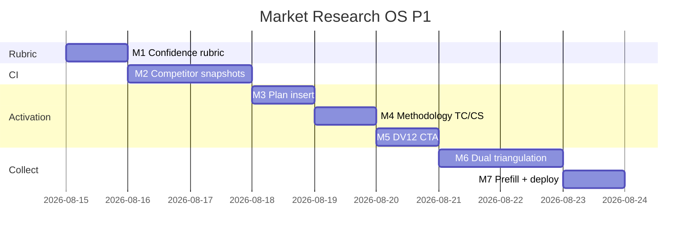

# Market Research OS — Kế hoạch coding P1 (Pilot ops)

> **For agentic workers:** REQUIRED SUB-SKILL: Use `superpowers:subagent-driven-development` (recommended) hoặc `superpowers:executing-plans` để thực thi **từng milestone**. Mỗi M có exit criteria, unit spec, smoke script và trace UC/EC.
>
> **P2–P4 không nằm trong file này.** P0 đã ship trên `main` (`0dad27c`+). Plan này chỉ P1.

**Goal:** AM/Analyst/Lead làm **pilot ops DV12** trên project P0: rubric 5 chiều, competitor snapshot, chèn insight_id vào marketing-plan, siết methodology TC/CS, CTA từ service-delivery, dual-provider triangulation, prefill consult.

**Architecture:** Mở rộng `MarketResearchModule` + `/crm/research` đã có. Không module Nest mới. Competitor = 2 bảng PG mới. Plan insert ghi **freeze `insight_ids`** vào `khtn_market_research_json` (không copy text). Dual-DR P1 = một job Tavily `basic` + `advanced` trên cùng RQ (chưa mua Perplexity/SparkToro).

**Tech Stack:** NestJS `services/ptt-crm-api`, Next.js `services/ops-web`, PostgreSQL, Python `ptt_worker`, Jest + pytest, bash smoke. Flag/caps P0 giữ nguyên.

**Spec canonical:**
- Design [`../specs/2026-08-14-market-research-os-design.md`](../specs/2026-08-14-market-research-os-design.md) §8.4, §9.1 competitors, §10 triangulation
- SRS [`../../specs/2026-08-14-market-research-os-srs.md`](../../specs/2026-08-14-market-research-os-srs.md) FR-INS-04, FR-CI-01/02, FR-INT-01, FR-RPT-08, FR-PRJ-06/07, FR-SRC-05
- UX [`../../specs/2026-08-14-market-research-os-ui-ux.md`](../../specs/2026-08-14-market-research-os-ui-ux.md) §13 P1
- BA [`../../specs/modules/RNOSAI-BA-RES-UseCases.md`](../../specs/modules/RNOSAI-BA-RES-UseCases.md) RES-UC-021…027
- Catalog [`../../use-cases/12-MARKET-RESEARCH-OS.md`](../../use-cases/12-MARKET-RESEARCH-OS.md)
- P0 plan [`./2026-08-14-market-research-os-p0.md`](./2026-08-14-market-research-os-p0.md)

## Global Constraints

- Mọi BR P0 vẫn binding: **BR-RES-01, 05, 06/08, 07, 10, 11, 12, 13.**
- **BR-RES-03:** Cấm wording “95% confidence” trừ `statistical_inference=true` trên insight.
- **BR-RES-09:** Source Similarweb/Semrush → `reliability_tier` ∈ {`low`,`medium`} + `limitation_note` bắt buộc.
- **FR-INT-01:** Plan chỉ lưu `insight_id[]` + `client_id`. Cấm copy `statement` / excerpt vào JSON plan.
- Insight insert plan: `approved_internal+` (nội bộ). Cùng `client_id`.
- Deep Research **vẫn** chỉ source nháp — triangulation không tạo insight.
- API prefix `api/v1/research`. Flag off → 404 `market_research_disabled`.
- Copy VI theo UX §10. Không palette mới. Không đụng `/crm/sales?tab=market`.
- Thứ tự file: `DDL → repository → util+spec (TDD) → service → controller → FE → smoke`.
- Commit chỉ khi user yêu cầu (user rule). Mỗi M xong smoke trước khi sang M tiếp.

### Out of P1 (cấm làm trong plan này)

PDF export, embargo/expiry UI, portal, studies/transcript, SparkToro/Talkwalker, pulse agent, exec EN locked fields, counter-evidence, LLM PII, trend_signals, Content OS cite, analytics `/analytics/ops`.

### Definition of Done (mọi task)

| # | Tiêu chí | Verify |
|---|----------|--------|
| 1 | User-visible | UI hoặc curl smoke |
| 2 | Persisted | F5 / SQL còn data |
| 3 | Guarded | thiếu cap → 403; flag off → 404; gate → 400 mã lỗi ổn định |
| 4 | Tested | `*.spec.ts` / pytest + smoke |

---

## 0. Milestone map (P1 = M1–M7)

| M | User outcome | UC | FR | Ước lượng |
|---|--------------|----|----|-----------|
| **M1** | Rubric 5 chiều + BR-RES-03 | 021 | INS-04 | 1 ngày |
| **M2** | Tab Đối thủ + snapshot whitelist | 022 | CI-01/02, BR-09 | 1.5 ngày |
| **M3** | Chèn insight_id vào marketing-plan | 023 | INT-01 | 1 ngày |
| **M4** | Export TC/CS chặn nếu methodology thiếu | 024 | RPT-08 | 0.5 ngày |
| **M5** | CTA «Mở Research Project» từ DV12 | 025 | PRJ-07 | 0.5 ngày |
| **M6** | Dual Tavily triangulation | 026 | SRC-05 | 1.5 ngày |
| **M7** | Prefill consult + smoke/deploy | 027 | PRJ-06 | 1 ngày |

**P1 sign-off = smoke P1 PASS + UAT Actions P1 (bổ sung vào `12-RES-ACTIONS.md`).**



---

## File map (khóa trước khi code)

| Tạo | Trách nhiệm |
|-----|-------------|
| `docs/specs/2026-08-14-postgresql-ddl-market-research-p1.sql` | `crm_research_competitors`, `crm_research_competitor_snapshots`; ALTER sources `limitation_note`, `triangulated`, `single_source_accepted` |
| `services/ptt-crm-api/src/market-research/confidence-rubric.util.ts` + spec | Score + band + BR-RES-03 + High cap khi single-source |
| `services/ptt-crm-api/src/market-research/competitor-snapshot.util.ts` + spec | Whitelist fact keys; hypothesis ≠ fact |
| `services/ptt-crm-api/src/market-research/methodology-gate.util.ts` + spec | TC/CS require population/source_plan/limitation |
| `services/ptt-crm-api/src/market-research/plan-insight-snapshot.util.ts` + spec | Freeze `{client_id, insight_ids}` — no statement text |
| `services/ops-web/src/components/research/ConfidenceRubric.tsx` | 5 slider 0–4 |
| `services/ops-web/src/components/research/CompetitorPane.tsx` | Tab Đối thủ |
| `services/ops-web/src/components/research/InsertInsightPlanPanel.tsx` | Panel trên marketing-plan |
| `ptt_crm/market_research/triangulate.py` + `tests/test_market_research_triangulate.py` | Dual Tavily + overlap URLs |
| `ptt_jobs/handlers/research_triangulate.py` | Job handler |
| `scripts/apply_pg_ddl_market_research_p1.sh` | Apply P1 DDL |
| `scripts/smoke_market_research_p1.sh` | M1–M7 smokes |
| `scripts/deploy_market_research_p1_vps.sh` | Clone P0 deploy: `npm ci`, DDL P1, restart 3 units |

| Sửa | Việc |
|-----|------|
| `insight-gate.util.ts` | Gate rubric khi submit-review (P1: đủ 5 chiều) |
| `market-research-report-snapshot.util.ts` | `methodology` object thật; pin cover vẫn P0 |
| `market-research.service.ts` / `.repository.ts` / `.controller.ts` / `.types.ts` | CRUD competitor, plan insert, triangulate enqueue, prefill |
| `InsightDrawer.tsx` | Gắn `ConfidenceRubric` |
| `app/crm/research/[id]/page.tsx` | Tab `competitors` |
| `app/crm/research/new/page.tsx` | Query `lifecycle_id`/`client_id`/`title` + consult chips |
| `app/crm/marketing-plan/[id]/page.tsx` | Panel chèn insight |
| `app/crm/service-delivery/[id]/page.tsx` | CTA khi slug `phan-tich-thi-truong` |
| `job-queue.repository.ts` + `ptt_worker/__main__.py` | `research_triangulate` |
| `docs/use-cases/actions/12-RES-ACTIONS.md` | Walkthrough P1 |

---

## Shared types (mọi task dùng đúng tên này)

```typescript
export const RUBRIC_DIMS = ['S', 'F', 'T', 'A', 'R'] as const;
export type RubricDim = (typeof RUBRIC_DIMS)[number];

export type ConfidenceRubric = {
  S: number; // source quality 0–4
  F: number; // fit & coverage
  T: number; // triangulation
  A: number; // analytical robustness
  R: number; // recency & stability
  statistical_inference?: boolean;
};

export type ConfidenceBand = 'low' | 'medium' | 'high' | 'very_high';

export type ConfidenceJson = {
  rubric: ConfidenceRubric;
  score: number;
  band: ConfidenceBand;
  override_down?: boolean;
};

export const COMPETITOR_FACT_KEYS = [
  'price',
  'share_claim',
  'channel',
  'message',
  'promo',
  'geo',
  'period',
] as const;

export type CompetitorFact = Partial<Record<(typeof COMPETITOR_FACT_KEYS)[number], string | number | null>>;

export type PlanInsightSnapshot = {
  client_id: string;
  insight_ids: number[];
  inserted_at: string;
  inserted_by: string;
};

export type MethodologyBlock = {
  population: string;
  source_plan: string;
  limitation: string;
};
```

---

## Milestone M1 — Confidence rubric (RES-UC-021)

**User outcome:** Analyst kéo 5 slider; Lead thấy band; UI không hiện “95% confidence”.

### Task M1-1: TDD rubric util

**Files:** Create `confidence-rubric.util.ts` + spec.

```typescript
export function clampDim(n: unknown): number {
  const v = Number(n);
  if (!Number.isFinite(v)) return 0;
  return Math.max(0, Math.min(4, Math.round(v)));
}

export function scoreRubric(r: ConfidenceRubric): number {
  return 0.25 * r.S + 0.2 * r.F + 0.25 * r.T + 0.2 * r.A + 0.1 * r.R;
}

export function bandFromScore(score: number): ConfidenceBand {
  if (score < 2) return 'low';
  if (score < 3) return 'medium';
  if (score <= 3.5) return 'high';
  return 'very_high';
}

export function applyOverrideDown(band: ConfidenceBand, overrideDown: boolean): ConfidenceBand {
  if (!overrideDown) return band;
  if (band === 'very_high') return 'high';
  if (band === 'high') return 'medium';
  if (band === 'medium') return 'low';
  return 'low';
}

export function capBandForSingleSource(band: ConfidenceBand, hasUnauditedSingleSource: boolean): ConfidenceBand {
  if (!hasUnauditedSingleSource) return band;
  if (band === 'high' || band === 'very_high') return 'medium';
  return band;
}

const FORBIDDEN = /95\s*%\s*confidence/i;

export function assertNoFakeConfidence(rationale: string, statisticalInference: boolean): void {
  if (statisticalInference) return;
  if (FORBIDDEN.test(rationale)) {
    const err = new Error('forbidden_confidence_wording');
    (err as Error & { code: string }).code = 'forbidden_confidence_wording';
    throw err;
  }
}

export function buildConfidenceJson(input: {
  rubric: ConfidenceRubric;
  override_down?: boolean;
  single_source?: boolean;
}): ConfidenceJson {
  const rubric = {
    S: clampDim(input.rubric.S),
    F: clampDim(input.rubric.F),
    T: clampDim(input.rubric.T),
    A: clampDim(input.rubric.A),
    R: clampDim(input.rubric.R),
    statistical_inference: Boolean(input.rubric.statistical_inference),
  };
  const score = Number(scoreRubric(rubric).toFixed(2));
  let band = applyOverrideDown(bandFromScore(score), Boolean(input.override_down));
  band = capBandForSingleSource(band, Boolean(input.single_source));
  return { rubric, score, band, override_down: Boolean(input.override_down) };
}
```

- [ ] **M1-1a:** Spec: `S=4,F=4,T=4,A=4,R=4` → score `4`, band `very_high`.
- [ ] **M1-1b:** Spec: `95% confidence` trong rationale + `statistical_inference=false` → throw `forbidden_confidence_wording`.
- [ ] **M1-1c:** Spec: single-source + score 3.2 → band `medium`.

### Task M1-2: Gate + persist

Mở rộng `evaluateInsightGate`:

```typescript
export type InsightGateCode =
  | 'missing_verified_evidence'
  | 'missing_confidence_rationale'
  | 'missing_confidence_rubric'
  | 'forbidden_confidence_wording';
```

Submit-review P1: rationale **và** 5 chiều (mỗi chiều 0–4). Lưu `confidence_json` qua `buildConfidenceJson`. PATCH insight sau `approved_*` vẫn 409 (P0).

`createInsight` / `patchInsight` body thêm `confidence_json?: ConfidenceRubric` (client gửi rubric thô; server tính score/band).

- [ ] **M1-2:** Jest service: submit-review thiếu rubric → 400 `{ error: 'insight_gate', messages: ['missing_confidence_rubric'] }`.

### Task M1-3: FE sliders

`ConfidenceRubric.tsx`: 5 range input, label VI:

| Dim | Label |
|-----|-------|
| S | Chất lượng nguồn |
| F | Phù hợp & coverage |
| T | Tam giác nguồn |
| A | Độ vững phân tích |
| R | Độ mới |

Checkbox «Suy luận thống kê» (`statistical_inference`). Banner: «Không ghi 95% confidence trừ khi đây là inference thống kê.»

`InsightDrawer` nhúng component; `toBody()` gửi rubric.

- [ ] **M1-3:** Smoke `scripts/smoke_market_research_m1.sh` — POST insight + submit-review với rubric → `confidence_json.band` có mặt.

**Exit M1:** Drawer có 5 slider; API persist JSON; “95%” bị 400.

---

## Milestone M2 — Competitor + snapshot (RES-UC-022)

**User outcome:** Analyst thêm đối thủ + 1 snapshot fact có `source_id`.

### Task M2-1: DDL

`docs/specs/2026-08-14-postgresql-ddl-market-research-p1.sql`:

```sql
CREATE TABLE IF NOT EXISTS crm_research_competitors (
  id           BIGSERIAL PRIMARY KEY,
  project_id   BIGINT NOT NULL REFERENCES crm_research_projects(id) ON DELETE CASCADE,
  name         TEXT NOT NULL,
  aliases      JSONB NOT NULL DEFAULT '[]',
  created_by   TEXT,
  created_at   TIMESTAMPTZ NOT NULL DEFAULT now(),
  updated_at   TIMESTAMPTZ NOT NULL DEFAULT now()
);

CREATE TABLE IF NOT EXISTS crm_research_competitor_snapshots (
  id              BIGSERIAL PRIMARY KEY,
  competitor_id   BIGINT NOT NULL REFERENCES crm_research_competitors(id) ON DELETE CASCADE,
  project_id      BIGINT NOT NULL REFERENCES crm_research_projects(id) ON DELETE CASCADE,
  source_id       BIGINT NOT NULL REFERENCES crm_research_sources(id),
  observed_at     DATE NOT NULL,
  kind            TEXT NOT NULL CHECK (kind IN ('fact', 'hypothesis')),
  fact            JSONB NOT NULL DEFAULT '{}',
  limitation_note TEXT,
  created_by      TEXT,
  created_at      TIMESTAMPTZ NOT NULL DEFAULT now()
);

ALTER TABLE crm_research_sources
  ADD COLUMN IF NOT EXISTS limitation_note TEXT,
  ADD COLUMN IF NOT EXISTS triangulated BOOLEAN NOT NULL DEFAULT false,
  ADD COLUMN IF NOT EXISTS single_source_accepted BOOLEAN NOT NULL DEFAULT false;
```

`scripts/apply_pg_ddl_market_research_p1.sh` — `psql -v ON_ERROR_STOP=1`. Idempotent.

### Task M2-2: Whitelist + BR-RES-09

```typescript
export function sanitizeCompetitorFact(raw: unknown): CompetitorFact {
  const out: CompetitorFact = {};
  const obj = raw && typeof raw === 'object' ? (raw as Record<string, unknown>) : {};
  for (const key of COMPETITOR_FACT_KEYS) {
    if (obj[key] !== undefined && obj[key] !== null && String(obj[key]).trim() !== '') {
      out[key] = typeof obj[key] === 'number' ? obj[key] : String(obj[key]).slice(0, 500);
    }
  }
  return out;
}

export function assertSimilarwebTier(input: {
  publisher?: string | null;
  url?: string | null;
  reliability_tier: string;
  limitation_note?: string | null;
}): void {
  const hay = `${input.publisher ?? ''} ${input.url ?? ''}`.toLowerCase();
  const paid = /similarweb|semrush/.test(hay);
  if (!paid) return;
  if (!['low', 'medium'].includes(input.reliability_tier)) {
    throw Object.assign(new Error('reliability_capped'), { code: 'reliability_capped' });
  }
  if (!String(input.limitation_note || '').trim()) {
    throw Object.assign(new Error('limitation_required'), { code: 'limitation_required' });
  }
}
```

- [ ] **M2-2a:** Spec: fact key `secret_sauce` bị loại.
- [ ] **M2-2b:** Spec: publisher `Similarweb` + tier `high` → `reliability_capped`.

### Task M2-3: API + tab

Routes (cap `edit` write, `view` read), tất cả qua `loadScopedProject`:

- `GET/POST /projects/:id/competitors`
- `PATCH /competitors/:id` `{ name, aliases }`
- `POST /competitors/:id/snapshots` `{ source_id, observed_at, kind, fact, limitation_note }`
- `GET /projects/:id/competitors` include snapshots

`source_id` phải thuộc cùng project. Hypothesis: `kind='hypothesis'` — FE chip «Giả thuyết» khác «Fact».

FE: tab `?tab=competitors` trên `[id]/page.tsx` — `CompetitorPane`.

- [ ] **M2-3:** Jest: snapshot thiếu `source_id` → 400 `validation_error`. Cross-tenant GET competitor → 403 không có `name`.

**Exit M2:** Tab Đối thủ persist; Similarweb không lên High.

---

## Milestone M3 — Insert insight → marketing-plan (RES-UC-023)

**User outcome:** AM trên `/crm/marketing-plan/:id` chèn 1 insight đã duyệt; plan JSON chỉ có ID.

`crm_marketing_plans` **không** có `client_id`. Không ALTER plan schema. Snapshot sống trong `khtn_market_research_json`.

### Task M3-1: Freeze util

```typescript
export function freezePlanInsights(input: {
  client_id: string;
  insight_ids: number[];
  inserted_by: string;
  now?: string;
}): PlanInsightSnapshot {
  const ids = [...new Set(input.insight_ids.filter((n) => Number.isFinite(n) && n > 0))];
  return {
    client_id: String(input.client_id).trim(),
    insight_ids: ids,
    inserted_at: input.now ?? new Date().toISOString(),
    inserted_by: input.inserted_by,
  };
}

export function assertNoInsightTextLeak(json: unknown): void {
  const raw = JSON.stringify(json);
  if (/"statement"\s*:/.test(raw) || /"excerpt"\s*:/.test(raw)) {
    throw Object.assign(new Error('plan_must_not_copy_insight_text'), {
      code: 'plan_must_not_copy_insight_text',
    });
  }
}
```

- [ ] **M3-1:** Spec: snapshot keys chỉ `client_id|insight_ids|inserted_at|inserted_by`.

### Task M3-2: API

`GET /insights?client_id=` — cap `view` — chỉ `approved_internal+`, scope client.

`POST /plans/:planId/insights` `{ client_id, insight_ids }` — cap `edit` trên `crm_research` **và** user có `crm_mktplan.edit` (nếu thiếu mktplan cap → 403 `forbidden`, không title).

Service:
1. `loadScoped` mọi insight: cùng `client_id`, status ∈ `APPROVED_INTERNAL_PLUS`.
2. `freezePlanInsights` + `assertNoInsightTextLeak`.
3. Ghi `khtn_market_research_json` qua `MarketingPlansSqliteRepository.patchPlan` **thêm field** `khtn_market_research_json` vào `PatchMarketingPlanBody` (chỉ endpoint research được set — không mở PATCH plan generic cho text tự do ngoài JSON này).

Mismatch client → 400 `{ error: 'client_mismatch' }`. Unapproved → 400 `{ error: 'insight_not_approved' }`.

### Task M3-3: FE panel

`InsertInsightPlanPanel` trên `marketing-plan/[id]/page.tsx`:
- Chọn `client_id` (agency clients trong scope).
- List insight đã duyệt (statement **preview** từ API list — không ghi vào plan JSON).
- Nút **Chèn insight** → POST IDs.
- Hiển thị chip `INS-{id}` + link `/crm/research/{projectId}?tab=insights`.

Plan **không** có editor statement.

- [ ] **M3-3:** Jest: POST copy `statement` vào body bị util reject; service chỉ persist IDs.

**Exit M3:** F5 plan còn `insight_ids`; SQL JSON không chứa statement.

---

## Milestone M4 — Methodology TC/CS (RES-UC-024)

**User outcome:** Export DOCX gói TC/CS bị chặn nếu thiếu 3 field methodology.

### Task M4-1

Đổi `ResearchReportSnapshot.methodology` từ `{ stub: true; note: string }` sang:

```typescript
export type MethodologyBlock = {
  population: string;
  source_plan: string;
  limitation: string;
  stub?: boolean;
};
```

`assertMethodologyExportable(tier: 'CB'|'TC'|'CS', m: MethodologyBlock): void` — CB cho phép `stub=true` (P0). TC/CS: cả 3 field `trim().length >= 8` else throw `methodology_incomplete`.

`POST /projects/:id/reports` body thêm `methodology?: MethodologyBlock`. `createReport` / export gọi assert theo `project.dv12_tier`.

FE Report tab: 3 textarea + banner «Gói TC/CS bắt buộc phụ lục phương pháp trước khi xuất.» Nút **Xuất DOCX** disabled khi TC/CS thiếu.

DOCX section Methodology in nội dung 3 field (không chỉ chữ “stub”).

- [ ] **M4-1a:** Jest: tier `TC` + methodology stub → 400 `methodology_incomplete`.
- [ ] **M4-1b:** Jest: tier `CB` + stub vẫn export (P0 không regress).
- [ ] **M4-1c:** Unzip DOCX TC chứa `Limitation` / `Hạn chế`.

**Exit M4:** CB xuất được; TC không xuất khi thiếu limitation.

---

## Milestone M5 — CTA service-delivery DV12 (RES-UC-025)

**User outcome:** Lifecycle slug `phan-tich-thi-truong` có nút **Mở Research Project**.

### Task M5-1

`GET /projects?lifecycle_id=` (đã có list; thêm filter `lifecycle_id`).

Helper (pure, testable):

```typescript
export function researchCtaHref(input: {
  slug: string;
  lifecycleId: number;
  clientId?: string | null;
  existingProjectId?: number | null;
}): string | null {
  if (input.slug !== 'phan-tich-thi-truong') return null;
  if (input.existingProjectId) return `/crm/research/${input.existingProjectId}`;
  const q = new URLSearchParams({ lifecycle_id: String(input.lifecycleId) });
  if (input.clientId) q.set('client_id', input.clientId);
  return `/crm/research/new?${q.toString()}`;
}
```

Resolve `client_id` từ contract `agency_client_id` (cùng pattern `service-lifecycle-pg.repository.ts` ~358). Không bịa client.

FE `service-delivery/[id]/page.tsx`: nếu slug khớp + `crm_research.view` + FE flag → nút. Nếu đã có project cùng `lifecycle_id` → link workspace.

Wizard `new/page.tsx`: đọc `lifecycle_id`, `client_id`, `title` từ `searchParams`; `createResearchProject` gửi `lifecycle_id`.

- [ ] **M5-1:** Spec: slug khác → `null`. Duplicate lifecycle → href workspace không mở wizard mới.

**Exit M5:** Từ DV12 vào wizard đã prefill client + lifecycle; F5 project còn `lifecycle_id`.

---

## Milestone M6 — Dual-provider triangulation (RES-UC-026)

**User outcome:** Analyst chạy **Tam giác nguồn** trên 1 RQ; URL trùng 2 lần được đánh `triangulated`.

P1 **không** mua provider thứ hai. Một job gọi Tavily `search_depth=basic` và `search_depth=advanced` (hai “provider” trong job). Vẫn **không** insert insight.

### Task M6-1: Python

`ptt_crm/market_research/triangulate.py`:

```python
def overlap_urls(a: list[str], b: list[str]) -> set[str]:
    norm = lambda u: (u or "").strip().rstrip("/").lower()
    return {norm(x) for x in a if norm(x)} & {norm(x) for x in b if norm(x)}
```

`collect_triangulate(question_vi, geo, credits_already_used)`:
- Cùng `build_desk_query` + `strip_pii` (BR-RES-11).
- 2 lần Tavily; cộng credits; tôn trọng `MAX_TAVILY_CREDITS_PER_RESEARCH`.
- Return `{ sources: [... tagged provider_a|provider_b], overlap_urls, credits_used }`.
- Worker insert sources; set `triangulated=true` khi URL ∈ overlap.

`POST /projects/:id/questions/:qid/run-triangulate` cap `run`. Job type `research_triangulate`. Idempotent in-flight → 409 `job_in_flight`.

`POST /sources/:id/accept-single-source` cap `approve` (Lead): set `single_source_accepted=true`. Insight gắn source này không được band `high`/`very_high` (M1 util).

FE: nút **Tam giác nguồn** cạnh Desk/Deep; chip job; badge «Trùng 2 provider» trên `SourceKeepTable`.

- [ ] **M6-1a:** Pytest: overlap `http://A/` vs `http://a` → 1 URL.
- [ ] **M6-1b:** Pytest: phone trong question không vào query.
- [ ] **M6-1c:** Pytest: over cap không gọi Tavily.
- [ ] **M6-1d:** Jest: enqueue `research_triangulate`; Deep/triangulate **không** gọi insert insight.

**Exit M6:** URL trùng có badge; single-source High bị cap Medium.

---

## Milestone M7 — Prefill consult + smoke/deploy (RES-UC-027)

**User outcome:** Wizard bước 1 gợi ý industry + tên đối thủ từ consult; AM confirm từng dòng.

### Task M7-1: Prefill API

`GET /prefill?client_id=` cap `create`.

Đọc consult/intake **không** lấy SĐT/email/tên người (BR-RES-11). Chỉ:

```typescript
export type ResearchPrefill = {
  industry: string | null;
  competitor_names: string[];
  suggested_rqs: string[];
};
```

Nguồn: lifecycle consult `form_data.industry` / `niche` + field competitors nếu có (string split `;` / `,`). Nếu không có consult → `{ industry: null, competitor_names: [], suggested_rqs: [] }` (200, không 404).

Wizard: chips «Dùng gợi ý» / «Bỏ». Confirm từng competitor → có thể **Tạo đối thủ nháp** sau khi project tạo (gọi M2 POST) — optional cùng request `createProject` body `prefill_competitors?: string[]`.

- [ ] **M7-1:** Spec: form có `0909…` → prefill **không** chứa số đó.

### Task M7-2: Smoke + deploy + Actions

- `scripts/smoke_market_research_p1.sh` — lần lượt m1…m7 nếu file tồn tại; skip live khi API down.
- `scripts/market_research_gate.sh` — thêm EC P1: rubric 400, methodology TC 400, plan JSON no `statement`, triangulate no insight insert.
- `scripts/deploy_market_research_p1_vps.sh` — `npm ci` (không `--omit=dev`); apply P0 + P1 DDL; restart api/ops-web/worker. **Không** flip flag (đã bật P0).
- Append `12-RES-ACTIONS.md` walkthrough P1 (~12 bước): rubric → competitor snapshot → plan insert → TC block → DV12 CTA → triangulate → consult chip.

- [ ] **M7-2:** `bash -n` mọi script mới. Jest+pytest P1 xanh.

**Exit M7 = P1 sign-off.**

---

## 4. Env checklist (staging)

| Biến | P1 |
|------|-----|
| Flags P0 | giữ `1` |
| `MAX_TAVILY_CREDITS_PER_RESEARCH` | 12 (triangulate tốn 2 call) |
| `TAVILY_API_KEY` | cần cho M6 live; không key → job terminal `tavily_unconfigured` (P0 pattern) |
| Caps | `crm_research.edit` (competitor/plan insert), `run` (triangulate), `approve` (single-source), `crm_mktplan.edit` (panel plan) |

---

## 5. Spec coverage (self-review)

| SRS / UC | Task |
|----------|------|
| FR-INS-04, BR-RES-03, UC-021 | M1 |
| FR-CI-01/02, BR-RES-09, UC-022 | M2 |
| FR-INT-01, UC-023 | M3 |
| FR-RPT-08, UC-024 | M4 |
| FR-PRJ-07, UC-025 | M5 |
| FR-SRC-05, UC-026, BR-RES-08/10/11 | M6 |
| FR-PRJ-06, UC-027 | M7 |
| PDF / portal / studies / pulse | **P2–P3 — out** |

---

## 6. Rủi ro thực thi

| Rủi ro | Xử lý trong plan |
|--------|------------------|
| Marketing plan không có `client_id` | Snapshot JSON tự mang `client_id`; picker trên panel |
| Dual-DR không có API thứ hai | Tavily basic+advanced trong 1 job; không Perplexity |
| Consult form schema lệch client | Prefill rỗng hợp lệ; user confirm; cấm PII |
| `page.tsx` research đã lớn | Tab competitors = component mới, không nhồi logic vào page |
| Jest VPS dính `deploy/runtime.env` | Test rubric/gate không `new AppConfigService()` trừ khi isolate keys (bài học P0 deploy) |
