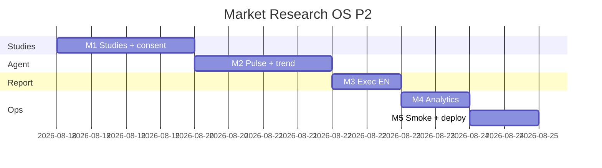

# Market Research OS — Kế hoạch coding P2 (Integrate)

> **For agentic workers:** REQUIRED SUB-SKILL: Use `superpowers:subagent-driven-development` (recommended) hoặc `superpowers:executing-plans` để thực thi **từng milestone**. Mỗi M có exit criteria, unit spec, smoke script và trace UC/EC.
>
> **P3–P4 không nằm trong file này.** P0+P1 đã ship trên `main` (`d8255ecd`+). Plan này chỉ P2 = RES-UC-030…033.

**Goal:** Analyst gắn study/consent (không transcript thô); pulse agent báo Ops khi đối thủ/trend đổi (không auto-publish insight); Lead duyệt exec EN; Ops xem cycle time / completeness trên `/crm/research/analytics`.

**Architecture:** Vẫn `MarketResearchModule` + `/crm/research`. Không module Nest mới. Studies/consents/trend_signals = 3 bảng PG. Pulse = job `research_pulse` (diff snapshot P1 + Tavily desk query) → `ops_alert_log` khi project có `lifecycle_id`. Exec EN = block trên `content_snapshot.exec` (tương thích `exec: string` P0). Analytics = SQL aggregate, không BI mới.

**Tech Stack:** NestJS `services/ptt-crm-api`, Next.js `services/ops-web`, PostgreSQL, Python `ptt_worker`, Jest + pytest, bash smoke. Flag/caps P0 giữ nguyên (`PTT_MARKET_RESEARCH_ENABLED` / `NEXT_PUBLIC_MARKET_RESEARCH` đã bật prod).

**Spec canonical:**
- Design [`../specs/2026-08-14-market-research-os-design.md`](../specs/2026-08-14-market-research-os-design.md) §9.1 studies/trend, §10.2 Research Agent
- SRS [`../../specs/2026-08-14-market-research-os-srs.md`](../../specs/2026-08-14-market-research-os-srs.md) FR-STD-01/02/03, FR-CI-03/04, FR-RPT-07, FR-INT-03
- UX [`../../specs/2026-08-14-market-research-os-ui-ux.md`](../../specs/2026-08-14-market-research-os-ui-ux.md) SCR-RES-030/031, §13 P2
- BA [`../../specs/modules/RNOSAI-BA-RES-UseCases.md`](../../specs/modules/RNOSAI-BA-RES-UseCases.md) RES-UC-030…033
- Catalog [`../../use-cases/12-MARKET-RESEARCH-OS.md`](../../use-cases/12-MARKET-RESEARCH-OS.md)
- P1 plan [`./2026-08-14-market-research-os-p1.md`](./2026-08-14-market-research-os-p1.md)

## Global Constraints

- Mọi BR P0+P1 vẫn binding: **BR-RES-01, 03, 05, 06/08, 07, 09, 10, 11, 12, 13.**
- **NFR-PRI-02:** P2 **không** lưu transcript thô. Evidence từ study = `excerpt` ≤ 500 + `locator` timecode. Consent **không** chứa SĐT/email/tên người (BR-RES-11).
- **NFR-PRI-01:** Consent `expires_at` = `recorded_at + 24 months` (default).
- Pulse **không** insert insight; **không** set `published` (BR-RES-06/08).
- Deep / triangulate / pulse vẫn sources-only + signals/alerts.
- API prefix `api/v1/research`. Flag off → 404 `market_research_disabled`.
- Cross-tenant GET → **403**, body **must not** include `title` / study `name` / consent identifiers (BR-RES-12).
- Copy VI theo UX §10. Không palette mới. Không đụng `/crm/sales?tab=market`.
- `ops_alert_log.dv_code` VARCHAR(8) → dùng **`DV12`**. Chỉ upsert Ops alert khi `project.lifecycle_id` khác null.
- Thứ tự file: `DDL → repository → util+spec (TDD) → service → controller → FE → smoke`.
- Commit chỉ khi user yêu cầu (user rule). Mỗi M xong smoke trước khi sang M tiếp.
- **Không implement trên `main`.** Branch: `feat/market-research-os-p2`.

### Out of P2 (cấm làm trong plan này)

PDF export, embargo/expiry UI, portal RLS/watermark, waves/TRACKER compare, decision log (`crm_research_decisions`), SparkToro/Talkwalker/Qualtrics/Dovetail, Whisper ingest, counter-evidence LLM, RAG embeddings, Content OS cite (`FR-INT-02`), Van Westendorp/conjoint, Apify FB login scrape.

### Definition of Done (mọi task)

| # | Tiêu chí | Verify |
|---|----------|--------|
| 1 | User-visible | UI hoặc curl smoke |
| 2 | Persisted | F5 / SQL còn data |
| 3 | Guarded | thiếu cap → 403; flag off → 404; gate → 400 mã lỗi ổn định |
| 4 | Tested | `*.spec.ts` / pytest + smoke |

---

## 0. Milestone map (P2 = M1–M5)

| M | User outcome | UC | FR | Ước lượng |
|---|--------------|----|----|-----------|
| **M1** | Tab Studies + consent tách PII + evidence `study_id` | 030 | STD-01/02/03 | 2 ngày |
| **M2** | Pulse cron → trend_signal + Ops alert, không insight | 031 | CI-03/04 | 2 ngày |
| **M3** | Exec EN + Lead duyệt bản dịch | 032 | RPT-07 | 1 ngày |
| **M4** | `/crm/research/analytics` + `GET /analytics/ops` | 033 | INT-03 | 1 ngày |
| **M5** | Smoke + gate + deploy + Actions P2 | — | — | 0.5 ngày |

**P2 sign-off = smoke P2 PASS + UAT Actions P2 (bổ sung vào `12-RES-ACTIONS.md`).**



---

## File map (khóa trước khi code)

| Tạo | Trách nhiệm |
|-----|-------------|
| `docs/specs/2026-08-14-postgresql-ddl-market-research-p2.sql` | `crm_research_studies`, `crm_research_consents`, `crm_research_trend_signals`; FK `evidence.study_id`; widen `ai_runs` CHECK |
| `scripts/apply_pg_ddl_market_research_p2.sh` | `psql -v ON_ERROR_STOP=1` idempotent |
| `services/ptt-crm-api/src/market-research/study-consent.util.ts` + spec | Locator + no-raw-transcript + consent PII strip |
| `services/ptt-crm-api/src/market-research/pulse-signal.util.ts` + spec | Snapshot diff + velocity |
| `services/ptt-crm-api/src/market-research/report-exec.util.ts` + spec | Normalize `exec` string→block; EN lock |
| `services/ptt-crm-api/src/market-research/ops-analytics.util.ts` + spec | Cycle time / completeness math |
| `ptt_crm/market_research/pulse.py` + `tests/test_market_research_pulse.py` | Collect pulse; never insert insight |
| `ptt_jobs/handlers/research_pulse.py` | Terminal `mark_job_done` (clone desk) |
| `services/ops-web/src/components/research/StudiesPane.tsx` | Tab `?tab=studies` |
| `services/ops-web/src/components/research/ConsentDrawer.tsx` | Consent metadata only |
| `services/ops-web/src/app/crm/research/analytics/page.tsx` | SCR-RES-031 |
| `scripts/smoke_market_research_p2.sh` + `p2_m1`…`p2_m5` | Skip live nếu API down |
| `scripts/deploy_market_research_p2_vps.sh` | Clone P1: `npm ci`, DDL P0+P1+P2, restart 3 units; **không** flip flag |

| Sửa | Việc |
|-----|------|
| `market-research.service.ts` / `.repository.ts` / `.controller.ts` / `.types.ts` / `.constants.ts` | CRUD study/consent, pulse enqueue, approve-exec-en, analytics |
| `market-research-report-snapshot.util.ts` + docx | `exec` block `{ vi, en, en_status }` |
| `job-queue.repository.ts` + `ptt_worker/__main__.py` | `research_pulse` |
| `ops-alert.types.ts` | `'research_pulse'` |
| `app/crm/research/[id]/page.tsx` | Tab Studies |
| `OpsNav.tsx` | Link analytics (cùng `crm_research.view` + FE flag) |
| `docs/use-cases/actions/12-RES-ACTIONS.md` | Walkthrough P2 |

---

## Shared types (mọi task dùng đúng tên này)

```typescript
export const STUDY_METHODS = ['survey', 'idi', 'fgd', 'diary'] as const;
export type StudyMethod = (typeof STUDY_METHODS)[number];

export const STUDY_MODES = ['online', 'f2f', 'phone', 'mixed'] as const;
export type StudyMode = (typeof STUDY_MODES)[number];

export type ResearchStudy = {
  id: number;
  project_id: number;
  name: string;
  method: StudyMethod;
  n: number | null;
  field_start: string | null;
  field_end: string | null;
  mode: StudyMode | null;
  instrument_version: string | null;
  weighting_note: string | null;
};

export type ResearchConsent = {
  id: number;
  study_id: number;
  project_id: number;
  subject_code: string; // pseudonym R-004 — not a person name
  consent_type: 'record' | 'quote' | 'store';
  recorded_at: string;
  expires_at: string;
  notes: string | null;
};

export type ReportExec = {
  vi: string;
  en: string | null;
  en_status: 'none' | 'draft' | 'approved';
};

export type TrendSignal = {
  id: number;
  project_id: number;
  topic: string;
  metric: string;
  baseline: number | null;
  current: number | null;
  velocity: number | null;
  lifecycle: 'new' | 'rising' | 'stable' | 'fading';
};

export type OpsAnalytics = {
  cycle_time_hours: {
    designed_to_approved_p50: number | null;
    sample: number;
  };
  evidence_completeness: {
    projects: number;
    with_verified_pct: number;
  };
  activation: {
    distributed_projects: number;
    approved_reports: number;
  };
};
```

---

## Milestone M1 — Studies + consent (RES-UC-030)

**User outcome:** Analyst tạo 1 study IDI, gắn evidence `study_id` + locator `T-12:03`, ghi consent `R-004` — F5 còn; SQL không có SĐT.

`crm_research_evidence.study_id` đã có cột (P0) **không** FK. P2 thêm bảng + FK. `CreateEvidenceInput.study_id` đã có — wire scope + locator gate.

### Task M1-1 DDL

Create `docs/specs/2026-08-14-postgresql-ddl-market-research-p2.sql`:

```sql
CREATE TABLE IF NOT EXISTS crm_research_studies (
  id                  BIGSERIAL PRIMARY KEY,
  project_id          BIGINT NOT NULL REFERENCES crm_research_projects(id) ON DELETE CASCADE,
  name                TEXT NOT NULL,
  method              TEXT NOT NULL CHECK (method IN ('survey','idi','fgd','diary')),
  n                   INT,
  field_start         DATE,
  field_end           DATE,
  mode                TEXT CHECK (mode IS NULL OR mode IN ('online','f2f','phone','mixed')),
  instrument_version  TEXT,
  weighting_note      TEXT,
  created_by          TEXT,
  created_at          TIMESTAMPTZ NOT NULL DEFAULT now(),
  updated_at          TIMESTAMPTZ NOT NULL DEFAULT now()
);

CREATE TABLE IF NOT EXISTS crm_research_consents (
  id            BIGSERIAL PRIMARY KEY,
  study_id      BIGINT NOT NULL REFERENCES crm_research_studies(id) ON DELETE CASCADE,
  project_id    BIGINT NOT NULL REFERENCES crm_research_projects(id) ON DELETE CASCADE,
  subject_code  TEXT NOT NULL,
  consent_type  TEXT NOT NULL CHECK (consent_type IN ('record','quote','store')),
  recorded_at   TIMESTAMPTZ NOT NULL DEFAULT now(),
  expires_at    TIMESTAMPTZ NOT NULL,
  notes         TEXT,
  created_by    TEXT,
  created_at    TIMESTAMPTZ NOT NULL DEFAULT now()
);

CREATE TABLE IF NOT EXISTS crm_research_trend_signals (
  id          BIGSERIAL PRIMARY KEY,
  project_id  BIGINT NOT NULL REFERENCES crm_research_projects(id) ON DELETE CASCADE,
  topic       TEXT NOT NULL,
  metric      TEXT NOT NULL,
  baseline    NUMERIC,
  current     NUMERIC,
  velocity    NUMERIC,
  lifecycle   TEXT NOT NULL CHECK (lifecycle IN ('new','rising','stable','fading')),
  created_at  TIMESTAMPTZ NOT NULL DEFAULT now()
);

ALTER TABLE crm_research_evidence
  ADD CONSTRAINT crm_research_evidence_study_fk
  FOREIGN KEY (study_id) REFERENCES crm_research_studies(id) ON DELETE RESTRICT;

ALTER TABLE crm_research_ai_runs DROP CONSTRAINT IF EXISTS crm_research_ai_runs_type_chk;
ALTER TABLE crm_research_ai_runs ADD CONSTRAINT crm_research_ai_runs_type_chk CHECK (job_type IN (
  'desk_tavily','deep_research','insight_draft','report_draft','pii_scan',
  'research_triangulate','research_pulse'));
```

`scripts/apply_pg_ddl_market_research_p2.sh` — `psql -v ON_ERROR_STOP=1`. Idempotent. FK add: wrap `DO $$ BEGIN ... EXCEPTION WHEN duplicate_object THEN NULL; END $$` nếu constraint đã tồn tại.

Tạo `trend_signals` ở M1 DDL (cùng file P2) dù UI pulse là M2 — một apply script.

### Task M1-2 Utils

`study-consent.util.ts` + spec — **verbatim**:

```typescript
const PHONE = /(?:\+?84|0)\d{8,10}\b/;
const EMAIL = /[A-Z0-9._%+-]+@[A-Z0-9.-]+\.[A-Z]{2,}/i;
const TRANSCRIPT_LOCATOR = /^(T-\d{1,2}:\d{2}(?::\d{2})?|[^\s]+#t=\d+|https?:\/\/\S+)$/i;

export function assertTranscriptLocator(locator: string): void {
  const s = String(locator ?? '').trim();
  if (!TRANSCRIPT_LOCATOR.test(s)) {
    throw Object.assign(new Error('invalid_transcript_locator'), { code: 'invalid_transcript_locator' });
  }
}

export function assertExcerptNotRawTranscript(excerpt: string | null | undefined): void {
  const s = String(excerpt ?? '');
  if (s.length > 500) {
    throw Object.assign(new Error('raw_transcript_forbidden'), { code: 'raw_transcript_forbidden' });
  }
}

export function assertConsentHasNoPii(input: { subject_code?: string; notes?: string | null }): void {
  const hay = `${input.subject_code ?? ''} ${input.notes ?? ''}`;
  if (PHONE.test(hay) || EMAIL.test(hay)) {
    throw Object.assign(new Error('consent_pii_forbidden'), { code: 'consent_pii_forbidden' });
  }
}

export function defaultConsentExpiry(recordedAt: Date, now = recordedAt): Date {
  const d = new Date(now);
  d.setMonth(d.getMonth() + 24);
  return d;
}
```

- [ ] **M1-2a:** Spec: locator `T-12:03` OK; `full interview dump` excerpt 800 chars → `raw_transcript_forbidden`.
- [ ] **M1-2b:** Spec: notes chứa `0909123456` → `consent_pii_forbidden`.
- [ ] **M1-2c:** Spec: `defaultConsentExpiry` +24 tháng.

### Task M1-3 API + tab

Routes via `loadScopedProject` (cap `edit` write, `view` read):

- `GET/POST /projects/:id/studies`
- `PATCH /studies/:id` `{ name, n, field_start, field_end, mode, instrument_version, weighting_note }`
- `GET/POST /studies/:id/consents` `{ subject_code, consent_type, notes }` — server sets `expires_at`
- `POST /projects/:id/evidence` đã có: cho phép `study_id` cùng project (không `source_id`); gọi `assertTranscriptLocator` + `assertExcerptNotRawTranscript` khi `study_id` set

Cross-tenant GET studies → 403 `{ error: 'forbidden' }` không `name`.

FE: `StudiesPane` + `?tab=studies` trên `[id]/page.tsx`. Form study (method/n/dates/mode). Consent drawer: `subject_code` + type — **không** field SĐT. Evidence form: chọn study + locator.

- [ ] **M1-3:** Jest: consent notes phone → 400 `consent_pii_forbidden`. Cross-tenant GET studies → 403 without `name`. Evidence `study_id` + excerpt 800 → 400 `raw_transcript_forbidden`.

Smoke: `scripts/smoke_market_research_p2_m1.sh` skip nếu API down; `bash -n`.

**Exit M1:** Tab Studies persist; consent không chứa SĐT; evidence study không lưu transcript thô.

**Commit:** `feat(research): P2 M1 studies consent and transcript locator`

---

## Milestone M2 — Pulse agent (RES-UC-031)

**User outcome:** Cron/job chạy trên project có đối thủ; đổi `price`/`message` → trend_signal + chip Ops; **không** có insight mới.

P2 **không** mua Talkwalker. Pulse = (1) diff 2 snapshot P1 mới nhất trên cùng competitor + fact key `price`|`message`|`promo`; (2) optional Tavily `build_desk_query` trên RQ `TREND_SCAN` / question chứa “trend” — credits chung BR-RES-10.

### Task M2-1 Utils

`pulse-signal.util.ts` + spec — **verbatim**:

```typescript
export function snapshotFactDiff(
  prev: Record<string, unknown> | null,
  next: Record<string, unknown> | null,
  keys: string[] = ['price', 'message', 'promo'],
): { changed: string[]; topic: string | null } {
  const a = prev ?? {};
  const b = next ?? {};
  const changed = keys.filter((k) => String(a[k] ?? '') !== String(b[k] ?? ''));
  return { changed, topic: changed[0] ?? null };
}

export function velocity(baseline: number | null, current: number | null): number | null {
  if (baseline == null || current == null) return null;
  if (baseline === 0) return current === 0 ? 0 : null;
  return (current - baseline) / Math.abs(baseline);
}

export function lifecycleFromVelocity(v: number | null): TrendSignal['lifecycle'] {
  if (v == null) return 'new';
  if (v > 0.15) return 'rising';
  if (v < -0.15) return 'fading';
  return 'stable';
}
```

- [ ] **M2-1a:** Spec: prev `{ price: '10' }` vs next `{ price: '12' }` → `changed: ['price']`.
- [ ] **M2-1b:** Spec: velocity(100, 130) → `0.3` → `rising`.

### Task M2-2 Python + Nest

`ptt_crm/market_research/pulse.py`:

```python
def process_research_pulse_payload(payload: dict) -> dict:
    # load competitors + last 2 snapshots; compute snapshotFactDiff equivalent
    # optional Tavily via build_desk_query + strip_pii; honor MAX_TAVILY_CREDITS_PER_RESEARCH
    # insert trend_signals only; NEVER insert insights
    # return { ok, signals, credits_used, insight_ids: [] }
```

Handler `ptt_jobs/handlers/research_pulse.py` — clone desk: crash → `fail_run` + `mark_job_done`; mọi outcome terminal.

Nest:

- `POST /projects/:id/run-pulse` cap `run`. In-flight → 409 `job_in_flight`.
- Job type `research_pulse`. Enqueue trong `JobQueueRepository` (`jobType: 'research_pulse'`).
- Widen `ResearchJobType`. Worker `__main__.py` dispatch.
- Sau job (hoặc sync path trong service khi worker ghi signal): nếu `project.lifecycle_id` set → `OpsAlertPgRepository.upsertAlert({ lifecycleId, dvCode: 'DV12', alertType: 'research_pulse', severity: 'warning', title, message, sourceKey: 'research_pulse:${projectId}:${signalId}' })`.
- Thêm `'research_pulse'` vào `OpsAlertType`.

FE: nút **Chạy pulse** (cap `run`) cạnh Desk/Deep trên project `COMP_LAND` / `TREND_SCAN` / `TRACKER` (các type khác vẫn cho phép — không chặn). Chip job. Banner «Cảnh báo pulse» link `/crm/ops/alerts` khi có signal mới. **Không** nút publish insight từ pulse.

- [ ] **M2-2a:** Pytest: pulse payload không gọi insert insight.
- [ ] **M2-2b:** Pytest: phone trong question không vào Tavily query (BR-RES-11).
- [ ] **M2-2c:** Jest: enqueue `research_pulse`; `createInsight` **không** được gọi.
- [ ] **M2-2d:** Jest: project không `lifecycle_id` → vẫn insert signal, **không** gọi `upsertAlert`.

**Exit M2:** Signal persist; Ops alert khi có lifecycle; zero insight mới từ job.

**Commit:** `feat(research): P2 M2 pulse agent and trend signals`

---

## Milestone M3 — Exec EN (RES-UC-032)

**User outcome:** Report có block EN; Lead bấm **Duyệt bản dịch**; Analyst không sửa EN đã duyệt (phải tạo version mới — BR-RES-05).

### Task M3-1

`report-exec.util.ts` + spec — **verbatim**:

```typescript
export function normalizeReportExec(raw: unknown): ReportExec {
  if (typeof raw === 'string') {
    return { vi: raw, en: null, en_status: 'none' };
  }
  const obj = raw && typeof raw === 'object' ? (raw as Record<string, unknown>) : {};
  const vi = String(obj.vi ?? obj.exec ?? '').trim();
  const en = obj.en == null ? null : String(obj.en).trim() || null;
  const st = obj.en_status;
  const en_status = st === 'draft' || st === 'approved' || st === 'none' ? st : en ? 'draft' : 'none';
  return { vi, en, en_status };
}

export function assertExecEnEditable(exec: ReportExec): void {
  if (exec.en_status === 'approved') {
    throw Object.assign(new Error('exec_en_locked'), { code: 'exec_en_locked' });
  }
}
```

Đổi `ResearchReportSnapshot.exec` từ `string` sang `ReportExec`. `snapshotFromInsights` / copilot: `normalizeReportExec` trên mọi đọc. DOCX: in `vi` + (nếu `en`) heading `Executive (EN)`.

`POST /reports/:reportId/versions/:versionId/exec-en` cap `edit` — body `{ en: string }` → status `draft`. 400 `exec_en_locked` nếu đã `approved`.

`POST /reports/:reportId/versions/:versionId/approve-exec-en` cap `approve` — SoD: actor ≠ `generated_by` → 403 `cannot_self_approve` (BR-RES-07). Set `en_status: 'approved'`. **Cấm** đổi `vi` trên version đã tạo — EN lock không được viết đè `vi`.

Optional copilot: reuse `reportCopilot` để gợi ý `en` (status `draft`). Không auto-approve.

FE Report tab: textarea EN + banner «Lead duyệt bản dịch trước khi gửi khách.» Nút **Duyệt bản dịch** (cap `approve`) disabled khi `en_status==='approved'` hoặc empty. P0 `exec: string` vẫn hiện ở ô VI.

- [ ] **M3-1a:** Spec: `normalizeReportExec('hello')` → `{ vi: 'hello', en: null, en_status: 'none' }`.
- [ ] **M3-1b:** Jest: approve-exec-en by `generated_by` → 403 `cannot_self_approve`.
- [ ] **M3-1c:** Jest: PATCH en khi `approved` → 400 `exec_en_locked`.
- [ ] **M3-1d:** Unzip DOCX có `Executive (EN)` khi en present.

**Exit M3:** CB/TC version cũ (exec string) vẫn mở; EN approved không sửa tại chỗ.

**Commit:** `feat(research): P2 M3 bilingual exec and Lead translation approve`

---

## Milestone M4 — Ops analytics (RES-UC-033)

**User outcome:** AM mở `/crm/research/analytics` thấy 3 số: cycle time, % project có evidence verified, số project `distributed`.

### Task M4-1

`ops-analytics.util.ts` + spec:

```typescript
export function percentile50(hours: number[]): number | null {
  if (!hours.length) return null;
  const s = [...hours].sort((a, b) => a - b);
  const mid = Math.floor((s.length - 1) / 2);
  return s.length % 2 ? s[mid] : (s[mid] + s[mid + 1]) / 2;
}

export function completenessPct(total: number, withVerified: number): number {
  if (total <= 0) return 0;
  return Math.round((100 * withVerified) / total);
}
```

`GET /api/v1/research/analytics/ops` cap `view`. Scope: `allowedClientIds` giống `listProjects`. SQL:

- Cycle: projects có `status IN ('approved','distributed')` — `EXTRACT(EPOCH FROM (updated_at - created_at))/3600` (P2 pragmatic; không có cột `designed_at` riêng).
- Completeness: `COUNT(*)` projects in scope vs `COUNT(DISTINCT project_id)` từ evidence `qc_status='verified'`.
- Activation: `status='distributed'` + count report versions (join reports) — **không** đọc SQLite marketing-plan.

FE: `app/crm/research/analytics/page.tsx` — 3 thẻ số + bảng project (id, client_id, status, verified_ev). Flag + `crm_research.view`. OpsNav dưới «Nghiên cứu thị trường»: «Phân tích nghiên cứu» → `/crm/research/analytics`.

- [ ] **M4-1a:** Spec: `percentile50([10, 20, 30]) === 20`.
- [ ] **M4-1b:** Jest: cross-tenant analytics → 403 without `title`.
- [ ] **M4-1c:** Jest: scoped list không gồm project ngoài `allowedClientIds`.

**Exit M4:** F5 analytics còn số; Beta không thấy project Acme.

**Commit:** `feat(research): P2 M4 ops analytics cycle time and completeness`

---

## Milestone M5 — Smoke + deploy + Actions

**User outcome:** Script P2 chạy được trên VPS; UAT 030–033 có bước.

### Task M5-1

- `scripts/smoke_market_research_p2.sh` — lần lượt `p2_m1`…`p2_m5` nếu file tồn tại; skip live khi API down.
- `scripts/market_research_gate.sh` — thêm EC P2: consent PII 400, pulse no insight, exec_en_locked, analytics 403 no title.
- `scripts/deploy_market_research_p2_vps.sh` — clone P1: `npm ci` (không `--omit=dev`); apply P0+P1+P2 DDL (**P2 DDL trước worker**); restart api/ops-web/worker. **Không** flip flag. Jest skip `runtime.env` đã có (`JEST_WORKER_ID` guard).
- Append `12-RES-ACTIONS.md` walkthrough P2 (~8 bước): study → consent → evidence locator → pulse → Ops alert → EN draft → Lead duyệt → analytics. Để nguyên P3 backlog.

- [ ] **M5-1:** `bash -n` mọi script mới. Jest + pytest P2 xanh.

**Exit M5 = P2 sign-off.**

**Commit:** `feat(research): P2 M5 smoke deploy and UAT actions`

---

## 4. Env checklist (staging)

| Biến | P2 |
|------|-----|
| Flags P0 | giữ `1` |
| `MAX_TAVILY_CREDITS_PER_RESEARCH` | 12 (pulse tốn thêm nếu Tavily) |
| `TAVILY_API_KEY` | pulse Tavily optional; không key → signal-from-snapshot only, job `ok` |
| Caps | `crm_research.edit` (study/consent), `run` (pulse), `approve` (exec EN), `view` (analytics) |

---

## 5. Spec coverage (self-review)

| SRS / UC | Task |
|----------|------|
| FR-STD-01/02/03, UC-030, NFR-PRI-01/02 | M1 |
| FR-CI-03/04, UC-031, design §10.2 | M2 |
| FR-RPT-07, UC-032, BR-RES-05/07 | M3 |
| FR-INT-03, UC-033, SCR-RES-031 | M4 |
| Actions + deploy | M5 |
| FR-INT-02 Content OS cite | **Out — không có UC 030–033** |
| Portal / waves / decision / PDF | **P3 — out** |

---

## 6. Rủi ro thực thi

| Rủi ro | Xử lý trong plan |
|--------|------------------|
| `ops_alert_log` cần `lifecycle_id` | Chỉ upsert khi project có lifecycle; signal vẫn persist |
| `dv_code` VARCHAR(8) | Hardcode `DV12` |
| `exec: string` P0 | `normalizeReportExec` |
| `evidence.study_id` chưa FK | ADD CONSTRAINT sau CREATE studies |
| Jest + `runtime.env` | Đã skip khi `JEST_WORKER_ID` (`d8255ecd`) — không regress |
| Pulse tạo insight | Pytest + Jest cấm `createInsight` / insert insight |
| Consent PII | Util + 400 `consent_pii_forbidden` |
