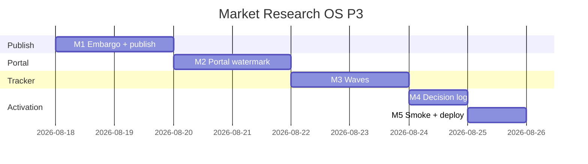

# Market Research OS — Kế hoạch coding P3 (Client-grade)

> **For agentic workers:** REQUIRED SUB-SKILL: Use `superpowers:subagent-driven-development` (recommended) hoặc `superpowers:executing-plans` để thực thi **từng milestone**. Mỗi M có exit criteria, unit spec, smoke script và trace UC/EC.
>
> **P4 không nằm trong file này.** P0+P1+P2 đã ship trên `main` (`63ad3cc1`+). Plan này chỉ P3 = RES-UC-040…042.

**Goal:** AM công bố report đã duyệt lên portal khách (không auto-publish); khách đọc bản read-only có watermark + expiry; Analyst gắn wave trên project TRACKER; AM ghi decision log sau readout.

**Architecture:** Staff vẫn `MarketResearchModule` + `/crm/research`. Portal = module Nest mới `PortalResearchModule` (clone `PortalSeoModule`) prefix `api/v1/portal/research` + `PortalJwtGuard`. Waves + decisions = 2 bảng PG. Embargo/expiry đã có cột trên `crm_research_report_versions` — P3 chỉ wire. Portal view = HTML + CSS watermark (không binary PDF).

**Tech Stack:** NestJS `services/ptt-crm-api`, Next.js `services/ops-web` + `services/portal-web`, PostgreSQL, Jest, bash smoke. Flag/caps P0 giữ nguyên (`PTT_MARKET_RESEARCH_ENABLED` / `NEXT_PUBLIC_MARKET_RESEARCH` đã bật prod). Portal build phải export cùng `NEXT_PUBLIC_MARKET_RESEARCH` lúc `npm run build`.

**Spec canonical:**
- Design [`../specs/2026-08-14-market-research-os-design.md`](../specs/2026-08-14-market-research-os-design.md) §9.2 waves/decisions, §11 portal
- SRS [`../../specs/2026-08-14-market-research-os-srs.md`](../../specs/2026-08-14-market-research-os-srs.md) FR-INT-04, FR-PRJ-08, FR-RPT-06, US-CL-30
- UX [`../../specs/2026-08-14-market-research-os-ui-ux.md`](../../specs/2026-08-14-market-research-os-ui-ux.md) SCR-RES-040, §13 P3
- BA [`../../specs/modules/RNOSAI-BA-RES-UseCases.md`](../../specs/modules/RNOSAI-BA-RES-UseCases.md) RES-UC-040…042
- Catalog [`../../use-cases/12-MARKET-RESEARCH-OS.md`](../../use-cases/12-MARKET-RESEARCH-OS.md)
- P2 plan [`./2026-08-14-market-research-os-p2.md`](./2026-08-14-market-research-os-p2.md)

## Global Constraints

- Mọi BR P0+P1+P2 vẫn binding: **BR-RES-01, 03, 05, 06/08, 07, 09, 10, 11, 12, 13.**
- **Cấm auto-publish** lên portal (design § anti-pattern). Chỉ `POST …/publish-portal` sau khi mọi `insight_id` trong snapshot ≥ `approved_client_facing`.
- Portal unpublished / sai tenant → **không** trả `title` / competitor `name` / study `name` (BR-RES-12). Cross-tenant = **403** `{ error: 'forbidden' }`. Unpublished cùng tenant = **404** `{ error: 'not_found' }` (không quảng cáo tồn tại).
- Embargo chưa tới → **403** `{ error: 'embargo_active' }`. Hết `expires_at` → **403** `{ error: 'report_expired' }`.
- Watermark bắt buộc trên mọi portal GET thành công: `CONFIDENTIAL · {client_id} · {email} · {YYYY-MM-DD}`.
- `p.client_id` đã join `clients.id::text` — portal JWT `client_id` (UUID) so khớp **string bằng nhau**.
- API staff prefix `api/v1/research`. Portal prefix `api/v1/portal/research`. Flag off → 404 `market_research_disabled` (cả hai prefix).
- Copy VI theo UX §10. Không palette mới. Không đụng `/crm/sales?tab=market`.
- Pulse / Deep / triangulate vẫn sources-only. Không regress P2 studies/consent/exec EN/analytics.
- Thứ tự file: `DDL → repository → util+spec (TDD) → service → controller → FE → smoke`.
- Commit chỉ khi user yêu cầu (user rule). Mỗi M xong smoke trước khi sang M tiếp.
- **Không implement trên `main`.** Branch: `feat/market-research-os-p3`.

### Out of P3 (cấm làm trong plan này)

Binary **PDF export** (FR-RPT-04 → P4; portal P3 = HTML + watermark). Content OS cite (`FR-INT-02`), SparkToro/Talkwalker/Qualtrics/Dovetail, Whisper ingest, counter-evidence LLM, RAG embeddings, Van Westendorp/conjoint, Apify FB login scrape, taxonomy, social query vault.

### Definition of Done (mọi task)

| # | Tiêu chí | Verify |
|---|----------|--------|
| 1 | User-visible | UI hoặc curl smoke |
| 2 | Persisted | F5 / SQL còn data |
| 3 | Guarded | thiếu cap → 403; flag off → 404; gate → 400/403/404 mã lỗi ổn định |
| 4 | Tested | `*.spec.ts` + smoke |

---

## 0. Milestone map (P3 = M1–M5)

| M | User outcome | UC | FR | Ước lượng |
|---|--------------|----|----|-----------|
| **M1** | Embargo/expiry + **Công bố portal** (không auto) | 040 | RPT-06, INT-04 | 1.5 ngày |
| **M2** | Portal khách đọc report + watermark + RLS | 040 | INT-04, US-CL-30 | 2 ngày |
| **M3** | Waves trên TRACKER + compare 2 wave | 041 | PRJ-08 | 1.5 ngày |
| **M4** | Decision log G9 gắn `insight_id` | 042 | — | 1 ngày |
| **M5** | Smoke + gate + deploy + Actions P3 | — | — | 0.5 ngày |

**P3 sign-off = smoke P3 PASS + UAT Actions P3 (bổ sung vào `12-RES-ACTIONS.md`).**



---

## File map (khóa trước khi code)

| Tạo | Trách nhiệm |
|-----|-------------|
| `docs/specs/2026-08-14-postgresql-ddl-market-research-p3.sql` | `portal_visible` trên versions; `crm_research_waves`; `crm_research_decisions` |
| `scripts/apply_pg_ddl_market_research_p3.sh` | `psql -v ON_ERROR_STOP=1` idempotent |
| `services/ptt-crm-api/src/market-research/portal-publish.util.ts` + spec | `assertPortalReportReadable` / `buildPortalWatermark` / `assertPublishableInsights` |
| `services/ptt-crm-api/src/market-research/wave-compare.util.ts` + spec | `waveDelta` |
| `services/ptt-crm-api/src/portal-research/portal-research.module.ts` | Clone `PortalSeoModule` |
| `services/ptt-crm-api/src/portal-research/portal-research.controller.ts` | `GET /api/v1/portal/research/reports` + `GET …/:versionId` |
| `services/ptt-crm-api/src/portal-research/portal-research.service.ts` | JWT `client_id` scope + watermark |
| `services/ops-web/src/components/research/WavesPane.tsx` | Tab `?tab=waves` (chỉ TRACKER) |
| `services/ops-web/src/components/research/DecisionLogPane.tsx` | Tab `?tab=decisions` |
| `services/portal-web/src/app/research/page.tsx` | List report đã công bố |
| `services/portal-web/src/app/research/[versionId]/page.tsx` | SCR-RES-040 read-only + watermark |
| `services/portal-web/src/lib/market-research-portal-flags.ts` | `NEXT_PUBLIC_MARKET_RESEARCH` |
| `scripts/smoke_market_research_p3.sh` + `p3_m1`…`p3_m5` | Skip live nếu API down |
| `scripts/deploy_market_research_p3_vps.sh` | Clone P2 + rebuild portal-web; **không** flip flag |

| Sửa | Việc |
|-----|------|
| `market-research.service.ts` / `.repository.ts` / `.controller.ts` / `.types.ts` | PATCH embargo/expiry; POST publish-portal; waves/decisions CRUD |
| `app.module.ts` | Import `PortalResearchModule` |
| `app/crm/research/[id]/page.tsx` | Report: ngày embargo/expiry + **Công bố portal**; tab Waves / Decisions |
| `services/portal-web/src/lib/portal/nav.ts` | «Báo cáo nghiên cứu» → `/research` khi flag on |
| `docs/use-cases/actions/12-RES-ACTIONS.md` | Walkthrough P3; P4 backlog còn lại |

---

## Shared types (mọi task dùng đúng tên này)

```typescript
export type ResearchReportVersionRow = {
  id: number;
  report_id: number;
  version: number;
  content_snapshot: Record<string, unknown>;
  generated_by: string | null;
  content_hash: string;
  embargo_until: string | null;
  expires_at: string | null;
  portal_visible: boolean;
  created_at: string;
};

export type PortalResearchReportCard = {
  version_id: number;
  version: number;
  as_of: string | null;
  expires_at: string | null;
  watermark: string;
};

export type PortalResearchReportDetail = PortalResearchReportCard & {
  exec: { vi: string; en: string | null };
  findings: unknown[];
  recs: unknown[];
  methodology: unknown;
  evidence_index: unknown[];
};

export type ResearchWave = {
  id: number;
  project_id: number;
  wave_no: number;
  label: string | null;
  field_start: string | null;
  field_end: string | null;
  metric_json: { key: string; value: number | null }[];
  created_at: string;
};

export type ResearchDecision = {
  id: number;
  project_id: number;
  insight_id: number;
  decision_text: string;
  owner_email: string;
  due_at: string | null;
  status: 'open' | 'done' | 'dropped';
  created_by: string | null;
  created_at: string;
};
```

---

## Quyết định kỹ thuật (không mở lại khi code)

1. **PDF binary = P4.** UC-040 không đòi file PDF. Portal = HTML + overlay CSS. Staff vẫn xuất DOCX P0.
2. **`embargo_until` / `expires_at`** đã có trên P0 DDL — không `ADD COLUMN` trùng. P3 thêm `portal_visible BOOLEAN NOT NULL DEFAULT false`.
3. **Publish** set `portal_visible=true` trên **một version**. Không tự set khi `createReport`. Có thể unpublish (`portal_visible=false`) bằng cùng route body `{ visible: false }` cap `approve`.
4. **Publish gate:** mọi `insight_ids` trong `content_snapshot` phải `status IN ('approved_client_facing','published')`. Thiếu → 400 `insights_not_client_facing`. BR-RES-01.
5. **Portal list/detail** không trả `title` project (BR-RES-12 / “Beta không thấy Acme”). Card chỉ `version_id`, `version`, `as_of`, `expires_at`, `watermark`.
6. **Waves** chỉ khi `product_type === 'TRACKER'`. Product type khác → 400 `waves_not_tracker`. Compare = `waveDelta` trên cùng `key` của 2 wave mới nhất.
7. **Decision** `insight_id` phải cùng `project_id` và insight ≥ `approved_internal`. `decision_text` trim ≥ 10 ký tự.
8. Portal FE flag = **cùng** `NEXT_PUBLIC_MARKET_RESEARCH` (không invent flag thứ 3). Nav ẩn khi flag off.
9. Deploy P3: P0+P1+P2+P3 DDL ở bước 1/5; **P3 DDL trước** restart api/ops-web/**portal-web**/worker. Không `--enable-flags` mặc định.

---

## Milestone M1 — Embargo + công bố portal (RES-UC-040 staff)

**User outcome:** AM điền expiry; bấm **Công bố portal**; version `portal_visible=true`. Tạo report mới **không** tự công bố.

### Task M1-1 DDL + utils

`docs/specs/2026-08-14-postgresql-ddl-market-research-p3.sql` — idempotent:

```sql
ALTER TABLE crm_research_report_versions
  ADD COLUMN IF NOT EXISTS portal_visible BOOLEAN NOT NULL DEFAULT false;

CREATE TABLE IF NOT EXISTS crm_research_waves (
  id           BIGSERIAL PRIMARY KEY,
  project_id   BIGINT NOT NULL REFERENCES crm_research_projects(id) ON DELETE CASCADE,
  wave_no      INT NOT NULL,
  label        TEXT,
  field_start  DATE,
  field_end    DATE,
  metric_json  JSONB NOT NULL DEFAULT '[]'::jsonb,
  created_by   TEXT,
  created_at   TIMESTAMPTZ NOT NULL DEFAULT now(),
  UNIQUE (project_id, wave_no)
);

CREATE TABLE IF NOT EXISTS crm_research_decisions (
  id             BIGSERIAL PRIMARY KEY,
  project_id     BIGINT NOT NULL REFERENCES crm_research_projects(id) ON DELETE CASCADE,
  insight_id     BIGINT NOT NULL REFERENCES crm_research_insights(id) ON DELETE RESTRICT,
  decision_text  TEXT NOT NULL,
  owner_email    TEXT NOT NULL,
  due_at         DATE,
  status         TEXT NOT NULL DEFAULT 'open'
                   CHECK (status IN ('open','done','dropped')),
  created_by     TEXT,
  created_at     TIMESTAMPTZ NOT NULL DEFAULT now()
);

CREATE INDEX IF NOT EXISTS crm_research_waves_project_idx
  ON crm_research_waves (project_id, wave_no DESC);
CREATE INDEX IF NOT EXISTS crm_research_decisions_project_idx
  ON crm_research_decisions (project_id, created_at DESC);

INSERT INTO schema_migrations (version, description) VALUES
  ('2026-08-14-market-research-p3-m1', 'P3: portal_visible + waves + decisions')
ON CONFLICT (version) DO NOTHING;
```

Tạo waves/decisions ở M1 DDL (giống P2 tạo `trend_signals` sớm) — M3/M4 chỉ wire API.

`portal-publish.util.ts` — **verbatim**:

```typescript
const CLIENT_FACING = new Set(['approved_client_facing', 'published']);

export function buildPortalWatermark(input: {
  clientId: string;
  email: string;
  at: Date;
}): string {
  const day = input.at.toISOString().slice(0, 10);
  return `CONFIDENTIAL · ${input.clientId} · ${input.email} · ${day}`;
}

export function assertPortalReportReadable(input: {
  portalVisible: boolean;
  embargoUntil: string | null;
  expiresAt: string | null;
  now: Date;
}): void {
  if (!input.portalVisible) {
    throw Object.assign(new Error('not_found'), { code: 'not_found' });
  }
  if (input.embargoUntil && input.now < new Date(input.embargoUntil)) {
    throw Object.assign(new Error('embargo_active'), { code: 'embargo_active' });
  }
  if (input.expiresAt && input.now > new Date(input.expiresAt)) {
    throw Object.assign(new Error('report_expired'), { code: 'report_expired' });
  }
}

export function assertPublishableInsights(
  statuses: Array<string | null | undefined>,
): void {
  if (!statuses.length || statuses.some((s) => !CLIENT_FACING.has(String(s ?? '')))) {
    throw Object.assign(new Error('insights_not_client_facing'), {
      code: 'insights_not_client_facing',
    });
  }
}
```

- [ ] **M1-1a:** Spec: `buildPortalWatermark({ clientId: 'acme', email: 'a@b.c', at: new Date('2026-08-14T12:00:00Z') })` → `CONFIDENTIAL · acme · a@b.c · 2026-08-14`.
- [ ] **M1-1b:** Spec: `portalVisible: false` → code `not_found`.
- [ ] **M1-1c:** Spec: `assertPublishableInsights(['approved_internal'])` → `insights_not_client_facing`.

### Task M1-2 Staff API + Report tab

`mapReportVersion` **phải** select `embargo_until`, `expires_at`, `portal_visible` (hiện repo bỏ qua 2 cột P0).

`PATCH /api/v1/research/reports/:reportId/versions/:versionId/embargo` cap `edit` — body `{ embargo_until?: string | null, expires_at?: string | null }` ISO. Không đổi `content_snapshot` / `vi`.

`POST /api/v1/research/reports/:reportId/versions/:versionId/publish-portal` cap `approve` — body `{ visible: boolean }`. `visible: true` chạy `assertPublishableInsights` trên insight của snapshot. SoD: actor ≠ `generated_by` → 403 `cannot_self_approve` (BR-RES-07). `visible: true` có thể set project `status='distributed'` nếu đang `approved`.

FE Report tab: 2 input datetime + nút **Công bố portal** / **Gỡ khỏi portal** (cap `approve`). Banner: «Chỉ công bố khi insight đã duyệt bản khách. Không tự đăng.»

- [ ] **M1-2a:** Jest: `createReport` → `portal_visible === false`.
- [ ] **M1-2b:** Jest: publish khi insight `approved_internal` → 400 `insights_not_client_facing`.
- [ ] **M1-2c:** Jest: publish by `generated_by` → 403 `cannot_self_approve`.

**Exit M1:** F5 còn `portal_visible`; tạo report mới không hiện trên portal query.

**Commit:** `feat(research): P3 M1 embargo expiry and portal publish gate`

---

## Milestone M2 — Portal khách (RES-UC-040)

**User outcome:** Client Acme mở `/research` thấy report đã công bố + watermark; user Beta GET version Acme → 403 không `title`.

### Task M2-1 Nest portal module

Clone `PortalSeoModule`. Guard: `PortalJwtGuard` + `MarketResearchEnabledGuard` (flag off → 404).

`GET /api/v1/portal/research/reports` — list versions `portal_visible=true` AND `p.client_id = jwt.client_id`. Bỏ row fail `assertPortalReportReadable` (embargo/expired không hiện list). Mỗi card gắn `watermark = buildPortalWatermark({ clientId: jwt.client_id, email: jwt.email, at: now })`.

`GET /api/v1/portal/research/reports/:versionId` — load version; nếu `p.client_id !== jwt.client_id` → 403 `{ error: 'forbidden' }` **không** `title`. Cùng tenant nhưng unpublished → 404 `{ error: 'not_found' }`. Embargo/expired → 403 mã trên. Body detail: `exec.vi` + `exec.en` (nếu `en_status==='approved'`, không thì `en: null`), findings/recs/methodology/evidence_index, `watermark`. **Cấm** `project.title`.

Đăng `PortalResearchModule` trong `app.module.ts`.

- [ ] **M2-1a:** Jest: cross-tenant GET → 403, `JSON.stringify(body)` không chứa `title`.
- [ ] **M2-1b:** Jest: unpublished same-tenant → 404 `not_found`.
- [ ] **M2-1c:** Jest: expired → 403 `report_expired`; body có `watermark` **không** bắt buộc (fail trước khi build detail).

### Task M2-2 portal-web

`services/portal-web/src/lib/market-research-portal-flags.ts`:

```typescript
export function isMarketResearchPortalFeEnabled(): boolean {
  return ['1', 'true', 'yes', 'on'].includes(
    (process.env.NEXT_PUBLIC_MARKET_RESEARCH ?? '0').trim().toLowerCase(),
  );
}
```

`buildPortalNavSections`: nếu flag on, section «Nghiên cứu» link `{ href: '/research', label: 'Báo cáo nghiên cứu' }` (trước settings).

`/research` list cards. `/research/[versionId]` read-only blocks + overlay CSS repeating `watermark` (token `--primary`, opacity thấp — không hex mới ngoài token). Empty: «Chưa có báo cáo được công bố.» Flag off: ẩn nav; deep link empty VI «Nghiên cứu thị trường chưa bật.»

Không nút sửa / duyệt insight / chạy pulse trên portal.

- [ ] **M2-2:** Smoke `bash -n`; live skip nếu portal/API down.

**Exit M2:** Acme thấy watermark; Beta không thấy title Acme.

**Commit:** `feat(research): P3 M2 portal read-only report and watermark`

---

## Milestone M3 — Waves TRACKER (RES-UC-041)

**User outcome:** Project TRACKER có 2 wave; tab Waves hiện delta metric.

### Task M3-1

`wave-compare.util.ts` — **verbatim**:

```typescript
export function waveDelta(prev: number | null, curr: number | null): number | null {
  if (prev == null || curr == null) return null;
  return curr - prev;
}

export function compareLatestWaves(
  waves: Array<{ wave_no: number; metric_json: { key: string; value: number | null }[] }>,
): { key: string; prev: number | null; curr: number | null; delta: number | null }[] {
  const sorted = [...waves].sort((a, b) => a.wave_no - b.wave_no);
  if (sorted.length < 2) return [];
  const prev = sorted[sorted.length - 2];
  const curr = sorted[sorted.length - 1];
  const keys = [...new Set([...prev.metric_json, ...curr.metric_json].map((m) => m.key))];
  return keys.map((key) => {
    const p = prev.metric_json.find((m) => m.key === key)?.value ?? null;
    const c = curr.metric_json.find((m) => m.key === key)?.value ?? null;
    return { key, prev: p, curr: c, delta: waveDelta(p, c) };
  });
}
```

`GET/POST /api/v1/research/projects/:id/waves` cap `view` / `edit`. POST body `{ wave_no, label?, field_start?, field_end?, metric_json }`. `wave_no` ≥ 1 unique per project. `metric_json` = array `{ key: string, value: number | null }` max 20 keys, `key` ≤ 40 chars.

Không TRACKER → 400 `waves_not_tracker`. Cross-tenant GET → 403 không `title`.

FE: tab **Waves** chỉ khi `product_type==='TRACKER'`. Bảng wave + hàng delta. Copy: «So sánh 2 wave gần nhất.»

- [ ] **M3-1a:** Spec: `waveDelta(10, 13) === 3`; `waveDelta(null, 1) === null`.
- [ ] **M3-1b:** Jest: POST wave trên `CAT_REVIEW` → 400 `waves_not_tracker`.
- [ ] **M3-1c:** Jest: GET waves ngoài scope → 403 without `title`.

**Exit M3:** F5 còn 2 wave; CAT_REVIEW không có tab Waves.

**Commit:** `feat(research): P3 M3 tracker waves and compare`

---

## Milestone M4 — Decision log (RES-UC-042)

**User outcome:** Sau readout, AM ghi 1 decision gắn insight đã duyệt + owner; F5 còn.

### Task M4-1

`GET/POST /api/v1/research/projects/:id/decisions` cap `view` / `edit`.  
`PATCH /api/v1/research/decisions/:id` cap `edit` — chỉ `status` + `due_at` + `owner_email` (không đổi `insight_id` / `decision_text` — BR-RES-05: sửa nội dung = tạo row mới, P3 YAGNI: cấm PATCH text → 400 `decision_locked`).

POST body `{ insight_id, decision_text, owner_email, due_at? }`. `decision_text`.trim().length < 10 → 400 `validation_error`. Insight khác project hoặc status < `approved_internal` → 400 `insight_not_approved`.

FE tab **Quyết định**: form + list. Banner: «Ghi action sau readout — gắn insight đã duyệt.»

Không tạo decision từ pulse. Không auto khi publish portal.

- [ ] **M4-1a:** Jest: POST insight `draft` → 400 `insight_not_approved`.
- [ ] **M4-1b:** Jest: POST text 3 ký tự → 400 `validation_error`.
- [ ] **M4-1c:** Jest: GET decisions ngoài scope → 403 without `title`.

**Exit M4:** F5 còn decision; pulse không insert decision.

**Commit:** `feat(research): P3 M4 decision log after readout`

---

## Milestone M5 — Smoke + deploy + Actions

**User outcome:** Script P3 chạy được trên VPS; UAT 040–042 có bước.

### Task M5-1

- `scripts/smoke_market_research_p3.sh` — lần lượt `p3_m1`…`p3_m5` nếu file tồn tại; skip live khi API down.
- `p3_m1`…`p3_m4` document contract (publish gate, portal 403 no title, waves_not_tracker, decision insight gate). `p3_m5` = `bash -n` aggregator + deploy + gate.
- `scripts/market_research_gate.sh` — thêm EC P3: publish không client-facing 400; portal cross-tenant 403 no title; waves CAT_REVIEW 400; decision draft insight 400.
- `scripts/deploy_market_research_p3_vps.sh` — clone P2: `npm ci` (không `--omit=dev`); apply P0+P1+P2+**P3** DDL (**P3 DDL trước restart**); restart api, ops-web, **portal-web** (`wave_p1_rebuild_portal_web.sh` + `systemctl restart ptt-portal-web`), worker. Export `NEXT_PUBLIC_MARKET_RESEARCH` từ `deploy/runtime.env` khi build portal (không flip nếu đã 1). **Không** `--enable-flags` mặc định. `APPLY=1` pull `origin main`.
- Append `12-RES-ACTIONS.md` walkthrough P3 (~8 bước): embargo → publish → portal watermark → Beta 403 → TRACKER wave ×2 → compare → decision + insight → F5. P4 backlog: PDF, Content OS cite, Whisper, SparkToro.

- [ ] **M5-1:** `bash -n` mọi script mới. Jest market-research + portal-research xanh.

```
cd services/ptt-crm-api && npm test -- --testPathPattern='market-research|portal-research' --no-coverage
bash -n scripts/smoke_market_research_p3.sh scripts/deploy_market_research_p3_vps.sh
bash scripts/smoke_market_research_p3.sh
```

**Exit M5 = P3 sign-off.**

**Commit:** `feat(research): P3 M5 smoke deploy and UAT actions`

---

## 4. Env checklist (staging)

| Biến | P3 |
|------|-----|
| Flags P0 | giữ `1` (ops-web + **portal-web build**) |
| Caps | `crm_research.edit` (embargo, waves, decisions), `approve` (publish-portal), `view` (GET) |
| Portal JWT | `client_id` = `clients.id` = `crm_research_projects.client_id` |
| `ops_alert_log` | không đụng (P2) |

---

## 5. Spec coverage (self-review)

| SRS / UC | Task |
|----------|------|
| FR-RPT-06, UC-040 staff | M1 |
| FR-INT-04, US-CL-30, SCR-RES-040 | M2 |
| FR-PRJ-08, UC-041 | M3 |
| UC-042 G9 | M4 |
| Actions + deploy | M5 |
| FR-RPT-04 PDF binary | **Out — P4** |
| FR-INT-02 Content OS cite | **Out — P4** |

---

## 6. Rủi ro thực thi

| Rủi ro | Xử lý trong plan |
|--------|------------------|
| Portal `client_id` UUID vs research slug | Repo P0 đã `JOIN clients c ON c.id::text = p.client_id` — cùng UUID text |
| Auto-publish nhầm | Jest `createReport` → `portal_visible === false` |
| Leak title sang Beta | Portal list/detail không select `title`; 403 body `{ error: 'forbidden' }` |
| Embargo cột đã có, repo chưa đọc | M1 bắt buộc select 2 cột P0 |
| Portal-web quên flag lúc build | Deploy P3 export `NEXT_PUBLIC_MARKET_RESEARCH` từ runtime.env |
| `APPLY=1` pull `main` | Merge P3 vào main trước khi VPS pull (giống P2) |
