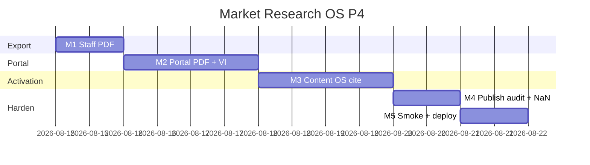

# Market Research OS — Kế hoạch coding P4 (Deliverable + activation)

> **For agentic workers:** REQUIRED SUB-SKILL: Use `superpowers:subagent-driven-development` (recommended) hoặc `superpowers:executing-plans` để thực thi **từng milestone**. Mỗi M có exit criteria, unit spec, smoke script và trace UC/EC.
>
> **P5 không nằm trong file này.** P0–P3 đã ship trên `main` (`a53c1e61`+). Plan này chỉ P4 = RES-UC-050…051 + hardening leftover P3.
>
> **Không nhầm với Design §17 «P4 Global scale»** (Qualtrics / RAG / ISO 20252 — đó là P5+ 6 tháng). Coding P4 = backlog Actions sau P3: PDF + Content OS cite.

**Goal:** Staff xuất PDF cùng nội dung DOCX; khách tải PDF portal có watermark + cùng gate embargo/expiry/RLS; AM cite `insight_id` vào Content OS (không copy statement); leftover P3 (audit publish + lỗi VI portal + wave NaN) được vá.

**Architecture:** Không module Nest mới. Staff PDF = `?format=pdf` trên export P0, builder clone `marketing-ai-pdf.util.ts` (UTF-16BE, không thêm `pdfkit`/`puppeteer`). Portal PDF = route mới trên `PortalResearchModule` đã có, tái `assertPortalReportReadable` + bake watermark mỗi trang. Content cite = clone plan-insert P1: freeze `insight_ids` vào `brief_json.market_research`, dual cap. Audit publish = 2 cột trên `crm_research_report_versions`.

**Tech Stack:** NestJS `services/ptt-crm-api`, Next.js `services/ops-web` + `services/portal-web`, PostgreSQL, Jest, bash smoke. Flag/caps P0 giữ nguyên (`PTT_MARKET_RESEARCH_ENABLED` / `NEXT_PUBLIC_MARKET_RESEARCH` đã bật prod). **Không** thêm dependency PDF.

**Spec canonical:**
- Design [`../specs/2026-08-14-market-research-os-design.md`](../specs/2026-08-14-market-research-os-design.md) §11 Content OS cite, §12 export
- SRS [`../../specs/2026-08-14-market-research-os-srs.md`](../../specs/2026-08-14-market-research-os-srs.md) FR-RPT-04, FR-INT-02
- UX [`../../specs/2026-08-14-market-research-os-ui-ux.md`](../../specs/2026-08-14-market-research-os-ui-ux.md) SCR-RES-003e / SCR-RES-040
- BA [`../../specs/modules/RNOSAI-BA-RES-UseCases.md`](../../specs/modules/RNOSAI-BA-RES-UseCases.md) — **thêm** RES-UC-050…051 ở M5
- Catalog [`../../use-cases/12-MARKET-RESEARCH-OS.md`](../../use-cases/12-MARKET-RESEARCH-OS.md)
- P3 plan [`./2026-08-14-market-research-os-p3.md`](./2026-08-14-market-research-os-p3.md)
- P1 plan-insert [`./2026-08-14-market-research-os-p1.md`](./2026-08-14-market-research-os-p1.md) M3 (clone)

## Global Constraints

- Mọi BR P0+P1+P2+P3 vẫn binding: **BR-RES-01, 03, 05, 06/08, 07, 09, 10, 11, 12, 13.**
- PDF là *view* của snapshot đã persist — **không** sinh insight / không đổi `content_snapshot`.
- Portal PDF cùng gate HTML: unpublished cùng tenant → **404** `{ error: 'not_found' }`; cross-tenant → **403** `{ error: 'forbidden' }` **không** `title`; embargo → 403 `embargo_active`; hết hạn → 403 `report_expired`.
- Watermark portal PDF **bắt buộc mọi trang:** `CONFIDENTIAL · {client_id} · {email} · {YYYY-MM-DD}` (`buildPortalWatermark` P3).
- **FR-INT-02:** Content item chỉ lưu `insight_id[]` + `client_id`. Cấm copy `statement` / `excerpt` vào `brief_json.market_research` (cùng `assertNoInsightTextLeak` P1).
- Insight cite Content OS: `approved_internal+`, cùng `client_id` với lifecycle (`contract.agency_client_id`). Dual cap: `crm_research.edit` **và** `crm_content.write`.
- Generic Content OS `PATCH` item **phải strip** key `market_research` khỏi `brief_json` (giống plan PATCH strip `khtn_market_research_json`).
- API staff prefix `api/v1/research`. Portal prefix `api/v1/portal/research`. Flag off → 404 `market_research_disabled`.
- Copy VI theo UX §10. Không palette mới. Không đụng `/crm/sales?tab=market`.
- **Không regress** hotfix Jest: `AppConfigService` skip `deploy/runtime.env` khi `process.env.JEST_WORKER_ID` set.
- Thứ tự file: `DDL → repository → util+spec (TDD) → service → controller → FE → smoke`.
- Commit chỉ khi user yêu cầu (user rule). Mỗi M xong smoke trước khi sang M tiếp.
- **Không implement trên `main`.** Branch: `feat/market-research-os-p4`.

### Out of P4 (cấm làm trong plan này)

Whisper ingest / raw transcript (NFR-PRI-02 vẫn cấm transcript thô — P5). SparkToro / Talkwalker / Qualtrics / Dovetail (không mua API trong plan). Counter-evidence LLM, RAG embeddings, Van Westendorp / conjoint, Apify FB login scrape, taxonomy, social query vault. Design §17 «Global scale» / ISO 20252. Không thêm `pdfkit` / `puppeteer` / Chromium.

### Definition of Done (mọi task)

| # | Tiêu chí | Verify |
|---|----------|--------|
| 1 | User-visible | UI hoặc curl smoke |
| 2 | Persisted | F5 / SQL còn data (cite + audit) |
| 3 | Guarded | thiếu cap → 403; flag off → 404; gate → 400/403/404 mã lỗi ổn định |
| 4 | Tested | `*.spec.ts` + smoke |

---

## 0. Milestone map (P4 = M1–M5)

| M | User outcome | UC | FR | Ước lượng |
|---|--------------|----|----|-----------|
| **M1** | Staff **Xuất PDF** (DOCX P0 không regress) | 050 | RPT-04 | 1 ngày |
| **M2** | Portal **Tải PDF** + watermark + map lỗi VI | 050 | RPT-04, US-CL-30 | 1.5 ngày |
| **M3** | Cite `insight_id` vào Content OS | 051 | INT-02 | 1.5 ngày |
| **M4** | `published_by` / `published_at` + wave NaN | — | leftover P3 | 0.5 ngày |
| **M5** | Smoke + gate + deploy + Actions P4 | — | — | 0.5 ngày |

**P4 sign-off = smoke P4 PASS + UAT Actions P4 (bổ sung vào `12-RES-ACTIONS.md`).**



---

## File map (khóa trước khi code)

| Tạo | Trách nhiệm |
|-----|-------------|
| `docs/specs/2026-08-14-postgresql-ddl-market-research-p4.sql` | `published_by` / `published_at` trên versions |
| `scripts/apply_pg_ddl_market_research_p4.sh` | `psql -v ON_ERROR_STOP=1` idempotent |
| `services/ptt-crm-api/src/market-research/market-research-pdf.util.ts` + spec | `buildResearchReportPdf` clone marketing-ai PDF |
| `services/ptt-crm-api/src/market-research/content-insight-snapshot.util.ts` + spec | `freezeContentInsights` + leak assert (reuse P1) |
| `services/ptt-crm-api/src/market-research/guards/staff-research-content-write.guard.ts` | Dual cap `crm_research.edit` + `crm_content.write` |
| `services/ops-web/src/components/research/InsertInsightContentPanel.tsx` | Cite panel trên Content OS item |
| `services/portal-web/src/lib/portal-research-errors.ts` | Map mã lỗi → VI |
| `scripts/smoke_market_research_p4.sh` + `p4_m1`…`p4_m5` | Skip live nếu API down |
| `scripts/deploy_market_research_p4_vps.sh` | Clone P3; **không** flip flag |

| Sửa | Việc |
|-----|------|
| `market-research-docx.util.ts` | Không đổi sections — PDF **reuse** `sectionsFromReportSnapshot` |
| `market-research.service.ts` / `.controller.ts` / `.types.ts` | `exportReportVersion(..., format)`; cite content item |
| `portal-research.controller.ts` / `.service.ts` | `GET …/reports/:versionId/export.pdf` |
| `content-item.service.ts` | PATCH strip `brief_json.market_research` |
| `app/crm/research/[id]/page.tsx` | Nút **Xuất PDF** cạnh Xuất DOCX |
| `services/portal-web/src/app/research/[versionId]/page.tsx` | Nút **Tải PDF** + map lỗi VI |
| `services/ops-web/src/components/content-os/ContentOsPanel.tsx` | Nhúng cite panel |
| `docs/use-cases/12-MARKET-RESEARCH-OS.md` | UC-050…051 |
| `docs/use-cases/actions/12-RES-ACTIONS.md` | Walkthrough P4; backlog P5 = Whisper + SparkToro |
| `docs/specs/modules/RNOSAI-BA-RES-UseCases.md` | RES-UC-050…051 |

---

## Shared types (mọi task dùng đúng tên này)

```typescript
export type ResearchExportFormat = 'docx' | 'pdf';

export type ContentInsightSnapshot = {
  client_id: string;
  insight_ids: number[];
  inserted_at: string;
  inserted_by: string;
};

export type ResearchReportVersionRow = {
  id: number;
  report_id: number;
  version: number;
  content_snapshot: Record<string, unknown>;
  generated_by: string | null;
  content_hash: string;
  embargo_until: string | null;
  expires_at: string | null;
  portal_visible: boolean;
  published_by: string | null;
  published_at: string | null;
  created_at: string;
};
```

Key `brief_json` dành riêng: **`market_research`** = `ContentInsightSnapshot`. Không nest `statement` / `excerpt`.

---

## Quyết định kỹ thuật (không mở lại khi code)

1. **Không thêm npm PDF.** Clone `buildMarketingPlanPdf` → `buildResearchReportPdf(sections, watermark?: string)`. Helvetica + UTF-16BE (đã tiếng Việt).
2. **Staff export** giữ route P0 `GET /api/v1/research/reports/:id/versions/:versionId/export`. Query `format=pdf` → PDF; thiếu / `docx` → DOCX (không regress). Cap `crm_research.export`. Methodology gate TC/CS P1 **vẫn** chạy trước cả hai format.
3. **Portal PDF** route riêng `GET /api/v1/portal/research/reports/:versionId/export.pdf`. Không query format. Cùng `assertPortalReportReadable` + watermark. Body 403/404 **không** `title`.
4. **Watermark staff PDF:** không email khách. Dòng cover «Confidential» từ snapshot là đủ. Portal PDF: `watermark` header **mọi trang**.
5. **Cite** `POST /api/v1/research/content-items/:itemId/insights` body `{ client_id, insight_ids }` — clone `POST …/plans/:planId/insights`. Client phải khớp `lifecycle.contract.agency_client_id`. Thiếu client trên lifecycle → 400 `content_item_no_client`. Insight khác client / `< approved_internal` → 400 `insight_not_approved`. Cross-tenant item → 403 không `title` item.
6. **Generic content PATCH** xóa `market_research` trên `brief_json` inbound. Chỉ cite endpoint được ghi key này.
7. **`published_by` / `published_at`:** set khi `publish-portal` `{ visible: true }`. Unpublish **không** xóa (audit lần công bố cuối). `createReport` để `null`.
8. **Wave NaN:** `validateCreateWave` — `value != null && !Number.isFinite(value)` → `metric value must be number or null`.
9. **Portal VI map** chỉ FE (`portal-research-errors.ts`). API vẫn trả mã ổn định. Staff không đổi.
10. Deploy P4: P0+P1+P2+P3+**P4** DDL ở bước 1; P4 DDL **trước** restart api/ops-web/portal-web/worker. Không `--enable-flags` mặc định. `APPLY=1` pull `origin main`.

---

## Milestone M1 — Staff PDF (RES-UC-050)

**User outcome:** AM bấm **Xuất PDF** trên Report tab; file `%PDF` mở được, cùng sections với DOCX. Xuất DOCX P0 vẫn chạy.

### Task M1-1 PDF util (TDD)

Tạo `market-research-pdf.util.ts`. **Copy** `pdfHexUtf16Be` / `wrapLine` / `flattenSections` / `buildPageStream` / object writer từ `marketing-ai-planner/marketing-ai-pdf.util.ts`. Không import chéo module planner (tránh coupling).

```typescript
import type { ResearchDocxSection } from './market-research-docx.util';

export function buildResearchReportPdf(
  sections: ResearchDocxSection[],
  watermark?: string,
): Buffer {
  // flatten sections; if watermark, prepend to every page chunk as first line
  // return Buffer starting with %PDF-
}
```

- [ ] **M1-1a:** Spec: `buildResearchReportPdf([{ title: 'Cover', lines: ['Client: Acme'] }])` → `buffer.subarray(0, 5).toString() === '%PDF-'`.
- [ ] **M1-1b:** Spec: watermark `'CONFIDENTIAL · acme · a@b.c · 2026-08-14'` xuất hiện trong `buffer.toString('utf8')` (hex UTF-16BE chứa `0043004f004e` = CON *hoặc* decode helper trong spec).
- [ ] **M1-1c:** Spec: sections rỗng vẫn `%PDF-` (không throw).

### Task M1-2 Export format + FE

`exportReportVersion(reportId, versionId, scope, format: ResearchExportFormat = 'docx')`.

Controller: `@Query('format') format?: string` — chỉ `'pdf' | 'docx'`; khác → 400 `validation_error`.

```typescript
if (format === 'pdf') {
  const buffer = buildResearchReportPdf(sectionsFromReportSnapshot(snapshot));
  return new StreamableFile(buffer, {
    type: 'application/pdf',
    disposition: `attachment; filename="research-report-${reportId}-v${version.version}.pdf"`,
  });
}
```

FE Report tab: nút **Xuất PDF** cạnh **Xuất DOCX** (cap `export`). `exportReportVersion(token, reportId, versionId, 'pdf')`.

- [ ] **M1-2a:** Jest: export `format=pdf` → `content-type` PDF; filename `.pdf`.
- [ ] **M1-2b:** Jest: không `format` → DOCX (P0 no regress, gồm CB stub).
- [ ] **M1-2c:** Jest: TC/CS thiếu methodology + `format=pdf` → 400 (P1 gate).
- [ ] **M1-2d:** Jest: GET ngoài scope → 403 without `title`.

**Exit M1:** Hai nút xuất; PDF `%PDF-`; DOCX không gãy.

**Commit:** `feat(research): P4 M1 staff PDF export`

---

## Milestone M2 — Portal PDF + lỗi VI (RES-UC-050)

**User outcome:** Acme tải PDF report đã công bố, mọi trang có watermark; Beta GET PDF Acme → 403 không `title`. Portal HTML hiện câu VI thay vì `report_expired`.

### Task M2-1 Portal export route

`GET /api/v1/portal/research/reports/:versionId/export.pdf` — `PortalJwtGuard` + `MarketResearchEnabledGuard`.

Service: load version bằng cùng query list/detail P3 (JWT `client_id`). Chạy `assertPortalReportReadable`. `buildPortalWatermark` → `buildResearchReportPdf(sections, watermark)`.

Cross-tenant / unpublished: **không** build PDF (trả 403/404 trước). Body `{ error }` only.

- [ ] **M2-1a:** Jest: published + trong hạn → Buffer `%PDF-` + watermark string path.
- [ ] **M2-1b:** Jest: `portal_visible=false` cùng tenant → 404 `{ error: 'not_found' }`.
- [ ] **M2-1c:** Jest: client khác → 403 `{ error: 'forbidden' }`; `JSON.stringify(body)` không chứa `title`.
- [ ] **M2-1d:** Jest: expired → 403 `report_expired` (không file).

### Task M2-2 Portal FE

`services/portal-web/src/lib/portal-research-errors.ts`:

```typescript
export const PORTAL_RESEARCH_ERROR_VI: Record<string, string> = {
  embargo_active: 'Báo cáo đang trong thời gian cấm công bố.',
  report_expired: 'Báo cáo đã hết hạn.',
  not_found: 'Không tìm thấy báo cáo.',
  forbidden: 'Bạn không có quyền xem báo cáo này.',
  market_research_disabled: 'Tính năng nghiên cứu thị trường chưa bật.',
};

export function portalResearchErrorVi(code: string): string {
  return PORTAL_RESEARCH_ERROR_VI[code] ?? 'Không tải được báo cáo.';
}
```

List + detail: map `error` qua helper (không render raw code). Detail: nút **Tải PDF** → `GET …/export.pdf` với portal JWT, `download` filename `research-v{version}.pdf`.

- [ ] **M2-2:** Smoke `p4_m2` — document contract (PDF 200 + watermark; Beta 403 no title; expired 403). FE review: expired page không hiện chữ `report_expired`.

**Exit M2:** Acme tải PDF; Beta không thấy title; hết hạn = câu VI.

**Commit:** `feat(research): P4 M2 portal PDF and VI errors`

---

## Milestone M3 — Content OS cite (RES-UC-051)

**User outcome:** AM mở Content OS item, chọn insight đã duyệt cùng client, bấm **Chèn insight**; F5 còn `insight_ids` trên brief. Statement insight **không** nằm trong `brief_json`.

### Task M3-1 Snapshot util (TDD)

`content-insight-snapshot.util.ts` — **reuse** `freezePlanInsights` / `assertNoInsightTextLeak` từ `plan-insight-snapshot.util.ts` (export alias `freezeContentInsights = freezePlanInsights`). Không nhân đôi logic.

```typescript
export const CONTENT_RESEARCH_BRIEF_KEY = 'market_research';

export function stripContentResearchFromBrief(
  brief: Record<string, unknown> | null | undefined,
): Record<string, unknown> {
  const next = { ...(brief ?? {}) };
  delete next[CONTENT_RESEARCH_BRIEF_KEY];
  return next;
}
```

- [ ] **M3-1a:** Spec: freeze keys only `client_id|insight_ids|inserted_at|inserted_by`; dedupe ids; drop `<=0`.
- [ ] **M3-1b:** Spec: JSON có `"statement"` → throw `plan_must_not_copy_insight_text`.
- [ ] **M3-1c:** Spec: `stripContentResearchFromBrief({ market_research: { insight_ids: [1] }, hook: 'x' })` → không còn `market_research`, giữ `hook`.

### Task M3-2 API + strip PATCH

Guard mới clone `StaffResearchMktplanEditGuard`: thiếu `crm_content.write` → 403 `{ error: 'missing_cap', section: 'crm_content', action: 'write' }`.

`POST /api/v1/research/content-items/:itemId/insights` — load item qua Content OS repo; `client_id` body phải `===` `lifecycle.contract.agency_client_id` (string trim). Scope staff phải chứa client đó.

Merge: `brief_json = { ...existing, market_research: snapshot }`. Không đụng `body_json` / title.

`content-item.service.patchItem`: nếu `body.brief_json` có mặt → `brief_json = stripContentResearchFromBrief(body.brief_json)` rồi gộp lại **giữ** `existing.market_research` (PATCH thường không xóa cite).

- [ ] **M3-2a:** Jest: cite insight `draft` → 400 `insight_not_approved`.
- [ ] **M3-2b:** Jest: client body ≠ lifecycle client → 400 `content_item_client_mismatch` (hoặc 403 nếu ngoài scope — ưu tiên 400 khi cùng scope nhưng sai client).
- [ ] **M3-2c:** Jest: snapshot persist không chứa `statement`; `assertNoInsightTextLeak` pass.
- [ ] **M3-2d:** Jest: thiếu `crm_content.write` → 403 `missing_cap`.
- [ ] **M3-2e:** Jest: generic PATCH `{ brief_json: { hook: 'n', market_research: { statement: 'leak' } } }` → stored `market_research` **không** thành leak; hoặc key bị strip và cite cũ giữ nguyên.

### Task M3-3 FE

`InsertInsightContentPanel.tsx` clone `InsertInsightPlanPanel` (cùng client picker + checkbox insight `approved_internal+`). Props: `itemId`, `lifecycleClientId`, `briefJson`, `onInserted`.

Nhúng trong `ContentOsPanel.tsx` khi user chọn 1 item (banner: «Chèn insight đã duyệt — không copy nội dung vào brief.»). Dual-cap disable nút nếu thiếu `crm_research.edit` hoặc `crm_content.write`.

- [ ] **M3-3:** Smoke `p4_m3` — POST cite → GET item `brief_json.market_research.insight_ids` còn sau F5.

**Exit M3:** F5 còn cite; PATCH brief không xóa/leak statement.

**Commit:** `feat(research): P4 M3 content OS insight cite`

---

## Milestone M4 — Publish audit + wave NaN

**User outcome:** Sau **Công bố portal**, version hiện người/ngày công bố; unpublish không xóa audit. Wave `value: NaN` bị 400.

### Task M4-1 DDL + publish stamp

`docs/specs/2026-08-14-postgresql-ddl-market-research-p4.sql`:

```sql
ALTER TABLE crm_research_report_versions
  ADD COLUMN IF NOT EXISTS published_by TEXT,
  ADD COLUMN IF NOT EXISTS published_at TIMESTAMPTZ;

INSERT INTO schema_migrations (version, description) VALUES
  ('2026-08-14-market-research-p4-m4', 'P4: published_by / published_at')
ON CONFLICT (version) DO NOTHING;
```

`mapReportVersion` select 2 cột mới. `publish-portal` `{ visible: true }` set `published_by = actor`, `published_at = now()`. `{ visible: false }` chỉ `portal_visible=false`.

`validateCreateWave`: trong loop metric:

```typescript
if (row.value != null && !Number.isFinite(row.value)) {
  messages.push('metric value must be number or null');
  break;
}
```

FE Report tab: dòng «Công bố bởi {published_by} lúc {published_at}» khi có audit.

- [ ] **M4-1a:** Jest: publish → `published_by` / `published_at` non-null; unpublish → `portal_visible=false` và audit **còn**.
- [ ] **M4-1b:** Jest: `createReport` → `published_by === null`.
- [ ] **M4-1c:** Jest: `validateCreateWave({ wave_no: 1, metric_json: [{ key: 'nps', value: Number.NaN }] })` chứa `metric value must be number or null`. Tương tự `Infinity`.

**Exit M4:** F5 còn audit sau unpublish; NaN/Infinity 400.

**Commit:** `feat(research): P4 M4 publish audit and wave finite`

---

## Milestone M5 — Smoke + deploy + Actions

**User outcome:** Script P4 chạy được trên VPS; UAT 050–051 có bước; catalog/BA có UC mới.

### Task M5-1

- `scripts/smoke_market_research_p4.sh` — lần lượt `p4_m1`…`p4_m5` nếu file tồn tại; skip live khi API down.
- `p4_m1`…`p4_m4` document contract (PDF magic, DOCX no regress, portal 403 no title, cite no statement, unpublish keeps audit, NaN 400). `p4_m5` = `bash -n` aggregator + deploy + gate.
- `scripts/market_research_gate.sh` — thêm EC P4: export pdf `%PDF-`; portal PDF cross-tenant 403 no title; cite draft insight 400; wave NaN 400.
- `scripts/deploy_market_research_p4_vps.sh` — clone P3: `npm ci` (không `--omit=dev`); apply P0+P1+P2+P3+**P4** DDL (**P4 DDL trước restart**); restart api, ops-web, portal-web (`wave_p1_rebuild_portal_web.sh` + `systemctl restart ptt-portal-web`), worker. Export `NEXT_PUBLIC_MARKET_RESEARCH` từ `deploy/runtime.env` khi build (không flip nếu đã 1). **Không** `--enable-flags` mặc định. `APPLY=1` pull `origin main`.
- Catalog + BA: RES-UC-050 (PDF staff + portal), RES-UC-051 (Content OS cite).
- Append `12-RES-ACTIONS.md` walkthrough P4 (~8 bước): Xuất PDF staff → DOCX vẫn OK → Công bố → Acme tải PDF watermark → Beta 403 → cite Content OS → PATCH brief không mất cite → F5. P5 backlog: Whisper, SparkToro.

- [ ] **M5-1:** `bash -n` mọi script mới. Jest `market-research|portal-research` xanh. Confirm `JEST_WORKER_ID` guard còn trong `AppConfigService`.

```
cd services/ptt-crm-api && npm test -- --testPathPattern='market-research|portal-research' --no-coverage
bash -n scripts/smoke_market_research_p4.sh scripts/deploy_market_research_p4_vps.sh
bash scripts/smoke_market_research_p4.sh
```

**Exit M5 = P4 sign-off.**

**Commit:** `feat(research): P4 M5 smoke deploy and UAT actions`

---

## 4. Env checklist (staging)

| Biến | P4 |
|------|-----|
| Flags P0 | giữ `1` (ops-web + portal-web build) |
| Caps | `crm_research.export` (PDF staff), `view` (GET), `approve` (publish — M4 audit), `edit` + `crm_content.write` (cite) |
| Portal JWT | `client_id` = `clients.id` = `crm_research_projects.client_id` |
| Content OS | lifecycle có `contract.agency_client_id` = cùng client insight |
| PDF libs | **không** cài thêm |

---

## 5. Spec coverage (self-review)

| SRS / UC | Task |
|----------|------|
| FR-RPT-04 staff | M1 |
| FR-RPT-04 portal + US-CL-30 | M2 |
| FR-INT-02 | M3 |
| P3 leftover audit / NaN / VI | M2 + M4 |
| Actions + deploy | M5 |
| Whisper / SparkToro | **Out — P5** |
| Design §17 Global scale | **Out — P5+** |

---

## 6. Rủi ro thực thi

| Rủi ro | Xử lý trong plan |
|--------|------------------|
| PDF tiếng Việt mojibake | Clone UTF-16BE hex từ marketing-ai-pdf (đã ship) |
| Thêm pdfkit làm nặng image | Cấm — không dependency mới |
| Cite leak statement vào brief | `assertNoInsightTextLeak` + PATCH strip |
| Content item không có client | 400 `content_item_no_client` — không đoán client |
| Portal PDF bypass embargo | Cùng `assertPortalReportReadable` trước khi build buffer |
| Jest đọc `runtime.env` prod | Không đụng `JEST_WORKER_ID` guard |
| `APPLY=1` kéo nhầm branch | Script pull `origin main` — merge main trước khi deploy VPS |
