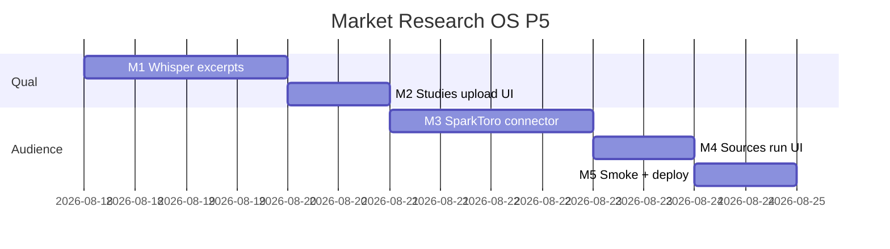

# Market Research OS — Kế hoạch coding P5 (Qual ingest + audience source)

> **For agentic workers:** REQUIRED SUB-SKILL: Use `superpowers:subagent-driven-development` (recommended) hoặc `superpowers:executing-plans` để thực thi **từng milestone**. Mỗi M có exit criteria, unit spec, smoke script và trace UC/EC.
>
> **P6–P7 không nằm trong file này để code.** P0–P4 đã ship trên `main` (`67cbc2d8`+). Plan này chỉ P5 = RES-UC-060…061.
>
> **writing-plans:** Whisper, SparkToro, Qualtrics, RAG, Van Westendorp, taxonomy, Apify login là **subsystem độc lập**. Không nhét một plan. P5 = 2 hạng mục Actions còn lại sau P4. Phần 7 = roadmap P6+ (plan riêng khi bake-off / PO mua API).

**Goal:** Analyst upload audio IDI/FGD → worker Whisper cắt **excerpt ≤ 500 + locator** (không persist transcript thô); Analyst chạy SparkToro → **source candidates** audience/overlap (tier low/medium + limitation, không auto-insight).

**Architecture:** Không module Nest mới. Whisper = job `research_whisper_ingest` (clone desk/pulse: Nest enqueue, worker persist khi queue on; Nest persist excerpts khi `jobs_disabled`). SparkToro = job `research_sparktoro` clone Tavily desk — insert `crm_research_sources` only. Audio = file tạm, xóa trong `finally`. Mở rộng `assertSimilarwebTier` → `assertPaidEstimateTier` (thêm `sparktoro`).

**Tech Stack:** NestJS `services/ptt-crm-api`, Next.js `services/ops-web`, PostgreSQL, Python `ptt_worker` + OpenAI Audio Transcription (đã có `OPENAI_*`), Jest + pytest, bash smoke. Flag/caps P0 giữ nguyên. SparkToro **tắt mặc định** (`RESEARCH_SPARKTORO_ENABLED=0`) — không mua key trong plan.

**Spec canonical:**
- Design [`../specs/2026-08-14-market-research-os-design.md`](../specs/2026-08-14-market-research-os-design.md) §10 G3c/G3d, §20 out-of-scope login scrape
- SRS [`../../specs/2026-08-14-market-research-os-srs.md`](../../specs/2026-08-14-market-research-os-srs.md) FR-STD-02/03, NFR-PRI-01/02, NFR-SEC-04, BR-RES-06/08/09/11
- UX [`../../specs/2026-08-14-market-research-os-ui-ux.md`](../../specs/2026-08-14-market-research-os-ui-ux.md) SCR-RES-030 Studies, SCR-RES-003b Sources
- P2 studies [`./2026-08-14-market-research-os-p2.md`](./2026-08-14-market-research-os-p2.md) M1
- P4 leftover [`./2026-08-14-market-research-os-p4.md`](./2026-08-14-market-research-os-p4.md) Out of P4
- Actions [`../../use-cases/actions/12-RES-ACTIONS.md`](../../use-cases/actions/12-RES-ACTIONS.md) P5 backlog

## Global Constraints

- Mọi BR P0–P4 vẫn binding: **BR-RES-01, 03, 05, 06/08, 07, 09, 10, 11, 12, 13.**
- **NFR-PRI-02:** Cấm persist transcript thô. Evidence study = `excerpt` ≤ 500 + locator `T-mm:ss` (P2 `assertExcerptNotRawTranscript` / `assertTranscriptLocator`). `ai_runs.output` **không** chứa full text (NFR-SEC-04) — chỉ `excerpt_ids` + `input_hash`.
- **NFR-PRI-01:** Consent bắt buộc trên study trước ingest. `expires_at` = recorded_at + 24 tháng (P2 `defaultConsentExpiry`). Consent hết hạn → 400 `consent_expired`.
- Audio: lưu **temp** trên worker/Nest, xóa trong `finally` kể cả fail. Không cột `audio_uri` / không object storage trong P5.
- Whisper / SparkToro / Deep / pulse = **sources hoặc evidence excerpts only**. Cấm `createInsight` / `createReport` / `publish-portal` từ các job này (BR-RES-06/08).
- **BR-RES-11:** SparkToro query = `question_vi` + geo only. Cấm SĐT/email/tên người CRM.
- **BR-RES-09 mở rộng:** publisher/url khớp `sparktoro` → `reliability_tier` ∈ {`low`,`medium`} + `limitation_note` bắt buộc (cùng helper Similarweb/Semrush).
- SparkToro thiếu key / flag off → fail graceful `sparktoro_disabled` (project không fail). **Không** gọi API trả phí trừ khi env bật **và** key có.
- API prefix `api/v1/research`. Flag research off → 404 `market_research_disabled`. Cap `run` cho ingest/SparkToro; `edit` tạo evidence; `view` GET.
- Copy VI theo UX §10. Không palette mới. Không đụng `/crm/sales?tab=market`.
- **Không regress** `JEST_WORKER_ID` skip `deploy/runtime.env`.
- Thứ tự file: `DDL (nếu có) → util+spec (TDD) → worker → service → controller → FE → smoke`.
- Commit chỉ khi user yêu cầu / SDD. **Không implement trên `main`.** Branch: `feat/market-research-os-p5`.

### Out of P5 (cấm làm trong plan này)

Qualtrics / panel bake-off, RAG embeddings / approved corpus search, Van Westendorp / conjoint / market simulator, `crm_research_taxonomy`, `crm_research_social_queries`, Talkwalker/Brandwatch/Dovetail, **Apify Facebook login / group scrape** (Design §20 — out vĩnh viễn, không “P6”). ISO 20252. Forecast registry. Không thêm `pdfkit`.

### Definition of Done (mọi task)

| # | Tiêu chí | Verify |
|---|----------|--------|
| 1 | User-visible | UI hoặc curl smoke |
| 2 | Persisted | F5 còn excerpt/source — **không** còn file audio / full transcript |
| 3 | Guarded | thiếu cap → 403; flag off → 404; gate → 400 mã ổn định |
| 4 | Tested | `*.spec.ts` / pytest + smoke |

---

## 0. Milestone map (P5 = M1–M5)

| M | User outcome | UC | FR / NFR | Ước lượng |
|---|--------------|----|----------|-----------|
| **M1** | Whisper → excerpt + locator; cấm raw | 060 | STD-02, PRI-02 | 2 ngày |
| **M2** | Studies tab **Tải audio** + consent gate | 060 | STD-03, PRI-01 | 1 ngày |
| **M3** | SparkToro → sources only + BR-RES-09 | 061 | CI / BR-09 | 1.5 ngày |
| **M4** | Sources tab **Chạy SparkToro** | 061 | BR-11 | 0.5 ngày |
| **M5** | Smoke + deploy + Actions P5 | — | — | 0.5 ngày |

**P5 sign-off = smoke P5 PASS + UAT Actions P5.**



---

## File map (khóa trước khi code)

| Tạo | Trách nhiệm |
|-----|-------------|
| `services/ptt-crm-api/src/market-research/whisper-excerpt.util.ts` + spec | Cắt transcript → excerpt[] ≤ 500 + `T-mm:ss`; không trả full text |
| `ptt_crm/market_research/whisper_ingest.py` + `tests/test_research_whisper_ingest.py` | Gọi OpenAI Audio; xóa temp; complete excerpts only |
| `services/ptt-crm-api/src/market-research/paid-estimate-tier.util.ts` | Rename/extend `assertSimilarwebTier` → thêm `sparktoro` (hoặc mở regex tại chỗ — **một** helper) |
| `ptt_crm/market_research/sparktoro_collect.py` + pytest | Audience → source candidates; skip nếu flag/key off |
| `scripts/smoke_market_research_p5.sh` + `p5_m1`…`p5_m5` | Skip live nếu API / key down |
| `scripts/deploy_market_research_p5_vps.sh` | Clone P4; **không** flip flag; **không** ghi SparkToro key |

| Sửa | Việc |
|-----|------|
| `study-consent.util.ts` | `assertStudyIngestable` (consent còn hạn) |
| `market-research.service.ts` / `.controller.ts` / `.types.ts` | `POST …/studies/:studyId/whisper`; `POST …/run-sparktoro` |
| Job queue (Nest + worker router) | `research_whisper_ingest`, `research_sparktoro` |
| `competitor-snapshot.util.ts` | Regex `sparktoro` trong paid-estimate (hoặc re-export từ helper mới) |
| Studies tab `page.tsx` / pane P2 | Upload audio, banner NFR-PRI-02 |
| Sources tab | Nút **Chạy SparkToro** (disable nếu flag off) |
| `docs/use-cases/12-MARKET-RESEARCH-OS.md` | UC-060…061 |
| `docs/use-cases/actions/12-RES-ACTIONS.md` | Walkthrough P5; backlog P6+ |
| `docs/specs/modules/RNOSAI-BA-RES-UseCases.md` | RES-UC-060…061 |

**Không DDL mới** trừ khi job queue bắt buộc tên job trong CHECK — nếu `crm_research_ai_runs.job_type` có whitelist, ADD value `whisper_ingest` / `sparktoro` idempotent trong `docs/specs/2026-08-14-postgresql-ddl-market-research-p5.sql`.

---

## Shared types

```typescript
export type WhisperExcerpt = {
  locator: string; // T-mm:ss
  excerpt: string; // trim, length 1–500
};

export type WhisperIngestResult = {
  ok: true;
  run_id: number;
  study_id: number;
  excerpt_ids: number[];
  // cấm: transcript, audio_uri, raw
};

export type SparkToroSourceCandidate = {
  url: string;
  title: string;
  publisher: 'SparkToro';
  reliability_tier: 'low' | 'medium';
  limitation_note: string;
  snippet: string; // ≤ 500, không PII
};
```

---

## Quyết định kỹ thuật (không mở lại khi code)

1. **Không persist raw.** Worker nhận text từ Whisper API trong memory → `excerptsFromTranscript` → `createEvidence` từng excerpt. Drop text. Xóa file audio. Jest/pytest: spy `createEvidence` + assert không có string length > 500 trong repo insert / `completeAiRun` payload.
2. **Consent gate trước enqueue.** Study không có consent còn hạn → 400 `consent_required` / `consent_expired`. Không gọi OpenAI.
3. **Audio cap:** ≤ 25 MB; MIME `audio/mpeg` \| `audio/wav` \| `audio/mp4` \| `audio/x-m4a`. Khác → 400 `validation_error`.
4. **Một writer evidence:** giống pulse P2 — worker persist khi job enqueue thành công; Nest persist excerpts **chỉ** khi `jobs_disabled` (dev). Không double-insert.
5. **SparkToro = desk sources.** `ai_generated=true`, `keep` mặc định true, Analyst verify như Tavily. Không snapshot competitor. Không insight.
6. **`assertPaidEstimateTier`:** haystack `similarweb|semrush|sparktoro`. Source `unknown` remap `medium` **chỉ** trong helper này (P1 residual — giữ).
7. **Flag SparkToro riêng** `RESEARCH_SPARKTORO_ENABLED` default `0` (không invent `NEXT_PUBLIC_*` thứ 3 trừ khi FE cần ẩn nút — nếu ẩn, đọc cùng env build **không** bật prod trong deploy script).
8. **Apify login không có milestone.** Public-page Apify LMP giữ nguyên; DV12 P5 không gọi Apify.
9. Deploy P5: P0–P4 + P5 DDL (nếu có) trước restart api/ops-web/worker. Portal-web **không** bắt buộc (P5 không đụng portal). Không `--enable-flags`. `APPLY=1` pull `origin main`.

---

## Milestone M1 — Whisper excerpts (RES-UC-060)

**User outcome:** POST audio + `study_id` → 1..N evidence `excerpt` ≤ 500 + locator. GET study không trả transcript. File audio không còn sau job.

### Task M1-1 Util (TDD)

`whisper-excerpt.util.ts` **verbatim shape:**

```typescript
const MAX_EXCERPT = 500;
const MAX_EXCERPTS = 12;

export function excerptsFromTranscript(text: string): WhisperExcerpt[] {
  // split on /(?<=[.?!])\s+/ or every ~400 chars
  // locator T-00:00, T-00:30, … estimated 30s/chunk
  // each excerpt trimmed, slice(0, MAX_EXCERPT)
  // drop empty; cap MAX_EXCERPTS
  // never include the original `text` field on the return object
}

export function assertNoRawInPayload(json: unknown): void {
  const raw = JSON.stringify(json);
  if (raw.length > 8000) {
    throw Object.assign(new Error('raw_transcript_forbidden'), { code: 'raw_transcript_forbidden' });
  }
}
```

`assertStudyIngestable` trong `study-consent.util.ts`: có ≥1 consent `expires_at > now`; else throw `consent_required` / `consent_expired`.

- [ ] **M1-1a:** Spec: 3 câu ngắn → 3 excerpt, mỗi `length ≤ 500`, locator khớp `/^T-\d{1,2}:\d{2}/`.
- [ ] **M1-1b:** Spec: 20k-char dump → không excerpt nào > 500; return length ≤ 12.
- [ ] **M1-1c:** Spec: `assertNoRawInPayload({ transcript: 'x'.repeat(9000) })` → `raw_transcript_forbidden`.

### Task M1-2 API + worker

`POST /api/v1/research/projects/:id/studies/:studyId/whisper` — multipart `file`, cap `run`. Scope project. Study cùng `project_id`.

Enqueue `research_whisper_ingest` `{ project_id, study_id, run_id, temp_path, question_id? }`. Query desk = không gửi. Complete: `excerpt_ids` only.

Worker: OpenAI transcription → `excerptsFromTranscript` → HTTP complete. `finally: unlink(temp_path)`.

Thiếu `OPENAI_*` → `whisper_disabled` (project không fail).

- [ ] **M1-2a:** Jest: study 0 consent → 400 `consent_required`; enqueue không gọi.
- [ ] **M1-2b:** Jest: `jobs_disabled` persist excerpts; `createInsight` không gọi; `completeAiRun` payload không chứa key `transcript`.
- [ ] **M1-2c:** Jest: GET evidence ngoài scope → 403 without study `name`.
- [ ] **M1-2d:** Pytest: after process, temp file gone; inserted excerpts all `len ≤ 500`.

**Exit M1:** SQL chỉ thấy excerpt; không cột/file transcript.

**Commit:** `feat(research): P5 M1 whisper excerpts without raw transcript`

---

## Milestone M2 — Studies upload UI (RES-UC-060)

**User outcome:** Tab Studies: chọn study có consent → **Tải audio** → poll job → evidence mới hiện. Study không consent: nút disabled + `title` VI.

Banner: «Chỉ lưu đoạn trích ≤ 500 ký tự + mốc thời gian. Không lưu bản ghi / transcript đầy đủ.»

- [ ] **M2-1:** Smoke `p5_m1`/`p5_m2` document contract (consent 400; excerpt cap). FE không render textarea transcript.

**Exit M2:** F5 còn excerpt; không ô “dán transcript”.

**Commit:** `feat(research): P5 M2 studies audio upload`

---

## Milestone M3 — SparkToro sources (RES-UC-061)

**User outcome:** `POST …/run-sparktoro` trên RQ → sources `publisher=SparkToro`, tier ≤ medium, có `limitation_note`. Không insight.

### Task M3-1 Tier + mapper (TDD)

Mở `assertSimilarwebTier` (đổi tên `assertPaidEstimateTier` **hoặc** thêm `sparktoro` vào regex — chọn một, cập nhật mọi call site + spec P1).

```typescript
const PAID = /similarweb|semrush|sparktoro/;
```

`limitation_note` SparkToro mặc định: «Ước lượng audience SparkToro — không phải census. Không suy “người Việt nghĩ rằng…”.»

Mapper: API/fixture → `SparkToroSourceCandidate[]`. Snippet ≤ 500; `assertNoInsightTextLeak` không bắt buộc (không có statement) — dùng `piiHint` nếu excerpt có SĐT/email → drop row.

- [ ] **M3-1a:** Spec: url chứa `sparktoro.com` + tier `high` → `reliability_capped`.
- [ ] **M3-1b:** Spec: tier `medium` + empty limitation → `limitation_required`.
- [ ] **M3-1c:** Spec: mapper không emit `statement` / insight fields.

### Task M3-2 Job

`POST /api/v1/research/projects/:id/run-sparktoro` body `{ question_id }` cap `run`. Query = `question_vi` + project geo. `piiHint(question_vi)` → 400 (BR-RES-11).

Flag/key off → `sparktoro_disabled` (200 `ok: true` + note, hoặc 400 — **chọn 200 + note** giống Tavily optional để project không fail).

- [ ] **M3-2a:** Jest: enqueue không `createInsight`.
- [ ] **M3-2b:** Jest: question có email → 400.
- [ ] **M3-2c:** Pytest/Jest: insert source `reliability_tier` ∈ {low, medium} + limitation nonempty.
- [ ] **M3-2d:** Jest: GET source ngoài scope → 403 without competitor/study `name`.

**Exit M3:** Sources SparkToro persist; insight count không tăng.

**Commit:** `feat(research): P5 M3 sparktoro source candidates`

---

## Milestone M4 — Sources UI (RES-UC-061)

**User outcome:** Tab Sources nút **Chạy SparkToro** (cap `run`). Banner: «Nguồn ước lượng — ghi limitation. Không tự tạo insight.» Ẩn/disable khi `RESEARCH_SPARKTORO_ENABLED` không bật (đọc từ health payload hoặc env public **không** default 1).

Mở rộng `GET /api/v1/research/health` (đã có `deep_provider`) thêm `sparktoro_enabled: boolean` (true chỉ khi flag **và** key present — **không** trả key).

- [ ] **M4-1:** Smoke `p5_m3` document 403/disabled/no-insight.

**Exit M4:** Nút không hiện trên prod nếu flag 0.

**Commit:** `feat(research): P5 M4 sparktoro sources button`

---

## Milestone M5 — Smoke + deploy + Actions

**User outcome:** Script P5 chạy trên VPS; UAT 060–061 có bước; catalog/BA có UC; backlog P6+ rõ.

### Task M5-1

- Aggregator `smoke_market_research_p5.sh` loop `p5_m1`…`p5_m5`; skip live nếu API down / không audio fixture / SparkToro off.
- Gate: consent 400; excerpt > 500 400 `raw_transcript_forbidden`; SparkToro không `createInsight`; paid tier `high` 400 `reliability_capped`.
- Deploy clone P4 **không** portal-web trừ khi health FE cần (P5 ops-web only — **bỏ bước portal** để giảm rủi ro; nếu health `sparktoro_enabled` chỉ staff API thì đủ).
- Catalog + BA: RES-UC-060, 061.
- Actions walkthrough (~8 bước): consent → upload → excerpt ≤ 500 → F5 không transcript → SparkToro (hoặc disabled note) → source limitation → không insight mới → F5. P6+ table: Qualtrics, RAG, Van Westendorp, taxonomy. Dòng **Apify login: out (Design §20)**.

- [ ] **M5-1:** `bash -n` script mới. Jest `market-research` + pytest whisper/sparktoro xanh. `JEST_WORKER_ID` guard còn.

```
cd services/ptt-crm-api && npm test -- --testPathPattern='market-research' --no-coverage
cd <repo> && python -m pytest tests/test_research_whisper_ingest.py tests/test_research_sparktoro.py -q
bash -n scripts/smoke_market_research_p5.sh scripts/deploy_market_research_p5_vps.sh
```

**Exit M5 = P5 sign-off.**

**Commit:** `feat(research): P5 M5 smoke deploy and UAT actions`

---

## 4. Env checklist (staging)

| Biến | P5 |
|------|-----|
| Flags P0 | giữ `1` |
| `OPENAI_API_KEY` / model audio | Whisper; thiếu → `whisper_disabled` |
| `RESEARCH_SPARKTORO_ENABLED` | default `0` — **không** bật trong deploy |
| `SPARKTORO_API_KEY` | chỉ staging khi PO mua; không commit |
| Caps | `crm_research.run` (jobs), `edit` (evidence), `view` |
| Audio fixture | ≤ 25 MB, study + consent còn hạn |

---

## 5. Spec coverage (self-review)

| SRS / UC | Task |
|----------|------|
| NFR-PRI-02, FR-STD-02, UC-060 | M1–M2 |
| NFR-PRI-01, FR-STD-03 | M1 consent gate |
| BR-RES-09/11, UC-061 | M3–M4 |
| Actions + deploy | M5 |
| Qualtrics / RAG / VW / taxonomy | **Out — P6/P7** |
| Apify login | **Out vĩnh viễn — §20** |

---

## 6. Rủi ro thực thi

| Rủi ro | Xử lý trong plan |
|--------|------------------|
| Worker/Nest giữ transcript trong `ai_runs` | `assertNoRawInPayload` trên complete body; Jest cấm key `transcript` |
| Audio leak trên disk | `finally unlink`; không `audio_uri` |
| Gọi SparkToro prod vô tình | Flag default 0; deploy không `--enable-sparktoro` |
| P1 Similarweb test gãy khi rename helper | Giữ export alias `assertSimilarwebTier = assertPaidEstimateTier` |
| Jest đọc `runtime.env` | Không đụng `JEST_WORKER_ID` guard |
| `APPLY=1` kéo nhầm branch | Pull `origin main` — merge main trước VPS |

---

## 7. Roadmap P5+ (không code trong plan này)

`writing-plans`: mỗi hàng = plan riêng khi đến lượt. P5 implementer **cấm** làm các M dưới.

| Phase | Hạng mục | Điều kiện mở | Ghi chú |
|-------|----------|--------------|---------|
| **P5** | Whisper excerpts + SparkToro sources | Plan này | Actions leftover sau P4 |
| **P6** | Qualtrics connector + Van Westendorp lite | PO có retainer Qualtrics **hoặc** chấp nhận Forms + codebook VW | Survey ≠ pricing method — có thể 2 milestone trong một plan P6 nếu cùng `PRICE_OFFER` |
| **P7** | RAG **chỉ** insight `published` / `approved_client_facing` + `crm_research_taxonomy` | Gold-set unsupported-claim ổn; DPA embeddings | Cấm embed draft / transcript / lead PII (Design §10 G10) |
| **—** | Apify **login** / group FB | Không mở | Design §20. LMP public page giữ nguyên |
| **P8+** | Talkwalker/Dovetail bake-off, conjoint đầy đủ, ISO 20252, social query vault | Scorecard 100đ | Design §17 «Global scale» |

### P6 stub (khi viết plan riêng)

- Qualtrics: import response → study + evidence `value+unit+base`; ExpertReview = source note, không auto-insight.
- Van Westendorp: 4 câu giá → bảng `too_cheap`…`too_expensive` trên project `PRICE_OFFER`; **không** market simulator.
- Cấm MOE / “95% confidence” trừ `statistical_inference=true` (BR-RES-03).

### P7 stub (khi viết plan riêng)

- Embeddings: pgvector **hoặc** reuse marketing-ai RAG util — **chỉ** corpus approved.
- Taxonomy: `crm_research_taxonomy` theme + synonym; gắn `insight_id`; không thay statement.
- Search nội bộ `/crm/research?q=` — không portal.

---

## 8. Câu hỏi đã khóa (không hỏi lại lúc code)

1. P5 = Whisper + SparkToro, không Qualtrics/RAG/VW/taxonomy.
2. Transcript thô không bao giờ thành cột / file SoT.
3. SparkToro prod off cho đến khi PO dán key staging.
4. Apify login không vào backlog coding.
