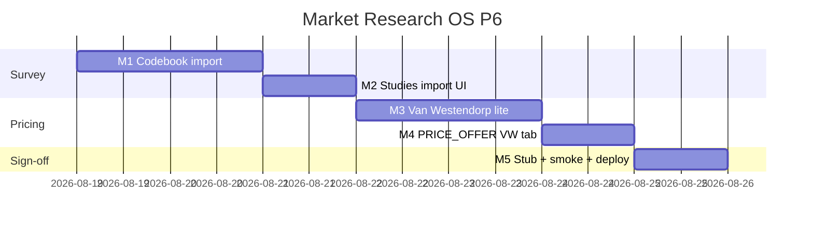

# Market Research OS — Kế hoạch coding P6 (survey codebook + Van Westendorp lite)

> **For agentic workers:** REQUIRED SUB-SKILL: Use `superpowers:subagent-driven-development` (recommended) hoặc `superpowers:executing-plans` để thực thi **từng milestone**. Mỗi M có exit criteria, unit spec, smoke script và trace UC/EC.
>
> **P7 không nằm trong file này để code.** P0–P5 đã ship trên `main` (`8a980b08`+). Plan này chỉ P6 = RES-UC-062…063.
>
> **Hướng đã khóa:** Forms/CSV codebook + VW lite trong **một** plan. Qualtrics API = stub + flag `0` (không mua key). Không conjoint / market simulator / RAG / taxonomy.

**Goal:** Analyst nhập CSV codebook → study `survey` + evidence `value+unit+base` (ExpertReview = source note, không insight); trên project `PRICE_OFFER` tính bảng Van Westendorp `too_cheap`…`too_expensive` (không simulator, không MOE / “95% confidence”).

**Architecture:** Không module Nest mới. Import **đồng bộ** trên Nest (không worker, không job queue). Parser CSV → `createStudy` / `createEvidence` / `createSource` đã có. VW = util thuần + bảng `crm_research_vw_summaries` + `GET/POST` gated `product_type === 'PRICE_OFFER'` (clone `waves_not_tracker`). Qualtrics = `POST …/run-qualtrics` trả `qualtrics_disabled` khi flag/key off (clone SparkToro).

**Tech Stack:** NestJS `services/ptt-crm-api`, Next.js `services/ops-web`, PostgreSQL, Jest, bash smoke. **Không** thêm `xlsx` / `pdfkit` / Qualtrics SDK. Flag/caps P0 giữ nguyên. `RESEARCH_QUALTRICS_ENABLED` default `0`.

**Spec canonical:**
- Design [`../specs/2026-08-14-market-research-os-design.md`](../specs/2026-08-14-market-research-os-design.md) §10 G3e, §18 Survey = Forms + codebook
- SRS [`../../specs/2026-08-14-market-research-os-srs.md`](../../specs/2026-08-14-market-research-os-srs.md) FR-STD-01, BR-RES-02/03/06/08/11/12
- UX [`../../specs/2026-08-14-market-research-os-ui-ux.md`](../../specs/2026-08-14-market-research-os-ui-ux.md) SCR-RES-030 Studies
- P2 studies [`./2026-08-14-market-research-os-p2.md`](./2026-08-14-market-research-os-p2.md) M1
- P5 leftover [`./2026-08-14-market-research-os-p5.md`](./2026-08-14-market-research-os-p5.md) §7 P6 stub
- Actions [`../../use-cases/actions/12-RES-ACTIONS.md`](../../use-cases/actions/12-RES-ACTIONS.md) P6+ backlog

## Global Constraints

- Mọi BR P0–P5 vẫn binding: **BR-RES-01, 03, 05, 06/08, 07, 09, 10, 11, 12, 13.**
- **BR-RES-02:** evidence số phải có `value_num` + `unit` + `value_base` + `period_note` + `geography` (đã có `validateCreateEvidence`).
- **BR-RES-03:** cấm MOE / “95% confidence” / “sai số mẫu” trừ `statistical_inference=true`. Mở `assertNoFakeConfidence`. VW summary **không** được chứa các cụm đó. `statistical_inference` trên VW = **false**.
- **BR-RES-06/08:** import / VW / Qualtrics stub **không** `createInsight` / `createReport` / `publish-portal`.
- **BR-RES-11:** CSV không chứa SĐT/email/tên CRM. `piiHint` trên mọi ô → 400 `survey_pii_forbidden` (không persist hàng). `respondent_id` chỉ mã (vd `R001`).
- **BR-RES-12:** cross-tenant GET → 403, body không `title` / competitor `name` / study `name`.
- Import = cap `crm_research.edit` (tạo evidence). Qualtrics stub = cap `run`. VW GET = `view`; VW compute POST = `edit`.
- CSV only (MIME `text/csv` | `text/plain` | `application/csv`). ≤ 2 MB. ≤ 500 dòng data. **Không** npm `xlsx`.
- Qualtrics thiếu flag/key → `200 { ok: true, note: 'qualtrics_disabled' }`. Không gọi HTTP trả phí. Health `qualtrics_enabled` = flag **và** key; **không** trả key.
- Copy VI theo UX §10. Không palette mới. Không đụng `/crm/sales?tab=market`.
- **Không regress** `JEST_WORKER_ID` skip `deploy/runtime.env`.
- Thứ tự file: `DDL → util+spec (TDD) → service → controller → FE → smoke`.
- Commit chỉ khi user yêu cầu / SDD. **Không implement trên `main`.** Branch: `feat/market-research-os-p6`. Merge-base: `8a980b08`.

### Out of P6 (cấm làm trong plan này)

Qualtrics **live** HTTP / panel bake-off, RAG / `crm_research_taxonomy`, conjoint đầy đủ, market simulator, Talkwalker/Dovetail, **Apify Facebook login** (Design §20), ISO 20252, SparkToro live connector, Whisper thay đổi. Không thêm `xlsx` / `pdfkit`.

### Definition of Done (mọi task)

| # | Tiêu chí | Verify |
|---|----------|--------|
| 1 | User-visible | UI hoặc curl smoke |
| 2 | Persisted | F5 còn evidence / bảng VW |
| 3 | Guarded | thiếu cap → 403; flag off → 404; gate → 400 mã ổn định |
| 4 | Tested | `*.spec.ts` + smoke |

---

## 0. Milestone map (P6 = M1–M5)

| M | User outcome | UC | FR / NFR | Ước lượng |
|---|--------------|----|----------|-----------|
| **M1** | CSV codebook → study + evidence `value+unit+base`; không insight | 062 | STD-01, BR-02/11 | 1.5 ngày |
| **M2** | Studies tab **Nhập codebook** | 062 | UX 030 | 0.5 ngày |
| **M3** | VW lite trên `PRICE_OFFER`; không simulator | 063 | BR-03 | 1.5 ngày |
| **M4** | Tab **Giá VW** (chỉ `PRICE_OFFER`) | 063 | — | 0.5 ngày |
| **M5** | Qualtrics stub + smoke + deploy + Actions | — | — | 0.5 ngày |

**P6 sign-off = smoke P6 PASS + UAT Actions P6.**



---

## File map (khóa trước khi code)

| Tạo | Trách nhiệm |
|-----|-------------|
| `docs/specs/2026-08-14-postgresql-ddl-market-research-p6.sql` + `scripts/apply_pg_ddl_market_research_p6.sh` | `crm_research_vw_summaries` |
| `services/ptt-crm-api/src/market-research/survey-codebook.util.ts` + spec | Parse CSV; PII gate; map → evidence rows |
| `services/ptt-crm-api/src/market-research/van-westendorp.util.ts` + spec | Bảng 4 đường + 4 điểm (PMC/PME/OPP/IDP); không MOE |
| `scripts/smoke_market_research_p6.sh` + `p6_m1`…`p6_m5` | Skip live nếu API down |
| `scripts/deploy_market_research_p6_vps.sh` | Clone P5; **không** portal-web; **không** bật Qualtrics |

| Sửa | Việc |
|-----|------|
| `confidence-rubric.util.ts` | Regex cấm thêm `MOE` / `margin of error` / `sai số mẫu` |
| `market-research.service.ts` / `.controller.ts` / `.types.ts` / `.repository.ts` | `POST …/import-survey`; `POST/GET …/van-westendorp`; `POST …/run-qualtrics` |
| `app-config.service.ts` | `researchQualtricsEnabled` default false; `qualtricsApiKey` |
| `health()` | thêm `qualtrics_enabled` (M5) |
| Studies pane | **Nhập codebook** |
| `page.tsx` | tab `vw` khi `PRICE_OFFER` (clone Waves/TRACKER) |
| Catalog / BA / Actions | UC-062…063; walkthrough P6; backlog P7+ |

---

## Shared types

```typescript
export const SURVEY_IMPORT_FORMATS = ['codebook', 'vw'] as const;
export type SurveyImportFormat = (typeof SURVEY_IMPORT_FORMATS)[number];

export type CodebookEvidenceDraft = {
  locator: string; // Q-{code} hoặc R-{id}:{base}
  value_num: number;
  unit: string;
  value_base: string;
  period_note: string;
  geography: string;
  respondent_id: string;
};

export type SurveyImportResult = {
  ok: true;
  study_id: number;
  source_id: number;
  evidence_ids: number[];
  n: number;
  // cấm: insight_id, statement
};

export const VW_BASES = ['too_cheap', 'cheap', 'expensive', 'too_expensive'] as const;
export type VwBase = (typeof VW_BASES)[number];

export type VwRespondent = {
  too_cheap: number;
  cheap: number;
  expensive: number;
  too_expensive: number;
};

export type VwBin = {
  price: number;
  too_cheap: number; // percent 0–100
  cheap: number;
  expensive: number;
  too_expensive: number;
};

export type VwPoints = {
  pmc: number | null;
  pme: number | null;
  opp: number | null;
  idp: number | null;
};

export type VwSummary = {
  n: number;
  unit: string;
  bins: VwBin[];
  points: VwPoints;
  limitation_note: string;
  statistical_inference: false;
};

export const VW_LIMITATION =
  'Van Westendorp trên mẫu convenience — không phải census. Không ghi MOE / 95% confidence.';

export const CODEBOOK_LIMITATION =
  'Codebook Forms — không phải panel xác suất. Không suy MOE.';
```

---

## Quyết định kỹ thuật (không mở lại khi code)

1. **CSV only, sync Nest.** Không worker. Không `xlsx`. Parser không phụ thuộc thư viện mới.
2. **Hai format một endpoint.** `format=codebook` (cột generic) hoặc `format=vw` (4 cột giá). Field multipart: `file` + `format` + optional `study_id` + optional `expert_review` + `period_note` + `geography` + `unit` (vw).
3. **Codebook header bắt buộc (đúng tên, không phân biệt hoa thường):**
   `respondent_id,question_code,value,unit,value_base,period_note,geography`
4. **VW CSV header bắt buộc:**
   `respondent_id,too_cheap,cheap,expensive,too_expensive`
   `unit` / `period_note` / `geography` lấy từ form fields (không cột). Default unit `VND`.
5. **Một writer:** Nest `createEvidence` từng dòng (đã validate BR-RES-02). Không raw CSV persist. Không cột `file_uri`.
6. **Study:** nếu không `study_id` → tạo study `method=survey`, `name` = `Codebook {YYYY-MM-DD}`, `n` = số `respondent_id` unique. Nếu có `study_id` → study phải `method=survey` cùng project; cập nhật `n`.
7. **Source:** `publisher=Forms`, `title` = study name, `reliability_tier=medium`, `limitation_note` = `expert_review` trim hoặc `CODEBOOK_LIMITATION`. `ai_generated=false`. Không insight.
8. **PII:** `piiHint` trên mọi cell (kể cả `respondent_id`). Hit → 400 `survey_pii_forbidden`, **không** insert dở.
9. **VW chỉ `PRICE_OFFER`.** Khác → 400 `vw_not_price_offer`. `n < 4` respondent hợp lệ → 400 `vw_insufficient_n`. Hàng VW không thỏa `too_cheap ≤ cheap ≤ expensive ≤ too_expensive` (số hữu hạn > 0) → drop hàng; nếu còn < 4 → 400.
10. **VW không ghi % confidence / MOE** trong `bins` / `points` / `limitation_note`. `statistical_inference: false` cứng.
11. **Qualtrics stub (M5):** không enqueue, không import. Flag/key off → 200 + note. Nút FE ẩn khi `qualtrics_enabled !== true`.
12. **Deploy:** clone P5 (DDL P0–P6, api, ops-web, worker). Không portal-web. Không `--enable-flags`. Không ghi `QUALTRICS_API_KEY` / `RESEARCH_QUALTRICS_ENABLED=1`. `APPLY=1` pull `origin main`.
13. **Apify login không có milestone.**

---

## Milestone M1 — Codebook import (RES-UC-062)

**User outcome:** `POST …/projects/:id/import-survey` (multipart) → study `survey` + source Forms + N evidence `value+unit+base`. Insight count không tăng.

### Task M1-1 Parser (TDD)

`survey-codebook.util.ts`:

```typescript
export function parseCsv(text: string): string[][] {
  // split on \n / \r\n; skip empty lines
  // no embedded-comma support — cell containing ',' → throw codebook_csv_invalid
}

export function parseCodebookCsv(text: string): CodebookEvidenceDraft[] {
  // header must match codebook columns (case-insensitive)
  // each data row → draft; value = Number; !Number.isFinite → skip row
  // locator = `Q-${question_code}`
  // cap 500 rows; excess → throw codebook_row_cap
}

export function parseVwCsv(text: string): Array<{ respondent_id: string } & VwRespondent> {
  // header vw columns; four prices Number
}

export function assertCodebookNoPii(rows: Array<Record<string, string>>): void {
  // any piiHint(cell) → throw survey_pii_forbidden
}
```

- [ ] **M1-1a:** Spec: 2 dòng codebook hợp lệ → 2 draft, `locator` `Q-Q1`, `value_num` số.
- [ ] **M1-1b:** Spec: ô `analyst@ptt.vn` → `survey_pii_forbidden`.
- [ ] **M1-1c:** Spec: 501 dòng data → `codebook_row_cap`.
- [ ] **M1-1d:** Spec: header sai → `codebook_csv_invalid`.

### Task M1-2 API

`POST /api/v1/research/projects/:id/import-survey`  
`FileInterceptor('file')` cap 2 MB. Cap `edit`. Scope project.

```
MIME ∉ {text/csv, text/plain, application/csv} → 400 validation_error
```

Service `importSurvey`: parse → assert PII → create/load study → createSource → createEvidence (study_id + source_id) → patch study.n → return `SurveyImportResult`. **Không** gọi `createInsight`.

`format=vw` ở M1: vẫn persist 4 evidence / respondent (`value_base` ∈ VW_BASES, `locator` = `R-{id}:{base}`) — **chưa** compute summary (M3).

- [ ] **M1-2a:** Jest: codebook 2 hàng → 2 evidence; `createInsight` không gọi.
- [ ] **M1-2b:** Jest: email trong CSV → 400 `survey_pii_forbidden`; 0 evidence.
- [ ] **M1-2c:** Jest: GET evidence ngoài scope → 403 without study `name`.
- [ ] **M1-2d:** Jest: thiếu `unit` trên hàng codebook → hàng skip hoặc 400 `validation_error` (chọn **400 cả file** nếu bất kỳ hàng thiếu BR-RES-02 — fail closed).

**Exit M1:** F5 còn evidence số; không insight mới; không file CSV trên disk.

**Commit:** `feat(research): P6 M1 survey codebook import`

---

## Milestone M2 — Studies import UI (RES-UC-062)

**User outcome:** Tab Studies: **Nhập codebook** (cap `edit`). Banner verbatim: «Nhập CSV codebook — evidence số. Không tự tạo insight.»

- File input `accept=".csv,text/csv"`.
- Select format: `codebook` | `vw`.
- Fields: `period_note`, `geography` (bắt buộc với `vw`; codebook có cột sẵn nhưng cho phép override trống = dùng cột).
- `unit` hiện khi `vw` (default `VND`).
- Optional textarea **ExpertReview** → `expert_review` (source note). Placeholder: không phải insight.
- Disabled khi `!canEdit`. Không cần consent (khác Whisper).
- Sau 201: reload studies + evidence (`onImported`).

Smoke `scripts/smoke_market_research_p6_m1.sh` + `p6_m2.sh`: document PII 400, no-insight; `bash -n`.

- [ ] **M2-1:** Vitest banner verbatim. FE không gọi `createInsight`. Không textarea transcript.

**Exit M2:** Nút có trên Studies; F5 còn study/evidence.

**Commit:** `feat(research): P6 M2 studies codebook upload`

---

## Milestone M3 — Van Westendorp lite (RES-UC-063)

**User outcome:** `POST …/van-westendorp` trên `PRICE_OFFER` → snapshot bảng 4 đường + điểm PMC/PME/OPP/IDP. Không insight. Không MOE.

### Task M3-1 Util (TDD)

`van-westendorp.util.ts` — thuật toán **khóa**:

```typescript
export function respondentsFromVwEvidence(
  rows: Array<{ value_num: number | null; value_base: string; locator: string }>,
): VwRespondent[] {
  // group by respondent id parsed from locator `R-{id}:…`
  // require all 4 bases; drop incomplete / non-finite / not too_cheap≤cheap≤expensive≤too_expensive
}

export function computeVanWestendorp(respondents: VwRespondent[]): Omit<VwSummary, 'unit'> {
  // N = respondents.length; if N < 4 throw vw_insufficient_n
  // prices = sorted unique of all 4 fields
  // for each price p:
  //   too_cheap    = 100 * count(r.too_cheap >= p) / N
  //   cheap        = 100 * count(r.cheap >= p) / N
  //   expensive    = 100 * count(r.expensive <= p) / N
  //   too_expensive= 100 * count(r.too_expensive <= p) / N
  // points (first crossing low→high, linear interpolate; else null):
  //   idp = cheap crosses expensive
  //   opp = too_cheap crosses too_expensive
  //   pmc = too_cheap crosses expensive
  //   pme = cheap crosses too_expensive
  // limitation_note = VW_LIMITATION
  // statistical_inference = false
  // assertNoFakeConfidence(JSON.stringify(out), false)
}

export function firstCrossing(
  xs: number[],
  a: number[],
  b: number[],
): number | null {
  // a[i] - b[i] changes sign; interpolate x
}
```

Fixture tối thiểu (4 respondent) — spec **M3-1a** phải khớp số bin và `statistical_inference === false`:

| id | too_cheap | cheap | expensive | too_expensive |
|----|-----------|-------|-----------|---------------|
| R1 | 10 | 20 | 40 | 50 |
| R2 | 12 | 22 | 42 | 55 |
| R3 | 8 | 18 | 38 | 48 |
| R4 | 15 | 25 | 45 | 60 |

- [ ] **M3-1a:** 4 hàng trên → `n=4`; mọi percent ∈ [0,100]; `limitation_note` verbatim; không substring `MOE` / `95%`.
- [ ] **M3-1b:** 3 respondent → `vw_insufficient_n`.
- [ ] **M3-1c:** `assertNoFakeConfidence('MOE 3%', false)` → `forbidden_confidence_wording` (regex đã mở).

### Task M3-2 API + DDL

DDL `crm_research_vw_summaries`:

```sql
CREATE TABLE IF NOT EXISTS crm_research_vw_summaries (
  id              BIGSERIAL PRIMARY KEY,
  project_id      BIGINT NOT NULL REFERENCES crm_research_projects(id) ON DELETE CASCADE,
  study_id        BIGINT REFERENCES crm_research_studies(id) ON DELETE SET NULL,
  unit            TEXT NOT NULL,
  n               INT NOT NULL,
  bins            JSONB NOT NULL,
  points          JSONB NOT NULL,
  limitation_note TEXT NOT NULL,
  statistical_inference BOOLEAN NOT NULL DEFAULT false,
  created_by      TEXT,
  created_at      TIMESTAMPTZ NOT NULL DEFAULT now()
);
CREATE INDEX IF NOT EXISTS crm_research_vw_summaries_project_idx
  ON crm_research_vw_summaries (project_id, id DESC);
```

`POST /api/v1/research/projects/:id/van-westendorp` body `{ study_id? }` cap `edit`.  
`GET /api/v1/research/projects/:id/van-westendorp` → latest summary hoặc `{ summary: null }`. Cap `view`.

- Load project; `product_type !== 'PRICE_OFFER'` → 400 `vw_not_price_offer`.
- Lấy evidence study (hoặc mọi study survey của project) có `value_base` ∈ VW_BASES.
- Compute → insert summary. **Không** `createInsight`.
- Cross-tenant GET → 403 without study `name`.

- [ ] **M3-2a:** Jest: `CAT_REVIEW` → 400 `vw_not_price_offer`.
- [ ] **M3-2b:** Jest: `PRICE_OFFER` + 4 respondent → summary persist; `createInsight` không gọi.
- [ ] **M3-2c:** Jest: GET ngoài scope → 403 `{ error: 'forbidden' }` không `name`.

**Exit M3:** F5 còn 1 dòng summary; không insight.

**Commit:** `feat(research): P6 M3 van westendorp lite`

---

## Milestone M4 — Tab Giá VW (RES-UC-063)

**User outcome:** Project `PRICE_OFFER` có tab **Giá VW**. Banner verbatim: «Bảng ước lượng giá — mẫu convenience. Không MOE / 95% confidence.»

Clone Waves/TRACKER trong `page.tsx` (~968): thêm tab khi `product_type === 'PRICE_OFFER'`. Ẩn trên type khác.

`VwPane`: bảng bins (cột giá + 4 %), 4 điểm (— nếu null), `limitation_note`, nút **Tính Van Westendorp** (`canEdit`). Không nút tạo insight.

- [ ] **M4-1:** Vitest banner verbatim + `shouldShowVwTab(productType)` true chỉ `PRICE_OFFER`.
- Smoke `p6_m3.sh`: document `vw_not_price_offer` / `vw_insufficient_n` / no-insight.

**Exit M4:** Tab không hiện trên `CAT_REVIEW`.

**Commit:** `feat(research): P6 M4 price offer vw tab`

---

## Milestone M5 — Qualtrics stub + smoke + deploy + Actions

**User outcome:** Qualtrics tắt trên prod; script P6 chạy; UAT 062–063 có bước; P7+ rõ.

### Qualtrics stub

- Config: `RESEARCH_QUALTRICS_ENABLED` default `0`; `QUALTRICS_API_KEY` (không log).
- `POST /api/v1/research/projects/:id/run-qualtrics` cap `run` → `200 { ok: true, note: 'qualtrics_disabled' }` khi `!flag || !key`. Không enqueue. Không `createInsight`.
- `health()` thêm `qualtrics_enabled` (flag **và** key). Giữ `sparktoro_enabled`. Không trả key.
- FE: **không** hiện nút Qualtrics khi `qualtrics_enabled !== true` (prod ẩn).

### Smoke + deploy + docs

- Aggregator `smoke_market_research_p6.sh` loop `p6_m1`…`p6_m5`.
- Gate comments: PII 400; BR-RES-02 400; `vw_not_price_offer`; `createInsight` không gọi; Qualtrics disabled 200.
- Deploy clone P5: `1/4` P0–P6 DDL (P6 last) → api → ops-web → worker. **Không** portal-web. **Không** bật Qualtrics / SparkToro.
- Catalog + BA: RES-UC-062, 063.
- Actions walkthrough (~8 bước): tạo/chọn study survey → Nhập codebook → evidence value+unit+base → F5 → (PRICE_OFFER) Tính VW → bảng + limitation → không insight → Qualtrics ẩn/disabled → F5.
- P7+ table: RAG, taxonomy. Qualtrics **live** = điều kiện mở (retainer). Dòng **Apify login: out (Design §20)**. Conjoint / simulator = P8+.

- [ ] **M5-1:**

```
cd services/ptt-crm-api && npm test -- --testPathPattern='market-research' --no-coverage
cd services/ops-web && npx vitest run src/components/research --reporter=dot
bash -n scripts/smoke_market_research_p6.sh scripts/deploy_market_research_p6_vps.sh
```

`JEST_WORKER_ID` guard còn. Pytest P5 whisper/sparktoro vẫn xanh (không sửa).

**Exit M5 = P6 sign-off.**

**Commit:** `feat(research): P6 M5 qualtrics stub smoke deploy and UAT`

---

## 4. Env checklist (staging)

| Biến | P6 |
|------|-----|
| Flags P0 | giữ `1` |
| `RESEARCH_QUALTRICS_ENABLED` | default `0` — **không** bật trong deploy |
| `QUALTRICS_API_KEY` | không commit; không ghi deploy |
| Caps | `edit` (import/VW), `run` (Qualtrics stub), `view` |
| Fixture | `scripts/fixtures/research-codebook.sample.csv` (2–4 hàng, không PII) + `research-vw.sample.csv` (4 hàng) |

---

## 5. Spec coverage (self-review)

| SRS / UC | Task |
|----------|------|
| FR-STD-01, BR-RES-02/11, UC-062 | M1–M2 |
| BR-RES-03, UC-063, PRICE_OFFER | M3–M4 |
| BR-RES-06/08 no auto-insight | M1, M3, M5 |
| Qualtrics live | **Out — stub only** |
| RAG / taxonomy | **Out — P7** |
| Conjoint / simulator | **Out — P8+** |
| Apify login | **Out vĩnh viễn — §20** |

---

## 6. Rủi ro thi hành

| Rủi ro | Xử lý trong plan |
|--------|------------------|
| CSV có PII | `piiHint` fail-closed cả file |
| VW bị hiểu là “giá tối ưu thống kê” | `VW_LIMITATION` + cấm MOE/95% trên output |
| Qualtrics prod vô tình | Flag 0; deploy không ghi key |
| `xlsx` / Excel thật | Cấm — CSV only |
| Jest đọc `runtime.env` | Không đụng `JEST_WORKER_ID` |
| `APPLY=1` nhầm branch | Pull `origin main` |

---

## 7. Roadmap P6+ (không code trong plan này)

| Phase | Hạng mục | Điều kiện mở |
|-------|----------|--------------|
| **P6** | Codebook + VW lite + Qualtrics stub | Plan này |
| **P7** | RAG chỉ insight `published` / `approved_client_facing` + taxonomy | Gold-set + DPA embeddings |
| **P6+ live Qualtrics** | Connector thật | PO retainer + key staging |
| **P8+** | Conjoint đầy đủ, market simulator, Talkwalker/Dovetail, ISO 20252 | Scorecard 100đ |
| **—** | Apify login / group FB | Không mở |

---

## 8. Câu hỏi đã khóa (không hỏi lại lúc code)

1. P6 = Forms/CSV + VW lite; Qualtrics API stub / flag 0.
2. Không conjoint / simulator / RAG / taxonomy.
3. VW chỉ `PRICE_OFFER`; import codebook chạy mọi `product_type`.
4. Apify login không vào backlog coding.
5. CSV only — không `xlsx`.
