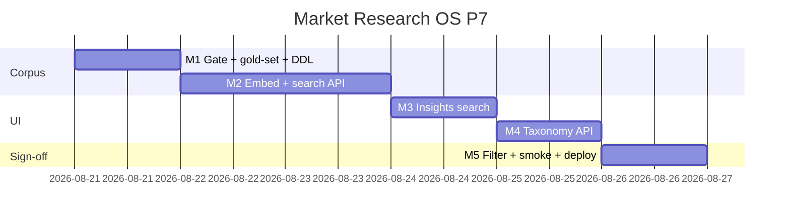

# Market Research OS — Kế hoạch coding P7 (RAG approved corpus + taxonomy)

> **For agentic workers:** REQUIRED SUB-SKILL: Use `superpowers:subagent-driven-development` (recommended) hoặc `superpowers:executing-plans` để thực thi **từng milestone**. Mỗi M có exit criteria, unit spec, smoke script và trace UC/EC.
>
> **P8+ không nằm trong file này để code.** P0–P6 đã ship trên `main` (`c63a42e4`). Plan này chỉ P7 = RES-UC-070…071.
>
> **Hướng đã khóa:** RAG + taxonomy trong **một** plan (P6 leftover «P7 cùng RAG»). Embeddings **local hash** (clone playbooks) — không OpenAI embedding, không `pgvector`. Qualtrics **live** / conjoint / simulator / Apify login = **out**.

**Goal:** Analyst tìm lại insight đã `approved_client_facing` / `published` theo câu hỏi + theme; ResearchOps gắn taxonomy (theme + synonym) vào insight **không** sửa `statement`. Draft / transcript / lead PII **không** vào corpus.

**Architecture:** Không module Nest mới. Util thuần `research-rag.util.ts` (corpus gate + embed + rank) + bảng `crm_research_insight_embeddings` / `crm_research_taxonomy` / `crm_research_insight_themes`. Embed **đồng bộ** khi `approveInsight` lên client-facing/published (không fail approve nếu PII/skip). Search = `GET` staff, không portal. Flag `RESEARCH_RAG_ENABLED` default `0` → `{ hits: [], note: 'rag_disabled' }`.

**Tech Stack:** NestJS `services/ptt-crm-api`, Next.js `services/ops-web`, PostgreSQL JSONB vector, Jest, bash smoke. **Tái sử dụng** `cosineSimilarity` từ `playbooks.types.ts`. **Không** thêm npm vector DB / `pgvector` / OpenAI embeddings SDK. Flag/caps P0 giữ nguyên.

**Spec canonical:**
- Design [`../specs/2026-08-14-market-research-os-design.md`](../specs/2026-08-14-market-research-os-design.md) §10 G10, §15.2 Vector/RAG
- SRS [`../../specs/2026-08-14-market-research-os-srs.md`](../../specs/2026-08-14-market-research-os-srs.md) NFR-AI-04, BR-RES-01/11/12
- UX [`../../specs/2026-08-14-market-research-os-ui-ux.md`](../../specs/2026-08-14-market-research-os-ui-ux.md) ResearchOps taxonomy `configure`; Insights tab
- P5 leftover [`./2026-08-14-market-research-os-p5.md`](./2026-08-14-market-research-os-p5.md) §7 P7 stub
- P6 leftover [`./2026-08-14-market-research-os-p6.md`](./2026-08-14-market-research-os-p6.md) §7
- Actions [`../../use-cases/actions/12-RES-ACTIONS.md`](../../use-cases/actions/12-RES-ACTIONS.md) P7+ backlog
- Playbooks vector [`../../../../services/ptt-crm-api/src/playbooks/playbooks.types.ts`](../../../../services/ptt-crm-api/src/playbooks/playbooks.types.ts) `embedPlaybookText` / `cosineSimilarity`

## Global Constraints

- Mọi BR P0–P6 vẫn binding: **BR-RES-01, 02, 03, 05, 06/08, 07, 09, 10, 11, 12, 13.**
- **Design §10 G10 / §15.2:** RAG **chỉ** corpus `approved_client_facing` | `published`. Cấm embed `draft` / `evidence_attached` / transcript / excerpt / lead PII.
- **BR-RES-11:** `piiHint` trên text embed (`statement` + `observation`) → **không** ghi vector. Approve **không** fail.
- **BR-RES-12:** search / GET taxonomy ngoài scope → 403, body **không** `statement` / `title` / competitor `name` / study `name`.
- **BR-RES-06/08:** search / embed / taxonomy **không** `createInsight` / `createReport` / `publish-portal`. RAG không tự viết insight.
- **NFR-PRI-02:** không persist transcript. Embed text ≠ excerpt audio.
- Search = cap `crm_research.view`. Attach theme = `edit`. Taxonomy CRUD = `configure`.
- Flag `RESEARCH_RAG_ENABLED` default `0`. Health `rag_enabled` = flag only (local embed, không key). **Không** trả secret.
- Flag off → `200 { hits: [], note: 'rag_disabled' }`. Không gọi vendor.
- Copy VI theo UX §10. Không palette mới. Không đụng `/crm/sales?tab=market`.
- **Không regress** `JEST_WORKER_ID` skip `deploy/runtime.env`.
- Thứ tự file: `DDL → util+spec (TDD) → service → controller → FE → smoke`.
- Commit chỉ khi user yêu cầu / SDD. **Không implement trên `main`.** Branch: `feat/market-research-os-p7`. Merge-base: `c63a42e4`.

### Out of P7 (cấm làm trong plan này)

Qualtrics **live** HTTP, OpenAI/Gemini **embedding API**, `CREATE EXTENSION vector` / pgvector, conjoint / market simulator, cluster theme theo quý, retrain model trên data khách, portal RAG, Talkwalker/Dovetail, **Apify Facebook login** (Design §20), ISO 20252, SparkToro live, Whisper thay đổi. Không thêm `xlsx` / `pdfkit`. Không inject RAG vào `insightCopilot` (P8 nếu cần).

### Definition of Done (mọi task)

| # | Tiêu chí | Verify |
|---|----------|--------|
| 1 | User-visible | UI hoặc curl smoke |
| 2 | Persisted | F5 còn embedding / theme |
| 3 | Guarded | thiếu cap → 403; flag off → `rag_disabled`; draft → không hit |
| 4 | Tested | `*.spec.ts` + gold-set + smoke |

---

## 0. Milestone map (P7 = M1–M5)

| M | User outcome | UC | FR / NFR | Ước lượng |
|---|--------------|----|----------|-----------|
| **M1** | Corpus gate + gold-set + DDL | 070 | G10, NFR-AI-04 | 1 ngày |
| **M2** | Embed lúc duyệt + `GET …/insights/search` | 070 | BR-11/12 | 1.5 ngày |
| **M3** | Insights tab **Tìm insight đã duyệt** | 070 | UX Insights | 0.5 ngày |
| **M4** | Taxonomy CRUD + gắn theme (không sửa statement) | 071 | configure/edit | 1 ngày |
| **M5** | Theme filter UI + smoke + deploy + Actions | 070–071 | — | 0.5 ngày |

**P7 sign-off = smoke P7 PASS + UAT Actions P7 + gold-set 0 draft hit.**



---

## File map (khóa trước khi code)

| Tạo | Trách nhiệm |
|-----|-------------|
| `docs/specs/2026-08-14-postgresql-ddl-market-research-p7.sql` + `scripts/apply_pg_ddl_market_research_p7.sh` | embeddings + taxonomy + insight_themes |
| `services/ptt-crm-api/src/market-research/research-rag.util.ts` + spec | `isRagCorpusStatus`, `embedInsightText`, `rankRagHits`, gold-set runner |
| `scripts/fixtures/research-rag-goldset.json` | 8–10 case: approved hit / draft miss / PII skip |
| `scripts/smoke_market_research_p7.sh` + `p7_m1`…`p7_m5` | Skip live nếu API down |
| `scripts/deploy_market_research_p7_vps.sh` | Clone P6; **không** portal-web; **không** bật RAG |

| Sửa | Việc |
|-----|------|
| `market-research.types.ts` | `RAG_CORPUS_STATUSES`, `RagHit`, `TaxonomyTheme` |
| `market-research.service.ts` / `.controller.ts` / `.repository.ts` | embed on approve; search; taxonomy CRUD; attach |
| `app-config.service.ts` | `researchRagEnabled` default false |
| `health()` | thêm `rag_enabled` (flag only) |
| Insights tab `page.tsx` | ô tìm + theme chips |
| Catalog / BA / Actions | UC-070…071; walkthrough P7; backlog P8+ |

---

## Shared types

```typescript
export const RAG_CORPUS_STATUSES = ['approved_client_facing', 'published'] as const;
export type RagCorpusStatus = (typeof RAG_CORPUS_STATUSES)[number];

export const RAG_EMBED_DIMS = 64;

export const RAG_SEARCH_BANNER =
  'Chỉ insight đã duyệt bản khách / published. Không tìm draft. Không tự tạo insight.';

export type RagEmbedInput = {
  insight_id: number;
  status: string;
  statement: string;
  observation: string | null;
};

export type RagHit = {
  insight_id: number;
  project_id: number;
  statement: string;
  status: RagCorpusStatus;
  score: number;
  theme_codes: string[];
};

export type RagSearchResult = {
  hits: RagHit[];
  note?: 'rag_disabled';
};

export type TaxonomyTheme = {
  id: number;
  theme_code: string;
  label_vi: string;
  synonyms: string[];
  active: boolean;
};

export const SEED_TAXONOMY: ReadonlyArray<{ theme_code: string; label_vi: string; synonyms: string[] }> = [
  { theme_code: 'PRICE', label_vi: 'Giá', synonyms: ['pricing', 'giá bán'] },
  { theme_code: 'CHANNEL', label_vi: 'Kênh', synonyms: ['phân phối'] },
  { theme_code: 'COMPETITOR', label_vi: 'Đối thủ', synonyms: ['cạnh tranh'] },
  { theme_code: 'TREND', label_vi: 'Xu hướng', synonyms: ['emerging'] },
  { theme_code: 'SEGMENT', label_vi: 'Phân khúc', synonyms: ['đối tượng'] },
  { theme_code: 'RISK', label_vi: 'Rủi ro', synonyms: ['limitation'] },
  { theme_code: 'MESSAGE', label_vi: 'Thông điệp', synonyms: ['claim'] },
  { theme_code: 'GEO', label_vi: 'Địa bàn', synonyms: ['khu vực'] },
];
```

Gold-set (`scripts/fixtures/research-rag-goldset.json`) — **khóa**:

```json
{
  "cases": [
    {
      "id": "G1",
      "q": "giá sữa học đường",
      "corpus": [
        { "insight_id": 1, "status": "approved_client_facing", "statement": "Giá sữa học đường tăng tại Hà Nội", "observation": null },
        { "insight_id": 2, "status": "draft", "statement": "Giá sữa học đường tăng tại Hà Nội", "observation": null }
      ],
      "must_include": [1],
      "must_exclude": [2]
    },
    {
      "id": "G2",
      "q": "transcript buổi IDI",
      "corpus": [
        { "insight_id": 3, "status": "published", "statement": "Phụ huynh chọn kênh cửa hàng tiện lợi", "observation": null }
      ],
      "must_include": [],
      "must_exclude": [3]
    }
  ]
}
```

G2: query không khớp statement → 3 không vào `must_include` (không hallucinate id). Draft luôn `must_exclude`.

---

## Quyết định kỹ thuật (không mở lại khi code)

1. **Một plan = RAG + taxonomy.** Taxonomy là facet lọc search, không plan riêng.
2. **Local hash embed** — clone `embedPlaybookText` vào `embedInsightText(text, RAG_EMBED_DIMS)` (64 chiều, L2-normalized). `import { cosineSimilarity } from '../playbooks/playbooks.types'`. **Không** gọi OpenAI/Gemini embeddings. **Không** `pgvector`.
3. **DPA:** không gửi `statement` ra vendor. Điều kiện mở «DPA embeddings» = in-process vector.
4. **Gold-set in-repo** thỏa «Gold-set unsupported-claim ổn»: runner Jest đọc fixture; 0 hit có `status` ngoài `RAG_CORPUS_STATUSES`; 0 hit tự bịa `insight_id` không có trong corpus.
5. **Embed text** = `statement` + `' '` + (`observation` ?? `''`). Không `interpretation` / excerpt / transcript.
6. **Khi nào embed:** sau `updateInsightStatus` nếu `isRagCorpusStatus(target)`. `piiHint(embedText)` → skip (không INSERT). Target ra khỏi corpus (`superseded` / `expired` / `rejected`) → DELETE embedding.
7. **Search:** `GET /api/v1/research/insights/search?q=&theme_code=&client_id=&limit=` cap `view`. `q` trim rỗng → 400 `rag_query_required`. `limit` default 10, max 20. Score = `0.7 * cosine + 0.3 * keywordScore` (import `keywordScore` từ playbooks). Min score `0.12`. Flag off → `{ hits: [], note: 'rag_disabled' }` **trước** khi đọc insight.
8. **Scope:** `loadScopedProject` / client allow-list trước khi trả `statement`. Ngoài scope → 403 `{ error: 'forbidden' }` không `statement`.
9. **Taxonomy:** `theme_code` `[A-Z][A-Z0-9_]{1,31}`. Gắn `POST …/insights/:id/themes` body `{ taxonomy_id }` — **cấm** PATCH `statement` trên path này. Xóa theme không xóa insight.
10. **Seed 8 theme** trong DDL (`ON CONFLICT (theme_code) DO NOTHING`).
11. **FE search** trên Insights tab (project) + optional `q` trên `/crm/research` gọi search API (không trộn `crm_sales_market`). Banner verbatim `RAG_SEARCH_BANNER`.
12. **Admin taxonomy:** `/crm/research/taxonomy` chỉ `configure`. Ẩn nếu không cap.
13. **Health:** `rag_enabled: Boolean(config.researchRagEnabled)`. Giữ `sparktoro_enabled` / `qualtrics_enabled`. Không key.
14. **Deploy:** clone P6 (DDL P0–P7, P7 last) → api → ops-web → worker. Không portal-web. Không `RESEARCH_RAG_ENABLED=1`. `APPLY=1` pull `origin main`.
15. **Apify login không có milestone.**

---

## Milestone M1 — Corpus gate + gold-set + DDL (RES-UC-070)

**User outcome:** Util từ chối draft; gold-set fixture chạy Jest; bảng embeddings/taxonomy tồn tại trên disk (chưa API).

### Task M1-1 Util (TDD)

`research-rag.util.ts`:

```typescript
export function isRagCorpusStatus(status: string): status is RagCorpusStatus {
  return (RAG_CORPUS_STATUSES as readonly string[]).includes(status);
}

export function insightEmbedText(row: Pick<RagEmbedInput, 'statement' | 'observation'>): string {
  return `${row.statement ?? ''} ${row.observation ?? ''}`.replace(/\s+/g, ' ').trim();
}

export function embedInsightText(text: string, dims = RAG_EMBED_DIMS): number[] {
  // clone embedPlaybookText — same hash, own export
}

export function rankRagHits(
  query: string,
  rows: Array<RagEmbedInput & { project_id: number; embedding: number[]; theme_codes: string[] }>,
  opts?: { theme_code?: string; limit?: number; minScore?: number },
): RagHit[] {
  // 1. drop !isRagCorpusStatus
  // 2. optional theme_code filter (exact code or synonym match later in M4 — M1 = exact code)
  // 3. score = 0.7 * cosine(embed(query), embedding) + 0.3 * keywordScore(query, statement)
  // 4. drop score < (opts.minScore ?? 0.12)
  // 5. sort desc, slice limit (default 10)
}
```

- [ ] **M1-1a:** `isRagCorpusStatus('draft') === false`; `'published' === true`.
- [ ] **M1-1b:** Gold-set G1: hit ids ⊇ `{1}`, không chứa `2`.
- [ ] **M1-1c:** Gold-set G2: hits không chứa id ngoài corpus; không chứa draft.
- [ ] **M1-1d:** `insightEmbedText` + `piiHint` → caller skip (util không gọi pii; spec riêng `shouldSkipRagEmbed`).

```typescript
export function shouldSkipRagEmbed(text: string): boolean {
  return !text.trim() || piiHint(text);
}
```

### Task M1-2 DDL

```sql
CREATE TABLE IF NOT EXISTS crm_research_insight_embeddings (
  insight_id   BIGINT PRIMARY KEY REFERENCES crm_research_insights(id) ON DELETE CASCADE,
  project_id   BIGINT NOT NULL REFERENCES crm_research_projects(id) ON DELETE CASCADE,
  embedding    JSONB NOT NULL,
  embed_text   TEXT NOT NULL,
  created_at   TIMESTAMPTZ NOT NULL DEFAULT now(),
  updated_at   TIMESTAMPTZ NOT NULL DEFAULT now()
);
CREATE INDEX IF NOT EXISTS crm_research_insight_embeddings_project_idx
  ON crm_research_insight_embeddings (project_id);

CREATE TABLE IF NOT EXISTS crm_research_taxonomy (
  id          BIGSERIAL PRIMARY KEY,
  theme_code  TEXT NOT NULL UNIQUE,
  label_vi    TEXT NOT NULL,
  synonyms    TEXT[] NOT NULL DEFAULT '{}',
  active      BOOLEAN NOT NULL DEFAULT true,
  created_at  TIMESTAMPTZ NOT NULL DEFAULT now()
);

CREATE TABLE IF NOT EXISTS crm_research_insight_themes (
  insight_id   BIGINT NOT NULL REFERENCES crm_research_insights(id) ON DELETE CASCADE,
  taxonomy_id  BIGINT NOT NULL REFERENCES crm_research_taxonomy(id) ON DELETE CASCADE,
  created_by   TEXT,
  created_at   TIMESTAMPTZ NOT NULL DEFAULT now(),
  PRIMARY KEY (insight_id, taxonomy_id)
);

INSERT INTO crm_research_taxonomy (theme_code, label_vi, synonyms) VALUES
  ('PRICE', 'Giá', ARRAY['pricing', 'giá bán']),
  ('CHANNEL', 'Kênh', ARRAY['phân phối']),
  ('COMPETITOR', 'Đối thủ', ARRAY['cạnh tranh']),
  ('TREND', 'Xu hướng', ARRAY['emerging']),
  ('SEGMENT', 'Phân khúc', ARRAY['đối tượng']),
  ('RISK', 'Rủi ro', ARRAY['limitation']),
  ('MESSAGE', 'Thông điệp', ARRAY['claim']),
  ('GEO', 'Địa bàn', ARRAY['khu vực'])
ON CONFLICT (theme_code) DO NOTHING;
```

Apply script clone P6. Repo methods **chưa** bắt buộc ở M1 (có thể stub).

**Exit M1:** gold-set Jest xanh; DDL file + apply script.

**Commit:** `feat(research): P7 M1 rag corpus gate and taxonomy ddl`

---

## Milestone M2 — Embed + search API (RES-UC-070)

**User outcome:** Duyệt insight lên `approved_client_facing` → có dòng embedding (trừ PII). `GET …/insights/search?q=` trả hit corpus; draft không xuất hiện.

`POST` không có — search là GET. Cap `view`.

```typescript
// controller
@Get('insights/search')
@UseGuards(StaffOrInternalKeyGuard, StaffMarketResearchViewGuard)
async searchInsights(@Req() req: StaffReq, @Query() query: { q?: string; theme_code?: string; client_id?: string; limit?: string })

// service.searchInsights(scope, { q, theme_code, client_id, limit }): Promise<RagSearchResult>
```

- Flag off → `{ hits: [], note: 'rag_disabled' }`; `listEmbeddings` **không** gọi.
- `approveInsight`: sau insertReview, nếu `isRagCorpusStatus(target)` → `upsertInsightEmbedding` (skip PII). Nếu rời corpus → `deleteInsightEmbedding`.
- Cross-tenant: insight project `client_id` ngoài allow-list → 403 `{ error: 'forbidden' }` không `statement` (clone M3-2c).
- `createInsight` không gọi từ search/embed.

- [ ] **M2-1a:** Jest: approve → `approved_client_facing` gọi `upsertInsightEmbedding` với `isRagCorpusStatus`; draft `createInsight` không upsert.
- [ ] **M2-1b:** Jest: `statement` có email → `shouldSkipRagEmbed` → upsert **không** gọi; approve vẫn 200.
- [ ] **M2-1c:** Jest: search `q` khớp published, corpus có draft cùng câu → hits chỉ published id.
- [ ] **M2-1d:** Jest: flag off → `rag_disabled`, repo embed list không gọi.
- [ ] **M2-1e:** Jest: GET search ngoài scope → 403 `{ error: 'forbidden' }` không `statement`.

`health()` thêm `rag_enabled`. Config `researchRagEnabled` parse như SparkToro (default `0`). Guard spec: default off.

**Exit M2:** Search API + embed on approve; 0 draft hit.

**Commit:** `feat(research): P7 M2 rag embed and search api`

---

## Milestone M3 — Insights search UI (RES-UC-070)

**User outcome:** Tab Insight có ô **Tìm insight đã duyệt** + banner verbatim. Không nút «tạo insight từ RAG».

Clone codebook banner pattern:

`services/ops-web/src/components/research/insights-rag.util.ts` + vitest:

```typescript
export const RAG_SEARCH_BANNER =
  'Chỉ insight đã duyệt bản khách / published. Không tìm draft. Không tự tạo insight.';

export function shouldShowRagSearch(ragEnabled: boolean, canView: boolean): boolean {
  return ragEnabled === true && canView === true;
}
```

- `fetchResearchHealth` type thêm `rag_enabled`.
- `searchResearchInsights(token, { q, theme_code?, client_id?, limit? })`.
- `TRANSITION_REASON_VI`: `rag_disabled`, `rag_query_required`.
- Insights tab: input + nút Tìm; list hits (`statement`, score, status, link `?tab=insights`). `canView` luôn (đã vào workspace). Ẩn ô khi `shouldShowRagSearch` false (prod flag 0 → ẩn — clone SparkToro).
- **Không** `createResearchInsight` từ kết quả search.

- [ ] **M3-1:** Vitest banner verbatim + `shouldShowRagSearch(false, true) === false`.
- Smoke `p7_m3.sh`: FE banner, no createInsight-from-RAG, no `/crm/sales?tab=market`.

**Exit M3:** Ô tìm ẩn khi `rag_enabled !== true`.

**Commit:** `feat(research): P7 M3 insights rag search ui`

---

## Milestone M4 — Taxonomy API (RES-UC-071)

**User outcome:** ResearchOps CRUD theme; Analyst gắn theme vào insight; `statement` không đổi.

```
GET    /api/v1/research/taxonomy              cap view
POST   /api/v1/research/taxonomy              cap configure  body { theme_code, label_vi, synonyms? }
PATCH  /api/v1/research/taxonomy/:id          cap configure
POST   /api/v1/research/insights/:id/themes   cap edit       body { taxonomy_id }
DELETE /api/v1/research/insights/:id/themes/:taxonomyId  cap edit
```

- `theme_code` invalid → 400 `taxonomy_code_invalid`.
- Attach: loadScopedInsight; insert join; return insight **cùng** `statement` (assert deep equal statement).
- Search `theme_code` (M2) lọc hit có theme đó **hoặc** synonym (case-insensitive).
- Inactive theme: không attach mới; search theo code vẫn lọc hàng đã gắn.

- [ ] **M4-1a:** Jest: attach PRICE → join row; `statement` không đổi.
- [ ] **M4-1b:** Jest: search `theme_code=PRICE` loại insight không gắn PRICE.
- [ ] **M4-1c:** Jest: POST taxonomy thiếu `configure` → 403 (guard).
- [ ] **M4-1d:** Jest: attach không gọi `createInsight`.

**Exit M4:** Theme persist; statement immutable trên path attach.

**Commit:** `feat(research): P7 M4 taxonomy crud and attach`

---

## Milestone M5 — Theme UI + smoke + deploy + Actions

**User outcome:** Chips theme trên Insights; trang `/crm/research/taxonomy` (configure); script P7 chạy; UAT 070–071; P8+ rõ.

### UI

- Insights: multi-select seed themes (từ `GET /taxonomy`) + truyền `theme_code` vào search.
- Gắn theme trên insight drawer: select + Lưu (edit). Không textarea statement trên control này.
- `/crm/research/taxonomy`: table code / label / synonyms; form thêm. Ẩn nav nếu `!hasCap(configure)`.
- Banner taxonomy: `Gắn theme — không sửa nội dung insight.`

### Smoke + deploy + docs

- Aggregator `smoke_market_research_p7.sh` loop `p7_m1`…`p7_m5`.
- Gate comments: draft không hit; PII skip embed; 403 không statement; flag off `rag_disabled`; attach không đổi statement; không `createInsight`.
- Deploy clone P6: `1/4` P0–P7 DDL (P7 last) → api → ops-web → worker. **Không** portal-web. **Không** `RESEARCH_RAG_ENABLED=1`.
- Catalog + BA: RES-UC-070, 071.
- Actions walkthrough (~8 bước): duyệt insight client-facing → (flag on staging) F5 còn embedding → search q → hit đúng id / không draft → gắn theme PRICE → search lọc theme → statement không đổi → flag off ẩn ô tìm / `rag_disabled` → F5.
- P8+ table: Qualtrics live = retainer; OpenAI embeddings = DPA vendor; conjoint / simulator; cluster quý; portal RAG. **Apify login: out (Design §20).**

- [ ] **M5-1:**

```
cd services/ptt-crm-api && npm test -- --testPathPattern='market-research' --no-coverage
cd services/ops-web && npx vitest run src/components/research --reporter=dot
bash -n scripts/smoke_market_research_p7.sh scripts/deploy_market_research_p7_vps.sh
```

`JEST_WORKER_ID` guard còn. Pytest P5 whisper/sparktoro vẫn xanh (không sửa).

**Exit M5 = P7 sign-off.**

**Commit:** `feat(research): P7 M5 taxonomy ui smoke deploy and UAT`

---

## 4. Env checklist (staging)

| Biến | P7 |
|------|-----|
| Flags P0 | giữ `1` |
| `RESEARCH_RAG_ENABLED` | default `0` — **không** bật trong deploy prod |
| Caps | `view` (search), `edit` (attach), `configure` (CRUD theme), `approve` (embed side-effect) |
| Fixture | `scripts/fixtures/research-rag-goldset.json` |

Bật RAG trên **staging** sau PO: `RESEARCH_RAG_ENABLED=1` trong runtime.env staging only — không phải bước deploy mặc định.

---

## 5. Spec coverage (self-review)

| SRS / UC | Task |
|----------|------|
| Design G10, §15.2 approved corpus | M1–M2 |
| NFR-AI-04 gold-set (retrieval, không GA <2% claim) | M1 fixture |
| BR-RES-11 PII skip embed | M2-1b |
| BR-RES-12 403 no statement | M2-1e |
| BR-RES-06/08 no auto-insight | M2–M5 |
| UC-070 search UI | M3 |
| UC-071 taxonomy | M4–M5 |
| Qualtrics live / OpenAI embed / conjoint | **Out** |
| Apify login | **Out vĩnh viễn — §20** |

---

## 6. Rủi ro thi hành

| Rủi ro | Xử lý trong plan |
|--------|------------------|
| Draft lọt search | `isRagCorpusStatus` trước rank + gold-set G1 |
| Embed PII | `shouldSkipRagEmbed`; approve vẫn OK |
| Local embed kém semantic | Chấp nhận P7; OpenAI embed = P8 + DPA |
| Flag prod vô tình | Default 0; deploy không ghi `RESEARCH_RAG_ENABLED=1` |
| Jest đọc `runtime.env` | Không đụng `JEST_WORKER_ID` |
| `APPLY=1` nhầm branch | Pull `origin main` |

---

## 7. Roadmap P7+ (không code trong plan này)

| Phase | Hạng mục | Điều kiện mở |
|-------|----------|--------------|
| **P7** | RAG local + taxonomy | Plan này |
| **P7+ live Qualtrics** | Connector thật | PO retainer + key staging |
| **P8** | OpenAI embeddings (optional) | DPA vendor + gold-set semantic |
| **P8+** | Conjoint / simulator, cluster quý, portal RAG, Talkwalker, ISO 20252 | Scorecard 100đ |
| **P8** | Inject RAG hits vào insight copilot | Sau khi search ổn |
| **—** | Apify login / group FB | Không mở |

---

## 8. Câu hỏi đã khóa (không hỏi lại lúc code)

1. P7 = RAG approved corpus + taxonomy; một plan.
2. Local hash embed (playbooks); không pgvector; không OpenAI embedding API.
3. Qualtrics live / conjoint / simulator / Apify login không vào milestone.
4. Search staff only — không portal.
5. Flag default 0 trên prod deploy.
6. Gold-set = fixture retrieval (draft miss), không phải audit claim <2% toàn GA.
