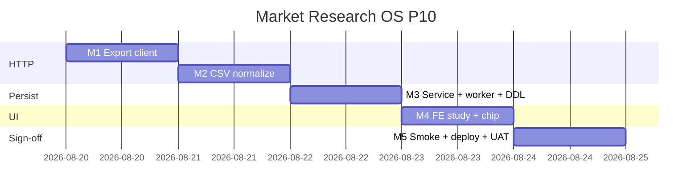

# Market Research OS — Kế hoạch coding P10 (Qualtrics live HTTP)

> **For agentic workers:** REQUIRED SUB-SKILL: Use `superpowers:subagent-driven-development` (recommended) hoặc `superpowers:executing-plans` để thực thi **từng milestone**. Mỗi M có exit criteria, unit spec, smoke script và trace UC/EC.
>
> **P11+ không nằm trong file này để code.** P0–P9 đã ship trên `main` (`afdce488`). Plan này chỉ P10 = RES-UC-062 live Qualtrics import.
>
> **Hướng đã khóa:** P10 = thay stub P6 (`runQualtrics` luôn `qualtrics_disabled`) bằng **Qualtrics Response Export API** (start → poll → download CSV zip), normalize wide CSV → **codebook drafts** (reuse `parseCodebookCsv` / BR-RES-02), persist **evidence + source** trên study `survey` — **không** `createInsight`. OpenAI embedding / RAG bật prod / conjoint / portal = **out**.

**Goal:** Khi PO bật `RESEARCH_QUALTRICS_ENABLED=1` + `QUALTRICS_API_KEY` + `QUALTRICS_DATACENTER` trên **staging**, Analyst chọn study `survey` có `instrument_version=SV_…`, bấm **Chạy Qualtrics** → job `research_qualtrics` export responses, tạo evidence `value+unit+base` (+ source `publisher=Qualtrics`, limitation), cập nhật `study.n`. Prod deploy **không** bật flag/key.

**Architecture:** Ba bước HTTP theo [Qualtrics Export API](https://www.qualtrics.com/support/integrations/api-integration/overview/): `POST /API/v3/surveys/{surveyId}/export-responses` (`format: csv`) → poll `GET …/export-responses/{progressId}` → `GET …/export-responses/{fileId}/file` (zip). TS `qualtrics-client.util.ts` tải + unzip; `qualtrics-to-codebook.util.ts` map wide CSV → synthetic codebook CSV rồi gọi `parseCodebookCsv`. Nest `runQualtrics` enqueue (clone SparkToro P9); Python worker mirror. Flag/key off → hành vi P6 bit-identical.

**Tech Stack:** NestJS `services/ptt-crm-api`, Python `ptt_crm` + `ptt_jobs`, Jest, pytest, bash smoke. HTTP: Node `fetch`; Python `urllib`. Unzip: Node `zlib`/`AdmZip` **không thêm** — dùng built-in hoặc parse zip bằng `yauzl` **chỉ nếu đã có dep**; ưu tiên **Python worker unzip** (`zipfile`) + TS test inject CSV string. Không Qualtrics SDK npm.

**Spec canonical:**
- Design [`../specs/2026-08-14-market-research-os-design.md`](../specs/2026-08-14-market-research-os-design.md) §10 G3e Quant (Qualtrics)
- SRS [`../../specs/2026-08-14-market-research-os-srs.md`](../../specs/2026-08-14-market-research-os-srs.md) RES-UC-062, BR-RES-02/06/08/11
- P6 stub [`./2026-08-14-market-research-os-p6.md`](./2026-08-14-market-research-os-p6.md) M5
- P9 pattern [`./2026-08-15-market-research-os-p9.md`](./2026-08-15-market-research-os-p9.md)
- Actions [`../../use-cases/actions/12-RES-ACTIONS.md`](../../use-cases/actions/12-RES-ACTIONS.md) P10 row
- Qualtrics vendor [`https://www.qualtrics.com/support/integrations/api-integration/overview/`](https://www.qualtrics.com/support/integrations/api-integration/overview/)

## Global Constraints

- Mọi BR P0–P9 vẫn binding: **BR-RES-01, 02, 03, 05, 06/08, 07, 09, 10, 11, 12, 13.**
- **BR-RES-06/08:** Qualtrics **chỉ** insert `crm_research_sources` + `crm_research_evidence`. **Cấm** `createInsight` / `createReport` / publish-portal.
- **BR-RES-02:** Mỗi evidence phải có `value_num` + `unit` + `value_base` hợp lệ (reuse `validateCreateEvidence`).
- **BR-RES-11:** Cell export có PII → **fail-closed** `survey_pii_forbidden` (0 evidence), giống codebook CSV.
- **G3e / Design:** **Không MOE / 95%** trên output Qualtrics — `QUALTRICS_LIMITATION_NOTE` bắt buộc trên source.
- Flag `RESEARCH_QUALTRICS_ENABLED` default `0`. Health `qualtrics_enabled` = flag **và** key — **không** trả key/datacenter.
- Flag/key off → `200 {ok:true, note:qualtrics_disabled}`; **không** HTTP Qualtrics.
- **Survey ID:** `study.instrument_version` phải match `/^SV_[A-Za-z0-9]+$/` khi live; thiếu/sai → 400 `qualtrics_survey_id_required`.
- **Column map:** POST body `{ study_id, column_map? }` — `column_map` optional; default đọc JSON từ `study.weighting_note` nếu có key `qualtrics_column_map`; không có map → 400 `qualtrics_map_required`.
- **Study:** `method === 'survey'`, thuộc project, trong scope.
- **Row cap:** reuse `MAX_DATA_ROWS = 500` từ codebook util.
- Deploy clone P9: **không** portal-web; **không** `RESEARCH_QUALTRICS_ENABLED=1` / **không** ghi `QUALTRICS_API_KEY` / `QUALTRICS_DATACENTER` trên prod.
- **Không regress** `JEST_WORKER_ID` skip `deploy/runtime.env`.
- Branch: `feat/market-research-os-p10`. Merge-base: `afdce488`.
- Commit chỉ khi user yêu cầu / SDD.

### Out of P10 (cấm làm trong plan này)

Qualtrics **import** responses (push vào Qualtrics), panel bake-off, ExpertReview LLM, MOE calculator, conjoint/simulator, RAG/copilot thay đổi, OpenAI embedding, portal, Talkwalker, Apify login, `xlsx`, bật Qualtrics prod, thay đổi flow **Nhập codebook CSV** (P6 giữ nguyên).

### Definition of Done (mọi task)

| # | Tiêu chí | Verify |
|---|----------|--------|
| 1 | User-visible | Staging flag on → evidence sau job; prod → disabled |
| 2 | Persisted | evidence_ids + source Qualtrics + `study.n` + `ai_runs.output_json` |
| 3 | Guarded | no insight; PII fail-closed; flag off = no HTTP |
| 4 | Tested | Jest + pytest + smoke P10 (live skip nếu key off) |

---

## 0. Milestone map (P10 = M1–M5)

| M | User outcome | UC | FR / NFR | Ước lượng |
|---|--------------|----|----------|-----------|
| **M1** | Export client + poll + download (injectable transport) | 062 | — | 0.5 ngày |
| **M2** | Wide CSV → codebook drafts + map contract | 062 | BR-02/11 | 0.5 ngày |
| **M3** | `runQualtrics` + job queue + worker + DDL `qualtrics` | 062 | BR-06/08 | 1 ngày |
| **M4** | FE `study_id` + job chip + types | 062 | UX Studies | 0.5 ngày |
| **M5** | Smoke + deploy P10 + UAT RES-UC-062 live | 062 | — | 0.5 ngày |

**P10 sign-off = smoke P10 PASS + UAT Actions P10 staging (retainer PO) + Jest/pytest xanh.**



---

## File map (khóa trước khi code)

| Tạo | Trách nhiệm |
|-----|-------------|
| `services/ptt-crm-api/src/market-research/qualtrics-client.util.ts` + spec | start/poll/download export |
| `services/ptt-crm-api/src/market-research/qualtrics-to-codebook.util.ts` + spec | wide CSV + map → codebook CSV |
| `services/ptt-crm-api/src/market-research/qualtrics-collect.ts` + spec | orchestrate client + map + parse |
| `ptt_crm/market_research/qualtrics_collect.py` + pytest | worker path mirror |
| `ptt_jobs/handlers/research_qualtrics.py` | job router |
| `docs/specs/2026-08-15-postgresql-ddl-market-research-p10.sql` | `job_type` + `qualtrics` |
| `scripts/fixtures/qualtrics-export.sample.csv` | Wide CSV 2 respondents × 1 Q |
| `scripts/fixtures/qualtrics-column-map.sample.json` | Map QID → question_code/unit/base |
| `scripts/smoke_market_research_p10*.sh` | m1–m5 |
| `scripts/deploy_market_research_p10_vps.sh` | Clone P9; **không** bật Qualtrics |

| Sửa | Việc |
|-----|------|
| `market-research.service.ts` + spec | `runQualtrics`, `persistQualtricsEvidence` |
| `market-research.controller.ts` | Body `{ study_id, column_map? }`, 202 when enqueued |
| `market-research.types.ts` | `RunQualtricsInput`, `RunQualtricsResult` |
| `job-queue.repository.ts` | `enqueueResearchQualtricsJob` |
| `ptt_worker/__main__.py` | route `research_qualtrics` |
| `market-research-api.ts` + `page.tsx` | POST body + chip |
| `12-RES-ACTIONS.md`, `RNOSAI-BA-RES-UseCases.md` | UAT P10 live |

**Không sửa:** `survey-codebook.util.ts` parser core (chỉ reuse), `qualtrics-stub.util.ts` show/hide logic.

---

## Shared types & env

```typescript
export const QUALTRICS_LIMITATION_NOTE =
  'Mẫu convenience Qualtrics — không MOE/95%. Không suy đại diện dân số.';

export const QUALTRICS_SURVEY_ID_RE = /^SV_[A-Za-z0-9]+$/;

export type QualtricsColumnMapEntry = {
  question_code: string;
  unit: string;
  value_base: string;
  period_note?: string;
  geography?: string;
};

export type RunQualtricsInput = {
  study_id: number;
  column_map?: Record<string, QualtricsColumnMapEntry>;
};

export type RunQualtricsResult =
  | { ok: true; note: 'qualtrics_disabled' }
  | { ok: true; run_id: number; status: 'pending' | 'succeeded' | 'failed'; evidence_ids?: number[] };
```

| Env | Default | Mô tả |
|-----|---------|--------|
| `RESEARCH_QUALTRICS_ENABLED` | `0` | Gate HTTP |
| `QUALTRICS_API_KEY` | `` | `X-API-TOKEN` header |
| `QUALTRICS_DATACENTER` | `` | e.g. `iad1`, `syd1` — base `https://{dc}.qualtrics.com` |
| `QUALTRICS_EXPORT_POLL_MS` | `3000` | Poll interval |
| `QUALTRICS_EXPORT_TIMEOUT_MS` | `120000` | Max wait export |

**Column map resolution (locked):**

1. `body.column_map` nếu có
2. else parse `study.weighting_note` JSON `{ "qualtrics_column_map": { "QID1": {…} } }`
3. else 400 `qualtrics_map_required`

**Wide CSV → codebook (locked):**

- Input CSV: header row; cột `ResponseId` (hoặc `responseId`) = respondent_id; cột map key = Qualtrics QID header
- Output rows: `respondent_id,question_code,value,unit,value_base,period_note,geography`
- Chỉ numeric cells; skip blank/non-numeric

---

## Milestone M1 — Qualtrics export client (RES-UC-062)

**Interfaces:**
- Produces: `fetchQualtricsExportCsv(input, transport?)` → `{ csvText: string; progress_id: string; file_id: string }`

### Task 1: Fixture + failing client spec

**Files:**
- Create: `scripts/fixtures/qualtrics-export.sample.csv`
- Create: `services/ptt-crm-api/src/market-research/qualtrics-client.util.spec.ts`
- Create: `services/ptt-crm-api/src/market-research/qualtrics-client.util.ts` (stub)

- [ ] **Step 1: Write fixture CSV**

```csv
ResponseId,QID1
RSP_001,42
RSP_002,55
```

- [ ] **Step 2: Failing test (injectable transport)**

```typescript
import { fetchQualtricsExportCsv } from './qualtrics-client.util';

it('fetchQualtricsExportCsv start poll download', async () => {
  const csv = 'ResponseId,QID1\nRSP_001,42\n';
  const transport = async (req: { method: string; url: string; body?: unknown }) => {
    if (req.url.includes('/export-responses') && req.method === 'POST') {
      return { status: 200, json: async () => ({ result: { progressId: 'ES_1' } }) };
    }
    if (req.url.includes('/export-responses/ES_1') && req.method === 'GET' && !req.url.endsWith('/file')) {
      return { status: 200, json: async () => ({ result: { status: 'complete', fileId: 'FILE_1' } }) };
    }
    if (req.url.endsWith('/file')) {
      return { status: 200, arrayBuffer: async () => new TextEncoder().encode(csv).buffer };
    }
    return { status: 404, json: async () => ({}) };
  };
  const out = await fetchQualtricsExportCsv(
    { surveyId: 'SV_test', apiKey: 'k', datacenter: 'iad1' },
    transport,
  );
  expect(out.csvText).toContain('RSP_001');
  expect(out.file_id).toBe('FILE_1');
});
```

- [ ] **Step 3: Run test — expect FAIL**

Run: `cd services/ptt-crm-api && npx jest src/market-research/qualtrics-client.util.spec.ts --verbose`

- [ ] **Step 4: Implement client**

```typescript
export async function fetchQualtricsExportCsv(
  input: { surveyId: string; apiKey: string; datacenter: string; pollMs?: number; timeoutMs?: number },
  transport: QualtricsTransport = defaultQualtricsTransport,
): Promise<{ csvText: string; progress_id: string; file_id: string }> {
  const base = `https://${input.datacenter}.qualtrics.com/API/v3/surveys/${encodeURIComponent(input.surveyId)}`;
  const headers = { 'X-API-TOKEN': input.apiKey, 'Content-Type': 'application/json' };
  const started = await transport({ method: 'POST', url: `${base}/export-responses`, headers, body: { format: 'csv' } });
  if (started.status < 200 || started.status >= 300) throw new Error(`qualtrics_export_start_${started.status}`);
  const startBody = (await started.json()) as Record<string, unknown>;
  const progressId = String((startBody.result as Record<string, unknown>)?.progressId ?? '').trim();
  if (!progressId) throw new Error('qualtrics_missing_progress_id');
  const deadline = Date.now() + (input.timeoutMs ?? 120_000);
  let fileId = '';
  while (Date.now() < deadline) {
    const prog = await transport({ method: 'GET', url: `${base}/export-responses/${progressId}`, headers: { 'X-API-TOKEN': input.apiKey } });
    const body = (await prog.json()) as Record<string, unknown>;
    const result = (body.result ?? {}) as Record<string, unknown>;
    if (result.status === 'complete') {
      fileId = String(result.fileId ?? '').trim();
      break;
    }
    if (result.status === 'failed') throw new Error('qualtrics_export_failed');
    await sleep(input.pollMs ?? 3000);
  }
  if (!fileId) throw new Error('qualtrics_export_timeout');
  const file = await transport({ method: 'GET', url: `${base}/export-responses/${fileId}/file`, headers: { 'X-API-TOKEN': input.apiKey }, binary: true });
  const buf = await file.arrayBuffer();
  const csvText = decodeQualtricsExportBytes(buf); // zip: first .csv entry; plain: utf8
  return { csvText, progress_id: progressId, file_id: fileId };
}
```

- [ ] **Step 5: Implement `decodeQualtricsExportBytes`** — detect ZIP magic `PK`; nếu zip dùng minimal unzip (Python worker path) hoặc TS: test inject trả plain CSV; production worker unzip.

- [ ] **Step 6: Run spec — PASS**

**M1 exit:** client spec green với inject transport.

---

## Milestone M2 — Wide CSV → codebook (RES-UC-062)

### Task 2: Map util TDD

**Files:**
- Create: `scripts/fixtures/qualtrics-column-map.sample.json`
- Create: `qualtrics-to-codebook.util.ts` + spec

- [ ] **Step 1: Fixture map**

```json
{
  "QID1": {
    "question_code": "Q1",
    "unit": "VND",
    "value_base": "mean",
    "period_note": "2026-Q1",
    "geography": "VN"
  }
}
```

- [ ] **Step 2: Failing test**

```typescript
import fs from 'node:fs';
import path from 'node:path';
import { wideCsvToCodebookCsv } from './qualtrics-to-codebook.util';

it('wideCsvToCodebookCsv emits codebook header and rows', () => {
  const root = path.join(__dirname, '../../../../scripts/fixtures');
  const csv = fs.readFileSync(path.join(root, 'qualtrics-export.sample.csv'), 'utf8');
  const map = JSON.parse(fs.readFileSync(path.join(root, 'qualtrics-column-map.sample.json'), 'utf8'));
  const out = wideCsvToCodebookCsv(csv, map);
  expect(out).toContain('respondent_id,question_code,value,unit,value_base');
  expect(out).toContain('RSP_001,Q1,42,VND,mean');
});
```

- [ ] **Step 3: Implement + wire `parseCodebookCsv` in collect**

```typescript
export function wideCsvToCodebookCsv(
  wideCsv: string,
  columnMap: Record<string, QualtricsColumnMapEntry>,
  defaults?: { period_note?: string; geography?: string },
): string {
  // parse header; for each data row, for each mapped column with finite Number(cell)
  // emit codebook rows; cap 500 data rows total
}
```

- [ ] **Step 4: `qualtrics-collect.ts`**

```typescript
export async function collectQualtrics(input: {
  surveyId: string;
  apiKey: string;
  datacenter: string;
  columnMap: Record<string, QualtricsColumnMapEntry>;
}): Promise<{ drafts: CodebookEvidenceDraft[]; progress_id: string; file_id: string }> {
  const exported = await fetchQualtricsExportCsv({ ...input });
  const codebookCsv = wideCsvToCodebookCsv(exported.csvText, input.columnMap);
  const drafts = parseCodebookCsv(codebookCsv);
  return { drafts, progress_id: exported.progress_id, file_id: exported.file_id };
}
```

- [ ] **Step 5: Jest M1+M2 — PASS**

**M2 exit:** end-to-end unit từ fixture CSV → drafts length ≥ 1.

---

## Milestone M3 — Service, worker, DDL (RES-UC-062)

### Task 3: DDL job_type qualtrics

**Files:**
- Create: `docs/specs/2026-08-15-postgresql-ddl-market-research-p10.sql`
- Create: `scripts/apply_pg_ddl_market_research_p10.sh`

- [ ] **Step 1: DDL idempotent (clone P5 pattern)**

```sql
-- P10: qualtrics job_type on crm_research_ai_runs
ALTER TABLE crm_research_ai_runs DROP CONSTRAINT IF EXISTS crm_research_ai_runs_type_chk;
ALTER TABLE crm_research_ai_runs ADD CONSTRAINT crm_research_ai_runs_type_chk CHECK (job_type IN (
  'desk','deep','triangulate','pulse','whisper_ingest','sparktoro','qualtrics'
));
INSERT INTO schema_migrations (version, note) VALUES ('2026-08-15-market-research-p10', 'P10 qualtrics job_type') ON CONFLICT DO NOTHING;
```

### Task 4: `runQualtrics` service

**Files:**
- Modify: `market-research.service.ts`, `market-research.controller.ts`, `market-research.types.ts`
- Modify: `job-queue.repository.ts`
- Create: `ptt_crm/market_research/qualtrics_collect.py`, `ptt_jobs/handlers/research_qualtrics.py`
- Modify: `ptt_worker/__main__.py`
- Modify: `market-research.service.spec.ts`

- [ ] **Step 1: Replace stub `runQualtrics`**

Logic (mirror `runSparktoro`):

```typescript
async runQualtrics(projectId, scope, input: RunQualtricsInput, actor): Promise<RunQualtricsResult> {
  if (!flag || !key || !datacenter) return { ok: true, note: 'qualtrics_disabled' };
  const study = await load study; validate method survey + instrument_version SV_*;
  const columnMap = resolveColumnMap(input, study);
  const run = await insertAiRun({ jobType: 'qualtrics', provider: 'qualtrics', ... });
  const job = await enqueueResearchQualtricsJob({ projectId, studyId, runId, columnMap, ... });
  if (job) return { ok: true, run_id: run.id, status: 'pending' };
  return persistQualtricsEvidence({ ... }); // jobs_disabled sync
}
```

- [ ] **Step 2: `persistQualtricsEvidence`** — reuse evidence loop từ `importSurvey` (extract private helper `persistCodebookDrafts`):

```typescript
private async persistCodebookDrafts(input: {
  projectId: number;
  study: ResearchStudy;
  drafts: CodebookEvidenceDraft[];
  publisher: 'Qualtrics' | 'Forms';
  limitationNote: string;
  actor: string;
  scope: ClientScopeContext;
}): Promise<{ source_id: number; evidence_ids: number[]; n: number }>
```

- [ ] **Step 3: Python worker** — `process_research_qualtrics_payload`: load study, call collect, insert evidence via repository helpers, `succeed_run` với `output_json: { evidence_ids, progress_id, file_id }`; error → `fail_run('qualtrics_failed')`.

- [ ] **Step 4: Update tests**

- Replace `flag and key on still returns qualtrics_disabled` → expects enqueue when flag+key+dc on
- Add `M3-1: jobs_disabled persist evidence; no createInsight`
- Add `M3-2: PII in export → fail run`
- Add `M3-3: missing SV_ instrument_version → 400`

Run: `cd services/ptt-crm-api && npx jest src/market-research/market-research.service.spec.ts -t qualtrics --verbose`
Run: `python3 -m pytest tests/test_research_qualtrics.py -q`

**M3 exit:** job path + sync path; no insight.

---

## Milestone M4 — FE study_id + job chip

### Task 5: ops-web wiring

**Files:**
- Modify: `services/ops-web/src/lib/market-research-api.ts`
- Modify: `services/ops-web/src/app/crm/research/[id]/page.tsx`
- Create: `services/ops-web/src/components/research/qualtrics-run.util.ts` + vitest (optional thin helper)

- [ ] **Step 1: API type**

```typescript
export async function runResearchQualtrics(
  token: string,
  projectId: number,
  body: { study_id: number },
): Promise<{ ok: true; note?: 'qualtrics_disabled'; run_id?: number; status?: string }>
```

- [ ] **Step 2: Studies tab — require `selectedStudyId` (survey) before enable button**

```typescript
disabled={saving || !selectedStudyId || qualtricsInFlight}
onClick={() => runResearchQualtrics(access, project.id, { study_id: selectedStudyId })}
```

- [ ] **Step 3: Add `qualtricsRunId` state + `ResearchJobChip kind="qualtrics"`** (extend chip kind union if needed)

- [ ] **Step 4: Vitest qualtrics button disabled without study**

**M4 exit:** FE gửi `study_id`; chip poll run.

---

## Milestone M5 — Smoke, deploy, UAT

### Task 6: Smoke scripts

**Files:**
- `scripts/smoke_market_research_p10.sh` + `p10_m1`…`p10_m5`

**p10_m1:** grep qualtrics-client exports  
**p10_m2:** jest qualtrics utils + pytest  
**p10_m3:** service qualtrics specs  
**p10_m4:** FE contract study_id + chip  
**p10_m5:** live skip if `qualtrics_enabled` false; else POST with token + study_id

### Task 7: Deploy

**Files:**
- `scripts/deploy_market_research_p10_vps.sh` — include P10 DDL in step 1; **không** bật Qualtrics env

### Task 8: Docs

- `12-RES-ACTIONS.md` — **Walkthrough UAT P10** (~15 phút)
- `RNOSAI-BA-RES-UseCases.md` — RES-UC-062/063 stub → live note
- Backlog P10+ → OpenAI embeddings P11

- [ ] **Step 1:** `bash scripts/smoke_market_research_p10.sh` OK locally

**M5 exit:** deploy script reviewed; UAT checklist written.

---

## Pre-ship checklist (PO / QA)

| # | Gate | Staging | Prod |
|---|------|---------|------|
| 1 | Health | `qualtrics_enabled=true` | `false` |
| 2 | Study | `instrument_version=SV_…` + map JSON | — |
| 3 | POST run-qualtrics | 202 → evidence ≥1 | 200 disabled |
| 4 | Insights | không tăng | — |
| 5 | Deploy | manual flag+dc+key | script **không** ghi secrets |

**Staging enable (manual):**

```bash
RESEARCH_QUALTRICS_ENABLED=1
QUALTRICS_API_KEY=<po-key>
QUALTRICS_DATACENTER=iad1   # PO datacenter
sudo systemctl restart ptt-crm-api ptt-worker
```

---

## Self-review (plan author)

**Spec coverage:**
- RES-UC-062 live import → M1–M5 ✓
- BR-RES-02 value/unit/base → reuse parseCodebookCsv ✓
- BR-RES-06/08 no insight → M3 ✓
- BR-RES-11 PII → parseCodebookCsv assertCodebookNoPii ✓
- P6 stub off path → flag off unchanged ✓
- No MOE → limitation note ✓

**Placeholder scan:** No TBD steps; map/survey ID rules locked.

**Type consistency:** `RunQualtricsInput.study_id` used FE → controller → service → worker payload.

**Risk notes:**

| Risk | Mitigation |
|------|------------|
| Qualtrics CSV zip format | Worker unzip; TS tests inject plain CSV |
| Wide vs labeled export | Locked column_map; no auto-guess all columns |
| Export timeout large survey | 120s timeout; row cap 500 |
| Accidental prod enable | Deploy ban; smoke asserts false |

---

## Execution handoff

Plan saved to `docs/superpowers/plans/2026-08-15-market-research-os-p10.md`.

**Two execution options:**

1. **Subagent-Driven (recommended)** — fresh subagent per milestone M1–M5, review between steps
2. **Inline Execution** — implement in this session with executing-plans checkpoints

**Which approach?**
