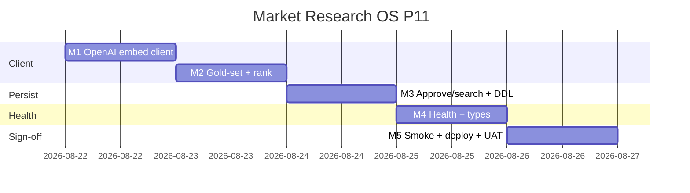

# Market Research OS — Kế hoạch coding P11 (OpenAI embeddings)

> **For agentic workers:** REQUIRED SUB-SKILL: Use `superpowers:subagent-driven-development` (recommended) hoặc `superpowers:executing-plans` để thực thi **từng milestone**. Mỗi M có exit criteria, unit spec, smoke script và trace UC/EC.
>
> **P12+ không nằm trong file này để code.** P0–P10 đã ship trên `main` (`534d914e`). Plan này chỉ P11 = RES-UC-070 semantic embed (OpenAI) — optional, staging.
>
> **Hướng đã khóa:** P11 = thay **local hash 64-d** (`embedInsightText` → `embedPlaybookText`) bằng **OpenAI Embeddings API** khi PO bật flag riêng + `OPENAI_API_KEY`. Giữ JSONB + cosine in-process (P7). Search / copilot **không đổi contract**. Flag/key off → hành vi P7 **bit-identical**. **Không** `pgvector`. **Không** portal RAG. **Không** bật RAG/embed trên prod deploy.

**Goal:** Khi PO bật `RESEARCH_RAG_ENABLED=1` + `RESEARCH_RAG_OPENAI_EMBED_ENABLED=1` + `OPENAI_API_KEY` trên **staging**, duyệt insight lên `approved_client_facing`/`published` ghi vector OpenAI; `GET …/insights/search?q=` paraphrase gold-set **G3** hit đúng id (hash local miss). Prod deploy **không** bật flag embed.

**Architecture:** Client HTTP injectable `POST https://api.openai.com/v1/embeddings` (`text-embedding-3-small`, `dimensions: 256`). `resolveInsightEmbedding(text)` = OpenAI nếu flag+key, else hash 64-d. `rankRagHits` nhận `queryVec` optional — có thì dùng, không thì `embedInsightText(query)` (P7 tests không đổi). Hàng embedding lệch chiều bị **bỏ** (không crash). Approve vẫn 200 nếu OpenAI fail (skip upsert, giống PII skip).

**Tech Stack:** NestJS `services/ptt-crm-api`, Jest, bash smoke. HTTP: Node `fetch`. **Không** thêm npm OpenAI SDK. **Không** Python worker (embed đồng bộ trên Nest approve/search, clone P7). Tái `cosineSimilarity` / `keywordScore` playbooks.

**Spec canonical:**
- Design [`../specs/2026-08-14-market-research-os-design.md`](../specs/2026-08-14-market-research-os-design.md) §10 G10 RAG
- SRS / BA [`../../specs/modules/RNOSAI-BA-RES-UseCases.md`](../../specs/modules/RNOSAI-BA-RES-UseCases.md) RES-UC-070 / 072
- P7 local hash [`./2026-08-14-market-research-os-p7.md`](./2026-08-14-market-research-os-p7.md)
- P8 copilot inject [`./2026-08-15-market-research-os-p8.md`](./2026-08-15-market-research-os-p8.md)
- Actions [`../../use-cases/actions/12-RES-ACTIONS.md`](../../use-cases/actions/12-RES-ACTIONS.md) P8+ / P11 row
- Vendor [OpenAI Embeddings](https://platform.openai.com/docs/api-reference/embeddings)

## Global Constraints

- Mọi BR P0–P10 vẫn binding: **BR-RES-01, 02, 03, 05, 06/08, 07, 09, 10, 11, 12, 13.**
- **BR-RES-06/08:** Search / re-embed **cấm** `createInsight`. Copilot vẫn đúng 1 draft (P8 không đổi).
- **BR-RES-11:** `shouldSkipRagEmbed` trước mọi HTTP OpenAI — PII / rỗng → 0 request vendor.
- **BR-RES-12:** Cross-tenant search 403 không `statement` (P7 giữ).
- **DPA:** Statement/observation **chỉ** gửi OpenAI khi `RESEARCH_RAG_OPENAI_EMBED_ENABLED=1` **và** key. Flag off = in-process hash, **không** HTTP.
- Flag `RESEARCH_RAG_OPENAI_EMBED_ENABLED` default `0`. Health `rag_openai_embed_enabled` = flag **và** `OPENAI_API_KEY` — **không** trả key/model secret.
- `rag_enabled` **không đổi** (vẫn = `RESEARCH_RAG_ENABLED` only). Search flag off → `{hits:[], note:rag_disabled}` trước embed.
- Flag/key embed off → `embedInsightText` hash 64-d; `rankRagHits` sync như P7; **0** HTTP OpenAI.
- **Model khóa:** `text-embedding-3-small` + `dimensions: 256` (`OPENAI_EMBED_DIMS` default 256, min 64 max 1536).
- **Dim mismatch:** `embedding.length !== queryVec.length` → skip row (corpus hash cũ không crash khi query OpenAI).
- **Approve + OpenAI fail:** skip upsert; insight đã duyệt vẫn 200. Search + query-embed fail → `{hits:[], note:'rag_embed_failed'}` — không 500.
- Deploy clone P10: **không** portal-web; **không** ghi `RESEARCH_RAG_ENABLED=1` / `RESEARCH_RAG_OPENAI_EMBED_ENABLED=1`.
- **Không regress** `JEST_WORKER_ID` skip `deploy/runtime.env`.
- Branch: `feat/market-research-os-p11`. Merge-base: `534d914e`.
- Commit chỉ khi user yêu cầu / SDD.

### Out of P11 (cấm làm trong plan này)

`CREATE EXTENSION vector` / pgvector, đổi score formula, đổi copilot prompt/banner, portal RAG, conjoint/simulator, cluster quý, Talkwalker, Qualtrics/SparkToro thay đổi, backfill job queue (`research_rag_reembed`), Gemini embed, bật RAG/embed prod, gửi `interpretation` / excerpt / transcript lên vendor.

### Definition of Done (mọi task)

| # | Tiêu chí | Verify |
|---|----------|--------|
| 1 | User-visible | Staging flag on → search G3 hit; prod `rag_openai_embed_enabled=false` |
| 2 | Persisted | `embedding` JSONB 256-d + `embed_model` + `embed_dims` sau approve |
| 3 | Guarded | PII 0 HTTP; flag off = hash; no createInsight; dim mismatch skip |
| 4 | Tested | Jest client + gold-set G1–G3 + service approve/search + smoke P11 |

---

## 0. Milestone map (P11 = M1–M5)

| M | User outcome | UC | FR / NFR | Ước lượng |
|---|--------------|----|----------|-----------|
| **M1** | Embed client injectable + L2-normalize | 070 | DPA | 0.5 ngày |
| **M2** | Gold-set G3 + `rankRagHits` `queryVec` + skip dim | 070 | NFR-AI-04 | 0.5 ngày |
| **M3** | Approve/search wire + DDL model/dims | 070 | BR-11 | 1 ngày |
| **M4** | Health `rag_openai_embed_enabled` + FE type | 070 | — | 0.5 ngày |
| **M5** | Smoke + deploy P11 + UAT | 070 | — | 0.5 ngày |

**P11 sign-off = smoke P11 PASS + UAT Actions P11 staging (PO DPA) + Jest xanh.**



---

## File map (khóa trước khi code)

| Tạo | Trách nhiệm |
|-----|-------------|
| `services/ptt-crm-api/src/market-research/openai-embed.util.ts` + spec | `POST /v1/embeddings`, L2-normalize, injectable transport |
| `docs/specs/2026-08-15-postgresql-ddl-market-research-p11.sql` | `embed_model`, `embed_dims` trên `crm_research_insight_embeddings` |
| `scripts/apply_pg_ddl_market_research_p11.sh` | Apply DDL P11 |
| `scripts/fixtures/research-rag-goldset.json` | Thêm case **G3** paraphrase |
| `scripts/smoke_market_research_p11*.sh` | m1–m5 |
| `scripts/deploy_market_research_p11_vps.sh` | Clone P10; **không** bật RAG/embed |

| Sửa | Việc |
|-----|------|
| `research-rag.util.ts` + spec | `rankRagHits` nhận `queryVec?`; skip dim mismatch |
| `market-research.service.ts` + spec | `resolveInsightEmbedding`; approve/search async |
| `market-research.repository.ts` | upsert ghi `embed_model`, `embed_dims` |
| `market-research.types.ts` | `OPENAI_EMBED_DIMS`, `RagEmbeddingMeta` |
| `app-config.service.ts` | `researchRagOpenaiEmbedEnabled` |
| `market-research-api.ts` | health type `rag_openai_embed_enabled` |
| `12-RES-ACTIONS.md`, `RNOSAI-BA-RES-UseCases.md` | UAT P11; UC-070 «OpenAI optional staging» |

**Không sửa:** `embedPlaybookText` / playbooks cosine, copilot prompt (`buildInsightCopilotPrompt`), FE search banner P7, Qualtrics/SparkToro.

---

## Shared types & env

```typescript
export const OPENAI_EMBED_MODEL = 'text-embedding-3-small';
export const OPENAI_EMBED_DIMS = 256;
export const OPENAI_EMBED_URL = 'https://api.openai.com/v1/embeddings';

export type InsightEmbedResult = {
  embedding: number[];
  model: 'local-hash' | typeof OPENAI_EMBED_MODEL;
  dims: number;
};

export type OpenAIEmbedTransport = (input: {
  method: 'POST';
  url: string;
  headers: Record<string, string>;
  body: unknown;
}) => Promise<{ status: number; json: () => Promise<unknown> }>;
```

| Env | Default | Mô tả |
|-----|---------|--------|
| `RESEARCH_RAG_ENABLED` | `0` | Gate search/copilot RAG (P7/P8 — **không đổi**) |
| `RESEARCH_RAG_OPENAI_EMBED_ENABLED` | `0` | Gate HTTP embeddings |
| `OPENAI_API_KEY` | `` | Bearer — tái Whisper/deep; **không** key riêng |
| `OPENAI_EMBED_MODEL` | `text-embedding-3-small` | Override test only |
| `OPENAI_EMBED_DIMS` | `256` | `dimensions` API; clamp 64–1536 |

**Resolve embed (locked):**

1. `shouldSkipRagEmbed(text)` → caller không gọi client
2. `researchRagOpenaiEmbedEnabled && apiKey` → `fetchOpenAIEmbedding`
3. else → `{ embedding: embedInsightText(text), model: 'local-hash', dims: 64 }`

**Health (locked):**

```typescript
rag_enabled: Boolean(researchRagEnabled)           // P7
rag_openai_embed_enabled: Boolean(embedFlag && openaiKey)
// không trả OPENAI_API_KEY / model string nếu muốn tối giản — được phép trả
// rag_embed_model: 'openai' | 'local' (không secret)
```

Khóa: payload **được** có `rag_embed_model: 'openai' | 'local'`; **cấm** key.

---

## Milestone M1 — OpenAI embed client (RES-UC-070)

**Interfaces:**
- Produces: `fetchOpenAIEmbedding(input, transport?)` → `InsightEmbedResult`
- Produces: `l2Normalize(vec: number[]): number[]`

### Task 1: Failing client spec + util

**Files:**
- Create: `services/ptt-crm-api/src/market-research/openai-embed.util.ts`
- Create: `services/ptt-crm-api/src/market-research/openai-embed.util.spec.ts`

- [ ] **Step 1: Failing test (injectable transport)**

```typescript
import { fetchOpenAIEmbedding, l2Normalize } from './openai-embed.util';

it('fetchOpenAIEmbedding posts model+input and L2-normalizes', async () => {
  const transport = async () => ({
    status: 200,
    json: async () => ({ data: [{ embedding: [3, 4, 0] }] }),
  });
  const out = await fetchOpenAIEmbedding(
    { text: 'Giá sữa học đường', apiKey: 'sk-test', dims: 3 },
    transport,
  );
  expect(out.dims).toBe(3);
  expect(out.model).toBe('text-embedding-3-small');
  expect(out.embedding[0]).toBeCloseTo(0.6);
  expect(out.embedding[1]).toBeCloseTo(0.8);
});

it('HTTP 401 throws openai_embed_failed', async () => {
  await expect(
    fetchOpenAIEmbedding(
      { text: 'x', apiKey: 'bad' },
      async () => ({ status: 401, json: async () => ({}) }),
    ),
  ).rejects.toMatchObject({ code: 'openai_embed_failed' });
});
```

- [ ] **Step 2: Run — FAIL (module missing)**

Run: `cd services/ptt-crm-api && npx jest src/market-research/openai-embed.util.spec.ts --verbose`

- [ ] **Step 3: Minimal client**

```typescript
export async function fetchOpenAIEmbedding(
  input: { text: string; apiKey: string; model?: string; dims?: number },
  transport: OpenAIEmbedTransport = defaultTransport,
): Promise<InsightEmbedResult> {
  const model = input.model ?? OPENAI_EMBED_MODEL;
  const dims = input.dims ?? OPENAI_EMBED_DIMS;
  const res = await transport({
    method: 'POST',
    url: OPENAI_EMBED_URL,
    headers: {
      Authorization: `Bearer ${input.apiKey}`,
      'Content-Type': 'application/json',
    },
    body: { model, input: input.text, dimensions: dims },
  });
  if (res.status < 200 || res.status >= 300) {
    throw Object.assign(new Error('openai_embed_failed'), { code: 'openai_embed_failed' });
  }
  const body = (await res.json()) as { data?: Array<{ embedding?: number[] }> };
  const raw = body.data?.[0]?.embedding;
  if (!Array.isArray(raw) || raw.length === 0) {
    throw Object.assign(new Error('openai_embed_failed'), { code: 'openai_embed_failed' });
  }
  return { embedding: l2Normalize(raw), model: OPENAI_EMBED_MODEL, dims: raw.length };
}
```

`defaultTransport` = `fetch` + `res.json`. **Không** log `Authorization`.

- [ ] **Step 4: Jest M1 — PASS**

**M1 exit:** client + 401 coded; không gọi mạng thật.

---

## Milestone M2 — Gold-set G3 + rank queryVec (RES-UC-070)

**Files:**
- Modify: `scripts/fixtures/research-rag-goldset.json`
- Modify: `research-rag.util.ts` + `research-rag.util.spec.ts`

- [ ] **Step 1: Add G3 paraphrase (hash miss / OpenAI hit)**

```json
{
  "id": "G3",
  "q": "học sinh uống sữa đắt hơn ở thủ đô",
  "corpus": [
    {
      "insight_id": 10,
      "status": "approved_client_facing",
      "statement": "Giá sữa học đường tăng tại Hà Nội",
      "observation": null
    }
  ],
  "must_include": [10],
  "must_exclude": [],
  "needs_openai_query_vec": true
}
```

G1/G2 **không đổi** — runner hiện tại vẫn PASS với hash.

- [ ] **Step 2: Extend `rankRagHits`**

```typescript
export function rankRagHits(
  query: string,
  rows: Array<RagEmbedInput & { project_id: number; embedding: number[]; theme_codes: string[]; theme_synonyms?: string[] }>,
  opts?: { theme_code?: string; limit?: number; minScore?: number; queryVec?: number[] },
): RagHit[] {
  const queryVec = opts?.queryVec ?? embedInsightText(query);
  // existing loop; ADD:
  // if (row.embedding.length !== queryVec.length) continue;
}
```

- [ ] **Step 3: Spec**

```typescript
it('skips rows whose embedding length differs from queryVec', () => {
  const hits = rankRagHits('giá', [
    { insight_id: 1, project_id: 9, status: 'published', statement: 'Giá sữa', observation: null, embedding: [1, 0], theme_codes: [] },
  ], { queryVec: [1, 0, 0], minScore: 0 });
  expect(hits).toEqual([]);
});

it('G3 with injected queryVec includes insight 10', () => {
  const statement = 'Giá sữa học đường tăng tại Hà Nội';
  const vec = embedInsightText(statement); // same space → score high
  const hits = rankRagHits('học sinh uống sữa đắt hơn ở thủ đô', [
    { insight_id: 10, project_id: 9, status: 'approved_client_facing', statement, observation: null, embedding: vec, theme_codes: [] },
  ], { queryVec: vec, minScore: 0.12 });
  expect(hits.map((h) => h.insight_id)).toContain(10);
});
```

G3 **không** bắt hash(`q`) phải hit — chỉ bắt khi `queryVec` cùng không gian với stored vec.

- [ ] **Step 4: Jest `research-rag.util.spec.ts` — PASS** (G1/G2 regress + G3 + dim skip)

**M2 exit:** P7 gold-set còn xanh; dim mismatch an toàn.

---

## Milestone M3 — Service + DDL (RES-UC-070)

### Task 3: DDL

**Files:**
- Create: `docs/specs/2026-08-15-postgresql-ddl-market-research-p11.sql`
- Create: `scripts/apply_pg_ddl_market_research_p11.sh`

```sql
ALTER TABLE crm_research_insight_embeddings
  ADD COLUMN IF NOT EXISTS embed_model TEXT NOT NULL DEFAULT 'local-hash';
ALTER TABLE crm_research_insight_embeddings
  ADD COLUMN IF NOT EXISTS embed_dims INT NOT NULL DEFAULT 64;

INSERT INTO schema_migrations (version, description) VALUES
  ('2026-08-15-market-research-p11', 'P11 embed_model + embed_dims on insight embeddings')
ON CONFLICT (version) DO NOTHING;
```

### Task 4: `resolveInsightEmbedding` + wire

**Files:**
- Modify: `app-config.service.ts` — `researchRagOpenaiEmbedEnabled`
- Modify: `market-research.service.ts` + spec
- Modify: `market-research.repository.ts` — upsert columns
- Modify: `market-research.types.ts` — `UpsertInsightEmbeddingInput`

```typescript
private openaiEmbedLive(): boolean {
  const key = (process.env.OPENAI_API_KEY ?? process.env.OPENAI_KEY ?? '').trim();
  return Boolean(this.config.researchRagOpenaiEmbedEnabled && key);
}

private async resolveInsightEmbedding(text: string): Promise<InsightEmbedResult> {
  if (!this.openaiEmbedLive()) {
    return { embedding: embedInsightText(text), model: 'local-hash', dims: RAG_EMBED_DIMS };
  }
  const key = (process.env.OPENAI_API_KEY ?? process.env.OPENAI_KEY ?? '').trim();
  return fetchOpenAIEmbedding({ text, apiKey: key });
}
```

`approveInsight` (corpus target, sau `shouldSkipRagEmbed`):

```typescript
try {
  const resolved = await this.resolveInsightEmbedding(embedText);
  await this.repo.upsertInsightEmbedding({
    insight_id: updated.id,
    project_id: updated.project_id,
    embedding: resolved.embedding,
    embed_text: embedText,
    embed_model: resolved.model,
    embed_dims: resolved.dims,
  });
} catch {
  // skip upsert — approve already committed
}
```

`searchInsights` (sau `listEmbeddings`):

```typescript
let queryVec: number[] | undefined;
if (this.openaiEmbedLive()) {
  try {
    queryVec = (await this.resolveInsightEmbedding(q)).embedding;
  } catch {
    return { hits: [], note: 'rag_embed_failed' };
  }
}
return { hits: rankRagHits(q, rows, { theme_code: themeCode, limit, queryVec }) };
```

- [ ] **Step 1: Tests**

- `flag embed off: approve upserts 64-d local-hash; fetchOpenAIEmbedding not called`
- `flag+key on: approve upserts 256-d + model openai; no createInsight`
- `PII statement: 0 HTTP; no upsert; approve 200`
- `search flag off: rag_disabled; 0 HTTP`
- `search embed on + transport 500: {hits:[], note:rag_embed_failed}`
- `search embed on + matching queryVec: G3 id in hits`

Mock `fetchOpenAIEmbedding` trong service spec (jest.mock util).

Run: `cd services/ptt-crm-api && npx jest src/market-research/market-research.service.spec.ts -t "embed\\|rag_embed\\|openai" --verbose`

**M3 exit:** dual-path; approve không fail vì vendor; search fail-closed.

---

## Milestone M4 — Health + FE type

**Files:**
- Modify: `market-research.service.ts` `health()`
- Modify: `market-research.service.spec.ts` health cases
- Modify: `services/ops-web/src/lib/market-research-api.ts` health type

```typescript
health() {
  const openaiKey = (process.env.OPENAI_API_KEY ?? process.env.OPENAI_KEY ?? '').trim();
  return {
    // … existing
    rag_enabled: Boolean(this.config.researchRagEnabled),
    rag_openai_embed_enabled: Boolean(this.config.researchRagOpenaiEmbedEnabled && openaiKey),
    rag_embed_model: this.config.researchRagOpenaiEmbedEnabled && openaiKey ? 'openai' : 'local',
  };
}
```

- [ ] **Step 1:** `rag_openai_embed_enabled` false khi flag on nhưng key rỗng
- [ ] **Step 2:** true chỉ khi flag+key; JSON **không** chứa `sk-` / `OPENAI_API_KEY`
- [ ] **Step 3:** FE type thêm 2 field — **không** đổi UI search/copilot (P7/P8 đủ)

**M4 exit:** health contract; FE compile.

---

## Milestone M5 — Smoke, deploy, UAT

### Task 6: Smoke

**Files:** `scripts/smoke_market_research_p11.sh` + `p11_m1`…`p11_m5`

- **p11_m1:** grep `fetchOpenAIEmbedding` + jest client
- **p11_m2:** jest `research-rag.util.spec` + gold-set G1–G3
- **p11_m3:** service specs embed/search
- **p11_m4:** health type + `rag_openai_embed_enabled` in api.ts
- **p11_m5:** live skip nếu `rag_openai_embed_enabled` false; else GET search G3 (token + staging)

### Task 7: Deploy

**Files:** `scripts/deploy_market_research_p11_vps.sh` — clone P10; thêm `apply_pg_ddl_market_research_p11.sh` sau P10; **không** ghi `RESEARCH_RAG_*` / không đụng `OPENAI_API_KEY`.

### Task 8: Docs

- `12-RES-ACTIONS.md` — **Walkthrough UAT P11** (~10 phút)
- `RNOSAI-BA-RES-UseCases.md` RES-UC-070: đổi «không OpenAI embeddings» → «OpenAI optional khi `rag_openai_embed_enabled`; default local-hash»
- Backlog P12+ → portal RAG / conjoint

**UAT P11 (staging):**

| # | Actor | Thao tác | Kỳ vọng |
|---|-------|----------|---------|
| 1 | PO | Set 3 env + restart api | health `rag_enabled=true`, `rag_openai_embed_enabled=true`, `rag_embed_model=openai` |
| 2 | AN | Approve insight corpus (không PII) | embedding `dims=256`, `embed_model=text-embedding-3-small` |
| 3 | AN | Search paraphrase G3 | hit đúng `insight_id`; không draft |
| 4 | AN | Statement có SĐT | approve 200; **không** dòng embedding mới |
| 5 | QA | Prod sau deploy | `rag_openai_embed_enabled=false` |

**Staging enable (manual, sau DPA PO):**

```bash
RESEARCH_RAG_ENABLED=1
RESEARCH_RAG_OPENAI_EMBED_ENABLED=1
# OPENAI_API_KEY đã có nếu Whisper/deep bật — không tạo key mới trừ khi thiếu
sudo systemctl restart ptt-crm-api
```

Insight đã embed hash 64-d **không** hit query 256-d cho đến khi approve lại (dim skip). P11 **không** backfill — ghi rõ trong UAT.

- [ ] **Step 1:** `bash scripts/smoke_market_research_p11.sh` OK locally

**M5 exit:** deploy reviewed; UAT checklist written.

---

## Pre-ship checklist (PO / QA)

| # | Gate | Staging | Prod |
|---|------|---------|------|
| 1 | Health | `rag_openai_embed_enabled=true` | `false` |
| 2 | DPA | PO xác nhận gửi statement → OpenAI | — |
| 3 | Approve + search G3 | hit ≥1 | — |
| 4 | PII | 0 HTTP embed | — |
| 5 | Deploy | manual flags | script **không** ghi flags |

---

## Self-review (plan author)

**Spec coverage:**
- RES-UC-070 semantic → M1–M5 ✓
- Gold-set G1/G2 regress + G3 ✓
- BR-RES-06/08 no insight từ search ✓
- BR-RES-11 PII skip HTTP ✓
- P7 flag-off path bit-identical ✓
- P8 copilot không đụng — hưởng queryVec gián tiếp qua `searchInsights` ✓
- No pgvector / portal ✓

**Placeholder scan:** No TBD steps; model/dims/fail-closed locked.

**Type consistency:** `InsightEmbedResult` dùng client → resolve → upsert → rank `queryVec`.

**Risk notes:**

| Risk | Mitigation |
|------|------------|
| Hash 64 vs OpenAI 256 mixed corpus | Skip dim mismatch; UAT re-approve |
| OpenAI outage lúc approve | Skip upsert; insight vẫn duyệt |
| Accidental prod enable | Deploy ban cả hai RAG flags |
| Statement leak in logs | Cấm log body/Authorization |
| Jest đọc runtime.env | Không đụng `JEST_WORKER_ID` |

---

## Execution handoff

Plan saved to `docs/superpowers/plans/2026-08-15-market-research-os-p11.md`.

**Two execution options:**

1. **Subagent-Driven (recommended)** — fresh subagent per milestone M1–M5, review between steps
2. **Inline Execution** — implement in this session with executing-plans checkpoints

**Which approach?**
