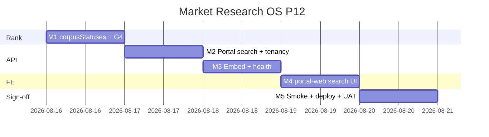

# Market Research OS — Kế hoạch coding P12 (Portal RAG)

> **For agentic workers:** REQUIRED SUB-SKILL: Use `superpowers:subagent-driven-development` (recommended) hoặc `superpowers:executing-plans` để thực thi **từng milestone**. Mỗi M có exit criteria, unit spec, smoke script và trace UC/EC. Steps dùng checkbox (`- [ ]`).
>
> **P13+ không nằm trong file này để code.** P0–P11 đã ship trên `main` (`337a64b0`). Plan này chỉ P12 = RES-UC-073 portal search insight **published** cùng `client_id` JWT.
>
> **Hướng đã khóa:** P12 = **Portal RAG** — khách portal tìm insight `published` của **đúng** `user.client_id`. Tái `rankRagHits` + `resolveInsightEmbedding` (P7/P11). Corpus portal **chặt hơn staff**: chỉ `published` (không `approved_client_facing`, không draft). Flag `RESEARCH_RAG_ENABLED` **không đổi**. Deploy **có** rebuild `portal-web` (khác P8–P11). **Không** conjoint / simulator / cluster quý / Talkwalker / pgvector / backfill re-embed. **Không** bật RAG trên prod deploy.

**Goal:** Khách portal (JWT) trên staging khi `RESEARCH_RAG_ENABLED=1` gõ paraphrase → hit insight `published` cùng tenant; draft / `approved_client_facing` / client khác **không** hit; flag off → `{hits:[], note:rag_disabled}`; prod `rag_enabled=false`.

**Architecture:** `GET /api/v1/portal/research/insights/search?q=&theme_code=&limit=` dưới `PortalJwtGuard` + `MarketResearchEnabledGuard`. `client_id` **luôn** từ JWT — bỏ qua query `client_id` nếu có. `PortalResearchRepository.listPublishedEmbeddings(clientId)` SQL riêng (AND `i.status = 'published'`). Rank in-process. Embed query: cùng rule P11 (`openaiEmbedLive` → OpenAI 256-d, else hash 64-d). Dim mismatch skip. PII query + OpenAI live → `{hits:[], note:rag_skipped_pii}` (0 HTTP vendor). FE: ô tìm trên `/research` — **không** link `/crm/research`.

**Tech Stack:** NestJS `portal-research`, Jest, Next.js `portal-web`, bash smoke. Tái `rankRagHits` / `fetchOpenAIEmbedding` / `embedInsightText`. **Không** npm mới. **Không** DDL (bảng embeddings P7/P11 đủ).

**Spec canonical:**
- Design [`../specs/2026-08-14-market-research-os-design.md`](../specs/2026-08-14-market-research-os-design.md) §10 G10 Learn + P3 portal
- SRS / BA [`../../specs/modules/RNOSAI-BA-RES-UseCases.md`](../../specs/modules/RNOSAI-BA-RES-UseCases.md) RES-UC-040 · 070 · **073 (mới)**
- P3 portal reports [`./2026-08-14-market-research-os-p3.md`](./2026-08-14-market-research-os-p3.md)
- P7 staff RAG [`./2026-08-14-market-research-os-p7.md`](./2026-08-14-market-research-os-p7.md)
- P11 OpenAI embed [`./2026-08-15-market-research-os-p11.md`](./2026-08-15-market-research-os-p11.md)
- Actions [`../../use-cases/actions/12-RES-ACTIONS.md`](../../use-cases/actions/12-RES-ACTIONS.md)

## Global Constraints

- Mọi BR P0–P11 vẫn binding: **BR-RES-01, 02, 03, 05, 06/08, 07, 09, 10, 11, 12, 13.**
- **BR-RES-06/08:** Portal search **cấm** `createInsight` / `createReport` / `publish-portal`.
- **BR-RES-11:** `shouldSkipRagEmbed(q)` trước HTTP OpenAI trên portal search.
- **BR-RES-12:** Cross-tenant 403 `{error:forbidden}` **không** `statement` / `title`.
- Portal corpus = `published` only. Staff search P7 (`approved_client_facing` | `published`) **không đổi**.
- `RESEARCH_RAG_ENABLED` default `0`. Portal health `rag_enabled` = flag only. **Không** flag portal riêng.
- `RESEARCH_RAG_OPENAI_EMBED_ENABLED` + key: cùng P11; flag off = hash 64-d, 0 HTTP.
- Approve / staff search / copilot **không sửa** trừ extract helper nếu cần — hành vi P11 bit-identical.
- Deploy clone P4 portal path: rebuild `portal-web`. **Không** ghi `RESEARCH_RAG_*` / `OPENAI_API_KEY`.
- **Không regress** `JEST_WORKER_ID` skip `deploy/runtime.env`.
- Branch: `feat/market-research-os-p12`. Merge-base: `337a64b0`.
- Commit chỉ khi user yêu cầu / SDD.

### Out of P12 (cấm làm trong plan này)

Conjoint / market simulator / MOE, cluster theme theo quý, Talkwalker/Dovetail, `CREATE EXTENSION vector` / pgvector, backfill `research_rag_reembed`, đổi staff search/copilot banner, Qualtrics/SparkToro, portal publish flow, insight `approved_client_facing` lên portal, gửi `observation` / excerpt / transcript lên vendor, bật RAG prod.

### Definition of Done (mọi task)

| # | Tiêu chí | Verify |
|---|----------|--------|
| 1 | User-visible | Staging flag on → portal search G4 hit published; prod `rag_enabled=false` |
| 2 | Tenancy | JWT client A không thấy statement client B; 403 không leak |
| 3 | Guarded | Draft / `approved_client_facing` no hit; PII + OpenAI = 0 HTTP; no createInsight |
| 4 | Tested | Jest portal service + gold-set G4 + portal-web type + smoke P12 |

---

## 0. Milestone map (P12 = M1–M5)

| M | User outcome | UC | FR / NFR | Ước lượng |
|---|--------------|----|----------|-----------|
| **M1** | `rankRagHits` `corpusStatuses` + gold-set G4 | 073 | NFR-AI-04 | 0.5 ngày |
| **M2** | Portal search API + tenancy + published-only | 073 | BR-12 | 1 ngày |
| **M3** | Embed/PII wire + portal health | 073 | BR-11 | 0.5 ngày |
| **M4** | portal-web ô tìm trên `/research` | 073 | FR-INT-04 | 1 ngày |
| **M5** | Smoke + deploy (kèm portal-web) + UAT | 073 | — | 0.5 ngày |

**P12 sign-off = smoke P12 PASS + UAT Actions P12 staging + Jest xanh + portal-web tsc.**



---

## File map (khóa trước khi code)

| Tạo | Trách nhiệm |
|-----|-------------|
| `scripts/fixtures/research-rag-goldset.json` | Thêm case **G4** (published-only) |
| `scripts/smoke_market_research_p12*.sh` | m1–m5 |
| `scripts/deploy_market_research_p12_vps.sh` | Clone P11 + **rebuild portal-web**; không bật RAG |
| `services/portal-web/src/components/PortalResearchRagSearch.tsx` | Ô tìm + banner |
| `services/portal-web/src/lib/portal-research-rag.util.ts` + spec | `shouldShowPortalRagSearch`, banner |

| Sửa | Việc |
|-----|------|
| `research-rag.util.ts` + spec | `opts.corpusStatuses?`; default P7 không đổi |
| `portal-research.repository.ts` + spec | `listPublishedEmbeddings(clientId, theme_code?)` |
| `portal-research.service.ts` + spec | `searchInsights`, `health` |
| `portal-research.controller.ts` | `GET insights/search`, `GET health` |
| `portal-research.module.ts` | inject `AppConfigService` (đã có `ConfigModule`) |
| `market-research.types.ts` | `RagSearchResult.note` thêm `rag_skipped_pii`; `PORTAL_RAG_BANNER` |
| `services/portal-web/src/lib/api.ts` | `portalResearchHealth`, `portalResearchInsightSearch` |
| `services/portal-web/src/lib/portal-research-errors.ts` | `rag_disabled`, `rag_query_required`, `rag_embed_failed`, `rag_skipped_pii` |
| `services/portal-web/src/app/research/page.tsx` | gắn search |
| `12-RES-ACTIONS.md`, `RNOSAI-BA-RES-UseCases.md`, `12-MARKET-RESEARCH-OS.md` | UC-073 + UAT P12 |

**Không sửa:** `embedPlaybookText`, copilot prompt, staff `InsightsRagSearch` / banner P7, Qualtrics/SparkToro, `approveInsight`, portal report publish/PDF.

**Không DDL.**

---

## Shared types & env

```typescript
export const PORTAL_RAG_CORPUS_STATUSES = ['published'] as const;

export const PORTAL_RAG_BANNER =
  'Chỉ insight đã published cùng khách. Không tìm draft. Không tạo insight.';

export type PortalRagSearchInput = {
  q?: string;
  theme_code?: string;
  limit?: string | number;
  client_id?: string; // ignored — JWT wins
};

export type PortalResearchHealth = {
  ok: true;
  enabled: true;
  rag_enabled: boolean;
  rag_openai_embed_enabled: boolean;
  rag_embed_model: 'openai' | 'local';
};
```

| Env | Default | Mô tả |
|-----|---------|--------|
| `RESEARCH_RAG_ENABLED` | `0` | Gate staff **và** portal search (P7 — **không đổi**) |
| `RESEARCH_RAG_OPENAI_EMBED_ENABLED` | `0` | Gate HTTP embeddings (P11) |
| `OPENAI_API_KEY` | `` | Cùng P11 |
| `NEXT_PUBLIC_MARKET_RESEARCH` | `0` | Ẩn cả trang portal research (P3) |
| `PTT_MARKET_RESEARCH_ENABLED` | — | Guard module (P0) |

**Resolve embed (locked — clone P11, không refactor staff trừ khi test bắt buộc):**

1. `shouldSkipRagEmbed(q)` && `openaiEmbedLive()` → `{hits:[], note:'rag_skipped_pii'}`
2. `openaiEmbedLive()` → `fetchOpenAIEmbedding`; fail → `{hits:[], note:'rag_embed_failed'}`
3. else → `queryVec = embedInsightText(q)` (64-d)

**Health portal (locked):**

```typescript
rag_enabled: Boolean(researchRagEnabled)
rag_openai_embed_enabled: Boolean(embedFlag && openaiKey)
rag_embed_model: embedLive ? 'openai' : 'local'
// cấm OPENAI_API_KEY / statement
```

---

## Milestone M1 — corpusStatuses + gold-set G4 (RES-UC-073)

**Interfaces:**
- Produces: `rankRagHits(..., { corpusStatuses?: readonly string[] })`
- Produces: gold-set case `G4` với `portal_published_only: true`

### Task 1: Failing rank spec + G4

**Files:**
- Modify: `services/ptt-crm-api/src/market-research/research-rag.util.ts`
- Modify: `services/ptt-crm-api/src/market-research/research-rag.util.spec.ts`
- Modify: `scripts/fixtures/research-rag-goldset.json`

- [ ] **Step 1: Add G4 (G1–G3 không đổi)**

```json
{
  "id": "G4",
  "q": "giá sữa học đường",
  "corpus": [
    { "insight_id": 20, "status": "published", "statement": "Giá sữa học đường tăng tại Hà Nội", "observation": null },
    { "insight_id": 21, "status": "approved_client_facing", "statement": "Giá sữa học đường tăng tại Hà Nội", "observation": null },
    { "insight_id": 22, "status": "draft", "statement": "Giá sữa học đường tăng tại Hà Nội", "observation": null }
  ],
  "must_include": [20],
  "must_exclude": [21, 22],
  "portal_published_only": true
}
```

- [ ] **Step 2: Failing spec**

```typescript
it('portal corpusStatuses=published excludes approved_client_facing', () => {
  const statement = 'Giá sữa học đường tăng tại Hà Nội';
  const vec = embedInsightText(statement);
  const row = (id: number, status: string) => ({
    insight_id: id,
    project_id: 9,
    status,
    statement,
    observation: null,
    embedding: vec,
    theme_codes: [] as string[],
  });
  const hits = rankRagHits(statement, [
    row(20, 'published'),
    row(21, 'approved_client_facing'),
    row(22, 'draft'),
  ], { corpusStatuses: ['published'], minScore: 0 });
  expect(hits.map((h) => h.insight_id)).toEqual([20]);
});
```

G1/G2 runner **không** truyền `corpusStatuses` — vẫn PASS.

- [ ] **Step 3: Extend `rankRagHits`**

```typescript
export function rankRagHits(
  query: string,
  rows: Array<
    RagEmbedInput & {
      project_id: number;
      embedding: number[];
      theme_codes: string[];
      theme_synonyms?: string[];
    }
  >,
  opts?: {
    theme_code?: string;
    limit?: number;
    minScore?: number;
    queryVec?: number[];
    corpusStatuses?: readonly string[];
  },
): RagHit[] {
  const minScore = opts?.minScore ?? 0.12;
  const limit = opts?.limit ?? 10;
  const queryVec = opts?.queryVec ?? embedInsightText(query);
  const allowed = opts?.corpusStatuses ?? RAG_CORPUS_STATUSES;
  const hits: RagHit[] = [];

  for (const row of rows) {
    if (!(allowed as readonly string[]).includes(row.status)) continue;
    if (!isRagCorpusStatus(row.status)) continue;
    if (!themeFilterMatches(opts?.theme_code, row.theme_codes, row.theme_synonyms)) continue;
    if (row.embedding.length !== queryVec.length) continue;
    const score = 0.7 * cosineSimilarity(queryVec, row.embedding) + 0.3 * keywordScore(query, row.statement);
    if (score < minScore) continue;
    hits.push({
      insight_id: row.insight_id,
      project_id: row.project_id,
      statement: row.statement,
      status: row.status,
      score,
      theme_codes: row.theme_codes,
    });
  }
  hits.sort((a, b) => b.score - a.score);
  return hits.slice(0, limit);
}
```

Gold-set loop: case có `portal_published_only` → `rankGoldCase` truyền `{ corpusStatuses: ['published'] }`. Case `needs_openai_query_vec` (G3) giữ như P11.

- [ ] **Step 4: Jest**

Run: `cd services/ptt-crm-api && npx jest src/market-research/research-rag.util.spec.ts --verbose --no-coverage`

Expected: PASS (G1–G4).

**M1 exit:** P7/P11 gold-set còn xanh; G4 published-only.

---

## Milestone M2 — Portal search API + tenancy (RES-UC-073)

**Files:**
- Modify: `services/ptt-crm-api/src/portal-research/portal-research.repository.ts` + spec
- Modify: `services/ptt-crm-api/src/portal-research/portal-research.service.ts` + spec
- Modify: `services/ptt-crm-api/src/portal-research/portal-research.controller.ts`
- Modify: `services/ptt-crm-api/src/market-research/market-research.types.ts` (`PORTAL_RAG_BANNER`, note union)

### Task 2: Repository

```typescript
async listPublishedEmbeddings(
  clientId: string,
  themeCode?: string,
): Promise<RagEmbeddingRow[]> {
  // Clone listEmbeddings SQL from MarketResearchRepository
  // ALWAYS: p.client_id = $1 AND i.status = 'published'
  // NEVER accept a second client id
}
```

- [ ] **Step 1: Repo spec**

```typescript
it('listPublishedEmbeddings SQL binds only jwt client and published', async () => {
  const { repo, query } = repoWithMock();
  query.mockResolvedValue({ rows: [] });
  await repo.listPublishedEmbeddings('acme', 'PRICE');
  const sql = String(query.mock.calls[0][0]);
  expect(sql).toMatch(/i\.status = 'published'/);
  expect(query.mock.calls[0][1][0]).toBe('acme');
  expect(sql).not.toMatch(/approved_client_facing/);
});
```

### Task 3: Service search (flag off + tenancy + G4)

`PortalResearchService` constructor thêm `AppConfigService`.

```typescript
async searchInsights(
  user: PortalJwtPayload,
  input: PortalRagSearchInput,
): Promise<RagSearchResult> {
  if (!this.config.researchRagEnabled) {
    return { hits: [], note: 'rag_disabled' };
  }
  const q = String(input.q ?? '').trim();
  if (!q) {
    throw new BadRequestException({ error: 'rag_query_required' });
  }
  const rawLimit = Number(input.limit);
  const limit = Number.isFinite(rawLimit) && rawLimit > 0 ? Math.min(Math.floor(rawLimit), 20) : 10;
  const themeCode = String(input.theme_code ?? '').trim() || undefined;
  const rows = await this.repo.listPublishedEmbeddings(user.client_id, themeCode);
  const scoped = rows.filter((row) => row.client_id === user.client_id);
  return {
    hits: rankRagHits(q, scoped, {
      theme_code: themeCode,
      limit,
      corpusStatuses: PORTAL_RAG_CORPUS_STATUSES,
    }),
  };
}
```

`RagEmbeddingRow` phải có `client_id` (P7 `listEmbeddings` đã select `p.client_id` — map sang row nếu chưa).

- [ ] **Step 2: Service specs**

```typescript
it('flag off returns rag_disabled and does not list embeddings', async () => {
  config.researchRagEnabled = false;
  const out = await svc.searchInsights(acmeUser, { q: 'giá sữa' });
  expect(out).toEqual({ hits: [], note: 'rag_disabled' });
  expect(repo.listPublishedEmbeddings).not.toHaveBeenCalled();
});

it('G4: published hits; approved_client_facing and draft do not', async () => {
  config.researchRagEnabled = true;
  const statement = 'Giá sữa học đường tăng tại Hà Nội';
  const vec = embedInsightText(statement);
  repo.listPublishedEmbeddings.mockResolvedValue([
    { insight_id: 20, project_id: 9, status: 'published', statement, observation: null, embedding: vec, theme_codes: [], client_id: ACME },
  ]);
  const out = await svc.searchInsights(acmeUser, { q: statement });
  expect(out.hits.map((h) => h.insight_id)).toEqual([20]);
});

it('cross-tenant: never query other client_id; 403 body has no statement', async () => {
  config.researchRagEnabled = true;
  repo.listPublishedEmbeddings.mockResolvedValue([
    { insight_id: 99, project_id: 1, status: 'published', statement: 'Secret other tenant', observation: null, embedding: [1], theme_codes: [], client_id: BETA },
  ]);
  const out = await svc.searchInsights(acmeUser, { q: 'giá', client_id: BETA });
  expect(repo.listPublishedEmbeddings).toHaveBeenCalledWith(ACME, undefined);
  expect(out.hits).toEqual([]);
  expect(JSON.stringify(out)).not.toContain('Secret other tenant');
});
```

Controller:

```typescript
@Get('health')
health() {
  return this.research.health();
}

@Get('insights/search')
searchInsights(
  @PortalUser() user: PortalJwtPayload,
  @Query() query: PortalRagSearchInput,
) {
  return this.research.searchInsights(user, query);
}
```

Đặt `GET insights/search` **trước** route param nếu có xung đột — hiện không có `insights/:id`.

- [ ] **Step 3: Jest**

Run: `cd services/ptt-crm-api && npx jest src/portal-research --verbose --no-coverage`

Expected: P3 report tests còn xanh + search mới PASS.

**M2 exit:** tenancy + published-only + flag off; không createInsight.

---

## Milestone M3 — Embed / PII + portal health (RES-UC-073)

**Files:**
- Modify: `portal-research.service.ts` + spec
- Modify: `market-research.types.ts` — `RagSearchResult.note` += `'rag_skipped_pii'`

```typescript
health(): PortalResearchHealth {
  const openaiKey = (process.env.OPENAI_API_KEY ?? process.env.OPENAI_KEY ?? '').trim();
  const embedLive = Boolean(this.config.researchRagOpenaiEmbedEnabled && openaiKey);
  return {
    ok: true,
    enabled: true,
    rag_enabled: Boolean(this.config.researchRagEnabled),
    rag_openai_embed_enabled: embedLive,
    rag_embed_model: embedLive ? 'openai' : 'local',
  };
}

private openaiEmbedLive(): boolean {
  const key = (process.env.OPENAI_API_KEY ?? process.env.OPENAI_KEY ?? '').trim();
  return Boolean(this.config.researchRagOpenaiEmbedEnabled && key);
}

private async resolveQueryVec(q: string): Promise<
  { ok: true; queryVec?: number[] } | { ok: false; note: 'rag_skipped_pii' | 'rag_embed_failed' }
> {
  if (!this.openaiEmbedLive()) {
    return { ok: true };
  }
  if (shouldSkipRagEmbed(q)) {
    return { ok: false, note: 'rag_skipped_pii' };
  }
  try {
    const key = (process.env.OPENAI_API_KEY ?? process.env.OPENAI_KEY ?? '').trim();
    const resolved = await fetchOpenAIEmbedding({ text: q, apiKey: key });
    return { ok: true, queryVec: resolved.embedding };
  } catch {
    return { ok: false, note: 'rag_embed_failed' };
  }
}
```

Trong `searchInsights` sau khi có `q` (flag on):

```typescript
const resolved = await this.resolveQueryVec(q);
if (!resolved.ok) return { hits: [], note: resolved.note };
const rows = await this.repo.listPublishedEmbeddings(user.client_id, themeCode);
const scoped = rows.filter((row) => row.client_id === user.client_id);
return {
  hits: rankRagHits(q, scoped, {
    theme_code: themeCode,
    limit,
    queryVec: resolved.queryVec,
    corpusStatuses: PORTAL_RAG_CORPUS_STATUSES,
  }),
};
```

- [ ] **Step 1: Specs**

```typescript
it('health rag_enabled false by default; no OPENAI_API_KEY leak', () => {
  const payload = svc.health();
  expect(payload.rag_enabled).toBe(false);
  expect(payload.rag_openai_embed_enabled).toBe(false);
  expect(payload.rag_embed_model).toBe('local');
  expect(JSON.stringify(payload)).not.toMatch(/OPENAI_API_KEY|sk-/);
});

it('PII query + embed live: rag_skipped_pii; fetchOpenAIEmbedding not called', async () => {
  config.researchRagEnabled = true;
  config.researchRagOpenaiEmbedEnabled = true;
  process.env.OPENAI_API_KEY = 'sk-test';
  const out = await svc.searchInsights(acmeUser, { q: 'liên hệ a@b.co giá sữa' });
  expect(out).toEqual({ hits: [], note: 'rag_skipped_pii' });
  expect(fetchOpenAIEmbedding).not.toHaveBeenCalled();
  expect(repo.listPublishedEmbeddings).not.toHaveBeenCalled();
  delete process.env.OPENAI_API_KEY;
});

it('embed live + transport fail: rag_embed_failed', async () => {
  config.researchRagEnabled = true;
  config.researchRagOpenaiEmbedEnabled = true;
  process.env.OPENAI_API_KEY = 'sk-test';
  (fetchOpenAIEmbedding as jest.Mock).mockRejectedValue(
    Object.assign(new Error('openai_embed_failed'), { code: 'openai_embed_failed' }),
  );
  const out = await svc.searchInsights(acmeUser, { q: 'giá sữa học đường' });
  expect(out).toEqual({ hits: [], note: 'rag_embed_failed' });
  delete process.env.OPENAI_API_KEY;
});
```

`jest.mock('../market-research/openai-embed.util')` trong portal service spec.

- [ ] **Step 2: Jest portal-research — PASS**

**M3 exit:** dual-path embed; PII fail-closed; health không leak key.

---

## Milestone M4 — portal-web search UI (RES-UC-073)

**Files:**
- Create: `services/portal-web/src/lib/portal-research-rag.util.ts`
- Create: `services/portal-web/src/lib/portal-research-rag.util.spec.ts` (nếu portal-web đã có jest; **không** thì smoke grep + `npx tsc --noEmit`)
- Create: `services/portal-web/src/components/PortalResearchRagSearch.tsx`
- Modify: `services/portal-web/src/lib/api.ts`
- Modify: `services/portal-web/src/lib/portal-research-errors.ts`
- Modify: `services/portal-web/src/app/research/page.tsx`

```typescript
export const PORTAL_RAG_BANNER =
  'Chỉ insight đã published cùng khách. Không tìm draft. Không tạo insight.';

export function shouldShowPortalRagSearch(
  portalFeEnabled: boolean,
  ragEnabled: boolean,
): boolean {
  return portalFeEnabled === true && ragEnabled === true;
}
```

API client (Bearer portal JWT — clone `portalResearchReports`):

```typescript
export async function portalResearchHealth(token: string): Promise<{
  ok: true;
  enabled: true;
  rag_enabled: boolean;
  rag_openai_embed_enabled: boolean;
  rag_embed_model: 'openai' | 'local';
}> { /* GET /api/v1/portal/research/health */ }

export async function portalResearchInsightSearch(
  token: string,
  input: { q: string; theme_code?: string; limit?: number },
): Promise<{ hits: Array<{
  insight_id: number;
  project_id: number;
  statement: string;
  status: 'published';
  score: number;
  theme_codes: string[];
}>; note?: string }> {
  const qs = new URLSearchParams({ q: input.q });
  if (input.theme_code) qs.set('theme_code', input.theme_code);
  if (input.limit) qs.set('limit', String(input.limit));
  // GET /api/v1/portal/research/insights/search?${qs}
}
```

UI: `PortalResearchRagSearch` trên list `/research`:
- `useEffect` gọi `portalResearchHealth`; ẩn ô nếu `!shouldShowPortalRagSearch(...)`
- Banner verbatim `PORTAL_RAG_BANNER`
- Input + nút **Tìm**; Enter submit
- Hits: `<li>{statement} · score · published</li>` — **cấm** `<Link href="/crm/research/...">`
- Theme chips: từ `theme_codes` trên hits đã có (không GET taxonomy portal trong P12)
- Note/error map qua `portalResearchErrorVi`

Errors thêm:

```typescript
rag_disabled: 'Tìm insight đã published đang tắt.',
rag_query_required: 'Nhập câu hỏi để tìm.',
rag_embed_failed: 'Không tạo được vector tìm. Thử lại sau.',
rag_skipped_pii: 'Câu hỏi chứa dữ liệu cá nhân — không gửi tìm.',
```

- [ ] **Step 1:** `cd services/portal-web && npx tsc --noEmit` PASS
- [ ] **Step 2:** Không sửa ops-web `InsightsRagSearch`

**M4 exit:** ô ẩn khi flag off; không deep-link staff.

---

## Milestone M5 — Smoke, deploy, UAT

### Task 6: Smoke

**Files:** `scripts/smoke_market_research_p12.sh` + `p12_m1`…`p12_m5`

- **p12_m1:** gold-set G4 + jest `research-rag.util.spec`
- **p12_m2:** jest `portal-research` search/tenancy
- **p12_m3:** health + PII specs
- **p12_m4:** grep `PORTAL_RAG_BANNER` + `portalResearchInsightSearch` + `npx tsc --noEmit` portal-web
- **p12_m5:** live skip nếu `rag_enabled` false; else GET portal search (token portal + staging)

### Task 7: Deploy

**Files:** `scripts/deploy_market_research_p12_vps.sh`

Clone P11 `run_local`, đổi thành **5 bước** (P4):

1. DDL P0–P7 + P10 + P11 (**không** file P12)
2. `ptt-crm-api` npm ci / build / `jest --testPathPattern='market-research|portal-research'`
3. ops-web (giữ — không đổi UI)
4. **portal-web** `wave_p1_rebuild_portal_web.sh` + `systemctl restart ptt-portal-web`
5. worker

`--enable-flags` chỉ P0 `PTT_MARKET_RESEARCH_ENABLED` + `NEXT_PUBLIC_MARKET_RESEARCH`. **Cấm** ghi `RESEARCH_RAG_ENABLED` / `RESEARCH_RAG_OPENAI_EMBED_ENABLED` / `OPENAI_API_KEY`.

### Task 8: Docs

- `RNOSAI-BA-RES-UseCases.md`: thêm **RES-UC-073**; catalog row; API table `GET /api/v1/portal/research/insights/search`; UC-070 giữ «không portal RAG» → đổi thành «portal = UC-073»
- `12-MARKET-RESEARCH-OS.md`: P12 section
- `12-RES-ACTIONS.md`: **Walkthrough UAT P12**; backlog P13+ = conjoint / cluster / Talkwalker / ISO 20252

**UAT P12 (staging):**

| # | Actor | Thao tác | Kỳ vọng |
|---|-------|----------|---------|
| 1 | PO | `RESEARCH_RAG_ENABLED=1` + restart api | Portal `GET …/health` → `rag_enabled=true` |
| 2 | AN | Staff: insight `published` cùng client portal | Embedding đã có (P7/P11) |
| 3 | CL | Portal `/research` · tìm câu gần statement | Hit đúng `insight_id`; status published |
| 4 | CL | Tìm insight `approved_client_facing` / draft | **Không** hit |
| 5 | CL | JWT client B | 403 hoặc 0 hit; JSON không `statement` client A |
| 6 | CL | Câu có email + embed live | `rag_skipped_pii`; 0 HTTP |
| 7 | QA | Prod sau deploy | `rag_enabled=false`; ô tìm ẩn |

**Staging enable (manual, sau PO):**

```bash
RESEARCH_RAG_ENABLED=1
# embed optional — cùng P11
sudo systemctl restart ptt-crm-api
```

Insight chưa `published` **không** lên portal dù đã `approved_client_facing`. P12 **không** auto-publish.

- [ ] **Step 1:** `bash scripts/smoke_market_research_p12.sh` OK locally

**M5 exit:** deploy reviewed; UAT checklist written.

---

## Pre-ship checklist (PO / QA)

| # | Gate | Staging | Prod |
|---|------|---------|------|
| 1 | Health portal | `rag_enabled=true` | `false` |
| 2 | G4 published hit | ≥1 | — |
| 3 | Draft / ACF no hit | ✓ | — |
| 4 | Cross-tenant no statement | ✓ | — |
| 5 | PII + OpenAI | 0 HTTP | — |
| 6 | Deploy | portal-web rebuilt | script **không** ghi RAG flags |

---

## Self-review (plan author)

**Spec coverage:**
- RES-UC-073 portal search → M1–M5 ✓
- G1–G3 regress + G4 ✓
- BR-RES-06/08 no insight từ search ✓
- BR-RES-11 PII skip HTTP ✓
- BR-RES-12 tenancy ✓
- P7 staff corpus không đổi ✓
- P11 embed path tái trên portal ✓
- No conjoint / pgvector / backfill ✓

**Placeholder scan:** No TBD steps; corpus/flag/fail-closed locked.

**Type consistency:** `RagSearchResult` + `queryVec` + `corpusStatuses` → portal service → FE hits `status: 'published'`.

**Risk notes:**

| Risk | Mitigation |
|------|------------|
| ACF lọt portal | SQL `status=published` + `corpusStatuses` + G4 |
| Staff search regress | Default `corpusStatuses` = P7 `RAG_CORPUS_STATUSES` |
| Portal JWT vs staff token | Riêng controller; không reuse `/api/v1/research/insights/search` |
| Accidental prod RAG | Deploy ban `RESEARCH_RAG_*` |
| FE link nhầm CRM | Cấm `/crm/research` trong component |
| Jest đọc runtime.env | Không đụng `JEST_WORKER_ID` |

---

## Execution handoff

Plan saved to `docs/superpowers/plans/2026-08-15-market-research-os-p12.md`.

**Two execution options:**

1. **Subagent-Driven (recommended)** — fresh subagent per milestone M1–M5, review between steps
2. **Inline Execution** — implement in this session with executing-plans checkpoints

**Which approach?**
