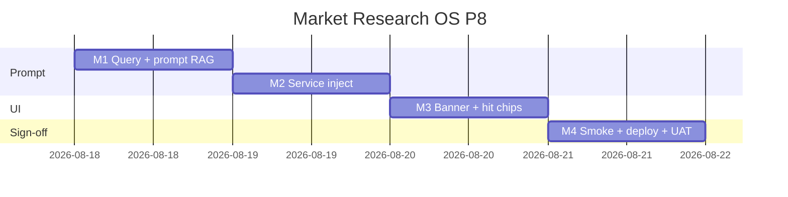

# Market Research OS — Kế hoạch coding P8 (inject RAG vào insight copilot)

> **For agentic workers:** REQUIRED SUB-SKILL: Use `superpowers:subagent-driven-development` (recommended) hoặc `superpowers:executing-plans` để thực thi **từng milestone**. Mỗi M có exit criteria, unit spec, smoke script và trace UC/EC.
>
> **P9+ không nằm trong file này để code.** P0–P7 đã ship trên `main` (`b1935389`). Plan này chỉ P8 = RES-UC-072.
>
> **Hướng đã khóa:** P8 = inject hit RAG (corpus `approved_client_facing` | `published`, **cùng `client_id`**) vào `insightCopilot`. Embeddings **local hash P7** — không OpenAI embedding, không `pgvector`. Qualtrics **live** / SparkToro live / conjoint / portal RAG / Apify login = **out**.

**Goal:** Khi Analyst bấm **Gợi ý insight (Claude)** và `RESEARCH_RAG_ENABLED=1`, LLM nhận tối đa 5 insight đã duyệt cùng khách làm *context*; vẫn tạo **đúng 1** insight `draft` từ evidence đã chọn — không tự duyệt, không tự công bố, không tạo insight từ hit RAG.

**Architecture:** Không module Nest mới, không DDL mới. Tái `searchInsights` + `rankRagHits` + `isRagCorpusStatus`. Đổi `buildInsightCopilotPrompt` (opt-in RAG section). Flag off → prompt P0 nguyên (mảng evidence), `listEmbeddings` không gọi. Deploy clone P7: **không** portal-web, **không** `RESEARCH_RAG_ENABLED=1` trên prod.

**Tech Stack:** NestJS `services/ptt-crm-api`, Next.js `services/ops-web`, Jest, Vitest, bash smoke. Không thêm npm. Flag/caps P0–P7 giữ nguyên.

**Spec canonical:**
- Design [`../specs/2026-08-14-market-research-os-design.md`](../specs/2026-08-14-market-research-os-design.md) §10.1 Copilot, §10 G10, §15.2 Vector/RAG
- SRS [`../../specs/2026-08-14-market-research-os-srs.md`](../../specs/2026-08-14-market-research-os-srs.md) RES-UC-011, NFR-AI-04, BR-RES-01/06/08/11/12
- UX [`../../specs/2026-08-14-market-research-os-ui-ux.md`](../../specs/2026-08-14-market-research-os-ui-ux.md) Insights tab — nút Gợi ý insight
- P7 leftover [`./2026-08-14-market-research-os-p7.md`](./2026-08-14-market-research-os-p7.md) §7 «Inject RAG hits vào insight copilot»
- Actions [`../../use-cases/actions/12-RES-ACTIONS.md`](../../use-cases/actions/12-RES-ACTIONS.md) P8+ row inject
- Prompt hiện tại [`../../../../services/ptt-crm-api/src/market-research/market-research-copilot.prompt.ts`](../../../../services/ptt-crm-api/src/market-research/market-research-copilot.prompt.ts)
- RAG util [`../../../../services/ptt-crm-api/src/market-research/research-rag.util.ts`](../../../../services/ptt-crm-api/src/market-research/research-rag.util.ts)

## Global Constraints

- Mọi BR P0–P7 vẫn binding: **BR-RES-01, 02, 03, 05, 06/08, 07, 09, 10, 11, 12, 13.**
- **Design §10 G10 / §15.2:** RAG **chỉ** corpus `approved_client_facing` | `published`. Cấm nhét `draft` / `evidence_attached` / transcript / excerpt audio / lead PII vào prompt RAG.
- **BR-RES-11:** query embed từ excerpt evidence có `piiHint` → **skip RAG** (prompt P0, không `listEmbeddings`). Copilot **vẫn chạy** nếu LLM configured.
- **BR-RES-12:** `searchInsights` đã 403 ngoài scope. Inject **bắt buộc** `client_id = project.client_id`. Cấm hit client khác trong prompt / `output_json`.
- **BR-RES-06/08:** RAG **không** `createInsight` thêm. `createInsight` vẫn đúng **1 lần** (draft P0). Không `createReport` / `publish-portal`. Không `approveInsight`.
- **NFR-PRI-02:** không persist transcript. Query RAG = excerpt+locator đã có trên evidence verified — không đọc audio.
- Copilot = cap `crm_research.run` (giữ P0). Search nội bộ = cùng gate `researchRagEnabled` như GET search.
- Flag `RESEARCH_RAG_ENABLED` default `0`. Health `rag_enabled` **không đổi** (P7). **Không** trả secret.
- Flag off → hành vi P0 bit-identical: user prompt = JSON array evidence; `rag_hits: []`; `rag_note: 'rag_disabled'`; `listEmbeddings` không gọi.
- Copy VI theo banner khóa dưới. Không palette mới. Không đụng `/crm/sales?tab=market`.
- **Không regress** `JEST_WORKER_ID` skip `deploy/runtime.env`.
- Thứ tự file: `util+spec (TDD) → prompt spec → service → FE → smoke/docs`.
- Commit chỉ khi user yêu cầu / SDD. **Không implement trên `main`.** Branch: `feat/market-research-os-p8`. Merge-base: `b1935389`.

### Out of P8 (cấm làm trong plan này)

Qualtrics **live** HTTP, SparkToro live census, OpenAI/Gemini **embedding API**, `CREATE EXTENSION vector` / pgvector, conjoint / market simulator, cluster theme theo quý, retrain model, **portal RAG**, Talkwalker/Dovetail, **Apify Facebook login** (Design §20), ISO 20252, Whisper thay đổi, report copilot inject, `xlsx` / `pdfkit`. Không DDL P8. Không bật RAG trên prod deploy.

### Definition of Done (mọi task)

| # | Tiêu chí | Verify |
|---|----------|--------|
| 1 | User-visible | Banner copilot khi flag on; curl/Jest copilot |
| 2 | Persisted | 1 insight draft; `ai_runs.output_json.rag_hit_ids` |
| 3 | Guarded | flag off = P0 prompt; draft không vào prompt; PII skip RAG; 1 `createInsight` |
| 4 | Tested | `*.spec.ts` + vitest + smoke |

---

## 0. Milestone map (P8 = M1–M4)

| M | User outcome | UC | FR / NFR | Ước lượng |
|---|--------------|----|----------|-----------|
| **M1** | Prompt + query util: RAG section opt-in; draft/PII lọc | 072 | G10, BR-11 | 0.5 ngày |
| **M2** | `insightCopilot` gọi search cùng client; flag off = P0 | 072 | BR-06/08/12 | 1 ngày |
| **M3** | Insights tab banner + list `rag_hits` | 072 | UX Insights | 0.5 ngày |
| **M4** | Smoke + deploy + Actions UAT 072 | 072 | — | 0.5 ngày |

**P8 sign-off = smoke P8 PASS + UAT Actions P8 + Jest copilot không regress P0.**



---

## File map (khóa trước khi code)

| Tạo | Trách nhiệm |
|-----|-------------|
| `services/ptt-crm-api/src/market-research/research-copilot-rag.util.ts` + spec | `buildCopilotRagQuery`, `shouldSkipCopilotRag`, `toCopilotRagHits` |
| `services/ops-web/src/components/research/insight-copilot-rag.util.ts` + vitest | Banner + `shouldShowRagCopilotBanner` |
| `scripts/smoke_market_research_p8.sh` + `p8_m1`…`p8_m4` | Skip live nếu API down / flag off |
| `scripts/deploy_market_research_p8_vps.sh` | Clone P7; **không** portal-web; **không** bật RAG |

| Sửa | Việc |
|-----|------|
| `market-research.types.ts` | `CopilotRagHit`, `InsightCopilotResult.rag_hits` / `rag_note` |
| `market-research-copilot.prompt.ts` + spec | Opt-in `{ evidence, prior_approved_insights }` |
| `market-research.service.ts` + spec | Inject trong `insightCopilot` |
| `InsightsTab` trong `services/ops-web/src/app/crm/research/[id]/page.tsx` | Banner + chips |
| `market-research-api.ts` | Type response copilot |
| Catalog / BA / Actions | UC-072; walkthrough P8; backlog P9+ |

**Không tạo:** DDL, portal route, report-copilot thay đổi, embedding vendor.

---

## Shared types

Thêm vào `market-research.types.ts` (không đổi `RagHit`):

```typescript
export const RAG_COPILOT_HIT_LIMIT = 5;

export const RAG_COPILOT_BANNER =
  'Copilot có thể tham chiếu insight đã duyệt cùng khách. Bản nháp — không tự duyệt, không tự công bố.';

export type CopilotRagNote = 'rag_disabled' | 'rag_skipped_pii' | 'rag_empty';

export type CopilotRagHit = {
  insight_id: number;
  statement: string;
  status: RagCorpusStatus;
  score: number;
  theme_codes: string[];
};

export type InsightCopilotResult = {
  ok: true;
  insight: ResearchInsightRow;
  run_id: number;
  rag_hits: CopilotRagHit[];
  rag_note?: CopilotRagNote;
};
```

`InsightCopilotInput` **không** thêm field — không `q` từ FE. Query = evidence excerpts.

---

## 1. Quyết định đã khóa (không hỏi lại lúc code)

1. P8 = inject RAG vào **insight** copilot only. Report copilot không đụng.
2. Tái `searchInsights(scope, { q, client_id: project.client_id, limit: 5 })` — không viết rank mới.
3. Flag off = prompt P0 (JSON **array** evidence). Flag on + query sạch = JSON **object** `{ evidence, prior_approved_insights }` + `promptVersion: 'research-insight-v2'`.
4. Tối đa 5 hit; `toCopilotRagHits` lọc `isRagCorpusStatus` lần nữa.
5. `createInsight` đúng 1 lần; `replaceInsightEvidence` chỉ `evidence_ids` input.
6. Deploy không ghi `RESEARCH_RAG_ENABLED=1`. Staging: PO bật tay (runbook Actions).
7. OpenAI embeddings / Qualtrics / SparkToro / portal RAG / conjoint = **P9+**, không milestone.

---

## Milestone M1 — Query + prompt RAG (RES-UC-072)

**User outcome:** Util dựng query từ evidence; prompt P0 không đổi khi không truyền RAG; khi truyền hit — user JSON có `prior_approved_insights`, system cấm bịa `insight_id` / cấm publish.

### Task M1-1 Util (TDD)

Tạo `research-copilot-rag.util.ts`:

```typescript
import { piiHint } from './evidence-immutable.util';
import { isRagCorpusStatus } from './research-rag.util';
import {
  RAG_COPILOT_HIT_LIMIT,
  type CopilotRagHit,
  type RagHit,
} from './market-research.types';
import type { InsightCopilotEvidence } from './market-research-copilot.prompt';

export function buildCopilotRagQuery(evidence: InsightCopilotEvidence[]): string {
  return evidence
    .map((row) =>
      [row.excerpt, row.locator, row.unit, row.geo].filter(Boolean).join(' '),
    )
    .join(' ')
    .replace(/\s+/g, ' ')
    .trim()
    .slice(0, 500);
}

export function shouldSkipCopilotRag(query: string): boolean {
  return !query.trim() || piiHint(query);
}

export function toCopilotRagHits(hits: RagHit[]): CopilotRagHit[] {
  return hits
    .filter((hit) => isRagCorpusStatus(hit.status))
    .slice(0, RAG_COPILOT_HIT_LIMIT)
    .map((hit) => ({
      insight_id: hit.insight_id,
      statement: hit.statement,
      status: hit.status,
      score: hit.score,
      theme_codes: hit.theme_codes,
    }));
}
```

- [ ] **M1-1a:** `buildCopilotRagQuery([{ excerpt: 'Share 18%', locator: 'L1', unit: '%', geo: 'VN', id: 1, value: 18, period: '2025' }])` chứa `Share 18%` và `VN`; length ≤ 500.
- [ ] **M1-1b:** `shouldSkipCopilotRag('liên hệ 0901234567') === true`; `shouldSkipCopilotRag('Share premium 18%') === false`; `shouldSkipCopilotRag('   ') === true`.
- [ ] **M1-1c:** `toCopilotRagHits` với 1 hit `draft` + 1 hit `approved_client_facing` → chỉ id approved; length ≤ 5 khi input 8 hit.

### Task M1-2 Prompt (TDD)

Sửa `buildInsightCopilotPrompt`:

```typescript
export function buildInsightCopilotPrompt(
  evidence: InsightCopilotEvidence[],
  opts?: { ragHits?: CopilotRagHit[] },
): { system: string; user: string } {
  const grounded = evidence.map((row) => ({
    id: row.id,
    locator: row.locator,
    excerpt: row.excerpt,
    value: row.value,
    unit: row.unit,
    period: row.period,
    geo: row.geo,
  }));
  const ragHits = opts?.ragHits;
  if (ragHits === undefined) {
    return {
      system: [
        'You are a market-research insight copilot (G6).',
        'Use only the supplied evidence objects — fields id, locator, excerpt, value, unit, period, geo.',
        'Do not fill gaps. Do not invent numbers, sources, geographies, or recommendations beyond the evidence.',
        'Cấm fill gaps — chỉ dùng evidence đã chọn.',
        'Return JSON only with keys: statement, observation, interpretation, implication, recommendation, confidence_rationale.',
        'Never set status published. Output is a draft for an analyst to edit.',
      ].join(' '),
      user: JSON.stringify(grounded),
    };
  }
  const prior = ragHits.map((hit) => ({
    insight_id: hit.insight_id,
    statement: hit.statement,
    status: hit.status,
    score: hit.score,
    theme_codes: hit.theme_codes,
  }));
  return {
    system: [
      'You are a market-research insight copilot (G6).',
      'Use only the supplied evidence objects — fields id, locator, excerpt, value, unit, period, geo.',
      'prior_approved_insights are context only (same client, already approved).',
      'Cite insight_id only when the id appears in prior_approved_insights. Do not invent insight_id.',
      'Do not copy a prior statement as a published claim. Do not set status published.',
      'Do not fill gaps. Do not invent numbers, sources, geographies, or recommendations beyond the evidence.',
      'Cấm fill gaps — chỉ dùng evidence đã chọn.',
      'Return JSON only with keys: statement, observation, interpretation, implication, recommendation, confidence_rationale.',
      'Never set status published. Output is a draft for an analyst to edit.',
    ].join(' '),
    user: JSON.stringify({ evidence: grounded, prior_approved_insights: prior }),
  };
}
```

- [ ] **M1-2a:** Không `opts` → user parse được **array**; keys evidence giữ P0; **không** chứa `prior_approved_insights`; system **không** chứa `invent insight_id`.
- [ ] **M1-2b:** `opts: { ragHits: [{ insight_id: 88, statement: 'Giá premium thắng', status: 'approved_client_facing', score: 0.4, theme_codes: ['PRICE'] }] }` → user object có `prior_approved_insights[0].insight_id === 88`; system match `/do not invent insight_id/i`; **không** chứa `published` như lệnh set status (vẫn có «Never set status published»).
- [ ] **M1-2c:** `opts: { ragHits: [] }` → `prior_approved_insights` = `[]`; system vẫn cấm invent id.
- [ ] **M1-2d:** Spec P0 hiện tại (`includes only the given evidence IDs`) **vẫn PASS** — gọi không `opts`.

**Exit M1:** Jest util + prompt xanh; 0 thay đổi service.

**Commit:** `feat(research): P8 M1 copilot rag prompt and query util`

---

## Milestone M2 — Service inject (RES-UC-072)

**User outcome:** `POST …/projects/:id/insights/copilot` khi flag on + excerpt sạch → LLM user có prior hits cùng `acme`; khi flag off → P0; luôn 1 draft.

`insightCopilot` hiện discard `loadScopedProject`. Đổi thành lấy `project.client_id`.

Chèn **sau** validate evidence, **trước** `buildInsightCopilotPrompt`:

```typescript
const project = await this.loadScopedProject(projectId, scope);
// ... evidence loop không đổi ...

const evidenceFields = evidence.map(toInsightCopilotEvidenceFields);
let ragHits: CopilotRagHit[] = [];
let ragNote: CopilotRagNote | undefined = 'rag_disabled';
let prompt = buildInsightCopilotPrompt(evidenceFields);

if (this.config.researchRagEnabled) {
  const q = buildCopilotRagQuery(evidenceFields);
  if (shouldSkipCopilotRag(q)) {
    ragNote = q.trim() ? 'rag_skipped_pii' : 'rag_empty';
  } else {
    const search = await this.searchInsights(scope, {
      q,
      client_id: project.client_id,
      limit: RAG_COPILOT_HIT_LIMIT,
    });
    ragHits = toCopilotRagHits(search.hits);
    ragNote = ragHits.length ? undefined : 'rag_empty';
    prompt = buildInsightCopilotPrompt(evidenceFields, { ragHits });
  }
}

// insertAiRun + llm như P0
// succeedAiRun outputJson thêm:
//   rag_hit_ids: ragHits.map((h) => h.insight_id),
//   rag_note: ragNote ?? null,
// return { ok: true, insight, run_id: run.id, rag_hits: ragHits, rag_note: ragNote }
```

`promptVersion`: `'research-insight-v2'` khi `prompt` dùng opts RAG; ngược lại `'research-insight-v1'`.

- [ ] **M2-1a:** Flag **off** (default spec): `insightCopilot` 0 evidence vẫn 400; LLM unconfigured vẫn 503; **thêm** `expect(repo.listEmbeddings).not.toHaveBeenCalled()` trên 2 test P0 hiện có (sửa test hiện tại).
- [ ] **M2-1b:** Flag off + evidence verified + LLM OK → `completeJson` `userPrompt` parse **array**; `createInsight` 1 lần; return `rag_hits: []`, `rag_note: 'rag_disabled'`; `listEmbeddings` không gọi.
- [ ] **M2-1c:** Flag on + `listEmbeddings` trả published id `88` (client acme) + draft id `99` cùng câu → `userPrompt` chứa `88`, **không** chứa `99`; `createInsight` 1 lần; `replaceInsightEvidence` gọi với `[3]` (evidence input); `output_json.rag_hit_ids` = `[88]`.
- [ ] **M2-1d:** Flag on + excerpt `SĐT 0901234567` → `listEmbeddings` không gọi; `rag_note: 'rag_skipped_pii'`; LLM **vẫn** được gọi (nếu configured); `createInsight` 1 lần.
- [ ] **M2-1e:** Flag on + `listEmbeddings` `[]` → `rag_note: 'rag_empty'`; `userPrompt` có `prior_approved_insights: []`; system chứa `invent insight_id`.
- [ ] **M2-1f:** Không gọi `createReport` / `publish` / `approveInsight` từ copilot (assert `not.toHaveBeenCalled` nếu mock tồn tại).

Gợi ý test M2-1c (thêm vào `market-research.service.spec.ts`):

```typescript
it('M2-1c: flag on injects approved rag hits and still creates one draft', async () => {
  config.researchRagEnabled = true;
  stubScopedProject();
  repo.getEvidence.mockResolvedValue(evidenceRow({ id: 3, qc_status: 'verified', excerpt: 'Share premium 18%' }));
  repo.insertAiRun.mockResolvedValue({ id: 91, status: 'pending' });
  repo.createInsight.mockResolvedValue(insightRow({ id: 70, status: 'draft', ai_generated: true }));
  repo.getInsight.mockResolvedValue(insightRow({ id: 70, status: 'draft', ai_generated: true }));
  repo.listEmbeddings.mockResolvedValue([
    {
      insight_id: 88,
      project_id: 4,
      status: 'approved_client_facing',
      statement: 'Giá premium thắng tại MT HCM',
      observation: null,
      embedding: [0.1],
      theme_codes: ['PRICE'],
    },
    {
      insight_id: 99,
      project_id: 4,
      status: 'draft',
      statement: 'Giá premium thắng tại MT HCM',
      observation: null,
      embedding: [0.1],
      theme_codes: [],
    },
  ]);
  llm.completeJson.mockResolvedValue({
    parsed: { statement: 'Draft từ evidence 3', observation: '', interpretation: '', implication: '', recommendation: '', confidence_rationale: '' },
    modelName: 'claude',
  });

  const out = await service.insightCopilot(
    9,
    { restricted: true, allowedClientIds: ['acme'] },
    { evidence_ids: [3] },
    'am@ptt',
  );

  expect(out.insight.id).toBe(70);
  expect(out.rag_hits.map((h) => h.insight_id)).toEqual([88]);
  expect(out.rag_note).toBeUndefined();
  expect(repo.createInsight).toHaveBeenCalledTimes(1);
  expect(repo.replaceInsightEvidence).toHaveBeenCalledWith(70, [3]);
  const userPrompt = llm.completeJson.mock.calls[0][0].userPrompt as string;
  expect(userPrompt).toContain('88');
  expect(userPrompt).not.toContain('99');
  expect(repo.succeedAiRun.mock.calls[0][1].outputJson.rag_hit_ids).toEqual([88]);
});
```

`listEmbeddings` mock embedding có thể là vector 64 phần tử nếu `rankRagHits` cần cosine — **bắt buộc** embedding đủ chiều hoặc spy `rankRagHits`. An toàn hơn: mock `listEmbeddings` trả embedding = `embedInsightText('Giá premium thắng tại MT HCM')` (import util trong spec) để score ≥ 0.12 với query chứa «premium».

**Exit M2:** Copilot inject; P0 flag-off không regress.

**Commit:** `feat(research): P8 M2 inject rag hits into insight copilot`

---

## Milestone M3 — Insights UI (RES-UC-072)

**User outcome:** Flag on + cap `run` → banner verbatim dưới nút **Gợi ý insight**. Sau copilot, chips `Tham chiếu #88`. Flag off → **không** banner. Không nút «tạo insight từ RAG».

### Task M3-1 FE util (TDD)

`services/ops-web/src/components/research/insight-copilot-rag.util.ts`:

```typescript
export const RAG_COPILOT_BANNER =
  'Copilot có thể tham chiếu insight đã duyệt cùng khách. Bản nháp — không tự duyệt, không tự công bố.';

export function shouldShowRagCopilotBanner(ragEnabled: boolean, canRun: boolean): boolean {
  return ragEnabled === true && canRun === true;
}
```

Vitest clone `insights-rag.util.spec.ts`: banner verbatim; `(false, true) === false`; `(true, true) === true`; `(true, false) === false`.

### Task M3-2 Page

- `copilotResearchInsight` return type thêm `rag_hits`, `rag_note?`.
- `InsightsTab`: prop `ragEnabled` đã có. Render:

```tsx
{shouldShowRagCopilotBanner(ragEnabled, canRun) ? (
  <p className="muted" data-testid="rag-copilot-banner" style={{ margin: '0.5rem 0 0', fontSize: '0.85rem' }}>
    {RAG_COPILOT_BANNER}
  </p>
) : null}
```

- State `copilotRagHits` trên page (hoặc InsightsTab). `onInsightCopilot` gán `out.rag_hits`. Chips text `Tham chiếu #{id}` — **không** `onClick`, **không** `createResearchInsight`, **không** điều hướng.
- `TRANSITION_REASON_VI` không bắt buộc key mới (note chỉ hiển thị muted nếu muốn: `rag_disabled` không hiện — flag off ẩn banner).

Smoke `p8_m3.sh`: grep FE `RAG_COPILOT_BANNER`; `rg -n "createResearchInsight" services/ops-web/src/app/crm/research/[id]/page.tsx` — copilot path không gọi create từ hit; `rg` không thêm `/crm/sales?tab=market`.

**Exit M3:** Banner ẩn khi `rag_enabled !== true`.

**Commit:** `feat(research): P8 M3 insight copilot rag banner`

---

## Milestone M4 — Smoke + deploy + UAT (RES-UC-072)

**User outcome:** Script P8 chạy; UAT 072; P9+ rõ.

### Smoke

Clone `scripts/smoke_market_research_p5.sh`:

- `smoke_market_research_p8.sh` loop `m1`…`m4`.
- `p8_m1.sh`: document util contract; skip live.
- `p8_m2.sh`: `POST …/insights/copilot` — health 200; nếu `rag_enabled=false` → assert response (khi có token) `rag_note=rag_disabled` **hoặc** SKIP live; `createInsight` count không assert qua HTTP (Jest đã cover). Flag on staging: body có `rag_hits` array.
- `p8_m3.sh`: banner string trong `insight-copilot-rag.util.ts`; no sales-market.
- `p8_m4.sh`: `bash -n` deploy script; echo «RAG not enabled in deploy».

Gates comment: flag off P0 prompt; draft không trong prior; PII skip RAG; 1 draft; không publish.

### Deploy

Clone `scripts/deploy_market_research_p7_vps.sh` → `deploy_market_research_p8_vps.sh`:

- Step `1/4` **vẫn** P0+P1+P2+P3+P4+P5+P6+P7 DDL (P7 last). **Không** file DDL P8.
- `2/4` api → `3/4` ops-web → `4/4` worker.
- **Không** portal-web.
- `patch_runtime_env` chỉ P0 flags. **Không** ghi `RESEARCH_RAG_ENABLED=1` / Qualtrics / SparkToro / keys.
- `APPLY=1` pull `origin main` only.
- Echo: `Flags not flipped unless --enable-flags. RAG not enabled. … UAT: bash scripts/smoke_market_research_p8.sh`

### Docs

Catalog `12-MARKET-RESEARCH-OS.md`:

```markdown
## P8 — RES-UC-072

| UC | Tóm tắt |
|----|---------|
| 072 | Inject RAG vào insight copilot (cùng client). Flag off = P0. 1 draft. Không tự duyệt. |

**API:** `POST /api/v1/research/projects/:id/insights/copilot` (giữ) — response thêm `rag_hits`, `rag_note?`
**Gates:** flag off → `rag_disabled` + prompt P0; PII query → `rag_skipped_pii`; draft không trong prior; `createInsight` ×1.
```

Cập nhật ma trận phase + bảng «Phạm vi phase» P8 = UC-072 (bỏ «Spec ready — chưa code» cho P0–P7 nếu đụng dòng đó — **chỉ thêm hàng P8**, không rewrite lịch sử P0).

BA `RNOSAI-BA-RES-UseCases.md`: thêm UC-072 một đoạn (clone 011 + «tham chiếu corpus đã duyệt»).

Actions — thay row «Inject RAG…» trong bảng P8+ bằng walkthrough:

```markdown
## Walkthrough UAT P8 — Copilot + RAG (≈10 phút)

**Mục tiêu:** *«AN chọn evidence verified → Gợi ý insight; (staging flag on) thấy banner + chip tham chiếu insight đã duyệt cùng khách; draft mới status draft; F5 còn; flag off không banner / rag_disabled.»*

| # | Actor | Thao tác | Phản hồi | Gate |
|---|-------|----------|----------|------|
| 1 | AN | Insights · chọn ≥1 EV verified · **Gợi ý insight** (flag off prod) | 1 insight draft · không banner | ✓ P0 |
| 2 | AN | Staging `RESEARCH_RAG_ENABLED=1` · cùng thao tác | Banner verbatim · `rag_hits` 0..5 | ✓ RES-UC-072 |
| 3 | AN | Có hit | Chip `Tham chiếu #id` · statement hit không thành published | ✓ BR-06 |
| 4 | AN | Excerpt EV có SĐT (staging) | Copilot vẫn draft · `rag_note=rag_skipped_pii` | ✓ BR-11 |
| 5 | QA | F5 | Draft còn · không portal publish | ✓ F5 |
```

Bảng P9+ (thay P8+ cũ):

| Hạng mục | Điều kiện mở |
|----------|--------------|
| SparkToro **live** HTTP | PO mua API + key staging |
| Qualtrics **live** | Retainer + key staging |
| OpenAI embeddings | DPA vendor + gold-set semantic |
| Portal RAG | Sau copilot+search staging ổn |
| Conjoint / simulator / cluster quý / Talkwalker / ISO 20252 | Scorecard 100đ |
| **Apify login** | **Out (Design §20)** |

- [ ] **M4-1:**

```
cd services/ptt-crm-api && npm test -- --testPathPattern='market-research' --no-coverage
cd services/ops-web && npx vitest run src/components/research --reporter=dot
bash -n scripts/smoke_market_research_p8.sh scripts/deploy_market_research_p8_vps.sh
```

`JEST_WORKER_ID` guard còn. Pytest P5 whisper/sparktoro vẫn xanh (không sửa).

**Exit M4 = P8 sign-off.**

**Commit:** `feat(research): P8 M4 copilot rag smoke deploy and UAT`

---

## 4. Env checklist (staging)

| Biến | P8 |
|------|-----|
| Flags P0 | giữ `1` |
| `RESEARCH_RAG_ENABLED` | default `0` — **không** bật trong deploy prod |
| Caps | `run` (copilot), `view` (search nội bộ) |
| Anthropic | copilot P0 — thiếu key → `llm_unconfigured` (không đổi) |

Bật RAG trên **staging** sau PO: `RESEARCH_RAG_ENABLED=1` trong runtime.env staging only + restart `ptt-crm-api` — không phải bước deploy mặc định. Prod giữ `0` → banner ẩn, copilot P0.

---

## 5. Spec coverage (self-review)

| SRS / UC | Task |
|----------|------|
| RES-UC-011 copilot draft | M2 — không regress flag off |
| Design G10 / §15.2 corpus | M1-1c, M2-1c |
| BR-RES-11 PII skip | M1-1b, M2-1d |
| BR-RES-12 cùng client | M2 `client_id: project.client_id` |
| BR-RES-06/08 1 draft, không publish | M2-1c, M2-1f, M3 |
| UC-072 UI banner | M3 |
| Qualtrics / OpenAI embed / conjoint / portal RAG | **Out** |
| Apify login | **Out vĩnh viễn — §20** |

---

## 6. Rủi ro thi hành

| Rủi ro | Xử lý trong plan |
|--------|------------------|
| Đổi shape prompt trên prod | Flag off không truyền `opts` — array P0 |
| Draft lọt prior | `searchInsights` + `toCopilotRagHits` |
| Query PII → embed | `shouldSkipCopilotRag` trước `searchInsights` |
| `createInsight` × N từ hits | Assert 1 lần; FE không create từ chip |
| Local embed kém | Chấp nhận P7 hash; OpenAI embed = P9+ DPA |
| Flag prod vô tình | Deploy không ghi `RESEARCH_RAG_ENABLED=1` |
| Jest đọc `runtime.env` | Không đụng `JEST_WORKER_ID` |
| `APPLY=1` nhầm branch | Pull `origin main` |

---

## 7. Roadmap P8+ (không code trong plan này)

| Phase | Hạng mục | Điều kiện mở |
|-------|----------|--------------|
| **P8** | Inject RAG → insight copilot | Plan này |
| **P9** | SparkToro live HTTP | PO mua API + key staging |
| **P10** | Qualtrics live | Retainer + key staging |
| **P11** | OpenAI embeddings (optional) | DPA + gold-set semantic |
| **P12+** | Portal RAG, conjoint, cluster quý, Talkwalker, ISO 20252 | Scorecard / bake-off |
| **—** | Apify login / group FB | Không mở |

---

## 8. Câu hỏi đã khóa (không hỏi lại lúc code)

1. P8 = inject RAG vào insight copilot; một plan; không report copilot.
2. Tái search P7 (hash local); không pgvector; không OpenAI embedding API.
3. Qualtrics live / SparkToro live / conjoint / portal RAG / Apify login không vào milestone.
4. Flag default 0 trên prod deploy; staging bật tay sau PO.
5. Query = excerpt evidence; không `q` từ FE.
6. 1 insight draft; hit RAG = context + chip, không tạo insight mới.
