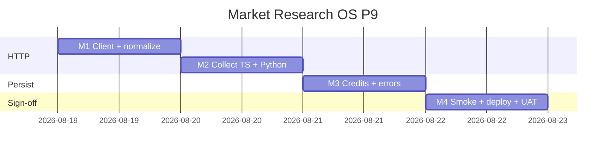

# Market Research OS — Kế hoạch coding P9 (SparkToro live HTTP)

> **For agentic workers:** REQUIRED SUB-SKILL: Use `superpowers:subagent-driven-development` (recommended) hoặc `superpowers:executing-plans` để thực thi **từng milestone**. Mỗi M có exit criteria, unit spec, smoke script và trace UC/EC.
>
> **P10+ không nằm trong file này để code.** P0–P8 đã ship trên `main` (`3c01940b`). Plan này chỉ P9 = RES-UC-061 live HTTP.
>
> **Hướng đã khóa:** P9 = thay stub P5 (`collectSparkToro` / `_fetch_sparktoro` trả `{ results: [] }`) bằng **SparkToro REST API thật** (create report → pull websites), giữ contract nội bộ `{ results: [{ url, title, snippet }] }` trước `mapSparkToroResponse` / `map_sparktoro_response`. **Không** `createInsight`. Qualtrics live / RAG / OpenAI embedding / portal / conjoint = **out**.

**Goal:** Khi PO bật `RESEARCH_SPARKTORO_ENABLED=1` + `SPARKTORO_API_KEY` trên **staging**, Analyst bấm **Chạy SparkToro** → job `research_sparktoro` gọi SparkToro API, persist tối đa N website sources (`publisher=SparkToro`, tier ≤ medium, `limitation_note`), ghi `credits_used` từ `meta.credits_charged`. Prod deploy **không** bật flag/key.

**Architecture:** Hai bước HTTP theo [SparkToro API docs](https://sparktoro.com/api/docs): `POST /v3/describe/create` (prompt = `build_desk_query(question_vi, geo)`) → `report_id`; `GET /v3/websites?report_id=&limit=N` → normalize `data[]` thành `{ results: [...] }` rồi tái mapper P5. TS (`sparktoro-client.util.ts` + `sparktoro-collect.ts`) và Python worker (`_fetch_sparktoro`) **cùng contract normalize** — không đổi mapper/tier/PII guard. Timeout create 45s (sync 10–20s). Flag/key off → hành vi P5 bit-identical (`sparktoro_disabled`, không HTTP).

**Tech Stack:** NestJS `services/ptt-crm-api`, Python `ptt_crm` + `ptt_jobs`, Jest, pytest, bash smoke. HTTP: Node `fetch` (TS), `urllib` (Python — clone `desk_collect._post_json`). Không thêm npm/pip.

**Spec canonical:**
- Design [`../specs/2026-08-14-market-research-os-design.md`](../specs/2026-08-14-market-research-os-design.md) § paid-estimate sources
- SRS [`../../specs/2026-08-14-market-research-os-srs.md`](../../specs/2026-08-14-market-research-os-srs.md) RES-UC-061, BR-RES-06/08/09/11
- UX [`../../specs/2026-08-14-market-research-os-ui-ux.md`](../../specs/2026-08-14-market-research-os-ui-ux.md) Sources tab — nút SparkToro (P5, không đổi)
- P5 stub [`./2026-08-14-market-research-os-p5.md`](./2026-08-14-market-research-os-p5.md) M3
- Actions [`../../use-cases/actions/12-RES-ACTIONS.md`](../../use-cases/actions/12-RES-ACTIONS.md) P9 row + walkthrough P5 (cập nhật nhánh live)
- SparkToro vendor [`https://sparktoro.com/api/docs`](https://sparktoro.com/api/docs)

## Global Constraints

- Mọi BR P0–P8 vẫn binding: **BR-RES-01, 02, 03, 05, 06/08, 07, 09, 10, 11, 12, 13.**
- **BR-RES-06/08:** SparkToro **chỉ** insert `crm_research_sources`. **Cấm** `createInsight` / `createReport` / publish-portal trên mọi path (Nest sync + worker).
- **BR-RES-09:** `publisher=SparkToro`, `reliability_tier` ∈ {`low`,`medium`} + `limitation_note` bắt buộc (`assertPaidEstimateTier`).
- **BR-RES-11:** `piiHint(question_vi)` → 400 trước enqueue; snippet có PII → drop row trong mapper (giữ P5).
- Flag `RESEARCH_SPARKTORO_ENABLED` default `0`. Health `sparktoro_enabled` = flag **và** key — **không** trả key.
- Flag/key off → `200 {ok:true, note:sparktoro_disabled}`; **không** gọi SparkToro; FE ẩn CTA (P5).
- **Credit budget:** 1 run ≈ 12 credits (10 create + 2 websites). Ghi `credits_used` trên `crm_research_ai_runs` + `output_json.credits_used`, `report_id`, `sparktoro_location`.
- **Geo:** SparkToro `location` chỉ `us|ca|uk`. VN/geo khác → append vào prompt; `location` default `us` (env `SPARKTORO_LOCATION` override).
- **Không regress** `JEST_WORKER_ID` skip `deploy/runtime.env`.
- Deploy clone P8: **không** portal-web; **không** `RESEARCH_SPARKTORO_ENABLED=1` / **không** ghi `SPARKTORO_API_KEY` trên prod.
- Thứ tự file: `util+spec (TDD) → collect TS/py → service credits → smoke/docs`.
- Commit chỉ khi user yêu cầu / SDD. **Không implement trên `main`.** Branch: `feat/market-research-os-p9`. Merge-base: `3c01940b`.

### Out of P9 (cấm làm trong plan này)

Qualtrics live, RAG/copilot thay đổi, OpenAI embedding, portal RAG, social/podcasts SparkToro endpoints (chỉ **websites**), conjoint/simulator, Talkwalker, Apify login, DDL mới, thay đổi FE button (P5 đủ), bật SparkToro prod.

### Definition of Done (mọi task)

| # | Tiêu chí | Verify |
|---|----------|--------|
| 1 | User-visible | Staging flag on → sources SparkToro sau job; prod flag off → disabled |
| 2 | Persisted | `crm_research_sources` + `ai_runs.credits_used` + `output_json.report_id` |
| 3 | Guarded | no insight; PII 400; tier cap; flag off = no HTTP |
| 4 | Tested | Jest + pytest + smoke P9 (live skip nếu key off) |

---

## 0. Milestone map (P9 = M1–M4)

| M | User outcome | UC | FR / NFR | Ước lượng |
|---|--------------|----|----------|-----------|
| **M1** | HTTP client + normalize websites → `{ results }` | 061 | BR-09 | 0.5 ngày |
| **M2** | Wire `collectSparkToro` (TS) + `_fetch_sparktoro` (Python) | 061 | BR-11 | 0.5 ngày |
| **M3** | `credits_used` + error paths worker/Nest sync | 061 | BR-06/08 | 0.5 ngày |
| **M4** | Smoke + deploy P9 + UAT RES-UC-061 live staging | 061 | — | 0.5 ngày |

**P9 sign-off = smoke P9 PASS + UAT Actions P9 staging (key PO) + Jest/pytest xanh.**



---

## File map (khóa trước khi code)

| Tạo | Trách nhiệm |
|-----|-------------|
| `services/ptt-crm-api/src/market-research/sparktoro-client.util.ts` + spec | HTTP create + websites; `normalizeSparktoroWebsites`; `resolveSparktoroLocation` |
| `scripts/fixtures/sparktoro-websites.sample.json` | Raw `GET /v3/websites` 200 (2 domains) |
| `scripts/fixtures/sparktoro-collect.normalized.json` | Expected `{ results: [...] }` sau normalize |
| `scripts/smoke_market_research_p9.sh` + `p9_m1`…`p9_m4` | Live skip nếu `sparktoro_enabled` false |
| `scripts/deploy_market_research_p9_vps.sh` | Clone P8; **không** bật SparkToro |

| Sửa | Việc |
|-----|------|
| `sparktoro-collect.ts` | Gọi client; trả `{ results, credits_used, report_id, location }` |
| `sparktoro_collect.py` | `_fetch_sparktoro` live; `collect_sparktoro` trả credits |
| `market-research.service.ts` + spec | `persistSparktoroSources` → `creditsUsed` |
| `12-RES-ACTIONS.md` | Walkthrough UAT P9 staging live |
| `RNOSAI-BA-RES-UseCases.md` | RES-UC-061 note live HTTP |

**Không sửa:** `sparktoro-mapper.util.ts` (contract đầu vào giữ), FE `sources-sparktoro.util.ts`, DDL.

---

## Shared types & env

```typescript
export type SparktoroCollectResult = {
  results: Array<{ url: string; title: string; snippet: string }>;
  credits_used: number;
  report_id: string | null;
  location: string;
};

export const SPARKTORO_DEFAULT_BASE = 'https://api.sparktoro.com';
export const SPARKTORO_WEBSITE_LIMIT = 10;
export const SPARKTORO_CREATE_TIMEOUT_MS = 45_000;
export const SPARKTORO_GET_TIMEOUT_MS = 20_000;
```

Env (doc trong deploy comment, **không** ghi prod):

| Env | Default | Mô tả |
|-----|---------|--------|
| `RESEARCH_SPARKTORO_ENABLED` | `0` | Gate HTTP |
| `SPARKTORO_API_KEY` | `` | Bearer token |
| `SPARKTORO_API_BASE_URL` | `https://api.sparktoro.com` | Override staging mock |
| `SPARKTORO_LOCATION` | `us` | `us\|ca\|uk` nếu geo không map |
| `SPARKTORO_WEBSITE_LIMIT` | `10` | max 1..50 |

`resolveSparktoroLocation(geo: string[], override?: string): 'us'|'ca'|'uk'` — nếu geo chứa `UK`/`GB` → `uk`; `CA`/`CANADA` → `ca`; else env/default `us`.

Normalize 1 website row:

```typescript
// domain "gartner.com" → url "https://gartner.com", title "gartner.com"
// snippet = meta_description || `Affinity ${affinity}% · ${category}`
```

---

## Milestone M1 — SparkToro HTTP client + normalize (RES-UC-061)

**User outcome:** Unit test chuyển fixture websites SparkToro → `{ results }` đúng shape mapper P5.

**Interfaces:**
- Produces: `resolveSparktoroLocation`, `normalizeSparktoroWebsites`, `fetchSparktoroAudienceWebsites`

### Task 1: Fixture + failing normalize spec

**Files:**
- Create: `scripts/fixtures/sparktoro-websites.sample.json`
- Create: `scripts/fixtures/sparktoro-collect.normalized.json`
- Create: `services/ptt-crm-api/src/market-research/sparktoro-client.util.spec.ts`
- Create: `services/ptt-crm-api/src/market-research/sparktoro-client.util.ts` (stub export)

- [ ] **Step 1: Write fixture** (`sparktoro-websites.sample.json`)

```json
{
  "data": [
    {
      "id": 1,
      "domain": "example.com",
      "affinity": 42.5,
      "category": "Business",
      "meta_description": "Example audience site."
    },
    {
      "id": 2,
      "domain": "news.vn",
      "affinity": 18.0,
      "category": "News",
      "meta_description": null
    }
  ],
  "meta": { "credits_charged": 2, "credits_remaining": 188 }
}
```

- [ ] **Step 2: Write failing test**

```typescript
import fs from 'node:fs';
import path from 'node:path';
import {
  normalizeSparktoroWebsites,
  resolveSparktoroLocation,
} from './sparktoro-client.util';

describe('sparktoro-client.util', () => {
  const root = path.join(__dirname, '../../../../scripts/fixtures');
  const raw = JSON.parse(
    fs.readFileSync(path.join(root, 'sparktoro-websites.sample.json'), 'utf8'),
  );

  it('resolveSparktoroLocation maps geo tokens', () => {
    expect(resolveSparktoroLocation(['VN'])).toBe('us');
    expect(resolveSparktoroLocation(['UK'])).toBe('uk');
    expect(resolveSparktoroLocation(['CA'])).toBe('ca');
  });

  it('normalizeSparktoroWebsites maps data[] to collect results', () => {
    const out = normalizeSparktoroWebsites(raw);
    expect(out.results).toHaveLength(2);
    expect(out.results[0]).toEqual({
      url: 'https://example.com',
      title: 'example.com',
      snippet: 'Example audience site.',
    });
    expect(out.results[1].snippet).toContain('Affinity 18%');
    expect(out.credits_charged).toBe(2);
  });
});
```

- [ ] **Step 3: Run test — expect FAIL**

Run: `cd services/ptt-crm-api && npx jest src/market-research/sparktoro-client.util.spec.ts -v`
Expected: FAIL — module / function not defined

- [ ] **Step 4: Implement normalize + location**

```typescript
export type SparktoroLocation = 'us' | 'ca' | 'uk';

export function resolveSparktoroLocation(geo: string[], override?: string): SparktoroLocation {
  const fromEnv = (override ?? process.env.SPARKTORO_LOCATION ?? 'us').trim().toLowerCase();
  const tokens = geo.map((g) => g.trim().toUpperCase()).filter(Boolean);
  if (tokens.some((t) => t === 'UK' || t === 'GB')) return 'uk';
  if (tokens.some((t) => t === 'CA' || t === 'CANADA')) return 'ca';
  if (fromEnv === 'uk' || fromEnv === 'ca' || fromEnv === 'us') return fromEnv;
  return 'us';
}

export function normalizeSparktoroWebsites(raw: unknown, limit = 10): {
  results: Array<{ url: string; title: string; snippet: string }>;
  credits_charged: number;
} {
  const obj = raw && typeof raw === 'object' ? (raw as Record<string, unknown>) : {};
  const meta = obj.meta && typeof obj.meta === 'object' ? (obj.meta as Record<string, unknown>) : {};
  const rows = Array.isArray(obj.data) ? obj.data : [];
  const results: Array<{ url: string; title: string; snippet: string }> = [];
  for (const row of rows.slice(0, Math.max(1, Math.min(limit, 50)))) {
    if (!row || typeof row !== 'object') continue;
    const item = row as Record<string, unknown>;
    const domain = String(item.domain ?? '').trim().toLowerCase();
    if (!domain) continue;
    const affinity = Number(item.affinity);
    const category = String(item.category ?? '').trim();
    const metaDesc = String(item.meta_description ?? '').trim();
    const snippet =
      metaDesc ||
      [
        Number.isFinite(affinity) ? `Affinity ${Math.round(affinity)}%` : '',
        category,
      ]
        .filter(Boolean)
        .join(' · ')
        .slice(0, 500);
    results.push({
      url: domain.startsWith('http') ? domain : `https://${domain}`,
      title: domain.slice(0, 500),
      snippet,
    });
  }
  return { results, credits_charged: Number(meta.credits_charged ?? 0) || 0 };
}
```

- [ ] **Step 5: Run test — expect PASS**

- [ ] **Step 6: Commit** (chỉ khi user yêu cầu)

```bash
git add scripts/fixtures/sparktoro-*.json \
  services/ptt-crm-api/src/market-research/sparktoro-client.util.ts \
  services/ptt-crm-api/src/market-research/sparktoro-client.util.spec.ts
git commit -m "feat(research): P9 M1 sparktoro normalize client util"
```

### Task 2: HTTP fetch with injectable transport (TDD)

**Files:**
- Modify: `sparktoro-client.util.ts`
- Modify: `sparktoro-client.util.spec.ts`

- [ ] **Step 1: Failing test `fetchSparktoroAudienceWebsites`**

```typescript
it('fetchSparktoroAudienceWebsites create then websites', async () => {
  const calls: string[] = [];
  const transport = async (input: { method: string; url: string; body?: unknown }) => {
    calls.push(`${input.method} ${input.url}`);
    if (input.url.endsWith('/v3/describe/create')) {
      return { status: 200, json: async () => ({ report_id: 'rpt-1', status: 'ready' }) };
    }
    if (input.url.includes('/v3/websites')) {
      return { status: 200, json: async () => raw };
    }
    return { status: 404, json: async () => ({}) };
  };
  const out = await fetchSparktoroAudienceWebsites(
    { query: 'B2B founders VN', apiKey: 'k', location: 'us', limit: 10 },
    transport,
  );
  expect(out.report_id).toBe('rpt-1');
  expect(out.results).toHaveLength(2);
  expect(out.credits_used).toBeGreaterThanOrEqual(2);
  expect(calls[0]).toContain('/v3/describe/create');
  expect(calls[1]).toContain('/v3/websites');
});
```

- [ ] **Step 2: Implement `fetchSparktoroAudienceWebsites`**

```typescript
export type SparktoroHttpTransport = (input: {
  method: 'GET' | 'POST';
  url: string;
  headers: Record<string, string>;
  body?: unknown;
  timeoutMs: number;
}) => Promise<{ status: number; json: () => Promise<unknown> }>;

export async function fetchSparktoroAudienceWebsites(
  input: { query: string; apiKey: string; location: SparktoroLocation; limit?: number; baseUrl?: string },
  transport: SparktoroHttpTransport = defaultSparktoroTransport,
): Promise<{
  results: Array<{ url: string; title: string; snippet: string }>;
  credits_used: number;
  report_id: string;
  location: SparktoroLocation;
}> {
  const base = (input.baseUrl ?? process.env.SPARKTORO_API_BASE_URL ?? SPARKTORO_DEFAULT_BASE).replace(/\/$/, '');
  const limit = input.limit ?? SPARKTORO_WEBSITE_LIMIT;
  const auth = { Authorization: `Bearer ${input.apiKey}`, 'Content-Type': 'application/json' };
  const create = await transport({
    method: 'POST',
    url: `${base}/v3/describe/create`,
    headers: auth,
    body: { prompt: input.query, location: input.location },
    timeoutMs: SPARKTORO_CREATE_TIMEOUT_MS,
  });
  if (create.status < 200 || create.status >= 300) {
    throw new Error(`sparktoro_create_http_${create.status}`);
  }
  const created = (await create.json()) as Record<string, unknown>;
  const reportId = String(created.report_id ?? '').trim();
  if (!reportId) throw new Error('sparktoro_missing_report_id');
  const websites = await transport({
    method: 'GET',
    url: `${base}/v3/websites?report_id=${encodeURIComponent(reportId)}&limit=${limit}`,
    headers: { Authorization: `Bearer ${input.apiKey}` },
    timeoutMs: SPARKTORO_GET_TIMEOUT_MS,
  });
  if (websites.status < 200 || websites.status >= 300) {
    throw new Error(`sparktoro_websites_http_${websites.status}`);
  }
  const normalized = normalizeSparktoroWebsites(await websites.json(), limit);
  return {
    results: normalized.results,
    credits_used: 10 + normalized.credits_charged,
    report_id: reportId,
    location: input.location,
  };
}

async function defaultSparktoroTransport(input: SparktoroHttpTransport extends infer _T ? Parameters<SparktoroHttpTransport>[0] : never): ReturnType<SparktoroHttpTransport> {
  const ctrl = new AbortController();
  const timer = setTimeout(() => ctrl.abort(), input.timeoutMs);
  try {
    const res = await fetch(input.url, {
      method: input.method,
      headers: input.headers,
      body: input.body ? JSON.stringify(input.body) : undefined,
      signal: ctrl.signal,
    });
    return { status: res.status, json: () => res.json() };
  } finally {
    clearTimeout(timer);
  }
}
```

- [ ] **Step 3: Run spec — PASS**

- [ ] **Step 4: Commit** (user request)

**M1 exit:** `sparktoro-client.util.spec.ts` green; fixture committed.

---

## Milestone M2 — Wire collect (TS + Python)

**User outcome:** `collectSparkToro` / `collect_sparktoro` gọi client khi flag+key on; mapper P5 không đổi.

### Task 3: TypeScript `sparktoro-collect.ts`

**Files:**
- Modify: `services/ptt-crm-api/src/market-research/sparktoro-collect.ts`
- Create: `services/ptt-crm-api/src/market-research/sparktoro-collect.spec.ts`

- [ ] **Step 1: Failing spec — collect delegates to fetch**

```typescript
import { collectSparkToro } from './sparktoro-collect';
import * as client from './sparktoro-client.util';

jest.mock('./sparktoro-client.util');

it('collectSparkToro returns results from fetchSparktoroAudienceWebsites', async () => {
  (client.fetchSparktoroAudienceWebsites as jest.Mock).mockResolvedValue({
    results: [{ url: 'https://a.com', title: 'a.com', snippet: 'x' }],
    credits_used: 12,
    report_id: 'r1',
    location: 'us',
  });
  const out = await collectSparkToro({ query: 'Q VN', apiKey: 'k', geo: ['VN'] });
  expect(out.results).toHaveLength(1);
  expect(out.credits_used).toBe(12);
  expect(out.report_id).toBe('r1');
});
```

- [ ] **Step 2: Implement collect**

```typescript
import {
  fetchSparktoroAudienceWebsites,
  resolveSparktoroLocation,
} from './sparktoro-client.util';

export async function collectSparkToro(input: {
  query: string;
  apiKey: string;
  geo?: string[];
}): Promise<{
  results: Array<{ url: string; title: string; snippet: string }>;
  credits_used?: number;
  report_id?: string | null;
  location?: string;
}> {
  const location = resolveSparktoroLocation(input.geo ?? []);
  const fetched = await fetchSparktoroAudienceWebsites({
    query: input.query,
    apiKey: input.apiKey,
    location,
  });
  return fetched;
}
```

- [ ] **Step 3: Update `persistSparktoroSources` call site** — pass `geo`:

```typescript
const raw = await collectSparkToro({ query, apiKey: input.apiKey, geo: input.geo });
```

- [ ] **Step 4: Run Jest collect spec + existing mapper spec — PASS**

### Task 4: Python `_fetch_sparktoro` mirror

**Files:**
- Modify: `ptt_crm/market_research/sparktoro_collect.py`
- Modify: `tests/test_research_sparktoro.py`

- [ ] **Step 1: Failing test live fetch inject**

```python
def test_fetch_sparktoro_normalizes_websites(monkeypatch):
    from ptt_crm.market_research import sparktoro_collect

    def fake_create(_q, _k):
        return {"report_id": "rpt-9", "status": "ready"}

    def fake_websites(_rid, _k):
        return {
            "data": [{"domain": "a.com", "affinity": 10, "category": "Biz", "meta_description": "A"}],
            "meta": {"credits_charged": 2},
        }

    monkeypatch.setattr(sparktoro_collect, "_create_report", fake_create)
    monkeypatch.setattr(sparktoro_collect, "_get_websites", fake_websites)
    raw = sparktoro_collect._fetch_sparktoro("query", "key")
    assert raw["results"][0]["url"] == "https://a.com"
    assert raw["credits_used"] == 12
```

- [ ] **Step 2: Implement `_create_report`, `_get_websites`, `_fetch_sparktoro`** (urllib clone `desk_collect._post_json` + GET helper; base URL env; location helper duplicate logic)

- [ ] **Step 3: `collect_sparktoro` return credits**

```python
return {**empty, "sources": sources, "credits_used": int(raw.get("credits_used") or 0), "report_id": raw.get("report_id")}
```

- [ ] **Step 4: pytest `tests/test_research_sparktoro.py -q` — PASS**

**M2 exit:** Stub removed; injectable fetch tests green; **không** gọi network trong CI.

---

## Milestone M3 — Credits + error paths

**User outcome:** Run succeeded ghi credits; HTTP fail → `fail_run` message an toàn, không insight.

### Task 5: Nest `persistSparktoroSources` credits

**Files:**
- Modify: `market-research.service.ts:1950-1979`
- Modify: `market-research.service.spec.ts` (M3-2c assert `creditsUsed`)

- [ ] **Step 1: Extend persist**

```typescript
const raw = await collectSparkToro({ query, apiKey: input.apiKey, geo: input.geo });
const candidates = mapSparkToroResponse(raw);
// ... createSource loop ...
await this.repo.succeedAiRun(input.runId, {
  creditsUsed: Number(raw.credits_used ?? 0),
  outputJson: {
    source_ids,
    query,
    credits_used: raw.credits_used ?? 0,
    report_id: raw.report_id ?? null,
    location: raw.location ?? null,
  },
});
```

- [ ] **Step 2: Wrap collect in try/catch** — `failAiRun(runId, 'sparktoro_failed')` rethrow không cần; return failed status jobs_disabled path giữ.

- [ ] **Step 3: Python worker `process_research_sparktoro_payload`**

```python
repository.succeed_run(
    run_id,
    credits_used=int(result.get("credits_used") or 0),
    output={
        "query": result.get("query"),
        "source_ids": source_ids,
        "report_id": result.get("report_id"),
        "credits_used": result.get("credits_used"),
    },
)
```

- [ ] **Step 4: On fetch exception** — `repository.fail_run(run_id, "sparktoro_failed")` (không leak key).

- [ ] **Step 5: Jest `market-research.service.spec.ts` M3-2c + new test HTTP error — PASS**

Run: `cd services/ptt-crm-api && npx jest src/market-research/market-research.service.spec.ts -t sparktoro -v`

**M3 exit:** credits persisted; error không 500 unhandled.

---

## Milestone M4 — Smoke, deploy, UAT

### Task 6: Smoke scripts

**Files:**
- Create: `scripts/smoke_market_research_p9.sh` (orchestrator clone P8)
- Create: `scripts/smoke_market_research_p9_m1.sh` … `p9_m4.sh`

**p9_m1:** grep exports `fetchSparktoroAudienceWebsites`, `normalizeSparktoroWebsites`.

**p9_m2:** pytest sparktoro + jest client/collect/mapper.

**p9_m3:** Document gates:
- flag off → `sparktoro_disabled`, no HTTP (curl health)
- flag on staging → POST run-sparktoro → poll run → sources ≥0, `credits_used` ≥0
- no `createInsight`

**p9_m4:** Live block (skip if `sparktoro_enabled` false):

```bash
curl -s "$API_BASE/api/v1/research/health" | python3 -c "import sys,json; h=json.load(sys.stdin); exit(0 if h.get('sparktoro_enabled') else 1)"
# if exit 0 → POST run-sparktoro with staff token + question_id
```

- [ ] **Step 1:** `bash -n scripts/smoke_market_research_p9*.sh`
- [ ] **Step 2:** Run full smoke locally (live skip OK on prod flag 0)

### Task 7: Deploy script

**Files:**
- Create: `scripts/deploy_market_research_p9_vps.sh` (copy P8 header; đổi P9; same **không** SparkToro enable)

Comment block:

```bash
# P9 has no DDL. Do NOT set RESEARCH_SPARKTORO_ENABLED=1 or SPARKTORO_API_KEY on prod.
# Staging UAT: PO sets both in runtime.env manually, restart ptt-crm-api + ptt-worker.
```

### Task 8: Actions / BA docs

**Files:**
- Modify: `docs/use-cases/actions/12-RES-ACTIONS.md` — thêm **Walkthrough UAT P9** (~15 phút):
  1. PO set key staging
  2. Health `sparktoro_enabled=true`
  3. POST run-sparktoro → job done
  4. Sources SparkToro + limitation_note
  5. Insights count unchanged
  6. `credits_used` trên run
- Modify: `docs/specs/modules/RNOSAI-BA-RES-UseCases.md` RES-UC-061 — bỏ dòng «P5 không live HTTP»

- [ ] **Step 1:** Commit docs (user request)

**M4 exit:** `bash scripts/smoke_market_research_p9.sh` OK; deploy script reviewed; UAT checklist written.

---

## Pre-ship checklist (PO / QA)

| # | Gate | Staging | Prod |
|---|------|---------|------|
| 1 | `GET /health` | `sparktoro_enabled=true` (PO key) | `false` |
| 2 | POST run-sparktoro | 202 + sources or 0 | 200 disabled |
| 3 | Insights | không tăng | — |
| 4 | Credits | ~12/run logged | N/A |
| 5 | Deploy | manual flag | script **không** ghi key |

**Staging enable (manual, không trong deploy script):**

```bash
# /var/www/rnosai/deploy/runtime.env
RESEARCH_SPARKTORO_ENABLED=1
SPARKTORO_API_KEY=<po-key>
sudo systemctl restart ptt-crm-api ptt-worker
```

---

## Self-review (plan author)

**Spec coverage:**
- RES-UC-061 live → M1–M4 ✓
- BR-RES-06/08 no insight → M2–M3 ✓
- BR-RES-09 tier/limitation → mapper unchanged ✓
- BR-RES-11 PII → service 400 + mapper drop ✓
- Flag off prod → deploy + smoke skip ✓
- Credits → M3 ✓

**Placeholder scan:** No TBD/TODO steps.

**Type consistency:** `collectSparkToro` returns `credits_used`, `report_id`, `location` — consumed in M3 `succeedAiRun`.

**Risk notes:**
| Risk | Mitigation |
|------|------------|
| Create timeout 20s+ | 45s timeout; worker retry policy unchanged |
| VN geo unsupported | Prompt carries VN; location=us |
| Credit burn on staging | PO 200 free credits; limit 10 websites |
| Accidental prod enable | Deploy script explicit ban; smoke asserts false |

---

## Execution handoff

Plan saved to `docs/superpowers/plans/2026-08-15-market-research-os-p9.md`.

**Two execution options:**

1. **Subagent-Driven (recommended)** — fresh subagent per milestone, review between M1–M4
2. **Inline Execution** — implement in this session with executing-plans checkpoints

**Which approach?**
