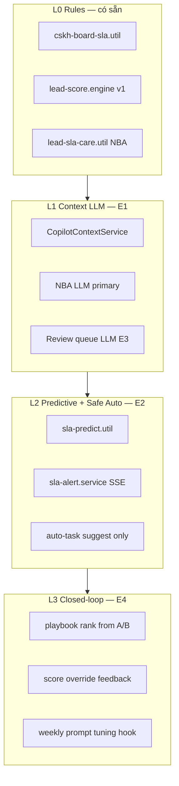

# Design: CSKH Enterprise + AI Thực Chiến — Wave E0→E5 (12 tuần)

**Ngày:** 2026-08-04  
**Phạm vi:** Luồng chăm sóc Spa Meta 24h (`spa_operational`) — CSKH rep, Team lead, GDKD  
**Production:** `https://ops.pttads.vn`  
**Liên quan:**
- [`cskh-spa-lead-meta-24h-sop.md`](../../runbooks/cskh-spa-lead-meta-24h-sop.md)
- [`cskh-ai-pilot-90-day-playbook.md`](../../runbooks/cskh-ai-pilot-90-day-playbook.md)
- [`crm-getfly-gap-matrix.md`](../../specs/crm-getfly-gap-matrix.md) §1, §6
- GDKD dashboard: `/crm/gdkd-enterprise` (8 KPI hiện có)

---

## 1. Vấn đề

RNOSAI đã có nền CSKH SLA (15p/4h/24h), CSKH board, review queue, Copilot pilot, và GDKD 8-tile KPI. Tuy nhiên:

| Gap | Hiện trạng | Enterprise cần |
|-----|-----------|------------------|
| Visibility | Home `/` chỉ health + caps | Widget SLA breach, lead mới, copilot DAU |
| Real-time | Poll UI, digest cron 08:00 | In-app alert khi warning/breach |
| AI adoption | Pilot cohort gate (BR-AI-04) | Prod rollout có rollout flag theo team |
| NBA | Rules-first, LLM fallback phụ | LLM primary trên lead SLA-critical |
| Predictive | Reactive ok/warning/breach | Dự báo breach 5–10 phút trước |
| WFM lite | 3 ca ICT hardcode cho backlog gate | Shift handoff report cuối ca |
| Review queue | Rule-based AI summary | LLM triage + workload balance |
| Learning loop | Playbook A/B tracked | Auto-rank playbook theo chốt rate |

**Outcome 12 tuần:** Team CSKH vận hành end-to-end trên luồng enterprise 4 tầng, GDKD đọc 8 KPI pass/fail hàng tuần, AI giảm breach backlog và tăng NBA acceptance mà vẫn tuân BR-AI-01 (không auto-send).

---

## 2. Luồng nghiệp vụ Enterprise (4 tầng)

### Tầng 1 — Intake & Routing

```
Meta ingest → status moi → SLA clock (received_at)
  → Score v1 (hot/warm/cold)
  → Route suggest (skill/load — rules E1, ML-ready E4)
  → Assign owner + optional alert
```

**Bằng chứng CRM:** `received_at`, `owner_id`, `ai_scores`, activity log.

### Tầng 2 — Thực thi SLA (Rep)

```
moi → [≤15p] call activity → first_call_at
  → [≤4h] B2 complete → b2_completed_at
  → da_lien_he → hen_gap | dang_tu_van
  → [≤24h] chot + VND audit | lost + reason
  → Closed-loop QA pass
```

**Copilot trên `/crm/leads/[id]`:** SLA banner, NBA, script draft, audit draft — rep accept/dismiss.

### Tầng 3 — Giám sát ca (Team lead)

| Thời điểm | Hành vi | Màn hình |
|-----------|---------|----------|
| Đầu ca | Đọc SLA digest (cron 08:00) | Email/Slack + CSKH board |
| Trong ca | Filter breach/warning, bulk assign | `/crm/cskh-board` |
| Sắp breach | Alert in-app (E2) | Toast + sidebar badge |
| Cuối ca | Breach backlog gate = 0 | `CskhBreachBacklogPanel` |
| Handoff | Export shift summary (E3) | `GET /cskh-board/shift-handoff` |

### Tầng 4 — GDKD Enterprise

`/crm/gdkd-enterprise` — 8 KPI (đã ship):

| ID | Target | Nguồn |
|----|--------|-------|
| `first_call_15m` | ≥85% | SLA tier |
| `b2_4h` | ≥80% | SLA tier |
| `close_24h` | ≥70% | SLA tier |
| `breach_backlog` | ≤0 | Breach backlog snapshot |
| `review_queue_age` | max <24h | Review queue metrics |
| `copilot_dau` | ≥60% | `ai_agent_runs` adoption |
| `nba_acceptance` | ≥35% | `ai_recommendations` type=nba |
| `roas_vnd_fill` | ≥90% | Chốt closed-loop |

---

## 3. Kiến trúc AI 4 lớp



**BR-AI bất di bất dịch:**
- **BR-AI-01:** Không auto-send Zalo/email/call — chỉ draft + safe auto-task (tạo reminder activity nội bộ, đề xuất reassign).
- **BR-AI-04:** Rollout theo `PTT_AI_COPILOT_ROLLOUT_MODE=pilot|team|all` — không hard-cut pilot UUID list prod-only.
- **BR-AI-05:** GDKD score override → ghi `ai_score_overrides` làm feedback (E4).

---

## 4. Lộ trình E0→E5

| Phase | Tuần | Tên | Deliverable chính | Gate |
|-------|------|-----|-------------------|------|
| **E0** | 1–2 | Stabilize visibility | Home widgets, CRM launcher badges, poll 60s | `cskh_e0_home_gate.sh` |
| **E1** | 3–4 | AI prod rollout | Copilot team-wide, NBA LLM primary, dismiss analytics | `rnos_r1_prod_pilot_gate.sh` + acceptance |
| **E2** | 5–7 | Predictive SLA | Breach predictor, in-app alerts (SSE), auto-task suggest | `cskh_e2_sla_predict_gate.sh` |
| **E3** | 8–9 | Smart ops | Review queue LLM triage, shift handoff report | `cskh_e3_handoff_gate.sh` |
| **E4** | 10–11 | Closed-loop learning | Playbook auto-rank, score v2 feedback pipeline | `cskh_e4_playbook_gate.sh` |
| **E5** | 12 | Enterprise sign-off | GDKD 8 KPI gate script, runbook update, E2E suite | `cskh_enterprise_e5_gate.sh` |

**Calendar mẫu (start tuần 1 = 04/08/2026):**

| Tuần | Phase | Milestone |
|------|-------|-----------|
| 1–2 | E0 | Home + badges staging |
| 3–4 | E1 | Copilot prod team CSKH |
| 5–7 | E2 | Predictive alert staging → prod |
| 8–9 | E3 | Handoff + LLM triage |
| 10–11 | E4 | Playbook rank + feedback |
| 12 | E5 | GDKD sign-off |

---

## 5. Chi tiết từng phase

### E0 — Stabilize Visibility (tuần 1–2)

**Mục tiêu:** GDKD và rep thấy tình trạng SLA ngay khi login — không cần vào CSKH board.

#### Backend

**API mới:** `GET /api/crm/home-summary`

```typescript
interface HomeSummaryResponse {
  ok: true;
  generated_at: string;
  leads_new_today: number;
  sla: {
    breach_count: number;
    warning_count: number;
    compliance_pct: number | null; // weighted 15m/4h/24h
    drill_href: string; // /crm/cskh-board?sla_filter=breach
  };
  review_queue: {
    pending_count: number;
    max_age_hours: number | null;
    drill_href: string;
  };
  ai?: {
    copilot_dau_pct: number | null;
    pilot_denominator: number;
    drill_href: string;
  };
}
```

**Implementation:** Compose từ `CskhBoardService.getBoard()` summary slice + `LeadsFunnelService.getReviewQueueMetrics()` + existing adoption metrics — **không duplicate SQL**.

#### Frontend

| File | Thay đổi |
|------|----------|
| `services/ops-web/src/app/page.tsx` | Replace summary-grid với `HomeCskhWidgetRow` |
| `services/ops-web/src/components/home/HomeCskhWidgetRow.tsx` | **NEW** — 3–4 widget cards |
| `services/ops-web/src/app/crm/page.tsx` | Badge pending trên card CSKH board + review queue |
| `services/ops-web/src/lib/api.ts` | `fetchHomeSummary()` |

**Done when:** Số breach trên `/` khớp `/crm/cskh-board` (gap matrix §1.2).

---

### E1 — AI Prod Rollout (tuần 3–4)

**Mục tiêu:** Copilot + NBA cho toàn team CSKH (không chỉ pilot UUID), LLM primary trên SLA NBA.

#### Config

| Biến | Giá trị E1 | Ý nghĩa |
|------|------------|---------|
| `PTT_AI_COPILOT_ENABLED` | `1` | Bật Copilot |
| `PTT_AI_COPILOT_ROLLOUT_MODE` | `team` | `pilot` \| `team` \| `all` |
| `PTT_AI_COPILOT_TEAM_CAPS` | `crm_leads` | User có cap này được Copilot |
| `PTT_AI_NBA_LLM_PRIMARY` | `1` | LLM trước, rules fallback |
| `PTT_AI_LOG_PII` | `0` | Prod bắt buộc |
| `PTT_AI_LOG_PROMPTS` | `0` | Prod bắt buộc |

#### Backend

| File | Thay đổi |
|------|----------|
| `guards/staff-ai-copilot.guard.ts` | Rollout mode `team` = check cap `crm_leads` |
| `ai-nba.service.ts` | When `PTT_AI_NBA_LLM_PRIMARY=1`, call LLM first for SLA actions |
| `ai-intelligence.controller.ts` | `GET /api/v1/ai/analytics/dismiss-reasons` — aggregate dismiss |

#### Frontend

| File | Thay đổi |
|------|----------|
| `lib/ai-flags.ts` | Mirror rollout mode |
| `components/ai/NbaAcceptancePanel.tsx` | Link drill-down dismiss reasons |
| Runbook update | `cskh-ai-pilot-90-day-playbook.md` §10 widen |

**KPI gate tuần 4:** Copilot DAU ≥50% (ramp), NBA acceptance ≥30%.

---

### E2 — Predictive SLA (tuần 5–7)

**Mục tiêu:** Cảnh báo breach **trước** deadline; đề xuất hành động an toàn (không auto-send).

#### Breach predictor

**File mới:** `services/ptt-crm-api/src/cskh-board/sla-predict.util.ts`

```typescript
export type SlaPredictRisk = 'low' | 'medium' | 'high' | 'imminent';

export interface SlaPredictRow {
  lead_id: number;
  tier: CskhSlaTier;
  minutes_remaining: number;
  risk: SlaPredictRisk;
  suggested_action: 'log_call' | 'complete_b2' | 'set_chot_audit' | 'set_lost_reason' | 'reassign';
  reason: string;
}

export function predictSlaRisk(row: CskhBoardRow, now?: Date): SlaPredictRow[];
```

**Logic v1 (rules, không ML):**
- `imminent`: ≤5 phút tới deadline, state = warning
- `high`: ≤10 phút, state = warning
- `medium`: ≤20 phút, state = warning
- Chỉ emit cho lead `owner_id` match hoặc GDKD

#### API

| Method | Path | Mô tả |
|--------|------|-------|
| GET | `/api/crm/cskh-board/sla-predictions` | List leads at risk (owner filter) |
| GET | `/api/crm/cskh-board/sla-alerts/stream` | SSE — push every 30s khi có delta |
| POST | `/api/v1/leads/:id/sla-auto-task` | Tạo internal reminder activity (BR-AI-01 safe) |

#### Frontend

| File | Thay đổi |
|------|----------|
| `components/crm/SlaAlertToastHost.tsx` | **NEW** — SSE client, toast stack |
| `components/layout/StaffPageShell.tsx` | Mount toast host khi cap crm_leads |
| `CskhBoardContent.tsx` | Column/badge "Sắp breach" từ predictions |

**Fallback:** Nếu SSE không khả dụng, poll `sla-predictions` 60s (same data).

---

### E3 — Smart Ops (tuần 8–9)

**Mục tiêu:** GDKD triage review queue nhanh hơn; team lead có handoff report cuối ca.

#### Review queue LLM triage

**File:** `review-queue-intelligence.util.ts` → thêm `buildReviewQueueLlmPrompt()` + service wrapper.

**API:** `GET /api/v1/leads/review-queue/ai-summaries?mode=llm`

- Fallback rules khi LLM unavailable
- Output: `summary_line`, `suggested_owner_id`, `workload_note`, `priority_score` (1–5)
- Audit: `ai_agent_runs` use_case `review_queue_triage`

#### Shift handoff report

**File mới:** `cskh-shift-handoff.util.ts`

```typescript
export interface ShiftHandoffReport {
  shift: CskhShiftWindow;
  generated_at: string;
  breach_backlog: BreachBacklogSnapshot;
  open_leads_by_tier: Record<CskhSlaTier, number>;
  review_queue_pending: number;
  top_breach_leads: Array<{ id: number; name: string; tier: CskhSlaTier; owner_name: string }>;
  handoff_notes: string; // template markdown for Slack/copy
}
```

**API:** `GET /api/crm/cskh-board/shift-handoff`

**UI:** `CskhShiftHandoffPanel.tsx` trên CSKH board — copy markdown + link bulk assign.

---

### E4 — Closed-loop Learning (tuần 10–11)

**Mục tiêu:** Playbook và score học từ outcome thực tế.

#### Playbook auto-rank

**Input:** Existing `GET /api/crm/cskh-board/playbook-ab-metrics`  
**Output mới:** `playbook_rank` sorted by chốt ≤24h rate

**File mới:** `playbook-closed-loop.util.ts`

- Rank playbook chunks by `chot_24h_rate` descending
- Expose `GET /api/v1/ai/playbooks/ranked?context=cskh_sla`
- NBA/RAG query prefers top-ranked chunks

#### Score v2 feedback

**Table (PG migration):** `ai_score_feedback`

```sql
CREATE TABLE ai_score_feedback (
  id BIGSERIAL PRIMARY KEY,
  lead_id BIGINT NOT NULL,
  staff_id UUID NOT NULL,
  override_score INT,
  outcome TEXT, -- 'chot' | 'lost' | 'stalled'
  created_at TIMESTAMPTZ NOT NULL DEFAULT now()
);
```

**Hook:** Khi GDKD override score (`POST /api/v1/ai/scores/lead/override`) → insert feedback row.  
**Hook:** Khi lead `chot`/`lost` → backfill outcome cho mọi score trên lead đó.

**Score v2:** `lead-score.engine.ts` v2 = v1 + feedback weight adjustment (deterministic, không ML server).

---

### E5 — Enterprise Sign-off (tuần 12)

**Mục tiêu:** GDKD ký gate 8 KPI + runbook enterprise hoàn chỉnh.

#### Gate script mới: `scripts/cskh_enterprise_e5_gate.sh`

Checks:
1. `cskh_board_gate.sh` PASS
2. `cskh_e0_home_gate.sh` PASS
3. `cskh_e2_sla_predict_gate.sh` PASS
4. Jest: sla-predict, shift-handoff, playbook-closed-loop specs
5. E2E: `cskh-board.spec.ts`, `cskh-board-mobile.spec.ts`, new `home-cskh-widgets.spec.ts`
6. GDKD KPI API returns 8 tiles all with `gate_pass` defined

#### Runbook mới

`docs/runbooks/cskh-enterprise-ops-runbook.md` — merge SOP + shift handoff + AI habits + GDKD weekly review.

#### Sign-off checklist (GDKD)

| KPI | Target tuần 12 |
|-----|----------------|
| first_call_15m | ≥85% |
| b2_4h | ≥80% |
| close_24h | ≥70% |
| breach_backlog | ≤0 cuối ca |
| review_queue_age | max <24h |
| copilot_dau | ≥60% |
| nba_acceptance | ≥35% |
| roas_vnd_fill | ≥90% |

---

## 6. RACI

| Vai trò | E0 | E1 | E2 | E3 | E4 | E5 |
|---------|----|----|----|----|----|----|
| CSKH Rep | UAT widgets | Daily Copilot | Respond alerts | — | Accept ranked scripts | Survey |
| Team Lead | — | Monitor adoption | Triage predictions | Handoff report | Review A/B | Sign shift SOP |
| GDKD | Verify home #s | Rollout decision | Alert policy | Review queue LLM QA | Score override audit | **8 KPI sign-off** |
| Platform | Deploy E0 | Flag E1 | SSE infra | LLM quota | Migration | Gate script |
| AI Product | — | Prompt NBA | Predict copy | Triage prompt | Rank tuning | Weekly template |

---

## 7. Out of scope (12 tuần)

- Omnichannel unified inbox (Meta/Zalo/CTI auto-capture) — Wave 2
- ML model server / training pipeline — dùng rules + LLM + deterministic v2
- Full WFM roster scheduling — chỉ handoff report lite
- Auto-send Zalo/email — vi phạm BR-AI-01
- Business calendar SLA pause (Tết) — defer R2

---

## 8. Rủi ro & mitigation

| Rủi ro | Mitigation |
|--------|------------|
| SSE firewalls | Poll fallback 60s |
| LLM latency NBA | Timeout 8s → rules fallback |
| Alert fatigue | Chỉ `high` + `imminent`; max 3 toast/stack |
| Pilot regression | Rollout mode `team` trước `all` |
| KPI không đạt tuần 12 | Gate E5 = process sign-off + trend, không block ship nếu ≥6/8 pass |

---

## 9. Success criteria

**Wave complete khi:**
1. Tất cả gate scripts E0–E5 PASS trên staging mirror prod
2. Runbook enterprise published
3. GDKD weekly review template cập nhật với 8 KPI drill-down
4. Không regression E2E CSKH board mobile
5. BR-AI-01 spot-check 100% — không auto-send path mới

---

## 10. Traceability

| Gap matrix | Phase |
|------------|-------|
| §1.1 lead mới hôm nay | E0 |
| §1.2 SLA breach widget | E0 |
| §1.3 copilot DAU widget | E0 |
| §1.4 quick links | E0 |
| §2.1 CRM launcher badges | E0 |
| §6 CSKH board E2E | E5 |
| Pilot playbook G2/G6 | E1 |
| Predictive SLA (new) | E2 |
| Review queue LLM (new) | E3 |
| Playbook closed-loop (new) | E4 |
