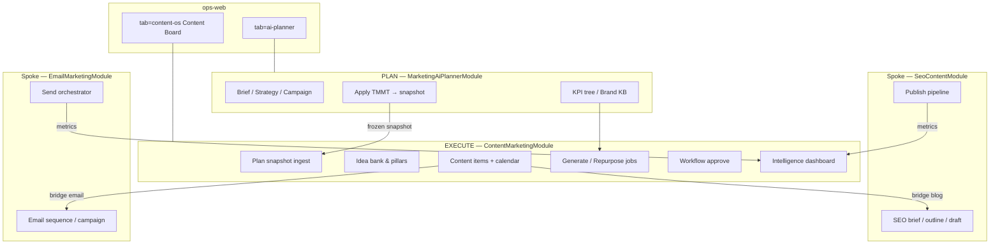
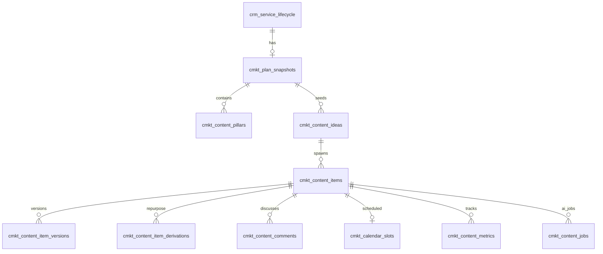
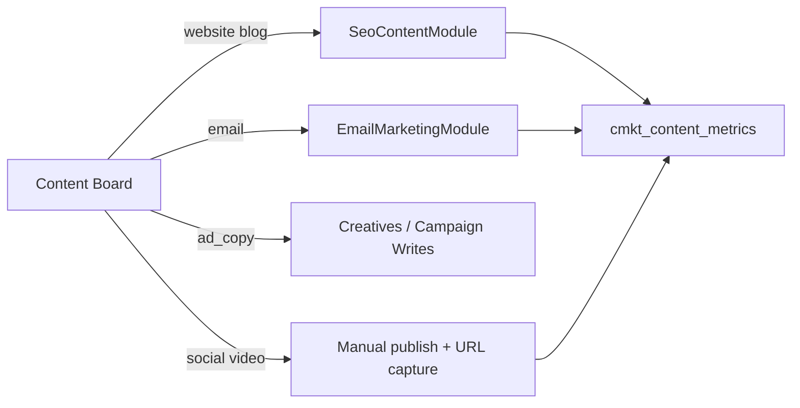
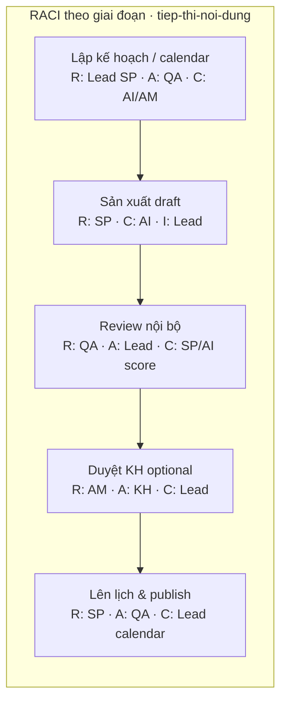
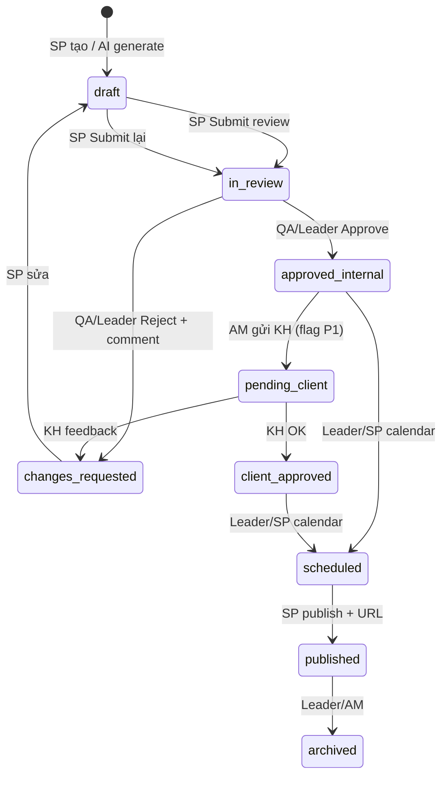
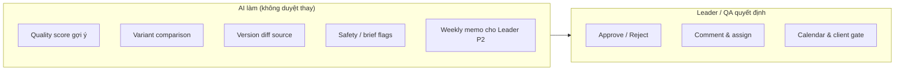
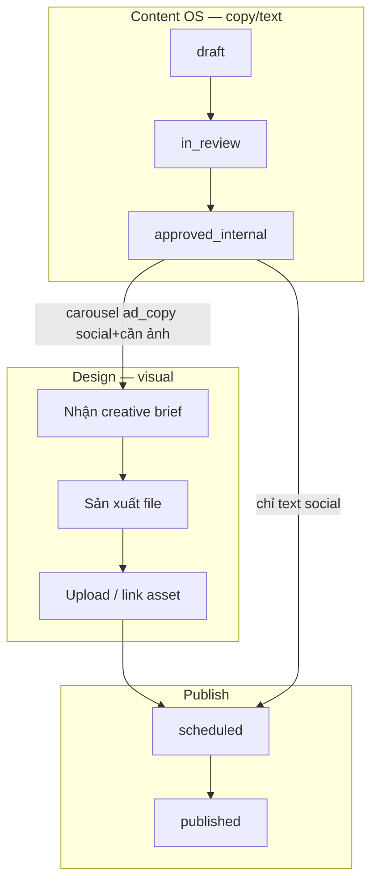
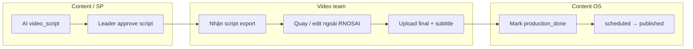
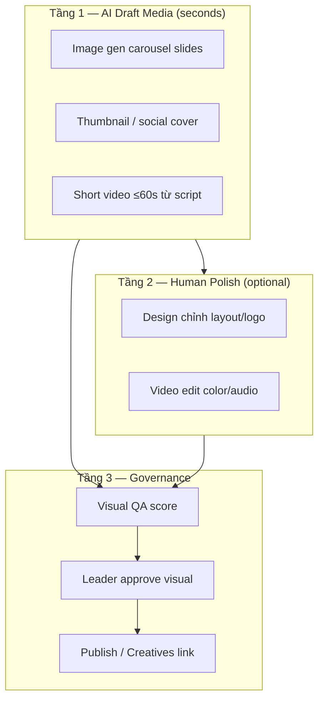
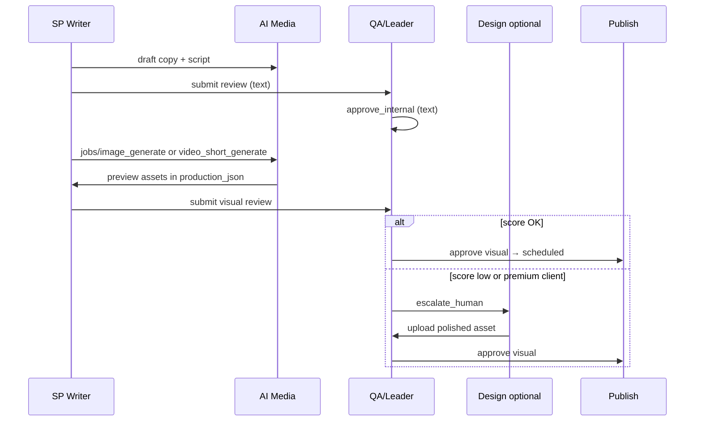

# Design: Content Marketing OS — Module Nest độc lập + Content Board tab

**Ngày:** 2026-08-09 (cập nhật channel registry · implementation status v1.5)  
**Document ID:** CMKT-OS-SPEC-20260809  
**Phiên bản:** 1.5  
**Trạng thái:** **M0–M6 implemented** staging `356ce00` — gap & roadmap M7+  
**Trạng thái triển khai:** [`2026-08-09-content-marketing-implementation-status.md`](./2026-08-09-content-marketing-implementation-status.md)  
**Kế hoạch M7–M12:** [`../plans/2026-08-09-content-marketing-m7-m12-professionalization.md`](../plans/2026-08-09-content-marketing-m7-m12-professionalization.md)  
**Nguồn PRD:** `PTTCOM/AI/PRD AI Create Content Marketing.docx` — *AI Content Marketing OS*  
**Parent BA:** [`RNOSAI-BA-SVC-UseCases.md`](../../specs/modules/RNOSAI-BA-SVC-UseCases.md) · [`RNOSAI-BA-MKTP-UseCases.md`](../../specs/modules/RNOSAI-BA-MKTP-UseCases.md) · [`RNOSAI-BA-SEO-UseCases.md`](../../specs/modules/RNOSAI-BA-SEO-UseCases.md)  
**Service pilot:** [`tiep-thi-noi-dung.md`](../../specs/services/tiep-thi-noi-dung.md) (`slug=tiep-thi-noi-dung`)  
**Planner anchor (PLAN layer):** [`2026-08-08-mkt-ai-planner-integration-spec.md`](../../specs/2026-08-08-mkt-ai-planner-integration-spec.md)  
**App:** `services/ptt-crm-api` · `services/ops-web`  
**Primary surface:** `/crm/service-delivery/[id]?tab=content-os`

---

## Mục lục

1. [Tóm tắt sản phẩm & quyết định kiến trúc](#1-tóm-tắt-sản-phẩm--quyết-định-kiến-trúc)
2. [Vấn đề & lợi thế cạnh tranh](#2-vấn-đề--lợi-thế-cạnh-tranh)
3. [Kiến trúc hub-and-spoke](#3-kiến-trúc-hub-and-spoke)
4. [Personas & user journey](#4-personas--user-journey)
5. [Information Architecture & routes](#5-information-architecture--routes)
6. [Ma trận Use Case (CMKT-UC)](#6-ma-trận-use-case-cmkt-uc)
7. [Module Nest — ContentMarketingModule](#7-module-nest--contentmarketingmodule)
8. [DDL & data model](#8-ddl--data-model)
9. [API contract](#9-api-contract)
10. [AI jobs, guardrails & fallback](#10-ai-jobs-guardrails--fallback)
11. [Tích hợp Planner snapshot (PLAN → EXECUTE)](#11-tích-hợp-planner-snapshot-plan--execute)
12. [Ma trận kênh × định dạng (Channel Registry)](#12-ma-trận-kênh--định-dạng-channel-registry)
13. [Tích hợp module kênh (spokes)](#13-tích-hợp-module-kênh-spokes)
14. [Content Board — UX/UI wireframes](#14-content-board--uxui-wireframes)
15. [RBAC, caps & feature flags](#15-rbac-caps--feature-flags)
16. [Non-functional requirements](#16-non-functional-requirements)
17. [Success metrics & acceptance criteria](#17-success-metrics--acceptance-criteria)
18. [Lộ trình Phase 0 → 3](#18-lộ-trình-phase-0--3)
19. [Smoke, UAT & regression](#19-smoke-uat--regression)
20. [Rủi ro & phụ thuộc](#20-rủi-ro--phụ-thuộc)
21. [Traceability PRD → RNOSAI](#21-traceability-prd--rnosai)
22. [Leader Approval Workflow](#22-leader-approval-workflow)
23. [Design & Video Production handoff](#23-design--video-production-handoff)
24. [AI Media Generation — ảnh & video](#24-ai-media-generation--ảnh--video)

---

## 1. Tóm tắt sản phẩm & quyết định kiến trúc

### 1.1. Mục tiêu

**Content Marketing OS** là module thực thi nội dung (EXECUTE) trên lifecycle dịch vụ marketing — giúp đội Content **biến TMMT / kế hoạch AI thành bài viết, caption, email, script và lịch đăng thực tế**, với workflow duyệt, repurposer đa kênh, và intelligence dashboard.

Khác với **AI Marketing Planner** (PLAN: Brief → Strategy → Campaign → Apply TMMT), Content OS **không soạn chiến lược tổng thể** mà **vận hành sản xuất hàng ngày/tuần/tháng** theo snapshot kế hoạch đã Apply.

### 1.2. Quyết định kiến trúc (đã chốt)

| Quyết định | Lý do |
|------------|-------|
| **`ContentMarketingModule` Nest riêng** | Tách PLAN vs EXECUTE; tránh phình `MarketingAiPlannerModule`; scale team độc lập |
| **Tab `content-os` trên service-delivery** | Neo theo lifecycle + RACI (AM/SP/QA); không hub đa-lifecycle |
| **Đọc Planner qua frozen snapshot only** | Không circular import; EXECUTE không mutate draft Planner đang soạn |
| **Spokes: `SeoContentModule`, `EmailMarketingModule`** | Blog/SEO và email giữ pipeline chuyên sâu; Content OS orchestrate bridge |
| **Human-in-the-loop bắt buộc** | BR-MKTP-01, BR-AI-01: không auto-publish |
| **Pilot slug `tiep-thi-noi-dung` trước** | GA sau khi smoke + UAT pass trên staging |

### 1.3. Phạm vi PRD → RNOSAI

| PRD module | RNOSAI owner | Ghi chú |
|------------|--------------|---------|
| 9.1 AI Strategy Planner | `MarketingAiPlannerModule` | Content OS **consume** snapshot, không duplicate |
| 9.2 AI Content Generator | `ContentMarketingModule` | Core Phase 0–1 |
| 9.3 Content Repurposer | `ContentMarketingModule` | Phase 1–2 |
| 9.4 Content Intelligence Dashboard | `ContentMarketingModule` + KPI Planner | Phase 1–2; metrics cross-module |
| 9.5 Workflow & Collaboration | `ContentMarketingModule` | Phase 0–1 |

### 1.4. Out of scope (Phase 0–2)

- Auto-publish lên Meta/LinkedIn/Zalo OA không duyệt
- **Hollywood-grade** video (phim dài, VFX nặng) — thay bằng **AI short-form + human polish** (§24)
- Paid media campaign builder phức tạp
- CRM full-stack / personalization enterprise realtime
- Thay thế hoàn toàn SEO pipeline hoặc Email Marketing module

> **Nâng cấp v1.4:** AI **có thể** tạo ảnh & video ngắn trong Content OS (§24) — vượt đối thủ “chỉ viết chữ”, vẫn **human approve** trước publish.

---

## 2. Vấn đề & lợi thế cạnh tranh

### 2.1. Pain points (từ PRD + vận hành PTT)

| Pain | Hiện trạng RNOSAI | Content OS giải quyết |
|------|-------------------|------------------------|
| Nghĩ ý tưởng mất thời gian | Planner có calendar draft nhưng **không có execution board** | Idea bank + import từ Planner snapshot |
| Thiếu đồng nhất brand voice | Brand KB ở Planner; writer không có surface riêng | Brand profile mirror + tone lock trên mọi generate |
| Repurpose thủ công | Không có | 1 master → N format (blog/social/email/script) |
| Không biết bài nào hiệu quả | KPI Planner (P4-09) ở mức plan; SEO/EM metrics rời rạc | Unified content item + channel performance |
| Tool đối thủ = “AI viết bài” | Planner mạnh nhưng **Content team thiếu cockpit** | **Hệ điều hành content** gắn lifecycle + SLA dịch vụ |
| Đối thủ tách copy vs design vs video | 3 tool rời, không governance | **Copy + AI image + AI video** một board, một audit (§24) |

### 2.2. Differentiators vs đối thủ (Jasper, Copy.ai, HubSpot Content Hub cơ bản)

| # | Lợi thế | Cách RNOSAI thực hiện |
|---|---------|----------------------|
| 1 | AI hiểu **mục tiêu kinh doanh lifecycle**, không chỉ prompt | Ingest KPI tree + campaign goals từ Planner snapshot |
| 2 | **Ngữ cảnh thương hiệu** từ Brand KB RAG | Shared brand context service; mọi job inject KB chunks |
| 3 | **Repurpose engine** có lineage | `content_item_derivations` parent→child, hook/CTA per channel |
| 4 | **Lịch đăng + workflow duyệt** gắn RACI SP/QA/KH | Status machine + assignee + SLA retainer |
| 5 | **Intelligence closed-loop** | Performance → suggest next topics; drift alert vs pillars |
| 6 | **Audit & governance** | `ai_agent_runs`, version diff, BR-AI guardrails |
| 7 | **Fallback khi AI không chắc** | Template rule-based + yêu cầu bổ sung brief |
| 8 | **AI Media Studio in-board** | Ảnh + video ngắn brand-locked; duyệt visual §24 — vượt Jasper/Canva rời rạc |

---

## 3. Kiến trúc hub-and-spoke



**Nguyên tắc import:**

- `ContentMarketingModule` **import** `MarketingAiPlannerModule` qua **interface read-only** (`ContentPlanSnapshotService`) — không import ngược.
- Spokes được gọi qua **bridge adapters** (`ContentSeoBridgeService`, `ContentEmailBridgeService`) — không duplicate SEO/EM logic.

---

## 4. Personas & user journey

### 4.1. Personas

| Persona | Vai trò RNOSAI | Màn hình chính | Cap tối thiểu |
|---------|----------------|----------------|---------------|
| **SP Content / Writer** | Sản xuất draft, chỉnh sửa | Content Board → Item editor | `crm_content.view`, `crm_content.write` |
| **Content Manager / Lead SP** | Lịch, phân công, duyệt nội bộ | Calendar + Workflow | `crm_content.assign`, `crm_content.approve_internal` |
| **AM** | Theo dõi tiến độ retainer, escalate KH | Board summary + SLA widget | `crm_board.view` |
| **QA** | Kiểm chất lượng trước gửi KH | Review queue | `crm_content.qa` |
| **DIR / Founder (KH view)** | Insight đơn giản | Portal summary (Phase 2) | portal read-only |
| **Designer / Video** | Nhận creative brief | Item → Brief export | `crm_content.view` |

### 4.2. Journey chính — Retainer tháng (`tiep-thi-noi-dung`)

```
[Planner Apply TMMT]
  → Content OS: Import snapshot (pillars + calendar rows)
  → SP: Review idea bank → chọn/chỉnh topics tuần
  → AI: Generate outline + draft (≥3 variants headline/CTA)
  → SP: Edit → Submit internal review
  → QA: Approve / Request changes
  → (Optional) Bridge → SEO pipeline (blog) hoặc giữ social draft
  → Schedule trên calendar → status=scheduled
  → Mark published (manual) + nhập URL/metrics
  → Intelligence: weekly digest + suggest next week
```

**SLA tham chiếu** (từ service spec): draft SP ≤ 3 ngày làm việc; QA ≤ 1 ngày; publish đúng lịch calendar.

---

## 5. Information Architecture & routes

### 5.1. Primary routes (ops-web)

| SCR | Tên | Route | Phase |
|-----|-----|-------|-------|
| SCR-CMKT-001 | Content Board (hub) | `/crm/service-delivery/[id]?tab=content-os` | P0 |
| SCR-CMKT-001a | Sub: Overview | `&view=overview` | P0 |
| SCR-CMKT-001b | Sub: Idea bank | `&view=ideas` | P0 |
| SCR-CMKT-001c | Sub: Calendar | `&view=calendar` | P0 |
| SCR-CMKT-001d | Sub: Board (Kanban) | `&view=board` | P0 |
| SCR-CMKT-002 | Content item detail | `&view=item&id={itemId}` | P0 |
| SCR-CMKT-003 | Generate / variants panel | drawer on item | P0 |
| SCR-CMKT-004 | Repurpose wizard | `&view=repurpose&source={id}` | P1 |
| SCR-CMKT-005 | Intelligence | `&view=intelligence` | P1 |
| SCR-CMKT-006 | Workflow / comments | sidebar on item | P0 |
| SCR-CMKT-007 | **Review queue (Leader/QA)** | `&view=review` | P0 |
| SCR-CMKT-008 | **Media AI Studio** | drawer tab on item | P1 |
| SCR-CMKT-010 | Plan snapshot banner | top of Content Board | P0 |

### 5.2. Deep links từ Planner

| Nguồn | Link đích |
|-------|-----------|
| AI Planner step Content | `/crm/service-delivery/[id]?tab=content-os&view=ideas&import=planner` |
| KPI dashboard optimize | `?tab=content-os&view=intelligence#suggestions` |
| TMMT Apply success toast | `?tab=content-os&view=overview` |
| SLA review breach digest | `?tab=content-os&view=review&sla_breach=1` |

### 5.3. Tab wiring (ops-web)

Mở rộng `service-delivery/[id]/page.tsx`:

```typescript
type DetailTab =
  | 'workflow' | 'tmmt' | 'ai-planner' | 'content-os'
  | 'finance' | 'sop' | 'launch_qa';
```

- Tab **Content OS** hiển thị khi: `PTT_CONTENT_MARKETING_FE=1` **và** lifecycle `service_slug` ∈ allowlist (pilot: `tiep-thi-noi-dung`) **và** cap `crm_content.view`.
- Sub-tab **Review** (`view=review`) thêm yêu cầu cap `crm_content.approve_internal` hoặc `crm_content.qa` (§22).
- Tab label UI: **「Content Board」** (badge AI khi có job running).

---

## 6. Ma trận Use Case (CMKT-UC)

**Module ID:** `MOD-CONTENT-MARKETING`  
**Prefix UC:** `CMKT-UC-xxx`  
**Catalog file (sau approve):** [`docs/use-cases/11-CONTENT-MARKETING.md`](../../use-cases/11-CONTENT-MARKETING.md) · **Actions:** [`11-CMKT-ACTIONS.md`](../../use-cases/actions/11-CMKT-ACTIONS.md) · **UX:** [`2026-08-09-content-marketing-integration-spec.md`](../../specs/2026-08-09-content-marketing-integration-spec.md)

| ID | Tên | Priority | Phase | Parent |
|----|-----|----------|-------|--------|
| CMKT-UC-001 | Mở Content Board context | P0 | P0 | SVC-UC-003 |
| CMKT-UC-002 | Ingest Planner snapshot | P0 | P0 | MKTP-UC-008 |
| CMKT-UC-003 | Quản lý content pillars (mirror) | P1 | P0 | MKTP-UC-003 |
| CMKT-UC-004 | Idea bank — tạo / import / tag | P0 | P0 | — |
| CMKT-UC-005 | AI sinh 30 ideas (30 ngày) | P1 | P1 | PRD §10.2 |
| CMKT-UC-006 | Tạo content item từ idea | P0 | P0 | — |
| CMKT-UC-007 | AI generate draft (outline/body) | P0 | P0 | PRD §10.3 |
| CMKT-UC-008 | Variants headline/hook/CTA (≥3) | P1 | P0 | MKTP-UC-030 |
| CMKT-UC-009 | Chỉnh tone / độ dài / format | P0 | P0 | — |
| CMKT-UC-010 | Regenerate / rewrite | P0 | P0 | — |
| CMKT-UC-011 | Content calendar CRUD + drag-drop | P0 | P0 | PRD §10.5 |
| CMKT-UC-012 | Kanban workflow statuses | P0 | P0 | PRD §9.5 |
| CMKT-UC-013 | Assign SP / QA | P0 | P0 | — |
| CMKT-UC-014 | Internal approve / reject | P0 | P0 | — |
| CMKT-UC-015 | Client approval gate (optional) | P2 | P1 | tiep-thi-noi-dung §5 |
| CMKT-UC-016 | Comments & @mention | P1 | P0 | — |
| CMKT-UC-017 | Version history & diff | P1 | P0 | PRD §9.5 |
| CMKT-UC-018 | Repurpose master → formats | P1 | P1 | PRD §10.4 |
| CMKT-UC-019 | Bridge → SEO content pipeline | P1 | P1 | SEO-UC-* |
| CMKT-UC-020 | Bridge → Email sequence | P2 | P1 | EM-UC-* |
| CMKT-UC-021 | Mark published + URL capture | P0 | P0 | — |
| CMKT-UC-022 | Manual metrics entry | P1 | P1 | — |
| CMKT-UC-023 | Intelligence — performance by channel | P1 | P1 | PRD §10.6 |
| CMKT-UC-024 | AI suggest next topics | P2 | P2 | PRD §9.4 |
| CMKT-UC-025 | Drift alert vs pillars/goals | P2 | P2 | — |
| CMKT-UC-026 | Weekly content memo | P2 | P2 | MKTP-UC-028 adj. |
| CMKT-UC-027 | Export creative brief (PDF/DOCX) | P2 | P1 | MKTP-UC-030 |
| CMKT-UC-028 | Audit log AI + human edits | P0 | P0 | PRD §11.6 |
| CMKT-UC-029 | Fallback template khi AI fail | P0 | P0 | PRD §11.4 |
| CMKT-UC-030 | Portal read-only summary | P2 | P2 | MKTP-UC-023 pattern |
| CMKT-UC-031 | Assign designer / video editor | P1 | P1 | §23 |
| CMKT-UC-032 | Export creative brief (design) | P1 | P1 | §23 |
| CMKT-UC-033 | Production phase + asset URL | P1 | P1 | §23 |
| CMKT-UC-034 | Link CreativesModule paid visual | P1 | P1 | §23 |
| CMKT-UC-035 | AI generate image / carousel slides | P1 | P1 | §24 |
| CMKT-UC-036 | AI generate short video (≤60s) | P2 | P2 | §24 |
| CMKT-UC-037 | Visual QA score + brand compliance | P1 | P1 | §24 |
| CMKT-UC-038 | Human polish escalation (Design/Video) | P1 | P1 | §23–24 |

---

## 7. Module Nest — ContentMarketingModule

### 7.1. Cấu trúc thư mục

```
services/ptt-crm-api/src/content-marketing/
├── content-marketing.module.ts
├── content-marketing.controller.ts
├── content-marketing.service.ts
├── content-marketing.repository.ts
├── content-marketing.types.ts
├── content-marketing.constants.ts
├── guards/
│   ├── staff-content-view.guard.ts
│   ├── staff-content-write.guard.ts
│   ├── staff-content-approve.guard.ts
│   └── staff-content-generate.guard.ts
├── content-plan-snapshot.service.ts      # read Planner applied snapshot
├── content-brand-context.service.ts      # Brand KB chunks for prompts
├── content-idea.service.ts
├── content-item.service.ts
├── content-calendar.service.ts
├── content-workflow.service.ts
├── content-generate.service.ts           # AI jobs: draft, variants
├── content-repurpose.service.ts          # Phase 1+
├── content-intelligence.service.ts       # Phase 1+
├── content-seo-bridge.service.ts
├── content-email-bridge.service.ts
├── content-marketing.util.ts
├── content-marketing-prompt.util.ts
└── content-marketing.service.spec.ts
```

### 7.2. Đăng ký app

```typescript
// app.module.ts
imports: [
  // ...
  ContentMarketingModule,
]
```

**Env gate module load:**

```bash
PTT_CONTENT_MARKETING_ENABLED=1   # BE module + routes
PTT_CONTENT_MARKETING_FE=1        # ops-web tab
PTT_CONTENT_MARKETING_SLUGS=tiep-thi-noi-dung   # comma-separated pilot
```

### 7.3. Controller prefix

```
/api/crm/service-lifecycle/:lifecycleId/content-marketing/*
```

Tất cả endpoint validate:

1. Lifecycle tồn tại + staff có quyền lifecycle
2. `service_slug` ∈ allowlist (khi pilot)
3. Cap guard theo action

---

## 8. DDL & data model

**File DDL (sau approve):** `docs/specs/2026-08-09-postgresql-ddl-content-marketing.sql`

### 8.1. Entity diagram (logical)



### 8.2. Bảng chính

#### `cmkt_plan_snapshots`

Frozen ingest từ Planner Apply — **immutable** sau khi seal.

| Cột | Kiểu | Mô tả |
|-----|------|-------|
| id | BIGSERIAL PK | |
| lifecycle_id | BIGINT FK | `crm_service_lifecycle.id` |
| marketing_plan_id | BIGINT | Planner applied plan id |
| snapshot_json | JSONB | pillars, calendar rows, campaigns, kpi_tree excerpt |
| brand_context_json | JSONB | tone, audience, KB doc refs |
| source_hash | TEXT | hash(snapshot) detect drift |
| ingested_at | TIMESTAMPTZ | |
| ingested_by | TEXT | staff id |
| sealed | BOOLEAN | true = không overwrite |

**Unique:** `(lifecycle_id, marketing_plan_id)` where sealed=false cho active draft ingest; one **active** snapshot per lifecycle.

#### `cmkt_content_pillars`

| Cột | Kiểu | Mô tả |
|-----|------|-------|
| id | BIGSERIAL PK | |
| lifecycle_id | BIGINT FK | |
| snapshot_id | BIGINT FK | nullable nếu manual |
| name | TEXT | |
| goal | TEXT | awareness / engagement / lead / conversion |
| topics_json | JSONB | string[] |
| sort_order | INT | |
| active | BOOLEAN | |

#### `cmkt_content_ideas`

| Cột | Kiểu | Mô tả |
|-----|------|-------|
| id | BIGSERIAL PK | |
| lifecycle_id | BIGINT FK | |
| pillar_id | BIGINT FK nullable | |
| title | TEXT | |
| hook | TEXT | |
| target_goal | TEXT | |
| channel_hints | TEXT[] | enum §12.2 — gợi ý kênh khi chưa convert item |
| source | TEXT | planner_import / ai_batch / manual |
| status | TEXT | backlog / shortlisted / converted / archived |
| meta_json | JSONB | keywords, persona tags |
| created_by | TEXT | |

#### `cmkt_content_items`

Trung tâm execution — mọi piece nội dung.

| Cột | Kiểu | Mô tả |
|-----|------|-------|
| id | BIGSERIAL PK | |
| lifecycle_id | BIGINT FK | |
| idea_id | BIGINT FK nullable | |
| parent_item_id | BIGINT FK nullable | repurpose source |
| title | TEXT | |
| format | TEXT | enum §12.2 — CHECK `cmkt_content_items_format_check` |
| channel | TEXT | enum §12.2 — CHECK `cmkt_content_items_channel_check` |
| funnel_goal | TEXT | |
| status | TEXT | xem §8.3 |
| assignee_sp | BIGINT nullable | staff |
| assignee_qa | BIGINT nullable | |
| brief_json | JSONB | creative brief fields |
| body_json | JSONB | `{ markdown, html, variants[] }` |
| selected_variant_idx | INT | |
| quality_score_json | JSONB | optional AI score |
| seo_bridge_id | BIGINT nullable | link SEO pipeline |
| email_bridge_id | BIGINT nullable | link EM |
| published_url | TEXT | |
| published_at | TIMESTAMPTZ | |
| due_at | TIMESTAMPTZ | SLA |
| in_review_at | TIMESTAMPTZ nullable | Set on submit-review — SLA §22.3 |
| created_by | TEXT | |
| updated_at | TIMESTAMPTZ | |

#### `cmkt_content_item_versions`

| Cột | Kiểu | Mô tả |
|-----|------|-------|
| id | BIGSERIAL PK | |
| item_id | BIGINT FK | |
| version_no | INT | |
| body_json | JSONB | |
| changed_by | TEXT | |
| change_reason | TEXT | ai_generate / manual / repurpose |
| ai_run_id | BIGINT nullable | `ai_agent_runs.id` |
| created_at | TIMESTAMPTZ | |

#### `cmkt_content_item_derivations`

Lineage repurpose.

| Cột | Kiểu |
|-----|------|
| id | BIGSERIAL PK |
| source_item_id | BIGINT FK |
| derived_item_id | BIGINT FK |
| transform_type | TEXT | blog_to_social / blog_to_email / ... |
| prompt_profile | TEXT |

#### `cmkt_calendar_slots`

| Cột | Kiểu |
|-----|------|
| id | BIGSERIAL PK |
| lifecycle_id | BIGINT FK |
| item_id | BIGINT FK unique |
| scheduled_at | TIMESTAMPTZ |
| timezone | TEXT default `Asia/Ho_Chi_Minh` |
| reminder_sent | BOOLEAN |

#### `cmkt_content_comments`

| Cột | Kiểu |
|-----|------|
| id | BIGSERIAL PK |
| item_id | BIGINT FK |
| author_id | TEXT |
| body | TEXT |
| visibility | TEXT | internal / client |
| created_at | TIMESTAMPTZ |

#### `cmkt_content_metrics`

| Cột | Kiểu |
|-----|------|
| id | BIGSERIAL PK |
| item_id | BIGINT FK |
| channel | TEXT |
| metric_date | DATE |
| impressions | BIGINT nullable |
| engagements | BIGINT nullable |
| clicks | BIGINT nullable |
| leads | INT nullable |
| source | TEXT | manual / ga4 / seo_module / email_module |
| raw_json | JSONB |

#### `cmkt_content_jobs`

Async AI jobs (pattern `mkt_ai_jobs`).

| Cột | Kiểu |
|-----|------|
| id | BIGSERIAL PK |
| lifecycle_id | BIGINT FK |
| item_id | BIGINT FK nullable |
| job_type | TEXT | xem §10.1 |
| status | TEXT | queued / running / succeeded / failed / cancelled |
| input_json | JSONB |
| output_json | JSONB |
| error_text | TEXT |
| ai_run_id | BIGINT nullable |
| created_by | TEXT |
| created_at / finished_at | TIMESTAMPTZ |

**CHECK job_type:**

```sql
job_type IN (
  'idea_batch',
  'draft_generate',
  'variant_generate',
  'repurpose',
  'optimize_hook',
  'weekly_memo',
  'intelligence_digest',
  'image_generate',
  'carousel_slides_generate',
  'video_short_generate',
  'visual_qa_score'
)
```

### 8.2.1. Channel registry DDL (§12)

File DDL phải include:

```sql
-- cmkt_content_items: enum + pairwise validation
CONSTRAINT cmkt_content_items_channel_check CHECK (channel IN (...)),  -- §12.2
CONSTRAINT cmkt_content_items_format_check CHECK (format IN (...)),    -- §12.2
CONSTRAINT cmkt_content_items_channel_format_check CHECK (
  (channel = 'website' AND format = 'blog')
  OR (channel IN ('facebook','linkedin') AND format IN ('social_post','carousel'))
  OR (channel IN ('short_video','youtube') AND format = 'video_script')
  OR (channel IN ('newsletter','drip') AND format = 'email')
  OR (channel = 'zalo_oa' AND format = 'social_post')
  OR (channel IN ('meta_ads','google_ads') AND format = 'ad_copy')
  OR (channel = 'document' AND format = 'blog')
);
```

BE util: `content-marketing-channel.util.ts` — `assertValidChannelFormat(channel, format)` dùng chung API + import Planner.

### 8.3. Status machine (`cmkt_content_items.status`)

```
draft → in_review → changes_requested → approved_internal
  → (optional) pending_client → client_approved
  → scheduled → published → archived
```

| Transition | Actor | Guard |
|------------|-------|-------|
| draft → in_review | SP | body non-empty |
| in_review → approved_internal | QA / Lead | cap approve |
| in_review → changes_requested | QA | comment required |
| approved_internal → scheduled | SP / Lead | calendar slot set |
| scheduled → published | SP | published_url optional per channel |
| * → archived | Lead / AM | |

**BR-CMKT-01:** Không transition tới `published` nếu chưa `approved_internal` (configurable client gate Phase 1).

---

## 9. API contract

### 9.1. Context & snapshot

| Method | Path | UC | Mô tả |
|--------|------|-----|-------|
| GET | `/context` | 001 | Board context: snapshot, counts, flags, SLA |
| GET | `/plan-snapshot` | 002 | Active snapshot + pillars |
| POST | `/plan-snapshot/ingest` | 002 | Pull from Planner applied plan |
| POST | `/plan-snapshot/seal` | 002 | Seal current snapshot |

**POST ingest body:**

```json
{
  "marketing_plan_id": 123,
  "mode": "merge | replace",
  "import_calendar": true,
  "import_pillars": true
}
```

**Response ingest:**

```json
{
  "ok": true,
  "snapshot_id": 45,
  "ideas_created": 12,
  "pillars_upserted": 4,
  "warnings": ["3 calendar rows skipped — duplicate title"]
}
```

### 9.2. Ideas

| Method | Path | UC |
|--------|------|-----|
| GET | `/ideas?status=&pillar_id=` | 004 |
| POST | `/ideas` | 004 |
| PATCH | `/ideas/:id` | 004 |
| POST | `/jobs/ideas/batch` | 005 |
| POST | `/ideas/:id/convert` | 006 |

### 9.3. Content items

| Method | Path | UC |
|--------|------|-----|
| GET | `/items?status=&assignee=&format=` | 006, 012 |
| GET | `/items/:id` | 006 |
| POST | `/items` | 006 |
| PATCH | `/items/:id` | 009 |
| GET | `/items/:id/versions` | 017 |
| POST | `/items/:id/submit-review` | 012 |
| POST | `/items/:id/approve` | 014 |
| POST | `/items/:id/reject` | 014 |
| POST | `/items/:id/publish` | 021 |

### 9.3.1. Review queue (Leader / QA) — §22

| Method | Path | UC |
|--------|------|-----|
| GET | `/review-queue?status=&assignee_qa=&channel=&sla_breach=&needs_leader=` | 014 |
| GET | `/review-queue/summary` | 014 |

### 9.4. Generate & variants

| Method | Path | UC |
|--------|------|-----|
| POST | `/items/:id/jobs/draft` | 007 |
| POST | `/items/:id/jobs/variants` | 008 |
| POST | `/items/:id/jobs/rewrite` | 010 |
| GET | `/jobs/:jobId` | — |
| POST | `/jobs/:jobId/cancel` | — |

**POST draft job body:**

```json
{
  "format": "social_post",
  "channel": "facebook",
  "tone": "professional_friendly",
  "length": "medium",
  "goal": "engagement",
  "include_outline": true,
  "variant_count": 3
}
```

### 9.5. Calendar

| Method | Path | UC |
|--------|------|-----|
| GET | `/calendar?from=&to=` | 011 |
| PUT | `/calendar/slots/:itemId` | 011 |
| DELETE | `/calendar/slots/:itemId` | 011 |

### 9.6. Repurpose (Phase 1)

| Method | Path | UC |
|--------|------|-----|
| POST | `/items/:id/repurpose` | 018 |
| GET | `/items/:id/derivations` | 018 |

**Body:**

```json
{
  "targets": [
    { "format": "social_post", "channel": "linkedin", "count": 3 },
    { "format": "email", "channel": "newsletter", "count": 1 },
    { "format": "video_script", "channel": "short_video", "count": 1 }
  ],
  "optimize_hooks": true
}
```

### 9.7. Bridges

| Method | Path | UC |
|--------|------|-----|
| POST | `/items/:id/bridge/seo` | 019 |
| GET | `/items/:id/bridge/seo/status` | 019 |
| POST | `/items/:id/bridge/email` | 020 |

### 9.8. Intelligence (Phase 1+)

| Method | Path | UC |
|--------|------|-----|
| GET | `/intelligence/summary` | 023 |
| GET | `/intelligence/suggestions` | 024 |
| POST | `/items/:id/metrics` | 022 |
| POST | `/jobs/intelligence/weekly-memo` | 026 |

### 9.9. Comments & audit

| Method | Path | UC |
|--------|------|-----|
| GET/POST | `/items/:id/comments` | 016 |
| GET | `/items/:id/audit` | 028 |

---

## 10. AI jobs, guardrails & fallback

### 10.1. Job types & prompt inputs

Mọi job inject **ContentBrandContext**:

```typescript
type ContentBrandContext = {
  lifecycle_id: number;
  service_slug: string;
  brand_name: string;
  tone_of_voice: string;
  audience: string;
  pillars: Array<{ name: string; goal: string }>;
  kb_chunks: string[];          // Brand KB RAG top-k
  campaign_goals?: string[];
  kpi_targets?: Record<string, number>;
  forbidden_topics?: string[];
};
```

| job_type | Output | p95 target |
|----------|--------|------------|
| idea_batch | 30 ideas JSON | ≤ 8s |
| draft_generate | outline + body markdown | ≤ 5s (PRD) |
| variant_generate | ≥3 headline/hook/CTA | ≤ 5s |
| repurpose | N derived drafts | ≤ 12s |
| optimize_hook | ranked hooks | ≤ 5s |
| weekly_memo | markdown summary | async ≤ 60s |
| intelligence_digest | suggestions[] | async ≤ 60s |

### 10.2. Guardrails (BR-CMKT / BR-AI)

| ID | Rule |
|----|------|
| BR-CMKT-01 | Không publish without approval |
| BR-CMKT-02 | Không auto-post social/email |
| BR-CMKT-03 | AI từ chối / warn nếu brief thiếu audience hoặc goal |
| BR-CMKT-04 | Không dùng PII KH trong prompt nếu chưa consent flag lifecycle |
| BR-AI-01 | Chỉ draft — human send/publish |
| BR-AI-06 | Mọi generate ghi `ai_agent_runs` + prompt hash |

**Content safety pre-flight:** rule filter (vi phạm chính sách, nhạy cảm, claim không nguồn) → block hoặc flag `needs_human`.

### 10.3. Fallback ladder

```
1. Primary LLM (Claude via existing ai runner)
2. If timeout/error → retry once
3. If still fail → rule-based template (format-specific)
4. If brief incomplete → UI modal "Bổ sung brief" (CMKT-UC-029)
5. Escalation badge on item → assign Lead SP
```

### 10.4. Human-in-the-loop UX

- Mọi AI output vào **draft version** — không overwrite without confirm
- Nút **「Yêu cầu viết lại」** với reason chips (sai tone / quá dài / thiếu CTA / factual)
- Side-by-side variant picker (MKTP-UC-030 parity)
- Diff viewer giữa versions (CMKT-UC-017)

---

## 11. Tích hợp Planner snapshot (PLAN → EXECUTE)

### 11.1. Trigger ingest

| Event | Hành vi |
|-------|---------|
| User click **「Import từ AI Planner」** trên Content Board | POST ingest |
| Planner Apply TMMT success (optional webhook Phase 1) | Auto-ingest nếu `PTT_CMKT_AUTO_INGEST=1` |
| Re-Apply TMMT | Warning nếu snapshot sealed; offer new snapshot version |

### 11.2. Mapping fields

| Planner `content_json` / draft | Content OS entity |
|-------------------------------|-------------------|
| `calendar[]` rows | `cmkt_content_ideas` + optional pre-created `items` |
| `pillars[]` | `cmkt_content_pillars` |
| `ad_copy[]`, `email_sequence[]` | Ideas tagged `format` — không auto-create items |
| `campaigns_json` themes | `meta_json.campaign_ref` on ideas |
| Brand KB refs | `brand_context_json` |

### 11.3. Drift detection

- Hash `source_hash` on ingest vs current applied Planner plan
- Banner **「Kế hoạch Planner đã thay đổi — xem diff」** when hash mismatch
- Không auto-mutate items in-flight — user chọn merge new ideas only

---

## 12. Ma trận kênh × định dạng (Channel Registry)

> **Canonical source of truth** cho `cmkt_content_items.channel`, `cmkt_content_items.format`, UI picker, prompt profile, bridge routing và validation API. Mọi item **bắt buộc** có cặp `(channel, format)` hợp lệ theo §12.1.

### 12.1. Ma trận kênh × định dạng

| Nhóm kênh | `channel` (platform) | `format` (loại nội dung) | Phase | Cách 「lên」 thực tế |
|-----------|----------------------|--------------------------|-------|---------------------|
| **Website / Blog** | `website` | `blog` | P0 | **Bridge → SEO Content Pipeline** `/seo/content` |
| **Facebook** | `facebook` | `social_post`, `carousel` | P0 | Copy từ Content Board → đăng thủ công / lưu asset |
| **LinkedIn** | `linkedin` | `social_post`, `carousel` | P0 | Tương tự Facebook |
| **TikTok / Reels / Shorts** | `short_video` | `video_script` | P0–P1 | Script + hook trong OS → quay/edit ngoài |
| **YouTube** | `youtube` | `video_script` | P1 | Script dài + outline |
| **Email** | `newsletter`, `drip` | `email` | P1 | **Bridge → Email Marketing** `/email/campaigns` |
| **Zalo OA** | `zalo_oa` | `social_post` | P2 | Copy draft (chưa auto-post OA) |
| **Quảng cáo (copy)** | `meta_ads`, `google_ads` | `ad_copy` | P1 | Copy → `/crm/creatives` + `/crm/campaign-writes` nếu paid |
| **Tài liệu / PR** | `document` | `blog` (long) | P2 | Export DOCX/PDF từ Content Board |

**Ghi chú vận hành:**

- Content OS **không auto-publish** lên bất kỳ kênh nào (BR-CMKT-02). Cột 「Cách lên」 mô tả bước **sau khi** `approved_internal` / `scheduled`.
- `newsletter` vs `drip`: cùng `format=email`; phân biệt qua `brief_json.email_type` và bridge EM (broadcast vs journey).
- `document` + `format=blog`: `brief_json.length_profile=long` (≥2.500 từ); không bắt buộc SEO bridge nếu không publish web.

### 12.2. Enum canonical & DDL CHECK

**`channel` — giá trị hợp lệ:**

```sql
channel IN (
  'website', 'facebook', 'linkedin', 'short_video', 'youtube',
  'newsletter', 'drip', 'zalo_oa', 'meta_ads', 'google_ads', 'document'
)
```

**`format` — giá trị hợp lệ:**

```sql
format IN (
  'blog', 'social_post', 'carousel', 'email', 'video_script', 'ad_copy'
)
```

**Ràng buộc cặp `(channel, format)` — `cmkt_content_items_channel_format_check`:**

| channel | format allowed |
|---------|----------------|
| `website` | `blog` |
| `facebook` | `social_post`, `carousel` |
| `linkedin` | `social_post`, `carousel` |
| `short_video` | `video_script` |
| `youtube` | `video_script` |
| `newsletter` | `email` |
| `drip` | `email` |
| `zalo_oa` | `social_post` |
| `meta_ads` | `ad_copy` |
| `google_ads` | `ad_copy` |
| `document` | `blog` |

API `POST /items` và `PATCH /items/:id` **reject 400** nếu vi phạm ma trận trên (`CMKT_INVALID_CHANNEL_FORMAT`).

### 12.3. Map sang module RNOSAI (integration tier)

| Tier | Kênh | Module đích | Bridge / action key | Phase |
|------|------|-------------|---------------------|-------|
| **T1 — Deep bridge** | `website` + `blog` | `SeoContentModule` | `bridge/seo` → `/seo/content/[id]` | P1 |
| **T1 — Deep bridge** | `newsletter` / `drip` + `email` | `EmailMarketingModule` | `bridge/email` → `/email/campaigns/[id]` | P1 |
| **T2 — Copy + link** | `meta_ads` / `google_ads` + `ad_copy` | Creatives + Campaign Writes | Export copy; link creative approved | P1 |
| **T2 — Copy + link** | `facebook`, `linkedin`, `zalo_oa` | — (manual) | Copy caption / Download asset pack | P0 |
| **T2 — Copy + link** | `short_video`, `youtube` | — (manual) | Export script DOCX → Designer/Editor | P0–P1 |
| **T3 — Export only** | `document` + `blog` | — | Export DOCX/PDF | P2 |
| **— — Planning only** | Tất cả | `MarketingAiPlannerModule` | Import snapshot → ideas/items | P0 |



### 12.4. Cách viết content theo kênh (prompt profile)

Mỗi cặp `(channel, format)` map tới **`prompt_profile`** trong `content-marketing-prompt.util.ts`. Job `draft_generate` / `variant_generate` / `repurpose` **bắt buộc** truyền profile — không dùng prompt generic.

| channel | format | prompt_profile | Quy tắc AI / template | Tham số generate gợi ý |
|---------|--------|----------------|----------------------|------------------------|
| `website` | `blog` | `blog_seo` | 800–2.500 từ; H1/H2; meta description; internal link placeholders; inject keywords từ `brief_json.keywords[]` | `length: long`, `include_outline: true` |
| `facebook` | `social_post` | `social_fb` | Hook ≤125 ký tự; body ≤500; 1 CTA; hashtag ≤5 | `length: short`, `variant_count: 3` |
| `facebook` | `carousel` | `carousel_fb` | 5–8 slide; title + bullet/slide; CTA slide cuối | `include_outline: true` |
| `linkedin` | `social_post` | `social_li` | Hook 1–2 dòng; tone chuyên môn; ít hashtag; optional comment seed | `length: medium` |
| `linkedin` | `carousel` | `carousel_li` | 5–10 slide; insight-first; stat-friendly | `include_outline: true` |
| `short_video` | `video_script` | `script_short` | Hook 3s; 30–60s; scene + voiceover + on-screen text | `length: short` |
| `youtube` | `video_script` | `script_yt` | Hook 15s; 3–8 phút; chapters; B-roll notes | `length: long`, `include_outline: true` |
| `newsletter` | `email` | `email_broadcast` | Subject ≤50 ký tự; preheader; 1 CTA; scannable sections | `variant_count: 3` (subject lines) |
| `drip` | `email` | `email_drip` | Nurture tone; 1 idea/email; soft CTA; sequence position in `brief_json` | `goal: nurture` |
| `zalo_oa` | `social_post` | `social_zalo` | Ngắn gọn; CTA Zalo-native; tránh link dày | `length: short` |
| `meta_ads` | `ad_copy` | `ad_meta` | Headline ≤40; primary text ngắn; CTA chuẩn Meta | `variant_count: ≥3` |
| `google_ads` | `ad_copy` | `ad_google` | Headline ≤30×3; description ≤90; RSA-friendly | `variant_count: ≥3` |
| `document` | `blog` | `doc_longform` | ≥2.500 từ; executive summary; mục lục; không bắt SEO meta | `length: long` |

**Repurpose transforms** (Phase 1) — `transform_type` ↔ profile:

| transform_type | source → target |
|----------------|-----------------|
| `blog_to_social_fb` | `website/blog` → `facebook/social_post` |
| `blog_to_social_li` | `website/blog` → `linkedin/social_post` |
| `blog_to_email` | `website/blog` → `newsletter/email` |
| `blog_to_script_short` | `website/blog` → `short_video/video_script` |
| `blog_to_carousel` | `website/blog` → `facebook/carousel` |

### 12.5. Hành động UI trên Content Board (theo kênh)

| Sau trạng thái `approved_internal` | channel | Nút / hành động UI |
|-------------------------------------|---------|-------------------|
| Bridge | `website` | **→ SEO pipeline** (disabled nếu chưa map SEO client) |
| Bridge | `newsletter`, `drip` | **→ Email campaign** |
| Copy | `facebook`, `linkedin`, `zalo_oa` | **Copy caption** · **Copy hashtags** · **Mark scheduled** |
| Export | `short_video`, `youtube` | **Export script** (DOCX) · gán Designer |
| Export | `meta_ads`, `google_ads` | **Copy ad variants** · **Link creative** → `/crm/creatives` |
| Export | `document` | **Export DOCX/PDF** (P2) |
| Publish | Tất cả | **Mark published** + `published_url` (optional per channel) + metrics form |

Item drawer hiển thị **badge kênh** (icon + màu) và **bridge status chip** khi `seo_bridge_id` / `email_bridge_id` có giá trị.

### 12.6. Kênh mặc định theo `service_slug`

Env `PTT_CONTENT_MARKETING_SLUGS` gate lifecycle; trong slug, **`channel_defaults_json`** (config Phase 0) gợi ý kênh khi tạo item mới:

| service_slug | Kênh mặc định (ordered) | Ghi chú |
|--------------|-------------------------|---------|
| `tiep-thi-noi-dung` | `website`, `facebook`, `linkedin`, `newsletter`, `short_video` | Pilot Phase 0 — khớp [`tiep-thi-noi-dung.md`](../../specs/services/tiep-thi-noi-dung.md) |
| `seo-retainer` (future) | `website` | Chủ yếu SEO bridge |
| `meta-lead-gen` (future) | `facebook`, `meta_ads` | Copy + creatives |

Planner import map `calendar[].channel` → `channel` enum; unknown channel → warning + `channel_hints` only (không auto-create item).

### 12.7. Planner `content_json` → channel map

| Planner field | `channel` | `format` |
|---------------|-----------|----------|
| `calendar[].type=blog` | `website` | `blog` |
| `calendar[].type=social_post` + `channel=facebook` | `facebook` | `social_post` |
| `calendar[].type=social_post` + `channel=linkedin` | `linkedin` | `social_post` |
| `calendar[].type=email` | `newsletter` | `email` |
| `ad_copy[]` | `meta_ads` (default) hoặc `google_ads` | `ad_copy` |
| `email_sequence[]` | `drip` | `email` |

---

## 13. Tích hợp module kênh (spokes)

> Chi tiết ma trận kênh: **§12**. Phần này mô tả **flow kỹ thuật** từng bridge.

### 13.1. SEO bridge (CMKT-UC-019)

**When:** `channel=website` AND `format=blog` AND lifecycle có SEO client mapping.

Flow:

```
Content item approved_internal
  → POST bridge/seo
  → SeoContentService.createBriefFromCmkt(item)
  → seo_bridge_id stored
  → Status chip on item: "SEO: outlining / drafting / published"
  → On SEO publish → webhook/poll updates published_url + metrics
```

Không duplicate: outline/draft/publish/governance vẫn trong `SeoContentModule` (SEO-UC-005, SEO-UC-006). Route staff: `/seo/content/[id]`.

### 13.2. Email bridge (CMKT-UC-020)

**When:** `channel IN (newsletter, drip)` AND `format=email`.

```
item approved_internal
  → POST bridge/email { email_type: broadcast | journey }
  → EmailMarketingService.createDraftFromCmkt(item)
  → email_bridge_id stored
  → Staff duyệt + gửi trong /email/campaigns/[id] (EM-UC-006, EM-UC-007)
```

### 13.3. Paid ads & creatives (CMKT-UC-027 adj.)

**When:** `channel IN (meta_ads, google_ads)` AND `format=ad_copy`.

- Content OS giữ **copy variants** (headline, body, CTA).
- Visual: link tới `/crm/creatives` — creative approved gắn `brief_json.creative_id`.
- Thay đổi budget/pause: `/crm/campaign-writes` (Meta enterprise flow).
- **Không** tạo campaign ads từ Content OS Phase 0–2.

### 13.4. Social & video (manual tier)

**When:** `channel IN (facebook, linkedin, zalo_oa, short_video, youtube)`.

- SP **copy/export** từ Content Board → publish ngoài RNOSAI.
- Sau publish: `POST .../items/:id/publish` với `published_url` + optional screenshot asset ref.
- Metrics: manual Phase 1 → form `cmkt_content_metrics`; auto-pull Phase 2 nếu có API kênh.

### 13.5. Document / PR export (Phase 2)

**When:** `channel=document`, `format=blog`.

- Export DOCX/PDF từ item body (reuse export util pattern MKTP-UC-010).
- Không SEO bridge mặc định.

### 13.6. Metrics aggregation (Intelligence)

| Nguồn | Kênh | Pull |
|-------|------|------|
| `cmkt_content_metrics` manual | Tất cả | Form on item |
| SEO module | `website` | GSC clicks, ranking |
| Email module | `newsletter`, `drip` | open/click rates |
| Planner KPI closed-loop | Plan-level | Target vs actual |
| Manual social | `facebook`, `linkedin`, `zalo_oa` | impressions, engagements |

---

## 14. Content Board — UX/UI wireframes

### 14.1. Layout shell (SCR-CMKT-001)

```
┌─────────────────────────────────────────────────────────────────┐
│ Lifecycle #3 · tiep-thi-noi-dung          [Import Planner ↻]   │
│ Snapshot: TMMT v2 · sealed · 4 pillars · 18 ideas               │
├──────────┬──────────────────────────────────────────────────────┤
│ Overview │  KPI strip: Due this week │ In review │ Published MTD│
│ Ideas    ├──────────────────────────────────────────────────────┤
│ Calendar │  [ main view area ]                                    │
│ Board    │                                                        │
│ Intel    │                                                        │
└──────────┴──────────────────────────────────────────────────────┘
```

### 14.2. Kanban Board (view=board)

Columns = status groups:

`Draft | In review | Changes | Approved | Scheduled | Published`

Card fields: title, format icon, channel, assignee avatar, due date, AI job spinner, variant count badge.

### 14.3. Item detail drawer (SCR-CMKT-002)

```
┌ Title ──────────────────────────────── status badge ─┐
│ Format · Channel · Goal · Pillar                      │
│ [Brief] [Body editor] [Variants 3] [Versions] [Comments]│
│ AI: [Generate draft] [Regenerate] [Repurpose…]         │
│ Workflow: [Submit review] [Approve] [Schedule] [Publish]│
│ Bridges (§12.5): [→ SEO] [→ Email] [Copy caption] [Export script] │
└────────────────────────────────────────────────────────┘
```

### 14.4. Calendar (view=calendar)

- Week / month toggle
- Drag item → set `scheduled_at`
- Color by pillar goal (awareness=blue, lead=green, …)
- Overlay SLA warnings (due < 48h, overdue red)

### 14.5. Intelligence (view=intelligence) — Phase 1

- Channel breakdown table
- Top 5 / bottom 5 items
- AI suggestions panel: "Nên viết tiếp chủ đề X vì engagement cao"
- Link to Planner KPI dashboard for plan-level context

### 14.6. Component map (ops-web)

```
services/ops-web/src/components/content-os/
├── ContentOsPanel.tsx              # tab entry
├── ContentOsNav.tsx                # sub-nav views
├── ContentOsOverview.tsx
├── ContentOsIdeaBank.tsx
├── ContentOsCalendar.tsx
├── ContentOsKanban.tsx
├── ContentOsReviewQueue.tsx        # §22 Review queue Leader/QA
├── ContentOsProductionPanel.tsx    # §23 Design/Video handoff
├── ContentOsMediaStudio.tsx        # §24 AI image/video
├── ContentOsItemDrawer.tsx
├── ContentOsGeneratePanel.tsx
├── ContentOsVariantsPicker.tsx
├── ContentOsRepurposeWizard.tsx    # P1
├── ContentOsIntelligence.tsx       # P1
├── ContentOsSnapshotBanner.tsx
├── ContentOsChannelPicker.tsx      # channel × format matrix §12.1
└── content-os-api.ts
```

**Flags file:** `lib/content-marketing-flags.ts` (mirror `mkt-ai-planner-flags.ts`)

---

## 15. RBAC, caps & feature flags

### 15.1. Staff capabilities (new)

| Cap | Actions |
|-----|---------|
| `crm_content.view` | Read board, items, calendar |
| `crm_content.write` | CRUD items, ideas, comments |
| `crm_content.generate` | Trigger AI jobs |
| `crm_content.assign` | Set assignee SP/QA |
| `crm_content.approve_internal` | QA approve/reject |
| `crm_content.publish` | Mark published |
| `crm_content.admin` | Seal snapshot, archive, config |

**Role mapping (default):**

| Role | Caps |
|------|------|
| SP Content | view, write, generate |
| Lead SP / Content Manager | + assign, approve_internal, publish |
| QA | view, approve_internal |
| AM | view |
| DIR | view + admin |

### 15.2. Feature flags

| Env | Default | Phase |
|-----|---------|-------|
| `PTT_CONTENT_MARKETING_ENABLED` | 0 | P0 |
| `PTT_CONTENT_MARKETING_FE` | 0 | P0 |
| `PTT_CONTENT_MARKETING_SLUGS` | `tiep-thi-noi-dung` | P0 |
| `PTT_CMKT_AUTO_INGEST` | 0 | P1 |
| `PTT_CMKT_REPURPOSE` | 0 | P1 |
| `PTT_CMKT_INTELLIGENCE` | 0 | P1 |
| `PTT_CMKT_CLIENT_APPROVAL_GATE` | 0 | P1 |
| `PTT_CMKT_WEEKLY_MEMO_CRON` | `'0 8 * * 1'` | P2 |
| `PTT_CMKT_IDEA_BATCH_SIZE` | 30 | P1 |
| `PTT_CMKT_MEDIA_ENABLED` | 0 | P1 |
| `PTT_CMKT_IMAGE_GEN` | 0 | P1 |
| `PTT_CMKT_VIDEO_GEN` | 0 | P2 |
| `PTT_CMKT_MEDIA_DAILY_CAP_PER_LIFECYCLE` | 20 img · 3 vid | P1 |

---

## 16. Non-functional requirements

| ID | Yêu cầu | Target |
|----|---------|--------|
| NFR-CMKT-01 | p95 draft generate | ≤ 5s (PRD §13) |
| NFR-CMKT-02 | Board list load | p95 ≤ 800ms (50 items) |
| NFR-CMKT-03 | Concurrent staff | 200/lifecycle, 1000 global Phase 1 |
| NFR-CMKT-04 | Audit retention | 24 tháng |
| NFR-CMKT-05 | Encryption | brand_context at rest JSONB + TLS |
| NFR-CMKT-06 | Uptime | 99.9% (shared CRM SLO) |
| NFR-CMKT-07 | Tenant isolation | lifecycle_id scoping mọi query |

---

## 17. Success metrics & acceptance criteria

### 17.1. Product metrics (PRD §15)

| Metric | Cách đo | Target 90 ngày pilot |
|--------|---------|----------------------|
| Time to first draft | `created_at` → first `body_json` | −50% vs baseline manual |
| AI acceptance rate | items published without full rewrite | ≥ 40% |
| Edit rate after AI | versions count > 2 | ≤ 60% |
| Content published / week | count status=published | 2–3× baseline |
| Engagement rate | aggregated metrics | +15% (KH cung cấp) |
| Lead from content | metrics.leads | track |
| Cost per content | ai_run tokens / item | dashboard internal |

### 17.2. Acceptance criteria (EC-CMKT)

| ID | Criteria |
|----|----------|
| EC-CMKT-01 | Import Planner snapshot → ≥1 pillar + ideas visible ≤ 10s |
| EC-CMKT-02 | Generate draft trả ≥1 body + optional ≥3 variants |
| EC-CMKT-03 | User edit + version history before publish |
| EC-CMKT-04 | Calendar drag-drop persist `scheduled_at` |
| EC-CMKT-05 | Workflow block publish without approve |
| EC-CMKT-06 | AI fail → template fallback OR clear error |
| EC-CMKT-07 | Audit log shows AI run + editor |
| EC-CMKT-08 | SEO bridge tạo brief without duplicate item row |
| EC-CMKT-09 | Tab hidden when flag off or wrong slug |
| EC-CMKT-10 | Smoke script PASS on staging |
| EC-CMKT-11 | `POST /items` reject cặp `(channel, format)` không hợp lệ (§12.2) |
| EC-CMKT-12 | Item `website/blog` hiển thị nút SEO bridge; `facebook/social_post` hiển thị Copy (§12.5) |
| EC-CMKT-LDR-01…07 | Leader workflow §22.9 |

---

## 18. Lộ trình Phase 0 → 3

### Phase 0 — Foundation (2–3 tuần)

**Goal:** Tab Content Board usable end-to-end cho 1 lifecycle pilot.

| Deliverable | UC |
|-------------|-----|
| Scaffold `ContentMarketingModule` + DDL | — |
| **Channel registry §12** — enum CHECK + `content-marketing-channel.util.ts` | — |
| **Prompt profiles P0** — `website/blog`, `facebook`, `linkedin`, `short_video` (§12.4) | 007, 009 |
| Context + snapshot ingest + Planner channel map (§12.7) | 001, 002 |
| Idea bank CRUD + import | 004 |
| Content items CRUD + status basic | 006, 012 |
| AI draft generate + variants (≥3) | 007, 008 |
| Calendar week view | 011 |
| Kanban board | 012 |
| Workflow submit/approve + **Review queue §22** | 014, 016 |
| Version history v1 | 017 |
| Comments internal | 016 |
| ops-web tab `content-os` | 001 |
| Smoke `scripts/smoke_content_marketing_p0.sh` | — |

### Phase 1 — Repurpose, bridges & **AI Media** (3–4 tuần)

| Deliverable | UC |
|-------------|-----|
| **AI image + carousel slides** (§24 P1) | 035, 037 |
| **Visual approve gate** + Media Studio UI | 037, 038 |
| Prompt profiles P1 — email, youtube, ad_copy (§12.4) | 007 |
| Repurpose wizard + transforms (§12.4) | 018 |
| SEO bridge (`website/blog`) | 019 |
| Email bridge (`newsletter`/`drip`) | 020 |
| Mark published + metrics manual | 021, 022 |
| Intelligence summary v1 | 023 |
| Creative brief export | 027 |
| Client approval gate (optional) | 015 |
| Auto-ingest on Apply (flag) | 002 |

### Phase 2 — Intelligence & scale (4–6 tuần)

| Deliverable | UC |
|-------------|-----|
| Kênh `zalo_oa`, `document` + export DOCX (§12.1 P2) | — |
| AI suggest next topics | 024 |
| Drift alert vs pillars | 025 |
| Weekly content memo cron | 026 |
| GA4 / module metrics auto-pull | 023 |
| Portal read-only summary | 030 |
| Multi-slug rollout | flags |
| **AI short video ≤60s** (§24 P2) | 036 |
| Performance hardening | NFR |

### Phase 3 — Advanced (backlog)

- Multi-model fallback
- Predictive content scoring
- Personalization by segment
- Auto-schedule suggest (not auto-post)

---

## 19. Smoke, UAT & regression

### 19.1. Smoke script P0

`scripts/smoke_content_marketing_p0.sh`

```bash
# Preconditions: PTT_CONTENT_MARKETING_ENABLED=1, LIFECYCLE_ID, STAFF_TOKEN
# 1. GET context → ok
# 2. POST plan-snapshot/ingest → ideas > 0
# 3. POST items from idea
# 4. POST jobs/draft → wait succeeded
# 5. PATCH body manual
# 6. POST submit-review → approve
# 7. PUT calendar slot
# 8. POST publish
# 9. GET audit → ai_run present
# 10. POST items { channel: facebook, format: blog } → 400 CMKT_INVALID_CHANNEL_FORMAT
# 11. POST items { channel: website, format: blog } → context seo_bridge_eligible=true
```

### 19.2. UAT checklist (pilot team Content)

- [ ] Import từ Planner sau Apply TMMT
- [ ] Tạo item đúng ma trận §12 (website/blog, facebook/social_post, linkedin/social_post)
- [ ] UI hiển thị đúng nút theo kênh (SEO vs Copy caption)
- [ ] Tạo 5 items tuần từ idea bank
- [ ] Generate + chọn variant headline
- [ ] Leader approve/reject trên Review queue (`view=review`)
- [ ] Reject thiếu comment → API 400
- [ ] Lên lịch calendar tháng
- [ ] Publish + nhập URL
- [ ] (P1) Repurpose 1 blog → 3 social
- [ ] (P1) Bridge 1 blog sang SEO

### 19.3. Regression

- MKT-AI Planner smokes **không broken** (`smoke_mkt_ai_plan_depth_wave3.sh`)
- service-delivery tabs existing unchanged when CMKT flag off
- SEO / EM modules isolated — bridge idempotent

---

## 20. Rủi ro & phụ thuộc

| Rủi ro | Mitigation |
|--------|------------|
| AI output không chính xác | Human review + variants + fallback templates |
| User không tin AI | Show sources (KB chunks), easy edit, acceptance metrics |
| Brief thiếu | Readiness gate (reuse MKTP-UC-031 pattern on item brief) |
| Chi phí inference | Job queue, token caps per lifecycle/day |
| Planner snapshot drift | Hash banner + manual re-ingest |
| Scope creep vs Planner | Strict PLAN/EXECUTE boundary in code review |
| SEO bridge mapping thiếu | Require SEO client link on lifecycle context |

---

## 21. Traceability PRD → RNOSAI

| PRD § | Requirement | Spec section | Phase |
|-------|-------------|--------------|-------|
| 10.1 | Brand onboarding | §11 brand context + Brand KB | P0 |
| 10.2 | Strategy pillars + 30 ideas | §8 pillars/ideas, UC-005 | P0–P1 |
| 10.3 | Content creation | §9.4, §10, **§12.4** prompt profile | P0 |
| 10.4 | Repurpose | §9.6, §12.4 transforms, UC-018 | P1 |
| 10.5 | Calendar + workflow | §8.3, §14 | P0 |
| 10.6 | Insight & optimize | §9.8, §13.6, §14.5 | P1–P2 |
| 9.x modules | Multi-channel | **§12** Channel Registry, **§13** spokes | P0–P2 |
| 11.1–11.6 | AI behavior, guardrails, HITL | §10 | P0 |
| 12 | User stories | §4, §6 | P0–P2 |
| 13 | NFR | §16 | P0 |
| 14 | Acceptance | §17.2 | P0 |
| 15 | Success metrics | §17.1 | ongoing |
| 17 | Roadmap | §18 | P0–P3 |
| 9.5 | Workflow & collaboration | **§22** Leader, **§23** handoff, **§24** AI media | P0–P2 |
| 10.3 / media | AI image & video | **§24** | P1–P2 |

---

## 22. Leader Approval Workflow

> **Mục tiêu:** Chuẩn hóa cách **Lead SP / Content Manager** và **QA** duyệt nội dung trên Content Board — human-in-the-loop bắt buộc; AI chỉ hỗ trợ quyết định, không thay approve.  
> **Liên quan:** §8.3 status machine · §14 Kanban/drawer · CMKT-UC-013…017 · [`tiep-thi-noi-dung.md`](../../specs/services/tiep-thi-noi-dung.md) §3 RACI · §5 SLA.

### 22.1. Vai trò & phạm vi duyệt

| Vai trò | Persona SPEC | Cap tối thiểu | Quyền duyệt |
|---------|--------------|---------------|-------------|
| **Lead SP / Content Manager** | Leader | `crm_content.approve_internal`, `crm_content.assign`, `crm_content.publish` | Approve/reject nội bộ; lên lịch; phân công; archive |
| **QA** | QA | `crm_content.qa`, `crm_content.approve_internal` | Approve/reject nội bộ (comment bắt buộc khi reject) |
| **SP Writer** | SP Content | `crm_content.write` | Submit review — **không** approve |
| **AM** | AM | `crm_board.view` | Xem queue; escalate KH — không approve copy |
| **DIR** | Admin | `crm_content.admin` | Config gate, seal snapshot — không duyệt hàng ngày |

**Quy ước tên:** Trong UI và tài liệu vận hành, **「Leader」** = Lead SP / Content Manager trừ khi ghi rõ QA.

**BR-CMKT-01:** Không `published` khi chưa `approved_internal`.  
**BR-CMKT-03:** Reject **bắt buộc** có `comment` (min 10 ký tự).  
**BR-AI-01:** AI không gọi `approve` — mọi transition duyệt do staff JWT.

### 22.2. RACI — vòng đời content (retainer tháng)



| Giai đoạn | R | A | C | I | Trạng thái CMKT |
|-----------|---|---|---|---|-----------------|
| Idea bank / phân công tuần | Lead SP | QA | AI, AM | DIR | `backlog` → item `draft` |
| AI generate + SP edit | SP | Lead SP | AI | QA | `draft` |
| Submit review | SP | Lead SP | — | QA | `draft` → `in_review` |
| **Duyệt nội bộ** | **QA** | **Lead SP** | AI score | AM | `in_review` → `approved_internal` hoặc `changes_requested` |
| Gửi KH (flag) | AM | KH | Lead SP | DIR | `pending_client` → `client_approved` |
| Chốt lịch đăng | Lead SP | Lead SP | SP | AM | `approved_internal` → `scheduled` |
| Ra kênh | SP | QA | AI bridge | Lead | `scheduled` → `published` |
| Báo cáo / archive | AM | Lead SP | AI memo | DIR | `published` → `archived` |

### 22.3. Luồng duyệt chi tiết (state + actor)



| Transition | Actor | Guard / API |
|------------|-------|-------------|
| `draft` → `in_review` | SP | `body_json` non-empty; `POST .../submit-review` |
| `in_review` → `approved_internal` | QA / Leader | Cap `approve_internal`; `POST .../approve` |
| `in_review` → `changes_requested` | QA / Leader | Comment required; `POST .../reject` |
| `changes_requested` → `draft` | System | Auto on reject |
| `approved_internal` → `scheduled` | Leader / SP | `calendar_slots.scheduled_at` set |
| `approved_internal` → `pending_client` | AM / Leader | `PTT_CMKT_CLIENT_APPROVAL_GATE=1` |
| `scheduled` → `published` | SP | Cap `publish`; prior approve gates pass |
| `*` → `archived` | Leader / AM | Cap `admin` or `assign` |

**SLA nội bộ (widget Review queue):**

| Mốc | Target | Cảnh báo UI |
|-----|--------|-------------|
| SP draft → submit | ≤ 3 ngày làm việc | Item `draft` quá `due_at` → badge đỏ |
| QA/Leader review | ≤ 1 ngày làm việc | `in_review` > 24h → **SLA review** vàng |
| KH duyệt (optional) | 2 ngày LV sau gửi | `pending_client` overdue |
| Publish vs calendar | 100% đúng lịch | `scheduled` quá `scheduled_at` |

### 22.4. Màn Review queue (SCR-CMKT-007)

**Route:** `/crm/service-delivery/[id]?tab=content-os&view=review`  
**Audience:** Leader, QA (ẩn với SP-only cap)  
**Phase:** P0

#### 22.4.1. Wireframe

```
┌ Content Board · Review queue ──────────────── Lifecycle #3 ──┐
│ [Overview][Ideas][Calendar][Board][Review●][Intel]          │
├─────────────────────────────────────────────────────────────┤
│ Filters: [In review ▼] [Assignee QA ▼] [Channel ▼] [Pillar ▼]│
│          [ ] Chỉ SLA breach  [ ] Cần Leader (AI escalation)  │
├─────────────────────────────────────────────────────────────┤
│ SLA: 3 in review · 1 breach (>24h) · 2 due publish tuần này  │
├──────┬─────────────┬────────┬─────────┬────────┬───────────┤
│ SLA  │ Title       │ Channel│ SP      │ QA     │ AI score  │
├──────┼─────────────┼────────┼─────────┼────────┼───────────┤
│ ⚠24h │ 5 lỗi SEO…  │ blog   │ Ng.A    │ —      │ 82 ✓      │
│ ✓    │ Checklist…  │ FB     │ Tr.B    │ Le.C   │ 71 ⚠tone  │
│ 🔴   │ Case study  │ LI     │ Ng.A    │ Le.C   │ — brief   │
└──────┴─────────────┴────────┴─────────┴────────┴───────────┘
│ Click row → Item drawer (§14.3) · bulk: disabled Phase 0    │
└─────────────────────────────────────────────────────────────┘
```

#### 22.4.2. Cột & sort mặc định

| Cột | Nguồn | Sort default |
|-----|-------|--------------|
| SLA badge | `in_review_at`, SLA 24h | **Asc** (breach trước) |
| Title | `title` | — |
| Channel / format | §12 badge | — |
| SP | `assignee_sp` | Filter |
| QA | `assignee_qa` | Filter |
| AI score | `quality_score_json.overall` | Optional |
| Submitted | `in_review_at` | — |
| Due publish | `due_at` / calendar | — |

#### 22.4.3. Hành động trên queue

| Hành động | Actor | Mô tả |
|-----------|-------|-------|
| Mở drawer | QA / Leader | Review full body, variants, diff versions |
| **Approve** | QA / Leader | Confirm modal; ghi audit |
| **Request changes** | QA / Leader | Modal + comment bắt buộc + reason chips |
| Assign QA | Leader | PATCH assignee_qa |
| Assign SP | Leader | PATCH assignee_sp (khi reject) |
| Open calendar | Leader | Deep link `&view=calendar&item={id}` |

**Reason chips (reject):** `Sai tone` · `Thiếu CTA` · `Sai format kênh` · `Claim cần nguồn` · `Lệch pillar` · `Khác`

#### 22.4.4. API Review queue

| Method | Path | Mô tả |
|--------|------|-------|
| GET | `/review-queue?status=in_review&assignee_qa=&channel=&sla_breach=&needs_leader=` | List + counts |
| GET | `/review-queue/summary` | Tiles: in_review, breach, due_week |

Response item (rút gọn):

```json
{
  "id": 42,
  "title": "5 lỗi SEO phổ biến",
  "channel": "website",
  "format": "blog",
  "status": "in_review",
  "assignee_sp": { "id": 1, "name": "Ng.A" },
  "assignee_qa": { "id": 2, "name": "Le.C" },
  "in_review_at": "2026-08-09T08:00:00+07:00",
  "sla_review_breach": true,
  "needs_leader": false,
  "quality_score_json": { "overall": 82, "flags": [] },
  "variant_count": 3
}
```

### 22.5. Item drawer — chế độ Leader review

Khi mở từ Review queue, drawer bật **tab Review** (ưu tiên):

| Panel | Nội dung Leader/QA cần |
|-------|------------------------|
| **Summary** | Pillar, funnel goal, channel §12, assignees, SLA |
| **Brief** | Audience, goal, keywords — cảnh báo nếu thiếu (MKTP-UC-031 pattern) |
| **Body + variants** | Markdown + picker ≥3 headline/CTA |
| **Versions diff** | v1 AI vs v2 SP — highlight |
| **AI assist (read-only)** | Score, KB chunks used, safety flags — **không nút auto-approve** |
| **Comments** | Thread nội bộ; @mention SP |
| **Actions** | Approve · Request changes · Assign |

### 22.6. Checklist duyệt Leader / QA

Leader/QA **tick mental hoặc UI checklist** (Phase 1: optional checkbox staff-only, không block approve P0):

| # | Tiêu chí | AI hỗ trợ | Block approve nếu |
|---|----------|-----------|-------------------|
| 1 | Bám **content pillar** & funnel goal | Pillar tag + drift alert P2 | Lệch pillar (Leader judgment) |
| 2 | **Brand voice** / tone | KB RAG + score flag `tone` | Score `<60` + flag tone (config) |
| 3 | **Format kênh** §12 — độ dài, hook, CTA | Prompt profile + char hint | QA manual reject |
| 4 | **Variants** — đã chọn hoặc chỉnh | `variant_count ≥ 3` social/ad | — |
| 5 | **Fact / claim** nhạy cảm | Safety pre-flight `needs_human` | `needs_human=true` **block** |
| 6 | **Brief đủ** audience + goal | Readiness score | Score `<70` warn; `<50` block (config) |
| 7 | **SEO** (blog) | Outline + keywords | Thiếu keyword khi pillar lead |
| 8 | **Repurpose lineage** (P1) | Parent link hiển thị | Derived item chưa review master |

**Sau approve:**

| # | Leader việc tiếp |
|---|------------------|
| 9 | Gán / xác nhận slot **calendar** |
| 10 | Nếu gate KH: chuyển `pending_client` (AM) |
| 11 | Theo dõi **bridge** SEO/EM status chip |

### 22.7. AI hỗ trợ Leader — ranh giới



| Tình huống | AI | Leader |
|------------|-----|--------|
| Item mới submit | Hiển thị score + flags | Đọc body → approve/reject |
| Score thấp | Gợi ý 「Request changes」 — **không auto-reject** | Quyết định |
| `needs_leader` escalation | Badge trên Review queue | Leader assign / self-review |
| Repurpose derived | So sánh với master diff | Duyệt **từng** derived item |
| Tuần sau plan | Weekly memo (P2) | Chốt idea bank — không auto-schedule |

### 22.8. Thông báo & audit

| Sự kiện | Người nhận | Kênh (Phase) |
|---------|------------|--------------|
| SP submit review | assignee_qa, Leader | In-app badge Review queue (P0) |
| SLA review breach 24h | Leader | Banner queue + email digest (P1) |
| QA reject | assignee_sp | Comment notification (P0) |
| Leader approve | assignee_sp | Toast + ready for calendar (P0) |
| pending_client | AM | Portal / email KH (P1) |

**Audit (CMKT-UC-028):** mỗi approve/reject ghi `cmkt_content_item_versions` hoặc bảng `cmkt_workflow_events`:

```json
{
  "event": "approved_internal",
  "actor_id": "staff:42",
  "actor_role": "lead_sp",
  "comment": null,
  "quality_score_at_action": 82,
  "created_at": "2026-08-09T10:00:00+07:00"
}
```

### 22.9. Acceptance criteria — Leader workflow (EC-CMKT-LDR)

| ID | Criteria |
|----|----------|
| EC-CMKT-LDR-01 | User cap `approve_internal` mới thấy tab `view=review` |
| EC-CMKT-LDR-02 | Reject không comment → 400 |
| EC-CMKT-LDR-03 | Approve → status `approved_internal` + audit event |
| EC-CMKT-LDR-04 | SP không gọi được `POST .../approve` → 403 |
| EC-CMKT-LDR-05 | Review queue sort SLA breach lên đầu |
| EC-CMKT-LDR-06 | `needs_human=true` → block approve (config default on) |
| EC-CMKT-LDR-07 | AI không có endpoint approve (grep security test) |

### 22.10. Phase deliverables

| Phase | Deliverable |
|-------|-------------|
| **P0** | Review queue list + drawer approve/reject + audit + SLA badge |
| **P1** | Client gate `pending_client`; email digest SLA; checklist UI optional |
| **P2** | Bulk approve suggestion (Leader confirm only); weekly memo tile on queue |

**Files bổ sung:**

| Layer | File |
|-------|------|
| BE | `content-workflow.service.ts` · `GET /review-queue` |
| FE | `ContentOsReviewQueue.tsx` · `ContentOsReviewChecklist.tsx` (P1) |
| DDL | `cmkt_workflow_events` (optional P0 — hoặc dùng audit JSON on versions) |
| Smoke | Step: submit → approve → assert status + audit |

---

## 23. Design & Video Production handoff

> **Câu hỏi kiến trúc:** Design / Video tham gia Content **ở bước nào**? Có cần **module nghiệp vụ riêng**?  
> **Quyết định:** **Không** tách module studio độc lập ở Phase 0–1. Design & Video **tham gia sau khi copy/script được duyệt nội bộ**, qua **handoff trên Content OS** + module **`CreativesModule`** sẵn có cho asset paid / dual-approval. Module riêng **`CreativeProductionModule`** chỉ xem xét Phase 2+ nếu khối lượng organic visual/video vượt ngưỡng vận hành.

### 23.1. Nguyên tắc phân tách

| Layer | Owner | Phạm vi |
|-------|-------|---------|
| **Copy / script / chiến lược piece** | `ContentMarketingModule` | Idea → draft → duyệt Leader → lịch |
| **Asset visual paid (Meta/Google/Zalo ads)** | `CreativesModule` (`/crm/creatives`) | Upload file, dual-approval KH, link campaign |
| **Sản xuất visual organic + video** | **Handoff từ Content OS** (Phase 0–1) | Brief + assign + URL deliverable — **không** render/edit trong RNOSAI |
| **Studio WIP nặng** (timeline, version asset, review frame) | `CreativeProductionModule` (**backlog P2+**) | Chỉ khi ≥N item/tháng cần queue riêng |

**Out of scope giữ nguyên (§1.4):** Tạo video dài hoàn chỉnh, video editor trong browser, Figma embed.

### 23.2. Design tham gia ở bước nào?



| Loại content | Design vào khi | Trigger trên item | Deliverable |
|--------------|----------------|-------------------|-------------|
| **Carousel** (`facebook`/`linkedin` + `carousel`) | Sau **copy slide duyệt** (`approved_internal`) | `brief_json.needs_visual=true` (default true) | File slide / PDF → `production_json.asset_urls[]` |
| **Social + ảnh cover** | Copy approve → cần thumbnail | Flag manual trên item | PNG/JPG URL |
| **Ad copy** (`meta_ads`/`google_ads`) | Copy approve → cần visual ads | `POST` link → **Creatives** | `brief_json.creative_id` → `/crm/creatives` |
| **Blog** | Optional — featured image | Sau SEO bridge hoặc trước publish | Ảnh cover gắn SEO/CMS ngoài pipeline |

**Design không tham gia:** duyệt copy (§22), sinh idea, KPI intelligence.

### 23.3. Video tham gia ở bước nào?



| Loại | Channel / format | Video vào khi | RNOSAI lưu gì |
|------|------------------|---------------|---------------|
| Short/Reels/TikTok | `short_video` / `video_script` | Script **approved_internal** | `production_json.final_video_url`, `subtitle_text` |
| YouTube | `youtube` / `video_script` | Tương tự | + `production_json.chapter_markers` |
| Repurpose từ blog | `blog_to_script_short` (§12.4) | Derived item approve | Lineage `parent_item_id` |

**Video human-only (quay/dựng cao cấp):** quay thật, color grade — **§23**.  
**Video AI draft (≤60s):** generate in-board — **§24** (P2).

### 23.4. Trạng thái sản xuất (production sub-state)

Mở rộng item sau `approved_internal` — field `production_json` (JSONB, P1):

```json
{
  "phase": "none | awaiting_design | awaiting_video | in_progress | done",
  "assignee_designer_id": 12,
  "assignee_video_id": 15,
  "brief_exported_at": "2026-08-09T10:00:00+07:00",
  "asset_urls": ["https://cdn.../carousel-v1.pdf"],
  "final_video_url": "https://cdn.../reel-final.mp4",
  "creative_id": "uuid-from-creatives-module",
  "notes": "Cần logo KH version trắng"
}
```

| `production.phase` | Ai set | Ý nghĩa |
|--------------------|--------|---------|
| `none` | default | Chỉ text — không cần Design/Video |
| `awaiting_design` | Leader sau approve | Chờ Design nhận brief |
| `awaiting_video` | Leader sau approve script | Chờ Video nhận script |
| `in_progress` | Design/Video | Đang làm |
| `done` | Design/Video | Asset URL đủ → SP schedule publish |

**Gate publish (BR-CMKT-05):** Item có `needs_visual` hoặc `format=video_script` **không** `published` khi `production.phase ≠ done` (config Phase 1).

### 23.5. RACI — Design & Video

| Bước | SP Content | Leader | QA | **Design** | **Video** | AM/KH |
|------|------------|--------|-----|------------|-----------|-------|
| Script / copy | R | A | A | I | I | I |
| Approve copy/script | C | A | R | I | I | I |
| Nhận brief / script | I | A assign | I | **R** (visual) | **R** (video) | I |
| Sản xuất file | I | I | C | **R** | **R** | I |
| Upload deliverable | C | I | A | **R** | **R** | I |
| Duyệt visual (paid ads) | C | I | C | R | — | **A** (Creatives) |
| Publish | R | C | A | I | I | I |

### 23.6. Tích hợp module hiện có vs module mới

#### A. Phase 0–1 — **Không module riêng** (khuyến nghị)

| Nhu cầu | Cách làm | Module |
|---------|----------|--------|
| Carousel / ảnh social organic | Handoff + `production_json` trên Content item | Content OS |
| Script video | Export DOCX + assign Video trên item drawer | Content OS |
| Ad visual + duyệt KH | Link `creative_id` | **CreativesModule** (đã có) |
| Blog featured image | Optional URL trên item hoặc SEO CMS | SEO spoke |

**UI Content Board (P1):** Panel **「Production」** trên item drawer:

```
┌ Production handoff ─────────────────────────────┐
│ Phase: awaiting_design                          │
│ Designer: [Chọn staff ▼]  Video: [—]            │
│ [Export creative brief PDF]  [Export script]      │
│ Asset URLs: [ + upload / paste URL ]            │
│ [Mark production done]                          │
│ Paid ads: [Link creative → /crm/creatives]      │
└─────────────────────────────────────────────────┘
```

#### B. Phase 2+ — **`CreativeProductionModule`** (chỉ khi cần)

**Tiêu chí mở module riêng** (PO sign-off):

- ≥ **30** task design/video/tháng trên ≥3 lifecycle, hoặc
- Cần **WIP board** riêng (storyboard → rough cut → final), hoặc
- Cần **version file** >2 vòng / asset (Creatives hiện chỉ 1 version flow paid)

| Module mới | Không duplicate |
|------------|-----------------|
| Route `/crm/creative-production` hoặc tab `?tab=production` | Vẫn **neo `lifecycle_id` + `content_item_id`** |
| Queue Design/Video theo assignee | Read copy/script từ Content OS — không soạn brief |
| SLA design/video riêng | Sync `production.phase` ngược Content item |

**Không gộp vào CreativesModule** vì Creatives gắn **paid channel approval** (Meta/Google/Zalo) + Temporal workflow — khác organic carousel/reels.

### 23.7. Ma trận kênh × bộ phận sản xuất

| channel | format | SP Content | Design | Video | Module phụ |
|---------|--------|------------|--------|-------|------------|
| `website` | `blog` | R | C (cover) | — | SEO |
| `facebook` | `social_post` | R | C (optional ảnh) | — | — |
| `facebook` | `carousel` | R | **R** | — | — |
| `linkedin` | `carousel` | R | **R** | — | — |
| `short_video` | `video_script` | R | C (text on screen) | **R** | — |
| `youtube` | `video_script` | R | C (thumb) | **R** | — |
| `meta_ads` | `ad_copy` | R | **R** (visual) | C | **Creatives** |
| `document` | `blog` | R | C (layout) | — | Export |

### 23.8. UC & API bổ sung (Phase 1)

| ID | Tên | Phase |
|----|-----|-------|
| CMKT-UC-031 | Assign designer / video editor | P1 |
| CMKT-UC-032 | Export creative brief (design) | P1 |
| CMKT-UC-033 | Production phase update + asset URL | P1 |
| CMKT-UC-034 | Link CreativesModule (paid visual) | P1 |

| Method | Path | Mô tả |
|--------|------|-------|
| PATCH | `/items/:id/production` | Update `production_json`, phase |
| POST | `/items/:id/export/brief-design` | PDF/DOCX cho Design |
| POST | `/items/:id/export/script` | DOCX cho Video |
| POST | `/items/:id/link/creative` | Gắn `creative_id` |

**Caps mới (optional):** `crm_content.production` — Design/Video update production only, không approve copy.

### 23.9. Tóm tắt quyết định

| Câu hỏi | Trả lời |
|---------|---------|
| Design/Video tham gia **bước nào**? | **Sau `approved_internal`** (copy/script đã duyệt) → handoff production → `production.done` → schedule/publish |
| Module riêng Phase 0–1? | **Không** — handoff trên Content OS + Creatives cho paid |
| Module riêng tương lai? | **`CreativeProductionModule` P2+** nếu khối lượng & WIP justify |
| AI hỗ trợ Design/Video? | AI sinh **script / slide copy / creative brief text** — Design/Video nhận **file brief export**, không generate pixel/video |

> **v1.4:** Bổ sung **§24 AI Media Generation** — AI **có thể** sinh ảnh/video draft in-board; human vẫn duyệt visual trước publish.

---

## 24. AI Media Generation — ảnh & video

> **Trả lời câu hỏi:** AI có thể tạo hình ảnh, tạo video luôn được không?  
> **Có** — đây là **lợi thế cạnh tranh bắt buộc** (Canva AI, Jasper Art, InVideo, Synthesia). RNOSAI triển khai **hybrid 3 tầng**: AI draft nhanh → human polish khi cần → Leader duyệt visual — **không auto-publish**.

### 24.1. Mô hình 3 tầng (Professional Hybrid)



| Tầng | Ai | Output | Khi nào |
|------|-----|--------|---------|
| **T1 AI** | `ContentMediaGenerateService` | PNG/WebP, MP4 preview, slide pack | Mặc định mọi item `needs_visual` / `video_script` |
| **T2 Human** | Design / Video team | File final premium | Flag `production.escalate_human=true` hoặc QA score thấp |
| **T3 Governance** | QA / Leader | Approve visual gate | Trước `scheduled` / `published` |

**So với đối thủ:**

| Đối thủ | Gap | RNOSAI §24 |
|---------|-----|------------|
| Jasper / Copy.ai | Copy mạnh, media yếu / tách app | Copy + media **cùng item**, cùng audit |
| Canva | Design tốt, thiếu lifecycle/KPI | Media gắn **pillar + KPI + Brand KB** |
| InVideo / Synthesia | Video template, thiếu CRM workflow | Video từ **script đã duyệt** + review queue |
| HubSpot Content Hub | Enterprise nhưng generic | **Retainer SLA + TMMT snapshot** context |

### 24.2. Phạm vi AI media theo kênh

| Kênh / format | AI ảnh | AI video | Phase | Ghi chú |
|---------------|--------|----------|-------|---------|
| Social cover | ✓ 1–3 variants | — | P1 | 1080×1080 / 1080×1920 |
| **Carousel** | ✓ **slide-by-slide** | — | P1 | Text overlay từ copy đã approve |
| Blog featured | ✓ hero image | — | P1 | 1200×630 OG |
| Ad copy (`meta_ads`) | ✓ static ad creative | ✓ optional 15s | P2 | Sync **CreativesModule** |
| **Short video** | ✓ storyboard frames | ✓ **≤60s MP4** | P2 | Từ `video_script` + voiceover TTS |
| YouTube | ✓ thumb | ✓ **≤3 min** draft (P3 backlog) | P2–P3 | Human edit bắt buộc >60s |
| Email | ✓ header banner | — | P1 | 600px width |

**Không AI-generate (human only):** Logo KH vector chính thức, ảnh sản phẩm thật có bản quyền, video testimonial KH — upload manual.

### 24.3. Kiến trúc kỹ thuật

```
content-marketing/
├── content-media-generate.service.ts    # orchestrator
├── content-media-image.provider.ts      # adapter pattern
├── content-media-video.provider.ts
├── content-media-brand-style.util.ts  # colors, font hint, logo ref
└── content-media-storage.util.ts      # S3/CDN upload
```

**Provider adapter (env-configurable):**

| Env | Provider | Use case |
|-----|----------|----------|
| `PTT_CMKT_IMAGE_PROVIDER` | `openai` / `flux` / `stability` | Static image |
| `PTT_CMKT_VIDEO_PROVIDER` | `runway` / `luma` / `pika` / `stub` | Short clip |
| `PTT_CMKT_TTS_PROVIDER` | `openai` / `elevenlabs` / `stub` | Voiceover video |

**Job types mở rộng (`cmkt_content_jobs`):**

```sql
job_type IN (..., 'image_generate', 'carousel_slides_generate', 'video_short_generate', 'visual_qa_score')
```

**Async:** image p95 ≤15s; video short p95 ≤90s (queue + progress UI).

### 24.4. Brand-locked generation (thắng đối thủ generic AI)

Mọi media job inject **ContentMediaContext** (extends BrandContext):

```typescript
type ContentMediaContext = ContentBrandContext & {
  brand_colors: string[];           // từ Brand KB / brief
  logo_asset_url?: string;          // overlay optional — không train lại model
  style_preset: 'corporate' | 'playful' | 'minimal' | 'industry_playbook';
  negative_prompt: string;          // competitor names, banned visuals
  channel_spec: { width: number; height: number; safe_zone: string };
  approved_copy: string;            // caption/script đã approve — text-on-image
};
```

**BR-CMKT-06:** Media job **chỉ chạy** khi item `status ≥ approved_internal` (copy/script đã duyệt) — tránh generate visual sai hướng.  
**Ngoại lệ P1:** carousel có thể generate **draft slide** ở `draft` với watermark **「DRAFT」** — không dùng publish.

**BR-CMKT-07:** Mọi asset AI lưu `ai_generated=true` + `provider` + `prompt_hash` — audit & copyright trace.

### 24.5. Workflow nâng cấp (copy + visual + video một luồng)



**Trạng thái bổ sung — `production.visual_status`:**

| visual_status | Ý nghĩa |
|---------------|---------|
| `not_needed` | Text-only |
| `ai_pending` | Job đang chạy |
| `ai_ready` | Preview sẵn — chờ duyệt |
| `human_polish` | Design/Video đang sửa |
| `approved` | Leader/QA duyệt visual |
| `rejected` | Regenerate hoặc escalate |

**Gate BR-CMKT-08:** `published` yêu cầu `visual_status=approved` khi `needs_visual` hoặc `format=video_script`.

### 24.6. UI — Media Studio panel (SCR-CMKT-008)

Trong item drawer, tab **「Media AI」** (P1):

```
┌ Media AI Studio ──────────────────────────────────────────┐
│ Copy status: approved_internal ✓                          │
│ Preset: [Corporate ▼]  Size: [1080×1920 Reels ▼]       │
│ [Generate 3 image variants]  [Generate carousel slides]   │
│ [Generate short video from script]  (P2)                    │
├─────────────────────────────────────────────────────────┤
│ Preview grid (click to select)                            │
│ [img1 DRAFT] [img2 DRAFT] [img3 DRAFT]                    │
│ Visual QA: 84/100 · brand colors ✓ · text readable ✓     │
├─────────────────────────────────────────────────────────┤
│ [Submit visual review]  [Escalate to Design ▼]            │
│ [Regenerate with notes…]                                  │
└─────────────────────────────────────────────────────────┘
```

**Leader Review queue (§22):** cột thêm **Visual** badge — filter `visual_status=ai_ready`.

### 24.7. API

| Method | Path | UC |
|--------|------|-----|
| POST | `/items/:id/jobs/image-generate` | 035 |
| POST | `/items/:id/jobs/carousel-slides` | 035 |
| POST | `/items/:id/jobs/video-short` | 036 |
| POST | `/items/:id/jobs/visual-qa` | 037 |
| POST | `/items/:id/visual/submit-review` | 037 |
| POST | `/items/:id/visual/approve` | 037 |
| POST | `/items/:id/visual/reject` | 037 |
| POST | `/items/:id/production/escalate-human` | 038 |

**POST image-generate body:**

```json
{
  "variant_count": 3,
  "aspect_ratio": "1:1",
  "style_preset": "corporate",
  "use_approved_copy_overlay": true,
  "include_logo_overlay": true
}
```

**Response:** job id → poll → `production_json.ai_assets[]`:

```json
{
  "ai_assets": [
    {
      "id": "asset-uuid",
      "type": "image",
      "url": "https://cdn.../gen-v1.webp",
      "ai_generated": true,
      "provider": "flux",
      "selected": false,
      "visual_qa_score": 84
    }
  ]
}
```

### 24.8. Visual QA (AI + rules) — CMKT-UC-037

| Check | Rule / AI |
|-------|-----------|
| Brand colors | ΔE vs palette Brand KB |
| Text readable | OCR confidence + contrast ratio |
| Safe zone | No critical text in crop danger |
| Policy | Block NSFW, competitor logo, medical claim |
| Channel spec | Dimensions match §12 |

Score `<70` → warn; `<50` → block visual approve (config).  
**Human override:** Leader có thể approve với comment (audit).

### 24.9. Chi phí & quota (enterprise control)

| Env | Default |
|-----|---------|
| `PTT_CMKT_MEDIA_ENABLED` | 0 |
| `PTT_CMKT_IMAGE_GEN` | 0 (P1) |
| `PTT_CMKT_VIDEO_GEN` | 0 (P2) |
| `PTT_CMKT_MEDIA_DAILY_CAP_PER_LIFECYCLE` | 20 image · 3 video |

Dashboard Leader: cost estimate từ `ai_agent_runs` token + provider billing hook.

### 24.10. Guardrails bản quyền & pháp lý

- Lưu prompt + seed + provider request id cho mọi asset
- Terms: asset AI **draft internal** until Leader approve
- Không deepfake KH / người thật without consent flag on lifecycle
- Watermark **DRAFT** until `visual_status=approved`
- Paid ads: asset AI → vẫn qua **CreativesModule** dual-approval KH

### 24.11. Phase roadmap media

| Phase | Deliverable |
|-------|-------------|
| **P1** | Image gen + carousel slides + visual QA + visual approve gate |
| **P2** | Short video ≤60s (script+TTS+clips) + thumb auto — **khung job**; file MP4 thật xem [`2026-08-20-cmkt-professional-video-os-design.md`](./2026-08-20-cmkt-professional-video-os-design.md) |
| **P3** | YouTube draft ≤3min; A/B variant test; multi-provider fallback |

**Flags rollout:** pilot lifecycle `tiep-thi-noi-dung` → GA multi-slug.

### 24.12. EC-CMKT-MEDIA

| ID | Criteria |
|----|----------|
| EC-CMKT-MEDIA-01 | Image job sau `approved_internal` → ≥1 asset URL |
| EC-CMKT-MEDIA-02 | Publish blocked khi visual chưa approved (needs_visual) |
| EC-CMKT-MEDIA-03 | DRAFT watermark trước visual approve |
| EC-CMKT-MEDIA-04 | Visual QA score hiển thị trên Review queue |
| EC-CMKT-MEDIA-05 | Escalate human → assign Design + giữ AI draft reference |
| EC-CMKT-MEDIA-06 | Audit log provider + prompt_hash per asset |

### 24.13. Cập nhật §23 — Hybrid không thay thế Design/Video

| Tình huống | AI đủ | Cần human |
|------------|-------|-----------|
| Social post ảnh stock-style | ✓ thường đủ | Premium brand / photo KH thật |
| Carousel 5 slide | ✓ draft | Brand guideline phức tạp |
| Reels 30s explainer | ✓ draft P2 | High-end TVC look |
| Meta ads | ✓ variant nhanh | Final pixel + Creatives KH approve |

Design/Video chuyển từ **sản xuất 100%** sang **polish + escalation + premium tier** — tăng throughput, giữ chất lượng.

---

## Phụ lục A — Ví dụ `snapshot_json` (rút gọn)

```json
{
  "marketing_plan_id": 88,
  "applied_at": "2026-08-08T10:00:00+07:00",
  "pillars": [
    { "name": "Thought leadership", "goal": "awareness", "topics": ["xu hướng ngành", "case study"] },
    { "name": "Product education", "goal": "lead", "topics": ["how-to", "so sánh"] }
  ],
  "calendar": [
    { "week": 1, "title": "5 lỗi phổ biến khi...", "format": "blog", "channel": "website", "goal": "lead" },
    { "week": 1, "title": "Checklist triển khai...", "format": "social_post", "channel": "facebook", "goal": "engagement" }
  ],
  "kpi_excerpt": { "organic_leads_monthly": 20, "publish_per_month": 8 }
}
```

## Phụ lục B — File checklist implementation (sau approve spec)

| Layer | Files |
|-------|-------|
| DDL | `docs/specs/2026-08-09-postgresql-ddl-content-marketing.sql` |
| Apply script | `scripts/apply_pg_ddl_content_marketing.sh` |
| BE module | `services/ptt-crm-api/src/content-marketing/**` |
| Channel util | `content-marketing-channel.util.ts` · `content-marketing-prompt.util.ts` |
| FE | `services/ops-web/src/components/content-os/**` |
| Tab wire | `service-delivery/[id]/page.tsx` |
| API client | `lib/content-os-api.ts` |
| UC catalog | `docs/use-cases/11-CONTENT-MARKETING.md` |
| BA module | `docs/specs/modules/RNOSAI-BA-CMKT-UseCases.md` |
| UX/UI spec | `docs/specs/2026-08-09-content-marketing-integration-spec.md` |
| Actions walkthrough | `docs/use-cases/actions/11-CMKT-ACTIONS.md` |
| Smoke | `scripts/smoke_content_marketing_p0.sh` |
| Leader workflow | §22 · `ContentOsReviewQueue.tsx` |
| AI media | §24 · `content-media-generate.service.ts` |

## Phụ lục C — Channel Registry (tóm tắt nhanh)

> Bản đầy đủ: **§12**. Dùng cho BA/QA checklist và UI picker labels.

| Nhóm | channel | format | Phase | Lên kênh |
|------|---------|--------|-------|----------|
| Website / Blog | `website` | `blog` | P0 | SEO `/seo/content` |
| Facebook | `facebook` | `social_post`, `carousel` | P0 | Copy thủ công |
| LinkedIn | `linkedin` | `social_post`, `carousel` | P0 | Copy thủ công |
| TikTok / Reels | `short_video` | `video_script` | P0–P1 | Script → quay ngoài |
| YouTube | `youtube` | `video_script` | P1 | Script dài |
| Email | `newsletter`, `drip` | `email` | P1 | EM `/email/campaigns` |
| Zalo OA | `zalo_oa` | `social_post` | P2 | Copy thủ công |
| Ads copy | `meta_ads`, `google_ads` | `ad_copy` | P1 | Creatives + Campaign Writes |
| Tài liệu / PR | `document` | `blog` | P2 | Export DOCX/PDF |

---

## Phụ lục D — Trạng thái triển khai (2026-08-09)

> Bản đầy đủ UC matrix, SCR gap, BR coverage: [`2026-08-09-content-marketing-implementation-status.md`](./2026-08-09-content-marketing-implementation-status.md)

### D.1. Milestones đã ship

M0–M6 trên staging `rs.pttads.vn` @ `356ce00`. Smoke: `scripts/smoke_content_marketing_m0.sh` … `p2_media.sh`.

### D.2. Gap ưu tiên (professionalization)

| Tier | Nội dung | Milestone |
|------|----------|-----------|
| T1 | UAT sign-off, badge/chip board, audit tab, publish gate UX | M7 |
| T1 | Assign SP/QA, comments, version diff, review diff | M8 |
| T1 | Real image provider + CDN + visual QA rules | M9 |
| T2 | Metrics + Intelligence view + topic suggest | M10 |
| T2 | Planner deep link, AI 30 ideas, pillar UI, PDF brief | M11 |
| T3 | Client gate, portal summary, AI short video | M12 |

### D.3. Cập nhật §24.11 media roadmap

| Phase | Deliverable | Trạng thái |
|-------|-------------|------------|
| **P1** | Image + carousel + visual QA + approve gate | ⚠️ Flow OK; provider stub → **M9** |
| **P2** | Short video ≤60s | ❌ **M12** |
| **P3** | Multi-provider fallback | Backlog post-M12 |

**Next step:** Thực thi [`2026-08-09-content-marketing-m7-m12-professionalization.md`](../plans/2026-08-09-content-marketing-m7-m12-professionalization.md) từ **M7 Task 1**.

---

**Next step (legacy):** PO approve spec v1.4 → UX [`2026-08-09-content-marketing-integration-spec.md`](../../specs/2026-08-09-content-marketing-integration-spec.md) → thực thi [`2026-08-09-content-marketing-os-phase0-3.md`](../plans/2026-08-09-content-marketing-os-phase0-3.md) từ **WS-CMKT-00**.
