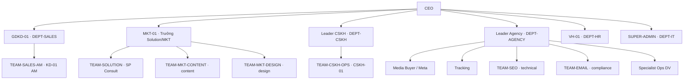
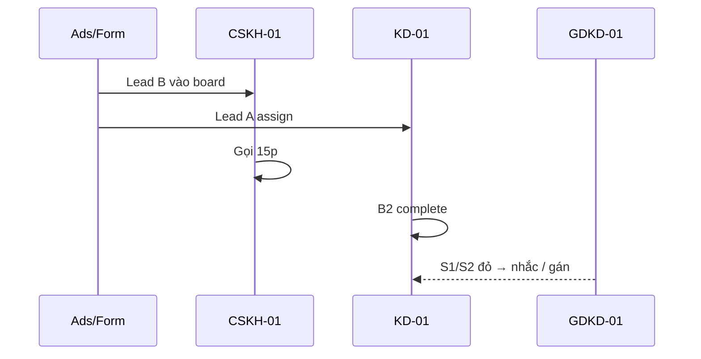
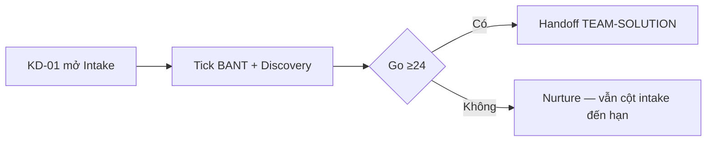
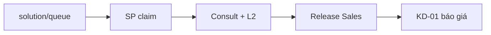
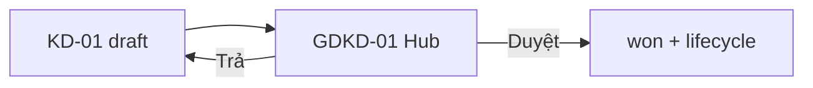
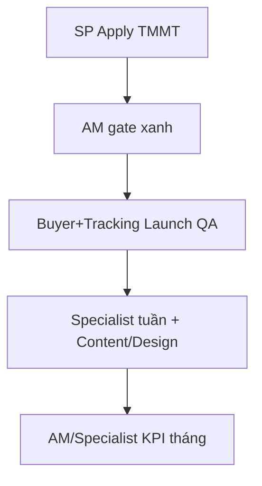
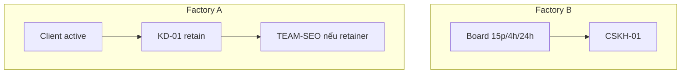
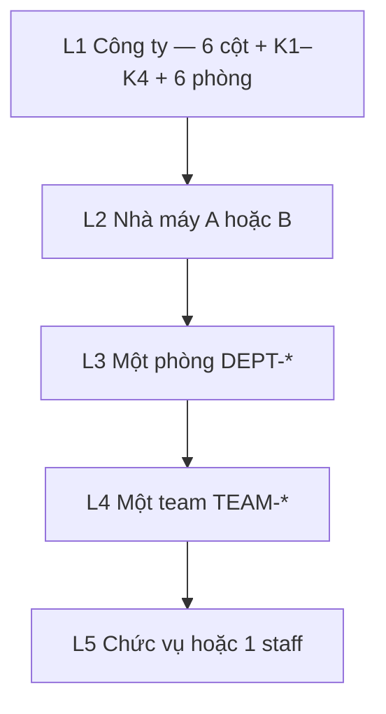
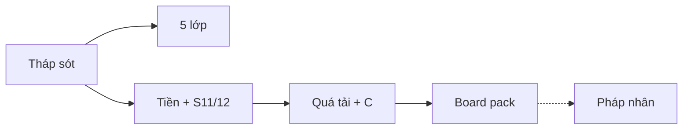

# CEO Lifecycle Tower — Tháp chu trình Lead → TMMT → CSKH

> **Document ID:** CEO-TOWER-20260901  
> **Phiên bản:** 1.3 · **Ngày:** 2026-09-01  
> **Trạng thái:** Plan ready — [`2026-09-01-ceo-lifecycle-tower.md`](../plans/2026-09-01-ceo-lifecycle-tower.md)  
> **Route:** `/crm/ceo` (cùng trang ChatBox — **panel trên**, chat **dưới**)  
> **Sibling:** [CEO Command ChatBox SRS](./2026-08-30-ceo-command-oss-chatbox-srs.md) · [Lifecycle UI](../../huong-dan-su-dung/27-lifecycle-ui-huong-dan-day-du.md) · [RBAC org](../../specs/2026-08-07-rbac-hr-org-job-function-design.md) · [Playbook learn](./2026-09-01-mkt-ai-playbook-learn-catalog-design.md)  
> **Quyết định đã chốt:** Một **cột sống 6 cột** + **hàng chờ sót** (chỉ vàng/đỏ). CEO quan sát ngoại lệ, không inventory. Không trộn Factory A (agency) và Factory B (CSKH spa) trên cùng hàng.  
> **1.2:** Lăng kính 5 lớp + sơ đồ / RACI toàn catalog org.  
> **1.3:** Lớp **CEO công ty lớn** — strip tiền, năng lực/quá tải, S11–S12, 2 lệnh C mới, board pack tuần, đa pháp nhân opt-in (§19–§24).

---

## 1. Tóm tắt

RNOSAI đã có đủ công đoạn Lead → HĐ → TMMT → Deliver → Retain và CSKH spa, nhưng **rải nhiều màn**. CEO không thể mở 14 tab mỗi sáng mà vẫn sót.

**Tháp chu trình** là lớp đọc + hàng chờ trên `/crm/ceo`:

- Sáu cột = ống dẫn đã gộp.  
- Mỗi entity (lead A, lifecycle A, hoặc lead B) thuộc **đúng một cột “việc hiện tại”**. Quá SLA → bắt buộc vào hàng chờ.  
- Mười cảm biến (§6) = bộ câu “không sót”. Thẻ Chat **Hôm nay** dùng **cùng** cảm biến — không invent KPI.  
- Bấm dòng → màn chuyên môn đã ship. Can thiệp ghi hệ = catalog C hiện có (confirm 2 bước). **Không** Apply TMMT / tick BANT / gửi khách từ tháp.  
- **Lăng kính 5 lớp (§18):** cùng một hàng chờ, CEO thu/phóng Công ty → Nhà máy → Phòng → Bộ phận → Chức vụ / người. Mọi phòng trong catalog org có chỗ trên tháp hoặc ô **Ngoài chu trình**.  
- **CEO công ty lớn (§19–§24):** strip tiền, quá tải người, S11/S12, nhắc duyệt HĐ / ưu tiên SP, board pack 1 trang, pháp nhân opt-in.

**Pitch 1 câu:** CEO thấy ống dẫn, việc sót, **đúng phòng / đúng người**, tiền và quá tải; họp tuần một trang — không soạn plan hộ team.

---

## 2. Mục tiêu & phạm vi

### 2.1. Mục tiêu

| # | Mục tiêu | Đo thành công |
|---|----------|----------------|
| G1 | Một trang thấy cả chu trình A + B | 6 cột + K1–K4 + count sót; load ≤ 3s khi cache nóng (cùng SLA briefing) |
| G2 | Không sót = không “treo không cột” | Mọi entity in-scope 90 ngày có `tower_column` + `severity`; test invariant §14 |
| G3 | CEO chỉ làm việc đỏ/vàng | Hàng chờ mặc định **ẩn xanh**; sort đỏ → quá hạn → giá trị HĐ giảm dần |
| G4 | Drill đúng nhà máy | A không mở CSKH board; B không mở TMMT |
| G5 | Catalog C đóng | 6 action CEO-3 + **đúng 2** action §20; duyệt HĐ = Hub; confirm 2 bước |
| G6 | Không phá ChatBox | Panel tháp **trên** thread; chip Hôm nay vẫn chạy; nguồn fail → cột `degraded`, không 500 cả trang |
| G7 | Thấu suốt tổ chức | CEO zoom 5 lớp §18; mọi phòng catalog §16 có ≥1 cảm biến hoặc ô **Ngoài chu trình** (không im lặng) |
| G8 | CEO công ty lớn | Strip tiền 5 ô + capacity 5 người quá tải + S11/S12 + board pack 1 trang; thiếu cap/cột = `degraded`, không bịa số |

### 2.2. In scope

- Panel `CeoLifecycleTower` trên `/crm/ceo`.  
- API đọc `GET /api/crm/ceo/tower` (facts + exceptions).  
- Bộ cảm biến S1–S10, SLA cột, severity.  
- Filter: `factory=A|B|both` (mặc định `both`), `department`, `team`, `position_code`, `staff_id` (§18).  
- Cửa sổ `7d` (exception) / K-strip dùng cửa sổ Owner Weekly 90 ngày đến cuối tuần.  
- Drill `href` + `suggest_action` (chip C, không auto-commit).  
- Panel **Theo phòng** + sơ đồ RACI (§16–§17).  
- Lớp công ty lớn §19–§24 (tiền, capacity, S11–S12, C mới, board pack, entity).  
- Loại seed UAT (`mkt-ai-smoke-seed`, lead id ≥ 900000901).

### 2.3. Out of scope (cố ý)

- Kanban kéo thả đổi stage.  
- Approve HĐ / Apply TMMT / Complete Intake / spawn week / ghi KPI Ops / pause ads từ tháp.  
- Auto-email / Zalo khách (BR-AI-01).  
- Thay `/crm/owner-weekly`, `/crm/cskh-board`, `/crm/hub`, service-delivery.  
- Gộp HR/lương vào tháp v1 (cùng CEO-A).  
- Chat đa người; cron ping CEO mỗi phút.

### 2.4. Không phá

- Catalog C 6 action + 2 action §20, confirm, idempotency.  
- `NL_QUERY_CATALOG` / number gate.  
- K1–K4 công thức Owner Weekly (reuse query, không tính KPI thứ hai).  
- Journey NBA trên lead detail.

---

## 3. Hai nhà máy (bắt buộc tách hàng)

| Factory | Entity trên tháp | `factory` | Không hiện |
|---------|------------------|-----------|------------|
| **A — Agency B2B** | Lead `b2b_prospect` (pre-won) **hoặc** lifecycle gắn lead đó (post-won) | `A` | CSKH board, K4 trên hàng này |
| **B — CSKH spa** | Lead `spa_operational` (có `client_id`) | `B` | Cột Tư vấn/HĐ/TMMT agency |

**Một hàng = một entity.** Pre-won A: `lead_id`. Post-won A (đã promote / có lifecycle): **gộp thành một hàng lifecycle** (không nhân đôi lead + LC). B: luôn `lead_id`.

Toggle **A / B / Cả hai**:  
- `A`: ẩn cột **CSKH/Retain** phần B; cột 6 chỉ **Retain agency**.  
- `B`: chỉ cột **Lead/B2** (nếu dùng B2 spa) + **CSKH** (SLA 15p/4h/24h). Cột Intake/Tư vấn/HĐ/TMMT **trống + nhãn “Không dùng Factory B”**.  
- `both` (mặc định): 6 cột; hàng A và B **không trộn** (badge `A`/`B` trên mỗi dòng).

---

## 4. Sáu cột

| `column_id` | Nhãn UI | Công đoạn | Entity điển hình |
|-------------|---------|-----------|------------------|
| `lead_b2` | Lead / B2 | A1–A2 · B mới vào | Lead chưa `b2_done` (A) hoặc chưa first-call (B — khi filter B) |
| `intake` | Intake | A3–A4 | A: `b2_done`, chưa `intake_go` |
| `consult` | Tư vấn / Báo giá | A5–A6 | A: Go, chưa HĐ draft-active / chưa gửi GDKD |
| `contract` | HĐ | A7 | A: HĐ draft/pending duyệt, chưa `won`+lifecycle |
| `tmmt_deliver` | TMMT / QA / Deliver | A8–A12 | A: lifecycle onboard…deliver, chưa `client_active` **hoặc** đang deliver KPI/QA/Ops đỏ |
| `care` | CSKH / Retain | A13 + B1 | A: `client_active` / retain · B: trên CSKH board |

**Invariant — đúng một cột:**

```
A pre-won:
  !b2_done                    → lead_b2
  b2_done && !intake_go       → intake
  intake_go && !contract_pending_or_active → consult
  contract pending/draft      → contract
A post-won:
  lifecycle && !client_active → tmmt_deliver
  client_active || retain     → care
B:
  luôn care nếu đã vào board; nếu chưa first_call và chưa breach khác → lead_b2 khi filter B, else care
```

Nếu lead A `won` nhưng **chưa** có lifecycle (lỗi promote): cột `contract`, severity **red**, cảm biến S4 — không để rơi ngoài tháp.

---

## 5. SLA & severity từng cột

Mốc thời gian = `now - clock_start`. `clock_start` ghi dưới. **Amber** = cảnh báo. **Red** = sót / CEO phải thấy trên hàng chờ. Xanh = đạt, **không** vào queue mặc định.

Target K1–K4 **đọc từ Owner Weekly** (DB/env `PTT_OWNER_WEEKLY_*`). Không hard-code lệch K-strip. Số dưới đây = default khi chưa configure.

### 5.1. Bảng SLA

| Cột | Đồng hồ bắt đầu | Amber | Red | Metric tuần (strip) |
|-----|-----------------|-------|-----|---------------------|
| `lead_b2` A | `leads.created_at` (hoặc `received_at`) | Không owner **2h** hoặc chưa B2 **4h** | Không owner **4h** hoặc chưa B2 **8h** (480 phút = K1) | K1 median ≤ 480 phút |
| `lead_b2` B | Lead vào board | — | First call 15p **breach** (tier `first_call_15m`) | K4 ≥ 85% (cột `care` cũng đếm) |
| `intake` | `b2_done.at` | Chưa Go **3 ngày** | Chưa Go **5 ngày** (K2) | K2 median ≤ 5 ngày |
| `consult` | `intake_go.at` | Chưa HĐ draft **5 ngày** | **10 ngày** hoặc queue SP SLA vượt (nếu service queue có due) | — |
| `contract` | HĐ `submitted_at` (gửi GDKD) hoặc `created_at` draft | Pending **24h** | Pending **48h** · hoặc `won` không lifecycle **24h** | — |
| `tmmt_deliver` | `contract_active.at` (promote) | Onboard không TMMT gate xanh **5 ngày** | **7 ngày** chưa TMMT xanh; **hoặc** Launch QA fail mà stage deliver; **hoặc** Ops task overdue; **hoặc** ngày tới `client_active` > K3 (14n) | K3 median ≤ 14 ngày |
| `care` A | `client_active.at` | KPI tháng Ops **Cần chú ý** | KPI **Không đạt** hoặc HĐ hết hạn **≤ 30 ngày** chưa việc giữ chân | — |
| `care` B | Clock SLA board | Warning tier (sắp vỡ) | Breach `first_call_15m` / `b2_complete_4h` / `close_24h` | K4 ≥ 85% |

**Cột đếm:** `amber_count` / `red_count` / `ok_count` (ok không hiện list). Header cột: `red` nếu `red_count>0`, else `amber` nếu `amber_count>0`, else `ok`.

### 5.2. Quality gates trong `tmmt_deliver` (không phải đồng hồ)

| Điều kiện | Severity | Ghi chú |
|-----------|----------|---------|
| Lifecycle onboard/deliver, không TMMT official **hoặc** gate TMMT đỏ | red nếu ≥7 ngày từ promote; amber 5–7 ngày | S5 |
| Quality score Apply &lt; 60 mà AM đã chuyển deliver | red | S5 |
| Launch QA bắt buộc (flag) mà **fail** + stage ≥ deliver | red | S6 |
| Ops alert `open` hoặc task tuần `overdue` | red nếu overdue; amber nếu due hôm nay | S7 |
| Closed-loop CPL lệch &gt; 40% worse (nếu có số) | amber (CEO không pause ads) | S7 — chỉ quan sát |

---

## 6. Mười cảm biến (S1–S10)

Mỗi cảm biến = query đọc. **Fail → ≥1 hàng** trên queue (trừ khi entity ngoài cửa sổ hoặc seed). Thiếu dữ liệu module (flag off) → `degraded`, **không** giả fail.

| ID | Câu CEO | Factory | Cột | Fail khi | `suggest_action` |
|----|---------|---------|-----|----------|------------------|
| **S1** | Lead A mới > 4h chưa owner? | A | `lead_b2` | `owner_id` null và tuổi ≥ 4h | `assign_lead` |
| **S2** | B2 / Intake chậm K1 K2? | A | `lead_b2` / `intake` | Đồng hồ ≥ red §5.1 | `remind_staff` (AM) |
| **S3** | Go rồi chưa vào queue Solution? | A | `consult` | `intake_go` và không có handoff/consult session và tuổi ≥ 24h | `prioritize_solution_queue` (§20) |
| **S4** | HĐ chờ duyệt > 48h? (hoặc won không LC > 24h) | A | `contract` | §5.1 red | `remind_contract_approval` (§20) — **không** duyệt |
| **S5** | Won > 7 ngày chưa TMMT xanh? | A | `tmmt_deliver` | Promote ≥7 ngày, gate TMMT không pass | `remind_staff` (SP) |
| **S6** | Deliver khi Launch QA đỏ? | A | `tmmt_deliver` | Stage ≥ deliver + QA fail | `remind_staff` (AM) |
| **S7** | Ops overdue / KPI tháng đỏ? | A | `tmmt_deliver` hoặc `care` | Alert open overdue hoặc KPI Không đạt | `ack_ops_alert` nếu có `alert_id` |
| **S8** | K3 — active chậm > 14 ngày? | A | `tmmt_deliver` | `contract_active` ≥ 14 ngày, chưa `client_active` | `remind_staff` (AM Agency) |
| **S9** | Factory B vỡ 15p/4h/24h? | B | `care` (hoặc `lead_b2` nếu 15p) | Tier breach | `sla_remind_lead` |
| **S10** | Retain: HĐ ≤30 ngày hết hạn hoặc KPI retain đỏ? | A | `care` | `end_date` ≤ 30 ngày hoặc KPI đỏ | `remind_staff` |
| **S11** | Top-1 khách > 40% DT (cửa sổ Owner Weekly)? | A | `care` (rollup công ty, 1 hàng) | `top1_share_pct` > `top1_share_max_pct` (default **40**, cùng Owner Weekly) | *null* — drill `/crm/owner-weekly` + `/crm/business-dashboard` |
| **S12** | Retain / client active không AM owner? | A | `care` | `client_active` hoặc stage retain và `owner_id` null | `assign_lead` hoặc `remind_staff` GDKD |

S11 là **một hàng công ty** (không nhân theo khách). S12 = từng lifecycle/client.

**Strip K trên header tháp:** 4 ô K1–K4 (màu RAG Owner Weekly). Click K → `/crm/owner-weekly` + filter metric. K đỏ **không** thay thế S1–S12 (K = median tuần; S = từng entity / 1 hàng tập trung).

Cửa sổ **exception list:** mặc định entity có activity hoặc đồng hồ còn chạy trong **7 ngày**; **cộng** mọi hàng đang red/amber dù cũ hơn (HĐ pending 10 ngày vẫn hiện). Không cắt red vì ngoài 7 ngày.

---

## 7. Hàng chờ sót

`exceptions[]` tối đa **40** hàng / request (phan trang `cursor`). Mặc định filter `severity in (red, amber)`.

| Field | Ý nghĩa |
|-------|---------|
| `factory` | `A` \| `B` |
| `column_id` | Một trong 6 |
| `sensor_ids` | S1–S12 khớp |
| `severity` | `red` \| `amber` |
| `title_vi` | VD. “HĐ #42 chờ duyệt 36h” |
| `entity_type` | `lead` \| `lifecycle` |
| `entity_id` | số |
| `owner_name` | AM/SP hiện tại |
| `age_label` | “36h” / “9 ngày” |
| `value_vnd` | HĐ/pipeline nếu có — sort |
| `department_code` | `DEPT-*` của **owner chịu trách nhiệm** hàng này (§16) |
| `team_code` | `TEAM-*` |
| `position_code` | `KD-01` / `MKT-02` / … |
| `job_function` | `sales` / `content` / … nếu có |
| `href` | Drill §8 |
| `suggest_action` | id C hoặc null |
| `suggest_params` | id đích đã validate |

**Sort:** `severity` red trước → `age` giảm dần → `value_vnd` giảm dần.

**Cấm:** “Xác nhận tất cả”. Mỗi hành động C một confirm (CEO-3).

---

## 8. Drill

Mọi `href` là route ops-web đã tồn tại. Tháp **không** embed form soạn.

| Cột / cảm biến | `href` |
|----------------|--------|
| `lead_b2`, `intake`, S1–S3 | `/crm/leads/{id}` (+ hash `#funnel-b2` / intake nếu có) |
| Queue Solution S3 | `/crm/solution/queue` nếu không có `lead_id` đơn |
| `contract`, S4 | `/crm/hub` hoặc `/crm/leads/{id}#lead-contract` |
| `tmmt_deliver`, S5–S8 | `/crm/service-delivery/{lifecycleId}` — S5 `?tab=ai-planner` · S6 `?tab=launch-qa` · S7 `?tab=ops-hub` |
| Agency activate S8 | `/agency/clients/{uuid}` nếu đã có client |
| `care` B, S9 | `/crm/cskh-board?lead_id=` hoặc `?sla=first_call_15m` |
| `care` A, S10 | `/crm/service-delivery/{id}?tab=ops-hub` hoặc agency client |
| K1–K4 strip | `/crm/owner-weekly` |
| Cột header click | Cùng trang: filter `column_id` + `severity=red,amber` (không điều hướng) |
| Ô phòng §18 | Cùng trang: `department=` · click team → `team=` · click người → `staff_id=` |
| Org chart | `/crm/staff` (roster) — không sửa HR từ tháp |

Factory A **cấm** `href` `/crm/cskh-board`. Factory B **cấm** `?tab=ai-planner`.

---

## 9. Cap & quyền

### 9.1. Xem tháp

Cùng cửa ChatBox: `ceo_command.view` **hoặc** `ai_analytics.query` **hoặc** `crm_business_dashboard.view` **hoặc** `ai_admin.view` **hoặc** `crm_owner_weekly_dashboard.view`.

Thiếu `ceo_command.view` nhưng có Owner Weekly: **vẫn** xem tháp (đọc). Nút C ẩn nếu thiếu `ceo_command.act`.

### 9.2. Từng nguồn — thiếu cap thì degraded, không 403 cả tháp

| Nguồn cột | Cap tối thiểu để **điền** cột | Thiếu thì |
|-----------|------------------------------|-----------|
| Lead / B2 / Intake / Consult | `crm_leads.view` | Cột 1–3 `degraded` |
| HĐ / Hub | cap contract view hiện có trên Hub (`crm_leads.view` + contract) | Cột `contract` degraded |
| TMMT / lifecycle | `crm_board.view` | Cột `tmmt_deliver` degraded |
| Ops alert / KPI | `StaffOpsView` / ops view | S7 degraded |
| Launch QA | cùng board view | S6 bỏ qua nếu module tắt |
| CSKH / K4 | view CSKH board | Cột `care` B + K4 degraded |
| K-strip | `crm_owner_weekly_dashboard.view` | Ẩn 4 ô K; exception S vẫn chạy nếu có cap lead/board |

CEO **không** thấy lead ngoài visibility B2B/CSKH của chính họ — reuse guard list lead/lifecycle hiện tại (không bypass như CEO Command cấm `staffId≤0`).

### 9.3. Hành động

| Việc | Cap |
|------|-----|
| Chip C trên dòng | `ceo_command.act` **và** cap gốc action (CEO-3 §9.2) |
| Duyệt HĐ | **Không** từ tháp — `href` Hub + cap duyệt HĐ trên Hub |
| Gán lead | `assign_lead` + `crm_leads.assign` |
| Nhắc AM/SP | `remind_staff` + `ceo_command.act` |
| Nhắc SLA B | `sla_remind_lead` + `crm_leads.edit` |
| Ack Ops | `ack_ops_alert` + ops write |
| Nhắc duyệt HĐ | `remind_contract_approval` + `ceo_command.act` — **không** đổi status HĐ |
| Ưu tiên queue SP | `prioritize_solution_queue` + `ceo_command.act` |

Giữ danh sách cấm CEO-3 §9.4 (lương, RBAC, xóa, ads, mail khách, spawn week, complete Intake, **approve HĐ**).

---

## 10. API

`GET /api/crm/ceo/tower`

Query:

| Param | Default | Ghi chú |
|-------|---------|---------|
| `factory` | `both` | `A` \| `B` \| `both` |
| `column_id` | — | Filter một cột |
| `department` | — | `DEPT-SALES` … — lọc hàng theo owner.dept |
| `team` | — | `TEAM-SALES-AM` … |
| `position_code` | — | `KD-01` … |
| `staff_id` | — | Một người (owner hoặc specialist trên task đỏ) |
| `legal_entity_id` | — | Chỉ khi `PTT_CEO_TOWER_LEGAL_ENTITY=1` (§23) |
| `severity` | `red,amber` | `red` \| `amber` \| `ok` (ok chỉ khi debug + `ceo_command.configure`) |
| `limit` | 40 | max 80 |
| `cursor` | — | Phân trang exception |

Response (rút gọn):

```ts
{
  ok: true;
  generated_at: string;
  window_exception_days: 7;
  k_strip: Array<{ key: 'k1'|'k2'|'k3'|'k4'; value: number|null; status: 'green'|'amber'|'red'|'neutral'; href: string }>;
  columns: Array<{
    column_id: string;
    red_count: number;
    amber_count: number;
    ok_count: number;
    header_severity: 'red'|'amber'|'ok';
    degraded?: { reason: string };
  }>;
  exceptions: Array</* §7 */>;
  org_rollup: Array<{
    level: 'company'|'factory'|'department'|'team'|'position'|'staff';
    code: string;
    label_vi: string;
    red_count: number;
    amber_count: number;
    outside_cycle?: boolean;
  }>;
  next_cursor: string | null;
  degraded: Array<{ source: string; reason: string }>;
  sensors_ok: Record<'S1'|…|'S12', 'ok'|'fail'|'degraded'>;
  finance_strip?: /* §19 */;
  capacity_top?: /* §21 */;
  legal_entity_id?: string | null;
}
```

Timeout từng nguồn **2.5s** (cùng briefing). Cache 60s per `(staffId, factory, department, team, position_code, staff_id)`.

**Không** POST mutate trên `/tower`. Commit vẫn `POST /api/crm/ceo/actions/commit`.

Chat briefing A: `BriefingComposer` **gọi lại** cùng hàm cảm biến (shared `CeoTowerSensorService`) để thẻ Hôm nay khớp tháp — không hai công thức.

---

## 11. UI `/crm/ceo`

```
[ Breadcrumb 5 lớp ]  Công ty › A Agency › DEPT-SALES › TEAM-SALES-AM › KD-01 › Nguyễn V.
[ Tháp chu trình ]  A | B | Cả hai     28 sót · 6 đỏ
[ K1 ] [ K2 ] [ K3 ] [ K4 ]
[ Tiền | AR | DT30 | Top-1% | GM% ]     [ Quá tải: 5 người ]
[ Lead/B2 ][ Intake ][ Tư vấn ][ HĐ ][ TMMT/QA ][ CSKH ]
[ Theo phòng: Sales 8đ | Solution 3đ | CSKH 5đ | Agency 2đ | HR/IT ngoài chu trình ]
[ Hàng chờ sót — cột org: phòng · team · chức vụ · người ]
[ ─── ChatBox hiện tại (A/B/C) ─── ]
```

- Cột: số đỏ/vàng; click = filter list.  
- Hàng: badge A/B, **phòng/team/chức vụ**, title, tuổi, owner, **Mở**, **Gợi ý** C.  
- `org_rollup`: click phòng → breadcrumb + filter API.  
- `degraded`: chip xám — không để cột giả 0 sót.  
- Mobile: K + list sót + chip phòng; 6 cột scroll ngang.  
- Học `/crm/ceo/learn` không đổi.

VQ: không JSON thô; không dump 200 lead xanh; empty state “Không sót trong cửa sổ — kiểm tra degraded”.

---

## 12. Pha

| Phase | Việc | Xong khi |
|-------|------|----------|
| **T0** | `CeoTowerSensorService` S1–S10 + unit invariant một cột | 10 test cảm biến + 0 entity “no column” trên fixture |
| **T1** | `GET /tower` + panel 6 cột + queue trên `/crm/ceo` | CEO view: đếm khớp fixture; drill 6 href |
| **T2** | Gắn `suggest_action` → confirm C hiện có | Assign / remind / SLA / ack từ hàng chờ |
| **T3** | Briefing Hôm nay dùng chung sensor | Thẻ A ⊆ union exception red (không KPI lạ) |
| **T4** | `org_rollup` + breadcrumb 5 lớp + filter dept/team/chức vụ | Mọi `DEPT-*` catalog hiện trên panel (kể cả *Ngoài chu trình*); click lọc đúng hàng |
| **T5** | Strip tiền §19 + S11 + S12 | 5 ô; thiếu finance cap = degraded; S11 một hàng công ty |
| **T6** | Capacity §21 + 2 action C §20 | Top 5 quá tải; remind HĐ / ưu tiên queue confirm |
| **T7** | Board pack §22 | `GET .../board-pack` in được 1 trang; số = facts |
| **T8** | Đa pháp nhân §23 | Flag off mặc định; bật mới hiện filter entity |

T0–T2 = CEO dùng ống dẫn. T5–T7 = tầm công ty lớn. T8 chỉ khi có >1 MST. T3 sau CEO-1. T4 không chặn T1.

---

## 13. Kiểm thử

| Loại | Case |
|------|------|
| Unit | Mọi combo milestone → đúng `column_id` (§4) |
| Unit | SLA amber/red đúng phút/ngày (§5) |
| Unit | Seed / id ≥ 900000901 loại |
| Unit | A không sinh href CSKH; B không sinh ai-planner |
| API | Thiếu ops cap → S7 degraded, S1 vẫn chạy |
| API | `severity=ok` 403 nếu không configure |
| E2e | Mở `/crm/ceo` — thấy 6 cột; click HĐ → Hub; click TMMT → service-delivery |
| E2e | Không commit C khi chỉ xem |
| Invariant nightly (staging) | `COUNT(*) WHERE tower_column IS NULL` trên in-scope = 0 |
| Unit | Mọi `DEPT-*` §16.1 có `outside_cycle` hoặc ≥1 sensor |
| E2e | Breadcrumb Sales → TEAM-SALES-AM → chỉ hàng AM |
| Unit | S11 fail khi top1 > 40%; S12 fail khi retain không owner |
| API | Thiếu finance cap → `finance_strip` absent + degraded, không `0 ₫` |
| API | `remind_contract_approval` không đổi status HĐ |
| E2e | Board pack in được; mọi số có trong `facts_json` |

---

## 16. Tổ chức PTT — sơ đồ & ma trận không sót

Nguồn catalog: [`rbac-hr-org-job-function-design.md`](../../specs/2026-08-07-rbac-hr-org-job-function-design.md) §3. **Không** invent phòng ngoài bảng. Phòng không nằm trên ống Lead→TMMT→CSKH phải hiện **Ngoài chu trình** (HR, IT) — CEO biết “không theo dõi ở đây”, không tưởng là 0 việc.

### 16.1. Sơ đồ tổ chức (công ty)



### 16.1.1. Phòng · bộ phận · chức vụ · job function

| Phòng `department` | Bộ phận / team | Chức vụ `position` | Job function | Việc trên chu trình |
|--------------------|----------------|--------------------|--------------|---------------------|
| `DEPT-SALES` | `TEAM-SALES-GDKD` | `GDKD-01` | `leader` | Duyệt HĐ, K1–K4, override deal lớn |
| `DEPT-SALES` | `TEAM-SALES-AM` | `KD-01` | `sales` | B2, Intake, quote, HĐ draft, onboard, retain AM |
| `DEPT-SOLUTION` | `TEAM-SOLUTION` | `MKT-01` / `MKT-02` | `leader` / — | Queue tư vấn, Consult, L1/R5, TMMT Apply, playbook duyệt |
| `DEPT-SOLUTION` | `TEAM-MKT-CONTENT` | `MKT-02` + `content` | `content` | Content OS, calendar, SEO write |
| `DEPT-SOLUTION` | `TEAM-MKT-DESIGN` | `MKT-02` + `design` | `design` | Creative, campaign write view |
| `DEPT-CSKH` | `TEAM-CSKH-OPS` | `CSKH-01` | `ops` | Factory B board 15p/4h/24h, B2 spa |
| `DEPT-AGENCY` | Buyer / Tracking (ops DV) | (gán roster Agency) | `ops` / `design` | Launch QA, ads, pixel |
| `DEPT-AGENCY` | `TEAM-SEO` | + `technical` | `technical` | SEO deliver, GSC |
| `DEPT-AGENCY` | `TEAM-EMAIL` | + `compliance` | `compliance` | Email OS, deliverability |
| `DEPT-AGENCY` | Specialist checklist | — | `ops` | Ops Hub task tuần |
| `DEPT-HR` | Roster / org | `VH-01` | `ops` | **Ngoài chu trình** — `/admin/crm/org`, `/crm/staff` |
| `DEPT-IT` | Admin / flag | `SUPER-ADMIN` | — | **Ngoài chu trình** — flag, kill-switch, quyền |

`analyst` (BI) = **đọc** dashboard / export; không owner hàng chờ trừ khi kiêm AM. Hiện rollup `function=analyst` với `outside_cycle=true` nếu không có lead/lifecycle owner.

### 16.2. Sơ đồ ống dẫn × phòng (không sót cột)

```mermaid
flowchart LR
  subgraph C1["Lead/B2"]
    CSKH1[CSKH-01]
    AM1[KD-01]
  end
  subgraph C2["Intake"]
    AM2[KD-01]
  end
  subgraph C3["Tư vấn"]
    SP[TEAM-SOLUTION]
    AM3[KD-01 quote]
  end
  subgraph C4["HĐ"]
    AM4[KD-01]
    GDKD1[GDKD-01]
  end
  subgraph C5["TMMT/QA/Deliver"]
    SP2[SP Apply]
    CNT2[Content]
    DES2[Design]
    BUY2[Buyer]
    TRK2[Tracking]
    SPE2[Specialist]
    AM5[AM triển khai]
  end
  subgraph C6["CSKH/Retain"]
    CSKH2[CSKH board B]
    AM6[AM retain A]
    SEO2[SEO]
  end
  C1 --> C2 --> C3 --> C4 --> C5 --> C6
```



### 16.3. RACI toàn chức vụ × 6 cột

**R** = làm · **A** = chịu trách nhiệm cột với CEO · **C** = consult · **I** = thông tin · **—** = không vào cột.

| Vai / chức vụ | Lead/B2 | Intake | Tư vấn | HĐ | TMMT/Deliver | CSKH/Retain |
|---------------|---------|--------|--------|----|--------------|-------------|
| **CEO** | I (S1 đỏ) | I | I | **A** duyệt qua Hub | I (S5–S8) | I (S9–S10) |
| **GDKD-01** | A K1 | A K2 | C | **A** approve | I K3 | I K4 |
| **KD-01 AM** | **R/A** B2 | **R/A** | R quote | **R** soạn | **A** gate / onboard | **A** retain A |
| **MKT-01** Lead Solution | I | C | **A** queue | C | **A** playbook / TMMT chất lượng | C |
| **MKT-02 SP** | — | C L1 | **R** consult | C | **R** Apply TMMT | — |
| **content** | — | — | C | — | **R** Content OS | C SEO |
| **design** | — | — | — | — | **R** creative | — |
| **CSKH-01** | **R** B nếu spa / A1 nguồn | — | — | — | — | **R/A** Factory B |
| **Leader CSKH** | A board | — | — | — | — | **A** K4 |
| **Media Buyer** | — | — | — | — | **R** ads / QA ads | C |
| **Tracking** | — | — | — | — | **R** pixel CAPI | — |
| **Specialist Ops** | — | — | — | — | **R** task tuần | **R** KPI tháng |
| **technical SEO** | — | — | C | — | **R** nếu slug SEO | **R** retainer SEO |
| **compliance Email** | — | — | — | — | **R** nếu slug email | C |
| **VH-01 HR** | — | — | — | — | — | Ngoài chu trình |
| **SUPER-ADMIN** | — | — | — | — | — | Ngoài chu trình |
| **analyst** | I | I | I | I | I | I |

Owner **mặc định trên hàng chờ** = người **R** của cột hiện tại (nếu nhiều R: ưu tiên AM với Sales; SP với `consult`/`tmmt` khi sensor S3/S5; CSKH với S9; Specialist với S7 task).

### 16.4. Cảm biến × phòng (không sót S)

| Sensor | Phòng chịu (A trên rollup) | Chức vụ nhắc `remind_staff` |
|--------|----------------------------|-----------------------------|
| S1 | DEPT-SALES (hoặc CSKH nếu nguồn board) | GDKD / Leader AM |
| S2 | DEPT-SALES | AM owner |
| S3 | DEPT-SOLUTION | MKT-01 hoặc SP queue |
| S4 | DEPT-SALES | GDKD (drill Hub, không C) |
| S5 | DEPT-SOLUTION | SP / MKT-01 |
| S6 | DEPT-AGENCY | AM + Buyer |
| S7 | DEPT-AGENCY | Specialist / AM |
| S8 | DEPT-SALES | AM Agency |
| S9 | DEPT-CSKH | CSKH-01 / Leader |
| S10 | DEPT-SALES + Agency nếu KPI | AM; Specialist KPI |
| S11 | Công ty (rollup) | GDKD — chỉ đọc, drill Owner Weekly |
| S12 | DEPT-SALES | GDKD / assign AM |

Mọi S1–S10 map **đúng một phòng A** trên `org_rollup` (S6/S7 = Agency; S10 primary Sales). S11 không gắn phòng (hàng công ty). S12 = Sales. Không S “mồ côi”.

---

## 17. Sơ đồ từng cột — việc & cổng (chi tiết bộ phận)

Mỗi cột: **ai làm → cổng → sót → CEO zoom**.

### 17.1. Lead / B2



### 17.2. Intake



### 17.3. Tư vấn



### 17.4. HĐ



### 17.5. TMMT / QA / Deliver



Khớp playbook §7.0: AI **không** nằm trên sơ đồ triển khai; chỉ hỗ trợ SP trước Apply.

### 17.6. CSKH / Retain



---

## 18. Lăng kính CEO — 5 lớp (tổng quát → chi tiết)

CEO **không** đổi công thức cảm biến khi zoom. Chỉ đổi `org_rollup` + filter exception.



| Lớp | UI | API | CEO thấy | Can thiệp |
|-----|-----|-----|----------|-----------|
| **1 Công ty** | Mặc định | `factory=both` | 6 cột, mọi phòng, hàng chờ 40 | Chip C / Hub |
| **2 Nhà máy** | Toggle A/B | `factory=A\|B` | Ẩn cột không dùng (§3) | Như trên, đúng factory |
| **3 Phòng** | Click ô phòng | `department=` | Chỉ hàng owner thuộc phòng | Nhắc leader phòng |
| **4 Bộ phận** | Click team | `team=` | VD. chỉ TEAM-SALES-AM | Gán / nhắc AM |
| **5 Chức vụ / người** | Click tên / `position_code` | `position_code=` hoặc `staff_id=` | Việc sót của 1 vai hoặc 1 NV | `assign_lead` / `remind_staff` đúng người |

Breadcrumb luôn hiện; **×** về L1. URL query đồng bộ (`?dept=&team=&staff=`) để CEO gửi link GDKD.

**Không sót tổ chức:** `org_rollup` level `department` **bắt buộc đủ 6 code** §16.1.1. HR/IT: `outside_cycle=true`, `red_count=0`, click → empty state *“Không theo dõi trên tháp — mở /crm/staff hoặc /admin”*.

---

## 19. Strip tiền — CEO công ty lớn

**Nguyên tắc:** Chỉ **đọc** số đã có trên Owner Weekly / financials / NL catalog. Không sổ cái mới. Thiếu cap `crm_owner_weekly_dashboard.view` hoặc finance view → cả strip `degraded`, 5 ô ẩn, không hiện `0 ₫`.

### 19.1. Năm ô (cùng target Owner Weekly)

| Ô | Field nguồn (default target) | Đỏ khi | Drill |
|---|------------------------------|--------|-------|
| Tiền an toàn | `cash_safe` vs `cash_safe_min_vnd` | Dưới target | `/crm/owner-weekly` khối Tiền |
| AR quá hạn | `ar_overdue` vs `ar_overdue_max_vnd` | Trên trần | `/crm/financials` |
| DT 30 ngày | `revenue_received_30d` (NL) | Không so target tuần — chỉ hiện số; amber nếu 0 | `/crm/business-dashboard` |
| Top-1 DT | `top1_share_pct` vs **40%** (`top1_share_max_pct`) | > 40% → bật S11 | Owner Weekly |
| Margin | `gross_margin` vs `gross_margin_target_pct` | Dưới target | Owner Weekly |

Công thức **copy** repository Owner Weekly — cấm tính P&L “xấp xỉ” trên tháp.

P&L theo DV / theo phòng: **không** v1. Nếu sau này `financials` có dimension `service_slug`, thêm ô thứ 6 trong revision — không bịa chiều.

### 19.2. UI

Hàng dưới K1–K4: `Tiền | AR | DT30 | Top-1% | GM%`. Click ô = drill. S11 đỏ đồng bộ ô Top-1.

---

## 20. Hai lệnh C mới (catalog đóng)

Mở rộng CEO Command §9.2 — **không** approve HĐ, không đổi stage funnel.

| `action_id` | Việc | Ghi gì | Cap | Cấm |
|-------------|------|--------|-----|------|
| `remind_contract_approval` | Nhắc GDKD duyệt HĐ đang pending | `staff_notifications` tới user `GDKD-01` (hoặc `submitted_to_staff_id` trên HĐ) + `link_href=/crm/hub?...` | `ceo_command.act` | Đổi `status` HĐ; gửi khách |
| `prioritize_solution_queue` | Ưu tiên case trên queue SP | `staff_notifications` tới MKT-01 + note nội bộ trên lead `priority_consult=ceo` trong `meta_json` (hoặc cột `consult_priority` **nếu đã có** — không ADD COLUMN trong T6 nếu chưa có) | `ceo_command.act` | Claim case hộ SP; đổi owner |

Params:

```ts
remind_contract_approval: { lead_id: number; contract_id?: number }
prioritize_solution_queue: { lead_id: number; note?: string } // note ≤200, mask
```

Idempotency 24h như CEO-3. Preview: “Nhắc GDKD duyệt HĐ lead #… ?” / “Ưu tiên queue Solution lead #… ?”

S4 → `remind_contract_approval`. S3 → `prioritize_solution_queue`. CEO vẫn **Mở Hub** để duyệt tay.

---

## 21. Năng lực & quá tải

CEO công ty lớn cần biết **ai đang gãy** — không chỉ việc sót.

`capacity_top[]` tối đa **5** staff, sort `red_owned` giảm dần.

| Field | Ý nghĩa |
|-------|---------|
| `staff_id` / `name` / `department_code` / `position_code` | Roster |
| `red_owned` | Số exception red CEO đang thấy mà họ là owner R |
| `amber_owned` | Tương tự amber |
| `flag` | `ok` \| `amber` \| `red` |

| `flag` | Điều kiện |
|--------|-----------|
| amber | `red_owned ≥ 5` **hoặc** (`red_owned + amber_owned ≥ 10`) |
| red | `red_owned ≥ 8` **hoặc** (`red_owned + amber_owned ≥ 15`) |
| ok | Dưới ngưỡng — **không** vào `capacity_top` |

Click hàng capacity → lăng kính L5 `staff_id=`. Không tính giờ công / HR payroll (ngoài chu trình).

Queue SP: số S3 red của `DEPT-SOLUTION` hiện trên ô phòng — không KPI riêng.

---

## 22. Board pack tuần (1 trang)

**Mục tiêu:** Họp CEO–GDKD 30 phút — một URL/in, không 14 tab.

`GET /api/crm/ceo/tower/board-pack?week=YYYY-Www`  
`week` mặc định = tuần ISO chứa `now` (ICT). Cap = xem tháp.

Payload `facts_json` (mọi số trên trang phải có trong facts — cùng number gate nếu polish):

1. K1–K4 + status  
2. Count red/amber theo 6 cột + theo 6 phòng  
3. Top **10** exception (cùng sort §7)  
4. Năm ô tiền §19  
5. `capacity_top` 5 người  
6. S11/S12 fail?  
7. `degraded[]`  
8. `decisions_blank`: 3 dòng trống *“Quyết định tuần: ___”* — **không** AI điền  

FE: trang `/crm/ceo/board-pack` (print CSS A4). **Không** bắt buộc lib PDF T7. Nút **In / PDF trình duyệt**.

Cron: không gửi mail khách; optional `staff_notifications` cho CEO+GDKD thứ 2 08:00 nếu `PTT_CEO_BOARD_PACK_NOTIFY=1` (mặc định **0**).

---

## 23. Đa pháp nhân (opt-in)

Một VPS / một MST PTT: **tắt**. Không hiện filter.

| Env | Default | Việc |
|-----|---------|------|
| `PTT_CEO_TOWER_LEGAL_ENTITY` | `0` | `1` mới đọc dimension entity |

Khi `1`: query `legal_entity_id`. Nguồn: `contracts.legal_entity_id` **hoặc** `agency_clients.entity_code` — **chỉ nếu cột đã tồn tại**. Không có cột → filter ẩn, `degraded: legal_entity_schema_missing`, không fail tháp, **không** migration bắt buộc trong T8.

Hàng exception gắn `legal_entity_id` khi resolve được; null = “chưa gán entity” (amber trên strip entity, không red).

---

## 24. Thứ tự ship lớp công ty lớn

```text
T0–T2  Ống + sót + C cũ
T4     Zoom phòng
T5     Tiền + S11 + S12
T6     Capacity + 2 C mới
T7     Board pack
T8     Entity (chỉ khi >1 MST)
```

Không làm T8 trước T2. Không LoRA / tool-call tự do. Playbook `_common` (spec MKTP) **song song**, không chặn tháp.



---

## 14. Liên kết

| Tài liệu | Path |
|----------|------|
| CEO Command A/B/C | `docs/superpowers/specs/2026-08-30-ceo-command-oss-chatbox-srs.md` |
| Lifecycle UI / K1–K4 | `docs/huong-dan-su-dung/27-lifecycle-ui-huong-dan-day-du.md` |
| CEO Chat hướng dẫn | `docs/huong-dan-su-dung/28-ceo-command-chatbox.md` |
| Playbook / TMMT (cột 5) | `docs/superpowers/specs/2026-09-01-mkt-ai-playbook-learn-catalog-design.md` |
| Catalog phòng / chức vụ | `docs/specs/2026-08-07-rbac-hr-org-job-function-design.md` |
| BA theo phòng | `docs/specs/2026-08-07-crm-enterprise-business-analysis.md` §5 |

---

## 15. Self-review

- Không TBD: SLA đã chốt; catalog phòng = 6 `DEPT-*` + team/position đã liệt kê.  
- K1–K4 reuse Owner Weekly — không KPI song song.  
- Duyệt HĐ không lách catalog C (drill Hub).  
- Một cột / một entity; hai factory không trộn hàng.  
- Mọi phòng có chỗ trên `org_rollup` (HR/IT = ngoài chu trình). Mọi S map một phòng A.  
- AI/Chat không soạn TMMT từ tháp.  
- §19–§24: tiền reuse Owner Weekly; 2 C không approve HĐ; capacity đếm exception owned; entity mặc định tắt; board pack không AI điền quyết định.

---

*Spec v1.3 — tháp + 5 lớp org + lớp CEO công ty lớn (tiền, quá tải, S11–S12, C, board pack, entity).*
