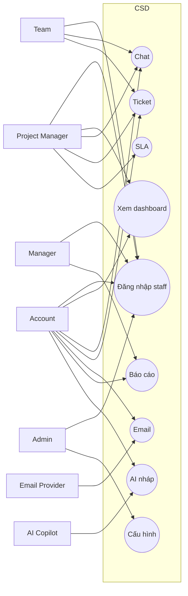
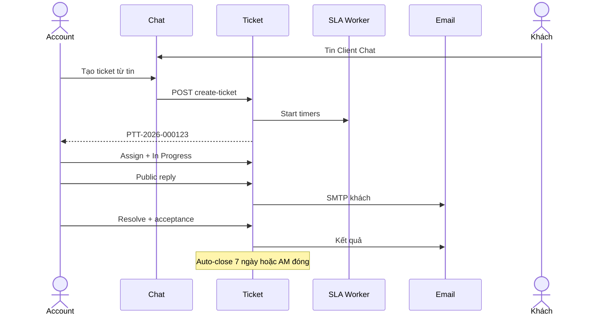

# Use Case — Agency PTT Communication & Service Desk

> **Document ID:** CSD-UC-20260902  
> **Phiên bản:** 1.0 · **Ngày:** 2026-09-02  
> **Trạng thái:** Design  
> **Parent:** [Spec CSD](./2026-09-02-agency-communication-service-desk-design.md)  
> **Plan + DDL:** [2026-09-02-agency-csd.md](../plans/2026-09-02-agency-csd.md) · [DDL](../../specs/2026-09-02-postgresql-ddl-csd.sql)  
> **UX:** [UX/UI CSD](./2026-09-02-agency-csd-ux-ui-design.md)  
> **Nguồn:** [Use case diagram gốc v1.0](./sources/Use_Case_Diagram_Agency_PTT_Communication_Service_Desk.md)  
> **Cách đọc:** §2–§11 = catalog + sơ đồ. §14 = đặc tả đầy đủ (main / alt / exception) cho UC ưu tiên MVP.

---

## 1. Phạm vi sơ đồ

Hệ thống: **Agency PTT Communication & Service Desk** trong RNOSAI.

Có: Chat, Ticket, Email, Report, SLA, Approval, Notification, AI draft, Administration.

Không: CSKH `crm_tickets`, CEO Command thread, VoIP, omnichannel, portal client (phase 2 — UC đánh dấu P2).

---

## 2. Actors

### 2.1. Catalog

| Mã | Actor | Nhóm | Map RNOSAI |
|----|-------|------|------------|
| ACT-01 | Super Admin | Nội bộ | `SUPER-ADMIN` |
| ACT-02 | Agency Admin | Nội bộ | Admin vận hành |
| ACT-03 | Director / Manager | Nội bộ | GDKD, trưởng phòng `leader` |
| ACT-04 | Account Manager | Nội bộ | Job function `am` |
| ACT-05 | Project Manager | Nội bộ | Job function `pm` |
| ACT-06 | Team Member | Nội bộ | design/content/ads/seo/tech |
| ACT-07 | Finance | Nội bộ | kế toán |
| ACT-08 | Client Admin | Khách | P2 portal |
| ACT-09 | Client Contact | Khách | Người gửi chat/email (không login MVP) |
| ACT-10 | Partner | Đối tác | vendor scoped |
| ACT-11 | AI Copilot | Hệ | `actor_type=ai` |
| ACT-12 | Email Provider | Hệ ngoài | SMTP/IMAP |
| ACT-13 | Notification Provider | Hệ ngoài | in-app + SMTP |
| ACT-14 | Marketing Data Provider | Hệ ngoài | P2 |
| ACT-15 | File Storage | Hệ ngoài | disk/MinIO |
| ACT-16 | Identity Provider | Hệ ngoài | staff JWT hiện tại; SSO P2 |

**Generalization:** AgencyUser ← ACT-01…07. ClientUser ← ACT-08…09 (P2). ExternalSystem ← ACT-12…16.

Client Contact **không login** MVP vẫn là actor: gửi email/chat (nếu được mời vào conversation bằng magic link P1.5 hoặc chỉ email).

---

## 3. System boundary

```text
┌──────── Agency PTT CSD (RNOSAI ops-web + ptt-crm-api) ────────┐
│ Chat │ Ticket │ Email │ Report │ SLA │ Notify │ AI │ Admin   │
└───────────────────────────────────────────────────────────────┘
Ngoài: Email Provider, File Storage, (P2) Ads/GA4, IdP
Cạnh nhưng KHÔNG trong boundary: /crm/tickets, /crm/ceo, /crm/cskh-board
```

---

## 4. Overview



---

## 5. Package Chat — UC-CHAT-01…17

Giữ danh sách nguồn §5.3. Quan hệ:

```text
UC-CHAT-01 Create Conversation
  <<include>> UC-CHAT-03 Link Context
  <<include>> UC-CHAT-17 Visibility
UC-CHAT-04 Send Message
  <<include>> UC-CHAT-16 Notify
  <<extend>> UC-CHAT-05 Reply/Mention
  <<extend>> UC-CHAT-06 Attach
  <<extend>> UC-CHAT-10 Ticket from message
  <<extend>> UC-CHAT-11 Action item
UC-CHAT-13 AI Summary
  <<include>> UC-CHAT-14 Extract actions
```

**MVP bắt buộc:** 01, 02, 03, 04, 05, 06, 07, 09, 10, 12, 13, 16, 17.  
**P2:** 08 pin nâng cao, 11 task engine, 15 translate.

---

## 6. Package Ticket — UC-TKT-01…31

```text
UC-TKT-01 Create
  <<include>> UC-TKT-16 Monitor SLA
  <<include>> UC-TKT-30 Notify
UC-TKT-02 From Chat/Email
  <<include>> UC-TKT-01
UC-TKT-05 Triage
  <<include>> UC-TKT-06 Priority
  <<include>> UC-TKT-07 Scope
  <<include>> UC-TKT-08 Assign
UC-TKT-19 Resolve
  <<include>> UC-TKT-29 Resolution text
  <<include>> UC-TKT-20 Request acceptance
UC-TKT-16 Monitor SLA
  <<extend>> UC-TKT-18 Escalate
UC-TKT-07 Scope = Out/Billable
  <<extend>> UC-TKT-26 Change/Quote
```

**MVP:** 01–13, 15–23, 27–28 (AI nháp), 30–31.  
**P2:** 14 time tracking nặng, 24/25 merge-split UX đầy, 29 AI resolution.

---

## 7. Package Email — UC-EML-01…25

Inbound:

```text
UC-EML-02 Sync
  <<include>> UC-EML-23 Spam/auto-reply filter
  <<include>> UC-EML-14 Match contact
      <<include>> UC-EML-15 Link entity
  <<extend>> UC-EML-18 Append ticket
  <<extend>> UC-EML-17 Create ticket
  <<include>> UC-EML-24 Notify
```

Outbound:

```text
UC-EML-04 Compose
  <<include>> UC-EML-06 Mailbox + UC-EML-07 Recipients + UC-EML-10 Draft
  <<extend>> Template / Attach / AI draft
UC-EML-11 Send
  <<include>> UC-EML-13 Track
  <<extend>> UC-EML-20 Approval
```

**MVP:** 01–07, 08–11, 13–18, 19, 23–25. Schedule (12) và approval (20–21) = MVP nếu từ khóa nhạy cảm.

---

## 8. Package Report — UC-RPT-01…28

```text
UC-RPT-01 Create
  <<include>> UC-RPT-02 Context + UC-RPT-03 Template + UC-RPT-16 v1.0
UC-RPT-07 Edit
  <<extend>> 08–13 blocks / AI
UC-RPT-19 Submit review
  <<include>> UC-RPT-27 Notify
UC-RPT-22 Send
  <<include>> UC-RPT-15 Export + Notify
  <<extend>> Portal P2 / Chat share
```

**MVP:** 01–04, 07–11, 14–22, 26–28. Fetch Ads (05–06) P2. Portal ack (23, 25) P2.

---

## 9. Package SLA — UC-SLA-01…21

Timer hệ thống: 04–06, 09–12, 15.  
User: 07 pause, 08 monitor, 13 escalate tay, 16–19 notify UX.  
AI SLA (20) P2 — MVP dùng rule 70/90/breach.

Worker: mỗi 1 phút tính `business_seconds`, cập nhật `sla_status`, emit event.

---

## 10. Package AI — UC-AI-01…20

Mọi UC sinh nội dung `<<include>>` UC-AI-02 Retrieve authorized context + UC-AI-19 Log.

`UC-AI-17 Apply` `<<include>>` Review. Ra ngoài `<<extend>>` UC-AI-18 Approval.

**Cấm:** AI là primary actor của Send Email / Public Reply / Close Ticket.

---

## 11. Package Admin — UC-ADM-01…23

MVP cấu hình: Users (đã có org admin), SLA policy, categories, mailbox, email/report templates, notification rules, file policy, AI flag.  
P2: SSO, retention UI, webhooks marketplace.

---

## 12. Ma trận actor × nhóm

Ký hiệu: P primary · S support · V xem · — không.

| Nhóm | Admin | Director | AM | PM | Team | Finance | Client P2 | AI | Provider |
|------|:-----:|:--------:|:--:|:--:|:----:|:-------:|:---------:|:--:|:--------:|
| Dashboard | P | P | P | P | P | P | P | — | — |
| Chat | V | V | P | P | P | — | P | S | S |
| Tạo ticket | P | P | P | P | P | V | P | S | — |
| Triage/Assign | P | P | P | P | — | — | — | S | — |
| Internal note | V | V | P | P | P | P | — | S | — |
| Public reply | V | V | P | P | P | — | P | S | — |
| SLA | P | P | P | P | V | — | V | S | S |
| Email | V | V | P | P | P | P | — | S | S |
| Tạo/sửa report | P | V | P | P | P | P | — | S | — |
| Duyệt report | P | P | V | V | — | P | — | — | — |
| Gửi report | V | V | P | P | — | V | — | S | S |
| Admin CSD | P | V | — | — | — | — | — | — | S |
| Audit | P | P | V | V | — | V | — | S | — |

Client Member MVP: **không** login — chỉ nhận email public reply / report.

---

## 13. Quy ước include / extend

| Quan hệ | Dùng khi | Ví dụ |
|---------|----------|--------|
| include | Luôn chạy | Create Ticket luôn áp SLA |
| extend | Có điều kiện | Message → Ticket khi user chọn |
| generalization | Actor con | AM là AgencyUser |

---

## 14. Đặc tả đầy đủ — UC ưu tiên MVP

Mỗi UC: mục tiêu, actor, trigger, pre/post, main, alt, exception, BR, UX, API, audit.

### 14.1. UC-TKT-01 — Tạo ticket

| | |
|--|--|
| Mục tiêu | Ghi nhận yêu cầu chính thức, có mã, SLA, audit |
| Primary | AM, PM, Team, Admin |
| Support | AI (nháp), Notify, File |
| Trigger | `+ Ticket`, submit form, hoặc include từ UC-TKT-02 |
| Pre | Staff JWT; cap `csd.ticket.write`; client tồn tại nếu type ≠ Internal Task |
| Post | `csd_tickets` row; mã `PTT-YYYY-NNNNNN`; SLA due; notify queue/owner; activity `created` |

**Main**

1. User mở create (modal).  
2. Nhập title, type, client, priority; optional project, assignee, files, mô tả.  
3. Submit.  
4. Validate required + file policy.  
5. Sinh mã, `status=New` (hoặc Assigned nếu có assignee).  
6. Map SLA policy (client+type+priority hoặc `PTT-DEFAULT`).  
7. Tính `response_due_at`, `resolution_due_at` theo calendar.  
8. Notify: assignee hoặc Unassigned queue + AM của client.  
9. Hiển thị detail.

**Alt**

- A1 Không assignee → Unassigned Queue, notify PM/on-call nếu P1.  
- A2 AI classify bật → điền nháp type/priority, user sửa trước submit.  
- A3 Internal Task → client optional.

**Exception**

- E1 Thiếu title/type → 422, giữ form.  
- E2 File > 100MB / MIME cấm → reject file, ticket chưa tạo.  
- E3 Trùng `source_ref` → 200 ticket cũ (idempotent).  
- E4 Hết cap → 403.

**BR:** P1 không chặn tạo khi thiếu assignee. Không insert `crm_tickets`.  
**UX:** UX §4.3.  
**API:** `POST /api/v1/csd/tickets` + Idempotency-Key.  
**Audit:** `ticket.created`.

---

### 14.2. UC-TKT-02 — Tạo ticket từ chat / email

| | |
|--|--|
| Mục tiêu | Không mất yêu cầu trên kênh |
| Primary | AM, PM, Team |
| Trigger | “Tạo ticket từ tin nhắn” / “Tạo ticket từ email” / rule inbound |
| Pre | Quyền đọc message/email + `csd.ticket.write` |
| Post | Ticket + `source_type/id`; backlink trên message/email |

**Main (chat)**

1. User chọn message → Create Ticket.  
2. Form prefill title/body/client/project; permalink trong mô tả.  
3. User chỉnh P/type/assignee → submit.  
4. Include UC-TKT-01.  
5. Message hiện pill ticket.

**Main (email auto)**

1. UC-EML-02 không tìm thấy ticket code.  
2. Rule mailbox support → create type Incident/Request theo subject rule.  
3. Include UC-TKT-01 với source email.  
4. Gắn thread vào ticket.

**Alt**

- A1 Source đã có ticket → cảnh báo, không tạo (trừ user chọn sub-ticket P2).  
- A2 Email unmatched client → không auto-create; vào unmatched.  
- A3 Spam/auto-reply → dừng.

**Exception:** Conversation closed — vẫn tạo được nếu đọc được message.  
**BR:** BR-CHAT-06, BR-EMAIL-02/09. File internal không copy sang ticket public.  
**API:** `POST /messages/{id}/create-ticket`, `POST /emails/{id}/create-ticket`.

---

### 14.3. UC-TKT-05 — Phân loại / triage

| | |
|--|--|
| Mục tiêu | Đủ type, P, scope, assignee trước khi làm |
| Primary | AM, PM, Manager |
| Trigger | Ticket New; CTA Phân loại |
| Post | `Triaged` hoặc `Assigned`; activity |

**Main:** Đọc mô tả → type/sub → priority (+ lý do nếu P1/P2) → scope → team/assignee → ETA → lưu → notify assignee.

**Alt:** Thiếu info → `Waiting for Client` + public hỏi. Out of scope → UC-TKT-26. P1 → có thể UC-TKT-18.

**Exception:** User không `csd.ticket.assign` → chỉ đề xuất, không save assign.

**BR:** Out/Billable không In Progress.  
**API:** `PATCH /tickets/{id}` + `POST .../assign`.

---

### 14.4. UC-TKT-10 — Đổi trạng thái

| | |
|--|--|
| Mục tiêu | Chuyển đúng máy trạng thái |
| Primary | AM, PM, Team (assignee), Manager |

**Bảng chuyển (MVP)**

| Từ | Đến hợp lệ |
|----|------------|
| Draft | New, Cancelled |
| New | Triaged, Assigned, Cancelled, Rejected |
| Triaged | Assigned, Waiting for Client, Rejected |
| Assigned | In Progress, Waiting for Client, On Hold |
| In Progress | Waiting for Client, Waiting Approval, On Hold, Resolved, Escalated |
| Waiting for Client | In Progress, On Hold, Cancelled |
| Waiting Approval | In Progress, Rejected |
| On Hold | In Progress, Cancelled |
| Resolved | Client Acceptance, Reopened, Closed (policy) |
| Client Acceptance | Closed, Reopened |
| Closed | Reopened |
| Reopened | Assigned, In Progress |
| Escalated | In Progress, Assigned |

**Main:** User chọn status → validate transition + mandatory fields (Resolve cần note) → update → SLA pause/resume nếu cần → notify.

**Exception:** Transition cấm → 409 + toast. Out of Scope → 409 Start Work.

---

### 14.5. UC-TKT-11 / 12 — Public Reply / Internal Note

| | Public UC-TKT-11 | Internal UC-TKT-12 |
|--|------------------|-------------------|
| Ai thấy | Agency + client (email MVP) | Chỉ staff |
| Notify client | Có | Không |
| File default | client | internal |
| Composer label | Gửi cho khách hàng | Ghi chú nội bộ |

**Main Public:** Chọn Public → soạn → confirm visual → gửi → lưu comment → email client (nếu có contact) → activity.

**Main Internal:** Gửi không email ngoài.

**Alt:** AI draft → user sửa → gửi (vẫn actor = user).

**Exception:** Đính kèm file internal vào Public → chặn.  
**BR:** BR-CHAT-03 tương đương ticket.  
**API:** `POST /tickets/{id}/comments` `{ visibility }`.

---

### 14.6. UC-TKT-19 — Resolve

| | |
|--|--|
| Mục tiêu | Chốt kết quả + bằng chứng + (thường) nghiệm thu |
| Primary | Assignee, PM, AM |
| Pre | Assigned/In Progress; không bị lock scope |
| Post | Resolved hoặc Client Acceptance; resolution lưu |

**Main:** CTA Resolve → modal note * + evidence → tick gửi public + request acceptance → status Client Acceptance → email khách tóm tắt.

**Alt:** Policy không cần khách (Internal Task) → Closed. SLA đã breach → bắt buộc `breach_reason`.

**Exception:** Thiếu note → chặn.  
**API:** `POST /tickets/{id}/resolve`.

---

### 14.7. UC-TKT-21 / 22 — Nghiệm thu / Đóng

MVP không portal: AM đánh dấu acceptance khi khách reply email/chat, hoặc **auto-close** sau N ngày (mặc định 7 ngày làm việc, cấu hình policy) nếu không phản hồi.

**Accept:** status Closed; lưu actor + time.  
**Request changes / Reopen:** status Reopened; SLA reopen policy (clock mới hoặc resume — **chốt: clock mới theo P**, ghi `reopen_count`).  
**Close tay:** AM/PM/Manager; không close nếu Resolved chưa hết N ngày trừ manager.

---

### 14.8. UC-CHAT-01 — Tạo conversation

**Main:** Chọn type → tên → members → link client/project nếu client/project → tạo → user = owner.

**BR-CHAT-01:** Client/Project bắt buộc link.  
**Exception:** Client Chat không member client → warning, vẫn tạo (nội bộ chuẩn bị).

---

### 14.9. UC-CHAT-04 — Gửi tin

**Main:** Compose → validate empty/file → persist → realtime → delivery Sent → notify mention/AM nếu client.

**Alt:** Failed WS → poll hiện tin.  
**Exception:** Conversation Closed → 409. File virus (nếu scan) → reject.  
**Perf:** P95 < 3s.

---

### 14.10. UC-CHAT-10 — Ticket từ message

Xem 14.2. Bổ sung UI: pill + không tạo trùng.

---

### 14.11. UC-EML-02 + 17 — Inbound và tạo ticket

**Main sync (worker)**

1. IMAP/webhook lấy mail mới.  
2. Lưu `csd_emails` + attachments.  
3. Spam? → tag ignore, stop.  
4. Subject có mã ticket hợp lệ? → UC-EML-18 append (nếu sender hợp lệ).  
5. Match contact/client.  
6. Match được + mailbox support → UC-TKT-02 auto.  
7. Không match → unmatched + notify mailbox owner.

**Exception:** Provider down → retry exponential, UI mailbox `degraded`. Idempotent `provider_message_id`.

---

### 14.12. UC-EML-11 — Gửi email

**Pre:** Draft có To, subject, mailbox grant.  
**Main:** Validate → nếu từ khóa nhạy cảm và không bypass → UC-EML-20. Else enqueue → SMTP → `sent` → timeline entity.  
**Alt:** Schedule. Failed → `failed` + notify, không `Sent` trên report.  
**BR-EMAIL-03, 08:** AI không gửi; email đã gửi không edit.

---

### 14.13. UC-RPT-01 / 19 / 20 / 22 — Tạo, duyệt, gửi báo cáo

**Create:** Client + period + template → version v1.0 Draft → builder.

**Submit review:** Checklist + approver + deadline → In Review → notify. Block nếu KPI bắt buộc thiếu (template flag). Warning nếu còn comment mở.

**Approve:** Approver Approve → Approved. Request changes → Changes Requested + comment. Reject → Cancelled.

**Send:** Chỉ Approved (hoặc bypass cap). Export PDF → SMTP → Sent + immutable version + send log. Fail → không Sent.

**BR:** Sau Sent chỉ revised version.

---

### 14.14. UC-SLA-06 / 09 / 11 / 12 — Timer và escalate

**Start:** Ticket New (không Draft).  
**Tick:** Worker 60s, trừ ngoài giờ và paused.  
**70%:** `at_risk`, notify assignee + AM.  
**90%:** `near_breach`, + PM.  
**100%:** `breached`, escalation event, notify Manager, chip đỏ dashboard.

P1 chưa assign > 30 phút làm việc → auto escalate PM.

**Pause:** Waiting for Client / On Hold có lý do. Resume khi In Progress.

P1 không snooze notification.

---

### 14.15. UC-AI-07 — Draft public reply

**Main:** User bấm AI Draft trên ticket → UC-AI-02 context (ticket public thread + client, **không** internal notes nếu user không mở) → nháp + nhãn AI → user sửa → user Gửi = UC-TKT-11.

**Cấm:** Endpoint không có `send=true`.  
**Log:** `csd_ai_interactions.action=draft_reply`.

---

## 15. Sequence — Chat → Ticket → Resolve



---

## 16. State machine Ticket (tóm)

Xem bảng 14.4. Draft không chạy SLA. Closed không chạy SLA. Reopened chạy SLA mới.

---

## 17. Traceability

| SRS / Spec | UC |
|------------|-----|
| Spec §6 Chat | UC-CHAT-01…17 |
| Spec §7 Ticket | UC-TKT-01…31 |
| Spec §8 Email | UC-EML-01…25 |
| Spec §9 Report | UC-RPT-01…28 |
| Spec §11 AI + BR-AI-01 | UC-AI-01…20 |
| Spec §7.8 SLA | UC-SLA-01…21 |
| Isolation crm_tickets / CEO | AT-ISO trong spec §18 — không có UC “đọc CEO thread” |
| UX Dashboard | DASH implicit trong actor matrix |
| UX Ticket detail | UC-TKT-04, 10–12, 19 |
| UX Chat | UC-CHAT-04, 10, 13 |
| UX Report | UC-RPT-07, 19, 22 |

---

## 18. Test case gợi ý (QA)

| ID | UC | Bước then chốt |
|----|-----|----------------|
| TC-TKT-01 | 01 | Tạo P3 có client → mã + SLA due trong giờ làm |
| TC-TKT-02 | 02 | Hai lần create từ 1 message → 1 ticket |
| TC-TKT-03 | 11/12 | Internal không gửi SMTP |
| TC-TKT-04 | 19 | Resolve không note → 422 |
| TC-TKT-05 | 07 | Out of Scope + Start Work → 409 |
| TC-CHAT-01 | 04 | Client chat banner + tin hiện member |
| TC-EML-01 | 02 | Auto-reply không tạo ticket |
| TC-EML-02 | 18 | Subject `[PTT-…]` append |
| TC-RPT-01 | 22 | Draft không gửi được |
| TC-RPT-02 | 22 | Sent rồi PATCH content → 409, phải version mới |
| TC-SLA-01 | 11 | Fake clock 100% → breached + notify |
| TC-AI-01 | 07 | Draft không gọi SMTP |
| TC-ISO-01 | — | GET csd tickets ≠ crm_tickets |

---

## 19. Hướng dẫn UML chính thức

Khi vẽ PlantUML / diagrams.net:

1. Stick figure actor; khung `Agency PTT Communication & Service Desk`.  
2. Oval + mã UC.  
3. include: nét đứt **từ cha tới** UC bị include.  
4. extend: nét đứt **từ UC mở rộng tới** UC cơ sở.  
5. Tách 6 sơ đồ: Overview, Chat, Ticket, Email, Report, SLA/AI/Admin.  
6. Không thay BPMN lifecycle — vẽ thêm state machine ticket/report.

---

## 20. Việc tiếp theo

1. PO duyệt D1–D12 trên spec.  
2. BPMN Ticket + Email-to-Ticket + Report send.  
3. Sequence: Send email, SLA breach, AI draft.  
4. ERD/DDL.  
5. Permission matrix ô (Role × Action × Scope) spreadsheet.  
6. Plan triển khai sprint 0–4.  
7. UAT script từ §18.
