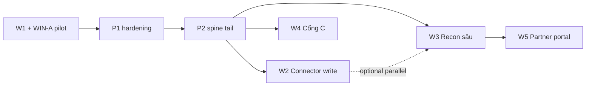

# Software Requirements Specification

# Media Supply & Outcome OS — Phase 2+ (W2–W5)

| Thuộc tính | Giá trị |
|---|---|
| Tên | MSOS Phase 2+ — Connector write · Recon · Reseller · Partner portal |
| Mã tài liệu | SPEC-MSOS-W2W5-2026-09-12 |
| Phiên bản | **1.0 — Wave sau WIN-A pilot** |
| Cha | [`2026-09-12-media-supply-outcome-os-design.md`](./2026-09-12-media-supply-outcome-os-design.md) · SPEC-MSOS v1.0 §4 |
| WIN | [`2026-09-12-media-supply-outcome-os-win-design.md`](./2026-09-12-media-supply-outcome-os-win-design.md) · SPEC-MSOS-WIN v1.0 |
| Plan W1+WIN | [`../plans/2026-09-12-media-supply-outcome-os-win.md`](../plans/2026-09-12-media-supply-outcome-os-win.md) |
| UI staff (kế thừa) | 8 màn `/crm/media-os` · mockup WIN |
| Pilot VPS | `rs.pttads.vn` · `PTT_MEDIA_OS_ENABLED=1` · permission `MSOS-PILOT` |
| Trạng thái | **Draft for Product / Architecture** — chưa code W2–W5 |

**Tuyên bố:** Tài liệu này **mở rộng §4** của SPEC-MSOS thành bốn wave triển khai có thứ tự, tiêu chí chấp nhận, API/data sketch và ranh giới UI. **Không** thu hồi BR-MSOS-01…08, BR-MSOS-WIN-01…04, GT-01…08, GT-P01…P10. **Không** clone CRM/Finance/AI/Knowledge. **Không** DSP/SSP.

Plan implementation **tách file** sau khi spec được duyệt và chốt thứ tự W2 vs W3 (mục 2.3).

---

## 1. Baseline — đã ship trước Phase 2+

### 1.1. W1-core + W1-WIN (A)

| Hạng mục | Trạng thái |
|---|---|
| DDL `msos_*` W1+WIN | ✅ Applied |
| API `/api/crm/media-os/*` (~50 route) | ✅ |
| ops-web 8 màn + `MsosShell` | ✅ |
| Flag master `PTT_MEDIA_OS_ENABLED` / `NEXT_PUBLIC_MEDIA_OS` | ✅ Pilot on |
| Cổng C + connector write | 🔒 Flag off; API từ chối / route absent |
| Pilot data thật (PTT + 1 partner + Glow Beauty + line live + EP official) | ✅ trên VPS |

### 1.2. P1 hardening (post-UAT)

| Hạng mục | Trạng thái |
|---|---|
| `POST …/traffic/approve` | ✅ |
| `POST …/insertion-orders/:id/partner-confirm` | ✅ |
| Rate dropdown + Reserve modal + block IO không reserve | ✅ |
| `GET /rate-cards` → `published_rate_version_id` | ✅ |
| Deploy/smoke scripts | ✅ |

### 1.3. P2 spine tail

| Hạng mục | Trạng thái |
|---|---|
| Evidence pack + item + official | ✅ |
| Discrepancy + make-good + waive + reserve capacity + close (human) | ✅ |
| A1 draft IO/traffic (`POST /drafts`) | ✅ |
| Governance recompute scorecard | ✅ |
| `POST …/finance-request` (GT-P10) | ✅ API; Finance Core vẫn SoT invoice |

### 1.4. Chưa có (Phase 2+ scope)

- Ghi connector có duyệt từ media line (§4.1)
- Workbench recon plan vs IO vs connector vs evidence vs billable (§4.3)
- Mở cổng C / `hide_buy_side` sống (§4.2)
- Partner portal tenant-isolated (§4.4)
- Close calendar đầy đủ, dispute portal client, AR aging (Finance)

---

## 2. Lộ trình Wave W2–W5

### 2.1. Bản đồ phụ thuộc



### 2.2. Thứ tự đề xuất (mặc định)

| Wave | §4 cha | Phụ thuộc cứng | Flag mới |
|---|---|---|---|
| **W2** | §4.1 Ghi connector có duyệt | Line map `connector_external_id`; `campaign-writes` + Temporal sống; GT-03 Live | `PTT_MEDIA_OS_CONNECTOR_WRITE` |
| **W3** | §4.3 Recon & close sâu | Evidence official + finance request pilot; rate version bind | *(không flag riêng — trong `ENABLED`)* |
| **W4** | §4.2 Cổng C reseller | Scorecard + eligibility vận hành; KYC partner | `PTT_MEDIA_OS_RESELLER` |
| **W5** | §4.4 Partner portal | W3 statement object; IAM partner role | Portal env riêng |

**Ghi chú:** W2 và W3 **có thể song song** nếu team tách squad (buy-side vs finance ops). W4 **độc lập** W2/W3 về code nhưng product nên sau khi scorecard ổn định trên pilot. W5 **bắt buộc sau W3** (statement + dispute ref).

### 2.3. Quyết định product (chưa chốt)

| Option | Khi chọn | Rủi ro nếu bỏ qua |
|---|---|---|
| **A — W2 trước** | Agency muốn launch Meta/Google từ line, giảm rời Ads Ops | Finance vẫn hỏi thủ công “số khớp chưa?” |
| **B — W3 trước** | Publisher pilot cần đóng tháng, GT-P10 + recon case | Buy-side vẫn queue rời `/crm/campaign-writes` |
| **C — W2 ∥ W3** | Đủ người; pilot song song buy + publisher close | Coordination API contract `media_line_id` |

**Cổng tài liệu Phase 2+:** chốt A/B/C + ngày UAT sign-off WIN-A trước khi viết plan W2 hoặc W3.

---

## 3. Wave W2 — Ghi connector có duyệt (§4.1)

### 3.1. Mục tiêu

Media Line **buy-side** (Meta / Google / Zalo) có thể *đề xuất* thay đổi launch/edit **qua adapter đã có**, không bypass Ads Ops và **không** gọi Graph/Google từ browser.

**Thắng:** Một thay đổi budget/status từ line `ML-*` → snapshot trên Campaigns → queue `campaign-writes` → approver ≠ submitter → connector execute → audit `correlation_id` + `media_line_id`.

### 3.2. In / out

| In | Out |
|---|---|
| Bind / sửa `connector_external_id` trên line (channel meta/google/zalo) | Token refresh UI |
| `POST` propose change (A3 max) từ line | AI tự pause / tăng budget |
| Submit → `CampaignWritesService.submit` (reuse) | Route ghi trực tiếp Graph từ ops-web |
| Deep-link `/crm/campaign-writes` + badge trạng thái trên Campaigns | Thay URL `/meta/ads-ops` |
| Gate: connector không stale, Launch QA pass (ref QA module nếu có) | DSP / auto-bidder |

### 3.3. Entity mới (MSOS sở hữu)

| Entity | Việc |
|---|---|
| `MsosConnectorWriteLink` | `id`, `media_line_id`, `campaign_write_id`, `change_type`, `proposed_by`, `status` (draft / submitted / approved / rejected / executed / failed), `correlation_id`, `ai_trace_id` nullable |
| *(reuse)* `campaign_writes` | SoT execution queue — MSOS chỉ **link**, không duplicate execution |

**Không** thêm bảng execution riêng nếu `campaign_writes` đủ; chỉ `msos_connector_write_links`.

### 3.4. API (phác)

Prefix `/api/crm/media-os`. Mọi route W2 **403/404** khi `PTT_MEDIA_OS_CONNECTOR_WRITE=0`.

| Method | Path | Cap | Việc |
|---|---|---|---|
| `PATCH` | `/media-lines/:id/connector` | `write` | Set `channel`, `connector_external_id`, `external_account_id` — validate CRM client + campaign tồn tại (read Meta/Google repo) |
| `GET` | `/media-lines/:id/connector-writes` | `view` | List link + trạng thái campaign write |
| `POST` | `/media-lines/:id/connector-writes/propose` | `write` | A3: lưu draft proposal (`old_value`/`new_value`) — **chưa** enqueue |
| `POST` | `/media-lines/:id/connector-writes/:linkId/submit` | `write` | Validate GT-W2-01…03 → `CampaignWritesService.submit` → link row |
| `GET` | `/health` | `view` | Đã có; `connector_write: true` khi flag on |

**JSON cấm:** `access_token`, `refresh_token`, ad account secret.

### 3.5. Cổng W2

| ID | Cổng | Pass | Fail |
|---|---|---|---|
| GT-W2-01 | Flag connector write | `PTT_MEDIA_OS_CONNECTOR_WRITE=1` | 404 `{ error: "connector_write_disabled" }` |
| GT-W2-02 | Line buy-side | `channel` ∈ {meta, google, zalo} + `connector_external_id` | 422 `connector_not_bound` |
| GT-W2-03 | Connector freshness | Sync insight ≤ SLA policy (ref performance stale rule) | 409 `connector_stale` — không submit |
| GT-W2-04 | SoD submit | `submitted_by` ≠ `approved_by` trên cùng request (policy spend) | 403 `sod_violation` |
| GT-W2-05 | AI lock | Không `confirm: true` trên submit | 403 `ai_action_forbidden` |

### 3.6. UI (ops-web — mở rộng Campaigns)

| Thành phần | Hành vi |
|---|---|
| Line row — connector chip | Channel + external ID; stale = đỏ |
| Modal “Đề xuất thay đổi” | Chọn `change_type` (budget, status, …); preview old/new; **Propose** (draft) vs **Gửi duyệt** |
| Link “Mở Campaign Writes” | Deep-link `/crm/campaign-writes?client_id=…` |
| MsosSpine §4 chip | Đổi từ “khóa” → “W2 pilot” khi flag on |
| Empty | “Chưa bind campaign” + hướng dẫn map ID |

**Không** thêm màn thứ 9 trên staff hub.

### 3.7. Chấp nhận W2 (UAT)

1. Flag off → 0 route submit; health `connector_write: false`; 0 regression W1 spine.
2. Line publisher-only (không channel) → propose bị 422.
3. Một line Meta thật: propose daily_budget → submit → item `pending_approval` trong `campaign-writes` → approver khác approve → executed; link row `executed`.
4. Connector stale → submit 409; UI hiện lý do.
5. Audit: log có `media_line_id`, `campaign_write_id`, before/after JSON.
6. AI copilot không gọi submit Live/budget (test `msos-ai-lock`).

### 3.8. NFR

- Submit p95 ≤ 2s (enqueue only; execution async Temporal).
- Idempotent submit: cùng `correlation_id` → 409 duplicate.

---

## 4. Wave W3 — Reconciliation & close sâu (§4.3)

### 4.1. Mục tiêu

Workbench **plan vs IO vs connector/file vs evidence official vs client-billable vs partner invoice ref** — Finance vẫn SoT invoice/AP; MSOS **đề xuất** và **case hóa** lệch số.

**Thắng:** Một case material (rate version mismatch hoặc delivery thiếu) → recon case + evidence list + resolution path (adjustment / make-good / finance request / write-off *request*) — **0** tự lock period Finance.

### 4.2. In / out

| In | Out |
|---|---|
| Recon case per `media_line_id` hoặc period bucket | Close calendar UI đầy đủ |
| So sánh 6 cột số (bảng dưới) | Dispute portal client |
| Tolerance theo partner/channel/policy | FX exposure engine |
| Resolution workflow (draft → reviewed → finance_requested / waived / closed) | Issue invoice trong MSOS |
| Mở rộng Evidence + Margin (+ Command exception) | Sửa actual Finance đã lock |

### 4.3. Đối tượng so sánh

| Cột | Nguồn MSOS |
|---|---|
| Plan / package | `msos_packages` + reservation qty |
| IO / media line | IO revision + `published_rate_version_id` + qty |
| Connector / file import | Performance sync hoặc evidence item type `partner_report` |
| Evidence official | GT-04 pack official |
| Client-billable (proposed) | Waterfall sell − discount; editable proposal only |
| Partner invoice | **Ref ID** từ Finance/AP — không ghi AP |

### 4.4. Entity mới

| Entity | Việc |
|---|---|
| `MsosReconCase` | `id`, `media_line_id`, `period_start`, `period_end`, `status` (open / in_review / resolved / finance_requested), `materiality`, `root_cause`, `tolerance_bps`, `created_by` |
| `MsosReconLine` | `recon_case_id`, `dimension` (qty / rate / cost / sell), `plan`, `actual`, `delta`, `within_tolerance` |
| `MsosReconResolution` | `recon_case_id`, `kind` (adjustment / make_good / credit_request / write_off_request / carry_over), `amount_vnd`, `finance_request_id` nullable, `approved_by` |

Liên kết sẵn có: `MsosDiscrepancyCase`, `MsosMakeGood`, `msos_finance_requests` — recon case **có thể spawn** từ discrepancy hoặc ngược lại (1 line không duplicate case open).

### 4.5. API (phác)

| Method | Path | Cap | Việc |
|---|---|---|---|
| `GET` | `/recon-cases` | `view` | Filter line / period / status |
| `GET` | `/recon-cases/:id` | `view` | Case + lines + resolutions |
| `POST` | `/media-lines/:id/recon/open` | `write` | Compute snapshot 6 cột; mở case nếu vượt tolerance |
| `POST` | `/recon-cases/:id/review` | `publish` | Human mark in_review |
| `POST` | `/recon-cases/:id/resolutions` | `write` | Add resolution draft |
| `POST` | `/recon-cases/:id/finance-request` | `finance_request` | GT-08 + GT-P10 + recon pass → reuse finance request |
| `POST` | `/recon-cases/:id/close` | `publish` | Human close — **không** AI |

### 4.6. Cổng W3 (bổ sung GT)

| ID | Cổng | Pass | Fail |
|---|---|---|---|
| GT-W3-01 | Evidence | Pack official cho line | Block billable proposal |
| GT-W3-02 | Materiality | Δ > tolerance → case bắt buộc trước finance request | 409 `recon_material_open` |
| GT-W3-03 | Finance lock | Period locked ở Finance → chỉ `carry_over` / new period request | 409 `finance_period_locked` |
| GT-W3-04 | Rate bind | IO rate version = line rate version | Auto flag `rate_mismatch` trên case |

### 4.7. UI

| Màn | Thay đổi |
|---|---|
| **Evidence** | Tab “Recon” trên line: 6 cột, tolerance bar, nút “Mở case” |
| **Margin** | Billable proposal + link recon case; disable request nếu GT-W3-02 fail |
| **Command** | Exception type `recon_material` từ case open |
| **Governance** | Policy tolerance bps theo partner (read policy table) |

Không mockup HTML riêng — parity state trên ops-web; optional mockup patch sau duyệt spec.

### 4.8. Chấp nhận W3 (UAT)

1. Line pilot có EP official + delivery thiếu → open recon → material case → make-good resolution link tồn tại.
2. Rate mismatch (đổi rate sau IO lock) → case `rate_mismatch` + không cho finance request đến khi reviewed.
3. Finance period locked (mock Finance API) → MSOS chỉ tạo carry-over request.
4. 0 invoice MSOS; finance request có `recon_case_id`.
5. Waived discrepancy (P2) tương thích — waived DC không mở recon material trùng.

### 4.9. Statement export (tiền đề W5)

| Artifact | Việc |
|---|---|
| `GET /partners/:id/statement?period=` | Partner-facing **subset**: qty delivered, IO ref, dispute ref — **không** margin PTT, **không** client khác |
| Format | JSON + optional PDF gen (server-side) — không embed buy rate |

Route này thuộc W3 API; UI partner = W5.

---

## 5. Wave W4 — Cổng C reseller (§4.2)

### 5.1. Mục tiêu

Che buy-side khỏi client / client-facing package **chỉ khi** Reseller Eligibility = đạt **và** flag on.

**Thắng:** Partner đạt ngưỡng → Commercial approver bật C → package `hide_buy_side=true` có hiệu lực; partner dưới ngưỡng → API từ chối dù flag on.

### 5.2. Điều kiện đạt (tất cả — kế thừa §4.2)

1. KYC / DPA / tax verified (`msos_partners.kyc_pass`).
2. Scorecard ≥ ngưỡng policy (hiện compute ≥ 70 — configurable).
3. Capacity không overbook systemic (exception P0 cleared hoặc waived).
4. Rate Card published còn hiệu lực cho partner property.
5. Partner status ∉ {Watchlist, Suspended}.
6. Review + approver Commercial (`crm_media:publish` + SoD ≠ deal owner).

### 5.3. In / out

| In | Out |
|---|---|
| `POST …/eligibility/reseller` mở khi đủ điều kiện | Client portal white-label full |
| Package field `hide_buy_side` respected khi C mở | Ẩn buy cost trên staff UI |
| Event `ResellerEligibilityChanged` | Auto bật C không người |
| Thu hồi: scorecard drop / rate hết hạn → C tắt line mới | Retroactive che line cũ (change control manual) |

### 5.4. API thay đổi

| Method | Path | Thay đổi |
|---|---|---|
| `GET` | `/partners/:id/eligibility` | `locked: false` khi flag on; `reseller_open` phản ánh DB |
| `POST` | `/partners/:id/eligibility/reseller` | Body `{ open: boolean, approved_by }` — validate 6 điều kiện; 403 `reseller_locked` khi flag off |
| `POST` | `/packages` | `hide_buy_side` **ignored** khi reseller off (giữ behavior hiện tại) |
| `GET` | `/health` | `reseller: true` khi flag on |

### 5.5. UI

| Màn | Thay đổi |
|---|---|
| **Packages** | Checkbox “Ẩn giá mua (C)” enable khi eligibility đạt |
| **Governance** | Nút “Bật reseller” thay chip locked; checklist 6 điều kiện |
| **Command** | Cổng C card phản ánh eligibility thật |

### 5.6. Chấp nhận W4 (UAT)

1. Flag off → POST reseller luôn 403; packages ignore hide.
2. Partner pilot scorecard đạt + KYC → approver bật → `reseller_open: true`.
3. Tạo package hide_buy_side → client-facing export/IO **không** chứa buy rate (staff vẫn thấy trong Margin).
4. Hạ scorecard dưới ngưỡng → recompute tắt C → package mới không che.
5. AI không gọi eligibility reseller (`msos-ai-lock`).

---

## 6. Wave W5 — Partner portal (§4.4)

### 6.1. Mục tiêu

Đối tác xem **inventory/capacity của họ**, xác nhận reserve/IO, xem statement, upload dispute evidence — **tenant isolate**, không staff cap `crm_media`.

**Thắng:** User partner đăng nhập portal → chỉ thấy property partner pilot → confirm IO đã issue → xem statement kỳ → dispute một dòng delivery — **0** margin PTT, **0** catalog partner khác.

### 6.2. Kiến trúc

```
portal-web  /partner/media-os/*     (app tách, pattern /zalo /google)
                │ Bearer partner session
ptt-crm-api  /api/portal/media-os/*   (guard partner — KHÔNG staff-msos.guard)
                │
            MSOS read/write scoped by partner_id from IAM
```

| Được | Không |
|---|---|
| Inventory + capacity **của partner session** | Toàn catalog PTT + partner khác |
| Confirm / reject reserve, IO | Sửa Rate Card PTT, Deal Wallet nội bộ |
| Statement + dispute evidence upload | Buy-side client khác, margin waterfall |
| User partner (IAM role `partner_media`) | Dùng `crm_media:*` staff |

### 6.3. API portal (prefix mới)

| Method | Path | Việc |
|---|---|---|
| `GET` | `/api/portal/media-os/inventory` | Scoped `partner_id` |
| `GET` | `/api/portal/media-os/capacity` | Calendar bucket partner properties |
| `GET` | `/api/portal/media-os/insertion-orders` | IO chờ confirm |
| `POST` | `/api/portal/media-os/insertion-orders/:id/confirm` | Partner confirm (mirror staff route, guard khác) |
| `POST` | `/api/portal/media-os/insertion-orders/:id/reject` | Lý do bắt buộc |
| `GET` | `/api/portal/media-os/statements` | W3 statement export |
| `POST` | `/api/portal/media-os/disputes` | Gắn recon/discrepancy case — evidence upload ref |

**ABAC:** mọi query `WHERE partner_id = :sessionPartnerId` — test object-level isolation bắt buộc.

### 6.4. UI portal-web

| Route | Việc |
|---|---|
| `/partner/media-os` | Dashboard: IO pending, capacity tuần |
| `/partner/media-os/orders` | List IO + confirm/reject |
| `/partner/media-os/statements` | Kỳ + PDF download |
| `/partner/media-os/disputes` | Mở dispute + upload |

Staff ops-web **không** thêm route portal.

### 6.5. IAM

| Role | Cap |
|---|---|
| `partner_media:view` | Read inventory, IO, statement |
| `partner_media:confirm` | Confirm/reject IO, reserve ack |
| `partner_media:dispute` | Upload evidence dispute |

Provisioning ngoài MSOS (IAM admin); MSOS chỉ validate role trên portal guard.

### 6.6. Chấp nhận W5 (UAT)

1. Partner A session → 0 row partner B (test cross-tenant).
2. Confirm IO trên portal → staff thấy `partner_confirmed_at` trên Campaigns.
3. Statement không chứa buy rate, margin, client name khác.
4. Dispute tạo case linked `media_line_id` — staff thấy trên Evidence/Recon.
5. Staff token không gọi được `/api/portal/media-os/*`; partner token không gọi `/api/crm/media-os/*`.

---

## 7. Flags & config (tổng hợp)

| Env (code) | Spec name | Default | Wave |
|---|---|---|---|
| `PTT_MEDIA_OS_ENABLED` | `MEDIA_OS_ENABLED` | off | W1 |
| `NEXT_PUBLIC_MEDIA_OS` | FE nav | off | W1 |
| `PTT_MEDIA_OS_CONNECTOR_WRITE` | `MEDIA_OS_CONNECTOR_WRITE` | off | W2 |
| `PTT_MEDIA_OS_RESELLER` | `MEDIA_OS_RESELLER` | off | W4 |
| *(portal)* `NEXT_PUBLIC_PARTNER_MEDIA_OS` | — | off | W5 |

Pilot VPS: chỉ bật `ENABLED` cho đến khi UAT từng wave.

---

## 8. Bảo mật & SoD (cross-wave)

| Khóa | Áp dụng |
|---|---|
| BR-MSOS-04 | Token connector không ra browser — mọi wave |
| BR-MSOS-05 | Flag default off — W2/W4 |
| GT-W2-04 | Submitter ≠ approver connector write |
| GT-W3-03 | Không sửa Finance locked period |
| W5 isolation | `partner_id` mandatory filter — fuzz test |
| Audit | Mọi POST W2–W5: `correlation_id`, actor, before/after |

---

## 9. DDL sketch (chưa apply)

```sql
-- W2
CREATE TABLE msos_connector_write_links (
  id UUID PRIMARY KEY,
  media_line_id UUID NOT NULL REFERENCES msos_media_lines(id),
  campaign_write_id UUID NOT NULL,
  change_type TEXT NOT NULL,
  status TEXT NOT NULL,
  correlation_id TEXT NOT NULL UNIQUE,
  ai_trace_id TEXT,
  proposed_by TEXT NOT NULL,
  created_at TIMESTAMPTZ NOT NULL DEFAULT now()
);

-- W3
CREATE TABLE msos_recon_cases ( ... );
CREATE TABLE msos_recon_lines ( ... );
CREATE TABLE msos_recon_resolutions ( ... );

-- W4: msos_eligibility.reseller_open already exists — behavior unlock only
-- W5: no new SoT tables; portal uses existing IO/evidence/recon
```

File DDL đầy đủ: `docs/specs/2026-09-12-postgresql-ddl-msos-w2-w5.sql` — tạo trong plan, không trong spec wave.

---

## 10. KPI cửa Phase 2+

| ID | Chỉ số | Cửa |
|---|---|---|
| BG-W2-01 | Line → campaign write executed (buy-side) | ≥ 1 on pilot |
| BG-W3-01 | Material recon case trước finance request | 100% material lines |
| BG-W3-02 | 0 invoice MSOS | 0 |
| BG-W4-01 | C chỉ bật partner đạt eligibility | 0 bypass |
| BG-W5-01 | Cross-tenant leak | 0 finding |

---

## 11. Khóa không đàm phán (bổ sung)

Kế thừa BR-MSOS-01…08 + BR-MSOS-WIN-01…04.

| ID | Khóa |
|---|---|
| BR-MSOS-W2-01 | Không gọi Graph/Google/Zalo từ ops-web / portal |
| BR-MSOS-W2-02 | Mọi execute đi qua `campaign-writes` + Temporal |
| BR-MSOS-W3-01 | Không lock Finance period; không issue invoice |
| BR-MSOS-W3-02 | Không ghi actual = plan khi thiếu delivery (GT-P06 giữ) |
| BR-MSOS-W4-01 | Không che buy-side khi eligibility chưa đạt |
| BR-MSOS-W5-01 | Portal tách app; không nhét vào 8 màn staff |
| BR-MSOS-W5-02 | Partner session không đọc margin / deal wallet / client khác |

---

## 12. Deliverables sau duyệt spec

| Deliverable | Wave | Ghi chú |
|---|---|---|
| Plan `docs/superpowers/plans/2026-09-12-media-supply-outcome-os-w2.md` | W2 | TDD tasks |
| Plan `…-w3.md` | W3 | Recon + statement API |
| Plan `…-w4.md` | W4 | Eligibility unlock |
| Plan `…-w5.md` | W5 | portal-web + IAM |
| DDL `docs/specs/2026-09-12-postgresql-ddl-msos-w2-w5.sql` | W2–W3 | Apply script riêng |
| Mockup patch (optional) | W3 | Recon tab Evidence |

**Không code W2–W5** cho đến khi: (1) spec này duyệt, (2) WIN-A UAT sign-off, (3) chốt thứ tự W2 vs W3 (mục 2.3).

---

**Cổng tài liệu:** Product + Architecture duyệt SPEC-MSOS-W2W5 v1.0 → chốt A/B/C → viết plan wave đầu tiên.

**Kết thúc SPEC-MSOS-W2W5 v1.0.**
