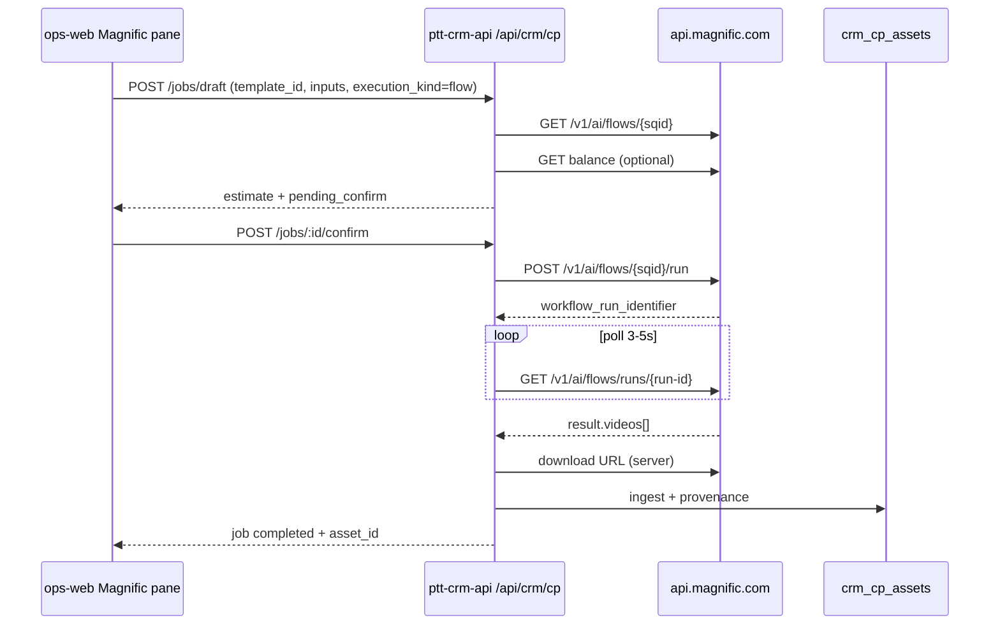

# Software Requirements Specification

# Creative OS — Wave B+ Magnific Spaces Flows

| Thuộc tính | Giá trị |
|---|---|
| Tên | PTT Creative OS — chạy Magnific Flow (Spaces) từ CRM, output về DAM |
| Mã tài liệu | SPEC-CP-MAGNIFIC-FLOWS-2026-09-13 |
| Phiên bản | **1.0 — Flow API + catalog template + ingest** |
| Cha | [SPEC-CP-ACO-WIN](./2026-09-13-cp-ai-ops-provider-integration-srs.md) §8 Wave B — **không thu hồi** |
| Con Weave | [SPEC-CP-WEAVE-WIN](./2026-09-13-figma-weave-cp-integration-srs.md) — pattern Work Order tham chiếu Mode C |
| Magnific vendor | [Flows API](https://docs.magnific.com/api-reference/flows/overview) · Spaces [Video nodes](https://www.magnific.com/ai/docs/video-nodes) |
| Artifact tham chiếu | [`docs/magnific/social-916-flow-blueprint.json`](../../magnific/social-916-flow-blueprint.json) · [`social-916-flow-api-runs.json`](../../magnific/social-916-flow-api-runs.json) |
| Pilot use case | Social **9:16** image-to-video (beauty / F&B / fashion) |
| Prod | `https://rs.pttads.vn` · tenant `PTT` · UI tiếng Việt · empty `—` |
| Trạng thái | **Draft — chưa code** |
| Flag mặc định | `MAGNIFIC_FLOWS_ENABLED=0` (REST Flows); kế thừa `MAGNIFIC_REST_API_ENABLED=0` · `MAGNIFIC_MCP_ENABLED=0` |

**Tuyên bố:** Wave B+ **mở rộng** Wave B (tool đơn `video_generate` / `images_*`) bằng **Magnific Flows** — pipeline đã publish trong Spaces, thực thi qua `POST /v1/ai/flows/{sqid}/run`. RNOSAI **không** import JSON graph Spaces; **không** thay SoR CRM/DAM; **không** lưu output chỉ bằng URL Magnific.

**Phụ thuộc:** Wave B cơ bản đã ship adapter REST/MCP + pane Magnific + `crm_cp_provider_connections` + job draft/confirm + ingest (hoặc ship cùng PR B+ nếu B chưa merge).

Plan implementation: [`../plans/2026-09-13-cp-magnific-flows.md`](../plans/2026-09-13-cp-magnific-flows.md) — TDD tasks 1–14.

---

## 0. Vì sao Wave B+

Wave B pilot chạy **một capability** (`video_generate`, `images_generate`…). Thực tế agency cần **pipeline cố định** (ảnh → crop 9:16 → 2 model video → export) — đúng thứ Magnific **Flows** đóng gói từ Spaces.

| Vấn đề nếu chỉ Wave B | Wave B+ giải quyết |
|---|---|
| Operator tự ráp prompt từng bước | Chọn **template Flow** đã duyệt PTT |
| Không tái sử dụng pipeline Magnific Community | Catalog `external_ref` = Flow `sqid` |
| Batch social 10 variant thủ công | Job/batch map CSV → `inputs` |
| Không audit pipeline version | `tool_or_workflow` = `flow:{sqid}@v{n}` |

Không thắng = nhân viên mở Magnific tab ngoài, file không về `crm_cp_assets`, credit không qua ledger.

---

## 1. Câu thắng (một câu)

**PTT chọn một Flow Magnific đã publish (vd. Social 9:16) ngay trên project CRM → confirm credit → RNOSAI gọi Flow API → poll → copy video về DAM có provenance — trong khi đối thủ dừng ở gallery Magnific hoặc chat MCP không có task/campaign.**

---

## 2. Ba mode tích hợp — khóa trong B+

| Mode | Code | Ai chọn Flow | RNOSAI làm gì |
|---|---|---|---|
| **B+1 — Flow REST (khóa pilot)** | `magnific_rest` + `execution_kind=flow` | Dropdown template CP | `flows/run` → poll → ingest |
| **B+2 — Flow MCP (tuỳ chọn sau B+1)** | `magnific_mcp` + `weave_run_tool` | Agent / operator | MCP tool với `recipeId` = sqid |
| **B+3 — Spaces tay (không API)** | `magnific_manual` (work order) | Designer trên Spaces | Brief + deep-link; ingest giống Weave — **ngoài scope B+1 code**, chỉ ghi hướng |

**Chốt pilot:** **B+1** trước. B+2 khi MCP expose `weave_list_tools` / `weave_run_tool` ổn định trên account PTT.

---

## 3. In / Out

### 3.1. In (Wave B+)

| Hạng mục | Mô tả |
|---|---|
| Catalog template | `crm_cp_templates` + `crm_cp_provider_template_map` (`provider=magnific_rest`, `external_ref=sqid`) |
| Bindings | Map field CP → `api_key` Magnific (`image_prompt`, `motion_prompt`, `start_image`…) |
| Discovery | `GET /magnific/flows` (proxy list + filter catalog) |
| Sync definition | `GET /magnific/flows/:sqid` cache TTL — validate inputs trước draft |
| Job | `execution_kind: "flow"` trên draft; `flow_sqid` + `inputs` resolved |
| Poll | `workflow_run_identifier` → `GET /v1/ai/flows/runs/{run-id}` |
| Webhook (tuỳ chọn prod) | `POST /magnific/flows/hook` — HMAC, idempotent |
| Ingest | `videos[]` / `images[]` từ `result` → `crm_cp_assets` |
| Batch | N draft từ CSV / `crm_cp_batches` — cùng template |
| UI | Pane Magnific: template + prompt fields + ref asset |

### 3.2. Out

| Hạng mục | Lý do |
|---|---|
| Import/paste JSON graph Spaces | Magnific không hỗ trợ |
| Sửa node graph từ CRM | Chỉ Spaces |
| Spaces / 3D / custom refs allowlist | Giữ tắt pilot cha §8.2 |
| AUTO-route Flow không confirm | GT-M04 giữ |
| Client portal chạy Flow | Staff only |
| Thay Video SOP người quay | Song song |
| Marketplace workflow bên thứ ba | Ngoài scope cha §20 |

---

## 4. Ranh giới Magnific (vendor)

| Khóa | Chi tiết |
|---|---|
| Flow chỉ chạy sau **publish** Spaces | Không run draft space |
| Flow ID = **sqid** (vd. `uqzQLDr2Aw`) | Không UUID node |
| Input key = **`api_key`** từ GET flow | Legacy `id` chấp nhận nhưng CP chỉ emit `api_key` |
| Run **async** — 202 + `workflow_run_identifier` | Không block HTTP đến khi video xong |
| Asset URL **tạm 12h** | Ingest bytes về PTT bắt buộc |
| Auth header | `X-Magnific-Api-Key` — **server only** |
| Credits | `tool_metadata.total_cost` trên GET flow; reconcile sau run |

---

## 5. Entity & dữ liệu

### 5.1. Kế thừa (đã có / Wave B)

- `crm_cp_render_jobs` — thêm cột logic (xem §5.3)
- `crm_cp_provider_runs` — `tool_or_workflow` = `flow:{sqid}`
- `crm_cp_provider_template_map` — **SoT map template ↔ Flow**
- `crm_cp_provider_connections` — `magnific_rest` API key
- `crm_cp_assets` — output master

### 5.2. Bảng mới (B+)

```sql
-- Cache definition Flow (optional nhưng khuyến nghị)
CREATE TABLE IF NOT EXISTS crm_cp_magnific_flow_cache (
  sqid TEXT PRIMARY KEY,
  name TEXT NOT NULL,
  inputs_schema_json JSONB NOT NULL DEFAULT '[]'::jsonb,
  total_cost INT,
  fetched_at TIMESTAMPTZ NOT NULL DEFAULT now(),
  expires_at TIMESTAMPTZ NOT NULL
);

-- Work order Spaces tay (Mode B+3 — phase sau)
CREATE TABLE IF NOT EXISTS crm_cp_magnific_work_orders (
  id UUID PRIMARY KEY DEFAULT gen_random_uuid(),
  project_id UUID NOT NULL REFERENCES crm_cp_projects(id),
  task_id UUID,
  flow_sqid TEXT,
  brief_json JSONB NOT NULL DEFAULT '{}'::jsonb,
  status TEXT NOT NULL DEFAULT 'open',
  created_by_staff_id INT NOT NULL,
  created_at TIMESTAMPTZ NOT NULL DEFAULT now(),
  updated_at TIMESTAMPTZ NOT NULL DEFAULT now()
);
```

### 5.3. Mở rộng `crm_cp_render_jobs` (JSON stage hoặc cột)

Lưu trong `stage_log_json` (ưu tiên, tránh DDL nếu đủ):

| Field | Kiểu | Việc |
|---|---|---|
| `execution_kind` | `"tool"` \| `"flow"` | Default `"tool"` — tương thích Wave B |
| `flow_sqid` | string | Bắt buộc khi `execution_kind=flow` |
| `flow_inputs` | object | Payload đã resolve (redacted secret) |
| `workflow_run_identifier` | string | Từ POST run |
| `flow_run_status` | string | Mirror poll |

### 5.4. `crm_cp_provider_template_map.bindings_json` (contract)

```json
{
  "execution_kind": "flow",
  "flow_sqid": "uqzQLDr2Aw",
  "input_bindings": {
    "image_prompt": { "source": "prompt_field", "key": "image_prompt", "required": true },
    "motion_prompt": { "source": "prompt_field", "key": "motion_prompt", "required": true },
    "start_image": { "source": "asset_ref", "key": "reference_asset_id", "required": false, "media_type": "image" }
  },
  "defaults": {
    "aspect_ratio": "9:16",
    "duration_sec": 5
  },
  "estimate_credits": 5,
  "requires_render_high_cost": true,
  "output_expectation": { "videos_min": 1, "mime": ["video/mp4"] }
}
```

| `source` | Resolve từ |
|---|---|
| `prompt_field` | Composer / brief / prompt package |
| `asset_ref` | `crm_cp_assets.id` → signed URL server-side |
| `literal` | `defaults` |
| `brand_kit` | Rule từ `brand_kit_version_id` (Wave D mở rộng) |

---

## 6. Catalog template pilot

Seed tối thiểu (staging/prod sau publish Flow thật):

| `template_key` | Tên UI | Flow (sqid) | Inputs |
|---|---|---|---|
| `social_916_i2v` | Social 9:16 · Image → Video | *PTT publish* | `image_prompt`, `motion_prompt` |
| `social_916_i2v_ref` | Social 9:16 · Có ảnh ref | *PTT publish* | + `start_image` (creation) |

Prompt mẫu: [`docs/magnific/social-916-flow-api-runs.json`](../../magnific/social-916-flow-api-runs.json) (10 run).

**Không seed** sqid giả trên prod — placeholder chỉ trong dev fixture.

---

## 7. Luồng job B+1 (REST Flow)



### 7.1. Draft

`POST /api/crm/cp/jobs/draft` — mở rộng payload Wave B:

```json
{
  "project_id": "uuid",
  "task_id": "uuid",
  "template_id": "uuid",
  "provider": "magnific_rest",
  "execution_kind": "flow",
  "inputs": {
    "image_prompt": "Vertical social ad...",
    "motion_prompt": "Slow dolly in...",
    "reference_asset_id": null
  },
  "idempotency_key": "uuid"
}
```

Server:
1. Load template + `bindings_json`
2. `GET flow` — verify sqid + required inputs ⊆ bindings
3. Resolve `reference_asset_id` → creation URL (GT-M05 rights)
4. Estimate = `total_cost` từ cache hoặc GET flow
5. Insert job `pending_confirm`

### 7.2. Confirm & run

1. `POST /jobs/:id/confirm` — GT-M04
2. Insert `crm_cp_provider_runs` (`tool_or_workflow=flow:{sqid}`)
3. `POST .../flows/{sqid}/run` body `{ inputs, webhook? }`
4. Job → `rendering`; store `workflow_run_identifier`

### 7.3. Wait

Worker hoặc inline poller:
- First poll sau **2–3s**
- Interval **3–5s**
- Timeout video: settings `magnific_flow_wait_ms` (default **300000** = 5 phút)
- Terminal: `completed` | `failed` | `completed_with_errors`

### 7.4. Ingest

- Parse `result.videos[]` (fallback `images[]` nếu template image-only)
- Download qua adapter (`assertMagnificDownloadAllowed`)
- Probe MIME/duration → `crm_cp_assets`
- Provenance: `provider=magnific_rest`, `external_run_id`, `flow_sqid`, redacted inputs
- GT-M06: không `completed` nếu 0 asset

### 7.5. Idempotency

- Cùng `idempotency_key` → trả job cũ
- Cùng confirm retry → không double `run` nếu đã có `workflow_run_identifier` active

---

## 8. Adapter — mở rộng `MagnificAdapterPort`

Interface hiện tại (`cp-jobs.service.ts`) thêm:

```typescript
interface MagnificFlowsPort {
  listFlows(search?: string): Promise<FlowSummary[]>;
  getFlow(sqid: string): Promise<FlowDetail>;
  runFlow(sqid: string, inputs: Record<string, unknown>, webhook?: string): Promise<{ workflowRunIdentifier: string }>;
  getFlowRun(runId: string): Promise<FlowRunStatus>;
}
```

Implementation: `cp-magnific-flows.adapter.ts` — base URL `https://api.magnific.com`, paths `/v1/ai/flows*`.

**Capability allowlist** mở thêm (policy):

| Capability | Endpoint |
|---|---|
| `flows_list` | GET `/v1/ai/flows` |
| `flows_get` | GET `/v1/ai/flows/{sqid}` |
| `flows_run` | POST `/v1/ai/flows/{sqid}/run` |
| `flows_run_status` | GET `/v1/ai/flows/runs/{run-id}` |

Tool đơn (`video_generate`…) **giữ** — `execution_kind=tool` default.

Flag: `MAGNIFIC_FLOWS_ENABLED=1` **và** `MAGNIFIC_REST_API_ENABLED=1`.

---

## 9. API RNOSAI (mỏng)

Prefix `/api/crm/cp`. Auth staff JWT.

| Method | Path | Cap | Việc |
|---|---|---|---|
| GET | `/magnific/flows` | view | List flows (Magnific) ∩ catalog active |
| GET | `/magnific/flows/:sqid` | view | Definition + bindings hint cho template |
| GET | `/magnific/templates` | view | CP templates `execution_kind=flow` |
| POST | `/jobs/draft` | edit | Mở rộng — §7.1 |
| POST | `/jobs/:id/confirm` | render | Mở rộng — run flow |
| GET | `/jobs/:id` | view | Trả `flow_sqid`, run status |
| POST | `/magnific/flows/hook` | *(HMAC)* | Webhook Magnific — optional prod |
| POST | `/batches/:id/magnific-flow-runs` | render | Batch từ CSV rows — Wave B+ batch |

**Không** expose API key / raw Magnific response có URL signed lên FE.

---

## 10. UI — `CpAiOpsMagnificPane`

Route: `/crm/creative-os/projects/{id}?tab=ai-ops&pane=magnific`

| Bước | UI | Ghi chú |
|---|---|---|
| 1 | Radio transport: API / MCP | Flow pilot **chỉ API** |
| 2 | **Select template** | `social_916_i2v` … |
| 3 | Fields động theo bindings | Textarea prompt; asset picker nếu `start_image` |
| 4 | Estimate | Credits + “Cần xác nhận” |
| 5 | Confirm + Submit | Giữ GT-M |
| 6 | Progress | `queued` → `rendering` → `completed` |
| 7 | Link asset | Mở `/crm/creative-os/media/{id}` |

Empty: `—` khi flag off (copy composer hiện có).

Deep-link Spaces (B+3): nút “Mở Flow trên Magnific” → URL gallery — **không** iframe.

---

## 11. Batch social (CSV)

Input: [`docs/figma-weave/social-916-prompts.csv`](../../figma-weave/social-916-prompts.csv) hoặc upload CSV project.

| Cột CSV | Map binding |
|---|---|
| `image_prompt` | `image_prompt` |
| `motion_prompt` | `motion_prompt` |
| `industry` | metadata only |

Flow:
1. `POST /batches` tạo batch N rows
2. Mỗi row → draft job shared `template_id`, idempotency `{batch_id}:{row}`
3. Confirm all (cap `render_high_cost` × N) hoặc từng job
4. Worker queue — max concurrency settings (`magnific_flow_concurrency`, default **2**)

---

## 12. Cổng B+ (bổ sung Wave B)

| ID | Cổng | Pass | Fail |
|---|---|---|---|
| GT-MF01 | `MAGNIFIC_FLOWS_ENABLED=1` | Run flow | 409 `magnific_flows_disabled` |
| GT-MF02 | Template có `execution_kind=flow` + sqid active | Draft OK | 422 `flow_template_invalid` |
| GT-MF03 | GET flow inputs ⊇ bindings required | Resolved inputs | 422 `flow_input_missing` |
| GT-MF04 | Flow tồn tại trên Magnific | 404 upstream → 502 | `magnific_flow_not_found` |
| GT-MF05 | Poll terminal + ≥1 video khi template expect video | Ingest | GT-M06 |
| GT-MF06 | `workflow_run_identifier` unique per confirm | No double run | 409 |
| GT-MF07 | Batch N ≤ `magnific_flow_batch_max` (default 20) | Submit | 422 |

Kế thừa **GT-M01…M07** Wave B (OAuth/key, balance, confirm, RESTRICTED, ingest, no token FE).

---

## 13. Webhook (prod khuyến nghị)

`POST /api/crm/cp/magnific/flows/hook`

| Khóa | Chi tiết |
|---|---|
| Auth | HMAC signing secret (cùng pattern Weave hook) |
| Events | `initialized`, `finished`, `failed` |
| Idempotent | `(workflow_run_identifier, event)` unique |
| Fail closed | Timeout poll vẫn backup |

Staging pilot: **poll-only** đủ UAT.

---

## 14. B+2 — MCP (phase 2)

Khi MCP account có tools:

| MCP tool | Map |
|---|---|
| `weave_list_tools` | Populate catalog (`recipeId`) |
| `weave_get_tool_inputs` | Dynamic form fields |
| `weave_run_tool` | Thay `flows_run` cho operator/agent |

`provider=magnific_mcp`, `execution_kind=flow`, `external_ref=recipeId`.

Cùng ingest/provenance/ledger — chỉ đổi transport.

---

## 15. B+3 — Work order Spaces (phase 3)

Pattern SPEC-CP-WEAVE-WIN:

| Entity | Việc |
|---|---|
| `crm_cp_magnific_work_orders` | Brief, expected sqid, status |
| Deep-link | Magnific Flow gallery / standalone |
| Ingest | Manual upload hoặc hook — **không** Flow API |

Không block B+1.

---

## 16. Bảo mật & vận hành

- API key chỉ server (`cp-provider-connections`)
- Download URL host allowlist (giữ `cp-magnific-http.util`)
- Redact `inputs` trong audit (`request_redacted_json`)
- Correlation: `job_id`, `flow_sqid`, `workflow_run_identifier`, `asset_id`
- Metric: flow run fail rate, ingest fail, p95 poll duration
- Rollback: `MAGNIFIC_FLOWS_ENABLED=0` → pane fallback tool mode Wave B

---

## 17. Flag & env

| Env | Default | Ý nghĩa |
|---|---|---|
| `MAGNIFIC_FLOWS_ENABLED` | 0 | Bật execution_kind flow |
| `MAGNIFIC_REST_API_ENABLED` | 0 | Bắt buộc cho B+1 |
| `MAGNIFIC_FLOW_WAIT_MS` | 300000 | Poll timeout |
| `MAGNIFIC_FLOW_POLL_MS` | 4000 | Interval |
| `MAGNIFIC_FLOW_CONCURRENCY` | 2 | Batch/worker |
| `MAGNIFIC_FLOW_BATCH_MAX` | 20 | Max rows/batch |
| `MAGNIFIC_FLOW_CACHE_TTL_SEC` | 900 | GET flow cache |

---

## 18. UAT B+ (15 phút)

Project pilot + template `social_916_i2v` + Flow publish staging.

| # | Việc | Pass |
|---|---|---|
| 1 | Flag off → dropdown Flow ẩn / 409 | ✅ |
| 2 | Draft không confirm → submit fail | GT-M04 |
| 3 | Confirm 1 job → video trong media project | asset_id + checksum |
| 4 | Provenance có `flow:{sqid}` | audit |
| 5 | RESTRICTED asset ref → 409 | GT-M05 |
| 6 | Retry idempotency → 1 charge | BG-A-09 |
| 7 | Batch 3 row CSV → 3 asset | optional |
| 8 | Network tab FE → 0 API key | GT-M07 |

---

## 19. Chấp nhận go-live B+

1. ≥1 Flow PTT publish (sqid thật) map template `social_916_i2v`.
2. ≥1 job REST flow → DAM trong CRM (không tab Magnific SoR).
3. Ledger ghi estimate/actual hoặc `—` — không bịa.
4. Wave B tool mode **không regress** khi `MAGNIFIC_FLOWS_ENABLED=0`.
5. 0 token Magnific trên browser.

---

## 20. Ngoài phạm vi B+

- Sửa graph Spaces từ CRM
- Import JSON blueprint lên Magnific ([`social-916-flow-blueprint.json`](../../magnific/social-916-flow-blueprint.json) chỉ là spec nội bộ)
- TTS / 3D / Spaces explorer trong allowlist
- AUTO confirm batch không người
- Client portal / `/api/v1`

---

## 21. Deliverables sau duyệt

| Deliverable | Ghi chú |
|---|---|
| Plan [`2026-09-13-cp-magnific-flows.md`](../plans/2026-09-13-cp-magnific-flows.md) | TDD tasks 1–14 |
| DDL patch `docs/specs/2026-09-13-postgresql-ddl-cp-magnific-flows.sql` | cache + WO optional |
| `cp-magnific-flows.adapter.ts` + spec | REST client |
| Seed template staging | Sau sqid thật |
| E2E `cp-ai-ops-magnific-flows.spec.ts` | ops-web |
| Runbook `docs/runbooks/cp-magnific-flows.md` | flag + rollback |

---

## 22. Lộ trình trong nhà máy CP

| Wave | Việc |
|---|---|
| **B** (đang/cần) | Tool đơn REST/MCP + pane + ingest |
| **B+1** | Flow REST + catalog + social 916 pilot |
| **B+2** | MCP `weave_run_tool` |
| **B+3** | Magnific work order + manual ingest |
| **C** | ComfyUI (không phụ thuộc B+) |

---

**Cổng tài liệu:** duyệt SPEC-CP-MAGNIFIC-FLOWS v1.0 → publish Flow staging → ghi sqid vào seed → viết plan.

**Kết thúc SPEC-CP-MAGNIFIC-FLOWS v1.0.**
