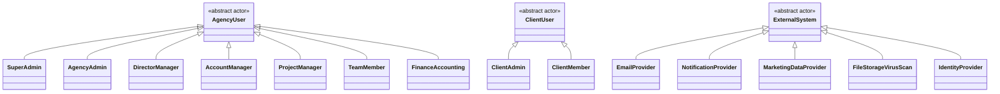
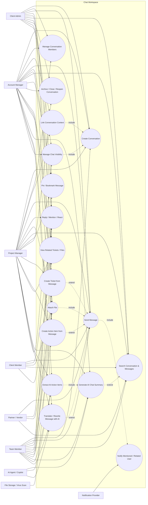
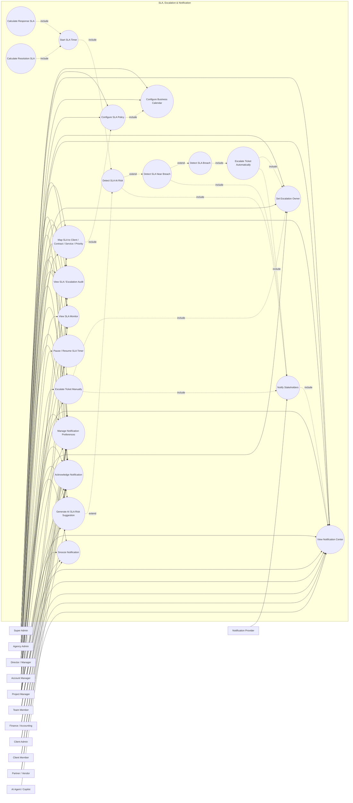
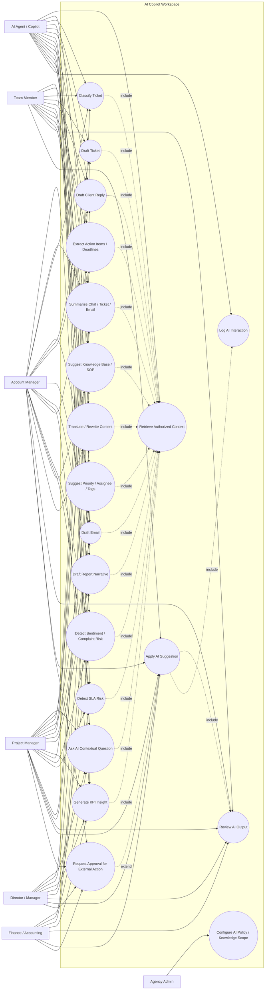
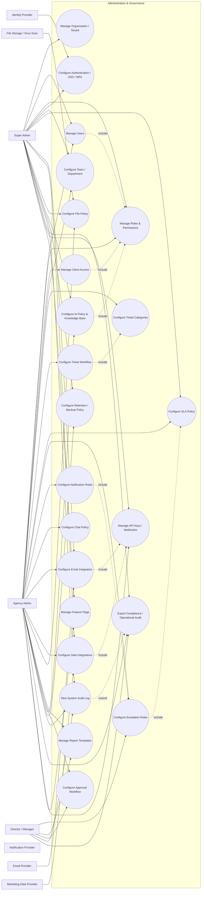

# Use Case Diagram — Agency PTT Communication & Service Desk

**Phạm vi:** Chat, Ticket, Email, Báo cáo, SLA, Approval, Notification và AI Agent.  
**Phiên bản:** 1.0  
**Mục đích:** Mô tả các tác nhân (actors), use case chính, quan hệ include/extend và phân rã use case để phục vụ BA, UX/UI, kiến trúc hệ thống, API design và lập backlog triển khai.

---

# 1. Phạm vi sơ đồ

Use Case Diagram này áp dụng cho module Communication & Service Desk trong Agency PTT CRM / Agency Operating System.

Các phân hệ được bao phủ:

- Chat nội bộ, chat khách hàng, chat theo dự án/campaign.
- Ticket dịch vụ, incident, change request, yêu cầu nội bộ và complaint.
- Email inbound/outbound tích hợp CRM.
- Report builder, review, approval, export và gửi báo cáo.
- SLA monitoring, escalation, notification.
- Client Portal.
- AI Copilot/AI Agent ở vai trò tạo nháp, phân loại, tóm tắt và đề xuất.
- Quản trị hệ thống, phân quyền, workflow, template, integration và audit log.

---

# 2. Actors

## 2.1. Actor chính

| Mã | Actor | Mô tả | Nhóm |
|---|---|---|---|
| ACT-01 | Super Admin | Quản trị hạ tầng tenant, security, role, integration và policy toàn hệ thống | Agency Internal |
| ACT-02 | Agency Admin | Quản lý cấu hình vận hành, workflow, SLA, team, template và dữ liệu agency | Agency Internal |
| ACT-03 | Director / Manager | Quản lý phòng ban, phê duyệt, escalation, theo dõi KPI/SLA và client risk | Agency Internal |
| ACT-04 | Account Manager | Đầu mối khách hàng; giao tiếp, nhận yêu cầu, theo dõi ticket và gửi báo cáo | Agency Internal |
| ACT-05 | Project Manager | Điều phối dự án/campaign, triage ticket, giao việc, theo dõi tiến độ và SLA | Agency Internal |
| ACT-06 | Team Member | Nhân sự content, design, media, ads, SEO, technical, CRM, video hoặc vận hành | Agency Internal |
| ACT-07 | Finance / Accounting | Theo dõi ticket/báo cáo liên quan ngân sách, thanh toán, công nợ và billable scope | Agency Internal |
| ACT-08 | Client Admin | Đại diện quản trị phía khách hàng, quản lý client member và theo dõi dữ liệu thuộc Client Account | Client External |
| ACT-09 | Client Member / Contact | Người liên hệ phía khách hàng; gửi yêu cầu, chat, phản hồi ticket, xem report | Client External |
| ACT-10 | Partner / Vendor | Đối tác triển khai được giao ticket hoặc tham gia project có giới hạn quyền | Partner External |
| ACT-11 | AI Agent / AI Copilot | Tạo nháp, tóm tắt, phân loại, gợi ý insight/action; không tự gửi ra ngoài nếu chưa được phép | System Actor |
| ACT-12 | Email Provider | Google Workspace, Microsoft 365, SMTP/IMAP/API provider gửi/nhận email | External System |
| ACT-13 | Notification Provider | Push notification, email notification, Slack, Teams, Zalo OA, webhook | External System |
| ACT-14 | Marketing Data Provider | Meta Ads, Google Ads, GA4, Search Console, TikTok Ads, CRM analytics | External System |
| ACT-15 | File Storage / Virus Scan Service | Object storage, signed URL, file processing, malware scanning | External System |
| ACT-16 | Identity Provider | SSO/OAuth/MFA provider nếu triển khai | External System |

## 2.2. Actor generalization



> Lưu ý: Mermaid `classDiagram` được dùng để thể hiện quan hệ generalization giữa actor. Với UML Use Case chuẩn, các actor này được vẽ bằng ký hiệu stick figure.

---

# 3. System Boundary

```text
┌───────────────────────────────────────────────────────────────────────────────┐
│                     AGENCY PTT COMMUNICATION & SERVICE DESK                   │
│                                                                               │
│  ┌────────────┐  ┌────────────┐  ┌────────────┐  ┌────────────────────────┐  │
│  │ Chat       │  │ Ticket     │  │ Email      │  │ Reports                │  │
│  │ Workspace  │  │ Service    │  │ Hub        │  │ & Approval             │  │
│  └────────────┘  └────────────┘  └────────────┘  └────────────────────────┘  │
│                                                                               │
│  ┌────────────┐  ┌────────────┐  ┌────────────┐  ┌────────────────────────┐  │
│  │ SLA &      │  │ Notification│ │ AI Copilot │  │ Administration         │  │
│  │ Escalation │  │ Center      │ │ Workspace  │  │ & Integration          │  │
│  └────────────┘  └────────────┘  └────────────┘  └────────────────────────┘  │
└───────────────────────────────────────────────────────────────────────────────┘
```

---

# 4. Use Case Diagram tổng quan

```mermaid
flowchart LR
    %% Actors
    SA[Super Admin]
    AA[Agency Admin]
    DM[Director / Manager]
    AM[Account Manager]
    PM[Project Manager]
    TM[Team Member]
    FA[Finance / Accounting]
    CA[Client Admin]
    CM[Client Member / Contact]
    PV[Partner / Vendor]
    AI[AI Agent / Copilot]
    EP[Email Provider]
    NP[Notification Provider]
    DP[Marketing Data Provider]
    FS[File Storage / Virus Scan]
    IDP[Identity Provider]

    subgraph SYS[Agency PTT Communication & Service Desk]
        AUTH((Authenticate & Access Workspace))
        DASH((View Dashboard))
        CHAT((Chat & Collaborate))
        TICKET((Manage Tickets))
        EMAIL((Manage Emails))
        REPORT((Manage Reports))
        APPROVAL((Manage Approval))
        SLA((Monitor SLA & Escalate))
        NOTIF((Receive / Manage Notifications))
        AIUC((Use AI Copilot))
        ADMIN((Configure System))
        AUDIT((View Audit Log))
        FILE((Manage Attachments))
    end

    SA --> AUTH
    AA --> AUTH
    DM --> AUTH
    AM --> AUTH
    PM --> AUTH
    TM --> AUTH
    FA --> AUTH
    CA --> AUTH
    CM --> AUTH
    PV --> AUTH
    IDP --> AUTH

    SA --> DASH
    AA --> DASH
    DM --> DASH
    AM --> DASH
    PM --> DASH
    TM --> DASH
    FA --> DASH
    CA --> DASH
    CM --> DASH
    PV --> DASH

    AM --> CHAT
    PM --> CHAT
    TM --> CHAT
    CA --> CHAT
    CM --> CHAT
    PV --> CHAT

    AA --> TICKET
    DM --> TICKET
    AM --> TICKET
    PM --> TICKET
    TM --> TICKET
    FA --> TICKET
    CA --> TICKET
    CM --> TICKET
    PV --> TICKET

    AM --> EMAIL
    PM --> EMAIL
    TM --> EMAIL
    FA --> EMAIL
    EP --> EMAIL

    AA --> REPORT
    DM --> REPORT
    AM --> REPORT
    PM --> REPORT
    TM --> REPORT
    FA --> REPORT
    CA --> REPORT
    CM --> REPORT
    DP --> REPORT

    DM --> APPROVAL
    AM --> APPROVAL
    PM --> APPROVAL
    FA --> APPROVAL
    CA --> APPROVAL

    AA --> SLA
    DM --> SLA
    AM --> SLA
    PM --> SLA
    TM --> SLA

    SA --> ADMIN
    AA --> ADMIN
    SA --> AUDIT
    AA --> AUDIT
    DM --> AUDIT

    AI --> AIUC
    AM --> AIUC
    PM --> AIUC
    TM --> AIUC
    DM --> AIUC

    SA --> FILE
    AA --> FILE
    AM --> FILE
    PM --> FILE
    TM --> FILE
    CA --> FILE
    CM --> FILE
    PV --> FILE
    FS --> FILE

    NP --> NOTIF
    SA --> NOTIF
    AA --> NOTIF
    DM --> NOTIF
    AM --> NOTIF
    PM --> NOTIF
    TM --> NOTIF
    FA --> NOTIF
    CA --> NOTIF
    CM --> NOTIF
    PV --> NOTIF
```



---

# 5. Use Case Diagram — Chat & Collaboration

## 5.1. Mục tiêu module

Hỗ trợ giao tiếp nội bộ, giao tiếp với khách hàng, trao đổi theo dự án/campaign/ticket; đảm bảo message quan trọng có thể chuyển thành ticket, action item hoặc dữ liệu CRM.

## 5.2. Sơ đồ use case Chat



## 5.3. Danh sách use case Chat

| Mã | Use Case | Actor chính | Quan hệ |
|---|---|---|---|
| UC-CHAT-01 | Create Conversation | Account, PM, Team Member, Client Admin | Include: Link Context, Manage Visibility |
| UC-CHAT-02 | Manage Conversation Members | Account, PM, Client Admin | Thêm/xóa thành viên theo quyền |
| UC-CHAT-03 | Link Conversation Context | Account, PM | Gắn Client, Project, Campaign, Ticket |
| UC-CHAT-04 | Send Message | Agency User, Client User, Partner | Include: Notify Mentioned/Related User |
| UC-CHAT-05 | Reply / Mention / React | Người tham gia conversation | Extend: Send Message |
| UC-CHAT-06 | Attach File | Người tham gia conversation | Include: File validation/storage; Extend: Send Message |
| UC-CHAT-07 | Search Conversation & Messages | Người có quyền truy cập | Có permission filter |
| UC-CHAT-08 | Pin / Bookmark Message | Agency User, Client Admin | Lưu thông tin quan trọng |
| UC-CHAT-09 | Archive / Close / Reopen Conversation | Owner, Account, PM, Client Admin | Theo role/policy |
| UC-CHAT-10 | Create Ticket from Message | Account, PM, Team Member | Extend: Send/View Message |
| UC-CHAT-11 | Create Action Item from Message | Account, PM, Team Member | Extend: Send/View Message |
| UC-CHAT-12 | View Related Tickets / Files | Người có quyền | Contextual view |
| UC-CHAT-13 | Generate AI Chat Summary | Account, PM, Team Member | AI tạo summary theo permission scope |
| UC-CHAT-14 | Extract AI Action Items | Account, PM, Team Member | Include: Generate AI Chat Summary |
| UC-CHAT-15 | Translate / Rewrite Message with AI | Agency User | Extend: Compose Message |
| UC-CHAT-16 | Notify Mentioned / Related User | System/Notification Provider | Include: Send Message |
| UC-CHAT-17 | Manage Chat Visibility | Account, PM, Client Admin | Include: Create Conversation |

## 5.4. Chat use case relationships

```text
Create Conversation
  ├── <<include>> Link Conversation Context
  └── <<include>> Manage Chat Visibility

Send Message
  ├── <<include>> Notify Mentioned / Related User
  ├── <<extend>> Reply / Mention / React
  ├── <<extend>> Attach File
  ├── <<extend>> Create Ticket from Message
  └── <<extend>> Create Action Item from Message

Generate AI Chat Summary
  └── <<include>> Extract AI Action Items
```

---

# 6. Use Case Diagram — Ticket Service Desk

## 6.1. Mục tiêu module

Chuẩn hóa quy trình tiếp nhận, triage, phân công, xử lý, trao đổi, theo dõi SLA, nghiệm thu và đóng các yêu cầu từ khách hàng/nội bộ/đối tác.

## 6.2. Sơ đồ use case Ticket

```mermaid
flowchart LR
    AA[Agency Admin]
    DM[Director / Manager]
    AM[Account Manager]
    PM[Project Manager]
    TM[Team Member]
    FA[Finance / Accounting]
    CA[Client Admin]
    CM[Client Member]
    PV[Partner / Vendor]
    AI[AI Agent / Copilot]
    NP[Notification Provider]
    FS[File Storage / Virus Scan]

    subgraph TICKET_SYS[Ticket Service Desk]
        T1((Create Ticket))
        T2((Create Ticket from Chat / Email))
        T3((View Ticket List / Board))
        T4((View Ticket Detail))
        T5((Classify / Triage Ticket))
        T6((Set Priority / Severity))
        T7((Set Scope Status))
        T8((Assign Owner / Team / Assignee))
        T9((Add Collaborator / Watcher))
        T10((Update Ticket Status))
        T11((Add Public Reply))
        T12((Add Internal Note))
        T13((Attach File / Evidence))
        T14((Log Work / Actual Effort))
        T15((Set ETA / Due Date))
        T16((Monitor SLA))
        T17((Pause / Resume SLA))
        T18((Escalate Ticket))
        T19((Resolve Ticket))
        T20((Request Client Acceptance))
        T21((Accept / Request Changes / Reopen))
        T22((Close Ticket))
        T23((Cancel / Reject Ticket))
        T24((Create Sub-ticket / Split Ticket))
        T25((Merge Related Tickets))
        T26((Create Change Request / Quote Request))
        T27((Generate AI Classification))
        T28((Generate AI Draft Reply))
        T29((Generate AI Resolution Summary))
        T30((Notify Stakeholders))
        T31((View Ticket Audit History))
    end

    AA --> T1
    AM --> T1
    PM --> T1
    TM --> T1
    CA --> T1
    CM --> T1
    PV --> T1

    AM --> T2
    PM --> T2
    TM --> T2

    AA --> T3
    DM --> T3
    AM --> T3
    PM --> T3
    TM --> T3
    FA --> T3
    CA --> T3
    CM --> T3
    PV --> T3

    AA --> T4
    DM --> T4
    AM --> T4
    PM --> T4
    TM --> T4
    FA --> T4
    CA --> T4
    CM --> T4
    PV --> T4

    AM --> T5
    PM --> T5
    DM --> T5
    AI --> T27
    T27 -. extend .-> T5

    AM --> T6
    PM --> T6
    DM --> T6

    AM --> T7
    PM --> T7
    FA --> T7
    DM --> T7

    AM --> T8
    PM --> T8
    DM --> T8

    AM --> T9
    PM --> T9
    TM --> T9

    AM --> T10
    PM --> T10
    TM --> T10
    DM --> T10

    AM --> T11
    PM --> T11
    TM --> T11
    CA --> T11
    CM --> T11
    PV --> T11

    AM --> T12
    PM --> T12
    TM --> T12
    FA --> T12

    AM --> T13
    PM --> T13
    TM --> T13
    CA --> T13
    CM --> T13
    PV --> T13
    FS --> T13

    PM --> T14
    TM --> T14
    PV --> T14

    AM --> T15
    PM --> T15
    TM --> T15

    AA --> T16
    DM --> T16
    AM --> T16
    PM --> T16
    TM --> T16

    PM --> T17
    AM --> T17
    DM --> T17

    DM --> T18
    AM --> T18
    PM --> T18

    AM --> T19
    PM --> T19
    TM --> T19
    PV --> T19

    AM --> T20
    PM --> T20

    CA --> T21
    CM --> T21
    AM --> T21
    PM --> T21

    AM --> T22
    PM --> T22
    DM --> T22

    AM --> T23
    PM --> T23
    DM --> T23

    PM --> T24
    AM --> T24
    TM --> T24

    PM --> T25
    AM --> T25

    AM --> T26
    PM --> T26
    FA --> T26

    AI --> T28
    AI --> T29
    AM --> T28
    PM --> T28
    TM --> T28
    AM --> T29
    PM --> T29
    TM --> T29

    NP --> T30
    AA --> T31
    DM --> T31
    AM --> T31
    PM --> T31

    T1 -. include .-> T16
    T1 -. include .-> T30
    T2 -. include .-> T1
    T5 -. include .-> T6
    T5 -. include .-> T7
    T5 -. include .-> T8
    T8 -. include .-> T30
    T10 -. include .-> T30
    T11 -. include .-> T30
    T13 -. include .-> T4
    T18 -. extend .-> T16
    T19 -. include .-> T29
    T19 -. include .-> T20
    T20 -. include .-> T30
    T21 -. extend .-> T20
    T22 -. extend .-> T20
    T26 -. extend .-> T7
    T28 -. extend .-> T11
```



## 6.3. Danh sách use case Ticket

| Mã | Use Case | Actor chính | Mô tả ngắn |
|---|---|---|---|
| UC-TKT-01 | Create Ticket | Agency User, Client User, Partner | Tạo yêu cầu chính thức từ form/ticket workspace |
| UC-TKT-02 | Create Ticket from Chat / Email | Account, PM, Team Member | Kế thừa context và source reference từ chat/email |
| UC-TKT-03 | View Ticket List / Board | Người có quyền | Danh sách, Kanban, filter, sort, group ticket |
| UC-TKT-04 | View Ticket Detail | Người có quyền | Xem nội dung, timeline, SLA, file, context và lịch sử |
| UC-TKT-05 | Classify / Triage Ticket | Account, PM, Manager | Phân loại category/subcategory/impact |
| UC-TKT-06 | Set Priority / Severity | Account, PM, Manager | Xác định mức ưu tiên P1–P4/severity |
| UC-TKT-07 | Set Scope Status | Account, PM, Finance, Manager | In scope, out of scope, billable, warranty |
| UC-TKT-08 | Assign Owner / Team / Assignee | Account, PM, Manager | Phân công chịu trách nhiệm và thực hiện |
| UC-TKT-09 | Add Collaborator / Watcher | Agency User | Theo dõi/phối hợp ticket |
| UC-TKT-10 | Update Ticket Status | Account, PM, Team, Manager | Chuyển trạng thái theo workflow |
| UC-TKT-11 | Add Public Reply | Agency/Client/Partner theo quyền | Nội dung hiển thị cho client |
| UC-TKT-12 | Add Internal Note | Agency Internal | Trao đổi nội bộ, không hiển thị cho client |
| UC-TKT-13 | Attach File / Evidence | Người tham gia theo quyền | Đính kèm file, bằng chứng hoặc deliverable |
| UC-TKT-14 | Log Work / Actual Effort | PM, Team, Partner | Ghi nhận effort/time spent |
| UC-TKT-15 | Set ETA / Due Date | Account, PM, Team | Quản lý kỳ vọng và thời hạn xử lý |
| UC-TKT-16 | Monitor SLA | System, Agency User | Theo dõi response/resolution SLA |
| UC-TKT-17 | Pause / Resume SLA | PM, Account, Manager | Dừng/chạy SLA do chờ client/on hold hợp lệ |
| UC-TKT-18 | Escalate Ticket | PM, Account, Manager, System | Nâng cấp xử lý khi rủi ro hoặc breach |
| UC-TKT-19 | Resolve Ticket | Assignee, PM, Account, Partner | Hoàn tất xử lý và cung cấp resolution summary |
| UC-TKT-20 | Request Client Acceptance | Account, PM | Gửi kết quả để khách hàng xác nhận |
| UC-TKT-21 | Accept / Request Changes / Reopen | Client, Account, PM | Nghiệm thu, yêu cầu sửa hoặc mở lại |
| UC-TKT-22 | Close Ticket | Account, PM, Manager | Đóng ticket sau acceptance/policy auto-close |
| UC-TKT-23 | Cancel / Reject Ticket | Account, PM, Manager | Hủy/từ chối ticket có lý do |
| UC-TKT-24 | Create Sub-ticket / Split Ticket | Account, PM, Team | Chia yêu cầu phức tạp thành ticket con |
| UC-TKT-25 | Merge Related Tickets | Account, PM | Hợp nhất các ticket trùng lặp/liên quan |
| UC-TKT-26 | Create Change Request / Quote Request | Account, PM, Finance | Tạo đề nghị thay đổi/báo giá từ out-of-scope |
| UC-TKT-27 | Generate AI Classification | AI + Agency User | AI gợi ý category, priority, team, tag |
| UC-TKT-28 | Generate AI Draft Reply | AI + Agency User | Soạn phản hồi nháp theo context |
| UC-TKT-29 | Generate AI Resolution Summary | AI + Agency User | Tóm tắt kết quả xử lý/bàn giao |
| UC-TKT-30 | Notify Stakeholders | System/Notification Provider | Thông báo create/assign/status/SLA/comment |
| UC-TKT-31 | View Ticket Audit History | Admin, Manager, Account, PM | Xem history theo permission |

## 6.4. Ticket lifecycle use case flow

```text
Create Ticket
  ├── <<include>> Apply SLA Policy / Monitor SLA
  └── <<include>> Notify Stakeholders

Create Ticket from Chat / Email
  └── <<include>> Create Ticket

Classify / Triage Ticket
  ├── <<include>> Set Priority / Severity
  ├── <<include>> Set Scope Status
  └── <<include>> Assign Owner / Team / Assignee

Monitor SLA
  └── <<extend>> Escalate Ticket (khi đạt ngưỡng risk/breach)

Resolve Ticket
  ├── <<include>> Generate/Enter Resolution Summary
  └── <<include>> Request Client Acceptance

Request Client Acceptance
  ├── <<extend>> Accept / Request Changes / Reopen
  └── <<extend>> Close Ticket

Set Scope Status = Out of Scope / Billable
  └── <<extend>> Create Change Request / Quote Request
```

---

# 7. Use Case Diagram — Email Hub

## 7.1. Mục tiêu module

Quản lý email inbound/outbound theo ngữ cảnh CRM, bảo đảm email được liên kết với Client, Contact, Project, Campaign, Ticket hoặc Report thay vì nằm tách rời trong hộp thư cá nhân.

## 7.2. Sơ đồ use case Email

```mermaid
flowchart LR
    AA[Agency Admin]
    DM[Director / Manager]
    AM[Account Manager]
    PM[Project Manager]
    TM[Team Member]
    FA[Finance / Accounting]
    AI[AI Agent / Copilot]
    EP[Email Provider]
    FS[File Storage / Virus Scan]
    NP[Notification Provider]

    subgraph EMAIL_SYS[Email Hub]
        E1((Configure Mailbox Integration))
        E2((Sync Inbound Email))
        E3((View Email Inbox / Thread))
        E4((Compose Email))
        E5((Reply / Reply All / Forward))
        E6((Select Sender Mailbox))
        E7((Select Recipients: To / CC / BCC))
        E8((Use Email Template))
        E9((Attach File))
        E10((Save Email Draft))
        E11((Send Email))
        E12((Schedule Email))
        E13((Track Delivery Status))
        E14((Match Email to Contact / Client))
        E15((Link Email to CRM Entity))
        E16((Assign Email Owner))
        E17((Create Ticket from Email))
        E18((Append Email to Existing Ticket))
        E19((Manage Email Templates))
        E20((Request Email Approval))
        E21((Approve / Reject Email))
        E22((Generate AI Email Draft))
        E23((Classify / Ignore Spam or Auto Reply))
        E24((Notify Email Owner))
        E25((View Email Audit / Send Log))
    end

    AA --> E1
    EP --> E1

    EP --> E2
    AA --> E2

    AM --> E3
    PM --> E3
    TM --> E3
    FA --> E3
    DM --> E3

    AM --> E4
    PM --> E4
    TM --> E4
    FA --> E4

    AM --> E5
    PM --> E5
    TM --> E5
    FA --> E5

    AM --> E6
    PM --> E6
    FA --> E6

    AM --> E7
    PM --> E7
    TM --> E7
    FA --> E7

    AM --> E8
    PM --> E8
    TM --> E8
    FA --> E8

    AM --> E9
    PM --> E9
    TM --> E9
    FA --> E9
    FS --> E9

    AM --> E10
    PM --> E10
    TM --> E10
    FA --> E10

    AM --> E11
    PM --> E11
    TM --> E11
    FA --> E11
    EP --> E11

    AM --> E12
    PM --> E12
    FA --> E12

    EP --> E13
    AM --> E13
    PM --> E13
    FA --> E13

    AA --> E14
    AM --> E14
    PM --> E14

    AM --> E15
    PM --> E15
    TM --> E15
    FA --> E15

    AM --> E16
    PM --> E16
    AA --> E16

    AM --> E17
    PM --> E17
    TM --> E17
    FA --> E17

    AM --> E18
    PM --> E18
    TM --> E18
    FA --> E18

    AA --> E19
    AM --> E19
    DM --> E19

    AM --> E20
    PM --> E20
    FA --> E20
    DM --> E21
    AA --> E21

    AM --> E22
    PM --> E22
    TM --> E22
    FA --> E22
    AI --> E22

    AA --> E23
    AM --> E23
    AI --> E23

    NP --> E24
    AM --> E25
    PM --> E25
    FA --> E25
    AA --> E25
    DM --> E25

    E2 -. include .-> E14
    E2 -. include .-> E23
    E2 -. include .-> E24
    E14 -. include .-> E15
    E4 -. include .-> E6
    E4 -. include .-> E7
    E4 -. extend .-> E8
    E4 -. extend .-> E9
    E4 -. include .-> E10
    E5 -. extend .-> E4
    E11 -. include .-> E13
    E12 -. extend .-> E11
    E17 -. extend .-> E3
    E18 -. extend .-> E3
    E20 -. extend .-> E11
    E21 -. include .-> E11
    E22 -. extend .-> E4
```



## 7.3. Danh sách use case Email

| Mã | Use Case | Actor chính | Mô tả ngắn |
|---|---|---|---|
| UC-EML-01 | Configure Mailbox Integration | Super/Agency Admin, Email Provider | Cấu hình OAuth, IMAP/SMTP/API, shared mailbox |
| UC-EML-02 | Sync Inbound Email | Email Provider, System | Đồng bộ email đến theo polling/webhook |
| UC-EML-03 | View Email Inbox / Thread | Agency User theo quyền | Xem inbox, thread, trạng thái, attachment |
| UC-EML-04 | Compose Email | Account, PM, Team, Finance | Tạo email mới theo CRM context |
| UC-EML-05 | Reply / Reply All / Forward | Agency User | Phản hồi từ thread email |
| UC-EML-06 | Select Sender Mailbox | Account, PM, Finance | Chọn mailbox cá nhân/shared được ủy quyền |
| UC-EML-07 | Select Recipients | Agency User | Chọn To/CC/BCC và validate recipient |
| UC-EML-08 | Use Email Template | Agency User | Template + merge variables |
| UC-EML-09 | Attach File | Agency User | Đính kèm và phân quyền file |
| UC-EML-10 | Save Email Draft | Agency User | Lưu bản nháp trước gửi |
| UC-EML-11 | Send Email | Agency User, Email Provider | Gửi email ra ngoài |
| UC-EML-12 | Schedule Email | Account, PM, Finance | Hẹn thời gian gửi |
| UC-EML-13 | Track Delivery Status | System, Email Provider | Sent, failed, bounced, delivered nếu hỗ trợ |
| UC-EML-14 | Match Email to Contact / Client | System, Account, PM | Match sender/recipient với Contact/Client |
| UC-EML-15 | Link Email to CRM Entity | System, Agency User | Gắn Client, Project, Campaign, Ticket, Report, Contract |
| UC-EML-16 | Assign Email Owner | Account, PM, Admin | Phân công email inbound cần xử lý |
| UC-EML-17 | Create Ticket from Email | Agency User | Chuyển email thành ticket mới |
| UC-EML-18 | Append Email to Existing Ticket | Agency User, System | Đưa mail vào ticket thread phù hợp |
| UC-EML-19 | Manage Email Templates | Admin, Manager, Account | CRUD/version/approve/archive template |
| UC-EML-20 | Request Email Approval | Account, PM, Finance | Yêu cầu duyệt email nhạy cảm |
| UC-EML-21 | Approve / Reject Email | Manager, Admin | Duyệt/từ chối trước khi gửi |
| UC-EML-22 | Generate AI Email Draft | AI + Agency User | Soạn nháp theo ticket/client/report context |
| UC-EML-23 | Classify / Ignore Spam or Auto Reply | System, Admin, AI | Phân loại email không cần tạo ticket |
| UC-EML-24 | Notify Email Owner | System/Notification Provider | Thông báo email mới/assigned/failed |
| UC-EML-25 | View Email Audit / Send Log | Admin, Manager, Account, PM, Finance | Lịch sử gửi/approval/tracking |

## 7.4. Luồng Email inbound use case

```text
Sync Inbound Email
  ├── <<include>> Classify / Ignore Spam or Auto Reply
  ├── <<include>> Match Email to Contact / Client
  │       └── <<include>> Link Email to CRM Entity
  ├── <<extend>> Append Email to Existing Ticket
  ├── <<extend>> Create Ticket from Email
  └── <<include>> Notify Email Owner
```

## 7.5. Luồng Email outbound use case

```text
Compose Email
  ├── <<include>> Select Sender Mailbox
  ├── <<include>> Select Recipients
  ├── <<include>> Save Email Draft
  ├── <<extend>> Use Email Template
  ├── <<extend>> Attach File
  └── <<extend>> Generate AI Email Draft

Send Email
  ├── <<include>> Track Delivery Status
  ├── <<extend>> Request Email Approval
  └── <<extend>> Schedule Email
```

---

# 8. Use Case Diagram — Reports & Approval

## 8.1. Mục tiêu module

Hỗ trợ tạo báo cáo marketing/vận hành/tài chính theo template, tích hợp dữ liệu, kiểm soát version, comment/review/approval và gửi khách hàng qua email, Client Portal hoặc Client Chat.

## 8.2. Sơ đồ use case Report

```mermaid
flowchart LR
    AA[Agency Admin]
    DM[Director / Manager]
    AM[Account Manager]
    PM[Project Manager]
    TM[Team Member]
    FA[Finance / Accounting]
    CA[Client Admin]
    CM[Client Member]
    AI[AI Agent / Copilot]
    DP[Marketing Data Provider]
    EP[Email Provider]
    NP[Notification Provider]
    FS[File Storage]

    subgraph REPORT_SYS[Reports & Approval]
        R1((Create Report))
        R2((Select Client / Project / Campaign / Period))
        R3((Select Report Template))
        R4((Manage Report Template))
        R5((Fetch / Refresh KPI Data))
        R6((Map KPI / Data Source))
        R7((Edit Report Content))
        R8((Add Report Section / Block))
        R9((Add Chart / KPI Table))
        R10((Add File / Link / Screenshot))
        R11((Link Tickets / Work Completed))
        R12((Generate AI Report Draft))
        R13((Generate AI Insights / Recommendations))
        R14((Preview Report))
        R15((Export Report PDF / Excel))
        R16((Create Report Version))
        R17((View Version History))
        R18((Add Review Comment))
        R19((Submit Report for Review))
        R20((Approve / Reject / Request Changes))
        R21((Schedule Report Delivery))
        R22((Send Report to Client))
        R23((Publish Report to Client Portal))
        R24((Share Report in Client Chat))
        R25((View / Acknowledge Report))
        R26((Manage Report Schedule))
        R27((Notify Report Stakeholders))
        R28((View Report Send Log / Audit))
    end

    AM --> R1
    PM --> R1
    TM --> R1
    FA --> R1

    AM --> R2
    PM --> R2
    FA --> R2

    AM --> R3
    PM --> R3
    FA --> R3
    AA --> R4
    DM --> R4

    DP --> R5
    AM --> R5
    PM --> R5
    TM --> R5
    FA --> R5

    AM --> R6
    PM --> R6
    FA --> R6

    AM --> R7
    PM --> R7
    TM --> R7
    FA --> R7

    AM --> R8
    PM --> R8
    TM --> R8
    FA --> R8

    AM --> R9
    PM --> R9
    TM --> R9
    FA --> R9

    AM --> R10
    PM --> R10
    TM --> R10
    FA --> R10
    FS --> R10

    AM --> R11
    PM --> R11
    TM --> R11
    FA --> R11

    AI --> R12
    AI --> R13
    AM --> R12
    PM --> R12
    TM --> R12
    FA --> R12
    AM --> R13
    PM --> R13
    TM --> R13
    FA --> R13

    AM --> R14
    PM --> R14
    TM --> R14
    FA --> R14
    DM --> R14

    AM --> R15
    PM --> R15
    FA --> R15
    DM --> R15

    AM --> R16
    PM --> R16
    FA --> R16
    DM --> R16

    AM --> R17
    PM --> R17
    FA --> R17
    DM --> R17
    CA --> R17

    AM --> R18
    PM --> R18
    TM --> R18
    FA --> R18
    DM --> R18

    AM --> R19
    PM --> R19
    FA --> R19

    DM --> R20
    AA --> R20
    FA --> R20

    AM --> R21
    PM --> R21
    AA --> R21

    AM --> R22
    PM --> R22
    EP --> R22

    AM --> R23
    PM --> R23
    CA --> R25
    CM --> R25

    AM --> R24
    PM --> R24

    AA --> R26
    AM --> R26
    PM --> R26

    NP --> R27
    AM --> R28
    PM --> R28
    FA --> R28
    DM --> R28
    AA --> R28

    R1 -. include .-> R2
    R1 -. include .-> R3
    R1 -. include .-> R16
    R5 -. include .-> R6
    R7 -. extend .-> R8
    R7 -. extend .-> R9
    R7 -. extend .-> R10
    R7 -. extend .-> R11
    R12 -. extend .-> R7
    R13 -. extend .-> R7
    R19 -. include .-> R27
    R20 -. include .-> R27
    R21 -. extend .-> R22
    R22 -. include .-> R15
    R22 -. include .-> R27
    R22 -. extend .-> R23
    R22 -. extend .-> R24
    R25 -. extend .-> R23
```



## 8.3. Danh sách use case Report

| Mã | Use Case | Actor chính | Mô tả ngắn |
|---|---|---|---|
| UC-RPT-01 | Create Report | Account, PM, Team, Finance | Khởi tạo report mới |
| UC-RPT-02 | Select Client / Project / Campaign / Period | Account, PM, Finance | Chọn đúng business context và kỳ báo cáo |
| UC-RPT-03 | Select Report Template | Account, PM, Finance | Chọn template theo loại dịch vụ/báo cáo |
| UC-RPT-04 | Manage Report Template | Admin, Manager | Tạo/sửa/version/approve/archive template |
| UC-RPT-05 | Fetch / Refresh KPI Data | System, Data Provider, Agency User | Lấy dữ liệu ads, analytics, CRM, ticket |
| UC-RPT-06 | Map KPI / Data Source | Account, PM, Finance | Mapping trường dữ liệu/KPI/nguồn |
| UC-RPT-07 | Edit Report Content | Report Owner/Collaborator | Biên tập narrative, insight, proposal |
| UC-RPT-08 | Add Report Section / Block | Report Editor | Thêm rich text, KPI, chart, risk, action plan |
| UC-RPT-09 | Add Chart / KPI Table | Report Editor | Thêm visualization hoặc data table |
| UC-RPT-10 | Add File / Link / Screenshot | Report Editor | Đính kèm supporting evidence |
| UC-RPT-11 | Link Tickets / Work Completed | Report Editor | Lấy ticket completed/breach/work log vào report |
| UC-RPT-12 | Generate AI Report Draft | AI + Report Editor | Sinh executive summary/narrative draft |
| UC-RPT-13 | Generate AI Insights / Recommendations | AI + Report Editor | Đề xuất insight, risk, next actions |
| UC-RPT-14 | Preview Report | Agency User | Xem client-facing/print layout |
| UC-RPT-15 | Export Report PDF / Excel | Agency User | Xuất file deliverable |
| UC-RPT-16 | Create Report Version | Agency User | Tạo version mới/changelog |
| UC-RPT-17 | View Version History | Agency/Client theo quyền | Xem version đã duyệt/đã gửi |
| UC-RPT-18 | Add Review Comment | Agency User | Comment theo section/block |
| UC-RPT-19 | Submit Report for Review | Account, PM, Finance | Gửi duyệt report |
| UC-RPT-20 | Approve / Reject / Request Changes | Manager, Admin, Finance | Phê duyệt hoặc yêu cầu chỉnh sửa |
| UC-RPT-21 | Schedule Report Delivery | Account, PM, Admin | Lên lịch gửi report |
| UC-RPT-22 | Send Report to Client | Account, PM, Email Provider | Gửi report qua kênh đã chọn |
| UC-RPT-23 | Publish Report to Client Portal | Account, PM | Xuất bản report cho client portal |
| UC-RPT-24 | Share Report in Client Chat | Account, PM | Gửi link/tóm tắt report vào client chat |
| UC-RPT-25 | View / Acknowledge Report | Client Admin/Member | Xem, tải, xác nhận report |
| UC-RPT-26 | Manage Report Schedule | Admin, Account, PM | Cấu hình báo cáo định kỳ |
| UC-RPT-27 | Notify Report Stakeholders | System/Notification Provider | Nhắc owner, approver, recipient |
| UC-RPT-28 | View Report Send Log / Audit | Admin, Manager, Account, PM, Finance | Xem log gửi, view, version, approval |

## 8.4. Report lifecycle use case flow

```text
Create Report
  ├── <<include>> Select Client / Project / Campaign / Period
  ├── <<include>> Select Report Template
  └── <<include>> Create Report Version (v1.0)

Fetch / Refresh KPI Data
  └── <<include>> Map KPI / Data Source

Edit Report Content
  ├── <<extend>> Add Report Section / Block
  ├── <<extend>> Add Chart / KPI Table
  ├── <<extend>> Add File / Link / Screenshot
  ├── <<extend>> Link Tickets / Work Completed
  ├── <<extend>> Generate AI Report Draft
  └── <<extend>> Generate AI Insights / Recommendations

Submit Report for Review
  └── <<include>> Notify Report Stakeholders

Approve / Reject / Request Changes
  └── <<include>> Notify Report Stakeholders

Send Report to Client
  ├── <<include>> Export Report PDF / Excel
  ├── <<include>> Notify Report Stakeholders
  ├── <<extend>> Publish Report to Client Portal
  └── <<extend>> Share Report in Client Chat
```

---

# 9. Use Case Diagram — SLA, Escalation & Notification

## 9.1. Mục tiêu module

Theo dõi chất lượng dịch vụ, thời gian phản hồi/hoàn thành ticket và gửi cảnh báo theo ngưỡng SLA đã cấu hình.

## 9.2. Sơ đồ use case SLA & Notification



## 9.3. Danh sách use case SLA & Notification

| Mã | Use Case | Actor chính | Mô tả |
|---|---|---|---|
| UC-SLA-01 | Configure Business Calendar | Super Admin, Agency Admin | Khung giờ làm việc, ngày nghỉ, timezone |
| UC-SLA-02 | Configure SLA Policy | Super/Agency Admin | Response/resolution target, threshold, auto-close |
| UC-SLA-03 | Map SLA to Client / Contract / Service / Priority | Admin, Account, PM | Áp SLA theo ngữ cảnh business |
| UC-SLA-04 | Calculate Response SLA | System | Tính hạn phản hồi đầu tiên |
| UC-SLA-05 | Calculate Resolution SLA | System | Tính hạn hoàn thành/xử lý |
| UC-SLA-06 | Start SLA Timer | System | Khởi tạo SLA khi ticket được tạo/theo rule |
| UC-SLA-07 | Pause / Resume SLA Timer | Account, PM, Manager | Pause do waiting client/on hold hợp lệ |
| UC-SLA-08 | View SLA Monitor | Agency User theo quyền | Xem dashboard SLA, risk/breach |
| UC-SLA-09 | Detect SLA At Risk | System | Phát hiện ngưỡng cảnh báo, ví dụ 70% |
| UC-SLA-10 | Detect SLA Near Breach | System | Phát hiện ngưỡng nghiêm trọng, ví dụ 90% |
| UC-SLA-11 | Detect SLA Breach | System | Xác nhận ticket quá SLA |
| UC-SLA-12 | Escalate Ticket Automatically | System | Escalate theo policy/rule |
| UC-SLA-13 | Escalate Ticket Manually | Account, PM, Manager | Chủ động nâng cấp mức xử lý |
| UC-SLA-14 | Set Escalation Owner | Admin, Manager, PM | Chỉ định người/nhóm chịu trách nhiệm escalation |
| UC-SLA-15 | Notify Stakeholders | System, Notification Provider | Gửi in-app/email/push/webhook |
| UC-SLA-16 | Manage Notification Preferences | Người dùng | Cấu hình channel/frequency/quiet hours |
| UC-SLA-17 | View Notification Center | Người dùng | Xem notification tập trung |
| UC-SLA-18 | Acknowledge Notification | Người dùng | Đánh dấu đã xử lý/đã biết |
| UC-SLA-19 | Snooze Notification | Người dùng nội bộ | Tạm hoãn reminder không khẩn cấp |
| UC-SLA-20 | Generate AI SLA Risk Suggestion | AI + Manager/PM/Account | Đề xuất hành động giảm rủi ro SLA |
| UC-SLA-21 | View SLA / Escalation Audit | Admin/Manager/PM/Account | Xem lịch sử timer, pause, breach, escalation |

---

# 10. Use Case Diagram — AI Copilot

## 10.1. Mục tiêu module

AI Copilot hỗ trợ tăng năng suất nhưng phải tuân thủ quyền truy cập, yêu cầu xác nhận với hành động có tác động ra bên ngoài và lưu đầy đủ audit trail.

## 10.2. Sơ đồ use case AI



## 10.3. Danh sách use case AI

| Mã | Use Case | Actor chính | Điều kiện/giới hạn |
|---|---|---|---|
| UC-AI-01 | Ask AI Contextual Question | Agency User | Chỉ dùng context trong permission scope |
| UC-AI-02 | Retrieve Authorized Context | AI/System | Kiểm tra tenant, role, data scope và visibility |
| UC-AI-03 | Summarize Chat / Ticket / Email | AI + Agency User | Tóm tắt không tự thực hiện hành động |
| UC-AI-04 | Classify Ticket | AI + Agency User | Gợi ý category/subcategory/intent |
| UC-AI-05 | Suggest Priority / Assignee / Tags | AI + Agency User | Chỉ đề xuất; user quyết định |
| UC-AI-06 | Draft Ticket | AI + Agency User | Tạo ticket draft từ chat/email/form |
| UC-AI-07 | Draft Client Reply | AI + Agency User | Luôn review trước khi gửi ra client |
| UC-AI-08 | Draft Email | AI + Agency User | Luôn review trước khi gửi |
| UC-AI-09 | Draft Report Narrative | AI + Agency User | Phân biệt fact, inference, recommendation |
| UC-AI-10 | Generate KPI Insight | AI + Agency User | Cần chỉ rõ data source/context khi khả thi |
| UC-AI-11 | Extract Action Items / Deadlines | AI + Agency User | Người dùng xác nhận trước khi tạo task/ticket |
| UC-AI-12 | Detect Sentiment / Complaint Risk | AI/System | Cảnh báo; không kết luận tuyệt đối |
| UC-AI-13 | Detect SLA Risk | AI/System | Bổ trợ rule-based SLA monitor |
| UC-AI-14 | Suggest Knowledge Base / SOP | AI + Agency User | Chỉ dùng tài liệu được duyệt/truy cập hợp lệ |
| UC-AI-15 | Translate / Rewrite Content | AI + Agency User | Người dùng review content cuối cùng |
| UC-AI-16 | Review AI Output | Agency User | Chỉnh sửa, regenerate, discard, approve |
| UC-AI-17 | Apply AI Suggestion | Agency User | Yêu cầu review trước khi ghi dữ liệu |
| UC-AI-18 | Request Approval for External Action | Account/PM/Manager/Finance | Áp dụng với email/chat/report ra ngoài theo policy |
| UC-AI-19 | Log AI Interaction | System | Lưu prompt metadata, context reference, output, user action |
| UC-AI-20 | Configure AI Policy / Knowledge Scope | Agency Admin | Cấu hình provider, model, policy, data scope, retention |

## 10.4. AI governance relationship

```text
Mọi AI Use Case tạo nội dung hoặc quyết định
  └── <<include>> Retrieve Authorized Context

Apply AI Suggestion
  ├── <<include>> Review AI Output
  └── <<include>> Log AI Interaction

Nếu action có tác động ra bên ngoài, ví dụ gửi Email/Chat/Report
  └── <<extend>> Request Approval for External Action
```

---

# 11. Use Case Diagram — Administration & Governance

## 11.1. Mục tiêu module

Thiết lập tổ chức, quyền, workflow, SLA, template, integration, retention, audit và chính sách AI cho toàn bộ Communication & Service Desk.

## 11.2. Sơ đồ use case Administration



## 11.3. Danh sách use case Administration

| Mã | Use Case | Actor chính | Mô tả |
|---|---|---|---|
| UC-ADM-01 | Manage Organization / Tenant | Super Admin | Tenant, workspace, branding, subscription/context |
| UC-ADM-02 | Manage Users | Super/Agency Admin | Mời, disable, activate, reset, assign user |
| UC-ADM-03 | Manage Roles & Permissions | Super/Agency Admin | RBAC + data scope |
| UC-ADM-04 | Manage Client Access | Agency Admin | Client Admin/Member, portal access, client scope |
| UC-ADM-05 | Configure Authentication / SSO / MFA | Super Admin, IdP | Login, OAuth, SSO, MFA policy |
| UC-ADM-06 | Configure Team / Department | Admin | Cấu trúc vận hành, assignment queue |
| UC-ADM-07 | Configure Ticket Categories | Admin | Type/category/subcategory/priority labels |
| UC-ADM-08 | Configure Ticket Workflow | Admin | Status, transition, mandatory fields, automations |
| UC-ADM-09 | Configure SLA Policy | Admin | Calendar, target, pause/stop, auto-close |
| UC-ADM-10 | Configure Escalation Rules | Admin, Manager | Threshold, owner, action, notification |
| UC-ADM-11 | Configure Notification Rules | Admin | Channel, recipient, grouping, digest, quiet hours |
| UC-ADM-12 | Configure Chat Policy | Admin | Visibility, retention, attachments, external access |
| UC-ADM-13 | Configure Email Integration | Admin, Email Provider | Mailbox, OAuth, webhook, inbound/outbound policy |
| UC-ADM-14 | Configure Data Integrations | Admin, Data Provider | Ads/analytics/CRM mapping, sync schedule |
| UC-ADM-15 | Configure File Policy | Admin, File Service | Size/type/retention/access/virus scan |
| UC-ADM-16 | Manage Report Templates | Admin, Manager | Template structure, fields, approval, version |
| UC-ADM-17 | Configure Approval Workflow | Admin, Manager | Report/email/scope/budget approval chain |
| UC-ADM-18 | Configure AI Policy & Knowledge Base | Super/Agency Admin | Model/provider, scope, prompts, RAG documents, audit |
| UC-ADM-19 | Configure Retention / Backup Policy | Super/Agency Admin | Retention, purge, backup/recovery policy |
| UC-ADM-20 | View System Audit Log | Admin, Manager | Audit toàn hệ thống theo scope |
| UC-ADM-21 | Export Compliance / Operational Audit | Admin, Manager | Xuất audit/report phục vụ kiểm tra |
| UC-ADM-22 | Manage API Keys / Webhooks | Super/Agency Admin | Credentials integration, outbound webhook |
| UC-ADM-23 | Manage Feature Flags | Super/Agency Admin | Bật/tắt module/capability theo tenant/stage |

---

# 12. Use Case Matrix theo Actor

## 12.1. Matrix mức tổng quát

Ký hiệu:

- `P`: Primary actor, trực tiếp khởi tạo use case.
- `S`: Supporting actor, hệ thống hỗ trợ/tham gia.
- `V`: Chỉ xem trong phạm vi quyền.
- `—`: Không có quyền mặc định.

| Nhóm use case | Super Admin | Agency Admin | Director/Manager | Account | PM | Team | Finance | Client Admin | Client Member | Partner | AI | External Provider |
|---|---:|---:|---:|---:|---:|---:|---:|---:|---:|---:|---:|---:|
| Authenticate | P | P | P | P | P | P | P | P | P | P | — | S |
| Dashboard | P | P | P | P | P | P | P | P | P | V | — | — |
| Chat | V | V | V | P | P | P | — | P | P | P | S | S |
| Create Ticket | V | P | P | P | P | P | V | P | P | P | S | — |
| Triage / Assign | V | P | P | P | P | — | — | — | — | — | S | — |
| Work / Internal Note | V | V | V | P | P | P | P | — | — | V | S | — |
| Public Reply | V | V | V | P | P | P | — | P | P | P | S | — |
| SLA / Escalation | V | P | P | P | P | V | — | V | V | V | S | S |
| Email | V | V | V | P | P | P | P | — | — | — | S | S |
| Create / Edit Report | V | P | V | P | P | P | P | — | — | — | S | S |
| Approve Report | V | P | P | V | V | — | P | V | — | — | — | — |
| Send Report | V | V | V | P | P | — | V | — | — | — | S | S |
| View Report | V | P | P | P | P | P | P | P | P | V | — | — |
| Admin Configuration | P | P | V | — | — | — | — | — | — | — | — | S |
| Audit Log | P | P | P | V | V | — | V | — | — | — | S | — |
| AI Copilot | V | V | P | P | P | P | P | — | — | — | S | — |

## 12.2. Client Portal scope

| Use Case | Client Admin | Client Member | Ghi chú |
|---|---:|---:|---|
| View Client Dashboard | P | P | Chỉ dữ liệu thuộc Client Account |
| View Ticket List/Detail | P | P | Filter theo permission và visibility |
| Create Ticket | P | P | Có thể cần category/attachment bắt buộc |
| Add Public Reply | P | P | Không được tạo internal note |
| Upload Public File | P | P | Qua file policy/virus scan |
| Accept/Request Changes/Reopen | P | P hoặc giới hạn | Phụ thuộc permission của contact |
| View Report | P | P | Chỉ report Published/Sent cho client |
| Download Report | P | P | Theo share policy |
| Acknowledge Report | P | P hoặc giới hạn | Có audit log |
| Manage Client Members | P | — | Client Admin only |
| Chat with Agency | P | P | Chỉ conversation đã được thêm vào |

---

# 13. Include / Extend Rules

## 13.1. Quy ước UML

| Quan hệ | Khi sử dụng | Ví dụ trong hệ thống |
|---|---|---|
| `<<include>>` | Hành vi bắt buộc, được tái sử dụng trong use case cha | Create Ticket luôn include Apply/Monitor SLA |
| `<<extend>>` | Hành vi tùy điều kiện hoặc tùy chọn, mở rộng use case cơ sở | Create Ticket from Message extend Send/View Message |
| Generalization | Actor/use case con kế thừa hành vi chung | Client Admin và Client Member kế thừa Client User |

## 13.2. Quan hệ bắt buộc nổi bật

```text
Create Ticket
  <<include>> Apply SLA Policy
  <<include>> Notify Stakeholders

Classify/Triage Ticket
  <<include>> Set Priority
  <<include>> Set Scope Status
  <<include>> Assign Owner/Team/Assignee

Resolve Ticket
  <<include>> Resolution Summary
  <<include>> Request Client Acceptance

Create Report
  <<include>> Select Client/Project/Campaign/Period
  <<include>> Select Template
  <<include>> Create Initial Version

Send Report
  <<include>> Export/Generate Delivery Artifact
  <<include>> Notify Stakeholders

AI Draft / Summary / Classification
  <<include>> Retrieve Authorized Context
  <<include>> Log AI Interaction
```

## 13.3. Quan hệ có điều kiện nổi bật

```text
Send/View Chat Message
  <<extend>> Create Ticket from Message
  <<extend>> Create Action Item from Message
  <<extend>> Attach File
  <<extend>> Translate/Rewrite with AI

Monitor SLA
  <<extend>> Auto Escalate Ticket khi đạt ngưỡng At Risk/Near Breach/Breached

Set Scope Status = Out of Scope hoặc Billable
  <<extend>> Create Change Request / Quote Request

Compose Email
  <<extend>> Use Email Template
  <<extend>> Attach File
  <<extend>> Generate AI Draft

Send Email / Send Report
  <<extend>> Request Approval khi rule/policy yêu cầu
```

---

# 14. Use Case Specifications ưu tiên

Phần này đặc tả ở mức tóm tắt các use case quan trọng nhất để BA/Dev/QA có thể tiếp tục mở rộng thành Use Case Specification đầy đủ.

## 14.1. UC-TKT-01 — Create Ticket

| Thuộc tính | Nội dung |
|---|---|
| Mục tiêu | Ghi nhận một yêu cầu chính thức để xử lý và theo dõi SLA |
| Primary actors | Account Manager, Project Manager, Team Member, Client Admin, Client Member, Partner |
| Supporting actors | AI Agent, Notification Provider, File Storage |
| Trigger | Người dùng chọn “Create Ticket”, hoặc hệ thống nhận email/chat/form hợp lệ |
| Preconditions | User authenticated; có quyền tạo ticket; client/project context hợp lệ nếu bắt buộc |
| Postconditions | Ticket được tạo mã định danh; áp SLA; lưu audit; notification gửi đến queue/owner phù hợp |
| Main flow | Nhập title/mô tả → chọn loại/priority/context → đính kèm file → submit → hệ thống validate → sinh ticket code → áp SLA → notify stakeholders |
| Alternative flow | Chưa có assignee → đưa vào Unassigned Queue; chưa match client → đưa vào Unmatched/Triage Queue; out-of-scope → gắn Potentially Out of Scope |
| Business rules | P1 cần assignee/on-call theo policy; không tạo trùng ticket từ cùng message/email reference; file theo file policy |

## 14.2. UC-TKT-05 — Classify / Triage Ticket

| Thuộc tính | Nội dung |
|---|---|
| Mục tiêu | Chuẩn hóa đánh giá ticket trước khi xử lý |
| Primary actors | Account Manager, Project Manager, Director/Manager |
| Supporting actors | AI Agent |
| Trigger | Ticket mới được tạo hoặc chuyển vào triage queue |
| Preconditions | Ticket ở trạng thái New/Triaged hoặc user có quyền cập nhật |
| Postconditions | Ticket có category, priority, scope, team/assignee, SLA/ETA phù hợp |
| Main flow | Xem request → kiểm tra client/contract/scope → phân loại → set priority → set scope → assign team/assignee → set ETA → chuyển Assigned/In Progress |
| Alternative flow | Thiếu thông tin → chuyển Waiting for Client; outside scope → tạo change request/quote request; P1 → auto/manual escalation |
| Business rules | Priority P1/P2 cần lý do; scope Out of Scope/Billable cần approval theo policy |

## 14.3. UC-TKT-19 — Resolve Ticket

| Thuộc tính | Nội dung |
|---|---|
| Mục tiêu | Xác nhận xử lý hoàn tất, lưu kết quả và gửi khách hàng nghiệm thu |
| Primary actors | Team Member, Project Manager, Account Manager, Partner |
| Supporting actors | AI Agent, Notification Provider |
| Trigger | Assignee click Resolve Ticket |
| Preconditions | Ticket được assigned; đủ quyền resolve; ticket không bị blocked bởi approval/scope policy |
| Postconditions | Resolution summary/evidence được lưu; ticket chuyển Resolved hoặc Client Acceptance; client/owner nhận notification |
| Main flow | Nhập resolution note → thêm evidence/deliverable → AI hỗ trợ summary nếu cần → chọn gửi public reply → request client acceptance → update status |
| Alternative flow | Không cần client acceptance → chuyển Closed theo policy; client request changes → Reopened; SLA breach → ghi breach reason/escalation log |
| Business rules | Resolution note bắt buộc; file internal không được gắn public reply; closed ticket không bị ghi đè kết quả |

## 14.4. UC-CHAT-10 — Create Ticket from Message

| Thuộc tính | Nội dung |
|---|---|
| Mục tiêu | Đảm bảo yêu cầu phát sinh trong chat trở thành công việc có quản trị |
| Primary actors | Account Manager, Project Manager, Team Member |
| Trigger | User chọn “Create Ticket from Message” trên message |
| Preconditions | User có quyền tạo ticket; message/conversation còn truy cập được |
| Postconditions | Ticket tạo thành công và liên kết hai chiều với message gốc |
| Main flow | Chọn message → mở form prefilled → xác nhận title/category/priority/assignee → create ticket → hiển thị ticket pill trong message |
| Alternative flow | Message đã có ticket → cảnh báo/tạo sub-ticket nếu user xác nhận; thiếu client context → yêu cầu chọn client/project |
| Business rules | Không tự động expose internal message cho client; attachment phải theo visibility source message |

## 14.5. UC-EML-17 — Create Ticket from Email

| Thuộc tính | Nội dung |
|---|---|
| Mục tiêu | Chuyển yêu cầu nhận qua email thành ticket theo dõi được |
| Primary actors | Account Manager, Project Manager, Team Member, Finance |
| Supporting actors | Email Provider, AI Agent |
| Trigger | Người dùng chọn Create Ticket; hoặc automation rule nhận email mới |
| Preconditions | Email đã sync; user có quyền inbox/ticket; email đã được match hoặc có thể chọn client manually |
| Postconditions | Ticket có source reference email/thread; attachment và sender context được lưu phù hợp |
| Main flow | Mở email → chọn Create Ticket → prefill title/body/client/contact → chọn priority/team → submit → ticket created → email link vào activity timeline |
| Alternative flow | Email subject có ticket ID → append vào ticket hiện hữu; sender không match → vào Unmatched Email Queue |
| Business rules | Auto-reply/spam không tự tạo ticket; attachment không vượt policy; không expose internal forwarding note cho client |

## 14.6. UC-RPT-19 — Submit Report for Review

| Thuộc tính | Nội dung |
|---|---|
| Mục tiêu | Đưa report vào quy trình review trước khi gửi khách hàng |
| Primary actors | Account Manager, Project Manager, Finance |
| Supporting actors | Notification Provider |
| Trigger | Report owner click Submit for Review |
| Preconditions | Report ở Draft/Changes Requested; dữ liệu/section bắt buộc hoàn thành; owner có quyền submit |
| Postconditions | Report chuyển In Review; approver nhận notification; audit/version lưu lại |
| Main flow | Kiểm tra checklist → chọn approver → nhập message/review deadline → submit → system validate → notify approver |
| Alternative flow | Có data source lỗi/unresolved comment → hiển thị warning hoặc block theo template policy; approver vắng mặt → chọn delegate |
| Business rules | Report đã Sent không được submit lại; sửa report sau approval có thể bắt buộc tạo version mới |

## 14.7. UC-RPT-22 — Send Report to Client

| Thuộc tính | Nội dung |
|---|---|
| Mục tiêu | Gửi bản báo cáo được duyệt đúng khách hàng, đúng phiên bản và đúng kênh |
| Primary actors | Account Manager, Project Manager |
| Supporting actors | Email Provider, Notification Provider, File Storage |
| Trigger | User click Send Report hoặc scheduler đến giờ gửi |
| Preconditions | Report Approved; recipient hợp lệ; delivery artifact/PDF sẵn sàng; user có quyền gửi |
| Postconditions | Report delivery log được lưu; report status Sent/Scheduled cập nhật đúng; client nhận email/portal/chat notification theo kênh |
| Main flow | Chọn email/portal/chat → kiểm tra recipients → soạn message → chọn attachment/link → send now/schedule → system send/publish → lưu log → notify owner |
| Alternative flow | Gửi email thất bại → trạng thái Failed/Retry; report policy yêu cầu approval gửi → request send approval; thiếu recipient → block submit |
| Business rules | Không được gửi bản report chưa approved trừ bypass role; report đã gửi phải giữ version immutable; sửa sau gửi phải tạo revised version |

---

# 15. Diagram Package Organization

Để quản lý tài liệu UML và Figma/technical handoff, nên tổ chức use case thành các package sau:

```text
01-Identity-and-Access
  ├── Authentication
  ├── User-Role-Permission
  └── Client-Portal-Access

02-Communication
  ├── Chat
  ├── Email
  ├── Attachments
  └── Unified-Activity

03-Service-Desk
  ├── Ticket-Core
  ├── Ticket-Lifecycle
  ├── SLA-and-Escalation
  ├── Scope-and-Change-Request
  └── Client-Acceptance

04-Reports
  ├── Report-Builder
  ├── Data-Integration
  ├── Approval
  ├── Delivery
  └── Versioning

05-AI-Copilot
  ├── Context-Retrieval
  ├── Classification-and-Drafting
  ├── Insights
  ├── Approval-and-Human-in-the-Loop
  └── AI-Audit

06-Administration
  ├── Workflow
  ├── SLA
  ├── Templates
  ├── Integrations
  ├── Data-Retention
  └── Audit-and-Compliance
```

---

# 16. Traceability đến SRS

| Nhóm SRS | Use Case package liên quan |
|---|---|
| Module Chat | UC-CHAT-01 đến UC-CHAT-17 |
| Module Ticket | UC-TKT-01 đến UC-TKT-31 |
| Module Email | UC-EML-01 đến UC-EML-25 |
| Module Report | UC-RPT-01 đến UC-RPT-28 |
| SLA & Notification | UC-SLA-01 đến UC-SLA-21 |
| AI Agent Requirements | UC-AI-01 đến UC-AI-20 |
| Administration | UC-ADM-01 đến UC-ADM-23 |
| Security & Permission | Authenticate, Manage Roles & Permissions, Manage Client Access, Authorized Context Retrieval |
| Audit Log | View Ticket/Report/Email/System Audit, Log AI Interaction |

---

# 17. Hướng dẫn chuyển sang UML chính thức

Các sơ đồ Mermaid trong tài liệu này là bản có thể render nhanh trong Markdown/Git/Figma plugin. Khi chuẩn hóa UML bằng PlantUML, StarUML, Visual Paradigm hoặc diagrams.net, áp dụng quy tắc sau:

1. Dùng hình người que cho actor nội bộ, client, partner và external system.
2. Dùng khung system boundary có tên `Agency PTT Communication & Service Desk`.
3. Mỗi use case dùng hình oval và mã use case ở dưới/tên trong documentation.
4. Quan hệ `<<include>>` là mũi tên đứt nét từ use case cha đến use case được include.
5. Quan hệ `<<extend>>` là mũi tên đứt nét từ use case mở rộng đến use case cơ sở.
6. Dùng package để tránh một sơ đồ quá dày actor/use case.
7. Tách ít nhất 6 sơ đồ: Overview, Chat, Ticket, Email, Reports, SLA/AI/Admin.
8. Các external system nên đặt bên ngoài system boundary, kết nối vào use case integration cụ thể.
9. Trong bản presentation cho stakeholder, chỉ giữ actor chính và use case cấp cao; trong bản technical, thêm include/extend và actor external.
10. Không dùng Use Case Diagram để thay thế sequence diagram, activity diagram hoặc BPMN; các luồng state phức tạp như ticket lifecycle cần được bổ sung bằng state machine/BPMN.

---

# 18. Deliverables tiếp theo

Sau Use Case Diagram, khuyến nghị xây dựng tiếp theo thứ tự:

1. **BPMN/Activity Diagram:** Ticket lifecycle, Email-to-Ticket, Chat-to-Ticket, Report Approval & Delivery, SLA Escalation.
2. **Sequence Diagram:** Create Ticket, Send Email, Send Report, AI Draft Reply, SLA Breach Escalation.
3. **State Machine Diagram:** Ticket status và Report status/versioning.
4. **ERD/Data Model:** Tenant, User/Role, Client, Project, Conversation/Message, Ticket, Email, Report, Approval, SLA, Audit.
5. **Permission Matrix:** Role × Resource × Action × Data Scope × Visibility.
6. **API Contract:** Endpoint, request/response DTO, validation, idempotency, error code và webhook event.
7. **Product Backlog:** Epic → Feature → User Story → Acceptance Criteria → Technical Task.
8. **Test Case/UAT:** Dựa trên các use case ưu tiên và business rules.
