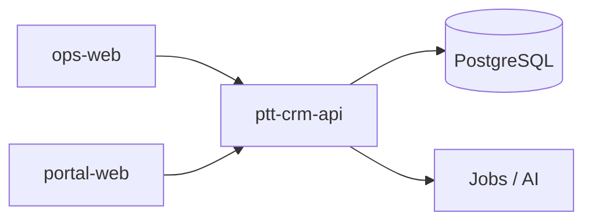

# Tổng quan hệ thống RNOSAI

> Domain: **Toàn hệ thống** · Cập nhật: 2026-08-10

## Mục đích

RNOSAI (Revenue Operating System + AI) là nền tảng vận hành doanh thu và AI cho agency marketing PTT — quản lý lead → triển khai dịch vụ → đo lường đa kênh (Meta, Zalo, Google, SEO, Email) với portal khách hàng và lớp AI.

## Thành phần kỹ thuật

| Thành phần | URL / Port | Vai trò |
|------------|------------|---------|
| **ops-web** | `https://rs.pttads.vn` | Console nhân viên |
| **portal-web** | `https://portal.pttads.vn` | Portal khách hàng |
| **ptt-crm-api** | Port 3000 | NestJS API monolith |
| **mobile-shell** | Capacitor | Wrapper native cho portal |
| **PostgreSQL** | `rnosaidb` | Database chính |
| **Temporal / Jobs** | Worker | Campaign writes, cron, AI jobs |

## Quy mô BA

- **129** màn hình (SCR)
- **157** use case (UC)
- **147** business rule (BR)

Nguồn: `docs/specs/RNOSAI-BA-Master-Spec.md` v2.3

## Kiến trúc luồng

## Danh sách domain

Xem [README.md](./README.md) — 15 file chi tiết theo MOD-*.

## Trạng thái milestone chính

| Milestone | Trạng thái |
|-----------|------------|
| Ops INT-P0→P4 | ✅ Staging |
| Content OS M0–M6 | ⚠️ UAT pending |
| MKT-AI Planner | ✅ Partial staging |
| WIN-1 / WIN-3 | ✅ Pass |
| WIN-4 SSO/OPA | ⬜ Draft |
| Flask monolith | 🔴 Retired |
