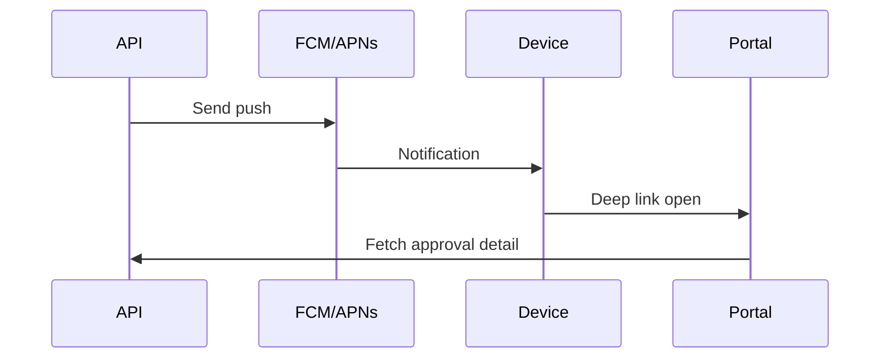

# Mobile

> **Module:** MOD-MOB  
> **App:** portal-web (PWA) · mobile-shell (Capacitor)

## Tính năng

| Tính năng | Mô tả |
|-----------|-------|
| Portal PWA | Installable web app | `NEXT_PUBLIC_PWA_ENABLED=1` |
| Capacitor shell | Wrapper iOS/Android | `services/mobile-shell/` |
| Native push | FCM (Android) / APNs (iOS) | `PTT_MOBILE_NATIVE_PUSH_ENABLED=1` |
| Web Push | Push qua service worker | Portal settings |
| Deep links | `pttads://approve/{id}` | Mở thẳng màn duyệt |
| Offline shell | Cache cơ bản PWA | Service worker |

## Luồng push notification



## Feature flags

```
NEXT_PUBLIC_PWA_ENABLED=1
PTT_MOBILE_NATIVE_PUSH_ENABLED=1
PTT_PORTAL_PUSH_ENABLED=1
NEXT_PUBLIC_PORTAL_PUSH=1
```

## Build & deploy

- Portal build: `services/portal-web/`
- Capacitor sync: `services/mobile-shell/`
- Scripts: `scripts/wave_b2_rebuild_portal_web.sh`

## Tài liệu tham chiếu

- `docs/specs/modules/RNOSAI-BA-MOB-UseCases.md` (nếu có)
- `docs/handover/mobile-setup.md` (nếu có)
