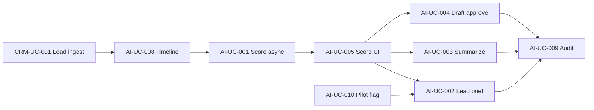

# Use Case — AI Revenue Operating System

> **Prefix:** AI · **Phiên bản:** 1.1 · **Ngày:** 2026-07-26  
> **Index:** [`README.md`](README.md) · **Spec:** [`SPEC_AI_REVENUE_OPERATING_SYSTEM.md`](../SPEC_AI_REVENUE_OPERATING_SYSTEM.md) · **UI:** [`SPEC_UI_UX_AI_REVENUE_OS.md`](../SPEC_UI_UX_AI_REVENUE_OS.md) · **90-day plan:** [`specs/2026-07-26-ai-phase1-90-day-plan.md`](../specs/2026-07-26-ai-phase1-90-day-plan.md)  
> **Actions:** [`actions/09-AI-ACTIONS.md`](actions/09-AI-ACTIONS.md)

---

## Ma trận traceability master spec

| Spec ref | UC | Actions |
|----------|-----|---------|
| §5.4 AI-01 Summarize | AI-UC-003 | ✅ §003 |
| §5.4 AI-02 Lead score | AI-UC-001, AI-UC-005 | ✅ §001, §005 |
| §5.4 AI-03 Deal score | AI-UC-012 | ✅ §012 |
| §5.4 AI-04 Churn | AI-UC-017 | ✅ §017 |
| §5.4 AI-05 Forecast | AI-UC-013 | ✅ §013 |
| §5.4 AI-06 NBA | AI-UC-011 | ✅ §011 |
| §5.4 AI-07 Smart reminders | AI-UC-015 | ✅ §015 |
| §5.4 AI-08 Content draft | AI-UC-004 | ✅ §004 |
| §5.4 AI-09 NL query | AI-UC-016 | ✅ §016 |
| §5.4 AI-10 Auto insights | AI-UC-018, AI-UC-019 | ✅ §018, §019 |
| §5.2 Lead Qualification Agent | AI-UC-001 | ✅ |
| §5.2 Follow-up Agent | AI-UC-004 | ✅ |
| §5.2 Pipeline Risk Agent | AI-UC-015 | ✅ |
| §5.2 Forecast Agent | AI-UC-013 | ✅ |
| §5.2 Renewal Agent | AI-UC-014 | ✅ |
| §5.2 Manager Coach Agent | AI-UC-018 | ✅ |
| §19 Gate R1 | AI-UC-001…010 | Pilot walkthrough 8 bước |
| §23 Phase 2–4 | AI-UC-011…019 | Target architecture |

---

## Phạm vi wave

| Wave | UC trong file | Trạng thái |
|------|---------------|------------|
| **Phase 0 + R1** (90 ngày) | AI-UC-001…010 | P0/P1 — ship target tuần 12 |
| **R2** | AI-UC-011, 012, 015, 020 | P0/P1 — workflow + NBA + routing |
| **R3** | AI-UC-013, 014, 016, 017, 018 | P1/P2 — Revenue OS |
| **R4** | AI-UC-019 | P2 — Channel AI |

**Business rules chung:**

- **BR-AI-01** — Không auto-send outbound (Zalo/email/SMS); draft → user **Duyệt** → copy vào activity hoặc clipboard.
- **BR-AI-02** — `confidence < 0.6` → banner cảnh báo; không ẩn score.
- **BR-AI-03** — 100% LLM/score calls ghi `ai_agent_runs` + `request_id`.
- **BR-AI-04** — CSKH chỉ copilot lead **owner=me** (403 lead khác); GDKD/Admin xem team.
- **BR-AI-05** — PII không log trong prompt prod (`AI_LOG_PROMPTS=0`).

---

## AI-UC-001 — Lead score async sau ingest

| Thuộc tính | Giá trị |
|------------|---------|
| **Actor chính** | System (worker, scoring engine) |
| **Actor phụ** | CSKH (consumer UI) |
| **Priority** | P0 |
| **Trigger** | Lead mới created hoặc `tenant.lead.created` / webhook ingest |

**Preconditions:** DDL applied; `AiIntelligenceModule` registered; feature flag bật cho client pilot.

**Main flow:**

1. Lead ingest hoàn tất ([CRM-UC-001](01-CRM-CORE.md), [PLAT-UC-004](07-PLATFORM-AUTH-WEBHOOKS.md)).
2. Outbox emit `tenant.lead.created` (RNOS-08).
3. Worker consume → `POST /api/v1/ai/score/lead` (internal hoặc job handler).
4. Rules engine tính score 0–100 + `explainability[]` (+/− factors).
5. Persist `ai_scores` + `ai_agent_runs`.
6. Emit `tenant.lead.scored` (optional domain event).
7. Copilot panel trên lead detail refresh score ≤30s (poll hoặc SSE).

**Extensions:**

- **E1 — Duplicate score 5 phút:** Idempotency key `lead_id + window` → skip hoặc update same row.
- **E2 — Thiếu attribution:** Score vẫn chạy; explainability flag `− Chưa map campaign`.
- **E3 — Score job fail:** Retry 3x; UI hiển thị "Score đang cập nhật" + manual refresh.

**Postconditions:** `ai_scores` có bản ghi mới; audit run id traceable.

**Traceability:** `POST /api/v1/ai/score/lead`, `GET /api/v1/ai/scores`, RNOS-04, RNOS-08, §12 AI Intelligence Service

---

## AI-UC-002 — Copilot — Lead brief

| Thuộc tính | Giá trị |
|------------|---------|
| **Actor chính** | CSKH / Sales |
| **Priority** | P0 |
| **Trigger** | Mở lead detail hoặc bấm **Tóm tắt nhanh** trên copilot panel |

**Preconditions:** Lead có ít nhất source; copilot flag `PTT_AI_COPILOT_ENABLED=1`; user là owner hoặc GDKD.

**Main flow:**

1. CSKH mở `/crm/leads/[id]`.
2. Sidebar **AI Copilot** load score card ([AI-UC-005](#ai-uc-005--xem-score--explainability)).
3. Bấm **Tóm tắt nhanh** → backend gather context: lead fields, last 5 activities, timeline events, campaign/CPL từ `meta_json`.
4. LLM trả 5 bullet tiếng Việt (who, need, source, risk, next step).
5. Hiển thị trong panel; user **Copy** hoặc **Dismiss**.
6. Ghi `ai_agent_runs` + optional `ai_insights` type=lead_brief.

**Extensions:**

- **E1 — Lead mới không activity:** Brief dựa trên form fields + source only.
- **E2 — Rate limit:** 429 → toast "Thử lại sau 1 phút".

**Postconditions:** Brief hiển thị; không thay đổi CRM core fields tự động.

**Traceability:** Copilot panel RNOS-06, `POST /api/v1/ai/summarize` (context=lead_brief), tuần 9 90-day plan

---

## AI-UC-003 — Copilot — Summarize activity

| Thuộc tính | Giá trị |
|------------|---------|
| **Actor chính** | CSKH |
| **Priority** | P0 |
| **Trigger** | Sau call/note dài hoặc chọn activity trên timeline |

**Preconditions:** Activity text ≥50 ký tự hoặc user paste note.

**Main flow:**

1. CSKH chọn activity trên timeline hoặc paste vào copilot textarea.
2. Bấm **Tóm tắt** → `POST /api/v1/ai/summarize` `{ entity_type: lead, entity_id, text }`.
3. Response: `{ summary, extracted: { intent, objections, next_action } }`.
4. User **Chấp nhận** → copy summary vào note mới (optional one-click).
5. Audit `ai_agent_runs`; P95 ≤5s staging.

**Extensions:**

- **E1 — Summary sai:** User edit thủ công; dismiss không bắt buộc reason.
- **E2 — Empty text:** Validation 400.

**Postconditions:** Summary hiển thị; CRM activity gốc không bị overwrite.

**Traceability:** RNOS-03, RNOS-06, §7.1 API summarize

---

## AI-UC-004 — Follow-up draft + approve

| Thuộc tính | Giá trị |
|------------|---------|
| **Actor chính** | CSKH |
| **Priority** | P0 |
| **Trigger** | Bấm **Soạn follow-up** trên copilot |

**Preconditions:** Lead có context (status B1/B2+); BR-AI-01 enforced.

**Main flow:**

1. CSKH bấm **Soạn follow-up** → chọn kênh gợi ý (Zalo / email / note nội bộ).
2. `POST /api/v1/ai/recommendation` `{ type: follow_up_draft, entity_type, entity_id, channel_hint }`.
3. LLM trả draft message → hiển thị textarea editable.
4. CSKH chỉnh sửa nội dung.
5. **Duyệt** → `PATCH /ai/recommendations/:id` `{ status: accepted }` → copy vào activity note / clipboard — **không gửi API outbound**.
6. Hoặc **Bỏ** → `{ status: dismissed, reason? }` ([AI-UC-007](#ai-uc-007--dismiss-recommendation--reason)).
7. Ghi `accepted_by`, timestamp.

**Extensions:**

- **E1 — Low confidence:** Banner BR-AI-02 trước khi duyệt.
- **E2 — GDKD review:** Optional flag pilot — mọi draft vẫn cần CSKH duyệt.

**Postconditions:** `ai_recommendations.status` = accepted|dismissed; không outbound send.

**Business rules:** BR-AI-01 — Approve ≠ Send.

**Traceability:** RNOS-07, `POST/PATCH /api/v1/ai/recommendation(s)`, §19.1 gate #3

---

## AI-UC-005 — Xem score + explainability

| Thuộc tính | Giá trị |
|------------|---------|
| **Actor chính** | CSKH, GDKD |
| **Priority** | P0 |
| **Trigger** | Mở lead detail copilot panel |

**Preconditions:** Score đã chạy ([AI-UC-001](#ai-uc-001--lead-score-async-sau-ingest)) hoặc đang pending.

**Main flow:**

1. Panel hiển thị score 0–100 + label hot/warm/cold.
2. Chips explain: `+ Meta campaign mapped`, `− Chưa gọi (2h)`, …
3. `GET /api/v1/ai/scores?entity_type=lead&entity_id=` trả history (latest highlighted).
4. Tooltip confidence %; banner nếu `< 0.6`.
5. Link **Xem lịch sử score** (optional drawer).

**Extensions:**

- **E1 — Chưa có score:** Skeleton + "Đang tính…" ≤30s.
- **E2 — Override active:** Hiển thị badge "GDKD điều chỉnh" ([AI-UC-006](#ai-uc-006--manager-override-score)).

**Postconditions:** User hiểu vì sao score cao/thấp (explainability ≥3 factors khi đủ data).

**Traceability:** RNOS-04, RNOS-06, table `ai_scores.explainability_json`

---

## AI-UC-006 — Manager override score

| Thuộc tính | Giá trị |
|------------|---------|
| **Actor chính** | GDKD / Head Sales |
| **Priority** | P1 (stretch tuần 11) |
| **Trigger** | Score sai nghiệp vụ; cần ưu tiên thủ công |

**Preconditions:** Cap `crm_gdkd` hoặc admin; score hiện tại visible.

**Main flow:**

1. GDKD mở lead copilot → **Điều chỉnh score**.
2. Nhập score mới (0–100) + **lý do bắt buộc**.
3. API tạo `ai_scores` row `source=manual_override`, `overridden_by`, `override_reason`.
4. UI cập nhật badge override; explainability giữ factors gốc + note override.
5. Audit trong `ai_agent_runs` action=override.

**Extensions:**

- **E1 — Revert:** Admin restore auto score từ rules engine.

**Postconditions:** Override traceable; không xóa score history.

**Traceability:** §15 RBAC, 90-day plan §8.2 stretch, `ai_scores.overridden_by`

---

## AI-UC-007 — Dismiss recommendation + reason

| Thuộc tính | Giá trị |
|------------|---------|
| **Actor chính** | CSKH |
| **Priority** | P1 |
| **Trigger** | Draft/summary/brief không hữu ích |

**Main flow:**

1. User bấm **Bỏ** trên recommendation card.
2. Optional modal: chọn reason (sai tone / sai fact / không cần / khác).
3. `PATCH /ai/recommendations/:id` `{ status: dismissed, dismiss_reason }`.
4. Metrics adoption: dismiss rate theo type.

**Postconditions:** Recommendation archived; không hiển thị lại pending.

**Traceability:** RNOS-29 partial, §16 KPI acceptance rate

---

## AI-UC-008 — Timeline enrich cho AI context

| Thuộc tính | Giá trị |
|------------|---------|
| **Actor chính** | System |
| **Actor phụ** | Platform worker |
| **Priority** | P0 |
| **Trigger** | Activity log, webhook meta, status change |

**Preconditions:** Phase 0 data gate ≥70% timeline completeness.

**Main flow:**

1. CRM activity create → ghi `customer_timeline_events` (RNOS-16).
2. Webhook lead meta → event `lead.ingested` + attribution snapshot.
3. Status change → event với payload `{ from, to }`.
4. AI context builder đọc timeline khi summarize/score/brief.
5. Completeness metric: % lead có ≥1 timeline event trong 24h.

**Extensions:**

- **E1 — Backfill:** Job one-time từ `crm_activities` legacy.

**Postconditions:** Copilot context đầy đủ hơn; score explainability chính xác hơn.

**Traceability:** RNOS-16, table `customer_timeline_events`, 90-day plan tuần 2–3

---

## AI-UC-009 — AI audit / agent run trace

| Thuộc tính | Giá trị |
|------------|---------|
| **Actor chính** | Admin, Compliance |
| **Actor phụ** | Tech lead |
| **Priority** | P0 |
| **Trigger** | Tra cứu incident, nghiệm thu G5 |

**Main flow:**

1. Mỗi AI call → insert `ai_agent_runs` (model, tokens, latency, status, `request_id`).
2. Admin mở `/admin/ai/runs` (target) hoặc SQL/report.
3. Filter theo `entity_id`, date, user, action type.
4. Drill-down: không hiển thị prompt PII prod (BR-AI-05).
5. Cross-link lead detail → "Run id" debug (dev/staging only).

**Postconditions:** 100% calls auditable; nghiệm thu gate R1 #4.

**Traceability:** RNOS-05, §19.1, table `ai_agent_runs`

---

## AI-UC-010 — Pilot gate / feature flag

| Thuộc tính | Giá trị |
|------------|---------|
| **Actor chính** | Platform / Product |
| **Actor phụ** | CSKH pilot cohort |
| **Priority** | P0 |
| **Trigger** | Tuần 11–12 go-live pilot |

**Main flow:**

1. Set `PTT_AI_COPILOT_ENABLED=1` + cohort user ids (5–8 CSKH).
2. Non-pilot users: copilot panel hidden; API 403 hoặc 404.
3. Monitor DAU, error rate, acceptance rate tuần 12.
4. Rollback: flag off → CRM core unaffected (RNOS-40 runbook).
5. Gate R1 sign-off §8.3.

**Postconditions:** Pilot metrics G2–G6 collected; backlog R2 prioritized.

**Traceability:** 90-day plan §11, RNOS-40, env `PTT_AI_COPILOT_ENABLED`

---

## AI-UC-011 — NBA trên deal stalled *(R2)*

| Thuộc tính | Giá trị |
|------------|---------|
| **Actor chính** | AM / Sales |
| **Actor phụ** | System (Pipeline Risk Agent), GDKD |
| **Priority** | P0 (R2) |
| **Trigger** | Deal/opportunity ≥7 ngày không activity hoặc daily scan RNOS-23 |

**Preconditions:** Deal score v1 (AI-UC-012) optional; timeline có data.

**Main flow:**

1. Daily job hoặc stage change → detect stall → `ai_recommendations` type=`nba`.
2. NBA card trên `/crm/pipeline` drawer hoặc copilot deal panel ([UI-R2-01](../SPEC_UI_UX_AI_REVENUE_OS.md)).
3. Gợi ý: gọi lại / gửi proposal / escalate GDKD + cite playbook RAG (RNOS-12).
4. Sales **Chấp nhận** → tạo task CRM + optional activity template.
5. **Bỏ** → reason → RNOS-29 feedback.
6. GDKD xem aggregate stall trên hub (optional).

**Extensions:**

- **E1 — Low confidence:** Banner BR-AI-02; vẫn cho accept.
- **E2 — Deal vừa Won:** Không emit NBA.

**Postconditions:** `revenue_actions` hoặc task created; recommendation status=accepted|dismissed.

**Traceability:** AI-06, RNOS-10, §23.4, [`actions/09-AI-ACTIONS.md`](actions/09-AI-ACTIONS.md#ai-uc-011--nba-trên-deal-stalled-r2)

---

## AI-UC-012 — Deal score *(R2)*

| Thuộc tính | Giá trị |
|------------|---------|
| **Actor chính** | Sales, GDKD |
| **Priority** | P1 |
| **Trigger** | Pipeline stage advance / quote created |

**Main flow:**

1. Stage change hoặc proposal attach → `POST /api/v1/ai/score/deal` (RNOS-09).
2. Score 0–100 + explain: aging, activity count, quote value, ads touch.
3. Kanban card mini-bar trên `/crm/pipeline` ([UI-R2-02](../SPEC_UI_UX_AI_REVENUE_OS.md)).
4. Deal drawer copilot reuse ScoreCard pattern.
5. GDKD override tương tự AI-UC-006 (BR-AI-05).

**Traceability:** AI-03, RNOS-09, §4.3

---

## AI-UC-013 — Forecast commit *(R3)*

| Thuộc tính | Giá trị |
|------------|---------|
| **Actor chính** | GDKD, Leadership |
| **Priority** | P1 |
| **Trigger** | Daily 07:00 ICT job hoặc cuối tháng planning |

**Main flow:**

1. Forecast Agent chạy → `POST /api/v1/ai/forecast` → snapshot (RNOS-17).
2. GDKD mở `/crm/forecast` — xem pipeline weighted vs AI delta ([UI-R3-01](../SPEC_UI_UX_AI_REVENUE_OS.md)).
3. Review explain factors (stage, seasonality, stall count).
4. **Cam kết** số forecast → ghi `revenue_forecast_snapshots.committed_by`.
5. Leadership export PDF / hub widget.

**Extensions:**

- **E1 — MAPE >20% prior month:** Banner cảnh báo trước commit.

**Postconditions:** Snapshot immutable; MAPE trackable vs actual.

**Traceability:** AI-05, RNOS-17, 18, §23.4, §19.3

---

## AI-UC-014 — Renewal agent workflow *(R3)*

| Thuộc tính | Giá trị |
|------------|---------|
| **Actor chính** | AM, System (Renewal Agent) |
| **Priority** | P1 |
| **Trigger** | HĐ T-90 / T-60 / T-30 ([CRM-UC-011](01-CRM-CORE.md)) |

**Main flow:**

1. Workflow trigger trên lifecycle Retain / contract end date.
2. Renewal card trên `/agency/clients/[id]` — health + churn score ref (AI-UC-017).
3. Agent draft renewal email/Zalo → AM review (BR-AI-01).
4. AM **Duyệt** → task follow-up; không auto-send.
5. Track renewal outcome Won/Lost → feedback loop.

**Traceability:** RNOS-20, §5.2 Renewal Agent, §23.4

---

## AI-UC-015 — Pipeline risk & smart reminder *(R2)*

| Thuộc tính | Giá trị |
|------------|---------|
| **Actor chính** | System, GDKD, Sales |
| **Priority** | P1 |
| **Trigger** | Daily scan RNOS-23; SLA breach pipeline stage |

**Main flow:**

1. Pipeline Risk Agent scan → deals at-risk list.
2. Notify GDKD inbox + optional Slack.
3. Smart reminder task auto-suggest (AI-07) — user confirm create.
4. Link từ alert → deal copilot / NBA (AI-UC-011).

**Traceability:** AI-07, RNOS-23, §5.2 Pipeline Risk Agent

---

## AI-UC-016 — NL analytics curated *(R3)*

| Thuộc tính | Giá trị |
|------------|---------|
| **Actor chính** | GDKD, CEO |
| **Priority** | P2 |
| **Trigger** | Mở `/crm/ai/query` hoặc Cmd+K palette |

**Preconditions:** Cap `ai_analytics.query`; curated catalog ~50 câu hỏi (không free SQL).

**Main flow:**

1. User chọn câu hỏi preset hoặc gõ trong whitelist intent.
2. `POST /api/v1/ai/query` → chart/table + narrative VN.
3. Read-only — không mutate CRM.
4. Export CSV snapshot.

**Extensions:**

- **E1 — Out of scope question:** “Câu hỏi ngoài phạm vi — chọn từ danh sách.”

**Traceability:** AI-09, RNOS-22, §23.4

---

## AI-UC-017 — Churn & CS health score *(R3)*

| Thuộc tính | Giá trị |
|------------|---------|
| **Actor chính** | AM, CS Lead |
| **Priority** | P1 |
| **Trigger** | Ticket spike, NPS drop, usage signal |

**Main flow:**

1. `POST /api/v1/ai/score/churn` per client/account (RNOS-19).
2. Display on `/crm/health` + client detail tab.
3. Explain: ticket volume, sentiment, payment delay.
4. Trigger renewal workflow nếu score < threshold (link AI-UC-014).

**Traceability:** AI-04, RNOS-19, §4.9

---

## AI-UC-018 — Manager coach weekly digest *(R3)*

| Thuộc tính | Giá trị |
|------------|---------|
| **Actor chính** | GDKD, Head Sales |
| **Priority** | P2 |
| **Trigger** | Weekly job Thứ 2 08:00 |

**Main flow:**

1. Manager Coach Agent aggregate: SLA breach, acceptance rate, top dismiss reasons.
2. Email + `/crm/ai/coach` dashboard cards.
3. Drill-down → lead/deal examples (read-only).
4. No auto personnel action.

**Traceability:** AI-10, RNOS-21, §5.2 Manager Coach Agent

---

## AI-UC-019 — Channel CPL/ROAS anomaly digest *(R4)*

| Thuộc tính | Giá trị |
|------------|---------|
| **Actor chính** | Media Buyer, AM |
| **Priority** | P2 |
| **Trigger** | CPL spike / zero lead 24h trên mapped campaign |

**Main flow:**

1. Channel AI job compare Meta+Zalo hub metrics.
2. Narrative banner on `/meta/facebook-ads` + `/zalo/zalo-ads` ([UI-R4-01](../SPEC_UI_UX_AI_REVENUE_OS.md)).
3. Link drill → leads affected + copilot context.
4. Budget recommend read-only (governance write separate).

**Traceability:** §23.5, §22.5 moat độc quyền, RNOS-28 partial

---

## AI-UC-020 — Workflow AI node (simulate + publish) *(R2)*

| Thuộc tính | Giá trị |
|------------|---------|
| **Actor chính** | Admin, Ops |
| **Priority** | P1 |
| **Trigger** | Tạo/sửa workflow trên `/crm/automation` |

**Main flow:**

1. Admin kéo node **AI score** / **AI summarize** vào graph (RNOS-14).
2. **Simulate** trên sample entity — không mutate prod (RNOS-15, §19.2 gate).
3. Publish workflow → live on trigger event.
4. Audit mọi AI node execution trong `ai_agent_runs`.

**Traceability:** RNOS-13, 14, 15, AU-01, §11 Workflow

---

## Sơ đồ phụ thuộc Phase 1

---

## Traceability RNOS deliverables

| RNOS | UC |
|------|-----|
| RNOS-01 | AI-UC-008 (DDL prerequisite) |
| RNOS-02 | AI-UC-009 (module health) |
| RNOS-03 | AI-UC-003 |
| RNOS-04 | AI-UC-001, AI-UC-005 |
| RNOS-05 | AI-UC-009 |
| RNOS-06 | AI-UC-002, AI-UC-005 |
| RNOS-07 | AI-UC-004, AI-UC-007 |
| RNOS-08 | AI-UC-001 |
| RNOS-16 | AI-UC-008 |
| RNOS-09 | AI-UC-012 |
| RNOS-10 | AI-UC-011 |
| RNOS-17, 18 | AI-UC-013 |
| RNOS-19 | AI-UC-017 |
| RNOS-20 | AI-UC-014 |
| RNOS-21 | AI-UC-018 |
| RNOS-22 | AI-UC-016 |
| RNOS-23 | AI-UC-015 |
| RNOS-29 | AI-UC-007, 011 |
| RNOS-39 | All P0 R1 (E2E) |
| RNOS-40 | AI-UC-010 |
