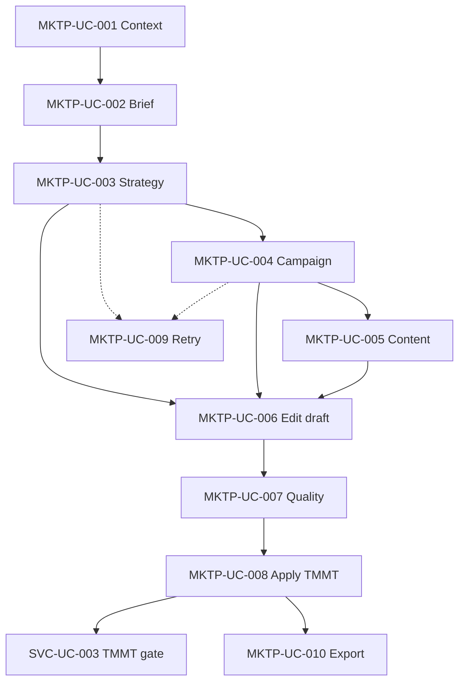

# Use Case — AI Marketing Planner (MarketingAiPlannerModule)

> **Prefix:** MKTP · **Phiên bản:** 1.0 · **Ngày:** 2026-08-08  
> **Index:** [`README.md`](README.md) · **Integration spec:** [`specs/2026-08-08-mkt-ai-planner-integration-spec.md`](../specs/2026-08-08-mkt-ai-planner-integration-spec.md) · **DDL:** [`specs/2026-08-08-postgresql-ddl-mkt-ai-planner.sql`](../specs/2026-08-08-postgresql-ddl-mkt-ai-planner.sql)  
> **BA module:** [`specs/modules/RNOSAI-BA-MKTP-UseCases.md`](../specs/modules/RNOSAI-BA-MKTP-UseCases.md)  
> **Actions:** [`actions/10-MKTP-ACTIONS.md`](actions/10-MKTP-ACTIONS.md)  
> **Parent SVC:** [SVC-UC-003](02-AGENCY-SERVICE-DELIVERY.md#svc-uc-003--deliver-stage--tmmt-chính-thức) · [SVC-UC-011](02-AGENCY-SERVICE-DELIVERY.md)

---

## Ma trận traceability

| Spec / Deliverable | UC | Phase |
|--------------------|-----|-------|
| MKT-AI-01 DDL | MKTP-UC-001 | P0 |
| MKT-AI-02 API brief/strategy/campaign/content/apply | MKTP-UC-002…008 | P0 |
| MKT-AI-04 UI tab ai-planner | MKTP-UC-001…010 | P0 |
| MKT-AI-05 Quality score | MKTP-UC-007 | P0 |
| MKT-AI-06 Export | MKTP-UC-008 | P0 |
| MKT-AI-07 TMMT gate | MKTP-UC-009, MKTP-UC-010 | P0 |
| EC-MKT-AI-01…07 | Actions §002…§010 | P0–P2 |
| MKT-AI-10 RAG KB | MKTP-UC-011 | P1 |
| MKT-AI-11 Budget sim | MKTP-UC-012 | P1 |
| MKT-AI-12 Approval | MKTP-UC-013 | P1 |
| MKT-AI-13 Version | MKTP-UC-014 | P1 |
| MKT-AI-14 Presales bridge | MKTP-UC-015 | P1 |
| MKT-AI-20 Dashboard | MKTP-UC-016 | P2 |
| MKT-AI-21 Optimize | MKTP-UC-017 | P2 |
| MKT-AI-30 Multi-agent | MKTP-UC-019 | P3 |
| BR-AI-03 audit pattern | All generate UCs | P0 |

**API base:** `/api/v1/service-lifecycle/:lifecycleId/ai-planner`  
**UI primary:** `/crm/service-delivery/[id]?tab=ai-planner`

---

## Phạm vi phase

| Phase | UC | Priority | Trạng thái |
|-------|-----|----------|------------|
| **P0 — MVP** | MKTP-UC-001…010 | P0 | Target ship tuần 1–6 |
| **P1 — RAG + collab** | MKTP-UC-011…015 | P1 | Tuần 7–10 |
| **P2 — KPI + optimize** | MKTP-UC-016…018 | P1/P2 | Tuần 11–14 |
| **P3 — Enterprise** | MKTP-UC-019…020 | P2 | Tuần 15–20 |

---

## Business rules (module)

| Mã | Mô tả |
|----|--------|
| **BR-MKTP-01** | Human-in-the-loop: AI draft → user edit → **Apply** mới ghi TMMT chính thức; không silent merge. |
| **BR-MKTP-02** | Không auto-advance lifecycle stage; chỉ hỗ trợ điền + validate TMMT ([SVC-UC-001](02-AGENCY-SERVICE-DELIVERY.md)). |
| **BR-MKTP-03** | Mọi job AI ghi `mkt_ai_jobs` + optional `ai_agent_runs` (BR-AI-03). |
| **BR-MKTP-04** | Tab `ai-planner` chỉ full edit khi stage `onboard` hoặc `deliver`; stage sớm hơn read-only hoặc ẩn. |
| **BR-MKTP-05** | Apply blocked nếu `quality_score < 60`; export blocked nếu `< 60` hoặc thiếu cap `crm_mkt_ai.export`. |
| **BR-MKTP-06** | Retry job failed không xóa `mkt_ai_drafts` (EC-MKT-AI-05). |
| **BR-MKTP-07** | Sau Apply, `validateOfficialTmmt` phải pass trước khi Workflow cho phép **Chuyển → Triển khai** (gate hiện có). |
| **BR-MKTP-08** | Fallback rule-based khi thiếu `OPENAI_API_KEY`; banner cảnh báo trên UI. |
| **BR-MKTP-09** | Phase 2: Export PDF/DOCX cần `crm_mkt_ai.approve` khi approval workflow bật. |
| **BR-MKTP-10** | RAG: generation phải cite ≥1 chunk khi brand KB indexed (EC-MKT-AI-06). |

---

## MKTP-UC-001 — Mở AI Planner context trên lifecycle

| Thuộc tính | Giá trị |
|------------|---------|
| **Actor chính** | Solution Strategist (SP), AM |
| **Actor phụ** | System |
| **Priority** | P0 |
| **Trigger** | Mở `/crm/service-delivery/:id` tab **AI Planner** |

**Preconditions:**

- `PTT_MKT_AI_PLANNER_ENABLED=1` và `NEXT_PUBLIC_MKT_AI_PLANNER=1`.
- User có `crm_board.view` + `crm_mkt_ai.view`.
- Lifecycle tồn tại; stage ≥ `onboard` (hoặc pilot slug trong whitelist).

**Main flow:**

1. User mở lifecycle detail → tab **AI Planner**.
2. `GET /ai-planner/context` trả: brief, draft, jobs[], `tmmt_validation`, feature flags.
3. UI hiển thị `AiTmmtGateBanner` (pass/fail) + stepper bước 1 Brief.
4. Prefill brief từ consult-brief + onboarding-brief nếu chưa có `mkt_ai_briefs`.
5. Job panel load trạng thái jobs gần nhất.

**Extensions:**

- **E1 — Flag off:** Tab không render (fail-closed).
- **E2 — Stage lead/proposal:** Banner *「Chưa onboard — chỉ xem」* read-only.
- **E3 — Chưa promote TMMT official:** Banner link tab TMMT + presales R5.

**Postconditions:** Context cached client-side; không mutate TMMT.

**Traceability:** SCR-MKT-AI-001 · `MarketingAiPlannerPanel` · MKT-AI-04

---

## MKTP-UC-002 — Lưu Brief intake (Step 1)

| Thuộc tính | Giá trị |
|------------|---------|
| **Actor chính** | SP |
| **Priority** | P0 |
| **Trigger** | Nhập/sửa brief form · blur field · bấm **Lưu nháp** |

**Preconditions:** `crm_board.edit` hoặc role có quyền brief; lifecycle stage cho phép edit.

**Main flow:**

1. User điền `BriefIntakeForm` (brand, industry, objective, budget, geo, pain, …).
2. Client validate required fields inline (VI).
3. `PATCH /ai-planner/brief` → upsert `mkt_ai_briefs.brief_json`.
4. Server trả `brief_validation: { ok, missing[] }`.
5. Autosave debounce 800ms; toast *「Đã lưu brief」*.

**Extensions:**

- **E1 — Thiếu field bắt buộc:** Inline error + scroll; **Tiếp tục** blocked (EC-MKT-AI-01).
- **E2 — Cap read-only:** Form disabled; banner upsell cap.

**Postconditions:** `mkt_ai_briefs` 1 row/lifecycle; validation_json cập nhật.

**Traceability:** SCR-MKT-AI-001a · `mkt_ai_briefs` · EC-MKT-AI-01

---

## MKTP-UC-003 — Sinh chiến lược AI (Step 2)

| Thuộc tính | Giá trị |
|------------|---------|
| **Actor chính** | SP |
| **Actor phụ** | System (orchestrator, LLM) |
| **Priority** | P0 |
| **Trigger** | Bấm **Sinh chiến lược AI** |

**Preconditions:** Brief validation ok; `crm_mkt_ai.generate`; brief đủ field required.

**Main flow:**

1. `POST /ai-planner/jobs/strategy` → row `mkt_ai_jobs` status `pending`.
2. Orchestrator: `strategy_generate` — map output → `strategy_framework` + `target_market_prof` keys + SWOT.
3. Job panel poll → `running` → `succeeded` (latency hiển thị).
4. Merge output vào `mkt_ai_drafts` (không ghi TMMT official).
5. UI `AiStrategySections` hiển thị accordion editable; quality stub score.

**Extensions:**

- **E1 — Job failed:** status `failed` + error_message; draft cũ giữ nguyên; **[Thử lại]** ([MKTP-UC-009](#mktp-uc-009--retry-job-ai-giữ-draft)).
- **E2 — Sinh lại:** Confirm modal nếu user đã edit sections.
- **E3 — No OPENAI_API_KEY:** Rule-based template (BR-MKTP-08).

**Postconditions:** 4 core TMMT prof keys có nội dung draft (EC-MKT-AI-02); job audited.

**Traceability:** POST `/jobs/strategy` · `mkt_ai_jobs` · `mkt_ai_drafts` · EC-MKT-AI-02

---

## MKTP-UC-004 — Sinh chiến dịch AI (Step 3)

| Thuộc tính | Giá trị |
|------------|---------|
| **Actor chính** | SP |
| **Priority** | P0 |
| **Trigger** | Bấm **Sinh chiến dịch AI** |

**Preconditions:** Strategy draft tồn tại (khuyến nghị); brief có budget + objective.

**Main flow:**

1. `POST /ai-planner/jobs/campaigns`.
2. Orchestrator sinh 1..N campaigns (channel_mix, budget_pct, timeline, KPI).
3. Persist `mkt_ai_campaigns` + snapshot trong `mkt_ai_drafts.campaigns_json`.
4. UI `AiCampaignBuilder` — card list; cho phép **+ Thêm thủ công**.

**Extensions:**

- **E1 — Manual campaign:** POST campaign row `is_manual=true` không qua job.
- **E2 — Objective preset:** Channel mix theo `lead|awareness|sales` từ brief.

**Postconditions:** ≥1 campaign row; job succeeded.

**Traceability:** SCR-MKT-AI-001c · `mkt_ai_campaigns`

---

## MKTP-UC-005 — Sinh lịch nội dung 30 ngày (Step 4)

| Thuộc tính | Giá trị |
|------------|---------|
| **Actor chính** | SP |
| **Priority** | P0 |
| **Trigger** | Bấm **Sinh lịch 30 ngày** / tab Content |

**Preconditions:** Campaign draft khuyến nghị; `crm_mkt_ai.generate`.

**Main flow:**

1. `POST /ai-planner/jobs/content`.
2. Output: calendar entries + ad copy variants + email sequence stubs.
3. Persist `mkt_ai_content_assets` (types: calendar, ad_copy, email_sequence).
4. UI calendar grid + day drawer edit.

**Extensions:**

- **E1 — Edit single day:** PATCH asset body locally → debounce save draft.
- **E2 — Tab Ad copy / Email:** Table/card edit without re-run full job.

**Postconditions:** Content assets linked lifecycle; draft content_json updated.

**Traceability:** SCR-MKT-AI-001d · `mkt_ai_content_assets`

---

## MKTP-UC-006 — Chỉnh sửa draft trước Apply

| Thuộc tính | Giá trị |
|------------|---------|
| **Actor chính** | SP |
| **Priority** | P0 |
| **Trigger** | Edit textarea accordion strategy/prof/campaign/content |

**Preconditions:** Draft tồn tại; `crm_board.edit`.

**Main flow:**

1. User sửa bất kỳ section trong Steps 2–4.
2. Client PATCH draft endpoint hoặc debounce `PUT` working state → `mkt_ai_drafts`.
3. Không trigger TMMT official PATCH cho đến Apply.
4. Version label *「Đã chỉnh sửa thủ công」* trên section.

**Postconditions:** Draft user-edited; distinguishable from raw AI output in audit metadata.

**Business rules:** BR-MKTP-01

**Traceability:** Inline edit all strategy sections · `mkt_ai_drafts`

---

## MKTP-UC-007 — Quality score & gate Apply (Step 5)

| Thuộc tính | Giá trị |
|------------|---------|
| **Actor chính** | SP |
| **Priority** | P0 |
| **Trigger** | Vào Step 5 Apply · auto run quality job |

**Preconditions:** Draft có strategy + prof partial.

**Main flow:**

1. `POST /ai-planner/jobs/quality` (hoặc inline calc) → 6 criteria → score 0–100.
2. UI `AiQualityScoreCard` — checklist + score.
3. Score ≥70: enable **Apply** + full export.
4. Score 60–69: Apply với confirm; export DOCX only.
5. Score <60: Apply disabled (BR-MKTP-05).

**Postconditions:** `mkt_ai_drafts.quality_score_json` populated.

**Traceability:** EC-MKT-AI quality thresholds · MKT-AI-05

---

## MKTP-UC-008 — Apply draft vào TMMT chính thức

| Thuộc tính | Giá trị |
|------------|---------|
| **Actor chính** | SP |
| **Priority** | P0 |
| **Trigger** | Bấm **Apply vào TMMT chính thức** → confirm modal |

**Preconditions:** Quality score ≥60; checkbox review; `crm_board.edit`.

**Main flow:**

1. Modal hiển thị diff fields sẽ ghi đè.
2. User tick *「Tôi đã review nội dung AI」* → **Xác nhận Apply**.
3. `POST /ai-planner/apply` → merge draft → `PATCH .../marketing-plan` official.
4. Job `apply_to_tmmt` logged; optional `mkt_ai_plan_versions` snapshot v1.
5. `GET .../marketing-plan` validation refresh → banner gate cập nhật.
6. Toast *「Đã apply — Gate TMMT: pass/fail」*.

**Extensions:**

- **E1 — Validation still fail:** Banner đỏ + link tab TMMT manual fix.
- **E2 — No official plan row:** 409 hướng dẫn promote presales trước.

**Postconditions:** `crm_marketing_plans` official updated; EC-MKT-AI-03.

**Business rules:** BR-MKTP-01, BR-MKTP-07

**Traceability:** POST `/apply` · `LifecycleTmmtPanel` sync · EC-MKT-AI-03

---

## MKTP-UC-009 — Retry job AI (giữ draft)

| Thuộc tính | Giá trị |
|------------|---------|
| **Actor chính** | SP |
| **Priority** | P0 |
| **Trigger** | Job status `failed` → **Thử lại** |

**Preconditions:** Prior job failed; draft sections từ bước trước còn nguyên.

**Main flow:**

1. User bấm **Thử lại** trên `AiJobProgressPanel`.
2. `POST /ai-planner/jobs/:type` (new job row; prior job archived).
3. On success: merge new output vào draft (replace section tương ứng only).
4. On fail again: same draft visible — không rollback UI state.

**Postconditions:** EC-MKT-AI-05 pass; failed job history retained.

**Business rules:** BR-MKTP-06

**Traceability:** SCR-MKT-AI-003 failed state · EC-MKT-AI-05

---

## MKTP-UC-010 — Export kế hoạch PDF/DOCX/XLSX

| Thuộc tính | Giá trị |
|------------|---------|
| **Actor chính** | SP, AM |
| **Priority** | P0 |
| **Trigger** | Bấm **PDF Kế hoạch** / DOCX / Excel KPI |

**Preconditions:** Quality ≥60; cap `crm_mkt_ai.export`; post-apply khuyến nghị.

**Main flow:**

1. `POST /ai-planner/export` `{ format }`.
2. Server generate file; insert `mkt_ai_exports` audit.
3. Browser download `{client_slug}-{date}.{ext}`.
4. Optional attach to SOP handover ([SVC-UC-004](02-AGENCY-SERVICE-DELIVERY.md)).

**Extensions:**

- **E1 — Export without apply:** Allowed if score ≥ threshold; watermark *「DRAFT」* on PDF.

**Postconditions:** EC-MKT-AI-04; export row audited.

**Traceability:** `mkt_ai_exports` · MKT-AI-06

---

## MKTP-UC-011 — Upload Brand KB & RAG retrieval (Phase 2)

| Thuộc tính | Giá trị |
|------------|---------|
| **Actor chính** | SP, MKT Lead |
| **Priority** | P1 |
| **Trigger** | Sub-tab **Brand KB** → upload PDF/DOCX |

**Preconditions:** Phase 2 flag; lifecycle edit allowed.

**Main flow:**

1. `POST /ai-planner/documents` multipart upload.
2. Worker chunk + index → `mkt_ai_documents` + `mkt_ai_document_chunks` (FTS).
3. Toggle *「Dùng RAG khi sinh」* on brief/strategy jobs.
4. Generation cites chunk `[📎 filename p.N]` in output (BR-MKTP-10).

**Postconditions:** EC-MKT-AI-06; indexed doc status `indexed`.

**Traceability:** SCR-MKT-AI-020 · MKT-AI-10

---

## MKTP-UC-012 — Budget simulator scenarios (Phase 2)

| Thuộc tính | Giá trị |
|------------|---------|
| **Actor chính** | SP, Media Buyer |
| **Priority** | P1 |
| **Trigger** | **Sinh budget scenarios** · chọn scenario |

**Main flow:**

1. `POST /ai-planner/jobs/budget-simulate` → 2–5 rows `mkt_ai_budget_scenarios`.
2. UI table Conservative / Balanced / Aggressive.
3. **Áp dụng scenario** → update campaign budget_pct in draft.
4. Link read-only WIN-4-C Meta budget recommend card.

**Traceability:** SCR-MKT-AI-021 · MKT-AI-11

---

## MKTP-UC-013 — Approval workflow trước export (Phase 2)

| Thuộc tính | Giá trị |
|------------|---------|
| **Actor chính** | SP (request), MKT Lead / GDKD (approve) |
| **Priority** | P1 |
| **Trigger** | **Gửi duyệt** trên Step 5 |

**Main flow:**

1. Create `mkt_ai_plan_versions` status `pending_approval` + `mkt_ai_approvals`.
2. Approver nhận notification (WIN-4-D pattern).
3. **Duyệt** / **Yêu cầu sửa** / **Từ chối** → update approval + version status.
4. Export enabled only when `approved` (BR-MKTP-09).

**Traceability:** `AiPlanApprovalBar` · MKT-AI-12 · cap `crm_mkt_ai.approve`

---

## MKTP-UC-014 — Version compare & rollback (Phase 2)

| Thuộc tính | Giá trị |
|------------|---------|
| **Actor chính** | SP, MKT Lead |
| **Priority** | P1 |
| **Trigger** | Mở drawer **So sánh phiên bản** |

**Main flow:**

1. `GET /ai-planner/versions` list v1…vN.
2. Side-by-side diff TMMT keys (WinDiffChip pattern).
3. **Rollback** → restore draft from version snapshot (không auto-apply TMMT).

**Traceability:** `mkt_ai_plan_versions` · MKT-AI-13

---

## MKTP-UC-015 — Presales R5 AI draft bridge (Phase 2)

| Thuộc tính | Giá trị |
|------------|---------|
| **Actor chính** | SP |
| **Priority** | P1 |
| **Trigger** | Lead funnel R5 → **AI draft KH MKT** |

**Main flow:**

1. `POST /api/v1/leads/:id/presales/marketing-plan/ai-draft`.
2. Draft preliminary plan on presales.
3. At contract promote → clone to official lifecycle TMMT.
4. Lifecycle AI Planner prefill from promoted plan.

**Traceability:** SCR-MKT-AI-010 · SPEC_HE_THONG_PTT §13.4 · MKT-AI-14

---

## MKTP-UC-016 — KPI dashboard trên lifecycle (Phase 3)

| Thuộc tính | Giá trị |
|------------|---------|
| **Actor chính** | AM, SP |
| **Priority** | P1 |
| **Trigger** | Tab **Dashboard** · stage deliver/retain |

**Main flow:**

1. `GET /ai-planner/dashboard` aggregates agency KPI + Meta spend.
2. Tiles: Spend MTD, CPL, ROAS, Leads — 6-week trend.
3. Load <3s staging (EC-MKT-AI-07).

**Traceability:** SCR-MKT-AI-030 · MKT-AI-20

---

## MKTP-UC-017 — Optimization copilot (Phase 3)

| Thuộc tính | Giá trị |
|------------|---------|
| **Actor chính** | SP, Media Buyer |
| **Priority** | P2 |
| **Trigger** | KPI lệch ngưỡng → card đề xuất |

**Main flow:**

1. `POST /ai-planner/jobs/optimize` với context KPI delta.
2. Recommendations → **Tạo task lifecycle** custom (human approve).
3. Không auto-change Meta campaigns (BR-MKTP-01 parity).

**Traceability:** MKT-AI-21

---

## MKTP-UC-018 — Alert KPI lệch (Phase 3)

| Thuộc tính | Giá trị |
|------------|---------|
| **Actor chính** | System, AM |
| **Priority** | P2 |
| **Trigger** | Weekly job / ingest webhook CPL spike |

**Main flow:**

1. Detect CPL/ROAS vs TMMT target.
2. Push `staff_notifications` to assigned AM/SP.
3. Deep link lifecycle `?tab=ai-planner&sub=dashboard`.

**Traceability:** MKT-AI-22 · WIN-4-D notifications

---

## MKTP-UC-019 — Multi-agent pipeline (Phase 4)

| Thuộc tính | Giá trị |
|------------|---------|
| **Actor chính** | SP, Admin |
| **Priority** | P2 |
| **Trigger** | Chọn pipeline Strategist→Planner→Copywriter→Analyst |

**Main flow:**

1. `POST /ai-planner/jobs/multi-agent` orchestrates sub-jobs.
2. Each agent step logged separate `mkt_ai_jobs` child refs.
3. Admin config via `/admin/ai/agents` linkage.

**Traceability:** SCR-MKT-AI-040 · MKT-AI-30

---

## MKTP-UC-020 — Industry playbook template (Phase 4)

| Thuộc tính | Giá trị |
|------------|---------|
| **Actor chính** | SP |
| **Priority** | P2 |
| **Trigger** | Chọn playbook theo `service_slug` |

**Main flow:**

1. Load JSON playbook (BĐS, Meta lead-gen, SEO) per lifecycle service.
2. Prefill brief + strategy prompts before LLM call.
3. Campaign Quality Score gate trước Launch QA ([SVC-UC-005](02-AGENCY-SERVICE-DELIVERY.md)).

**Traceability:** MKT-AI-31 · MKT-AI-32

---

## Sơ đồ phụ thuộc UC

---

## Danh sách UC (tóm tắt)

| ID | Tên | Priority |
|----|-----|----------|
| MKTP-UC-001 | Mở AI Planner context | P0 |
| MKTP-UC-002 | Lưu Brief intake | P0 |
| MKTP-UC-003 | Sinh chiến lược AI | P0 |
| MKTP-UC-004 | Sinh chiến dịch AI | P0 |
| MKTP-UC-005 | Sinh lịch nội dung | P0 |
| MKTP-UC-006 | Chỉnh sửa draft | P0 |
| MKTP-UC-007 | Quality score | P0 |
| MKTP-UC-008 | Apply TMMT chính thức | P0 |
| MKTP-UC-009 | Retry job giữ draft | P0 |
| MKTP-UC-010 | Export PDF/DOCX/XLSX | P0 |
| MKTP-UC-011 | Brand KB RAG | P1 |
| MKTP-UC-012 | Budget simulator | P1 |
| MKTP-UC-013 | Approval workflow | P1 |
| MKTP-UC-014 | Version compare | P1 |
| MKTP-UC-015 | Presales R5 bridge | P1 |
| MKTP-UC-016 | KPI dashboard | P1 |
| MKTP-UC-017 | Optimization copilot | P2 |
| MKTP-UC-018 | KPI drift alert | P2 |
| MKTP-UC-019 | Multi-agent pipeline | P2 |
| MKTP-UC-020 | Industry playbook | P2 |
