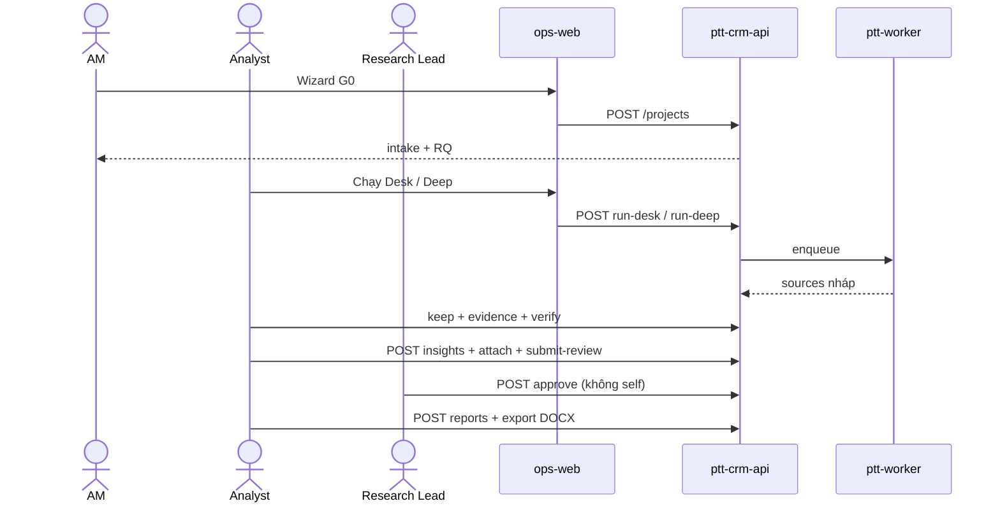

# Use Case — Market Research OS (MarketResearchModule)

> **Prefix:** RES · **Phiên bản:** 1.0 · **Ngày:** 2026-08-14  
> **Index:** [`README.md`](README.md)  
> **Design:** [`../superpowers/specs/2026-08-14-market-research-os-design.md`](../superpowers/specs/2026-08-14-market-research-os-design.md)  
> **SRS:** [`../specs/2026-08-14-market-research-os-srs.md`](../specs/2026-08-14-market-research-os-srs.md)  
> **UX/UI:** [`../specs/2026-08-14-market-research-os-ui-ux.md`](../specs/2026-08-14-market-research-os-ui-ux.md)  
> **BA module:** [`../specs/modules/RNOSAI-BA-RES-UseCases.md`](../specs/modules/RNOSAI-BA-RES-UseCases.md)  
> **Actions:** [`actions/12-RES-ACTIONS.md`](actions/12-RES-ACTIONS.md)  
> **Parent DV:** DV12 Báo cáo phân tích thị trường · **Không** trộn [CRM Sales Market BĐS](01-CRM-CORE.md)

---

## Ma trận traceability

| Spec / Deliverable | UC | Phase |
|--------------------|-----|-------|
| Nav «Lên kế hoạch» | RES-UC-001, 013 | P0 |
| G0 wizard + RQ | RES-UC-002, 003 | P0 |
| G3 Desk Tavily | RES-UC-004, 014, 019, 020 | P0 |
| G3 Deep Research | RES-UC-005 | P0 |
| G4 Evidence | RES-UC-006, 017 | P0 |
| G6 Insight + gate | RES-UC-007, 008, 011, 018 | P0 |
| G7–G8 Report DOCX | RES-UC-009, 012 | P0 |
| Tenancy + flag + audit | RES-UC-010, 013, 016 | P0 |
| Project state | RES-UC-015 | P0 |
| Rubric / CI / plan insert / DV12 | RES-UC-021…027 | P1 |
| Studies / agent / bilingual / KPI | RES-UC-030…033 | P2 |
| Portal / waves / decision | RES-UC-040…042 | P3 |
| PDF + Content OS cite | RES-UC-050…051 | P4 |
| Whisper excerpts + SparkToro sources | RES-UC-060…061 | P5 |
| Codebook import + Van Westendorp lite | RES-UC-062…063 | P6 |
| RAG search + taxonomy | RES-UC-070…071 | P7 |
| RAG copilot inject | RES-UC-072 | P8 |
| EC-RES-01…12 | Actions walkthrough | P0 |

**API base:** `/api/v1/research`  
**UI primary:** `/crm/research` · `/crm/research/new` · `/crm/research/[id]` · `/crm/research/taxonomy`

---

## Phạm vi phase

| Phase | UC | Priority | Trạng thái |
|-------|-----|----------|------------|
| **P0 — Foundation** | RES-UC-001…020 | P0 | Spec ready — chưa code |
| **P1 — Pilot ops** | RES-UC-021…027 | P1 | Spec ready |
| **P2 — Integrate** | RES-UC-030…033 | P2 | Spec ready |
| **P3 — Client-grade** | RES-UC-040…042 | P3 | Spec ready |
| **P4 — Deliverable + activation** | RES-UC-050…051 | P4 | Spec ready |
| **P5 — Qual ingest + audience source** | RES-UC-060…061 | P5 | Spec ready |
| **P6 — Survey codebook + VW lite** | RES-UC-062…063 | P6 | Spec ready |
| **P7 — RAG search + taxonomy** | RES-UC-070…071 | P7 | Spec ready |
| **P8 — Copilot RAG inject** | RES-UC-072 | P8 | Spec ready |

---

## Business rules (module)

| Mã | Mô tả |
|----|--------|
| **BR-RES-01** | Không evidence verified → không `approved_*` / `published` |
| **BR-RES-01a** | `designed` cần ≥1 RQ |
| **BR-RES-02** | Claim định lượng: value+unit+base+period+geo+source |
| **BR-RES-03** | Cấm “95% confidence” trừ inference thống kê |
| **BR-RES-04** | Cấm suy mentions = population |
| **BR-RES-05** | Sửa report đã approve = version mới |
| **BR-RES-06** | AI draft ≠ published |
| **BR-RES-07** | Không tự approve object mình tạo |
| **BR-RES-08** | Deep Research output = source candidates only |
| **BR-RES-09** | Similarweb/Semrush ≤ medium + limitation (P1) |
| **BR-RES-10** | Tavily credits / project ≤ env cap |
| **BR-RES-11** | Prompt không chứa PII lead |
| **BR-RES-12** | Cross-tenant 403, không trả title |
| **BR-RES-13** | GDKD assign ≠ method approve |

---

## Luồng end-to-end P0

---

## RES-UC-001 — Nav Lên kế hoạch + list

| Thuộc tính | Giá trị |
|------------|---------|
| **Actor chính** | AM, Analyst, Lead |
| **Priority** | P0 |
| **Trigger** | Sidebar **Nghiên cứu thị trường** |
| **Screens** | SCR-RES-001, OpsNav |

**Preconditions:** `NEXT_PUBLIC_MARKET_RESEARCH=1`; `crm_research.view` (link Research) và/hoặc `crm_board.view` (nhóm vì Marketing plan).

**Main flow:**

1. Nhóm **Lên kế hoạch** = Research + Marketing plan, đặt trước **Triển khai dịch vụ**.
2. «Kế hoạch marketing» **không** còn trong nhóm Triển khai.
3. List project scoped theo client; cột Sẵn sàng evidence.
4. Click row → workspace.

**Extensions:** E1 flag off → RES-UC-013. E2 không cap research → ẩn link. E3 empty CTA. E4 Sales Market BĐS nguyên.

**Postconditions:** User ở đúng IA PLAN vs EXECUTE.

**Trace:** EC-RES-01, EC-RES-07.

---

## RES-UC-002 — Wizard tạo project G0

| Thuộc tính | Giá trị |
|------------|---------|
| **Actor chính** | AM (`create`) |
| **Trigger** | **Tạo project** |
| **Screens** | SCR-RES-002 |

**Preconditions:** Client trong staff scope.

**Main flow:**

1. Khách hàng + title + DV12 tier.  
2. Một `product_type` (10 cards).  
3. Decision ≥20 ký tự.  
4. Geo / language / risk.  
5. ≥1 RQ.  
6. `POST /projects` → `intake` → Brief.

**Extensions:** E1 validation 400 inline. E2 client ngoài scope không hiện. E3 Hủy không persist.

**Postconditions:** Audit created_by; có RQ.

**Trace:** EC-RES-02, US-AM-01, G0.

---

## RES-UC-003 — CRUD Research Questions

**Trigger:** Tab Brief. **API:** questions CRUD.  
**Main:** thêm/sửa/sort.  
**E1:** không xóa RQ đã có evidence. **E2:** project approved → RQ khóa.  
**Trace:** US-AM-02, BR-RES-01a.

---

## RES-UC-004 — Desk Tavily

**Actor:** Analyst (`run`). **Job:** `research_desk_collect`.

**Main:** chọn RQ → Chạy Desk → 202 → poll → sources `ai_generated`. Credit ≤12. Prompt cấm PII.

**E1:** no Tavily key → `tavily_unconfigured` vàng, không 500.  
**E2:** `job_in_flight` 409.  
**E3:** hết credit.  
**E4:** retry RES-UC-020.

**Trace:** EC-RES-03, BR-RES-10, BR-RES-11.

---

## RES-UC-005 — Deep Research

**Modal cảnh báo:** chỉ nguồn nháp + dàn ý; không tạo insight.

**Main:** 1 provider (`RESEARCH_DEEP_PROVIDER`); timeout 900s; sources nháp.

**E1:** provider `off` → ẩn nút. **E2:** timeout failed.  

**Cấm:** set insight `published`. **Trace:** EC-RES-09, BR-RES-08.

---

## RES-UC-006 — Verify source / evidence

**Main:** locator bắt buộc; excerpt hoặc value+unit+base; verify → checksum lock.

**E1:** thiếu locator. **E2:** số thiếu unit/base/period/geo (BR-RES-02). **E3:** PII regex → class.

**Trace:** US-AN-03.

---

## RES-UC-007 — Soạn insight

**Main:** 4 khối what–why–so what–now what; gắn evidence verified; rationale; submit-review.

**E1:** 0 verified → `insight_gate` dialog. **E2:** pending evidence không tính.

**Trace:** BR-RES-01, US-AN-04.

---

## RES-UC-008 — Lead duyệt insight

**Main:** `approved_internal` + review row + hash.

**E1:** gate dialog. **E2:** self-approve 403. **E3:** reject + comment. **E4:** skip peer nếu risk low.

**Trace:** EC-RES-04, EC-RES-11, BR-RES-07.

---

## RES-UC-009 — Report + DOCX

**Main:** insight `approved_internal+` → snapshot blocks (cover, exec, findings/RQ, recs, methodology stub, evidence index) → preview → DOCX.

**E1:** 0 insight. **E2:** sửa = version mới. **E3:** ẩn export nếu thiếu cap.

**Trace:** EC-RES-05, BR-RES-05.

---

## RES-UC-010 — Tenancy

Mọi query `client_id IN scope`. Ngoài scope **403 không title**. **Trace:** EC-RES-06, BR-RES-12.

---

## RES-UC-011 — Copilot insight (Claude)

Prompt **chỉ** `evidence_ids` đã chọn (G6 retrieval-only). Output draft `ai_generated`. Analyst edit. **Trace:** NFR-AI-03, BR-RES-06.

---

## RES-UC-012 — Copilot report draft

Từ insight đã duyệt → `content_snapshot` draft. Không Deep Research viết report.

---

## RES-UC-013 — Feature flag

API 404 `market_research_disabled`; nav ẩn; deep link empty VI. **Trace:** EC-RES-08.

---

## RES-UC-014 — Keep / reject source

PATCH `keep`; không xóa row. Filter «Đã bỏ».

---

## RES-UC-015 — State machine project

`intake → designed (≥1 RQ) → collecting → synthesizing (≥1 insight verified+) → drafting → in_review → approved → distributed`. Cancel mọi lúc. Không lùi approved. **E1:** `invalid_transition` 409.

---

## RES-UC-016 — Activity / AI runs

Timeline reviews + runs (provider, model, prompt_version, credits). Redact PII. **Trace:** EC-RES-12.

---

## RES-UC-017 — Evidence supersede

Verified immutable (409). Tạo evidence mới; old `superseded`. **Trace:** EC-RES-10.

---

## RES-UC-018 — AM duyệt bản khách

`approved_internal` → `approved_client_facing` (wording). Method vẫn do Lead. **Trace:** FR-REV-03, BR-RES-13.

---

## RES-UC-019 — Nguồn thủ công

POST source; `ai_generated=false`; Ad Library = `ad_creative`.

---

## RES-UC-020 — Poll / retry

Backoff poll; retry failed; rời trang job tiếp. Fail ≠ fail project.

---

## P1 — RES-UC-021…027

| UC | Tóm tắt |
|----|---------|
| 021 | Rubric 5 chiều + cấm copy “95%” |
| 022 | Competitor master + snapshot fact/hypothesis + source_id |
| 023 | Marketing-plan chèn `insight_id` cùng client |
| 024 | Methodology bắt buộc trước export TC/CS |
| 025 | CTA từ lifecycle DV12 prefill |
| 026 | Hai provider Deep; URL giao hoặc Lead accept medium |
| 027 | Prefill industry/competitors từ consult |

---

## P2 — RES-UC-030…033

| UC | Tóm tắt |
|----|---------|
| 030 | Study + transcript locator + consent tách PII |
| 031 | Agent pulse → Ops alert, không auto-publish |
| 032 | Exec EN + Lead duyệt dịch |
| 033 | `GET /analytics/ops` cycle time / completeness |

---

## P3 — RES-UC-040…042

| UC | Tóm tắt |
|----|---------|
| 040 | Portal read-only + watermark + expiry |
| 041 | Waves trên TRACKER |
| 042 | Decision log G9 |

---

## P4 — RES-UC-050…051

| UC | Tóm tắt |
|----|---------|
| 050 | Staff + portal PDF (DOCX không regress) |
| 051 | Cite insight_id vào Content OS |

---

## P5 — RES-UC-060…061

| UC | Tóm tắt |
|----|---------|
| 060 | Upload audio IDI/FGD → evidence excerpt ≤ 500 + locator `T-mm:ss` (consent bắt buộc; không persist transcript thô) |
| 061 | Chạy SparkToro → source candidates audience/overlap (tier low/medium + limitation; không auto-insight; flag mặc định tắt) |

**API:** `POST /api/v1/research/projects/:id/studies/:studyId/whisper` · `POST /api/v1/research/projects/:id/run-sparktoro`  
**Gates:** thiếu consent → 400 `consent_required` / `consent_expired`; excerpt > 500 → 400 `raw_transcript_forbidden`; paid tier `high` → 400 `reliability_capped`. SparkToro off → `sparktoro_disabled` (project không fail). Không `createInsight`.  
**UAT:** [`actions/12-RES-ACTIONS.md`](actions/12-RES-ACTIONS.md) Walkthrough UAT P5.

---

## P6 — RES-UC-062…063

| UC | Tóm tắt |
|----|---------|
| 062 | Nhập CSV codebook (Forms) → study survey + evidence `value+unit+base` (không PII; không auto-insight; Qualtrics live out) |
| 063 | Van Westendorp lite trên `PRICE_OFFER` → bảng too_cheap…too_expensive + limitation; không MOE/95%; không insight |

**API:** `POST /api/v1/research/projects/:id/import-survey` · `GET|POST /api/v1/research/projects/:id/van-westendorp` · `POST /api/v1/research/projects/:id/run-qualtrics`  
**Gates:** PII cell → 400 `survey_pii_forbidden`; thiếu value+unit+base → 400 (BR-RES-02); không `PRICE_OFFER` → 400 `vw_not_price_offer`. Qualtrics off → `200 {ok:true, note:qualtrics_disabled}` (project không fail; CTA ẩn khi `qualtrics_enabled !== true`). Không `createInsight`.  
**UAT:** [`actions/12-RES-ACTIONS.md`](actions/12-RES-ACTIONS.md) Walkthrough UAT P6.

---

## P7 — RES-UC-070…071

| UC | Tóm tắt |
|----|---------|
| 070 | Tìm insight đã duyệt bản khách / published (RAG local). Ẩn ô khi flag off. Không draft. Không tự tạo insight. |
| 071 | CRUD taxonomy (configure) + gắn theme vào insight (edit). Statement không đổi. |

**API:** `GET /api/v1/research/insights/search` · `GET|POST /api/v1/research/taxonomy` · `PATCH /api/v1/research/taxonomy/:id` · `POST|DELETE /api/v1/research/insights/:id/themes`  
**Gates:** draft không hit; PII skip embed; 403 không `statement`; flag off → `{hits:[], note:rag_disabled}`; attach không đổi statement; không `createInsight`.  
**UAT:** [`actions/12-RES-ACTIONS.md`](actions/12-RES-ACTIONS.md) Walkthrough UAT P7.

---

## P8 — RES-UC-072

| UC | Tóm tắt |
|----|---------|
| 072 | Inject RAG vào insight copilot (cùng client). Flag off = P0. 1 draft. Không tự duyệt. |

**API:** `POST /api/v1/research/projects/:id/insights/copilot` (giữ) — response thêm `rag_hits`, `rag_note?`
**Gates:** flag off → `rag_disabled` + prompt P0; PII query → `rag_skipped_pii`; draft không trong prior; `createInsight` ×1.

---

## P12 — RES-UC-073

| UC | Tóm tắt |
|----|---------|
| 073 | Portal tìm insight **published** cùng `client_id` JWT. Flag off → ô ẩn. Không draft/ACF. Không createInsight. |

**API:** `GET /api/v1/portal/research/insights/search` · `GET /api/v1/portal/research/health`  
**Gates:** corpus `published` only; 403/0 hit cross-tenant không leak `statement`; PII → `rag_skipped_pii`; FE không link `/crm/research`.  
**UAT:** [`actions/12-RES-ACTIONS.md`](actions/12-RES-ACTIONS.md) Walkthrough UAT P12.

---

## P13 — RES-UC-074

| UC | Tóm tắt |
|----|---------|
| 074 | Backfill embedding OpenAI 256-d cho corpus `approved_client_facing` \| `published` còn hash 64-d. Configure cap. Job `research_rag_reembed`. Không createInsight. PII skip HTTP. |

**API:** `GET /api/v1/research/rag/reembed/preview` · `POST /api/v1/research/rag/reembed`  
**Gates:** flag RAG + OpenAI embed; prod deploy không bật flags; lặp POST cho đến `remaining=0`.

---

## P14 — RES-UC-075

| UC | Tóm tắt |
|----|---------|
| 075 | Cluster theme theo quý trên corpus `approved_client_facing` \| `published`; bucket `updated_at`; cap `view`. |

**API:** `GET /api/v1/research/analytics/themes?client_id=&year=`  
**Gates:** không DDL; không đổi RAG flags; click theme → prefill staff RAG search khi flag on.

---

## P15 — RES-UC-076

| UC | Tóm tắt |
|----|---------|
| 076 | Portal cluster theme theo quý trên corpus `published`; bucket `updated_at`; JWT tenancy. |

**API:** `GET /api/v1/portal/research/analytics/themes?year=`  
**Gates:** rebuild portal-web; không DDL; click theme → prefill portal RAG khi flag on; **cấm** link staff CRM.

---

## P16 — RES-UC-077

| UC | Tóm tắt |
|----|---------|
| 077 | Staff theme analytics thêm Δ QoQ (trong năm) và YoY (cùng quý năm trước). |

**API:** cùng `GET /api/v1/research/analytics/themes` — rows enriched  
**Gates:** api + ops-web; không DDL; không portal; không RAG flags.

---

## P17 — RES-UC-078

| UC | Tóm tắt |
|----|---------|
| 078 | Portal theme analytics thêm Δ QoQ (trong năm) và YoY (cùng quý năm trước). |

**API:** cùng `GET /api/v1/portal/research/analytics/themes` — rows enriched  
**Gates:** api + portal-web; không DDL; không ops-web; không RAG flags.

---

## P18 — RES-UC-079

| UC | Tóm tắt |
|----|---------|
| 079 | Banner insight hết hạn khi `valid_to` < hôm nay; filter «Chỉ hết hạn» trên tab Insight. |

**API:** insight rows thêm `is_stale` (không endpoint mới)  
**Gates:** api + ops-web; không DDL; không portal; không RAG flags.

---

## P19 — RES-UC-080

| UC | Tóm tắt |
|----|---------|
| 080 | Portal RAG hit hiện banner khi insight `valid_to` < hôm nay. |

**API:** cùng portal insights/search — hits thêm `valid_to`, `is_stale`  
**Gates:** api + portal-web; không DDL; không ops-web; không RAG flags.

---

## P20 — RES-UC-081

| UC | Tóm tắt |
|----|---------|
| 081 | Cột `embedding_vec` + ANN khi `RESEARCH_RAG_PGVECTOR_ENABLED=1`; mặc định tắt. |

**API:** cùng insights/search  
**Gates:** api + DDL P20 fail-soft; không ops-web/portal-web UI; không RAG/pgvector flags prod.

---

## P21 — RES-UC-082

| UC | Tóm tắt |
|----|---------|
| 082 | Conjoint lite: import CSV choice → bảng share theo thuộc tính + gợi ý gói. |

**Gates:** api + ops-web + DDL P21; không portal; không RAG flags.

---

## P22 — RES-UC-083

| UC | Tóm tắt |
|----|---------|
| 083 | Staff RAG hit hiện banner khi insight `valid_to` < hôm nay. |

**API:** cùng staff insights/search — hits `valid_to`/`is_stale` populated  
**Gates:** api + ops-web; không DDL; không portal; không RAG flags.

---

## P23 — RES-UC-084

| UC | Tóm tắt |
|----|---------|
| 084 | Stub Talkwalker → source candidates + scorecard bake-off; không HTTP vendor. |

**API:** `POST /api/v1/research/projects/:id/run-talkwalker`  
**Gates:** api + ops-web + job_type DDL; không portal; không bật flag/token prod.

---

## P24 — RES-UC-085

| UC | Tóm tắt |
|----|---------|
| 085 | Báo cáo portal: finding/rec gắn insight hết hạn hiện banner P19. |

**API:** cùng GET portal report detail — findings/recs `valid_to`/`is_stale`  
**Gates:** api + portal-web; không DDL; không ops-web; không RAG/Talkwalker flags.

---

## P25 — RES-UC-086

| UC | Tóm tắt |
|----|---------|
| 086 | Portal RAG: checkbox «Chỉ hết hạn» + query `stale_only=1`. |

**API:** cùng GET portal insights/search — `stale_only` lọc hit stale trước limit  
**Gates:** api + portal-web; không DDL; không ops-web; không RAG/Talkwalker flags.

---

## P26 — RES-UC-087

| UC | Tóm tắt |
|----|---------|
| 087 | VPS: cài pgvector; P20 DDL OK; health `rag_pgvector_ready`. |

**API:** cùng GET research/portal health — thêm `rag_pgvector_ready` (probe DB lúc boot)  
**Gates:** api-only deploy; không DDL mới; không bật RAG/pgvector flags prod; script `install_pgvector_vps.sh`.

---

## P27 — RES-UC-088

| UC | Tóm tắt |
|----|---------|
| 088 | RAG mặc định loại insight hết hạn (staff + portal + copilot). |

**API:** cùng search/copilot — `rankRagHits` filter `!is_stale` khi không có `stale_only`  
**Gates:** api-only; không DDL; không ops-web/portal-web UI; portal `stale_only=1` (P25) giữ nguyên.

---

## P28 — RES-UC-090

| UC | Tóm tắt |
|----|---------|
| 090 | ANN pgvector chỉ khi flag + `rag_pgvector_ready`; staging `--enable-pgvector-staging`. |

**API:** cùng search — `shouldUsePgvectorAnn(flag, ready, queryVec)`; dual-write `write_vec` cùng gate  
**Gates:** api-only; không DDL; deploy mặc định pgvector off; staging flag tách opt-in.

---

## P29 — RES-UC-089

| UC | Tóm tắt |
|----|---------|
| 089 | PDF export footer cảnh báo mọi trang khi báo cáo có insight stale (live valid_to). |

**API:** `buildResearchReportPdf(..., footerLine?)`; staff + portal export paths  
**Gates:** api-only; không DDL; DOCX unchanged; flags prod không đổi.

---

## P30 — RES-UC-091

| UC | Tóm tắt |
|----|---------|
| 091 | Staff RAG `stale_only=1` + checkbox «Chỉ hết hạn» (clone portal P25). |

**API:** cùng `GET /insights/search` — `parseRagStaleOnlyFlag` → `rankRagHits`  
**Gates:** api + ops-web; không DDL; copilot vẫn exclude stale; flags prod không đổi.

---

## P31 — RES-UC-092

| UC | Tóm tắt |
|----|---------|
| 092 | Staff DOCX footer cảnh báo khi báo cáo có insight stale (live valid_to). |

**API:** `buildResearchReportDocx(..., footerLine?)` + shared lookup với PDF  
**Gates:** api-only; không DDL; portal không DOCX; flags prod không đổi.

---

## P32 — RES-UC-093

| UC | Tóm tắt |
|----|---------|
| 093 | Publish portal đóng băng `published_valid_to` trên finding/rec; stale runtime vẫn live. |

**API:** `bakePublishedValidTo` trong `publishPortal`  
**Gates:** api-only; không DDL; không UI; flags prod không đổi.

---

## P33 — RES-UC-094

| UC | Tóm tắt |
|----|---------|
| 094 | Portal + staff hiện `published_valid_to` («Hiệu lực lúc gửi»); stale runtime vẫn live. |

**UI:** `PublishedValidToNote` trên finding/rec portal; `ReportPublishedValidToList` trên staff version  
**Gates:** ops-web + portal-web; không DDL; không endpoint; flags prod không đổi.

---

## P34 — RES-UC-095

| UC | Tóm tắt |
|----|---------|
| 095 | Staff what-if lite: đếm choice khớp gói giả định trên mẫu conjoint P21. |

**API:** `POST /projects/:id/conjoint/what-if`  
**Gates:** api + ops-web; không DDL; không portal; không persist; flags prod không đổi.

---

## P35 — RES-UC-096

| UC | Tóm tắt |
|----|---------|
| 096 | Portal conjoint lite chỉ đọc: bảng share + gợi ý gói của project `PRICE_OFFER` cùng JWT `client_id`. |

**API:** `GET /portal/research/conjoint`  
**Gates:** api + portal-web; không DDL; không ops-web; không POST; flags prod không đổi.

---

## P36 — RES-UC-097 / RES-UC-098

| UC | Tóm tắt |
|----|---------|
| 097 | IVFFlat index fail-soft trên `embedding_vec`; health `rag_ivfflat_ready`. |
| 098 | Live Talkwalker khi có `TALKWALKER_PROJECT_ID`; stub khi thiếu. |

**API:** `POST …/run-talkwalker` (live/stub) · DDL P36 IVFFlat  
**Gates:** api-only; không ops-web/portal; flags prod không đổi.

---

## P37 — RES-UC-099

| UC | Tóm tắt |
|----|---------|
| 099 | ISO 20252 gap-check read-only trên project; checklist 4 phase; không claim chứng nhận. |

**API:** `GET …/governance/iso-gap`  
**Gates:** api + ops-web; không DDL; không portal; flags prod không đổi.

---

## P38 — RES-UC-100

| UC | Tóm tắt |
|----|---------|
| 100 | Lưu lịch sử what-if conjoint staff; F5 giữ scenario; không insight/portal. |

**API:** `POST/GET …/conjoint/what-if` · DDL P38 `crm_research_cj_whatif_runs`  
**Gates:** api + ops-web; không portal; flags prod không đổi.

---

## P39 — RES-UC-101

| UC | Tóm tắt |
|----|---------|
| 101 | Playbook staging pgvector install + RAG re-embed backfill; reuse API P13; prod flags off. |

**Ops:** `install_pgvector_vps.sh` · `deploy_market_research_p39_vps.sh` · `--enable-rag-staging`  
**Runbook:** `docs/runbooks/market-research-rag-staging-backfill.md`  
**Gates:** api + worker; không ops-web/portal; không DDL mới; `OPENAI_API_KEY` PO manual.

---

## P40 — RES-UC-102

| UC | Tóm tắt |
|----|---------|
| 102 | Panel ops-web re-embed RAG trên analytics; preview + batch; ẩn khi embed off prod. |

**UI:** `ResearchRagReembedPanel` · `/crm/research/analytics`  
**API:** reuse P13 `GET/POST …/rag/reembed/*`  
**Gates:** api + ops-web; cap `configure`; flags prod không đổi.

---

## P41 — RES-UC-103

| UC | Tóm tắt |
|----|---------|
| 103 | Badge cảnh báo trên danh sách báo cáo portal khi snapshot có insight stale (live valid_to). |

**UI:** `/research` list — `portal-report-stale-badge`  
**API:** mở rộng `GET …/portal/research/reports` — `has_stale_insights`  
**Gates:** api + portal-web; không ops-web; flags prod không đổi.

---

## P42 — RES-UC-104

| UC | Tóm tắt |
|----|---------|
| 104 | Banner stale live dưới finding/rec trên staff tab Báo cáo (join insights client-side). |

**UI:** `ReportStaleInsightList` · `staff-report-stale-list`  
**Gates:** ops-web only; không api/portal; flags prod không đổi.

---

## Guards & flags

| Biến / cap | Hành vi |
|------------|---------|
| `PTT_MARKET_RESEARCH_ENABLED` | API |
| `NEXT_PUBLIC_MARKET_RESEARCH` | Nav |
| `crm_research.*` | view/create/edit/run/approve/export/configure |
| `MAX_TAVILY_CREDITS_PER_RESEARCH` | default 12 |
| `RESEARCH_DEEP_PROVIDER` | openai \| gemini \| off |
| `RESEARCH_QUALTRICS_ENABLED` | default `0` — stub only; không bật deploy |
| `QUALTRICS_API_KEY` | không log / không trả health / không ghi deploy |
| `RESEARCH_RAG_ENABLED` | default `0` — không bật trong deploy prod; staging only sau PO |
| `RESEARCH_SPARKTORO_ENABLED` | default `0` — không bật deploy |
| `RESEARCH_TALKWALKER_ENABLED` | default `0` — stub; không bật deploy |
| `TALKWALKER_ACCESS_TOKEN` | không log / không trả health / không ghi deploy |

GDKD `crm_leads.assign` **không** hiện Approve insight.
