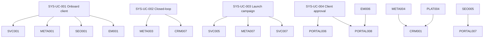

# PTTADS — Catalog Use Case

> **Phiên bản:** 1.0 · **Ngày:** 2026-07-25  
> **Phạm vi:** Toàn hệ thống PTT Agency Operating Platform (Nest + ops-web + portal-web)  
> **Tham chiếu:** [`SPEC_AGENCY_OPERATING_PLATFORM.md`](../SPEC_AGENCY_OPERATING_PLATFORM.md) · [`handover/README.md`](../handover/README.md)

---

## 1. Quy ước đặt tên

| Prefix | Module | File |
|--------|--------|------|
| **SYS** | Cross-system (đa phân hệ) | [`00-SYSTEM-OVERVIEW.md`](00-SYSTEM-OVERVIEW.md) |
| **CRM** | CRM Core — Lead, Customer, CSKH | [`01-CRM-CORE.md`](01-CRM-CORE.md) |
| **SVC** | Service Delivery & Agency | [`02-AGENCY-SERVICE-DELIVERY.md`](02-AGENCY-SERVICE-DELIVERY.md) |
| **META** | Meta Enterprise Ops | [`03-META-ENTERPRISE.md`](03-META-ENTERPRISE.md) |
| **SEO** | SEO/AEO Enterprise Ops | [`04-SEO-AEO.md`](04-SEO-AEO.md) |
| **EM** | Email Marketing Enterprise Ops | [`05-EMAIL-MARKETING.md`](05-EMAIL-MARKETING.md) |
| **PORTAL** | Client Portal | [`06-CLIENT-PORTAL.md`](06-CLIENT-PORTAL.md) |
| **PLAT** | Platform — Auth, Webhook, Admin | [`07-PLATFORM-AUTH-WEBHOOKS.md`](07-PLATFORM-AUTH-WEBHOOKS.md) |
| **ZALO** | Zalo Ads Operating System | [`08-ZALO-ADS.md`](08-ZALO-ADS.md) |
| **AI** | AI Revenue Operating System | [`09-AI-REVENUE-OS.md`](09-AI-REVENUE-OS.md) |
| **MKTP** | AI Marketing Planner (Triển khai DV) | [`10-MKT-AI-PLANNER.md`](10-MKT-AI-PLANNER.md) |
| **MOB** | Mobile Experience (PWA / Push) | [`../specs/modules/RNOSAI-BA-MOB-UseCases.md`](../specs/modules/RNOSAI-BA-MOB-UseCases.md) · [`../specs/2026-08-01-rnosai-mobile-strategy-spec.md`](../specs/2026-08-01-rnosai-mobile-strategy-spec.md) |

**Format mỗi UC:** ID · Tên · Actor · Priority (P0/P1/P2) · Trigger · Main flow · Extensions · Postconditions · Rules · Traceability (Screen/API)

**Chi tiết hành động người dùng (v1.1):** Mỗi UC có bảng bước click/form/API trong [`actions/`](actions/README.md) · Gap analysis: [`ACTION-GAP-ANALYSIS.md`](ACTION-GAP-ANALYSIS.md)

**Priority:**

- **P0** — Bắt buộc go-live / revenue-critical
- **P1** — Enterprise depth / compliance
- **P2** — Nice-to-have / pilot optional

---

## 2. Ma trận Actor × Module

| Actor | CRM | SVC | Meta | SEO | EM | Zalo | Portal | Plat | AI | MKTP |
|-------|-----|-----|------|-----|-----|------|--------|------|-----|------|
| Super Admin | ● | ● | ● | ● | ● | ● | ● | ● | ● | ● |
| AM | ● | ● | ○ | ○ | ○ | ○ | ○ | ○ | ○ | ○ |
| CSKH / Sales | ● | ○ | ○ | ○ | ○ | ○ | ○ | ○ | ● | ○ |
| Solution / SP | ○ | ● | ○ | ○ | ○ | ○ | ○ | ○ | ○ | ● |
| Media Buyer | ○ | ○ | ● | ○ | ○ | ● | ○ | ○ | ○ | ○ |
| Creative Lead | ○ | ● | ● | ○ | ○ | ○ | ○ | ○ | ○ | ○ |
| Tracking/Tech | ○ | ○ | ● | ● | ○ | ● | ○ | ● | ○ | ○ |
| SEO Strategist | ○ | ○ | ○ | ● | ○ | ○ | ○ | ○ | ○ | ○ |
| Email Strategist | ○ | ○ | ○ | ○ | ● | ○ | ○ | ○ | ○ | ○ |
| Compliance | ○ | ○ | ○ | ● | ● | ○ | ○ | ○ | ● | ○ |
| Client Viewer | ○ | ○ | ○ | ○ | ○ | ○ | ● | ○ | ○ | ○ |
| Client Approver | ○ | ○ | ○ | ○ | ○ | ○ | ● | ○ | ○ | ○ |
| End Subscriber | ○ | ○ | ○ | ○ | ● | ○ | ○ | ○ | ○ | ○ |
| System (Webhook/Worker) | ● | ○ | ● | ● | ● | ● | ○ | ● | ● | ● |
| MKT Lead / GDKD | ○ | ○ | ○ | ○ | ○ | ○ | ○ | ○ | ○ | ● |

● = actor chính · ○ = actor phụ / có thể

---

## 3. Danh sách Use Case theo module

### 3.1. System (SYS) — 12 UC

| ID | Tên | Priority |
|----|-----|----------|
| SYS-UC-001 | Onboard client mới end-to-end | P0 |
| SYS-UC-002 | Closed-loop Spend → Lead → Revenue | P0 |
| SYS-UC-003 | Launch campaign đa kênh có governance | P0 |
| SYS-UC-004 | Client approval cross-module | P0 |
| SYS-UC-005 | Báo cáo định kỳ cho khách hàng | P0 |
| SYS-UC-006 | Offboard client & thu hồi quyền | P1 |
| SYS-UC-007 | Drill-down executive ≤3 clicks | P1 |
| SYS-UC-008 | Incident P1 — webhook down | P0 |
| SYS-UC-009 | Staged prod cutover module flag | P1 |
| SYS-UC-010 | Audit trail tra cứu cross-module | P1 |
| SYS-UC-011 | Multi-client isolation verify | P0 |
| SYS-UC-012 | Hypercare post go-live | P1 |

### 3.2. CRM Core (CRM) — 15 UC

| ID | Tên | Priority |
|----|-----|----------|
| CRM-UC-001 | Đăng nhập & phân công lead tự động | P0 |
| CRM-UC-002 | Chăm sóc lead B2 (Liên hệ OK) | P0 |
| CRM-UC-003 | Review queue GDKD | P0 |
| CRM-UC-004 | Add-on ngành trên lead | P1 |
| CRM-UC-005 | Pre-sales & KH MKT sơ bộ | P0 |
| CRM-UC-006 | Chuyển lead → Proposal/HĐ | P0 |
| CRM-UC-007 | Convert → Customer + Case | P0 |
| CRM-UC-008 | Quản lý bảng CSKH | P0 |
| CRM-UC-009 | Pipeline sales & đề xuất | P1 |
| CRM-UC-010 | Dự án BĐS (RE Projects) | P1 |
| CRM-UC-011 | Hub hợp đồng & lifecycle | P0 |
| CRM-UC-012 | Catalog dịch vụ/ngành | P1 |
| CRM-UC-013 | KPI nhân sự & chấm công | P1 |
| CRM-UC-014 | Dashboard kinh doanh chủ DN | P1 |
| CRM-UC-015 | Import/export lead | P1 |

### 3.3. Service Delivery & Agency (SVC) — 12 UC

| ID | Tên | Priority |
|----|-----|----------|
| SVC-UC-001 | Workflow lifecycle 7 stage | P0 |
| SVC-UC-002 | Onboard checklist client | P0 |
| SVC-UC-003 | Deliver stage — TMMT chính thức | P0 |
| SVC-UC-004 | Handover → Retain + finance gate | P0 |
| SVC-UC-005 | Launch QA checklist | P0 |
| SVC-UC-006 | Creative Hub upload & review | P0 |
| SVC-UC-007 | Campaign Write queue approval | P0 |
| SVC-UC-008 | Map channel account (Meta/Google) | P0 |
| SVC-UC-009 | Agency ingest monitor | P1 |
| SVC-UC-010 | KPI definitions agency-wide | P1 |
| SVC-UC-011 | SOP & marketing plan | P1 |
| SVC-UC-012 | Offboarding SOP | P1 |

### 3.4. Meta Enterprise (META) — 14 UC

| ID | Tên | Priority |
|----|-----|----------|
| META-UC-001 | Kết nối ad account & sync insights | P0 |
| META-UC-002 | Hub map campaign ↔ CRM | P0 |
| META-UC-003 | Xem CPL/ROAS trên hub | P0 |
| META-UC-004 | Webhook lead Meta → CRM | P0 |
| META-UC-005 | CAPI event gửi & dedup | P0 |
| META-UC-006 | Tracking health & pixel test | P0 |
| META-UC-007 | Launch Ads wizard | P0 |
| META-UC-008 | Edit campaign có governance | P0 |
| META-UC-009 | Anomaly detection & alert | P1 |
| META-UC-010 | Intelligence forecast | P1 |
| META-UC-011 | Breakdown insights (platform/placement) | P1 |
| META-UC-012 | Pause domain/client spend emergency | P0 |
| META-UC-013 | Weekly client PDF report | P1 |
| META-UC-014 | Horizon migration signoff | P1 |

### 3.5. SEO/AEO (SEO) — 14 UC

| ID | Tên | Priority |
|----|-----|----------|
| SEO-UC-001 | Onboard client SEO workspace | P0 |
| SEO-UC-002 | OAuth GSC & sync | P0 |
| SEO-UC-003 | OAuth GA4 & sync | P0 |
| SEO-UC-004 | Research → import keywords | P0 |
| SEO-UC-005 | Content pipeline stage advance | P0 |
| SEO-UC-006 | Governance block publish | P0 |
| SEO-UC-007 | Technical audit & issue fix | P0 |
| SEO-UC-008 | AEO scan & coverage | P1 |
| SEO-UC-009 | CMS publish webhook | P1 |
| SEO-UC-010 | Freshness queue refresh | P1 |
| SEO-UC-011 | Rank tracker capture | P1 |
| SEO-UC-012 | Executive hub drill-down | P0 |
| SEO-UC-013 | Client PDF report export | P0 |
| SEO-UC-014 | ClickHouse BI export | P1 |

### 3.6. Email Marketing (EM) — 14 UC

| ID | Tên | Priority |
|----|-----|----------|
| EM-UC-001 | Onboard email workspace & domain | P0 |
| EM-UC-002 | Capture form → consent | P0 |
| EM-UC-003 | Import contacts CSV | P0 |
| EM-UC-004 | Segment compute (RFM/behavior) | P0 |
| EM-UC-005 | Template studio + preflight | P0 |
| EM-UC-006 | Campaign broadcast F1 | P0 |
| EM-UC-007 | Staff + client approval | P0 |
| EM-UC-008 | ESP send & webhook engagement | P0 |
| EM-UC-009 | Suppression & one-click unsub | P0 |
| EM-UC-010 | Deliverability incident F3 | P0 |
| EM-UC-011 | Journey automation activate | P1 |
| EM-UC-012 | Governance rule CRUD | P1 |
| EM-UC-013 | Reports & Grafana BI | P1 |
| EM-UC-014 | Public preference center | P0 |

### 3.7. Client Portal (PORTAL) — 15 UC

| ID | Tên | Priority |
|----|-----|----------|
| PORTAL-UC-001 | Login portal scoped client | P0 |
| PORTAL-UC-002 | Dashboard KPI multi-module | P0 |
| PORTAL-UC-003 | Meta performance view + CSV | P0 |
| PORTAL-UC-004 | SEO summary view | P1 |
| PORTAL-UC-005 | Email campaign stats | P1 |
| PORTAL-UC-006 | Approval inbox Meta creative | P0 |
| PORTAL-UC-007 | Approval SEO content | P1 |
| PORTAL-UC-008 | Approval email campaign | P1 |
| PORTAL-UC-009 | Reject with comment | P0 |
| PORTAL-UC-010 | Export & download artifact | P0 |
| PORTAL-UC-011 | Quên mật khẩu / reset | P0 |
| PORTAL-UC-012 | Đổi mật khẩu khi đã login | P1 |
| PORTAL-UC-013 | Zalo performance view + export | P0 |
| PORTAL-UC-014 | Zalo creative approval | P1 |
| PORTAL-UC-015 | Google performance view | P1 |

### 3.8. Platform (PLAT) — 10 UC

| ID | Tên | Priority |
|----|-----|----------|
| PLAT-UC-001 | Staff JWT login & refresh | P0 |
| PLAT-UC-002 | RBAC cap enforcement | P0 |
| PLAT-UC-003 | Portal JWT login | P0 |
| PLAT-UC-004 | Webhook Meta ingest | P0 |
| PLAT-UC-005 | Webhook Zalo/Google ingest | P0 |
| PLAT-UC-006 | Webhook Email ESP ingest | P0 |
| PLAT-UC-007 | Job queue worker process | P0 |
| PLAT-UC-008 | Temporal approval workflow | P1 |
| PLAT-UC-009 | Seed staff permissions | P0 |
| PLAT-UC-010 | Health check & soak evidence | P1 |

### 3.9. Zalo Ads (ZALO) — 21 UC

| ID | Tên | Priority |
|----|-----|----------|
| ZALO-UC-001 | Kết nối Zalo Ads / OA | P0 |
| ZALO-UC-002 | Hub map campaign | P0 |
| ZALO-UC-003 | Sync insights → daily_performance | P0 |
| ZALO-UC-004 | Hub CPL staff | P0 |
| ZALO-UC-005 | Portal performance | P0 |
| ZALO-UC-006 | Brief chiến dịch | P1 |
| ZALO-UC-007 | Tạo campaign draft | P1 |
| ZALO-UC-008 | Duyệt nội dung | P1 |
| ZALO-UC-009 | Triển khai lên Zalo (API) | P2 |
| ZALO-UC-010 | Pause/update/stop campaign | P2 |
| ZALO-UC-011 | Webhook lead → CRM | P0 |
| ZALO-UC-012 | Poll form lead API | P0 |
| ZALO-UC-013 | Dedup & chuẩn hóa lead | P0 |
| ZALO-UC-014 | CRM pipeline | P0 |
| ZALO-UC-015 | CRM status sync hub | P1 |
| ZALO-UC-016 | Xuất báo cáo KH | P1 |
| ZALO-UC-017 | Cảnh báo bất thường | P1 |
| ZALO-UC-018 | Phân tích đa chiều | P2 |
| ZALO-UC-019 | Client duyệt budget | P1 |
| ZALO-UC-020 | Thông báo tiến độ | P1 |
| ZALO-UC-021 | Onboard orchestrator Zalo | P1 |

### 3.10. AI Revenue OS (AI) — 20 UC

| ID | Tên | Priority |
|----|-----|----------|
| AI-UC-001 | Lead score async sau ingest | P0 |
| AI-UC-002 | Copilot — Lead brief | P0 |
| AI-UC-003 | Copilot — Summarize activity | P0 |
| AI-UC-004 | Follow-up draft + approve | P0 |
| AI-UC-005 | Xem score + explainability | P0 |
| AI-UC-006 | Manager override score | P1 |
| AI-UC-007 | Dismiss recommendation + reason | P1 |
| AI-UC-008 | Timeline enrich cho AI context | P0 |
| AI-UC-009 | AI audit / agent run trace | P0 |
| AI-UC-010 | Pilot gate / feature flag | P0 |
| AI-UC-011 | NBA trên deal stalled | P0 (R2) |
| AI-UC-012 | Deal score | P1 (R2) |
| AI-UC-013 | Forecast commit | P1 (R3) |
| AI-UC-014 | Renewal agent workflow | P1 (R3) |
| AI-UC-015 | Pipeline risk & smart reminder | P1 (R2) |
| AI-UC-016 | NL analytics curated | P2 (R3) |
| AI-UC-017 | Churn & CS health score | P1 (R3) |
| AI-UC-018 | Manager coach weekly digest | P2 (R3) |
| AI-UC-019 | Channel CPL/ROAS anomaly digest | P2 (R4) |
| AI-UC-020 | Workflow AI node simulate + publish | P1 (R2) |

### 3.11. AI Marketing Planner (MKTP) — 20 UC

| ID | Tên | Priority |
|----|-----|----------|
| MKTP-UC-001 | Mở AI Planner context | P0 |
| MKTP-UC-002 | Lưu Brief intake | P0 |
| MKTP-UC-003 | Sinh chiến lược AI | P0 |
| MKTP-UC-004 | Sinh chiến dịch AI | P0 |
| MKTP-UC-005 | Sinh lịch nội dung | P0 |
| MKTP-UC-006 | Chỉnh sửa draft | P0 |
| MKTP-UC-007 | Quality score | P0 |
| MKTP-UC-008 | Apply TMMT chính thức | P0 |
| MKTP-UC-009 | Retry job giữ draft | P0 |
| MKTP-UC-010 | Export PDF/DOCX/XLSX | P0 |
| MKTP-UC-011 | Brand KB RAG | P1 |
| MKTP-UC-012 | Budget simulator | P1 |
| MKTP-UC-013 | Approval workflow | P1 |
| MKTP-UC-014 | Version compare | P1 |
| MKTP-UC-015 | Presales R5 bridge | P1 |
| MKTP-UC-016 | KPI dashboard | P1 |
| MKTP-UC-017 | Optimization copilot | P2 |
| MKTP-UC-018 | KPI drift alert | P2 |
| MKTP-UC-019 | Multi-agent pipeline | P2 |
| MKTP-UC-020 | Industry playbook | P2 |

**Tổng:** ~167 use cases documented

---

## 4. Sơ đồ phụ thuộc Use Case hệ thống

---

## 5. Traceability spec

| Spec | Use case file |
|------|---------------|
| [`SPEC_AGENCY_OPERATING_PLATFORM.md`](../SPEC_AGENCY_OPERATING_PLATFORM.md) | 00, 01, 02, 07 |
| [`SPEC_META_ENTERPRISE_PTTADS.md`](../SPEC_META_ENTERPRISE_PTTADS.md) | 03 |
| [`SPEC_SEO_AEO_OPERATING_SYSTEM.md`](../SPEC_SEO_AEO_OPERATING_SYSTEM.md) | 04 |
| [`SPEC_EMAIL_MARKETING_OPERATING_SYSTEM.md`](../SPEC_EMAIL_MARKETING_OPERATING_SYSTEM.md) | 05 |
| [`SPEC_ZALO_ADS_OPERATING_SYSTEM.md`](../SPEC_ZALO_ADS_OPERATING_SYSTEM.md) | 08 |
| [`SPEC_AI_REVENUE_OPERATING_SYSTEM.md`](../SPEC_AI_REVENUE_OPERATING_SYSTEM.md) | 09 · AI-01…10 · §5.2 agents |
| [`specs/2026-07-26-ai-phase1-90-day-plan.md`](../specs/2026-07-26-ai-phase1-90-day-plan.md) | AI-UC-001…010, UAT tuần 11 |
| [`SPEC_UI_UX_*`](../SPEC_UI_UX_PTT.md) | Screen refs trong từng UC |
| [`SPEC_UI_UX_AI_REVENUE_OS.md`](../SPEC_UI_UX_AI_REVENUE_OS.md) | AI Copilot, forecast, automation UI |
| [`product-model-v1.md`](../product-model-v1.md) | CRM-UC-001…007 |

---

## 6. Cách đọc tài liệu

1. Bắt đầu [`00-SYSTEM-OVERVIEW.md`](00-SYSTEM-OVERVIEW.md) — luồng end-to-end đa module.
2. **UAT / đào tạo:** đọc [`actions/README.md`](actions/README.md) — bảng hành động từng bước theo màn hình thực tế.
3. **Gap sản phẩm:** [`ACTION-GAP-ANALYSIS.md`](ACTION-GAP-ANALYSIS.md) — UC nào thiếu UI / cần workaround.
4. Đọc module theo vai trò (Buyer → 03, Strategist SEO → 04, …).
5. Portal khách → 06 · DevOps/Integration → 07.

**Cập nhật:** Khi thêm feature, tạo UC mới cùng prefix module; không tái sử dụng ID đã publish.
